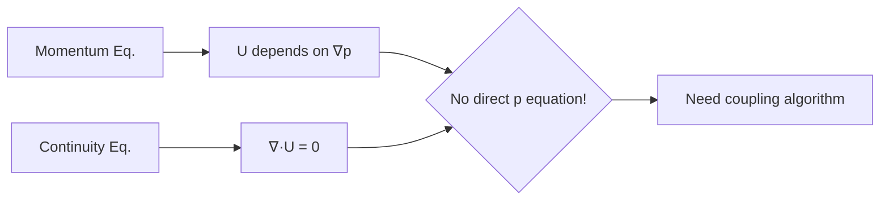
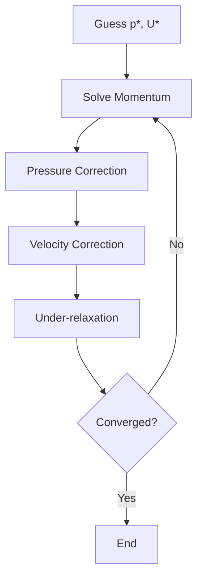

# Pressure-Velocity Coupling Overview

ภาพรวมการเชื่อมโยงความดัน-ความเร็วใน OpenFOAM

> **ทำไมต้องเข้าใจ Pressure-Velocity Coupling?**
> - เป็น **หัวใจของ CFD algorithms** — SIMPLE, PISO, PIMPLE
> - ถ้าไม่เข้าใจ = ตั้งค่า fvSolution ผิด = diverge หรือช้า
> - รู้ว่าเมื่อไหร่ใช้ algorithm ไหน → ประหยัดเวลา + ได้ผลถูก

---

## The Core Problem

> **💡 ปัญหาหลัก: ไม่มีสมการความดันโดยตรง!**
>
> - Momentum → หา U ถ้ารู้ ∇p
> - Continuity → ∇·U = 0 (constraint ไม่ใช่ equation)
> - **Solution:** Derive pressure equation from continuity + momentum



### Incompressible Flow Equations

**Continuity:**
$$\nabla \cdot \mathbf{u} = 0$$

**Momentum:**
$$\rho \frac{\partial \mathbf{u}}{\partial t} + \rho (\mathbf{u} \cdot \nabla) \mathbf{u} = -\nabla p + \mu \nabla^2 \mathbf{u}$$

**Problem:** ไม่มีสมการ $p$ โดยตรง — ความดันทำหน้าที่เป็น Lagrange multiplier

---

## 1. Algorithm Comparison

| Algorithm | Type | Use Case | Key Setting |
|-----------|------|----------|-------------|
| **SIMPLE** | Steady | RANS, natural convection | `simpleFoam` |
| **PISO** | Transient | LES, DNS, accurate time | `pisoFoam` |
| **PIMPLE** | Transient | Large Δt, multiphase | `pimpleFoam` |

---

## 2. SIMPLE Algorithm

**Semi-Implicit Method for Pressure-Linked Equations**



### Key Settings

```cpp
SIMPLE
{
    nNonOrthogonalCorrectors 0;
    pRefCell  0;
    pRefValue 0;
    
    relaxationFactors
    {
        fields { p 0.3; }
        equations { U 0.7; k 0.7; epsilon 0.7; }
    }
}
```

---

## 3. PISO Algorithm

**Pressure-Implicit with Splitting of Operators**

- ไม่ต้อง under-relaxation
- Multiple corrector steps per time step
- ต้องการ $Co < 1$

```cpp
PISO
{
    nCorrectors 2;
    nNonOrthogonalCorrectors 0;
    pRefCell  0;
    pRefValue 0;
}
```

---

## 4. PIMPLE Algorithm

**PISO + SIMPLE Hybrid**

- Outer loops (SIMPLE-like) + Inner loops (PISO-like)
- รองรับ $Co > 1$
- เหมาะกับ multiphase, moving mesh

```cpp
PIMPLE
{
    nOuterCorrectors 2;
    nCorrectors 2;
    nNonOrthogonalCorrectors 0;
    
    relaxationFactors
    {
        fields { p 0.3; }
        equations { U 0.7; }
    }
}
```

---

## 5. Rhie-Chow Interpolation

ป้องกัน checkerboard pressure บน collocated grid:

$$\mathbf{u}_f = \overline{\mathbf{u}}_f - \mathbf{D}_f (\nabla p_f - \overline{\nabla p}_f)$$

```cpp
// Face flux calculation
phi = phiU - gradpByA;
```

---

## 6. Non-Orthogonal Correction

| Mesh Quality | Non-orthogonality | `nNonOrthogonalCorrectors` |
|--------------|-------------------|---------------------------|
| Excellent | < 30° | 0-1 |
| Good | 30-60° | 1-2 |
| Acceptable | 60-70° | 2-3 |
| Poor | > 70° | 3+ or fix mesh |

---

## 7. Quick Reference

| Parameter | SIMPLE | PISO | PIMPLE |
|-----------|--------|------|--------|
| α_p | 0.2-0.3 | 1.0 | 0.3-0.7 |
| α_U | 0.5-0.7 | 1.0 | 0.6-0.9 |
| nCorrectors | 1 | 2-3 | 2 |
| nOuterCorrectors | N/A | N/A | 2-5 |
| Co limit | ∞ (pseudo) | < 1 | > 1 OK |

---

## 8. Solver Selection

| Application | Solver | Reason |
|-------------|--------|--------|
| Steady aerodynamics | `simpleFoam` | Efficient for RANS |
| Vortex shedding | `pisoFoam` | Accurate time resolution |
| Multiphase VOF | `pimpleFoam` | Handles density ratio |
| Moving mesh | `pimpleFoam` | Outer relaxation stabilizes |
| LES/DNS | `pisoFoam` | Time accuracy critical |

---

## Concept Check

<details>
<summary><b>1. ทำไมความดันใน incompressible flow ถึงเรียกว่า Lagrange multiplier?</b></summary>

เพราะความดันไม่ได้มาจาก equation of state แต่เป็นตัวแปรที่ "บังคับ" ให้ $\nabla \cdot \mathbf{u} = 0$ — มันไม่ใช่ thermodynamic variable แต่เป็น mathematical constraint enforcer
</details>

<details>
<summary><b>2. Rhie-Chow interpolation แก้ปัญหาอะไร?</b></summary>

แก้ปัญหา **checkerboard pressure** บน collocated grid — ถ้าไม่มี ความดันอาจแกว่งสูง-ต่ำสลับกันระหว่างเซลล์โดยที่ solver ไม่รู้ตัว เพราะ average gradient ยังดูปกติ
</details>

<details>
<summary><b>3. PIMPLE ดีกว่า PISO อย่างไรสำหรับ large time steps?</b></summary>

PIMPLE มี **outer corrector loops** ที่ทำงานเหมือน SIMPLE — ช่วยให้ลู่เข้าได้แม้ $Co > 1$ โดย PISO จะ diverge ถ้า time step ใหญ่เกินไป
</details>

---

## Related Documents

- **บทถัดไป:** [01_Mathematical_Foundation.md](01_Mathematical_Foundation.md)
- **SIMPLE:** [02_SIMPLE_Algorithm.md](02_SIMPLE_Algorithm.md)
- **PISO/PIMPLE:** [03_PISO_and_PIMPLE_Algorithms.md](03_PISO_and_PIMPLE_Algorithms.md)