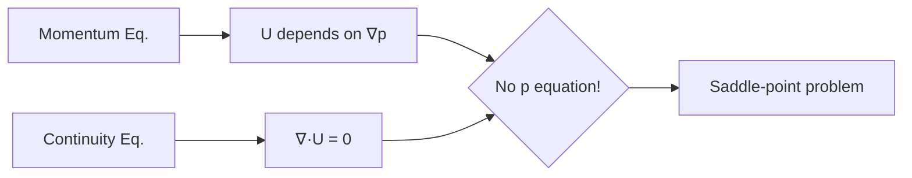

# Mathematical Foundation of Pressure-Velocity Coupling

รากฐานทางคณิตศาสตร์ของการเชื่อมโยงความดัน-ความเร็ว

---

## The Problem



**Incompressible Navier-Stokes:**

$$\nabla \cdot \mathbf{u} = 0$$

$$\rho \frac{\partial \mathbf{u}}{\partial t} + \rho (\mathbf{u} \cdot \nabla)\mathbf{u} = -\nabla p + \mu \nabla^2 \mathbf{u}$$

> ความดันทำหน้าที่เป็น **Lagrange multiplier** เพื่อบังคับ $\nabla \cdot \mathbf{u} = 0$

---

## 1. FVM Discretization

### Semi-Discretized Momentum

$$a_P \mathbf{u}_P + \sum_N a_N \mathbf{u}_N = \mathbf{b}_P - \nabla p_P$$

| Symbol | Meaning |
|--------|---------|
| $a_P$ | Diagonal coefficient |
| $a_N$ | Neighbor coefficients |
| $\mathbf{b}_P$ | Source term |

### H-Operator Form

$$\mathbf{u}_P = \frac{\mathbf{H}(\mathbf{u})}{a_P} - \frac{1}{a_P}\nabla p$$

**Where:**
$$\mathbf{H}(\mathbf{u}) = \mathbf{b}_P - \sum_N a_N \mathbf{u}_N$$

---

## 2. Pressure Equation Derivation

นำ divergence ของ H-form และใช้ $\nabla \cdot \mathbf{u} = 0$:

$$\nabla \cdot \left(\frac{1}{a_P}\nabla p\right) = \nabla \cdot \left(\frac{\mathbf{H}(\mathbf{u})}{a_P}\right)$$

นี่คือ **Pressure Poisson Equation**

---

## 3. OpenFOAM Implementation

### Key Variables

| Math | OpenFOAM |
|------|----------|
| $1/a_P$ | `rAU` or `1.0/UEqn.A()` |
| $\mathbf{H}/a_P$ | `HbyA` |
| $\nabla p$ | `fvc::grad(p)` |
| $\nabla \cdot \mathbf{u}$ | `fvc::div(U)` |
| $\nabla^2 p$ | `fvm::laplacian(p)` |

### pEqn.H Structure

```cpp
// 1. Calculate 1/A and H/A
volScalarField rAU(1.0/UEqn.A());
volVectorField HbyA(constrainHbyA(rAU*UEqn.H(), U, p));

// 2. Face flux without pressure
surfaceScalarField phiHbyA("phiHbyA", fvc::flux(HbyA));

// 3. Solve pressure Poisson
fvScalarMatrix pEqn
(
    fvm::laplacian(rAU, p) == fvc::div(phiHbyA)
);
pEqn.solve();

// 4. Velocity correction
U = HbyA - rAU*fvc::grad(p);
U.correctBoundaryConditions();
```

---

## 4. Rhie-Chow Interpolation

ป้องกัน checkerboard pressure บน collocated grid:

$$\mathbf{u}_f = \overline{\mathbf{u}}_f - \overline{\left(\frac{1}{a_P}\right)}_f (\nabla p_f - \overline{\nabla p}_f)$$

```cpp
// Face flux with Rhie-Chow
surfaceScalarField phiHbyA
(
    (fvc::interpolate(HbyA) & mesh.Sf())
  - rAUf*fvc::snGrad(p)*mesh.magSf()  // Rhie-Chow term
);
```

---

## 5. Under-Relaxation

$$\mathbf{u}^{k+1} = \mathbf{u}^k + \alpha_u (\mathbf{u}^* - \mathbf{u}^k)$$
$$p^{k+1} = p^k + \alpha_p p'$$

| Variable | Typical Range |
|----------|---------------|
| $\alpha_u$ | 0.5-0.7 |
| $\alpha_p$ | 0.2-0.4 |

```cpp
// system/fvSolution
relaxationFactors
{
    fields  { p 0.3; }
    equations { U 0.7; }
}
```

---

## 6. Solver Settings

```cpp
// system/fvSolution
p
{
    solver          GAMG;
    preconditioner  DIC;
    tolerance       1e-06;
    relTol          0.01;
}

U
{
    solver          smoothSolver;
    smoother        GaussSeidel;
    tolerance       1e-06;
    relTol          0.01;
}
```

---

## Quick Reference

| Equation | OpenFOAM Code |
|----------|---------------|
| Pressure Poisson | `fvm::laplacian(rAU, p) == fvc::div(phiHbyA)` |
| Velocity correction | `U = HbyA - rAU*fvc::grad(p)` |
| Face flux | `phi = phiHbyA - rAUf*fvc::snGrad(p)*mesh.magSf()` |

---

## Concept Check

<details>
<summary><b>1. ทำไมถึงเรียก pressure ว่า Lagrange multiplier?</b></summary>

เพราะมันไม่ได้มาจาก conservation law โดยตรง แต่เป็นตัวแปรที่ "บังคับ" constraint $\nabla \cdot \mathbf{u} = 0$ — ในการไหล incompressible ความดันไม่ใช่ thermodynamic variable
</details>

<details>
<summary><b>2. HbyA คืออะไรในทางฟิสิกส์?</b></summary>

คือ **ความเร็วที่ขับเคลื่อนโดยทุกเทอมยกเว้นความดัน** — เป็น "predicted velocity" ก่อน pressure correction
</details>

<details>
<summary><b>3. Rhie-Chow แก้ปัญหาอะไร?</b></summary>

แก้ **checkerboard pressure** บน collocated grid — ถ้าใช้ linear interpolation เฉยๆ ความดันอาจแกว่งสลับ high-low ระหว่างเซลล์โดย solver ไม่รู้ตัว
</details>

---

## Related Documents

- **ภาพรวม:** [00_Overview.md](00_Overview.md)
- **บทถัดไป:** [02_SIMPLE_Algorithm.md](02_SIMPLE_Algorithm.md)
- **PISO/PIMPLE:** [03_PISO_and_PIMPLE_Algorithms.md](03_PISO_and_PIMPLE_Algorithms.md)