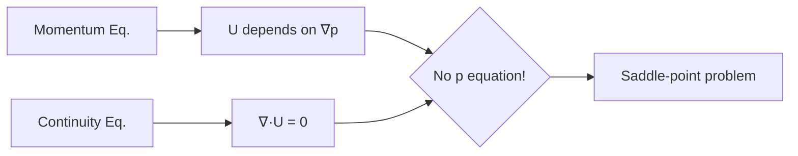

# 01_Mathematical_Foundation.md

# Mathematical Foundation of Pressure-Velocity Coupling

รากฐานทางคณิตศาสตร์ของการเชื่อมโยงความดัน-ความเร็ว

> **ทำไมต้องเข้าใจ P-V Coupling?**
> - **Incompressible NS ไม่มีสมการวิวัฒนาการ p** — ต้อง derive
> - เข้าใจ **H-operator** = เข้าใจ solver code
> - Rhie-Chow interpolation = ป้องกัน checkerboard

---

## Learning Objectives

เมื่ออ่านจบบทนี้ คุณจะสามารถ:

1. **อธิบาย** ปัญหา saddle-point ใน incompressible Navier-Stokes equations และบทบาทของความดันเป็น Lagrange multiplier
2. ** derive** Pressure Poisson Equation จาก discretized momentum equation โดยใช้ H-operator formulation
3. **แปลง** สมการทางคณิตศาสตร์เป็น OpenFOAM code (rAU, HbyA, fvm::laplacian, fvc::div)
4. **อธิบาย** หลักการของ Rhie-Chow interpolation ในการป้องกัน checkerboard pressure
5. **ตั้งค่า** under-relaxation parameters และ linear solvers สำหรับ pressure-velocity coupling

---

## 1. The Problem: Saddle-Point Formulation

### 1.1 Incompressible Navier-Stokes Equations



**Continuity Equation:**
$$\nabla \cdot \mathbf{u} = 0$$

**Momentum Equation:**
$$\rho \frac{\partial \mathbf{u}}{\partial t} + \rho (\mathbf{u} \cdot \nabla)\mathbf{u} = -\nabla p + \mu \nabla^2 \mathbf{u}$$

> **Key Insight:** ความดันทำหน้าที่เป็น **Lagrange multiplier** เพื่อบังคับ constraint $\nabla \cdot \mathbf{u} = 0$ — ไม่ใช่ thermodynamic variable ในของไหล incompressible

---

## 2. Finite Volume Discretization

### 2.1 Semi-Discretized Momentum Equation

$$a_P \mathbf{u}_P + \sum_N a_N \mathbf{u}_N = \mathbf{b}_P - \nabla p_P$$

| Symbol | Meaning |
|--------|---------|
| $a_P$ | Diagonal coefficient (central cell) |
| $a_N$ | Neighbor coefficients |
| $\mathbf{b}_P$ | Source term (convection, diffusion, external forces) |

### 2.2 H-Operator Formulation

Isolate $\mathbf{u}_P$:

$$\mathbf{u}_P = \frac{\mathbf{H}(\mathbf{u})}{a_P} - \frac{1}{a_P}\nabla p$$

**Where:**
$$\mathbf{H}(\mathbf{u}) = \mathbf{b}_P - \sum_N a_N \mathbf{u}_N$$

> **Physical Meaning:** $\mathbf{H}(\mathbf{u})/a_P$ คือ "predicted velocity" ที่ขับเคลื่อนโดยทุกเทอมยกเว้นความดัน

---

## 3. Pressure Poisson Equation

### 3.1 Derivation

นำ divergence ของ H-form และบังคับ continuity constraint $\nabla \cdot \mathbf{u} = 0$:

$$\nabla \cdot \left(\frac{1}{a_P}\nabla p\right) = \nabla \cdot \left(\frac{\mathbf{H}(\mathbf{u})}{a_P}\right)$$

นี่คือ **Pressure Poisson Equation (PPE)** — สมการวิวัฒนาการสำหรับความดัน

### 3.2 Mathematical Structure

| Component | Mathematical Role |
|-----------|-------------------|
| Left side | Diffusion operator → elliptic (well-posed) |
| Right side | Divergence of H-field → mass conservation source |

---

## 4. OpenFOAM Implementation

### 4.1 Key Variables Mapping

| Math Symbol | OpenFOAM Variable | Description |
|-------------|-------------------|-------------|
| $1/a_P$ | `rAU` | Reciprocal diagonal coefficient |
| $\mathbf{H}/a_P$ | `HbyA` | Predicted velocity |
| $\nabla p$ | `fvc::grad(p)` | Pressure gradient (explicit) |
| $\nabla \cdot \mathbf{u}$ | `fvc::div(U)` | Divergence (explicit) |
| $\nabla^2 p$ | `fvm::laplacian(p)` | Laplacian (implicit) |

### 4.2 pEqn.H Structure

```cpp
// 1. Calculate 1/A and H/A
volScalarField rAU(1.0/UEqn.A());
volVectorField HbyA(constrainHbyA(rAU*UEqn.H(), U, p));

// 2. Face flux without pressure
surfaceScalarField phiHbyA("phiHbyA", fvc::flux(HbyA));

// 3. Solve pressure Poisson
fvScalarMatrix pEqn
(
    fvm::laplacian(rAU, p) == fvc::div(phiHbyA)
);
pEqn.solve();

// 4. Velocity correction
U = HbyA - rAU*fvc::grad(p);
U.correctBoundaryConditions();
```

> **Code-to-Math Mapping:**
> - `fvm::laplacian(rAU, p)` → $\nabla \cdot (rAU \nabla p)$
> - `fvc::div(phiHbyA)` → $\nabla \cdot (\mathbf{H}/a_P)$

---

## 5. Rhie-Chow Interpolation

### 5.1 The Checkerboard Problem

บน **collocated grid** (pressure และ velocity เก็บที่เดียวกัน), linear interpolation อาจทำให้เกิด **checkerboard pressure** — ความดันแกว่ง high-low สลับกันระหว่างเซลล์โดยไม่กระทบ continuity equation

### 5.2 Rhie-Chow Formula

$$\mathbf{u}_f = \overline{\mathbf{u}}_f - \overline{\left(\frac{1}{a_P}\right)}_f (\nabla p_f - \overline{\nabla p}_f)$$

**Physical Effect:** Pressure difference ระหว่าง adjacent cells ถูก "smoothed" ที่ face centers ทำให้ไม่เกิด decoupling

### 5.3 OpenFOAM Implementation

```cpp
// Face flux with Rhie-Chow
surfaceScalarField phiHbyA
(
    (fvc::interpolate(HbyA) & mesh.Sf())
  - rAUf*fvc::snGrad(p)*mesh.magSf()  // Rhie-Chow term
);
```

> **Note:** `rAUf` = face-interpolated `rAU`, `snGrad(p)` = surface normal gradient

> **Detailed Coverage:** อ่านรายละเอียดเพิ่มเติมเกี่ยวกับ Rhie-Chow interpolation ได้ใน **[04_Rhie-Chow_Interpolation.md](04_Rhie-Chow_Interpolation.md)**

---

## 6. Numerical Stability

### 6.1 Under-Relaxation

Prevent divergence ใน iterative solution:

**Velocity:**
$$\mathbf{u}^{k+1} = \mathbf{u}^k + \alpha_u (\mathbf{u}^* - \mathbf{u}^k)$$

**Pressure:**
$$p^{k+1} = p^k + \alpha_p p'$$

| Variable | Typical Range | Effect |
|----------|---------------|--------|
| $\alpha_u$ | 0.5-0.7 | Controls velocity update rate |
| $\alpha_p$ | 0.2-0.4 | Controls pressure correction rate |

### 6.2 Configuration File

```cpp
// system/fvSolution
solvers
{
    p
    {
        solver          GAMG;
        preconditioner  DIC;
        tolerance       1e-06;
        relTol          0.01;
    }

    U
    {
        solver          smoothSolver;
        smoother        GaussSeidel;
        tolerance       1e-06;
        relTol          0.01;
    }
}

relaxationFactors
{
    fields  { p 0.3; }
    equations { U 0.7; }
}
```

> **Solver Selection:** GAMG สำหรับ pressure (elliptic), smoothSolver สำหรับ velocity (hyperbolic-dominant)

---

## Key Takeaways

### Mathematical Foundation
- **Saddle-point problem:** Incompressible NS ไม่มี pressure equation ต้อง derive จาก continuity constraint
- **H-operator:** $\mathbf{H}(\mathbf{u}) = \mathbf{b}_P - \sum_N a_N \mathbf{u}_N$ — predicted velocity โดยไม่รวม pressure gradient
- **Pressure Poisson:** $\nabla \cdot (rAU \nabla p) = \nabla \cdot (\mathbf{H}/a_P)$ — elliptic equation ที่ well-posed

### OpenFOAM Implementation
- **Variable mapping:** `rAU` = $1/a_P$, `HbyA` = $\mathbf{H}/a_P$
- **Pressure equation:** `fvm::laplacian(rAU, p) == fvc::div(phiHbyA)`
- **Velocity correction:** `U = HbyA - rAU*fvc::grad(p)`
- **Rhie-Chow:** Face flux interpolation ป้องกัน checkerboard บน collocated grid

### Practical Settings
- **Relaxation:** $\alpha_p = 0.2-0.4$, $\alpha_u = 0.5-0.7$
- **Solvers:** GAMG สำหรับ pressure, smoothSolver/GaussSeidel สำหรับ velocity
- **Tolerance:** 1e-06 absolute, 0.01 relative เป็นค่าเริ่มต้นที่พอเหมาะ

---

## Quick Reference

| Mathematical Concept | OpenFOAM Code |
|---------------------|---------------|
| Pressure Poisson | `fvm::laplacian(rAU, p) == fvc::div(phiHbyA)` |
| Velocity correction | `U = HbyA - rAU*fvc::grad(p)` |
| Face flux (Rhie-Chow) | `phi = phiHbyA - rAUf*fvc::snGrad(p)*mesh.magSf()` |
| H-operator | `HbyA = rAU*UEqn.H()` |
| Inverse diagonal | `rAU = 1.0/UEqn.A()` |

---

## Concept Check

<details>
<summary><b>1. ทำไมถึงเรียก pressure ว่า Lagrange multiplier?</b></summary>

เพราะมันไม่ได้มาจาก conservation law โดยตรง แต่เป็นตัวแปรที่ "บังคับ" constraint $\nabla \cdot \mathbf{u} = 0$ — ในการไหล incompressible ความดันไม่ใช่ thermodynamic variable แต่เป็น mechanical force ที่เกิดจาก constraint ของ mass conservation

**Mathematical Context:** ใน optimization theory, Lagrange multiplier $\lambda$ ใช้บังคับ constraint $g(x)=0$ ใน Lagrangian $\mathcal{L} = f(x) + \lambda g(x)$ — ใน NS, pressure ทำหน้าที่เช่นเดียวกัน
</details>

<details>
<summary><b>2. HbyA คืออะไรในทางฟิสิกส์?</b></summary>

คือ **ความเร็วที่ขับเคลื่อนโดยทุกเทอมยกเว้นความดัน** — เป็น "predicted velocity" ก่อน pressure correction:

$$\frac{\mathbf{H}}{a_P} = \frac{\mathbf{b}_P - \sum_N a_N \mathbf{u}_N}{a_P}$$

**Physical Meaning:** ถ้า pressure gradient = 0, velocity จะไหลด้วยค่านี้ — คือ velocity field ที่ convection, diffusion, และ external forces พยายาม "จะให้ไหล" ก่อน pressure จะมา correct ให้ satisfy continuity
</details>

<details>
<summary><b>3. Rhie-Chow แก้ปัญหาอะไร?</b></summary>

แก้ **checkerboard pressure** บน collocated grid — ถ้าใช้ linear interpolation ธรรมดา:

```
Cell 1: p=100, Cell 2: p=0 → Face: p=50 (linear)
Cell 3: p=100, Cell 4: p=0 → Face: p=50 (linear)
```

Velocity ที่ face 1-2 และ face 3-4 ใช้ pressure difference เดียวกัน → ไม่รู้ว่าความดัน checkerboard อยู่!

**Rhie-Chow Solution:** Add pressure gradient correction term:
$$\Delta u_f = \overline{rAU}_f (\nabla p_f - \overline{\nabla p}_f)$$

ทำให้ velocity "รู้" ถึง local pressure variation และไม่แกว่ง
</details>

<details>
<summary><b>4. ทำไม pressure solver ใช้ GAMG แต่ velocity ใช้ smoothSolver?</b></summary>

- **Pressure equation** (Poisson): Pure elliptic → smooth, long-range coupling → **GAMG** (multigrid) ลด error ที่ความถี่ต่างๆ ได้ดี
- **Momentum equation**: Hyperbolic + elliptic → convection-dominated → local coupling strong → **smoothSolver** (Gauss-Seidel) เพียงพอ

**Performance:** GAMG มี setup cost สูง แต่ converge ไวสำหรับ elliptic problems; smoothSolver มี overhead ต่ำ เหมาะกับ non-symmetric systems
</details>

---

## Related Documents

- **ภาพรวม:** [00_Overview.md](00_Overview.md)
- **บทถัดไป:** [02_SIMPLE_Algorithm.md](02_SIMPLE_Algorithm.md)
- **PISO/PIMPLE:** [03_PISO_and_PIMPLE_Algorithms.md](03_PISO_and_PIMPLE_Algorithms.md)
- **Rhie-Chow Detail:** [04_Rhie-Chow_Interpolation.md](04_Rhie-Chow_Interpolation.md)