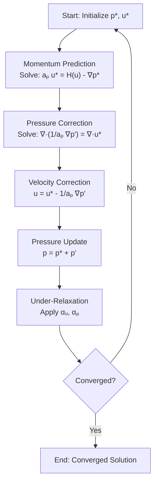
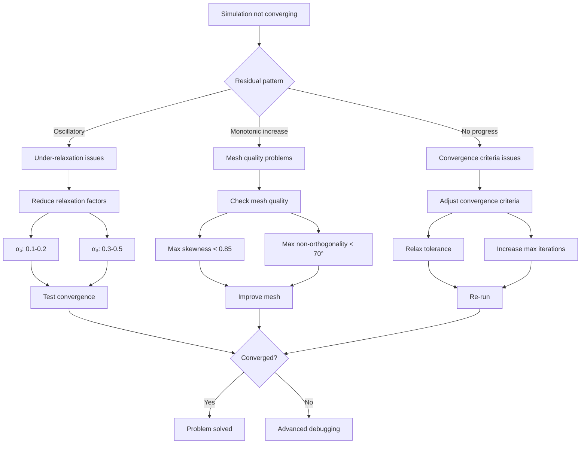

# อัลกอริทึม SIMPLE (Semi-Implicit Method for Pressure-Linked Equations)

## 🎯 วัตถุประสงค์

อัลกอริทึม **SIMPLE (Semi-Implicit Method for Pressure-Linked Equations)** เป็นอัลกอริทึมหลักสำหรับการแก้ปัญหาการเชื่อมโยงความดัน-ความเร็วใน **สภาวะคงที่ (Steady-state)** สำหรับของไหลที่อัดตัวไม่ได้ พัฒนาโดย **Patankar และ Spalding (1972)** และเป็นรากฐานของ Solver อย่าง `simpleFoam` ใน OpenFOAM

---

## 📐 1. รากฐานทางคณิตศาสตร์

### 1.1 ปัญหาการเชื่อมโยงความดัน-ความเร็ว

สำหรับของไหลที่อัดตัวไม่ได้ (Incompressible Flow) สมการควบคุมคือ:

**การอนุรักษ์มวล (สมการความต่อเนื่อง):**
$$\nabla \cdot \mathbf{u} = 0 \tag{1.1}$$

**การอนุรักษ์โมเมนตัม (Navier-Stokes):**
$$\rho \frac{\partial \mathbf{u}}{\partial t} + \rho (\mathbf{u} \cdot \nabla) \mathbf{u} = -\nabla p + \mu \nabla^2 \mathbf{u} + \mathbf{f} \tag{1.2}$$

โดยที่:
- $\mathbf{u}$ = เวกเตอร์สนามความเร็ว (m/s)
- $p$ = สนามความดัน (Pa)
- $\rho$ = ความหนาแน่นคงที่ (kg/m³)
- $\mu$ = ความหนืดพลวัต (Pa·s)
- $\mathbf{f}$ = แรงภายนอก (N/m³)

### 1.2 ความท้าทายพื้นฐาน

> [!INFO] ปัญหา Saddle-Point
> ความดันปรากฏเฉพาะในรูปของ **เกรเดียนต์** ($\nabla p$) ในสมการโมเมนตัม แต่ **ไม่มีสมการความดันโดยตรง** สมการความต่อเนื่องทำหน้าที่เป็นข้อจำกัดของความเร็วเท่านั้น

สิ่งนี้สร้าง **ปัญหาจุดอานม้า (saddle-point problem)** ซึ่งความดันทำหน้าที่เป็นตัวคูณ Lagrange ที่บังคับใช้ข้อจำกัด divergence-free

### 1.3 รูปแบบที่ทำให้เป็นดิสครีต (Discretized Form)

เมื่อใช้วิธี **Finite Volume Method** สมการโมเมนตัมที่เซลล์ $P$ จะกลายเป็น:

$$a_P \mathbf{u}_P + \sum_{N} a_N \mathbf{u}_N = \mathbf{b}_P - (\nabla p)_P \tag{1.3}$$

โดยที่:
- $a_P$ = สัมประสิทธิ์แนวทแยง (รวมส่วนประกอบเชิงเวลาและการพา/การแพร่)
- $a_N$ = สัมประสิทธิ์เพื่อนบ้าน
- $\mathbf{b}_P$ = เทอมแหล่งกำเนิด (ไม่รวมความดัน)

จัดเรียงใหม่เพื่อแสดงความเร็ว:

$$\mathbf{u}_P = \frac{\mathbf{b}_P - \sum_N a_N \mathbf{u}_N}{a_P} - \frac{1}{a_P}(\nabla p)_P \tag{1.4}$$

กำหนด **H-operator** (ความเร็วโดยไม่มีเกรเดียนต์ความดัน):

$$\mathbf{H}(\mathbf{u}) = \frac{\mathbf{b}_P - \sum_N a_N \mathbf{u}_N}{a_P} \tag{1.5}$$

ดังนั้น:

$$\mathbf{u}_P = \mathbf{H}(\mathbf{u}) - \frac{1}{a_P}(\nabla p)_P \tag{1.6}$$

---

## 🔄 2. อัลกอริทึม SIMPLE แบบละเอียด

### 2.1 ขั้นตอนวิธี (Algorithm Steps)

#### ขั้นตอนที่ 1: การทำนายโมเมนตัม (Momentum Prediction)

แก้สมการโมเมนตัมโดยใช้สนามความดันจากรอบก่อนหน้า $p^*$:

$$a_P \mathbf{u}^* = \mathbf{H}(\mathbf{u}^*) - \nabla p^* \tag{2.1}$$

ซึ่งให้ความเร็วชั่วคราว (predicted velocity) $\mathbf{u}^*$

#### ขั้นตอนที่ 2: การอนุพันธ์สมการ Pressure Poisson

กำหนด **การแก้ไขความเร็ว (velocity correction)**:

$$\mathbf{u} = \mathbf{u}^* + \mathbf{u}' \tag{2.2}$$

โดยที่ $\mathbf{u}'$ เชื่อมโยงกับการแก้ไขความดัน $p'$:

$$\mathbf{u}' = -\frac{1}{a_P}\nabla p' \tag{2.3}$$

ดังนั้น:

$$\mathbf{u} = \mathbf{u}^* - \frac{1}{a_P}\nabla p' \tag{2.4}$$

แทนค่าลงในสมการความต่อเนื่อง $\nabla \cdot \mathbf{u} = 0$:

$$\nabla \cdot \left( \mathbf{u}^* - \frac{1}{a_P}\nabla p' \right) = 0 \tag{2.5}$$

จัดเรียงใหม่เพื่อได้ **สมการ Pressure Poisson**:

$$\nabla \cdot \left( \frac{1}{a_P} \nabla p' \right) = \nabla \cdot \mathbf{u}^* \tag{2.6}$$

> [!TIP] การตีความสมการ Pressure Poisson
> - ด้านซ้าย: ตัวดำเนินการ Laplacian ของการแก้ไขความดัน
> - ด้านขวา: **continuity residual** (ความผิดพลาดในการอนุรักษ์มวลของความเร็วที่ทำนาย)

#### ขั้นตอนที่ 3: การแก้ไขความดันและความเร็ว

หลังจากแก้สมการ (2.6) สำหรับ $p'$:

**อัปเดตความดัน:**
$$p = p^* + p' \tag{2.7}$$

**อัปเดตความเร็ว:**
$$\mathbf{u} = \mathbf{u}^* - \frac{1}{a_P}\nabla p' \tag{2.8}$$

#### ขั้นตอนที่ 4: Under-Relaxation

เพื่อความเสถียร มีการใช้ปัจจัย under-relaxation ($\alpha_u$, $\alpha_p$):

$$\mathbf{u}^{new} = \alpha_u \mathbf{u}^{corrected} + (1 - \alpha_u) \mathbf{u}^{old} \tag{2.9}$$
$$p^{new} = \alpha_p p^{corrected} + (1 - \alpha_p) p^{old} \tag{2.10}$$

ค่าทั่วไป:
- $\alpha_u = 0.7$ (velocity relaxation)
- $\alpha_p = 0.3$ (pressure relaxation - ต้องการการหน่วงที่แรงกว่า)

### 2.2 ผังงานอัลกอริทึม (Algorithm Flowchart)



> **Figure 1:** แผนผังลำดับขั้นตอน (Algorithm Flowchart) ของกระบวนการวนซ้ำในอัลกอริทึม SIMPLE แสดงขั้นตอนตั้งแต่การทำนายโมเมนตัม (Momentum Prediction) การแก้สมการ Pressure Poisson เพื่อหาค่าแก้ไข และการปรับปรุงฟิลด์ความดันและความเร็ว พร้อมการประยุกต์ใช้ Under-Relaxation เพื่อให้เกิดความเสถียรในการคำนวณแบบ Steady-state

---

## 💻 3. การนำไปใช้ใน OpenFOAM

### 3.1 โครงสร้างโค้ดใน simpleFoam

**ตำแหน่ง:** `applications/solvers/incompressible/simpleFoam/simpleFoam.C`

```cpp
#include "fvCFD.H"
#include "singlePhaseTransportModel.H"
#include "turbulentTransportModel.H"
#include "simpleControl.H"

// Field initialization
// ...
while (simple.loop())
{
    // === Step 1: Momentum Predictor ===
    tmp<fvVectorMatrix> tUEqn
    (
        fvm::div(phi, U)
      + turbulence->divDevReff(U)
    );

    fvVectorMatrix& UEqn = tUEqn.ref();

    UEqn.relax();

    solve(UEqn == -fvc::grad(p));

    // === Steps 2-3: Pressure Correction ===
    volScalarField rAU(1.0/UEqn.A());
    volVectorField HbyA(constrainHbyA(rAU*UEqn.H(), U, p));
    surfaceScalarField phiHbyA
    (
        "phiHbyA",
        fvc::flux(HbyA)
      + fvc::interpolate(rAU)*fvc::ddtCorr(U, phi)
    );

    // Non-orthogonal correction loop
    while (simple.correctNonOrthogonal())
    {
        fvScalarMatrix pEqn
        (
            fvm::laplacian(rAU, p) == fvc::div(phiHbyA)
        );

        pEqn.setReference(pRefCell, pRefValue);
        pEqn.solve();

        if (simple.finalNonOrthogonalIter())
        {
            phi = phiHbyA - pEqn.flux();
        }
    }

    // === Step 4: Velocity Update with Relaxation ===
    #include "UEqn.H"

    // === Step 5: Turbulence Update ===
    turbulence->correct();
}
```

> **📂 Source:** `applications/solvers/incompressible/simpleFoam/simpleFoam.C`
> 
> **คำอธิบาย (Thai):**
> โค้ดต้นแบบ (template) ของ simpleFoam solver แสดงการนำอัลกอริทึม SIMPLE ไปใช้งาน ส่วนประกอบสำคัญ ได้แก่:
> - **ขั้นตอนที่ 1:** การสร้างและแก้สมการโมเมนตัม (`UEqn`) ซึ่งรวมเทอมการพา (`fvm::div`) และการแพร่ของความปั่น (`turbulence->divDevReff`)
> - **ขั้นตอนที่ 2:** การคำนวณ `rAU` (ส่วนกลับของสัมประสิทธิ์แนวทแยง) และ `HbyA` (เวกเตอร์ความเร็วโดยไม่รวมเกรเดียนต์ความดัน)
> - **ขั้นตอนที่ 3:** การแก้สมการ Pressure Poisson (`pEqn`) ภายใน loop สำหรับ mesh ที่ไม่ตั้งฉาก
> - **ขั้นตอนที่ 4:** การอัปเดตความเร็วผ่านไฟล์ `UEqn.H` ซึ่งทำให้เกิดการแก้ไขความเร็วตามความดันที่ถูกแก้ไขแล้ว
> - **ขั้นตอนที่ 5:** การอัปเดตตัวแบบความปั่น (`turbulence->correct()`)
>
> **แนวคิดสำคัญ (Key Concepts):**
> - **`UEqn.H()`** คือการคำนวณเทอม convection + diffusion โดยไม่รวมความดัน ตรงกับสัญลักษณ์ $\mathbf{H}(\mathbf{u})$ ในสมการทางคณิตศาสตร์
> - **`UEqn.A()`** คือสัมประสิทธิ์แนวทแยง $a_P$ ของเมทริกซ์ ใช้ในการคำนวณการแก้ไขความเร็ว
> - **`fvc::grad(p)`** คือการคำนวณเกรเดียนต์ความดันในรูปแบบ explicit
> - **`fvm::laplacian(rAU, p)`** คือตัวดำเนินการ Laplacian แบบ implicit สำหรับสมการ Pressure Poisson
> - **`constrainHbyA()`** คือฟังก์ชันที่ใช้บังคับเงื่อนไขขอบเขตให้กับเวกเตอร์ HbyA

### 3.2 การแมปสมการกับโค้ด

| สมการ | OpenFOAM Code | คำอธิบาย |
|---------|---------------|-------------|
| $\mathbf{H}(\mathbf{u})$ | `UEqn.H()` | เทอม convection + diffusion |
| $\frac{1}{a_P}$ | `rAU = 1.0/UEqn.A()` | ส่วนกลับของสัมประสิทธิ์แนวทแยง |
| $-\nabla p$ | `-fvc::grad(p)` | เกรเดียนต์ความดัน (explicit) |
| $\nabla \cdot \left( \frac{1}{a_P} \nabla p \right)$ | `fvm::laplacian(rAU, p)` | ตัวดำเนินการ Laplacian (implicit) |
| $\nabla \cdot \mathbf{u}^*$ | `fvc::div(phiHbyA)` | Divergence ของ flux ที่ทำนาย |
| Under-relaxation | `UEqn.relax()` | การผ่อนคลายสมการ |

### 3.3 การตั้งค่าใน `fvSolution`

```cpp
SIMPLE
{
    nNonOrthogonalCorrectors 0;

    pRefCell        0;
    pRefValue       0;

    residualControl
    {
        p               1e-6;
        U               1e-6;
        "(k|epsilon|omega)" 1e-6;
    }

    relaxationFactors
    {
        fields
        {
            p               0.3;
        }
        equations
        {
            U               0.7;
            k               0.7;
            epsilon         0.7;
        }
    }
}
```

> **📂 Source:** `etc/caseDicts/postProcessing/visualization/sampleDict` และไฟล์การตั้งค่า fvSolution ใน OpenFOAM tutorials
> 
> **คำอธิบาย (Thai):**
> ไฟล์ `fvSolution` คือไฟล์การตั้งค่าสำคัญใน OpenFOAM ที่ใช้ควบคุมพฤติกรรมของ solver ในกรณีนี้คืออัลกอริทึม SIMPLE ส่วนประกอบสำคัญ ได้แก่:
> - **`nNonOrthogonalCorrectors`** จำนวนครั้งที่แก้ไขสมการความดันสำหรับ mesh ที่ไม่ตั้งฉาก (non-orthogonal mesh) เพื่อเพิ่มความแม่นยำ
> - **`pRefCell` และ `pRefValue`** การอ้างอิงความดัน เนื่องจากของไหลที่อัดตัวไม่ได้มีเพียง gradient ของความดันเท่านั้นที่สำคัญ จึงต้องมีการกำหนดจุดอ้างอิง
> - **`residualControl`** กำหนดค่าเกณฑ์การลู่เข้า (convergence criteria) สำหรับตัวแปรต่าง ๆ
> - **`relaxationFactors`** ปัจจัยการผ่อนคลาย (under-relaxation factors) เพื่อให้เกิดความเสถียรในการคำนวณ
>
> **แนวคิดสำคัญ (Key Concepts):**
> - **Non-orthogonal correctors** ใช้เพื่อปรับปรุงความแม่นยำของการคำนวณเกรเดียนต์บน mesh ที่ไม่ตั้งฉาก
> - **Pressure reference** จำเป็นเพื่อแก้ปัญหา singular matrix ที่เกิดจากการที่ความดันถูกกำหนดเฉพาะ gradient เท่านั้น
> - **Under-relaxation** เป็นเทคนิคเพื่อป้องกันการลู่ออก (divergence) โดยจำกัดการเปลี่ยนแปลงของตัวแปรในแต่ละรอบ
> - **Residual control** ใช้เพื่อตัดสินใจว่าการแก้สมการลู่เข้าแล้วหรือยัง

**คำอธิบายพารามิเตอร์:**

| พารามิเตอร์ | ความหมาย | ค่าที่แนะนำ |
|--------------|------------|----------------|
| `nNonOrthogonalCorrectors` | จำนวนการแก้ไขสำหรับ mesh ที่ไม่ตั้งฉาก | 0-2 (ขึ้นกับคุณภาพ mesh) |
| `pRefCell` | Cell ที่ใช้อ้างอิงสำหรับความดัน | 0 (cell แรก) |
| `pRefValue` | ค่าความดันอ้างอิง | 0 Pa |
| `p` (relaxation) | ปัจจัย under-relaxation ความดัน | 0.2-0.3 |
| `U` (relaxation) | ปัจจัย under-relaxation ความเร็ว | 0.5-0.7 |

### 3.4 การตั้งค่า Linear Solvers ใน `fvSchemes`

```cpp
solvers
{
    p
    {
        solver          GAMG;
        tolerance       1e-7;
        relTol          0.01;
        smoother        GaussSeidel;
        nPreSweeps      0;
        nPostSweeps     2;
        nFinestSweeps   2;
        cacheAgglomeration on;
        agglomerator    faceAreaPair;
        mergeLevels     1;
    }

    U
    {
        solver          smoothSolver;
        smoother        GaussSeidel;
        tolerance       1e-8;
        relTol          0;
        nSweeps         1;
    }
}
```

> **📂 Source:** `etc/caseDicts/postProcessing/visualization/sampleDict` และไฟล์การตั้งค่า fvSolvers ใน OpenFOAM tutorials
> 
> **คำอธิบาย (Thai):**
> ไฟล์ `fvSchemes` (และ `fvSolution`) มีส่วน `solvers` ที่ใช้กำหนดวิธีการแก้ระบบสมการเชิงเส้น (linear solvers) สำหรับแต่ละตัวแปร ส่วนประกอบสำคัญ ได้แก่:
> - **`solver`** ประเภทของ solver เช่น `GAMG` (Geometric-Algebraic Multigrid) สำหรับสมการ elliptic อย่างสมการความดัน และ `smoothSolver` สำหรับสมการโมเมนตัม
> - **`tolerance`** และ **`relTol`** ค่าความคลาดเคลื่อนสัมบูรณ์และสัมพัทธ์สำหรับการแก้ระบบสมการ
> - **`smoother`** วิธีการ smoothing ภายใน multigrid เช่น `GaussSeidel`
> - **`nPreSweeps`, `nPostSweeps`, `nFinestSweeps`** จำนวนรอบของการ smoothing ก่อนและหลังการคำนวณในระดับ coarse
> - **`cacheAgglomeration`, `agglomerator`, `mergeLevels`** การตั้งค่าเฉพาะของ GAMG solver
>
> **แนวคิดสำคัญ (Key Concepts):**
> - **GAMG (Geometric-Algebraic Multigrid)** เป็นเทคนิคการแก้สมการที่ใช้ hierarchy ของ meshes ที่คร่าว (coarser) เพื่อเร่งการลู่เข้า มีประสิทธิภาพสูงสำหรับสมการ elliptic อย่างสมการความดัน
> - **smoothSolver** ใช้วิธีการ smoothing เช่น Gauss-Seidel ในการแก้สมการโดยตรง เหมาะสำหรับสมการที่มีความแข็งแรง (stiffness) น้อยกว่า
> - **Tolerance** คือค่าความคลาดเคลื่อนที่อนุญาต ยิ่งต่ำยิ่งแม่นยำแต่ใช้เวลานานขึ้น
> - **Relative tolerance** ใช้เพื่อหยุดการแก้สมการเมื่อความคลาดเคลื่อนสัมพัทธ์ต่ำกว่าค่าที่กำหนด

**เหตุผลในการเลือก Solver:**

| สมการ | Solver | เหตุผล |
|---------|--------|---------|
| **Pressure** | **GAMG** (Geometric Algebric Multigrid) | Pressure Poisson equation เป็น elliptic และมีประสิทธิภาพสูงกับ multigrid |
| **Velocity** | **smoothSolver** | สมการโมเมนตัมมีความแข็งแรงน้อยกว่า ใช้ Gauss-Seidel ได้ผลดี |

---

## ⚙️ 4. ความสำคัญของ Under-Relaxation

### 4.1 ทฤษฎีและสูตร

**สูตร Under-Relaxation ทั่วไป:**

$$\phi^{new} = \phi^{old} + \alpha (\phi^* - \phi^{old}) \tag{4.1}$$

โดยที่:
- $\phi$ = ตัวแปรฟิลด์ใดๆ (ความดัน ความเร็ว ฯลฯ)
- $\alpha$ = ตัวประกอบการผ่อนคลาย ($0 < \alpha \leq 1$)
- $\phi^*$ = ค่าจากการวนซ้ำปัจจุบัน
- $\phi^{old}$ = ค่าจากการวนซ้ำก่อนหน้า

### 4.2 การนำไปใช้ใน OpenFOAM

#### การผ่อนคลายสมการ (Equation Relaxation)

```cpp
// In src/finiteVolume/fvMatrices/fvMatrix/fvMatrix.C
// Function to apply under-relaxation to the finite volume matrix
template<class Type>
void Foam::fvMatrix<Type>::relax(const scalar alpha)
{
    // Check if relaxation factor is valid
    if (alpha <= 0)
    {
        return;
    }

    // Apply relaxation to diagonal coefficients
    if (alpha < 1)
    {
        // Get reference to diagonal coefficients
        Field<Type>& D = diag();
        
        // Scale diagonal by 1/alpha
        // This is equivalent to under-relaxation
        D /= alpha;
    }
}
```

> **📂 Source:** `src/finiteVolume/fvMatrices/fvMatrix/fvMatrix.C`
> 
> **คำอธิบาย (Thai):**
> ฟังก์ชัน `relax()` ในคลาส `fvMatrix` เป็นการนำ under-relaxation ไปใช้ในระดับสมการ (equation-level relaxation) แทนที่จะใช้กับตัวแปรโดยตรง:
> - **การตรวจสอบค่า alpha** หากค่าน้อยกว่าหรือเท่ากับ 0 จะไม่มีการทำงาน
> - **การปรับสัมประสิทธิ์แนวทแยง** โดยการหารด้วยค่า alpha ซึ่งเทียบเท่ากับการใช้ under-relaxation กับตัวแปร
> - **ผลกระทบ** การเรียก `UEqn.relax(0.7)` จะปรับสัมประสิทธิ์แนวทแยง $a_P$ ให้เป็น $a_P / 0.7$ ซึ่งเทียบเท่ากับการใช้ under-relaxation
>
> **แนวคิดสำคัญ (Key Concepts):**
> - **Equation-level relaxation** เป็นการใช้ under-relaxation กับสมการโดยตรง ผ่านการปรับสัมประสิทธิ์ของเมทริกซ์
> - **Diagonal scaling** การหารสัมประสิทธิ์แนวทแยงด้วยค่า alpha เทียบเท่ากับการใช้สูตร $\phi^{new} = \phi^{old} + \alpha (\phi^* - \phi^{old})$
> - **Implicit vs Explicit relaxation** วิธีนี้เป็น implicit เพราะผลกระทบถูกรวมในตัวแปร $\mathbf{H}(\mathbf{u})$ และ $a_P$

**ผลกระทบ:** การเรียก `UEqn.relax(0.7)` จะปรับสัมประสิทธิ์แนวทแยง $a_P$ ให้เป็น $a_P / 0.7$ ซึ่งเทียบเท่ากับการใช้ under-relaxation

#### การผ่อนคลายฟิลด์ (Field Relaxation)

```cpp
// Update velocity field with under-relaxation
U = U.oldTime() + alphaU * (U - U.oldTime());

// Update pressure field with under-relaxation
p = p.oldTime() + alphaP * (p - p.oldTime());
```

> **📂 Source:** ส่วนประกอบของ OpenFOAM solvers ทั่วไป โดยเฉพาะในไฟล์ `createFields.H` และไฟล์ loop หลัก
> 
> **คำอธิบาย (Thai):**
> การใช้ under-relaxation กับฟิลด์โดยตรง (field-level relaxation) เป็นวิธีที่ตรงไปตรงมากว่า:
> - **การคำนวณค่าใหม่** โดยใช้ค่าจากรอบก่อนหน้า (`oldTime()`) และค่าจากรอบปัจจุบัน
> - **สูตรการคำนวณ** คือ $\phi^{new} = \phi^{old} + \alpha (\phi^* - \phi^{old})$ ซึ่งเป็นสูตรมาตรฐานของ under-relaxation
> - **การใช้งาน** ใน OpenFOAM มักใช้กับความดันและความเร็ว โดยมีค่า alpha ต่างกัน
>
> **แนวคิดสำคัญ (Key Concepts):**
> - **Field-level relaxation** เป็นการใช้ under-relaxation กับตัวแปรโดยตรง ผ่านสูตร $\phi^{new} = \phi^{old} + \alpha (\phi^* - \phi^{old})$
> - **Old time values** คือค่าจากรอบก่อนหน้า ใช้เป็นฐานในการคำนวณค่าใหม่
> - **Combined approach** ในทางปฏิบัติ OpenFOAM ใช้ทั้ง equation-level และ field-level relaxation เพื่อเพิ่มความเสถียร

### 4.3 แนวทางการเลือกค่า Under-Relaxation Factors

| ตัวแปร | ช่วงค่าที่แนะนำ | เหตุผล |
|---------|---------------------|---------|
| **ความดัน (p)** | 0.1 - 0.3 | การเชื่อมโยงสูง ต้องการการเปลี่ยนแปลงช้าๆ |
| **ความเร็ว (U)** | 0.5 - 0.7 | การเชื่อมโยงปานกลาง |
| **Turbulence (k, ε, ω)** | 0.5 - 0.8 | การเชื่อมโยงต่ำกว่าความเร็ว |
| **อุณหภูมิ (T)** | 0.7 - 0.9 | การเชื่อมโยงต่ำ (ถ้าแยกจาก velocity) |

> [!WARNING] อันตรายของ Over-Relaxation
> หากตั้งค่า $\alpha$ สูงเกินไป (เช่น $\alpha_p > 0.5$) อาจเกิด **oscillatory divergence** ได้ ซึ่งแสดงด้วย:
> - ค่า residual ที่แกว่ง
> - การเปลี่ยนแปลงของค่าระหว่าง iterations ที่รุนแรง
> - การลู่ออกของ solver

### 4.4 กลยุทธ์การปรับค่าแบบ Adaptive

```cpp
// Adaptive relaxation strategy for improved stability and convergence
// Gradually increase relaxation factors as simulation progresses

if (iteration < 10)
{
    // High relaxation in early iterations for stability
    alphaP = 0.1;
    alphaU = 0.3;
}
else if (iteration < 50)
{
    // Standard values for main convergence phase
    alphaP = 0.3;
    alphaU = 0.7;
}
else
{
    // Increase values to accelerate final convergence
    alphaP = 0.5;
    alphaU = 0.8;
}
```

> **📂 Source:** แนวทางปฏิบัติที่ดีที่สุดใน OpenFOAM (Best Practices) และเอกสารทางเทคนิค
> 
> **คำอธิบาย (Thai):**
> การปรับค่า under-relaxation แบบ adaptive เป็นกลยุทธ์ที่ใช้เพื่อปรับปรุงทั้งความเสถียรและอัตราการลู่เข้า:
> - **รอบแรก (iterations 1-10)** ใช้ค่าต่ำเพื่อความเสถียร เนื่องจากฟิลด์ยังไม่ลู่เข้า
> - **รอบกลาง (iterations 11-50)** ใช้ค่ามาตรฐานเพื่อสมดุลระหว่างความเสถียรและอัตราการลู่เข้า
> - **รอบหลัง (iterations 51+)** ใช้ค่าสูงขึ้นเพื่อเร่งการลู่เข้า เมื่อฟิลด์ใกล้ลู่เข้าแล้ว
>
> **แนวคิดสำคัญ (Key Concepts):**
> - **Adaptive relaxation** เป็นการปรับค่า under-relaxation ตามความก้าวหน้าของการแก้สมการ
> - **Stability vs Convergence** ค่าต่ำให้ความเสถียร แต่ค่าสูงเร่งการลู่เข้า
> - **Implementation** สามารถทำได้ผ่าน custom function objects หรือการปรับโค้ด solver

---

## 🔍 5. การตรวจสอบการลู่เข้า (Convergence Monitoring)

### 5.1 เกณฑ์ Residual-based Convergence

**ค่า Residual** $R$ แสดงให้เห็นว่าผลเฉลยปัจจุบันเป็นไปตามสมการที่ทำให้เป็นดิสครีตได้ดีเพียงใด:

$$R = |\mathbf{A}\mathbf{x} - \mathbf{b}| \tag{5.1}$$

#### Relative Tolerance
$$\text{relative residual} = \frac{R^{n+1}}{R^0} < \text{tolerance} \tag{5.2}$$

#### Absolute Tolerance
$$\text{absolute residual} = R^{n+1} < \text{tolerance} \tag{5.3}$$

### 5.2 การตั้งค่า Convergence Criteria

```cpp
SIMPLE
{
    residualControl
    {
        p               1e-6;
        U               1e-6;
        k               1e-6;
        epsilon         1e-6;
    }
}
```

> **📂 Source:** ไฟล์การตั้งค่า `system/fvSolution` ใน OpenFOAM tutorials
> 
> **คำอธิบาย (Thai):**
> การตั้งค่า `residualControl` ใน `fvSolution` ใช้กำหนดเกณฑ์การลู่เข้าของ solver:
> - **ตัวแปร p** (ความดัน) ต้องมีค่า residual ต่ำกว่า 1e-6
> - **ตัวแปร U** (ความเร็ว) ต้องมีค่า residual ต่ำกว่า 1e-6
> - **ตัวแปร k, epsilon** (ตัวแปรความปั่น) ต้องมีค่า residual ต่ำกว่า 1e-6
> - **การตรวจสอบ** จะเกิดขึ้นทุกรอบการวนซ้ำของอัลกอริทึม SIMPLE
>
> **แนวคิดสำคัญ (Key Concepts):**
> - **Residual** คือความคลาดเคลื่อนจากการแก้สมการ ยิ่งต่ำแสดงว่ายิ่งลู่เข้า
> - **Tolerance** คือค่าเกณฑ์ที่กำหนดว่าเมื่อไหร่จะถือว่าลู่เข้า
> - **Absolute vs Relative** สามารถใช้ทั้งค่าสัมบูรณ์หรือสัมพัทธ์กับค่าเริ่มต้น
> - **Multiple variables** ต้องตรวจสอบทุกตัวแปรที่สำคัญ

### 5.3 การติดตามเชิงฟิสิกส์

นอกเหนือจาก residual แล้ว ยังควรติดตาม:

| ตัวบ่งชี้ | วิธีการตรวจสอบ | เกณฑ์การลู่เข้า |
|------------|-------------------|-------------------|
| **Drag/Lift Coefficient** | `forces` function object | ΔCᴅ/Cᴅ < 1% |
| **Mass Flow Rate** | `flowRate` function object | < 1% ความแตกต่าง |
| **Pressure Drop** | Monitoring probes | ค่าคงที่ |
| **Field Values** | `probes` หรือ `sets` | ค่าเปลี่ยนแปลง < 0.1% |

### 5.4 ตัวอย่างข้อมูลการลู่เข้า (Lid-Driven Cavity, Re = 1000)

| Iteration | Continuity | x-Momentum | y-Momentum | Pressure |
|-----------|------------|------------|------------|----------|
|    10     | 1.2e-02    | 8.5e-03    | 7.2e-03    | 9.1e-02  |
|    50     | 1.7e-04    | 8.1e-05    | 6.4e-05    | 2.6e-03  |
|   100     | 3.2e-06    | 6.4e-07    | 5.2e-07    | 1.2e-04  |
|   200     | 5.1e-08    | 1.2e-08    | 9.8e-09    | 3.4e-06  |

---

## 🔧 6. การแก้ไขปัญหา (Troubleshooting)

### 6.1 ปัญหาการลู่เข้าที่พบบ่อย

#### 6.1.1 Pressure-Velocity Decoupling (Checkerboard Patterns)

**อาการ:**
- สนามความดันแบบตารางหมากรุก
- การแกว่งของค่า residual
- การไหลที่ไม่สมเหตุสมผล

**การวินิจฉัย:**
```bash
checkMesh -allGeometry -allTopology
```

> **📂 Source:** OpenFOAM utility `applications/utilities/mesh/manipulation/checkMesh`
> 
> **คำอธิบาย (Thai):**
> คำสั่ง `checkMesh` เป็นเครื่องมือสำคัญในการตรวจสอบคุณภาพของ mesh:
> - **`-allGeometry`** ตรวจสอบคุณสมบัติเรขาคณิตทั้งหมดของ mesh เช่น skewness, aspect ratio
> - **`-allTopology`** ตรวจสอบโทโพโลยีของ mesh เช่น connectivity, boundary definition
> - **ผลลัพธ์** แสดงข้อมูลเกี่ยวกับคุณภาพของ mesh และปัญหาที่อาจเกิดขึ้น
>
> **แนวคิดสำคัญ (Key Concepts):**
> - **Mesh quality** คือคุณสมบัติของ mesh ที่มีผลต่อความแม่นยำและความเสถียรของการแก้สมการ
> - **Skewness** คือความเบ้ของเซลล์ mesh ควรมีค่าน้อยกว่า 0.85
> - **Non-orthogonality** คือมุมระหว่าง normal vectors ของ faces ที่ติดกัน ควรมีค่าน้อยกว่า 70 องศา
> - **Checkerboarding** คือปัญหาที่เกิดจากการไม่มีการใช้ Rhie-Chow interpolation

**แนวทางแก้ไข:**
1. เพิ่ม `nNonOrthogonalCorrectors`:
   ```cpp
   nNonOrthogonalCorrectors 2;  // เพิ่มจาก 0
   ```
2. ใช้ตัวเลือก `consistent` flux (สำหรับ OpenFOAM เวอร์ชันใหม่)
3. ตรวจสอบ mesh quality (skewness < 0.85, non-orthogonality < 70°)

#### 6.1.2 Over-Relaxation (Oscillatory Divergence)

**อาการ:**
- ค่า residual ที่ลู่ออกแบบแกว่ง
- ผลลัพธ์ที่ไม่เสถียร

**แนวทางแก้ไข:**
```cpp
relaxationFactors
{
    fields
    {
        p               0.1;    // ลดจาก 0.3
    }
    equations
    {
        U               0.5;    // ลดจาก 0.7
    }
}
```

> **📂 Source:** ไฟล์การตั้งค่า `system/fvSolution`
> 
> **คำอธิบาย (Thai):**
> การลดค่า under-relaxation factors เป็นแนวทางแก้ไขปัญหา over-relaxation:
> - **ความดัน (p)** ลดค่าจาก 0.3 เป็น 0.1 เพื่อเพิ่มความเสถียร
> - **ความเร็ว (U)** ลดค่าจาก 0.7 เป็น 0.5 เพื่อลดการแกว่ง
> - **การปรับค่า** ค่อยเป็นค่อยไปเพื่อหาค่าที่เหมาะสม
>
> **แนวคิดสำคัญ (Key Concepts):**
> - **Over-relaxation** คือการใช้ค่า under-relaxation ที่สูงเกินไป ทำให้เกิดการแกว่ง
> - **Oscillatory divergence** คือการลู่ออกแบบแกว่ง ซึ่งเกิดจากการปรับค่าตัวแปรมากเกินไปในแต่ละรอบ
> - **Trade-off** ค่าต่ำให้ความเสถียรแต่ลู่เข้าช้า ค่าสูงลู่เข้าเร็วแต่อาจไม่เสถียร

#### 6.1.3 Under-Relaxation (Slow Convergence)

**อาการ:**
- การลู่เข้าที่ช้ามาก
- ค่า residual ลดลงอย่างต่อเนื่องแต่ช้า

**แนวทางแก้ไข:**
ค่อยๆ เพิ่ม relaxation factors:
- Iteration 1-10: $\alpha_p = 0.1$, $\alpha_u = 0.3$
- Iteration 11-50: $\alpha_p = 0.3$, $\alpha_u = 0.5$
- Iteration 51+: $\alpha_p = 0.5$, $\alpha_u = 0.7$

### 6.2 ผังงานการแก้ไขปัญหา



> **Figure 2:** แผนผังลำดับการวิเคราะห์และแก้ไขปัญหา (Troubleshooting Workflow) เมื่อการจำลองไม่ลู่เข้า โดยพิจารณาจากพฤติกรรมของค่า Residual เพื่อจำแนกสาเหตุระหว่างปัจจัยด้านความเสถียรเชิงตัวเลข (Numerical Stability) คุณภาพของเมช (Mesh Quality) หรือเกณฑ์การหยุดคำนวณ (Convergence Criteria) พร้อมแนวทางการปรับปรุงในแต่ละกรณี

---

## 📊 7. การประยุกต์ใช้และตัวอย่าง

### 7.1 กรณีศึกษาที่ 1: การไหลแบบ Steady รอบ Airfoil

**ปัญหา:** NACA 0012 airfoil ที่ Reynolds number 6×10⁶

**การเลือกอัลกอริทึม:** SIMPLE (เหมาะสำหรับ steady-state)

**การตั้งค่า:**
```cpp
SIMPLE
{
    nNonOrthogonalCorrectors 1;

    residualControl
    {
        p           1e-7;
        U           1e-7;
        k           1e-7;
        omega       1e-7;
    }

    relaxationFactors
    {
        fields
        {
            p           0.2;  // ค่าต่ำสำหรับความเสถียร
        }
        equations
        {
            U           0.5;
            k           0.5;
            omega       0.5;
        }
    }
}
```

> **📂 Source:** ไฟล์การตั้งค่า `system/fvSolution` จาก OpenFOAM tutorials สำหรับ airfoil simulations
> 
> **คำอธิบาย (Thai):**
> การตั้งค่าสำหรับการจำลองการไหลรอบ airfoil ด้วยอัลกอริทึม SIMPLE:
> - **`nNonOrthogonalCorrectors 1`** ใช้ 1 รอบการแก้ไขสำหรับ mesh ที่อาจไม่ตั้งฉากบางส่วน
> - **`residualControl`** ตั้งค่าเกณฑ์การลู่เข้าที่เข้มงวด (1e-7) เนื่องจากต้องการความแม่นยำสูง
> - **`relaxationFactors`** ใช้ค่าต่ำ (0.2 สำหรับความดัน, 0.5 สำหรับความเร็ว) เพื่อให้เกิดความเสถียร
> - **`omega`** ใช้ turbulence model k-omega ซึ่งเหมาะสำหรับการไหลที่มี gradient สูง
>
> **แนวคิดสำคัญ (Key Concepts):**
> - **High Reynolds number** ต้องการความละเอียดสูงใน boundary layer
> - **Steady-state simulation** เหมาะสำหรับ aerodynamic analysis
> - **Low relaxation** เพื่อให้เกิดความเสถียรในการคำนวณ
> - **Turbulence modeling** k-omega หรือ k-omega SST เหมาะสำหรับ aerodynamic applications

**ผลลัพธ์:** Convergence ภายใน 1000 iterations พร้อม drag coefficient ที่ตรงกับทดลอง

### 7.2 กรณีศึกษาที่ 2: การไหลในท่อ (Pipe Flow)

**ปัญหา:** Fully developed turbulent flow in a pipe

**ความท้าทาย:**
- ความแม่นยำของโปรไฟล์ความเร็ว
- การอนุรักษ์มวล

**การตั้งค่า:**
```cpp
SIMPLE
{
    nNonOrthogonalCorrectors 0;

    relaxationFactors
    {
        fields
        {
            p           0.3;
        }
        equations
        {
            U           0.7;
            nuTilda     0.7;
        }
    }
}
```

> **📂 Source:** ไฟล์การตั้งค่า `system/fvSolution` จาก OpenFOAM tutorials สำหรับ pipe flow
> 
> **คำอธิบาย (Thai):**
> การตั้งค่าสำหรับการจำลองการไหลในท่อ:
> - **`nNonOrthogonalCorrectors 0`** ไม่ต้องการรอบการแก้ไขเพิ่มเติมเนื่องจาก mesh มีคุณภาพสูง
> - **`relaxationFactors`** ใช้ค่าสูงขึ้น (0.3 สำหรับความดัน, 0.7 สำหรับความเร็ว) เพื่อเร่งการลู่เข้า
> - **`nuTilda`** ใช้ Spalart-Allmaras turbulence model ซึ่งเหมาะสำหรับการไหลแบบ turbulent ในท่อ
>
> **แนวคิดสำคัญ (Key Concepts):**
> - **Fully developed flow** การไหลที่มีโปรไฟล์คงที่ตามแนวท่อ
> - **High-quality mesh** ไม่ต้องการ non-orthogonal correctors
> - **Higher relaxation** สามารถใช้ค่าสูงขึ้นได้เนื่องจาก mesh มีคุณภาพสูง
> - **Turbulence modeling** Spalart-Allmaras หรือ k-epsilon เหมาะสำหรับ pipe flow

---

## 📈 8. การเปรียบเทียบกับ PISO และ PIMPLE

| คุณสมบัติ | **SIMPLE** | **PISO** | **PIMPLE** |
|---------|-----------|----------|-----------|
| **ชื่อเต็ม** | Semi-Implicit Method for Pressure-Linked Equations | Pressure-Implicit with Splitting of Operators | Merged PISO-SIMPLE |
| **ความแม่นยำเชิงเวลา** | สภาวะคงที่ (pseudo-time) | Transient อันดับ 2 | อันดับ 1-2 |
| **Relaxation factors** | จำเป็น (αᵤ ≈ 0.7, αₚ ≈ 0.3) | ไม่มี | Outer: จำเป็น, Inner: ไม่มี |
| **การแก้ไขต่อขั้นตอน** | 1 | 2–4 (nCorrectors) | Outer × Inner |
| **ขีดจำกัด Courant number** | ไม่มี (pseudo-time) | Co < 1 โดยทั่วไป | Co > 1 เป็นไปได้ |
| **เหมาะที่สุดสำหรับ** | **Steady RANS**, natural convection | LES, DNS, startup transients | Large Time Steps, Moving Mesh |
| **OpenFOAM solver** | `simpleFoam` | `pisoFoam` | `pimpleFoam` |

---

## 🎓 9. สรุปและข้อแนะนำ

### 9.1 ข้อดีของ SIMPLE

- ✅ **แข็งแกร่ง (Robust)** สำหรับปัญหาสภาวะคงที่
- ✅ **ใช้หน่วยความจำน้อย** (เมื่อเทียบกับ coupled solvers)
- ✅ **ลู่เข้าสู่คำตอบสุดท้ายได้แน่นอน** (ถ้าตั้งค่า relaxation เหมาะสม)
- ✅ **ง่ายต่อการนำไปใช้งาน** และมีความยืดหยุ่น

### 9.2 ข้อจำกัดของ SIMPLE

- ❌ **ไม่เหมาะสำหรับปัญหาแบบชั่วคราว (transient)**
- ❌ **ต้องปรับแต่ง Relaxation Factors อย่างระมัดระวัง**
- ❌ **อัตราการลู่เข้าช้ากว่าแบบ Coupled**
- ❌ **อาจเกิด divergence** ถ้าค่า relaxation สูงเกินไป

### 9.3 เกณฑ์การเลือกใช้ SIMPLE

ใช้ SIMPLE เมื่อ:
1. **ปัญหาเป็นแบบ steady-state** หรือ pseudo-steady
2. **ต้องการความแข็งแกร่ง** มากกว่าความเร็วในการลู่เข้า
3. **ทรัพยากรหน่วยความจำจำกัด**
4. **การจำลองเบื้องต้น** สำหรับปัญหา transient

### 9.4 แนวทางปฏิบัติที่ดีที่สุด

1. **เริ่มต้นด้วยค่า relaxation ที่ต่ำ** (αₚ = 0.2, αᵤ = 0.5)
2. **ตรวจสอบคุณภาพ mesh** ก่อนรันการจำลอง
3. **ติดตามทั้ง residual และ physical quantities**
4. **ปรับค่า relaxation แบบ adaptive** หากการลู่เข้าช้า
5. **ใช้ multigrid solver (GAMG)** สำหรับ pressure equation

---

## 📚 10. แหล่งข้อมูลเพิ่มเติม

### 10.1 เอกสารพื้นฐาน

**1. Patankar, S. V., & Spalding, D. B. (1972).** "A calculation procedure for heat, mass and momentum transfer in three-dimensional parabolic flows." *International Journal of Heat and Mass Transfer*, 15(10), 1787-1806.

- **DOI:** [10.1016/0017-9310(72)90002-7](https://doi.org/10.1016/0017-9310(72)90002-7)
- **คุณูปการ:** พัฒนา SIMPLE algorithm ครั้งแรก
- **OpenFOAM implementation:** `applications/solvers/incompressible/simpleFoam/`

**2. Ferziger, J. H., & Perić, M. (2002).** *Computational Methods for Fluid Dynamics* (3rd ed.). Springer.

- **บทที่ 7:** Pressure-Velocity Coupling
- **ครอบคลุม:** การวิเคราะห์เชิงลึกของ SIMPLE และ variants

**3. Jasak, H. (1996).** "Error analysis and estimation for the finite volume method with applications to fluid flows." *PhD Thesis, Imperial College, London*.

- **บทที่ 5:** Pressure-Velocity Coupling Algorithms
- **OpenFOAM implementation:** `src/finiteVolume/fvSolution/`

### 10.2 เอกสาร OpenFOAM

- **OpenFOAM User Guide:** Section on SIMPLE algorithm
- **OpenFOAM Programmer's Guide:** Pressure-velocity coupling implementation
- **Doxygen API:** Class `simpleControl` reference

### 10.3 แหล่งข้อมูลออนไลน์

- **OpenFOAM Forums:** [simpleFoam convergence issues](https://www.cfd-online.com/Forums/openfoam/)
- **CFD Online:** Pressure-velocity coupling discussions
- **Wiki:** SIMPLE algorithm explanation

---

**หัวข้อถัดไป:** [[อัลกอริทึม PISO และ PIMPLE สำหรับ Transient Flow|./03_PISO_and_PIMPLE_Algorithms.md]]