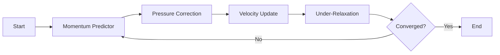

# SIMPLE Algorithm

Semi-Implicit Method for Pressure-Linked Equations สำหรับ Steady-state

> **ทำไมต้องเข้าใจ SIMPLE Algorithm?**
> - **หัวใจของ steady-state CFD** — simpleFoam และ solver อื่นๆ ใช้เป็นหลัก
> - **เข้าใจ under-relaxation** = แก้ปัญหา divergence ได้ที่สาเหตุ
> - **พื้นฐานของ PIMPLE** — ขาดไม่ได้ถ้าจะต่อยอดไป transient simulation
> - **Debug solver ได้** — รู้ว่า convergence ไม่ได้เพราะอะไร

---

## Learning Objectives

หลังจากอ่านบทนี้ คุณควรจะสามารถ:

1. **อธิบายขั้นตอนการทำงานของ SIMPLE Algorithm** ได้อย่างครบถ้วนตั้งแต่ momentum predictor ถึง pressure correction
2. **เข้าใจแนวคิดของ H-operator** และการแยก discretized momentum equation
3. **ตั้งค่า under-relaxation factors** ได้เหมาะสมกับโจทย์ (รู้ว่าทำไม αp ต้องน้อยกว่า αU)
4. **แก้ปัญหา convergence** ได้ทั้งกรณี oscillating และ slow convergence
5. **แปลงสมการทางคณิตศาสตร์** เป็นคำสั่ง OpenFOAM ได้อย่างถูกต้อง

---

## 1. Mathematical Foundation

### Governing Equations

**Continuity Equation:**
$$\nabla \cdot \mathbf{u} = 0$$

**Momentum Equation:**
$$\nabla \cdot (\mathbf{u}\mathbf{u}) = -\nabla p + \nu \nabla^2 \mathbf{u}$$

### Discretized Form

$$a_P \mathbf{u}_P + \sum_N a_N \mathbf{u}_N = \mathbf{b}_P - (\nabla p)_P$$

Define **H-operator** (แยกส่วนที่ไม่ขึ้นกับ pressure):
$$\mathbf{u}_P = \underbrace{\frac{\mathbf{b}_P - \sum_N a_N \mathbf{u}_N}{a_P}}_{\mathbf{H}(\mathbf{u})} - \frac{1}{a_P}(\nabla p)_P$$

> **Key Insight:** H(u) คือ velocity contribution จาก convection, diffusion และ source terms โดยไม่รวม pressure gradient

---

## 2. Algorithm Steps

### Overview

![[IMG_03_001.JPg]]



### Step 1: Momentum Predictor

แก้ momentum equation ด้วย pressure จาก iteration ก่อนหน้า (p*):

$$\mathbf{u}^* = \mathbf{H}(\mathbf{u}^*) - \frac{1}{a_P}\nabla p^*$$

> **Note:** u* ยังไม่ satisfy continuity เพราะใช้ p* ที่ยังไม่ถูกต้อง

### Step 2: Pressure Correction

แทนค่า velocity correction ($\mathbf{u} = \mathbf{u}^* - \frac{1}{a_P}\nabla p'$) ลงใน continuity ($\nabla \cdot \mathbf{u} = 0$) ได้ **Pressure Poisson Equation**:

$$\nabla \cdot \left(\frac{1}{a_P} \nabla p'\right) = \nabla \cdot \mathbf{u}^*$$

> **Physical Meaning:** RHS คือ mass imbalance ที่เกิดจาก u* → แก้โดยปรับ pressure

### Step 3: Velocity/Pressure Update

$$p = p^* + \alpha_p \cdot p'$$
$$\mathbf{u} = \mathbf{u}^* - \frac{1}{a_P}\nabla p'$$

### Step 4: Under-Relaxation

![[IMG_03_004.JPg]]

$$\phi^{new} = \alpha \cdot \phi^{computed} + (1-\alpha) \cdot \phi^{old}$$

> **ทำไมต้อง relaxation:** SIMPLE แก้ momentum และ pressure แยกกัน → ค่าที่ update อาจ overshoot → ใช้ relaxation จำกัดการเปลี่ยนแปลงต่อ iteration

---

## 3. OpenFOAM Implementation

### fvSolution Settings

```cpp
// system/fvSolution
SIMPLE
{
    nNonOrthogonalCorrectors 1;  // สำหรับ mesh ที่ไม่ orthgonal
    
    residualControl
    {
        p       1e-5;
        U       1e-5;
        "(k|epsilon|omega)" 1e-5;
    }
}

relaxationFactors
{
    fields
    {
        p       0.3;    // pressure ต้องน้อยกว่า
    }
    equations
    {
        U       0.7;    // velocity ผ่อนตัวมากกว่า
        k       0.7;
        epsilon 0.7;
    }
}
```

### Parameter Guidelines

| Parameter | Conservative (Stable) | Aggressive (Fast) |
|-----------|----------------------|-------------------|
| αp | 0.2-0.3 | 0.4-0.5 |
| αU | 0.5-0.6 | 0.7-0.8 |
| αturb | 0.5-0.7 | 0.7-0.9 |

> **Rule of Thumb:** αp ปกติครึ่งหนึ่งของ αU เพื่อหลีกเลี่ยง oscillation

### Linear Solvers

```cpp
solvers
{
    p
    {
        solver      GAMG;
        smoother    GaussSeidel;
        tolerance   1e-7;
        relTol      0.01;
    }
    U
    {
        solver      smoothSolver;
        smoother    GaussSeidel;
        tolerance   1e-8;
        relTol      0;
    }
}
```

| Equation | Solver | เหตุผล |
|----------|--------|---------|
| Pressure | GAMG | Elliptic → multigrid ช่วยได้เยอะ |
| Velocity | smoothSolver | Parabolic → Gauss-Seidel เพียงพอ |

---

## 4. Troubleshooting Convergence

### Oscillating Residuals

**สาเหตุ:** Under-relaxation มากเกินไป → pressure-velocity coupling แกว่ง

**Solution:** ลด relaxation factors

```cpp
relaxationFactors
{
    fields { p 0.1; }
    equations { U 0.5; }
}
```

### Slow Convergence

**Solution 1: Adaptive Relaxation**
- Iterations 1-10: αp = 0.1, αU = 0.3 (initial stability)
- Iterations 11-50: αp = 0.3, αU = 0.7 (accelerate)
- Iterations 51+: αp = 0.5, αU = 0.8 (final push)

**Solution 2:** ตรวจสอบ mesh quality และ boundary conditions

### Checkerboard Pressure

**สาเหตุ:** Non-orthogonal mesh ทำให้ discretization error สะสม

**Solution:** เพิ่ม non-orthogonal correctors

```cpp
nNonOrthogonalCorrectors 2;  // หรือ 3 สำหรับ mesh แย่มาก
```

---

## 5. Theory-to-Code Mapping

| ทางคณิตศาสตร์ | OpenFOAM Code |
|---------------|---------------|
| H(u) | `UEqn.H()` |
| 1/aP | `rAU = 1.0/UEqn.A()` |
| -∇p | `-fvc::grad(p)` |
| ∇·(1/aP ∇p) | `fvm::laplacian(rAU, p)` |
| Under-relaxation | `UEqn.relax()` |
| p = p* + αp·p' | `p.correctBoundaryConditions()` |

---

## Key Takeaways

### หัวใจของ SIMPLE

1. **Predictor-Corrector Loop:** ทาย velocity จาก momentum → แก้ pressure จาก continuity → ซ้ำจน converge
2. **Pressure-Velocity Coupling:** ความสัมพันธ์แบบ two-way → เปลี่ยน p ได้ผลต่อ U ทันที และ U ส่งผลกลับ
3. **H-Operator:** การแยก pressure ออกจาก momentum equation เป็นจุดสำคัญที่ทำให้ SIMPLE ทำได้

### Under-Relaxation Essentials

| Scenario | αp | αU |
|----------|----|----|
| High complexity mesh | 0.1-0.2 | 0.3-0.5 |
| Standard case | 0.3 | 0.7 |
| Simple geometry | 0.4-0.5 | 0.8-0.9 |

> **Golden Rule:** αp = 0.5 × αU เป็นจุดเริ่มต้นที่ดี

### Common Pitfalls

| ปัญหา | สาเหตุ | แก้ไข |
|--------|--------|--------|
| Diverge ตั้งแต่ iteration แรก | Relaxation สูงเกินไป | ลด αp, αU |
| Convergence ช้าเกิน | Relaxation ต่ำเกินไป | เพิ่ม αU ค่อยๆ |
| Residual oscillate | Mesh non-orthogonal | เพิ่ม nNonOrthogonalCorrectors |

---

## Concept Check

<details>
<summary><b>1. ทำไม SIMPLE ต้องใช้ under-relaxation?</b></summary>

เพราะ SIMPLE แก้ momentum และ pressure แยกกันในแต่ละ iteration ค่าที่อัปเดตอาจมากเกินไป (overshoot) ทำให้ solution แกว่งหรือ diverge → ใช้ relaxation จำกัดการเปลี่ยนแปลงต่อ iteration เพื่อให้ลู่เข้าสู่ solution ที่ถูกต้อง
</details>

<details>
<summary><b>2. ทำไม αp ต้องน้อยกว่า αU?</b></summary>

Pressure coupling กับ velocity สูงมาก — การเปลี่ยน p ส่งผลต่อ U ทันทีผ่าน pressure gradient term และ U ส่งผลกลับมาที่ p ผ่าน continuity → ต้องจำกัด p มากกว่าเพื่อหลีกเลี่ยง oscillation ระหว่างสองตัวแปร
</details>

<details>
<summary><b>3. Pressure Poisson Equation มาจากไหน?</b></summary>

มาจากการแทนค่า velocity correction (u = u* - (1/aP)∇p') ลงใน continuity equation (∇·u = 0) → ได้ Laplacian equation สำหรับ pressure correction (p') ที่ RHS เป็น divergence ของ intermediate velocity (u*)
</details>

<details>
<summary><b>4. ทำไม pressure solver ใช้ GAMG แต่ velocity ใช้ smoothSolver?</b></summary>

Pressure equation เป็น elliptic (Poisson type) → ผลกระทบขยายทั่วทั้ง domain → multigrid (GAMG) ช่วย accelerate ได้ดีมาก ส่วน velocity เป็น parabolic → local influence → Gauss-Seidel smoothing เพียงพอและ cheaper
</details>

<details>
<summary><b>5. Checkerboard pressure เกิดจากอะไร แก้ไขยังไง?</b></summary>

เกิดจาก non-orthogonal mesh ที่ทำให้ discretization error สะสมใน pressure gradient → pressure field มี pattern สลับสูง-ต่ำเหมือนกระดานหมากรุก แก้ไขโดยเพิ่ม nNonOrthogonalCorrectors เพื่อ iterate pressure correction จนกว่า orthogonality error ลดลง
</details>

---

## Related Documents

- **บทก่อนหน้า:** [00_Overview.md](00_Overview.md)
- **บทถัดไป:** [03_PISO_and_PIMPLE_Algorithms.md](03_PISO_and_PIMPLE_Algorithms.md)
- **เปรียบเทียบ algorithms:** [05_Algorithm_Comparison.md](05_Algorithm_Comparison.md)