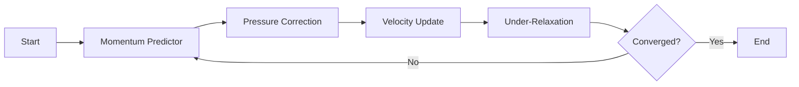

# SIMPLE Algorithm

Semi-Implicit Method for Pressure-Linked Equations สำหรับ Steady-state

> **ทำไม SIMPLE สำคัญ?**
> - **Algorithm หลักสำหรับ steady-state** — simpleFoam ใช้
> - เข้าใจ under-relaxation = แก้ divergence ได้
> - เป็นพื้นฐานของ PIMPLE

---

## Overview

**SIMPLE** แก้ปัญหา pressure-velocity coupling ผ่าน iterative predictor-corrector:

<!-- IMAGE: IMG_03_001 -->
<!-- 
Purpose: เพื่อให้ภาพรวมของขั้นตอนการทำงานของ SIMPLE Algorithm ที่เป็นหัวใจของ steady-state solver. ภาพนี้ต้องแสดงการไหลของข้อมูล (Pressure & Velocity) ระหว่าง Momentum Equation และ Continuity Equation ในลักษณะ Loop ที่ชัดเจน
Prompt: "Algorithmic flowchart diagram of the SIMPLE loop. **Nodes:** 1. **Guess** ($p^*, \mathbf{u}^*$) 2. **Momentum Predictor** (Solve for intermediate velocity) 3. **Pressure Equation** (Solve Poisson for $p'$) 4. **Correction** (Update $p$ and $\mathbf{u}$) 5. **Check Convergence**. **Flow:** Arrows connecting nodes in a clockwise cycle. **Highlight:** The 'Pressure Correction' step as the core coupling mechanism. STYLE: Clean professional flowchart, rectangular nodes with rounded corners, distinct arrow paths, black and white with blue accent for the 'Correction' phase."
-->
![[IMG_03_001.JPg]]



---

## 1. Mathematical Foundation

### Governing Equations

**Continuity:**
$$\nabla \cdot \mathbf{u} = 0$$

**Momentum:**
$$\nabla \cdot (\mathbf{u}\mathbf{u}) = -\nabla p + \nu \nabla^2 \mathbf{u}$$

### Discretized Form

$$a_P \mathbf{u}_P + \sum_N a_N \mathbf{u}_N = \mathbf{b}_P - (\nabla p)_P$$

Define **H-operator**:
$$\mathbf{u}_P = \underbrace{\frac{\mathbf{b}_P - \sum_N a_N \mathbf{u}_N}{a_P}}_{\mathbf{H}(\mathbf{u})} - \frac{1}{a_P}(\nabla p)_P$$

---

## 2. Algorithm Steps

### Step 1: Momentum Predictor

แก้ momentum ด้วย pressure จาก iteration ก่อนหน้า:
$$\mathbf{u}^* = \mathbf{H}(\mathbf{u}^*) - \frac{1}{a_P}\nabla p^*$$

### Step 2: Pressure Correction

แทนค่าใน continuity ได้ **Pressure Poisson Equation**:
$$\nabla \cdot \left(\frac{1}{a_P} \nabla p'\right) = \nabla \cdot \mathbf{u}^*$$

### Step 3: Velocity/Pressure Update

$$p = p^* + \alpha_p \cdot p'$$
$$\mathbf{u} = \mathbf{u}^* - \frac{1}{a_P}\nabla p'$$

### Step 4: Under-Relaxation

<!-- IMAGE: IMG_03_004 -->
<!-- 
Purpose: เพื่อแสดงผลกระทบของค่า Under-Relaxation Factor ($\alpha$) ที่มีต่อความเสถียร (Stability) และความเร็วในการลู่เข้า (Convergence Rate). กราฟต้องสื่อว่า $\alpha$ มากไปจะแกว่ง/ล้มเหลว, $\alpha$ น้อยไปจะช้า, และมีจุดสมดุลที่เหมาะสม
Prompt: "Scientific convergence plot (Log-Linear) showing Residuals vs Iterations. **Y-axis:** Log(Residual), **X-axis:** Iterations. **Curves:** 1. **Red Curve ($\alpha=1.0$):** Oscillates wildly and diverges (bad). 2. **Blue Curve ($\alpha=0.3$):** Decays monotonically but very slowly (safe but slow). 3. **Green Curve ($\alpha=0.7$):** Decays rapidly and stably (Optimal). **Labels:** Clear annotations pointing to each curve interpreting the behavior. STYLE: Matplotlib-style plotting, thin distinct lines, grid background, high contrast colors."
-->
![[IMG_03_004.JPg]]

$$\phi^{new} = \alpha \cdot \phi^{computed} + (1-\alpha) \cdot \phi^{old}$$

---

## 3. OpenFOAM Settings

### fvSolution

```cpp
// system/fvSolution
SIMPLE
{
    nNonOrthogonalCorrectors 1;
    
    residualControl
    {
        p       1e-5;
        U       1e-5;
        "(k|epsilon|omega)" 1e-5;
    }
}

relaxationFactors
{
    fields
    {
        p       0.3;
    }
    equations
    {
        U       0.7;
        k       0.7;
        epsilon 0.7;
    }
}
```

### Parameter Guidelines

| Parameter | Stable | Fast |
|-----------|--------|------|
| $\alpha_p$ | 0.2-0.3 | 0.4-0.5 |
| $\alpha_U$ | 0.5-0.6 | 0.7-0.8 |
| $\alpha_{turb}$ | 0.5-0.7 | 0.7-0.9 |

---

## 4. Linear Solvers

```cpp
solvers
{
    p
    {
        solver      GAMG;
        smoother    GaussSeidel;
        tolerance   1e-7;
        relTol      0.01;
    }
    U
    {
        solver      smoothSolver;
        smoother    GaussSeidel;
        tolerance   1e-8;
        relTol      0;
    }
}
```

| Equation | Solver | Why |
|----------|--------|-----|
| Pressure | GAMG | Elliptic, multigrid effective |
| Velocity | smoothSolver | Parabolic, Gauss-Seidel works |

---

## 5. Convergence Issues

### Oscillating Residuals

```cpp
// ลด relaxation
relaxationFactors
{
    fields { p 0.1; }
    equations { U 0.5; }
}
```

### Slow Convergence

**Adaptive Relaxation:**
- Iterations 1-10: $\alpha_p = 0.1$, $\alpha_U = 0.3$
- Iterations 11-50: $\alpha_p = 0.3$, $\alpha_U = 0.7$
- Iterations 51+: $\alpha_p = 0.5$, $\alpha_U = 0.8$

### Checkerboard Pressure

```cpp
// เพิ่ม non-orthogonal correctors
nNonOrthogonalCorrectors 2;
```

---

## 6. Code Mapping

| Theory | OpenFOAM |
|--------|----------|
| $\mathbf{H}(\mathbf{u})$ | `UEqn.H()` |
| $1/a_P$ | `rAU = 1.0/UEqn.A()` |
| $-\nabla p$ | `-fvc::grad(p)` |
| $\nabla \cdot (1/a_P \nabla p)$ | `fvm::laplacian(rAU, p)` |
| Under-relaxation | `UEqn.relax()` |

---

## Concept Check

<details>
<summary><b>1. ทำไม SIMPLE ต้องใช้ under-relaxation?</b></summary>

เพราะ SIMPLE แก้ momentum และ pressure แยกกัน ค่าที่อัปเดตอาจมากเกินไป (overshoot) → ใช้ relaxation จำกัดการเปลี่ยนแปลงต่อ iteration เพื่อป้องกัน divergence
</details>

<details>
<summary><b>2. ทำไม $\alpha_p$ ต้องน้อยกว่า $\alpha_U$?</b></summary>

Pressure coupling กับ velocity สูงมาก — การเปลี่ยน p ส่งผลต่อ U ทันที และ U ส่งผลกลับ → ต้องจำกัด p มากกว่าเพื่อหลีกเลี่ยง oscillation
</details>

<details>
<summary><b>3. Pressure Poisson Equation มาจากไหน?</b></summary>

มาจากการแทนค่า velocity correction ($\mathbf{u} = \mathbf{u}^* - (1/a_P)\nabla p'$) ลงใน continuity ($\nabla \cdot \mathbf{u} = 0$) ได้ Laplacian equation สำหรับ $p'$
</details>

---

## Related Documents

- **บทก่อนหน้า:** [01_Introduction.md](01_Introduction.md)
- **บทถัดไป:** [03_PISO_and_PIMPLE_Algorithms.md](03_PISO_and_PIMPLE_Algorithms.md)
- **เปรียบเทียบ:** [05_Algorithm_Comparison.md](05_Algorithm_Comparison.md)