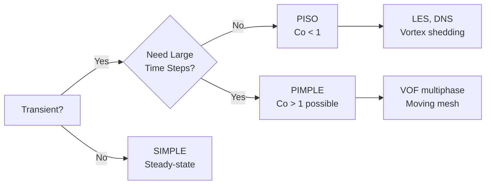
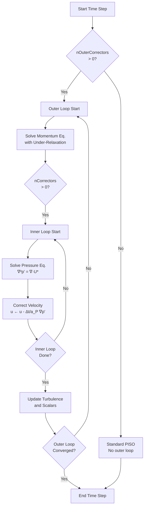
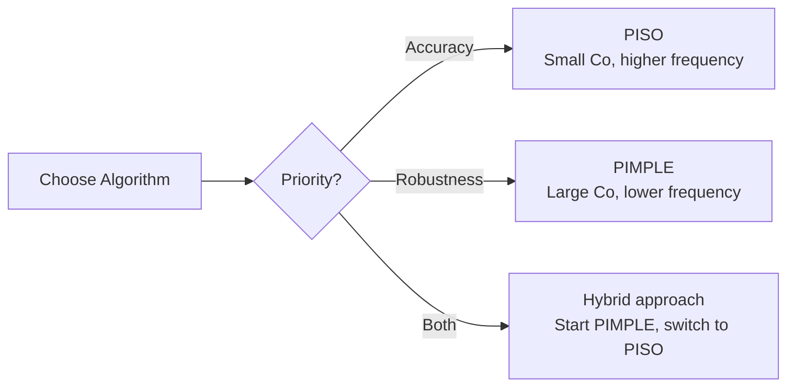

# PISO and PIMPLE Algorithms

**Pressure-Velocity Coupling for Transient Flows**

---

## ทำไมต้องเข้าใจ PISO และ PIMPLE?

เลือกขั้นตอนวิธีการที่เหมาะสม (PISO หรือ PIMPLE) จะช่วยให้:
- **ประหยัดเวลาคำนวณ** — PISO เร็วสำหรับ time step เล็ก (LES, DNS)
- **เพิ่มความเสถียร** — PIMPLE รองรับ time step ใหญ่และกรณียาก (VOF, moving mesh)
- **ควบคุมความแม่นยำ** — เลือก algorithm ที่เหมาะกับระดับ temporal accuracy ที่ต้องการ
- **หลีกเลี่ยงการแก้ปัญหาซ้ำ** — ตั้งค่า `nCorrectors`, `nOuterCorrectors` ถูกต้องตั้งแต่แรก

---

## Learning Objectives

เมื่ออ่านจบบทนี้ คุณควรจะสามารถ:
1. **เปรียบเทียบ** PISO และ PIMPLE — เลือกใช้ให้ถูกต้องตาม use case
2. **ตั้งค่า** `fvSolution` — ปรับ `nCorrectors`, `nOuterCorrectors`, และ `relaxationFactors`
3. **อธิบาย** โครงสร้าง nested loop ของ PIMPLE — outer loop (SIMPLE-like) + inner loop (PISO)
4. **แก้ไข** ปัญหา divergence — ปรับ time step, relaxation, และ loop iterations อย่างเหมาะสม
5. **ใช้งาน** VOF-specific settings — `nAlphaCorr`, `nAlphaSubCycles`, `maxAlphaCo`

---

## 1. Algorithm Overview

### Quick Comparison

| Algorithm | Full Name | Use Case | Max Co | Relaxation | Cost/Step |
|-----------|-----------|----------|--------|------------|-----------|
| **PISO** | Pressure Implicit with Splitting of Operators | High temporal accuracy | < 1 | Not needed | Lower |
| **PIMPLE** | PISO + SIMPLE merged | Large time steps, robustness | > 1 possible | Required | Higher |

### Decision Flowchart



---

## 2. PISO Algorithm

**P**ressure **I**mplicit with **S**plitting of **O**perators

### Key Characteristics

- **No under-relaxation** — multiple pressure corrections ทำให้ converge โดยไม่ต้อง damp
- **Second-order temporal accuracy** — เหมาะกับ simulation ที่ต้องการความแม่นยำตามเวลา
- **Requires Co < 1** — time step จำกัดโดย Courant number

### fvSolution Settings

```cpp
PISO
{
    nCorrectors              2;    // Pressure corrections per time step
    nNonOrthogonalCorrectors 0;    // For non-orthogonal meshes (ถ้า mesh skew ให้เพิ่ม)
    pRefCell                 0;
    pRefValue                0;
}
```

### Algorithm Steps

```
while (time loop)
    1. Momentum Predictor: Solve U* ด้วย p^n
    2. Pressure Correction (repeat nCorrectors times):
       - Solve pressure equation: ∇²(p') = ∇·U*
       - Correct velocity: u^{k+1} = u^k - (Δt/a_P)∇p'
       - Update flux: φ = φ - ∇p'
    3. Solve transport equations (turbulence, scalars)
```

### When to Use PISO

| Scenario | Recommended Settings |
|----------|---------------------|
| LES/DNS | `nCorrectors 3`, Co < 0.5 |
| Vortex shedding | `nCorrectors 3` |
| Acoustic simulations | `nCorrectors 2-3`, small Δt |
| General transient | `nCorrectors 2`, Co < 1 |

---

## 3. PIMPLE Algorithm

**P**ISO + S**IMPLE** merged — hybrid algorithm สำหรับ transient ที่ต้องการ robustness

### Key Characteristics

- **Outer SIMPLE-like loops** — ใช้ under-relaxation เพื่อความเสถียร
- **Inner PISO corrections** — ทำ pressure correction หลายครั้งต่อ outer loop
- **Allows Co > 1** — ใช้ time step ใหญ่ได้ แต่ลดความแม่นยำตามเวลา

### fvSolution Settings

```cpp
PIMPLE
{
    // Outer loop (SIMPLE-like)
    nOuterCorrectors         2;    // Outer iterations (เพิ่มหาก converge ช้า)
    nCorrectors              2;    // Inner PISO corrections
    
    // Non-orthogonal correction
    nNonOrthogonalCorrectors 1;    // เพิ่มถ้า mesh skew
    
    // Convergence criteria (optional)
    residualControl
    {
        p       1e-5;
        U       1e-5;
        k       1e-5;
        epsilon 1e-5;
    }
}

// Under-relaxation สำหรับ outer loop
relaxationFactors
{
    fields
    {
        p       0.3;      // Pressure relaxation
        p_rgh   0.3;
    }
    equations
    {
        U       0.7;              // Velocity
        "(k|epsilon|omega)" 0.7;  // Turbulence
        nuTilda 0.7;              // Spalart-Allmaras
    }
}
```

### Nested Loop Structure



### Pseudo-Code

```
while (time loop)
    for (outer = 1 to nOuterCorrectors)  // SIMPLE-like
        // Solve momentum with under-relaxation
        Solve momentum: U* = f(p^{outer-1})
        Apply relaxation: U = α_U * U* + (1-α_U) * U_old
        
        for (inner = 1 to nCorrectors)    // PISO
            Solve pressure: ∇²(p') = ∇·U*
            Correct velocity: U ← U - (Δt/a_P)∇p'
        
        Solve turbulence, scalars
        Check residuals (if using residualControl)
```

### When to Use PIMPLE

| Scenario | Recommended Settings |
|----------|---------------------|
| VOF multiphase | `nOuterCorrectors 3-5`, `nCorrectors 2` |
| Moving mesh (overset, dynamicFvMesh) | `nOuterCorrectors 2-4` |
| Large time steps (Co > 1) | `nOuterCorrectors 2+`, lower relaxation |
| Compressible flow | `nOuterCorrectors 2-3` |
| Complex buoyancy | `nOuterCorrectors 3-5`, strong relaxation |

---

## 4. VOF-Specific Settings

สำหรับ multiphase flow ที่ใช้ `interFoam` หรือ solver ในกลุ่ม VOF

### Enhanced PIMPLE Configuration

```cpp
PIMPLE
{
    nOuterCorrectors    3;        // Outer loops (VOF ต้องการ robustness สูง)
    nCorrectors         2;        // Pressure corrections
    
    // Phase fraction specific
    nAlphaCorr          1;        // MULES corrections per step (default: 1)
    nAlphaSubCycles     2;        // Sub-cycling for interface tracking
    
    // Courant limits
    maxCo               1.0;      // Global Courant limit
    maxAlphaCo          0.5;      // Interface Courant limit (stricter)
}

MULESCoefs
{
    nAlphaCorr      1;            // ถ้า interface sharp ให้เพิ่มเป็น 2
    alphaApplyPrevCorr yes;       // ใช้ corrected values ใน iteration ถัดไป
}
```

### Why `nAlphaSubCycles`?

- **Interface resolution** — interface เคลื่อนที่เร็วกว่า flow ของ momentum
- **Sub-cycling** — แบ่ง time step ของ alpha เป็น nAlphaSubCycles ส่วน
- **Benefit** — ใช้ time step ใหญ่สำหรับ momentum ขณะที่ track interface ด้วย step เล็กๆ

```
Example:
- Time step (Δt) = 0.01 s
- nAlphaSubCycles = 2
- Interface actually solved at Δt_alpha = 0.005 s
```

---

## 5. Performance Comparison

### Computational Cost vs. Accuracy

| Feature | PISO | PIMPLE |
|---------|------|--------|
| **Relaxation** | Not needed | Required in outer loop |
| **Courant limit** | Co < 1 | Co > 1 possible |
| **Temporal accuracy** | 2nd order | 1st-2nd order (dependent on nOuterCorrectors) |
| **Cost per step** | Lower (single outer iteration) | Higher (multiple outer loops) |
| **Robustness** | Lower | Higher |
| **Memory** | Lower | Higher (storing previous iterations) |
| **Best for** | LES, DNS, vortex shedding | Industrial VOF, moving mesh |

### Trade-off Decision



---

## 6. Troubleshooting Guide

### Common Problems and Solutions

| Problem | Algorithm | Solution |
|---------|-----------|----------|
| **Divergence** | PISO | Reduce Δt (Co < 0.5), increase `nCorrectors` to 3-4 |
| **Divergence** | PIMPLE | Lower relaxation factors (p: 0.2-0.3, U: 0.5-0.6), increase `nOuterCorrectors` |
| **Poor temporal accuracy** | PIMPLE | Reduce `nOuterCorrectors` to 1-2, lower Co < 0.7 |
| **Slow convergence** | PIMPLE | Use `residualControl` to exit early, check mesh quality |
| **Pressure spikes** | PISO | Increase `nCorrectors`, reduce time step |
| **Interface diffusion** | VOF | Increase `nAlphaSubCycles`, reduce `maxAlphaCo` |
| **Blowing up at start** | PIMPLE | Start with very low Co, gradually increase |

### Tuning Strategy

1. **Start conservative**: Co ≤ 0.5, high `nCorrectors`/`nOuterCorrectors`
2. **Monitor residuals**: Use `residualControl` ถ้า residuals ต่ำกว่า threshold ให้ exit loop
3. **Gradual increase**: ขยาย time step ค่อยๆ หลังจาก simulation เสถียร
4. **Check mesh quality**: Non-orthogonal cells ต้องการ `nNonOrthogonalCorrectors > 0`

---

## 7. Practical Examples

### Example 1: LES Simulation (PISO)

```cpp
// system/fvSolution
PISO
{
    nCorrectors              3;
    nNonOrthogonalCorrectors 1;
}

// system/controlDict
application     pimpleFoam;
deltaT          0.001;
maxCo           0.5;
```

### Example 2: VOF Multiphase (PIMPLE)

```cpp
// system/fvSolution
PIMPLE
{
    nOuterCorrectors    4;
    nCorrectors         2;
    nAlphaCorr          1;
    nAlphaSubCycles     3;
    maxCo               1.0;
    maxAlphaCo          0.3;
}

relaxationFactors
{
    fields    { p 0.2; }
    equations { U 0.5; }
}
```

### Example 3: Moving Mesh (PIMPLE)

```cpp
// system/fvSolution
PIMPLE
{
    nOuterCorrectors    3;
    nCorrectors         2;
    nNonOrthogonalCorrectors 2;
}

relaxationFactors
{
    fields    { p 0.25; cellDisplacement 0.3; }
    equations { U 0.6; }
}
```

---

## Key Takeaways

### Core Concepts

1. **PISO = fast + accurate** — เหมาะสำหรับ LES, DNS, vortex shedding (Co < 1, no relaxation)
2. **PIMPLE = robust + flexible** — เหมาะสำหรับ VOF, moving mesh, large time steps (Co > 1, with relaxation)
3. **Nested loops = hybrid power** — PIMPLE ใช้ outer SIMPLE loop (relaxation) + inner PISO loop (pressure corrections)
4. **VOF needs special care** — ใช้ `nAlphaSubCycles` เพื่อ track interface แม่นยำโดยไม่ลด time step ของ flow

### Parameter Selection Rules

| Parameter | Effect | Typical Range |
|-----------|--------|---------------|
| `nCorrectors` | Pressure accuracy | 2-4 (PISO), 2 (PIMPLE) |
| `nOuterCorrectors` | Outer loop robustness | 1 (PISO-like), 2-5 (PIMPLE) |
| `p` relaxation | Stability | 0.2-0.3 (PIMPLE only) |
| `U` relaxation | Velocity damping | 0.5-0.7 (PIMPLE only) |
| `maxAlphaCo` | Interface resolution | 0.3-0.5 (VOF only) |

### Remember

- **nOuterCorrectors = 1** ใน PIMPLE → พฤติกรรมเหมือน PISO
- **Increase `nCorrectors`** ถ้า pressure oscillates
- **Increase `nOuterCorrectors`** ถ้า simulation diverges
- **Lower relaxation** ถ้ามีการแกะโจทย์/ฉับพลัน
- **Use `residualControl`** เพื่อหลีกเลี่ยงการคำนวณ loop ที่ไม่จำเป็น

---

## Concept Check

<details>
<summary><b>1. ทำไม PISO ไม่ต้องใช้ under-relaxation แต่ PIMPLE ต้องใช้?</b></summary>

**PISO** ใช้ **multiple pressure corrections** ใน time step เดียว — corrections เหล่านี้ทำให้ velocity และ pressure converge โดยไม่ต้อง damp การเปลี่ยนแปลง

**PIMPLE** มี **outer loops** ที่คล้าย SIMPLE — แต่ละ outer iteration แก้ momentum equation ครั้งเดียว จึงต้องใช้ under-relaxation เพื่อป้องกัน oscillation ระหว่าง velocity และ pressure
</details>

<details>
<summary><b>2. `nOuterCorrectors = 1` ใน PIMPLE ทำงานเหมือน PISO หรือไม่?</b></summary>

**ใช่** — การตั้งค่า `nOuterCorrectors = 1` ใน PIMPLE จะทำให้ algorithm ทำงานเหมือน **PISO**:
- ไม่มี outer relaxation loop
- แค่ทำ pressure corrections ตาม `nCorrectors`
- ไม่มีการ under-relax momentum equation

แต่ PIMPLE จะยังมี flexibility ในการตั้งค่า `residualControl` และ `relaxationFactors` ถ้าต้องการ
</details>

<details>
<summary><b>3. ทำไม VOF ต้องใช้ `nAlphaSubCycles`?</b></summary>

เพราะ **interface** ระหว่าง phases ต้องการ **temporal resolution สูงกว่า** momentum equation:

- **Interface** เคลื่อนที่ด้วย velocity ของ fluid → ต้องการ Δt เล็กเพื่อ avoid numerical diffusion
- **Momentum** equation อาจ converge ได้ด้วย Δt ใหญ่กว่า

**Sub-cycling** ช่วยให้:
- ใช้ time step ใหญ่สำหรับ momentum (ประหยัดเวลา)
- Track interface ด้วย step เล็กๆ (nAlphaSubCycles ส่วน) → maintain sharp interface

```
Example: Δt = 0.01 s, nAlphaSubCycles = 2
→ Momentum solve ที่ 0.01 s
→ Alpha solve 2 ครั้ง ที่ 0.005 s (แต่ละครั้ง)
```
</details>

<details>
<summary><b>4. เมื่อไหร่ควรใช้ PISO vs PIMPLE?</b></summary>

**ใช้ PISO** เมื่อ:
- ต้องการ temporal accuracy สูง (LES, DNS, acoustics)
- สามารถใช้ time step เล็กได้ (Co < 1)
- Simulation เสถียร ไม่มี complex source terms

**ใช้ PIMPLE** เมื่อ:
- ต้องการใช้ time step ใหญ่ (Co > 1)
- มี complex physics (VOF, moving mesh, buoyancy strong)
- Simulation diverge ง่าย
- ต้องการ robustness มากกว่า accuracy

**Hybrid approach**: Start with PIMPLE จนกว่า flow จะ develop แล้ว switch to PISO
</details>

---

## Related Documents

- **บทก่อนหน้า:** [02_SIMPLE_Algorithm.md](02_SIMPLE_Algorithm.md) — Steady-state pressure-velocity coupling
- **บทถัดไป:** [04_Rhie_Chow_Interpolation.md](04_Rhie_Chow_Interpolation.md) — Preventing checkerboard pressure
- **Related:** [05_Non_Orthogonal_Correction.md](05_Non_Orthogonal_Correction.md) — Handling mesh skewness