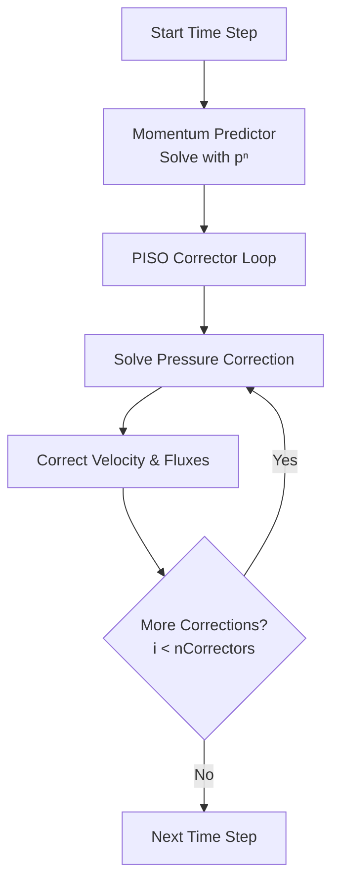
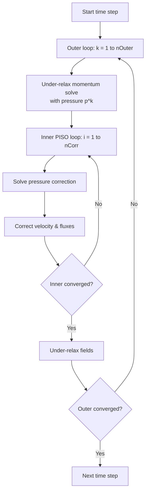
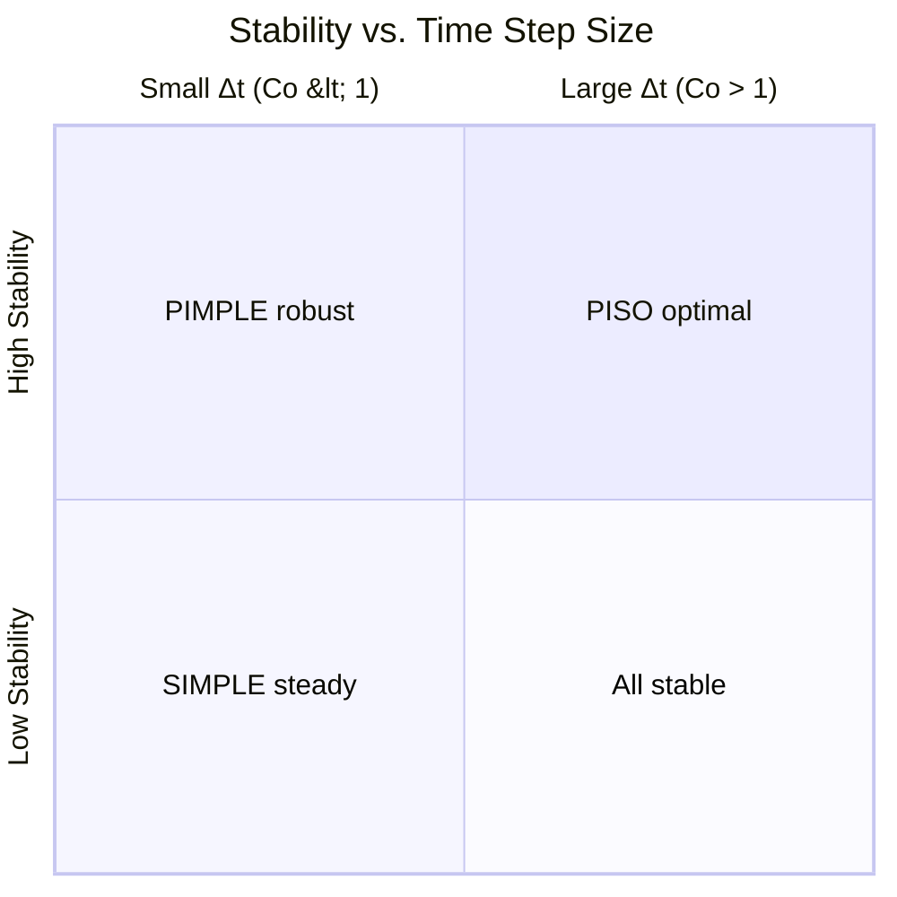

# อัลกอริทึม PISO และ PIMPLE: อัลกอริทึมสำหรับการไหลแบบชั่วคราว (Transient)

## 📖 บทนำ (Introduction)

สำหรับการไหลที่ขึ้นกับเวลา (**Transient flow**) OpenFOAM นำเสนอสองอัลกอริทึมหลัก ได้แก่ **PISO** สำหรับความแม่นยำสูงเมื่อก้าวเวลาเล็ก และ **PIMPLE** สำหรับความแข็งแกร่งเมื่อก้าวเวลาใหญ่

---

## 🎯 1. อัลกอริทึม PISO (Pressure-Implicit with Splitting of Operators)

PISO ถูกพัฒนาโดย Issa (1986) เพื่อรักษาความแม่นยำเชิงเวลา (Temporal Accuracy) โดยไม่ต้องใช้ Under-relaxation

### 1.1 รากฐานทางคณิตศาสตร์ (Mathematical Foundation)

#### การทำให้เป็นดิสครีตเชิงเวลา (Temporal Discretization)

โดยใช้ implicit Euler (backward differencing):

$$\frac{\mathbf{u}^{n+1} - \mathbf{u}^n}{\Delta t} + (\mathbf{u}^{n+1} \cdot \nabla) \mathbf{u}^{n+1} = -\frac{1}{\rho} \nabla p^{n+1} + \nu \nabla^2 \mathbf{u}^{n+1} + \mathbf{f}^{n+1}$$

#### ตัวทำนายโมเมนตัม (Momentum Predictor)

แก้สมการโมเมนตัมโดยใช้ความดันจาก Time Step ก่อนหน้า $p^n$:

$$a_P \mathbf{u}_P^* + \sum_N a_N \mathbf{u}_N^* = \mathbf{b}_P - (\nabla p^n)_P$$

หรือในรูปแบบ operator:

$$\mathbf{A} \mathbf{u}^* = \mathbf{H}(\mathbf{u}^*) - \nabla p^n$$

#### ลูปการแก้ไขความดัน-ความเร็ว (Pressure-Velocity Correction Loop)

สำหรับการแก้ไข PISO แต่ละครั้ง $i = 1, 2, ..., n_{corr}$:

**สมการการแก้ไขความดัน:**

$$\nabla \cdot \left( \frac{\Delta t}{a_P} \nabla p'^{(i)} \right) = \nabla \cdot \mathbf{u}^{(i)}$$

โดยที่ $p'^{(i)} = p^{(i)} - p^{(i-1)}$

**การแก้ไขความเร็ว:**

$$\mathbf{u}^{(i+1)} = \mathbf{u}^{(i)} - \frac{\Delta t}{a_P} \nabla p'^{(i)}$$

**การอัปเดตความดัน:**

$$p^{(i+1)} = p^{(i)} + p'^{(i)}$$

**การอัปเดต Face Flux:**

$$\phi^{(i+1)} = \mathbf{u}^{(i+1)} \cdot \mathbf{S}_f$$

โดยที่ $\mathbf{S}_f$ คือเวกเตอร์พื้นที่หน้า

### 1.2 ขั้นตอนการทำงาน (PISO Workflow)


> **Figure 1:** แผนผังลำดับขั้นตอนการทำงานของอัลกอริทึม PISO (PISO Workflow) สำหรับการคำนวณแบบ Transient โดยเน้นที่ลูปการแก้ไข (Corrector Loop) ภายในก้าวเวลาเดียว เพื่อรักษาความแม่นยำเชิงเวลาและความต่อเนื่องของมวลโดยไม่ต้องใช้ Under-relaxation

**ขั้นตอนการทำงาน:**
1. **Momentum Predictor**: แก้สมการโมเมนตัมด้วยความดันจาก Time-step ก่อนหน้า ($p^n$)
2. **PISO Corrector Loop** (ทำซ้ำ $n$ รอบตาม `nCorrectors`):
   - แก้สมการความดัน (Pressure Equation)
   - อัปเดตสนามความเร็วและ Flux
   - รักษาความต่อเนื่อง (Mass conservation)

### 1.3 คุณสมบัติของ PISO (PISO Characteristics)

| คุณสมบัติ | คำอธิบาย |
|-----------|----------|
| **ความแม่นยำเชิงเวลา** | Transient อันดับสอง |
| **Relaxation** | ไม่ต้องการ (การแก้ไขหลายครั้งชดเชย) |
| **ขีดจำกัด Courant number** | Co < 1 โดยทั่วไป |
| **เหมาะสำหรับ** | LES, DNS, Vortex shedding, Aeroacoustics |

### 1.4 จำนวนการแก้ไข (Number of Corrections)

| จำนวนการแก้ไข | ความเหมาะสม | ความสำเร็จ |
|-----------------|---------------|-------------|
| **1 การแก้ไข** | คล้ายกับ SIMPLE แต่ไม่มี relaxation | อาจเกิด divergence |
| **2–3 การแก้ไข** | ทั่วไปสำหรับการไหลแบบชั่วคราว | สมดุลระหว่างความเร็วและความแม่นยำ |
| **4+ การแก้ไข** | สำหรับ Courant number สูงหรือสภาวะชั่วคราวที่รุนแรง | ค่าใช้จ่ายสูงแต่เสถียร |

### 1.5 OpenFOAM Configuration (`system/fvSolution`)

```cpp
PISO
{
    nCorrectors          2;    // จำนวนรอบการแก้ไขความดัน (แนะนำ 2-3)
    nNonOrthogonalCorrectors 0; // รอบการแก้สำหรับ mesh ที่ไม่ตั้งฉาก
    pRefCell             0;
    pRefValue            0;
}
```

### 1.6 ข้อพิจารณาด้านความเสถียร (Stability Considerations)

- **ขีดจำกัด Courant number**: โดยทั่วไป $Co < 1$ เพื่อความเสถียร
- **ความไวของ Time Step**: ต้องการ $\Delta t$ ขนาดเล็กเพื่อความแม่นยำ
- **ไม่มี under-relaxation**: ความเสถียรมาจากการแก้ไขหลายครั้งภายใน Time Step
- **Divergence**: มักบ่งชี้ว่า $\Delta t$ ใหญ่เกินไปหรือการแก้ไขไม่เพียงพอ

---

## 🔀 2. อัลกอริทึม PIMPLE (Merged PISO-SIMPLE)

PIMPLE รวมความสามารถของ **SIMPLE** (สำหรับการวนซ้ำภายนอกพร้อม Relaxation) และ **PISO** (สำหรับการวนซ้ำภายในเพื่อความแม่นยำ)

### 2.1 แรงจูงใจ (Motivation)

PIMPLE (merged PISO-SIMPLE) รวม **ความแข็งแกร่งของ SIMPLE** เข้ากับ **ความแม่นยำเชิงเวลาของ PISO** เพื่อจัดการกับ:

- **Time Step ขนาดใหญ่** (Courant number > 1) ด้วย under-relaxation
- **การไหลแบบชั่วคราว** ที่มีขอบเขตเคลื่อนที่หรือความไม่เสถียรที่รุนแรง
- **กรณีที่** PISO บริสุทธิ์จะเกิด divergence เนื่องจาก $\Delta t$ ขนาดใหญ่
- **การจำลองทางวิศวกรรมในทางปฏิบัติ** ที่การลู่เข้าสภาวะคงที่ทำได้ยาก

### 2.2 รากฐานทางคณิตศาสตร์ (Mathematical Formulation)

PIMPLE ใช้ **ลูปแบบซ้อนกัน (nested loops)**:

**การวนซ้ำภายนอก $k$** (SIMPLE-like):
- สมการโมเมนตัมถูกแก้ด้วยความดันที่ผ่อนคลาย $p^{(k)}$
- การแก้ไขความดันถูกนำมาใช้พร้อมกับ relaxation $\alpha_p$
- ฟิลด์ถูกอัปเดต: $\mathbf{u}^{(k+1)} = \alpha_u \mathbf{u}^* + (1-\alpha_u) \mathbf{u}^{(k)}$

**การวนซ้ำภายใน $i$** ภายในลูปภายนอก $k$ (PISO):
- สมการการแก้ไขความดันถูกแก้ (ไม่มี relaxation)
- ความเร็วถูกแก้ไข: $\mathbf{u}^{(i+1)} = \mathbf{u}^{(i)} - \frac{\Delta t}{a_P} \nabla p'^{(i)}$
- ความต่อเนื่องถูกบังคับใช้ผ่านการอัปเดต Face Flux

**สูตรที่ผสมผสาน:**
$$\mathbf{u}^{n+1,k+1} = \mathbf{u}^{n+1,k} + \alpha_u (\mathbf{u}^* - \mathbf{u}^{n+1,k})$$
$$p^{n+1,k+1} = p^{n+1,k} + \alpha_p p'$$

โดยที่:
- $k$ แสดงถึงตัวนับการวนซ้ำ SIMPLE
- $n$ แสดงถึงระดับเวลา (time level)

### 2.3 จุดเด่นของ PIMPLE

- **Large Time Steps**: สามารถรันที่ค่า Courant number ($Co$) มากกว่า 1 ได้อย่างเสถียร
- **Robustness**: เหมาะกับปัญหาที่มีความไม่เป็นเชิงเส้นสูง (High non-linearity) เช่น Mesh เคลื่อนที่ หรือ Multiphase flow
- **ความยืดหยุ่น**: สามารถปรับ `nOuterCorrectors` เพื่อให้ทำงานเหมือน PISO (เมื่อ = 1) หรือ SIMPLE-like (เมื่อ > 1)

### 2.4 โครงสร้างลูปของ PIMPLE


> **Figure 2:** โครงสร้างลูปแบบซ้อนกัน (Nested Loops) ของอัลกอริทึม PIMPLE ซึ่งประกอบด้วยลูปภายนอก (Outer Loop) แบบ SIMPLE เพื่อสร้างความเสถียรผ่าน Under-relaxation และลูปภายใน (Inner Loop) แบบ PISO เพื่อความแม่นยำในการแก้สมการความดันและความเร็ว ทำให้สามารถคำนวณด้วยก้าวเวลาขนาดใหญ่ (High Courant number) ได้

**โครงสร้างโค้ด:**
```cpp
while (runTime.loop())
{
    // Outer Correctors (SIMPLE loops)
    for (int oCorr=0; oCorr<nOuterCorr; oCorr++)
    {
        // 1. Solve Momentum (UEqn.H)
        // 2. Solve Pressure Inner Loop (pEqn.H)
        for (int corr=0; corr<nCorr; corr++)
        {
            // Solve p equation
        }
    }
}
```

**พารามิเตอร์สำคัญ**:
- `nOuterCorrectors`: การวนซ้ำ SIMPLE ภายนอก (โดยทั่วไป 1–5)
- `nCorrectors`: การแก้ไข PISO ภายใน (โดยทั่วไป 2–4)
- Relaxation factors: $\alpha_u$ (0.3–0.7), $\alpha_p$ (0.1–0.3)

### 2.5 Configuration ใน OpenFOAM

```cpp
PIMPLE
{
    nOuterCorrectors    2;     // จำนวนรอบ SIMPLE (Outer loop)
    nCorrectors         2;     // จำนวนรอบ PISO (Inner loop)
    nNonOrthogonalCorrectors 0;
    adjustTimeStep      yes;   // ปรับก้าวเวลาอัตโนมัติอิงตาม maxCo
    maxCo               2.0;   // อนุญาตให้ Co > 1
}
```

**ตัวอย่างการตั้งค่าสำหรับ VOF:**
```cpp
PIMPLE
{
    nOuterCorrectors    3;      // การผ่อนคลาย outer สำหรับความเสถียร
    nCorrectors         2;      // การแก้ไข PISO ภายใน
    nAlphaCorr          1;      // การแก้ไข phase fraction
    nAlphaSubCycles     2;      // Sub-cycling สำหรับ interface

    // Time step control
    adjustTimeStep      yes;
    maxCo               1.0;    // ใหญ่กว่า PISO บริสุทธิ์
    maxAlphaCo          0.5;    // จำกัด interface Courant number
}
```

### 2.6 เมื่อใดควรใช้ PIMPLE เทียบกับ PISO

| สถานการณ์ | อัลกอริทึมที่แนะนำ | เหตุผล |
|----------|-------------------|--------|
| **Steady RANS** | SIMPLE | มีประสิทธิภาพสูงสุดสำหรับสภาวะคงที่ |
| **Transient with small $\Delta t$** | PISO | การรวมเชิงเวลาที่แม่นยำ |
| **Transient with large $\Delta t$** | PIMPLE | ความเสถียรผ่าน outer relaxation |
| **Moving mesh (overset)** | PIMPLE | จัดการการเปลี่ยนรูปเซลล์ขนาดใหญ่ |
| **Strong buoyancy** | PIMPLE | เชื่อมโยงการเปลี่ยนแปลงความหนาแน่น |
| **Multiphase VOF** | PIMPLE | ความเสถียรในการจับภาพอินเทอร์เฟซ |

**หลักการทั่วไป**: ใช้ PIMPLE เมื่อ Courant number > 1 หรือเมื่อ PISO เกิด divergence

---

## 📊 3. ตารางเปรียบเทียบ PISO vs PIMPLE

### 3.1 การเปรียบเทียบคุณสมบัติที่สำคัญ

| คุณสมบัติ | PISO | PIMPLE |
|-----------|------|--------|
| **ชื่อเต็ม** | Pressure-Implicit with Splitting of Operators | Merged PISO-SIMPLE |
| **ความแม่นยำเชิงเวลา** | Transient อันดับ 2 | อันดับ 1–2 (ขึ้นอยู่กับ outer loops) |
| **Relaxation factors** | ไม่มี | Outer: จำเป็น, Inner: ไม่มี |
| **การแก้ไขต่อขั้นตอน** | 2–4 (nCorrectors) | Outer × Inner (nOuter × nCorr) |
| **ก้าวเวลา ($\Delta t$)** | ต้องเล็ก ($Co < 1$) | ใหญ่ได้ ($Co > 1$) |
| **กลไกความเสถียร** | การแก้ไขหลายครั้ง | Nested relaxation + corrections |
| **Relaxation** | ไม่แนะนำ | จำเป็นใน Outer loop |
| **ต้นทุนการคำนวณ** | ต่ำต่อ Time-step | สูงต่อ Time-step (แต่ก้าวเวลาใหญ่กว่า) |
| **Memory overhead** | ปานกลาง (เก็บ corrections) | สูง (เก็บ outer iterations) |
| **ความเหมาะสม** | LES, DNS, Aeroacoustics | อุตสาหกรรม, Moving Mesh, VOF |
| **OpenFOAM solver** | `pisoFoam` | `pimpleFoam` |

### 3.2 การเปรียบเทียบต้นทุนการคำนวณ (Computational Cost Comparison)

**การดำเนินการต่อ Time Step** (เทียบกับ SIMPLE = 1.0):
- **PISO**: (1.0 + 0.3 × nCorr) × (momentum solve + nCorr × pressure solve)
- **PIMPLE**: nOuter × [1.0 × momentum solve + nCorr × pressure solve]

**ต้นทุนสัมพัทธ์ทั่วไป** (สมมติว่าลู่เข้าในเวลาทางกายภาพเดียวกัน):

| ประเภทการไหล | PISO | PIMPLE |
|-------------|------|---------|
| **การไหลแบบ Transient ด้วย Δt ขนาดเล็ก** | 1.0 (ประสิทธิภาพสูงสุด) | 1.2–1.5 |
| **การไหลแบบ Transient ด้วย Δt ขนาดใหญ่** | diverges | 1.0 (เสถียรเท่านั้น) |

### 3.3 พื้นที่ความเสถียร (Stability Regions)


> **Figure 3:** กราฟเปรียบเทียบความสัมพันธ์ระหว่างความเสถียร (Stability) และขนาดของก้าวเวลา (Time Step Size) ของอัลกอริทึมต่างๆ แสดงให้เห็นว่า PISO เหมาะสมกับก้าวเวลาขนาดเล็ก (Co < 1) ในขณะที่ PIMPLE มีความแข็งแกร่ง (Robust) กว่าเมื่อต้องเผชิญกับก้าวเวลาขนาดใหญ่ และ SIMPLE เหมาะสำหรับการลู่เข้าสู่สภาวะคงที่ (Steady-state)ความปลอดภัยทางฟิสิกส์ไม่ส่งผลกระทบต่อความเร็วในการจำลอง ผ่านการใช้พลังของ C++ Template Metaprogramming ในการตรวจสอบความสอดคล้องทางมิติทั้งหมดที่ขั้นตอนการคอมไพล์โปรแกรมเพียงครั้งเดียว

**ข้อมูลเชิงลึกที่สำคัญ**:
- **PISO**: เสถียรเฉพาะสำหรับ Time Step ขนาดเล็ก (Co < 1–2)
- **PIMPLE**: ขยายความเสถียรไปยัง Time Step ที่ใหญ่ขึ้นผ่าน outer relaxation

---

## 🛠️ 4. แนวทางปฏิบัติที่ดีที่สุด (Best Practices)

### 4.1 การเลือกจำนวนการแก้ไขที่เหมาะสม

| สถานการณ์ | nCorrectors | เหตุผล |
|----------|-------------|--------|
| **LES/DNS** | 2–3 | ความแม่นยำเชิงเวลาสำคัญ |
| **Vortex shedding** | 3 | จับภาพ frequency ได้แม่นยำ |
| **General transient** | 2 | สมดุลระหว่างความเร็วและความแม่นยำ |
| **High Co (PIMPLE)** | 2–4 | ความเสถียรสำคัญกว่าความแม่นยำ |

### 4.2 การปรับแต่งสำหรับ PIMPLE

| ประเภทปัญหา | nOuterCorrectors | nCorrectors | เหตุผล |
|-------------|----------------|-----------|---------|
| **Multiphase VOF** | 3–5 | 2 | ความเสถียรของอินเทอร์เฟซ |
| **Moving mesh** | 2–4 | 2–3 | การจัดการการเปลี่ยนแปลง topology |
| **Strong buoyancy** | 3–5 | 2 | เชื่อมโยงความดันกับความหนาแน่น |
| **LES with large Δt** | 1–2 | 3–4 | ความแม่นยำเชิงเวลาสำคัญ |

### 4.3 คำแนะนำสำหรับ PISO

1. **สำหรับ PISO**: ต้องระวังไม่ให้ค่า $Co$ เกิน 1.0 เสมอ มิฉะนั้นความคลาดเคลื่อนเชิงเวลาจะเพิ่มขึ้นอย่างรวดเร็ว
2. **การตรวจสอบความเสถียร**: หาก simulation diverge ให้ลด `maxCo` หรือเพิ่ม `nCorrectors`
3. **ความแม่นยำ**: สำหรับ problems ที่ sensitivity ต่อเวลา (เช่น vortex shedding) ให้ใช้ `nCorrectors = 3` ขึ้นไป

### 4.4 คำแนะนำสำหรับ PIMPLE

1. **หากต้องการผลเฉลยที่แม่นยำเชิงเวลาสูง** (เช่น Vortex Shedding) ให้ลด `nOuterCorrectors` เหลือ 1 และรักษา $Co < 1$ (ซึ่งจะทำให้มันทำงานเหมือน PISO)
2. **Residual Control**: ใน PIMPLE สามารถใช้ `residualControl` ในลูปภายนอกเพื่อหยุดการวนซ้ำเมื่อคำตอบลู่เข้าก่อนถึงจำนวน `nOuterCorrectors` ที่ตั้งไว้

```cpp
residualControl
{
    p               1e-6;
    U               1e-5;
    '(k|epsilon|omega)' 1e-5;
}
```

3. **Relaxation Factors**: สำหรับ PIMPLE ให้ใช้ค่า relaxation ที่ต่ำกว่า SIMPLE เล็กน้อย:

```cpp
relaxationFactors
{
    fields
    {
        p           0.2;  // ต่ำกว่า SIMPLE (0.3)
    }
    equations
    {
        U           0.5;  // ต่ำกว่า SIMPLE (0.7)
        k           0.5;
        epsilon     0.5;
    }
}
```

### 4.5 การตรวจสอบการลู่เข้า (Convergence Monitoring)

**Residual monitoring:**
```cpp
residualControl
{
    p           1e-6;
    U           1e-6;
    k           1e-6;
    epsilon     1e-6;
}
```

**การติดตามเชิงฟิสิกส์:**
- **Drag/Lift coefficients** สำหรับ external flow
- **Mass flow rate** สำหรับ internal flow
- **Interface position** สำหรับ multiphase
- **Vortex frequency** สำหรับ transient problems

---

## 📚 5. สรุปความแตกต่างระหว่าง Algorithms

### 5.1 ตัดสินใจเลือก Algorithm (Decision Flowchart)

```
Is problem fundamentally steady?
├─ Yes ─► SIMPLE (most efficient)
│         │
│         └─ Physics strongly coupled? ─► PIMPLE (nOuter > 1)
│
└─ No ─► Transient Problem
          │
          ├─ CFL < 0.5? ─► PISO (nCorrectors = 2)
          │
          ├─ 0.5 < CFL < 1? ─► PISO (nCorrectors = 3-4)
          │
          └─ CFL > 1? ─► PIMPLE (nOuterCorrectors > 1)
```

### 5.2 สรุปหลักการ (Principle Summary)

**PISO Algorithm**:
- **Best for**: Transient problems ที่ต้องการความแม่นยำเชิงเวลา
- **Strength**: Second-order temporal accuracy และไม่ต้องการ under-relaxation
- **Limitation**: จำกัด Courant number (Co < 1) และไม่เหมาะกับ large time steps

**PIMPLE Algorithm**:
- **Best for**: Complex transient problems ที่ต้องการทั้งความเสถียรและความแม่นยำ
- **Strength**: ความยืดหยุ่นและความสามารถในการจัดการกับ large time steps
- **Limitation**: ต้นทุนการคำนวณสูงและต้องการการปรับแต่งพารามิเตอร์

### 5.3 แนวทางปฏิบัติที่ดีที่สุด (Best Practices Summary)

**Mesh Quality**:
- **Skewness < 0.85** และ **non-orthogonality < 70°** สำหรับความเสถียร
- **Gradational control** สำหรับ boundary layers
- **Aspect ratio < 1000** สำหรับ solvers ทั่วไป

**Parameter Tuning**:
- **Start conservative** พร้อม low relaxation factors
- **Monitor both residual and physical convergence**
- **Adapt parameters based on physics complexity**

**Convergence Assessment**:
- **Multiple criteria**: residual reduction, solution change, physical quantities
- **Long-term monitoring** สำหรับ steady-state problems
- **Frequency analysis** สำหรับ transient problems

---

**หัวข้อถัดไป**: [การประมาณค่าแบบ Rhie-Chow Interpolation](./04_Rhie_Chow_Interpolation.md)
