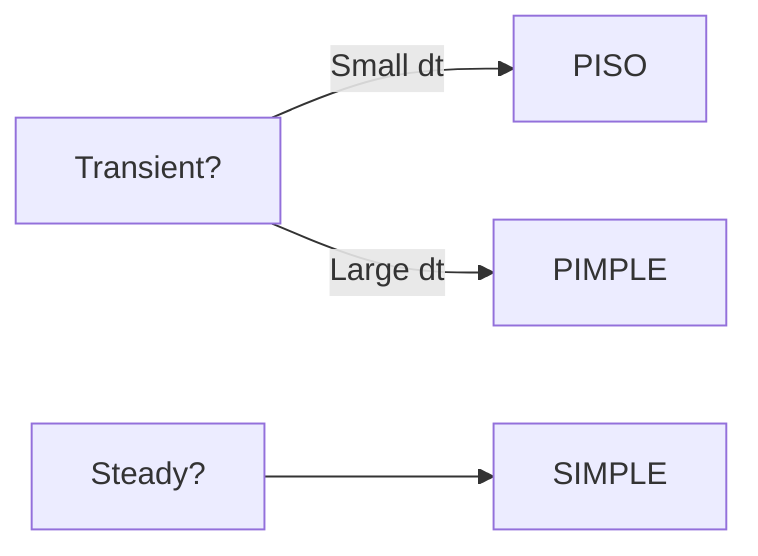

# PISO and PIMPLE Algorithms

Transient Pressure-Velocity Coupling

---

## Overview

| Algorithm | Use Case | Max Co |
|-----------|----------|--------|
| **PISO** | High temporal accuracy | < 1 |
| **PIMPLE** | Large time steps, robustness | > 1 possible |



---

## 1. PISO Algorithm

**P**ressure **I**mplicit with **S**plitting of **O**perators

### Key Characteristics

- No under-relaxation needed
- Second-order temporal accuracy
- Requires $Co < 1$

### fvSolution Settings

```cpp
PISO
{
    nCorrectors              2;    // Pressure corrections per step
    nNonOrthogonalCorrectors 0;    // For non-orthogonal meshes
    pRefCell                 0;
    pRefValue                0;
}
```

### Algorithm Steps

1. **Momentum Predictor**: Solve U with $p^n$
2. **Pressure Correction** (repeat `nCorrectors` times):
   - Solve pressure equation
   - Correct velocity: $\mathbf{u}^{i+1} = \mathbf{u}^i - \frac{\Delta t}{a_P}\nabla p'$
   - Update flux

---

## 2. PIMPLE Algorithm

**P**ISO + S**IMPLE** merged

### Key Characteristics

- Outer loops with relaxation
- Inner PISO corrections
- Allows $Co > 1$

### fvSolution Settings

```cpp
PIMPLE
{
    nOuterCorrectors         2;    // SIMPLE-like outer loops
    nCorrectors              2;    // PISO inner corrections
    nNonOrthogonalCorrectors 1;
    
    residualControl
    {
        p       1e-5;
        U       1e-5;
    }
}

relaxationFactors
{
    fields    { p 0.3; }
    equations { U 0.7; "(k|epsilon)" 0.7; }
}
```

### Nested Loop Structure

```
while (time loop)
    for (outer = 1 to nOuterCorrectors)  // SIMPLE-like
        Solve momentum (with relaxation)
        for (inner = 1 to nCorrectors)    // PISO
            Solve pressure
            Correct velocity
```

---

## 3. Comparison

| Feature | PISO | PIMPLE |
|---------|------|--------|
| Relaxation | Not needed | Required in outer loop |
| Courant limit | Co < 1 | Co > 1 possible |
| Temporal accuracy | 2nd order | 1st-2nd order |
| Computational cost/step | Lower | Higher |
| Robustness | Lower | Higher |
| Best for | LES, DNS | Industrial, VOF |

---

## 4. When to Use

| Scenario | Algorithm | Settings |
|----------|-----------|----------|
| LES/DNS | PISO | `nCorrectors 3`, Co < 0.5 |
| Vortex shedding | PISO | `nCorrectors 3` |
| VOF multiphase | PIMPLE | `nOuterCorrectors 3-5` |
| Moving mesh | PIMPLE | `nOuterCorrectors 2-4` |
| Large time steps | PIMPLE | `nOuterCorrectors 2+` |

---

## 5. VOF-Specific Settings

```cpp
PIMPLE
{
    nOuterCorrectors    3;
    nCorrectors         2;
    nAlphaCorr          1;      // Phase fraction corrections
    nAlphaSubCycles     2;      // Sub-cycling for interface
    
    maxCo               1.0;
    maxAlphaCo          0.5;    // Interface Courant limit
}
```

---

## 6. Troubleshooting

| Problem | Solution |
|---------|----------|
| Divergence (PISO) | Reduce $\Delta t$, increase `nCorrectors` |
| Divergence (PIMPLE) | Lower relaxation, increase `nOuterCorrectors` |
| Poor temporal accuracy | Reduce `nOuterCorrectors`, lower Co |
| Slow convergence | Use `residualControl` to exit early |

---

## Concept Check

<details>
<summary><b>1. ทำไม PISO ไม่ต้องใช้ under-relaxation?</b></summary>

เพราะ PISO ใช้ **multiple pressure corrections** ใน time step เดียว — corrections เหล่านี้ทำให้ velocity และ pressure converge โดยไม่ต้อง damp การเปลี่ยนแปลง
</details>

<details>
<summary><b>2. `nOuterCorrectors = 1` ใน PIMPLE เหมือนอะไร?</b></summary>

เหมือน **PISO** — ไม่มี outer relaxation loop แค่ทำ pressure corrections ตาม `nCorrectors`
</details>

<details>
<summary><b>3. ทำไม VOF ต้องใช้ `nAlphaSubCycles`?</b></summary>

เพราะ **interface** ต้องการ temporal resolution สูงกว่า momentum equation — sub-cycling ช่วยให้ใช้ time step ใหญ่สำหรับ momentum ขณะที่ track interface ด้วย step เล็กๆ
</details>

---

## Related Documents

- **บทก่อนหน้า:** [02_SIMPLE_Algorithm.md](02_SIMPLE_Algorithm.md)
- **บทถัดไป:** [04_Rhie_Chow_Interpolation.md](04_Rhie_Chow_Interpolation.md)