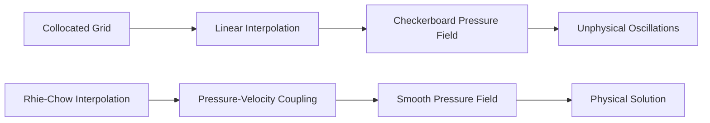

# Rhie-Chow Interpolation

## 🎯 ความสำคัญ

ใน OpenFOAM ซึ่งใช้การจัดวางตัวแปรแบบ **Collocated Grid** (ทั้งความเร็วและความดันถูกเก็บไว้ที่จุดศูนย์กลางเซลล์) หากใช้การประมาณค่าแบบ Linear ปกติจะเกิดปัญหา **Pressure-Velocity Decoupling** ซึ่งนำไปสู่สนามความดันที่แกว่งแบบตารางหมากรุก (Checkerboard oscillations)

**Rhie-Chow interpolation** (1983) เป็นเทคนิคที่ถูกพัฒนาขึ้นเพื่อแก้ปัญหานี้โดยเฉพาะ

---

## 📐 1. ปัญหา Checkerboard (The Checkerboard Problem)

เมื่อตัวแปรความดันถูกเก็บที่จุดศูนย์กลางเซลล์ เกรเดียนต์ความดันที่จุด $P$ ($\nabla p_P$) หากคำนวณจากเซลล์ข้างเคียง $W$ และ $E$ จะไม่รับรู้ถึงความแตกต่างของความดันระหว่างเซลล์ที่อยู่ติดกันโดยตรง:

$$\left( \frac{\partial p}{\partial x} \right)_P \approx \frac{p_E - p_W}{2\Delta x}$$

หาก $p$ มีลักษณะสลับฟันปลา (เช่น 10, 0, 10, 0) เกรเดียนต์ที่คำนวณได้จะเป็นศูนย์เสมอ ซึ่งไม่เป็นความจริงทางกายภาพ


> **Figure 1:** การเปรียบเทียบระหว่างผลลัพธ์จากการใช้การประมาณค่าแบบเชิงเส้นปกติ (Linear Interpolation) ซึ่งนำไปสู่ปัญหาการแยกตัวของความดันและความเร็ว (Checkerboard pattern) กับการใช้ Rhie-Chow Interpolation ที่ช่วยสร้างการเชื่อมโยงที่แข็งแกร่ง ส่งผลให้ได้สนามความดันที่เรียบและสอดคล้องกับหลักการทางฟิสิกส์บนเมชแบบ Collocated Grid
> **Figure 1:** การเปรียบเทียบระหว่างผลลัพธ์จากการใช้การประมาณค่าแบบเชิงเส้นปกติ (Linear Interpolation) ซึ่งนำไปสู่ปัญหาการแยกตัวของความดันและความเร็ว (Checkerboard pattern) กับการใช้ Rhie-Chow Interpolation ที่ช่วยสร้างการเชื่อมโยงที่แข็งแกร่ง ส่งผลให้ได้สนามความดันที่เรียบและสอดคล้องกับหลักการทางฟิสิกส์บนเมชแบบ Collocated Grid

---

## 🔢 2. การกำหนดสูตรทางคณิตศาสตร์

### 2.1 สูตร Rhie-Chow พื้นฐาน

Rhie-Chow เสนอให้คำนวณความเร็วที่หน้าเซลล์ ($\mathbf{u}_f$) โดยการเพิ่มเทอม Numerical Diffusion ที่ขึ้นกับเกรเดียนต์ความดัน:

$$\mathbf{u}_f = \overline{\mathbf{u}}_f - \mathbf{D}_f (\nabla p_f - \overline{\nabla p}_f) \tag{2.1}$$

**นิยามตัวแปร:**
- $\overline{\mathbf{u}}_f$: ความเร็วที่หน้าเซลล์จากการเฉลี่ยแบบปกติ (Linear interpolation)
- $\mathbf{D}_f = \overline{\left(\frac{1}{a_P}\right)}_f$: สัมประสิทธิ์การแพร่ประสิทธิผลที่หน้าเซลล์
- $\nabla p_f$: เกรเดียนต์ความดันที่คำนวณที่หน้าเซลล์โดยตรง (Compact stencil)
- $\overline{\nabla p}_f$: เกรเดียนต์ความดันจากการเฉลี่ยเกรเดียนต์ที่จุดศูนย์กลางเซลล์

**ความหมายทางกายภาพ:** เทอมในวงเล็บแสดงถึงความแตกต่างระหว่างเกรเดียนต์ "จริง" ที่หน้าเซลล์ กับเกรเดียนต์ "เฉลี่ย" หากค่าทั้งสองเท่ากัน เทอมนี้จะเป็นศูนย์

### 2.2 การอนุพันธ์จากสมการโมเมนตัม

เริ่มจากสมการโมเมนตัมที่ถูกทำให้เป็นดิสครีต:

$$a_P \mathbf{u}_P + \sum_N a_N \mathbf{u}_N = \mathbf{b}_P - (\nabla p)_P$$

จัดเรียงใหม่เพื่อแสดงความเร็ว:

$$\mathbf{u}_P = \frac{\mathbf{b}_P - \sum_N a_N \mathbf{u}_N}{a_P} - \frac{1}{a_P}(\nabla p)_P$$

กำหนด **H-operator**:

$$\mathbf{H}(\mathbf{u}) = \frac{\mathbf{b}_P - \sum_N a_N \mathbf{u}_N}{a_P}$$

ดังนั้น:

$$\mathbf{u}_P = \mathbf{H}(\mathbf{u}) - \frac{1}{a_P}(\nabla p)_P \tag{2.2}$$

สำหรับความเร็วที่หน้าเซลล์:

$$\mathbf{u}_f = \mathbf{H}_f - \left(\frac{1}{a_P}\right)_f (\nabla p)_f$$

ใช้การประมาณค่า Rhie-Chow:

$$\mathbf{u}_f = \overline{\mathbf{H}}_f - \overline{\left(\frac{1}{a_P}\right)}_f \left[ \overline{(\nabla p)}_f - \left( \overline{(\nabla p)}_f - (\nabla p)_f \right) \right]$$

ซึ่งนำไปสู่รูปแบบสุดท้าย:

$$\mathbf{u}_f = \overline{\mathbf{u}}_f - \mathbf{D}_f (\nabla p_f - \overline{\nabla p}_f)$$

### 2.3 ความสัมพันธ์กับสมการความดัน

การใช้ Rhie-Chow interpolation ทำให้ได้สมการความดันที่แข็งแกร่ง:

$$\nabla \cdot \left( \frac{1}{a_P} \nabla p' \right) = \nabla \cdot \mathbf{u}^*$$

เมื่อใช้ความเร็วที่หน้าเซลล์จาก Rhie-Chow:

$$\phi_f = \mathbf{u}_f \cdot \mathbf{S}_f = \left[ \overline{\mathbf{u}}_f - \mathbf{D}_f (\nabla p_f - \overline{\nabla p}_f) \right] \cdot \mathbf{S}_f$$

---

## 💻 3. การนำไปใช้ใน OpenFOAM

### 3.1 โครงสร้างการนำไปใช้งาน

ใน OpenFOAM, Rhie-Chow ถูกนำมาใช้โดยปริยายผ่านการสร้าง **Flux ($\phi$)** ที่หน้าเซลล์ ซึ่งมักพบในไฟล์ `pEqn.H`:

```cpp
// 1. คำนวณ rAU (1/aP)
volScalarField rAU(1.0/UEqn.A());

// 2. คำนวณ HbyA (H/aP)
volVectorField HbyA(constrainHbyA(rAU*UEqn.H(), U, p));

// 3. สร้าง Flux (phi) พร้อม Rhie-Chow correction
surfaceScalarField phiHbyA
(
    "phiHbyA",
    fvc::flux(HbyA) // การทำ interpolate(HbyA) & Sf()
  + fvc::interpolate(rAU)*fvc::ddtCorr(U, phi) // Correction term
);

// 4. แก้สมการความดันโดยใช้ Laplacian
fvScalarMatrix pEqn
(
    fvm::laplacian(rAU, p) == fvc::div(phiHbyA)
);
```

### 3.2 รายละเอียดการทำงานของฟังก์ชัน

#### `fvc::flux(HbyA)`

ฟังก์ชันนี้ทำการประมาณค่า HbyA ไปยังหน้าเซลล์และคำนวณ flux:

```cpp
tmp<surfaceScalarField> flux(const volVectorField& vvf)
{
    return fvc::interpolate(vvf) & mesh.Sf();
}
```

ซึ่งเทียบเท่ากับ:
$$\phi_f = \overline{\mathbf{H}}_f \cdot \mathbf{S}_f$$

#### `fvc::ddtCorr(U, phi)`

ฟังก์ชันนี้คำนวณเทอมแก้ไขเชิงเวลาสำหรับ transient cases:

```cpp
tmp<surfaceScalarField> ddtCorr
(
    const volVectorField& U,
    const surfaceScalarField& phi
)
{
    volScalarField rUA = 1.0/UEqn.A();
    surfaceScalarField rUAf = fvc::interpolate(rUA);

    return fvc::interpolate(rUA) * (fvc::ddt(phi) - fvc::div(phi));
}
```

### 3.3 การนำไปใช้ใน Pressure Correction Loop

```cpp
// Pressure correction loop with Rhie-Chow
while (piso.correct())
{
    // สร้าง flux พร้อม Rhie-Chow correction
    surfaceScalarField phiHbyA
    (
        "phiHbyA",
        fvc::flux(HbyA)
      + fvc::interpolate(rAU)*fvc::ddtCorr(U, phi)
    );

    // แก้สมการความดัน
    fvScalarMatrix pEqn
    (
        fvm::laplacian(rAUf, p) == fvc::div(phiHbyA)
    );

    pEqn.setReference(pRefCell, pRefValue);
    pEqn.solve();

    // แก้ไข flux ด้วย pressure correction
    phi = phiHbyA - pEqn.flux();

    // แก้ไขความเร็ว
    U -= rAU*fvc::grad(p);
    U.correctBoundaryConditions();
}
```

### 3.4 การนำไปใช้ใน `fvc::interpolate`

ภายใน OpenFOAM, การประมาณค่าที่หน้าเซลล์มีการใช้ Rhie-Chow interpolation โดยอัตโนมัติสำหรับฟิลด์ความเร็ว:

```cpp
// In interpolate.C - Rhie-Chow interpolation
template<class Type>
tmp<GeometricField<Type, fvsPatchField, surfaceMesh>>
interpolate
(
    const GeometricField<Type, fvPatchField, volMesh>& vf,
    const surfaceScalarField& faceFlux
)
{
    // Rhie-Chow interpolation implementation
    tmp<GeometricField<Type, fvsPatchField, surfaceMesh>> tinterp
    (
        new GeometricField<Type, fvsPatchField, surfaceMesh>
        (
            IOobject
            (
                "interpolate(" + vf.name() + ')',
                vf.instance(),
                vf.db(),
                IOobject::NO_READ,
                IOobject::NO_WRITE
            ),
            vf.mesh(),
            dimensioned<Type>("0", vf.dimensions(), 0)
        )
    );

    // Rhie-Chow interpolation logic
    // Prevents checkerboard patterns
    // Maintains coupling between pressure and velocity
    // Implementation details...

    return tinterp;
}
```

### 3.5 การใช้งานร่วมกับ Non-Orthogonal Mesh

สำหรับ Mesh ที่ไม่ตั้งฉาก จะมีการเพิ่มเทอมแก้ไข:

```cpp
// Non-orthogonal correction loop
for (int nonOrth = 0; nonOrth <= nNonOrthogonalCorrectors; nonOrth++)
{
    fvScalarMatrix pEqn
    (
        fvm::laplacian(rAUf, p) == fvc::div(phiHbyA)
    );

    if (nonOrth == nNonOrthogonalCorrectors)
    {
        pEqn.setReference(pRefCell, pRefValue);
    }

    pEqn.solve(mesh.solver(p.select(piso.finalInnerIter())));

    if (nonOrth == nNonOrthogonalCorrectors)
    {
        phi = phiHbyA - pEqn.flux();
    }
}
```

---

## 📊 4. การวิเคราะห์และการประเมินผล

### 4.1 การเปรียบเทียบกับ Staggered Grid

| คุณสมบัติ | Staggered Grid | Collocated with Rhie-Chow |
|-----------|----------------|---------------------------|
| **การจัดเรียงตัวแปร** | ความดันที่ center, ความเร็วที่ faces | ทั้งคู่ที่ center |
| **ปัญหา Checkerboard** | ไม่เกิดโดยธรรมชาติ | ต้องใช้ Rhie-Chow |
| **ความซับซ้อนของโค้ด** | สูง (หลาย data structures) | ต่ำ (single data structure) |
| **ความยืดหยุ่น Mesh** | จำกัด (ส่วนใหญ่ structured) | สูง (unstructured ได้) |
| **ความแม่นยำ** | เทียบเท่า | เทียบเท่า |

### 4.2 การประเมินคุณภาพการแก้ปัญหา

**เกณฑ์ความสำเร็จ:**
1. **Smoothness**: สนามความดันต้องเรียบและไม่มีการแกว่ง
2. **Convergence**: การลู่เข้าของ solver ต้องเสถียร
3. **Mass Conservation**: การอนุรักษ์มวลต้องเป็นไปตามสมการความต่อเนื่อง
4. **Accuracy**: ความแม่นยำต้องเป็นอันดับสอง

### 4.3 การวิเคราะห์ข้อผิดพลาด

ข้อผิดพลาดจาก Rhie-Chow interpolation:

$$\epsilon_{RC} = \mathcal{O}(\Delta x^2) + \mathcal{O}(\Delta x^3 \frac{\partial^3 p}{\partial x^3})$$

สำหรับกริดที่สม่ำเสมอ เทอมหลักเป็นอันดับสอง ซึ่งสอดคล้องกับการประมาณค่าแบบ linear

---

## ✅ 5. ประโยชน์และข้อจำกัด

### 5.1 ประโยชน์

1. **ขจัด Checkerboard oscillations**: ทำให้สนามความดันเรียบและลู่เข้าได้ง่าย
2. **รักษาความแม่นยำ**: ยังคงความแม่นยำระดับอันดับสอง (Second-order accuracy)
3. **รองรับ Unstructured Mesh**: สามารถใช้งานได้กับ Mesh ที่ซับซ้อนใน OpenFOAM ได้อย่างมีประสิทธิภาพ
4. **ความเรียบง่ายในการนำไปใช้**: ไม่ต้องการ data structures แบบ staggered
5. **รักษาการอนุรักษ์มวล**: ทำให้การคำนวณ flux สอดคล้องกับสมการความต่อเนื่อง

### 5.2 ข้อจำกัด

1. **Numerical Diffusion**: การเพิ่มเทอม correction อาจเพิ่ม numerical diffusion
2. **ความไวต่อคุณภาพ Mesh**: ผลลัพธ์ขึ้นอยู่กับคุณภาพของ Mesh อย่างมาก
3. **Complexity ในการนำไปใช้**: ต้องเข้าใจรายละเอียดของการทำ interpolation อย่างลึกซึ้ง
4. **การปรับแต่งพารามิเตอร์**: บางครั้งต้องปรับเทอม correction สำหรับกรณีเฉพาะ

---

## 🔍 6. แนวทางปฏิบัติที่ดีที่สุด

### 6.1 การตรวจสอบคุณภาพ

```bash
# ตรวจสอบคุณภาพ Mesh
checkMesh -allGeometry -allTopology

# ตรวจสอบค่า orthogonality
checkMesh -ortho
```

**เกณฑ์ที่แนะนำ:**
- Non-orthogonality < 70°
- Skewness < 2
- Aspect ratio < 1000

### 6.2 การตั้งค่า Solver

```cpp
// ใน fvSolution
PIMPLE
{
    nCorrectors 2;
    nNonOrthogonalCorrectors 1;  // เพิ่มสำหรับ non-orthogonal mesh
    pRefCell 0;
    pRefValue 0;
}

// ใน fvSchemes สำหรับ interpolation schemes
interpolationSchemes
{
    interpolate(HbyA) linear;  // ใช้ linear interpolation
}
```

### 6.3 การแก้ไขปัญหา

| ปัญหา | อาการ | แนวทางแก้ไข |
|--------|---------|---------------|
| **Checkerboard patterns** | สนามความดันแกว่ง | ตรวจสอบว่า Rhie-Chow ถูกนำไปใช้อย่างถูกต้อง |
| **Slow convergence** | Residual ลดช้า | ปรับค่า under-relaxation หรือเพิ่ม nCorrectors |
| **Mass imbalance** | Flux ไม่สอดคล้อง | ตรวจสอบ boundary conditions และ mesh quality |
| **Divergence** | Solver ไม่ลู่เข้า | ลด time step หรือปรับ mesh quality |

---

## 📚 7. ตัวอย่างการนำไปใช้

### 7.1 กรณีศึกษา: Lid-Driven Cavity

```cpp
// ใน pEqn.H สำหรับ lid-driven cavity
volScalarField rAU(1.0/UEqn.A());
volVectorField HbyA(constrainHbyA(rAU*UEqn.H(), U, p));

surfaceScalarField phiHbyA
(
    "phiHbyA",
    fvc::flux(HbyA)
  + fvc::interpolate(rAU)*fvc::ddtCorr(U, phi)
);

fvScalarMatrix pEqn
(
    fvm::laplacian(rAU, p) == fvc::div(phiHbyA)
);

pEqn.setReference(pRefCell, pRefValue);
pEqn.solve();

phi = phiHbyA - pEqn.flux();
```

### 7.2 การติดตามผลลัพธ์

```python
# Python script สำหรับติดตามความเรียบของสนามความดัน
import numpy as np
import matplotlib.pyplot as plt

# อ่านความดันจาก OpenFOAM
p = np.loadtxt('postProcessing/pressureField/0/p')

# ตรวจสอบความเรียบ
gradient_p = np.gradient(p)
smoothness = np.std(gradient_p)

plt.plot(p)
plt.title(f'Pressure Field (Smoothness: {smoothness:.2e})')
plt.xlabel('Cell Index')
plt.ylabel('Pressure (Pa)')
plt.grid(True)
plt.show()
```

---

## 🔗 8. การเชื่อมโยงกับ Algorithm การเชื่อมโยงความดัน-ความเร็ว

### 8.1 การใช้ใน SIMPLE Algorithm

```cpp
// SIMPLE ใช้ Rhie-Chow ในทุกการวนซ้ำ
while (simple.loop())
{
    // Momentum prediction
    solve(UEqn == -fvc::grad(p));

    // Rhie-Chow flux calculation
    volScalarField rAU(1.0/UEqn.A());
    surfaceScalarField phiHbyA(fvc::flux(HbyA) + fvc::interpolate(rAU)*fvc::ddtCorr(U, phi));

    // Pressure correction
    fvScalarMatrix pEqn(fvm::laplacian(rAU, p) == fvc::div(phiHbyA));
    pEqn.solve();

    // Flux correction
    phi = phiHbyA - pEqn.flux();
}
```

### 8.2 การใช้ใน PISO Algorithm

```cpp
// PISO ใช้ Rhie-Chow ในทุกการแก้ไข
for (int corr = 0; corr < nCorrectors; corr++)
{
    // Rhie-Chow flux
    surfaceScalarField phiHbyA(fvc::flux(HbyA) + fvc::interpolate(rAU)*fvc::ddtCorr(U, phi));

    // Pressure correction
    fvScalarMatrix pEqn(fvm::laplacian(rAUf, p) == fvc::div(phiHbyA));
    pEqn.solve();

    // Flux update
    phi = phiHbyA - pEqn.flux();
}
```

---

## 📖 9. บทสรุป

**Rhie-Chow interpolation** เป็นเทคนิคสำคัญใน OpenFOAM ที่ทำให้การจำลอง CFD บน collocated grid เป็นไปได้อย่างมีประสิทธิภาพ:

1. **แก้ปัญหา Checkerboard**: ป้องกันการแกว่งของสนามความดัน
2. **รักษาความแม่นยำ**: ยังคงความแม่นยำอันดับสอง
3. **รองรับ Mesh ซับซ้อน**: ใช้ได้กับ unstructured mesh
4. **นำไปใช้โดยอัตโนมัติ**: มีการใช้งานใน OpenFOAM โดยปริยาย

การทำความเข้าใจ Rhie-Chow interpolation เป็นสิ่งสำคัญสำหรับการทำ CFD การจำลองที่เสถียรและแม่นยำ

---

**หัวข้อถัดไป**: [[การเปรียบเทียบอัลกอริทึมต่างๆ]](./05_Algorithm_Comparison.md)
