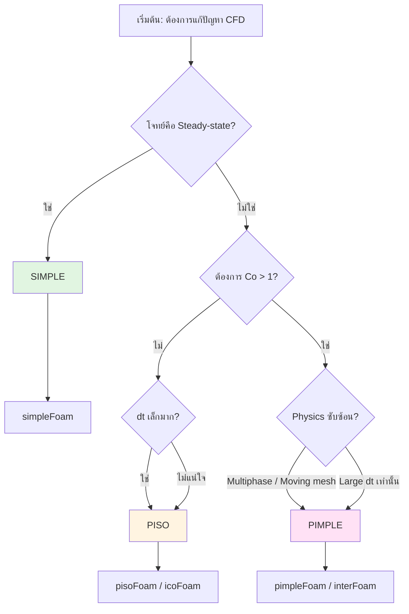

# Algorithm Comparison

**ทำไมต้องเข้าใจการเลือก Algorithm?**

การเลือก pressure-velocity coupling algorithm ที่เหมาะสมเป็นจุดเริ่มต้นที่สำคัญที่สุดในการตั้งค่าการจำลอง OpenFOAM ของคุณ การเลือกผิดพลาดอาจนำไปสู่การจำลองที่ไม่เสถียร ใช้เวลาคำนวณนานเกินไป หรือให้ผลลัพธ์ที่ไม่ถูกต้อง ไฟล์นี้จะช่วยให้คุณตัดสินใจได้อย่างมั่นใจว่าควรใช้ SIMPLE, PISO หรือ PIMPLE สำหรับปัญหาของคุณ พร้อมลิงก์ไปยังการตั้งค่าโดยละเอียดในแต่ละไฟล์

---

## 🎯 Learning Objectives

หลังจากอ่านบทนี้ คุณจะสามารถ:

1. **เลือก** algorithm ที่เหมาะสม (SIMPLE/PISO/PIMPLE) จากลักษณะของปัญหา
2. **ประเมิน** trade-off ระหว่างเสถียรภาพ ความแม่นยำ และประสิทธิภาพการคำนวณ
3. **ทำความเข้าใจ** ความแตกต่างของพารามิเตอร์หลัก (nCorrectors, nOuterCorrectors, under-relaxation)
4. **แก้ไข** ปัญหาความไม่เสถียรและการลู่เข้าที่ไม่ดีด้วยการปรับแต่งที่เหมาะสม

---

## 📋 Quick Reference

| Algorithm | Type | Under-Relaxation | Max Co | Typical Use |
|-----------|------|------------------|--------|-------------|
| **SIMPLE** | Steady-state | Required | N/A | Industrial steady flows |
| **PISO** | Transient | No | < 1 | LES/DNS, accurate time resolution |
| **PIMPLE** | Transient | Outer loop | > 1 | Large dt, multiphase, moving mesh |

---

## 🔍 Decision Flowchart



---

## 📊 Algorithm Selection Guide

### 1. SIMPLE (Steady-State)

**เลือกใช้เมื่อ:**
- แก้ปัญหา steady-state (ที่สุดของ time evolution)
- การแก้โจทย์อุตสาหกรรมที่ต้องการคำตอบสุดท้าย
- ไม่สนใจ temporal evolution

**ข้อดี:**
- Memory usage ต่ำสุด
- Cost per iteration ต่ำสุด
- เสถียรด้วย under-relaxation

**📖 ดูรายละเอียด:** [02_SIMPLE_Algorithm.md](02_SIMPLE_Algorithm.md) → การตั้งค่า `relaxationFactors`, `residualControl`, และ troubleshooting

---

### 2. PISO (Transient)

**เลือกใช้เมื่อ:**
- Transient simulation ด้วย small time step
- Co < 1 (Courant number น้อยกว่า 1)
- LES/DNS ที่ต้องการ temporal accuracy สูง
- ไม่ต้องการ under-relaxation

**ข้อดี:**
- 2nd order temporal accuracy (เมื่อ dt เล็ก)
- Cost per iteration ปานกลาง
- เหมาะกับ unsteady physics

**📖 ดูรายละเอียด:** [03_PISO_and_PIMPLE_Algorithms.md](03_PISO_and_PIMPLE_Algorithms.md) → การตั้งค่า `nCorrectors`, `nNonOrthogonalCorrectors`, และ convergence criteria

---

### 3. PIMPLE (Robust Transient)

**เลือกใช้เมื่อ:**
- ต้องการ large time steps (Co >> 1)
- Multiphase flows (VOF, Eulerian)
- Moving mesh (F SI, dynamic meshes)
- Buoyancy-driven flows ที่ coupling แรง

**ข้อดี:**
- เสถียรที่สุด (outer correctors + relaxation)
- ยืดหยุ่น: ลด outer correctors เพื่อเร็วขึ้น
- ใช้ได้กับ Co ทุกค่า

**📖 ดูรายละเอียด:** [03_PISO_and_PIMPLE_Algorithms.md](03_PISO_and_PIMPLE_Algorithms.md) → การตั้งค่า `nOuterCorrectors`, residual control, และ parameter guidelines

---

## 🎯 Solver Selection Matrix

| Problem Type | Algorithm | OpenFOAM Solver |
|--------------|-----------|-----------------|
| Steady incompressible | SIMPLE | `simpleFoam` |
| Steady compressible | SIMPLE | `rhoSimpleFoam` |
| Transient laminar | PISO | `icoFoam` |
| Transient turbulent | PISO | `pisoFoam` |
| Large dt / multiphase | PIMPLE | `pimpleFoam` |
| VOF (free surface) | PIMPLE | `interFoam` |
| Buoyancy | PIMPLE | `buoyantPimpleFoam` |
| Compressible transient | PIMPLE | `rhoPimpleFoam` |

---

## ⚙️ Performance Trade-offs

| Metric | SIMPLE | PISO | PIMPLE |
|--------|--------|------|--------|
| **Memory** | 🟢 Low | 🟡 Medium | 🔴 High |
| **Cost/iteration** | 🟢 Lowest | 🟡 Medium | 🔴 Highest |
| **Stability** | 🟢 High | 🟡 Medium | 🟢 Highest |
| **Time accuracy** | ⚪ None | 🟢 2nd order | 🟡 1st-2nd order |
| **Ease of use** | 🟢 Easy | 🟡 Medium | 🔴 Complex |

---

## 🔧 Common Issues & Quick Fixes

### SIMPLE: Residuals oscillating / diverging

```
ลด relaxation factors:
p: 0.3 → 0.2
U: 0.7 → 0.5
```

→ 📖 ดู troubleshooting แบบละเอียด: [02_SIMPLE_Algorithm.md](02_SIMPLE_Algorithm.md)

---

### PISO: Divergence at first iteration

```
1. ลด maxCo: 0.5 → 0.3
2. เพิ่ม nCorrectors: 2 → 3
3. ตรวจสอบ mesh quality (non-orthogonality)
```

→ 📖 ดู troubleshooting แบบละเอียด: [03_PISO_and_PIMPLE_Algorithms.md](03_PISO_and_PIMPLE_Algorithms.md)

---

### PIMPLE: Slow convergence

```
1. เพิ่ม nOuterCorrectors: 2 → 3
2. เพิ่ม residual control เพื่อ early exit
3. ตรวจสอบว่า coupling variables ถูกต้อง
```

→ 📖 ดู troubleshooting แบบละเอียด: [03_PISO_and_PIMPLE_Algorithms.md](03_PISO_and_PIMPLE_Algorithms.md)

---

## 📚 Concept Check

<details>
<summary><b>1. เมื่อไหร่ควรใช้ PIMPLE แทน PISO?</b></summary>

เมื่อคุณต้องการใช้ time step ที่ใหญ่ (Co > 1) หรือแก้โจทย์ที่มี physics ซับซ้อน (multiphase flows, moving meshes, strong buoyancy coupling) — PIMPLE ใช้ outer correctors เพื่อทำการ converge ภายในแต่ละ time step และ under-relaxation เพื่อเสถียรภาพ แลกกับ computational cost ที่สูงขึ้น

</details>

<details>
<summary><b>2. ทำไม SIMPLE จึงต้องใช้ under-relaxation?</b></summary>

เพราะ SIMPLE algorithm แก้ momentum equation และ pressure equation แยกกัน (segregated approach) — การอัปเดตค่าใหม่อาจทำให้ solution "overshoot" และ diverge ได้ง่าย — under-relaxation จำกัดการเปลี่ยนแปลงต่อ iteration เพื่อให้การ iterate ลู่เข้าสู่ solution ได้อย่างราบรื่น

</details>

<details>
<summary><b>3. nCorrectors กับ nOuterCorrectors ต่างกันอย่างไร?</b></summary>

- **nCorrectors:** จำนวน pressure corrections ต่อ 1 outer loop (PISO part)
- **nOuterCorrectors:** จำนวน SIMPLE-like iterations ต่อ 1 time step

Total pressure solves = nOuterCorrectors × nCorrectors

ตัวอย่าง: ถ้า nOuterCorrectors = 3, nCorrectors = 2 → 6 pressure solves ต่อ time step

</details>

---

## 📑 Related Documents

### Deep Dives
- **SIMPLE Details:** [02_SIMPLE_Algorithm.md](02_SIMPLE_Algorithm.md) — การตั้งค่าโดยละเอียด, convergence criteria, troubleshooting
- **PISO Details:** [03_PISO_and_PIMPLE_Algorithms.md](03_PISO_and_PIMPLE_Algorithms.md) — การตั้งค่า nCorrectors, Co guidelines
- **PIMPLE Details:** [03_PISO_and_PIMPLE_Algorithms.md](03_PISO_and_PIMPLE_Algorithms.md) — การตั้งค่า nOuterCorrectors, residual control, parameter trade-offs

### Context
- **Overview:** [00_Overview.md](00_Overview.md) — ภาพรวม pressure-velocity coupling ใน OpenFOAM
- **Mathematical Foundation:** [01_Mathematical_Foundation.md](01_Mathematical_Foundation.md) — คณิตศาสตร์ของ pressure equation, Rhie-Chow interpolation
- **Rhie-Chow Interpolation:** [04_Rhie_Chow_Interpolation.md](04_Rhie_Chow_Interpolation.md) — ปัญหา checkerboarding, flux formulation

### Module Integration
- **Solvers:** [01_INCOMPRESSIBLE_FLOW_SOLVERS](../01_INCOMPRESSIBLE_FLOW_SOLVERS/02_Standard_Solvers.md) — การเลือก solver ที่เหมาะสมกับ algorithm
- **Simulation Control:** [01_INCOMPRESSIBLE_FLOW_SOLVERS/03_Simulation_Control.md](../01_INCOMPRESSIBLE_FLOW_SOLVERS/03_Simulation_Control.md) — time step control, maxCo settings
- **Turbulence:** [03_TURBULENCE_MODELING](../03_TURBULENCE_MODELING/00_Overview.md) — ผลกระทบของ turbulence modeling ต่อ convergence

---

## 🎯 Key Takeaways

### ✅ สรุปสำคัญ

1. **SIMPLE = Steady:** ใช้เมื่อต้องการ solution สุดท้ายไม่สนใจ time history — ต้องมี under-relaxation

2. **PISO = Transient + Small dt:** ใช้เมื่อต้องการ temporal accuracy สูง (LES/DNS) — Co < 1

3. **PIMPLE = Robust Transient:** ใช้เมื่อต้องการ large dt หรือ physics ซับซ้อน — Co สามารถ >> 1

4. **Parameter Hierarchy:**
   - SIMPLE: `relaxationFactors` > `residualControl`
   - PISO: `nCorrectors` > `maxCo` (must be < 1)
   - PIMPLE: `nOuterCorrectors` > `nCorrectors` > `residualControl`

5. **Troubleshooting First Steps:**
   - Oscillating SIMPLE → ลด relaxation
   - Diverging PISO → ลด maxCo หรือเพิ่ม nCorrectors
   - Slow PIMPLE → เพิ่ม nOuterCorrectors + residual control

### 🎓 Next Steps

- ดู [00_Overview.md](00_Overview.md) สำหรับภาพรวม pressure-velocity coupling
- เลือกอ่าน algorithm detail ที่คุณสนใจ:
  - SIMPLE: [02_SIMPLE_Algorithm.md](02_SIMPLE_Algorithm.md)
  - PISO/PIMPLE: [03_PISO_and_PIMPLE_Algorithms.md](03_PISO_and_PIMPLE_Algorithms.md)
- ศึกษา [01_Mathematical_Foundation.md](01_Mathematical_Foundation.md) หากต้องการทำความเข้าใจคณิตศาสตร์เบื้องหลัง