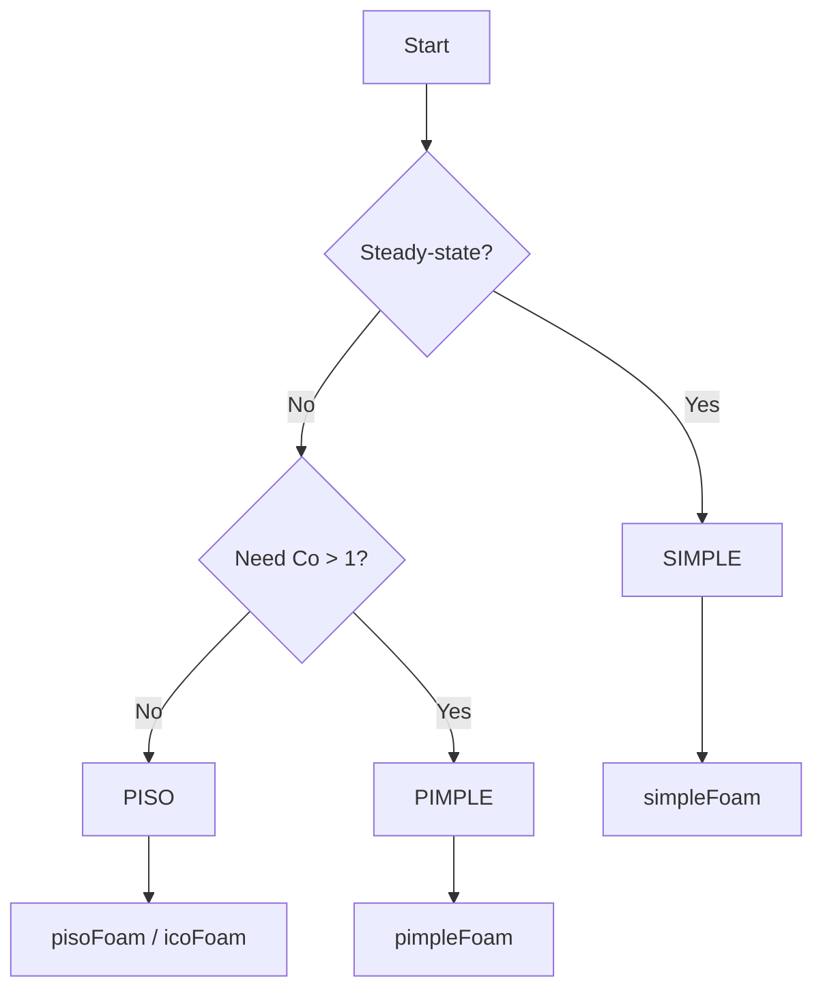

# Algorithm Comparison

เปรียบเทียบ SIMPLE, PISO, PIMPLE สำหรับ Pressure-Velocity Coupling

---

## Quick Reference

| Algorithm | Type | Under-Relaxation | Max Co |
|-----------|------|------------------|--------|
| **SIMPLE** | Steady | Required | N/A |
| **PISO** | Transient | No | < 1 |
| **PIMPLE** | Transient | Outer loop | > 1 |

---

## 1. SIMPLE (Steady-State)

### Use Case
- Steady-state simulations
- Industrial CFD

### Settings

```cpp
// system/fvSolution
SIMPLE
{
    nNonOrthogonalCorrectors 1;
    
    residualControl
    {
        p       1e-4;
        U       1e-4;
        "(k|epsilon|omega)" 1e-4;
    }
}

relaxationFactors
{
    fields
    {
        p       0.3;
    }
    equations
    {
        U       0.7;
        k       0.7;
        epsilon 0.7;
    }
}
```

### Relaxation Guidelines

| Variable | Stable | Fast |
|----------|--------|------|
| p | 0.2-0.3 | 0.4-0.5 |
| U | 0.5-0.6 | 0.7-0.8 |
| Turbulence | 0.5-0.7 | 0.7-0.9 |

---

## 2. PISO (Transient)

### Use Case
- Transient with small dt
- LES, DNS
- Accurate time resolution

### Settings

```cpp
// system/fvSolution
PISO
{
    nCorrectors              2;
    nNonOrthogonalCorrectors 1;
}

// system/controlDict
adjustTimeStep  yes;
maxCo           0.5;
```

### nCorrectors Selection

| Co Range | nCorrectors |
|----------|-------------|
| < 0.5 | 2 |
| 0.5-1.0 | 3 |
| Near 1.0 | 4 |

---

## 3. PIMPLE (Robust Transient)

### Use Case
- Large time steps (Co > 1)
- Multiphase flows
- Moving mesh

### Settings

```cpp
// system/fvSolution
PIMPLE
{
    nOuterCorrectors         2;
    nCorrectors              2;
    nNonOrthogonalCorrectors 1;
    
    residualControl
    {
        p       1e-4;
        U       1e-4;
    }
}

relaxationFactors
{
    fields  { p 0.3; }
    equations
    {
        U       0.7;
        k       0.7;
    }
}
```

### Parameter Guidelines

| Problem Type | nOuter | nCorr |
|--------------|--------|-------|
| Standard | 2 | 2 |
| Multiphase | 3-5 | 2 |
| Moving mesh | 2-4 | 3 |
| Large Co | 3-5 | 2-3 |

---

## 4. Decision Flowchart



---

## 5. Solver Selection

| Problem | Algorithm | Solver |
|---------|-----------|--------|
| Steady incompressible | SIMPLE | `simpleFoam` |
| Transient laminar | PISO | `icoFoam` |
| Transient turbulent | PISO | `pisoFoam` |
| Large dt / Multiphase | PIMPLE | `pimpleFoam` |
| VOF | PIMPLE | `interFoam` |
| Buoyancy | PIMPLE | `buoyantPimpleFoam` |

---

## 6. Convergence Issues

### SIMPLE: Oscillating residuals

```cpp
// Lower relaxation
relaxationFactors
{
    fields { p 0.2; }
    equations { U 0.5; }
}
```

### PISO: Divergence

```cpp
// Reduce time step
maxCo   0.3;

// Or add correctors
nCorrectors 3;
```

### PIMPLE: Slow convergence

```cpp
// Increase outer iterations
nOuterCorrectors 3;

// Add residual control
residualControl
{
    p   1e-3;  // Exit when reached
}
```

---

## 7. Performance Comparison

| Metric | SIMPLE | PISO | PIMPLE |
|--------|--------|------|--------|
| Memory | Low | Medium | High |
| Cost/iteration | Lowest | Medium | Highest |
| Stability | High | Medium | Highest |
| Time accuracy | None | 2nd order | 1st-2nd order |

---

## Concept Check

<details>
<summary><b>1. เมื่อไหร่ใช้ PIMPLE แทน PISO?</b></summary>

เมื่อต้องการ time step ใหญ่ (Co > 1) หรือ physics ซับซ้อน (multiphase, moving mesh) — PIMPLE ใช้ outer correctors + under-relaxation เพื่อเสถียรภาพ
</details>

<details>
<summary><b>2. ทำไม SIMPLE ต้องใช้ under-relaxation?</b></summary>

เพราะ SIMPLE แก้ momentum และ pressure แยกกัน → ค่าใหม่อาจ overshoot มาก → under-relaxation จำกัดการเปลี่ยนแปลงต่อ iteration เพื่อป้องกัน divergence
</details>

<details>
<summary><b>3. nCorrectors กับ nOuterCorrectors ต่างกันอย่างไร?</b></summary>

- **nCorrectors:** จำนวน pressure corrections ต่อ 1 outer loop (PISO-like)
- **nOuterCorrectors:** จำนวน SIMPLE-like iterations ต่อ 1 time step

Total pressure solves = nOuterCorrectors × nCorrectors
</details>

---

## Related Documents

- **SIMPLE Details:** [01_SIMPLE_Algorithm.md](01_SIMPLE_Algorithm.md)
- **PISO Details:** [02_PISO_Algorithm.md](02_PISO_Algorithm.md)
- **PIMPLE Details:** [03_PIMPLE_Algorithm.md](03_PIMPLE_Algorithm.md)