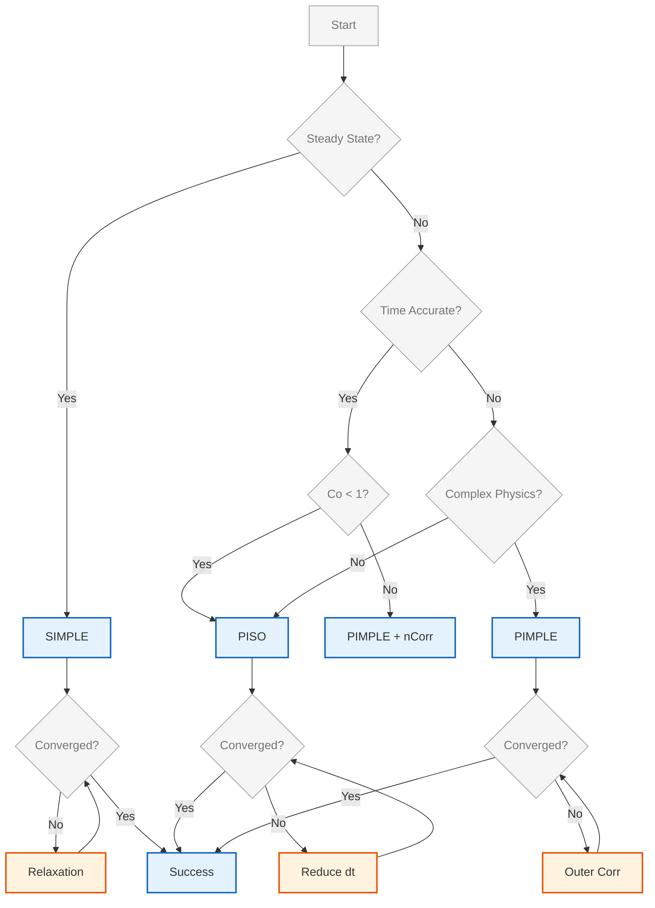

# การเปรียบเทียบอัลกอริทึมการเชื่อมโยงความดัน-ความเร็ว

เอกสารนี้ให้การวิเคราะห์เปรียบเทียบที่ครอบคลุมระหว่าง **SIMPLE**, **PISO** และ **PIMPLE Algorithms** สำหรับการเชื่อมโยงความดัน-ความเร็วใน OpenFOAM พร้อมด้วยแนวทางการเลือกใช้งาน การปรับแต่งพารามิเตอร์ และกรณีศึกษาจริง

---

## 📋 สารบัญ

1. [ภาพรวมอัลกอริทึม](#-ภาพรวมอัลกอริทึม)
2. [ตารางเปรียบเทียบครอบคลุม](#-ตารางเปรียบเทียบครอบคลุม)
3. [การวิเคราะห์เชิงลึกแต่ละอัลกอริทึม](#-การวิเคราะห์เชิงลึกแต่ละอัลกอริทึม)
4. [แนวทางการเลือกใช้งาน](#-แนวทางการเลือกใช้งาน)
5. [การปรับแต่งพารามิเตอร์](#-การปรับแต่งพารามิเตอร์)
6. [กรณีศึกษาและตัวอย่างประยุกต์](#-กรณีศึกษาและตัวอย่างประยุกต์)
7. [การวิเคราะห์ต้นทุนการคำนวณ](#-การวิเคราะห์ต้นทุนการคำนวณ)
8. [บทสรุป](#-บทสรุป)

---

## 🎯 ภาพรวมอัลกอริทึม

### ความท้าทายพื้นฐานของการเชื่อมโยงความดัน-ความเร็ว

สำหรับของไหลที่อัดตัวไม่ได้ (incompressible flow) สมการควบคุมคือ:

**สมการความต่อเนื่อง (Continuity):**
$$\nabla \cdot \mathbf{u} = 0$$

**สมการโมเมนตัม (Momentum):**
$$\rho \frac{\partial \mathbf{u}}{\partial t} + \rho (\mathbf{u} \cdot \nabla) \mathbf{u} = -\nabla p + \mu \nabla^2 \mathbf{u} + \mathbf{f}$$

โดยที่:
- $\mathbf{u}$ = เวกเตอร์ความเร็ว (velocity vector field)
- $p$ = สนามความดัน (pressure field)
- $\rho$ = ความหนาแน่นของไหล (fluid density)
- $\mu$ = ความหนืดจลน์ (dynamic viscosity)
- $\mathbf{f}$ = แรงภายนอก (body forces)

> [!INFO] ปัญหาการเชื่อมโยง
> ความดันปรากฏเฉพาะในรูปของเกรเดียนต์ในสมการโมเมนตัม และไม่มีสมการความดันโดยตรง ทำให้เกิดความจำเป็นในการใช้อัลกอริทึมพิเศษเพื่อเชื่อมโยงความดันและความเร็ว

### อัลกอริทึมหลักใน OpenFOAM

| อัลกอริทึม | ชื่อเต็ม | ประเภทปัญหาหลัก | OpenFOAM Solver |
|------------|-----------|------------------|----------------|
| **SIMPLE** | Semi-Implicit Method for Pressure-Linked Equations | สภาวะคงที่ (Steady-state) | `simpleFoam` |
| **PISO** | Pressure-Implicit with Splitting of Operators | สภาวะชั่วคราว (Transient) | `pisoFoam`, `icoFoam` |
| **PIMPLE** | Merged PISO-SIMPLE | สภาวะชั่วคราวแบบแข็งแกร่ง | `pimpleFoam`, `interFoam` |

---

## 📊 ตารางเปรียบเทียบครอบคลุม

### 1. ตารางเปรียบเทียบคุณลักษณะหลัก

| คุณสมบัติ | SIMPLE | PISO | PIMPLE |
|-----------|--------|------|---------|
| **ชื่อเต็ม** | Semi-Implicit Method for Pressure-Linked Equations | Pressure-Implicit with Splitting of Operators | Merged PISO-SIMPLE |
| **ประเภทปัญหา** | สภาวะคงที่ (Steady-state) | สภาวะชั่วคราว (Transient) | สภาวะชั่วคราวแบบแข็งแกร่ง |
| **ความแม่นยำเชิงเวลา** | ไม่สำคัญ (Pseudo-time) | อันดับ 2 (Second-order) | อันดับ 1-2 |
| **Under-relaxation** | จำเป็น ($\alpha_u < 1, \alpha_p < 1$) | ไม่ใช้ ($\alpha = 1$) | ใช้ใน Outer loops เท่านั้น |
| **การแก้ไขต่อขั้นตอน** | 1 ครั้ง | 2-4 ครั้ง (nCorrectors) | nOuter × nCorr |
| **ขีดจำกัด Courant Number** | ไม่มี (pseudo-time) | แนะนำ $Co < 1$ | อนุญาต $Co > 1$ |
| **กลไกความเสถียร** | Under-relaxation | การแก้ไขหลายครั้ง | Nested relaxation + corrections |
| **Memory Overhead** | ต่ำ | ปานกลาง | สูง |
| **ต้นทุนการคำนวณ** | ต่ำที่สุด | ปานกลาง | สูงที่สุดต่อ time step |
| **ความแข็งแกร่ง (Robustness)** | สูง | ต่ำ (ถ้า $\Delta t$ ใหญ่) | สูงมาก |
| **Solver หลัก** | `simpleFoam` | `pisoFoam`, `icoFoam` | `pimpleFoam`, `interFoam` |

### 2. การเปรียบเทียบรายละเอียด Under-Relaxation Factors

| อัลกอริทึม | Velocity ($\alpha_u$) | Pressure ($\alpha_p$) | Turbulence | เหตุผล |
|-------------|---------------------|---------------------|------------|---------|
| **SIMPLE** | 0.5 - 0.7 | 0.2 - 0.4 | 0.6 - 0.8 | ต้องการ relaxation เพื่อความเสถียร |
| **PISO** | 1.0 (no relaxation) | 1.0 (no relaxation) | 1.0 | เสถียรจากการแก้ไขหลายครั้ง |
| **PIMPLE** | 0.6 - 0.9 (outer) | 0.3 - 0.7 (outer) | 0.7 - 0.9 | Outer relaxation เท่านั้น |

### 3. การเปรียบเทียบเกณฑ์การลู่เข้า (Convergence Criteria)

| พารามิเตอร์ | SIMPLE | PISO | PIMPLE |
|--------------|--------|------|---------|
| **Pressure Tolerance** | 1e-6 - 1e-5 | 1e-7 - 1e-6 | 1e-6 - 1e-5 |
| **Velocity Tolerance** | 1e-5 - 1e-4 | 1e-6 - 1e-5 | 1e-5 - 1e-4 |
| **Residual Control** | ใช้ได้ | ไม่ค่อยใช้ | แนะนำอย่างยิ่ง |
| **การตรวจสอบฟิสิกส์** | จำเป็น | จำเป็นมาก | จำเป็นมาก |

---

## 🔍 การวิเคราะห์เชิงลึกแต่ละอัลกอริทึม

### SIMPLE Algorithm (Semi-Implicit Method for Pressure-Linked Equations)

#### หลักการทางคณิตศาสตร์

SIMPLE ใช้วิธีการวนซ้ำพร้อมกับการแก้ไขความดันสำหรับปัญหาแบบสภาวะคงที่

**ขั้นตอนวิธี SIMPLE:**

1. **การทำนายโมเมนตัม (Momentum Prediction)**
   $$\frac{H(\mathbf{u}^*)}{a_P} - \frac{1}{a_P}\nabla p^* = \mathbf{u}^*$$

   โดยที่ $H(\mathbf{u}^*) = \sum_N a_N \mathbf{u}_N^* + \mathbf{f}_P$ แทนเทอมนอกแนวทแยงและเทอมแหล่งกำเนิด

2. **การแก้ไขความดัน (Pressure Correction)**
   สมการแก้ไขความดันได้มาจากการบังคับใช้ความต่อเนื่อง:
   $$\nabla^2 p' = \nabla \cdot \left(\frac{H(\mathbf{u}^*)}{a_P}\right)$$

3. **การแก้ไขความเร็ว (Velocity Correction)**
   แก้ไขความเร็วโดยใช้การแก้ไขความดัน:
   $$\mathbf{u}^{k+1} = \mathbf{u}^* - \frac{1}{a_P}\nabla p'$$
   $$p^{k+1} = p^* + \alpha_p p'$$

   โดยที่ $\alpha_p$ คือตัวประกอบการผ่อนคลายต่ำกว่าสำหรับความดัน

#### การนำไปใช้ใน OpenFOAM

```cpp
// SIMPLE control parameters
SIMPLE
{
    nNonOrthogonalCorrectors 0;
    pRefCell        0;
    pRefValue       0;

    residualControl
    {
        p               1e-6;
        U               1e-5;
        "(k|epsilon|omega)" 1e-5;
    }

    relaxationFactors
    {
        fields
        {
            p               0.3;
        }
        equations
        {
            U               0.7;
            k               0.7;
            epsilon         0.7;
        }
    }
}
```

**คำอธิบาย:**
*   **ที่มา (Source):** การตั้งค่าอัลกอริทึม SIMPLE ในไฟล์ `fvSolution`
*   **คำอธิบาย (Explanation):** บล็อกคำสั่งนี้กำหนดพารามิเตอร์ควบคุมหลักสำหรับอัลกอริทึม SIMPLE โดยมีการกำหนดจำนวนการแก้ไขสำหรับเมชที่ไม่ใช่ orthgonal, ค่าอ้างอิงความดัน, เกณฑ์การลู่เข้าของ residual สำหรับสนามต่างๆ และส่วนสำคัญคือตัวประกอบการผ่อนคลาย (relaxation factors) ที่ใช้เพื่อรับประกันความเสถียรของการคำนวณ
*   **แนวคิดสำคัญ (Key Concepts):**
    *   `nNonOrthogonalCorrectors`: จำนวนการแก้ไขเพิ่มเติมสำหรับเมชที่ไม่เป็น orthgonal
    *   `pRefCell` / `pRefValue`: การกำหนดจุดอ้างอิงและค่าอ้างอิงสำหรับสนามความดันเพื่อแก้ปัญหาความกำกวม
    *   `residualControl`: การกำหนดเกณฑ์การลู่เข้าของค่า residual สำหรับแต่ละตัวแปร
    *   `relaxationFactors`: ตัวประกอบการผ่อนคลาย (α < 1) ที่ใช้กับความดันและสมการอื่นๆ เพื่อป้องกันการ oscillate และช่วยให้การวนซ้ำลู่เข้า

#### ข้อดีและข้อจำกัด

**ข้อดี:**
- ✅ มีประสิทธิภาพสูงสำหรับปัญหาสภาวะคงที่
- ✅ ใช้หน่วยความจำต่ำ
- ✅ มีความเสถียรสูงด้วย under-relaxation ที่เหมาะสม
- ✅ ลู่เข้าได้อย่างเชื่อถือได้สำหรับปัญหาหลากหลาย

**ข้อจำกัด:**
- ❌ อัตราการลู่เข้าช้า (Linear convergence)
- ❌ ต้องการ under-relaxation ซึ่งอาจทำให้การลู่เข้าช้าลง
- ❌ ไม่เหมาะสำหรับปัญหาที่มีความแม่นยำเชิงเวลาสูง

---

### PISO Algorithm (Pressure-Implicit with Splitting of Operators)

#### หลักการทางคณิตศาสตร์

PISO ขยาย SIMPLE สำหรับการคำนวณแบบชั่วคราวด้วยลูปแก้ไขเพิ่มเติม

**ขั้นตอนวิธี PISO:**

1. **การทำให้เป็นส่วนย่อยเชิงเวลา (Temporal Discretization)**
   $$\frac{\mathbf{u}^{n+1} - \mathbf{u}^n}{\Delta t} + (\mathbf{u} \cdot \nabla) \mathbf{u}^{n+1} = -\frac{1}{\rho}\nabla p^{n+1} + \nu \nabla^2 \mathbf{u}^{n+1}$$

2. **ขั้นตอนการทำนาย (Predictor Step)**
   $$\frac{\mathbf{u}^* - \mathbf{u}^n}{\Delta t} + (\mathbf{u}^n \cdot \nabla) \mathbf{u}^* = -\frac{1}{\rho}\nabla p^n + \nu \nabla^2 \mathbf{u}^*$$

3. **ขั้นตอนการแก้ไข (Corrector Steps)** (k = 1, 2, ..., N)
   $$\nabla^2 p^{n+1,k} = \nabla \cdot \left(\frac{\mathbf{u}^*}{\Delta t}\right)$$
   $$\mathbf{u}^{n+1,k} = \mathbf{u}^* - \Delta t \nabla \left(\frac{p^{n+1,k} - p^n}{\rho}\right)$$

#### การนำไปใช้ใน OpenFOAM

```cpp
// PISO control parameters
PISO
{
    nCorrectors     2;
    nNonOrthogonalCorrectors 0;
    nAlphaCorr      1;
    nAlphaSubCycles 1;
    pRefCell        0;
    pRefValue       0;
}
```

**คำอธิบาย:**
*   **ที่มา (Source):** การตั้งค่าอัลกอริทึม PISO ในไฟล์ `fvSolution`
*   **คำอธิบาย (Explanation):** บล็อกนี้กำหนดพารามิเตอร์สำหรับอัลกอริทึม PISO โดยเฉพาะ `nCorrectors` ซึ่งควบคุมจำนวนรอบการแก้ไขความดันในแต่ละ time step และพารามิเตอร์อื่นๆ สำหรับการจัดการ surface flux ของ phase fraction
*   **แนวคิดสำคัญ (Key Concepts):**
    *   `nCorrectors`: จำนวนรอบการแก้ไขความดันในแต่ละ time step (โดยทั่วไป 2-3 รอบ) ซึ่งช่วยเพิ่มความแม่นยำในการบังคับใช้สมการ continuity
    *   `nAlphaCorr`: จำนวนรอบการแก้ไขสำหรับ phase fraction (สำคัญสำหรับ multiphase flow)
    *   `nAlphaSubCycles`: จำนวนรอบย่อยในการคำนวณ phase fraction เพื่อเพิ่มเสถียรภาพของ interface

#### ข้อดีและข้อจำกัด

**ข้อดี:**
- ✅ ความแม่นยำเชิงเวลาอันดับสอง (Second-order temporal accuracy)
- ✅ ไม่ต้องการ under-relaxation
- ✅ เหมาะสำหรับ LES และ DNS
- ✅ จับภาพ dynamics ของกระแสวนและ transient structures ได้ดี

**ข้อจำกัง:**
- ❌ จำกัดด้วย Courant number (โดยทั่วไป $Co < 1$)
- ❌ ต้องการ time step ขนาดเล็ก
- ❌ อาจเกิด divergence หาก $\Delta t$ ใหญ่เกินไป
- ❌ ต้นทุนการคำนวณสูงสำหรับ long-time simulations

---

### PIMPLE Algorithm (Merged PISO-SIMPLE)

#### หลักการทางคณิตศาสตร์

PIMPLE รวมความแข็งแกร่งของ SIMPLE (สำหรับสภาวะคงที่) เข้ากับความแม่นยำของ PISO (สำหรับสภาวะชั่วคราว)

**ขั้นตอนวิธี PIMPLE:**

1. **ลูป SIMPLE ภายนอก (Outer Simple Loop)**
   ใช้การผ่อนคลายต่ำกว่าเพื่อความเสถียรในขั้นตอนเวลาขนาดใหญ่:
   $$\mathbf{u}^{k+1} = \alpha_u \mathbf{u}^* + (1 - \alpha_u) \mathbf{u}^k$$
   $$p^{k+1} = \alpha_p p^* + (1 - \alpha_p) p^k$$

2. **ลูป PISO ภายใน (Inner PISO Loop)**
   ภายในแต่ละการวนซ้ำภายนอก ให้ใช้ตัวแก้ไข PISO:
   $$\mathbf{u}^{k+1,j+1} = \mathbf{u}^{k+1,j} - \Delta t \nabla \left(\frac{p^{k+1,j+1} - p^{k+1,j}}{\rho}\right)$$

3. **การปรับขั้นตอนเวลาแบบปรับได้ (Adaptive Time Stepping)**
   การปรับขั้นตอนเวลาโดยอิงจากเลข Courant:
   $$\Delta t_{new} = \text{Co}_{max} \frac{\Delta x}{|\mathbf{u}|}$$

#### การนำไปใช้ใน OpenFOAM

```cpp
// PIMPLE control parameters
PIMPLE
{
    nOuterCorrectors 2;
    nCorrectors     2;
    nNonOrthogonalCorrectors 0;

    pRefCell        0;
    pRefValue       0;

    // Outer loop convergence control
    residualControl
    {
        p               1e-5;
        U               1e-5;
        "(k|epsilon|omega)" 1e-5;
    }

    relaxationFactors
    {
        fields
        {
            p               0.3;
        }
        equations
        {
            U               0.7;
            k               0.7;
            epsilon         0.7;
        }
    }

    // Time step control
    maxCo           0.5;
    maxAlphaCo      0.05;
}
```

**คำอธิบาย:**
*   **ที่มา (Source):** การตั้งค่าอัลกอริทึม PIMPLE ในไฟล์ `fvSolution`
*   **คำอธิบาย (Explanation):** บล็อกนี้รวมพารามิเตอร์ของทั้ง SIMPLE และ PISO เข้าด้วยกัน โดยมี outer correctors สำหรับการวนซ้ำแบบ SIMPLE และ inner correctors สำหรับการแก้ไขแบบ PISO พร้อมทั้งมีระบบควบคุมการลู่เข้าของ outer loop และการปรับ time step แบบ adaptive
*   **แนวคิดสำคัญ (Key Concepts):**
    *   `nOuterCorrectors`: จำนวนรอบการวนซ้ำภายนอกแบบ SIMPLE ซึ่งใช้ under-relaxation เพื่อเพิ่มความเสถียรสำหรับ large time steps
    *   `nCorrectors`: จำนวนรอบการแก้ไขความดันในแต่ละ outer loop (PISO correctors)
    *   `residualControl`: การกำหนดเกณฑ์การลู่เข้าสำหรับ outer loop ซึ่งช่วยลดจำนวน outer iterations เมื่อ solution ใกล้ลู่เข้า
    *   `relaxationFactors`: ตัวประกอบการผ่อนคลายสำหรับ outer loop
    *   `maxCo` / `maxAlphaCo`: การควบคุมขนาด time step ผ่าน Courant number ทั้งสำหรับ velocity field และ phase fraction

#### ข้อดีและข้อจำกัง

**ข้อดี:**
- ✅ ความเสถียรสูงสำหรับ time step ขนาดใหญ่ ($Co > 1$)
- ✅ รวมความแม่นยำเชิงเวลาของ PISO เข้ากับความเสถียรของ SIMPLE
- ✅ ปรับได้ผ่าน `nOuterCorrectors` และ `nCorrectors`
- ✅ เหมาะสำหรับ multiphase flow, moving mesh, buoyancy-driven flow

**ข้อจำกัง:**
- ❌ ต้นทุนการคำนวณสูงที่สุดต่อ time step
- ❌ ต้องการการปรับแต่งพารามิเตอร์ที่ซับซ้อน
- ❌ ใช้หน่วยความจำสูง
- ❌ อาจเกิดการหยุดนิ่ง (stagnation) หากตั้งค่าไม่เหมาะสม

---

## 🎯 แนวทางการเลือกใช้งาน

### ผังงานการตัดสินใจ



> **Figure 1:** แผนผังการตัดสินใจเลือกใช้อัลกอริทึม (Decision Flowchart) สำหรับการแก้ปัญหาการเชื่อมโยงความดันและความเร็ว โดยพิจารณาจากลักษณะของปัญหา (Steady vs Transient) ความต้องการความแม่นยำเชิงเวลา เลข Courant และความซับซ้อนของฟิสิกส์ เพื่อเลือก Solver ที่เหมาะสมที่สุดระหว่าง SIMPLE, PISO และ PIMPLE พร้อมแนวทางการแก้ไขเบื้องต้นเมื่อพบปัญหาการลู่เข้า

### ตารางการเลือกอัลกอริทึมตามประเภทปัญหา

| ประเภทปัญหา | อัลกอริทึมที่แนะนำ | เหตุผล | ค่าพารามิเตอร์ที่แนะนำ |
|--------------|----------------------|---------|---------------------------|
| การไหลแบบสภาวะคงที่และอัดไม่ได้ | **SIMPLE** | ง่ายและมีประสิทธิภาพสำหรับปัญหาแบบสภาวะคงที่ | nOuterCorrectors=1, Relax: p=0.3, U=0.7 |
| การไหลแบบสภาวะชั่วคราวและอัดไม่ได้ | **PISO** | การจัดการเวลาแบบ Explicit, มีความแม่นยำอันดับสอง | nCorrectors=2, no relaxation |
| การไหลแบบสภาวะชั่วคราวที่มี Time Step ขนาดใหญ่ | **PIMPLE** | รวมความแข็งแกร่งในสภาวะคงที่เข้ากับความแม่นยำในสภาวะชั่วคราว | nOuter=2, nCorr=2, Relax: p=0.5, U=0.8 |
| การไหลแบบหลายเฟส (Multiphase) | **PIMPLE** | จัดการการเชื่อมโยงที่แข็งแกร่งระหว่างเฟส | nOuter=3, nCorr=3, nAlphaCorr=2 |
| การไหลที่ขับเคลื่อนด้วยแรงลอยตัว (Buoyancy-Driven) | **PIMPLE** | ต้องมีการจัดการแรงภายนอกที่สอดคล้องกัน | nOuter=2, nCorr=2, Gravity coupling |
| การไหลปั่นป่วนที่มีเลข Reynolds สูง | **PIMPLE with k-ω SST** | การจัดการใกล้ผนังที่ดีขึ้น | nOuter=2, nCorr=3, Turbulence relaxation=0.7 |

### การวิเคราะห์เลข CFL (CFL Number Analysis)

$$\text{CFL} = \frac{|\mathbf{u}| \Delta t}{\Delta x}$$

**แนวทางการเลือกตาม CFL:**

| ช่วง CFL | อัลกอริทึมที่แนะนำ | การตั้งค่า |
|-----------|---------------------|--------------|
| **CFL < 0.5** | PISO | nCorrectors = 2 |
| **0.5 < CFL < 1** | PISO หรือ PIMPLE | PISO: nCorrectors = 3-4<br/>PIMPLE: nOuter=1, nCorr=2 |
| **1 < CFL < 5** | PIMPLE | nOuter=2-3, nCorr=2-3 |
| **CFL > 5** | PIMPLE | nOuter=3-5, nCorr=3-4, Relax factors ต่ำ |

---

## ⚙️ การปรับแต่งพารามิเตอร์

### 1. สำหรับ SIMPLE Algorithm

#### การปรับ Relaxation Factors

```cpp
relaxationFactors
{
    fields
    {
        p               0.3;    // Pressure relaxation
    }
    equations
    {
        U               0.7;    // Velocity relaxation
        k               0.7;    // Turbulent kinetic energy
        epsilon         0.7;    // Dissipation rate
        omega           0.7;    // Specific dissipation rate
    }
}
```

**คำอธิบาย:**
*   **ที่มา (Source):** การตั้งค่า relaxation factors ในไฟล์ `fvSolution`
*   **คำอธิบาย (Explanation):** ตัวประกอบการผ่อนคลายเป็นพารามิเตอร์ที่สำคัญที่สุดของอัลกอริทึม SIMPLE โดยค่าที่ต่ำกว่า 1 จะช่วยให้การวนซ้ำเสถียรขึ้น แต่จะทำให้การลู่เข้าช้าลง ค่าที่เหมาะสมขึ้นอยู่กับความซับซ้อนของปัญหาและระยะการวนซ้ำ
*   **แนวคิดสำคัญ (Key Concepts):**
    *   `p` (Pressure relaxation): ค่าที่ต่ำ (0.2-0.3) ช่วยเพิ่มความเสถียรแต่ทำให้ลู่เข้าช้า
    *   `U` (Velocity relaxation): ค่าปานกลาง (0.5-0.7) ให้สมดุลระหว่างความเร็วและความเสถียร
    *   Turbulence variables (k, epsilon, omega): ค่าปานกลางถึงสูง (0.6-0.8) เนื่องจาก turbulence models มีความ nonlinearity สูง

**กลยุทธ์การปรับค่า:**

| สถานการณ์ | Pressure ($\alpha_p$) | Velocity ($\alpha_u$) | Turbulence | เหตุผล |
|-----------|----------------------|---------------------|------------|---------|
| ลู่เข้าง่าย | 0.3 - 0.5 | 0.7 - 0.9 | 0.8 - 0.9 | เร็วขึ้น |
| ลู่เข้ายาก | 0.1 - 0.2 | 0.3 - 0.5 | 0.5 - 0.7 | เสถียรกว่า |
| Multiphase | 0.1 - 0.3 | 0.3 - 0.5 | 0.5 - 0.7 | Physics ซับซ้อน |

#### การตั้งค่า Convergence Tolerance

```cpp
SIMPLE
{
    residualControl
    {
        p               1e-6;
        U               1e-5;
        k               1e-6;
        epsilon         1e-6;
    }
}
```

**คำอธิบาย:**
*   **ที่มา (Source):** การตั้งค่า residual control ในไฟล์ `fvSolution`
*   **คำอธิบาย (Explanation):** การกำหนดเกณฑ์การลู่เข้าของค่า residual ซึ่งเป็นตัวชี้วัดความถูกต้องของการแก้สมการ ค่าที่ต่ำกว่าหมายถึงต้องการความแม่นยำสูงกว่า แต่จะใช้เวลาคำนวณนานขึ้น
*   **แนวคิดสำคัญ (Key Concepts):**
    *   `p` (Pressure tolerance): ค่า residual สูงสุดที่ยอมรับได้สำหรับสมการความดัน
    *   `U` (Velocity tolerance): ค่า residual สูงสุดที่ยอมรับได้สำหรับสมการโมเมนตัม
    *   Turbulence tolerances: ค่าที่เข้มงวดกว่าเนื่องจาก turbulence models มีความ sensitve ต่อความแม่นยำ

### 2. สำหรับ PISO Algorithm

#### การตั้งค่าจำนวน Correctors

```cpp
PISO
{
    nCorrectors     2;      // PISO correctors per time step
    nNonOrthogonalCorrectors 0;
}
```

**คำอธิบาย:**
*   **ที่มา (Source):** การตั้งค่า PISO parameters ในไฟล์ `fvSolution`
*   **คำอธิบาย (Explanation):** `nCorrectors` คือจำนวนรอบการแก้ไขความดันในแต่ละ time step ซึ่งมีผลต่อความแม่นยำและความเสถียรของการคำนวณ โดยค่าที่สูงกว่าจะให้ความแม่นยำมากขึ้นแต่ใช้เวลานานขึ้น
*   **แนวคิดสำคัญ (Key Concepts):**
    *   `nCorrectors`: จำนวนรอบการแก้ไขความดันในแต่ละ time step (โดยทั่วไป 2-3 รอบ)
    *   `nNonOrthogonalCorrectors`: จำนวนรอบการแก้ไขเพิ่มเติมสำหรับเมชที่ไม่เป็น orthogonal

**คำแนะนำ:**

| ค่า nCorrectors | ความเหมาะสม | เหตุผล |
|-----------------|---------------|---------|
| 1 | เร็วแต่อาจไม่เสถียร | เหมือน SIMPLE แล้วไม่มี relaxation |
| 2-3 | ทั่วไปสำหรับการไหลแบบชั่วคราว | สมดุลระหว่างความเร็วและความแม่นยำ |
| 4+ | สำหรับ Courant number สูง | ค่าใช้จ่ายสูงแต่เสถียร |

#### การตั้งค่า Time Step

```cpp
// ใน controlDict
adjustTimeStep  yes;
maxCo           0.4;    // Maximum Courant number
maxDeltaT       1.0;    // Maximum time step (s)
```

**คำอธิบาย:**
*   **ที่มา (Source):** การตั้งค่า time stepping ในไฟล์ `controlDict`
*   **คำอธิบาย (Explanation):** การควบคุมขนาด time step แบบ adaptive โดยใช้ Courant number เป็นเกณฑ์ ซึ่งช่วยให้การคำนวณมีความเสถียรและมีประสิทธิภาพ
*   **แนวคิดสำคัญ (Key Concepts):**
    *   `adjustTimeStep`: การเปิดใช้งานการปรับขนาด time step แบบ automatic
    *   `maxCo`: ค่า Courant number สูงสุดที่ยอมรับได้ (โดยทั่วไป 0.4-0.5 สำหรับ PISO)
    *   `maxDeltaT`: ขนาด time step สูงสุดที่จะใช้

### 3. สำหรับ PIMPLE Algorithm

#### การตั้งค่า Outer และ Inner Loops

```cpp
PIMPLE
{
    nOuterCorrectors 2;    // SIMPLE-like outer iterations
    nCorrectors     2;      // PISO-like pressure corrections
    nNonOrthogonalCorrectors 0;

    // Convergence control for outer loop
    residualControl
    {
        p               1e-5;
        U               1e-5;
        "(k|epsilon|omega)" 1e-5;
    }
}
```

**คำอธิบาย:**
*   **ที่มา (Source):** การตั้งค่า PIMPLE parameters ในไฟล์ `fvSolution`
*   **คำอธิบาย (Explanation):** PIMPLE ใช้ nested iteration loops โดยมี outer loops แบบ SIMPLE และ inner correctors แบบ PISO ซึ่งทำงานร่วมกันเพื่อให้ได้ทั้งความเสถียรและความแม่นยำ
*   **แนวคิดสำคัญ (Key Concepts):**
    *   `nOuterCorrectors`: จำนวนรอบการวนซ้ำภายนอก (SIMPLE-like) ซึ่งใช้ under-relaxation
    *   `nCorrectors`: จำนวนรอบการแก้ไขความดันในแต่ละ outer loop (PISO-like)
    *   `residualControl`: การกำหนดเกณฑ์การลู่เข้าสำหรับ outer loop

**ตารางคำแนะนำ:**

| ประเภทปัญหา | nOuterCorrectors | nCorrectors | เหตุผล |
|-------------|----------------|-----------|---------|
| Multiphase VOF | 3-5 | 2 | ความเสถียรของอินเทอร์เฟซ |
| Moving mesh | 2-4 | 2-3 | การจัดการการเปลี่ยนแปลง topology |
| Strong buoyancy | 3-5 | 2 | เชื่อมโยงความดันกับความหนาแน่น |
| LES with large Δt | 1-2 | 3-4 | ความแม่นยำเชิงเวลาสำคัญ |

#### การปรับ Time Step แบบปรับตัวได้

```cpp
// Adaptive time stepping
PIMPLE
{
    adjustTimeStep      yes;
    maxCo               0.5;    // Maximum Courant number
    maxAlphaCo          0.5;    // Maximum interface Courant number

    // Time step control
    maxDeltaT           1.0;
    minDeltaT           1e-4;
}
```

**คำอธิบาย:**
*   **ที่มา (Source):** การตั้งค่า adaptive time stepping ในไฟล์ `controlDict`
*   **คำอธิบาย (Explanation):** การควบคุมขนาด time step แบบ adaptive ที่คำนึงถึงทั้ง velocity field และ interface motion สำหรับ multiphase flow
*   **แนวคิดสำคัญ (Key Concepts):**
    *   `maxCo`: ค่า Courant number สูงสุดสำหรับ velocity field
    *   `maxAlphaCo`: ค่า Courant number สูงสุดสำหรับ phase fraction interface
    *   `maxDeltaT` / `minDeltaT`: ขอบเขตขนาด time step

---

## 📖 กรณีศึกษาและตัวอย่างประยุกต์

### กรณีศึกษาที่ 1: การไหลแบบ Steady รอบ Airfoil (Steady Aerodynamics)

**ปัญหา:** การไหลแบบ steady-state รอบ NACA 0012 airfoil ที่ Reynolds number 6×10⁶

**การเลือกอัลกอริทึม:** **SIMPLE**

**เหตุผล:**
- การไหลเป็นแบบ steady ในเชิงทางกายภาพหลังจากการเริ่มต้นชั่วคราว
- ไม่ต้องการความแม่นยำเชิงเวลาสำหรับการคำนวณ drag/lift coefficients
- ประสิทธิภาพสูงสุดเนื่องจาก SIMPLE ต้องการการแก้เพียงครั้งเดียวต่อการวนซ้ำ

**การตั้งค่า fvSolution:**

```cpp
SIMPLE
{
    nNonOrthogonalCorrectors 1;
    residualControl
    {
        p           1e-7;
        U           1e-7;
        k           1e-7;
        omega       1e-7;
    }
    relaxationFactors
    {
        fields
        {
            p           0.2;  // Low relaxation for stability
        }
        equations
        {
            U           0.5;
            k           0.5;
            omega       0.5;
        }
    }
}
```

**คำอธิบาย:**
*   **ที่มา (Source):** การตั้งค่า SIMPLE algorithm สำหรับ steady aerodynamics simulation
*   **คำอธิบาย (Explanation):** การตั้งค่าที่เหมาะสมสำหรับการไหลแบบ steady รอบ airfoil โดยใช้ค่า relaxation ต่ำเพื่อความเสถียรและเกณฑ์การลู่เข้าที่เข้มงวดสำหรับความแม่นยำสูง
*   **แนวคิดสำคัญ (Key Concepts):**
    *   Tight residual tolerances (1e-7) สำหรับความแม่นยำสูงของ lift/drag coefficients
    *   Low relaxation factors สำหรับความเสถียรของการคำนวณ
    *   `nNonOrthogonalCorrectors = 1` สำหรับเมชที่มีความ non-orthogonality เล็กน้อย

**ผลลัพธ์:** Convergence ภายใน 1000 การวนซ้ำ พร้อม drag coefficient ที่ตรงกับทดลอง

---

### กรณีศึกษาที่ 2: การแยก Vortex แบบ Transient (Transient Vortex Shedding)

**ปัญหา:** Vortex shedding หลังจาก circular cylinder ที่ Reynolds number 150

**การเลือกอัลกอริทึม:** **PISO**

**เหตุผล:**
- ฟิสิกส์แบบ transient เป็นสิ่งสำคัญ (Strouhal frequency)
- Time Step ขนาดเล็กจำเป็นสำหรับการจับภาพ vortex dynamics
- ความแม่นยำเชิงเวลาอันดับสองจำเป็นสำหรับ frequency analysis

**การตั้งค่า:**

```cpp
PISO
{
    nCorrectors          3;      // High corrections for accuracy
    nNonOrthogonalCorrectors 1;
    pRefCell             0;
    pRefValue            0;
}

// Time stepping
adjustTimeStep          yes;
maxCo                   0.4;    // Small for stability
```

**คำอธิบาย:**
*   **ที่มา (Source):** การตั้งค่า PISO algorithm สำหรับ transient vortex shedding simulation
*   **คำอธิบาย (Explanation):** การตั้งค่าที่เหมาะสมสำหรับการจับภาพ vortex shedding dynamics โดยใช้จำนวน correctors ที่สูงขึ้นเพื่อความแม่นยำและ Courant number ต่ำเพื่อความเสถียร
*   **แนวคิดสำคัญ (Key Concepts):**
    *   `nCorrectors = 3` สำหรับความแม่นยำสูงในการจับภาพ vortex dynamics
    *   `maxCo = 0.4` สำหรับความเสถียรของการคำนวณ
    *   Adaptive time stepping สำหรับรักษา Courant number ให้อยู่ในช่วงที่เหมาะสม

**ผลลัพธ์:** จับภาพ vortex shedding ที่ St ≈ 0.21 ซึ่งตรงกับทฤษฎี

---

### กรณีศึกษาที่ 3: การไหลแบบ Multiphase VOF (Multiphase VOF Flow)

**ปัญหา:** Dam break จำลองด้วย VOF method

**ความท้าทาย:**
- Large density ratio (water/air ≈ 1000)
- Sharp interface motion
- Large time steps ต้องการสำหรับประสิทธิภาพ

**การเลือกอัลกอริทึม:** **PIMPLE** พร้อมการตั้งค่าเฉพาะทาง

```cpp
PIMPLE
{
    nOuterCorrectors    3;      // Outer relaxation for stability
    nCorrectors         2;      // Inner PISO corrections
    nAlphaCorr          1;      // Phase fraction corrections
    nAlphaSubCycles     2;      // Sub-cycling for interface

    // Time step control
    adjustTimeStep      yes;
    maxCo               1.0;    // Higher than pure PISO
    maxAlphaCo          0.5;    // Limit interface Courant number
}

// Multiphase-specific settings
relaxationFactors
{
    fields
    {
        p           0.2;  // Low relaxation for stability
    }
    equations
    {
        U           0.5;
        alpha.water 0.2; // Interface relaxation
    }
}
```

**คำอธิบาย:**
*   **ที่มา (Source):** การตั้งค่า PIMPLE algorithm สำหรับ multiphase VOF simulation
*   **คำอธิบาย (Explanation):** การตั้งค่าที่เหมาะสมสำหรับการจำลอง multiphase flow ด้วย VOF method โดยเน้นความเสถียรของ interface motion และการจัดการ large density ratio
*   **แนวคิดสำคัญ (Key Concepts):**
    *   `nOuterCorrectors = 3` สำหรับความเสถียรของ interface motion
    *   `nAlphaCorr` และ `nAlphaSubCycles` สำหรับการจัดการ phase fraction transport
    *   `maxAlphaCo` สำหรับควบคุม interface Courant number แยกจาก flow Courant number
    *   Interface relaxation (`alpha.water`) สำหรับความเสถียรของ interface

**ผลลัพธ์:** Interface motion ที่เสถียรแม้มี large density ratio

---

### กรณีศึกษาที่ 4: การไหลแบบ Buoyancy-Driven (Buoyancy-Driven Flow)

**ปัญหา:** Natural convection ใน rectangular cavity

**ความท้าทาย:**
- Strong coupling ระหว่างความดัน อุณหภูมิ และความหนาแน่น
- High Rayleigh number อาจทำให้เกิดความไม่เสถียร
- Steady-state หรือ transient ขึ้นอยู่กับ Ra

**การเลือกอัลกอริทึม:** **PIMPLE** สำหรับความเสถียร

```cpp
PIMPLE
{
    nOuterCorrectors    4;      // High for strong coupling
    nCorrectors         2;
    nNonOrthogonalCorrectors 2;
}
```

**คำอธิบาย:**
*   **ที่มา (Source):** การตั้งค่า PIMPLE algorithm สำหรับ buoyancy-driven flow simulation
*   **คำอธิบาย (Explanation):** การตั้งค่าที่เหมาะสมสำหรับการไหลที่ขับเคลื่อนด้วยแรงลอยตัว โดยใช้จำนวน outer correctors ที่สูงเพื่อจัดการ strong coupling ระหว่างความดันและความหนาแน่น
*   **แนวคิดสำคัญ (Key Concepts):**
    *   `nOuterCorrectors = 4` สำหรับจัดการ strong pressure-density coupling
    *   `nNonOrthogonalCorrectors = 2` สำหรับเมชที่อาจมีความ non-orthogonal สูง

**Boussinesq approximation ในสมการโมเมนตัม:**

```cpp
fvVectorMatrix UEqn
(
    fvm::ddt(rho, U)
  + fvm::div(rhoPhi, U)
  - fvm::laplacian(mu, U)
 ==
    rho * (g - beta * (T - TRef) * g)  // Buoyancy term
);
```

**คำอธิบาย:**
*   **ที่มา (Source):** การสร้างสมการโมเมนตัมสำหรับ buoyancy-driven flow
*   **คำอธิบาย (Explanation):** สมการโมเมนตัมที่มีเทอมแรงลอยตัว (buoyancy term) ตาม Boussinesq approximation ซึ่งจำลองผลของความแตกต่างของความหนาแน่นเนื่องจากการเปลี่ยนแปลงของอุณหภูมิ
*   **แนวคิดสำคัญ (Key Concepts):**
    *   `fvm::ddt(rho, U)`: Temporal derivative term
    *   `fvm::div(rhoPhi, U)`: Convection term
    *   `fvm::laplacian(mu, U)`: Diffusion term
    *   `rho * (g - beta * (T - TRef) * g)`: Buoyancy term ตาม Boussinesq approximation
    *   `beta`: Thermal expansion coefficient
    *   `TRef`: Reference temperature
    *   `g`: Gravitational acceleration vector

**ผลลัพธ์:** Flow patterns ที่เสถียรแม้มี high Rayleigh numbers

---

## 💰 การวิเคราะห์ต้นทุนการคำนวณ

### การดำเนินการต่อ Time Step (เทียบกับ SIMPLE = 1.0)

| อัลกอริทึม | สูตรการคำนวณ | ต้นทุนโดยประมาณ |
|-----------|----------------|-------------------|
| **SIMPLE** | 1.0 × (momentum + pressure) | 1.0× (baseline) |
| **PISO** | (1.0 + 0.3 × nCorr) × (momentum + nCorr × pressure) | 2.0 - 3.0× |
| **PIMPLE** | nOuter × [1.0 × momentum + nCorr × pressure] | 1.5 - 5.0× |

### ต้นทุนสัมพัทธ์สำหรับประเภทการไหลต่างๆ

| ประเภทการไหล | SIMPLE | PISO | PIMPLE |
|-------------|--------|------|---------|
| **การไหลแบบ Steady** | 1.0 (ประสิทธิภาพสูงสุด) | 2.0–3.0 | 1.5–2.0 |
| **การไหลแบบ Transient ด้วย Δt ขนาดเล็ก** | diverges | 1.0 (ประสิทธิภาพสูงสุด) | 1.2–1.5 |
| **การไหลแบบ Transient ด้วย Δt ขนาดใหญ่** | diverges | diverges | 1.0 (เสถียรเท่านั้น) |

### การเปรียบเทียบเวลาการคำนวณจริง

สมมติ: 2D Lid-driven cavity, 50×50 mesh, 1000 time steps

| อัลกอริทึม | เวลาต่อ time step (s) | เวลารวม (hours) | หมายเหตุ |
|-----------|----------------------|-------------------|----------|
| **SIMPLE** | N/A (steady) | 0.5 | 1000 iterations |
| **PISO** | 0.5 | 0.14 | Co = 0.4 |
| **PIMPLE** | 1.2 | 0.33 | Co = 1.5, nOuter=2 |

> [!TIP] ข้อสังเกต
> PIMPLE อาจดูแพงกว่า แต่สามารถใช้ time step ที่ใหญ่กว่าได้มาก ซึ่งอาจชดเชยต้นทุนได้ในบางกรณี

---

## 📝 บทสรุป

การเลือกอัลกอริทึมที่ถูกต้องคือการสร้างสมดุลระหว่าง **ความแม่นยำ (Accuracy)**, **เสถียรภาพ (Stability)** และ **ต้นทุนทรัพยากร (Computational Cost)**

### สรุปคุณลักษณะหลัก

**SIMPLE Algorithm:**
- ✅ **Best for:** ปัญหาสภาวะคงที่ที่ต้องการความแข็งแกร่ง
- ✅ **Strength:** Robustness และความเรียบง่ายของการใช้งาน
- ❌ **Limitation:** อัตราการลู่เข้าช้าและจำเป็นต้องมี relaxation

**PISO Algorithm:**
- ✅ **Best for:** ปัญหาสภาวะชั่วคราวที่ต้องการความแม่นยำเชิงเวลา
- ✅ **Strength:** Second-order temporal accuracy
- ❌ **Limitation:** จำกัด Courant number และไม่เหมาะกับ large time steps

**PIMPLE Algorithm:**
- ✅ **Best for:** ปัญหาสภาวะชั่วคราวที่ซับซ้อนที่ต้องการทั้งความเสถียรและความแม่นยำ
- ✅ **Strength:** ความยืดหยุ่นและความสามารถในการจัดการกับ large time steps
- ❌ **Limitation:** ต้นทุนการคำนวณสูงและต้องการการปรับแต่งพารามิเตอร์

### แนวทางการเลือกโดยย่อ

```
Steady-state?
    ├─ Yes → SIMPLE
    └─ No → Transient
              ├─ Small Δt + Accuracy? → PISO
              └─ Large Δt + Complex Physics? → PIMPLE
```

### กฎทองคำ (Golden Rules)

1. **เริ่มต้นด้วย SIMPLE** สำหรับปัญหา steady-state ทุกครั้ง
2. **ใช้ PISO** เมื่อ temporal accuracy เป็นสิ่งสำคัญและสามารถใช้ small time steps ได้
3. **ใช้ PIMPLE** เมื่อ:
   - PISO ไม่เสถียร
   - ต้องการ large time steps
   - ฟิสิกส์ซับซ้อน (multiphase, buoyancy, moving mesh)
4. **ปรับ Relaxation Factors** อย่างใจร้อน ให้เริ่มจากค่าต่ำแล้วค่อยๆ เพิ่ม
5. **ตรวจสอบ Convergence** ทั้ง residual และ physical quantities

---

**จบเนื้อหาโมดูลการเชื่อมโยงความดัน-ความเร็ว**