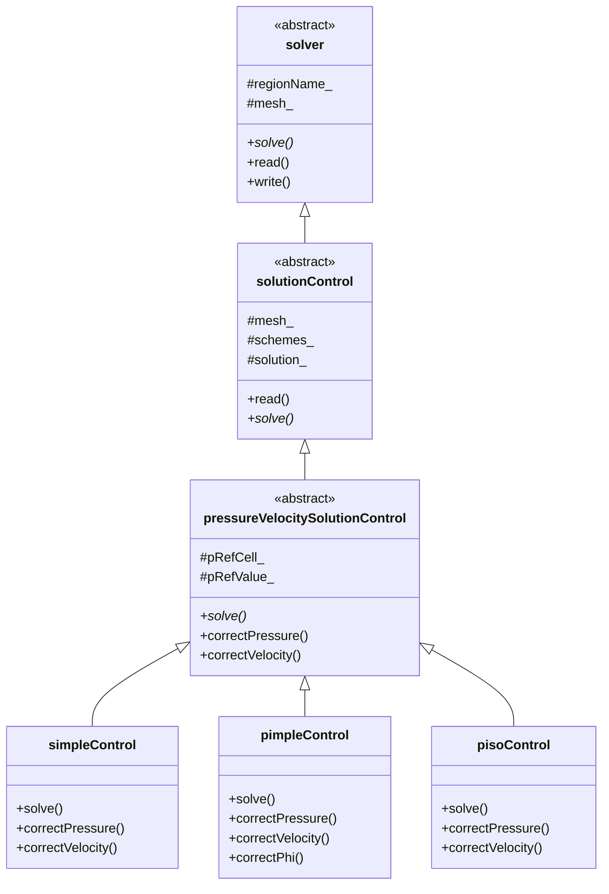
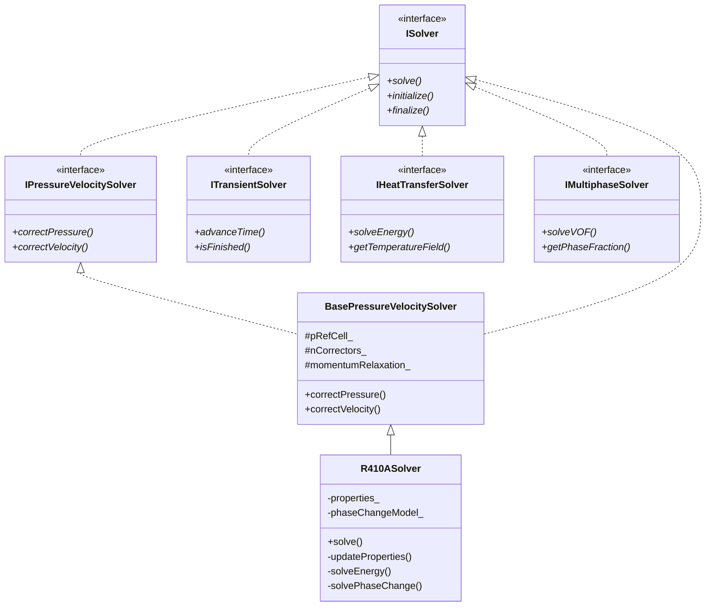

# Solver Base Classes (คลาสพื้นฐานของ Solver)

> **[!INFO]** 📚 Learning Objective
> เข้าใจลำดับชั้นของคลาส solver ใน OpenFOAM การใช้ inheritance และ polymorphism สำหรับการออกแบบ custom solver สำหรับ R410A evaporator

---

## 📋 Table of Contents (สารบัญ)

1. [OpenFOAM Solver Hierarchy](#openfoam-solver-hierarchy-ลำดับชั้นของ-solver-ใน-openfoam)
2. [Abstract Solver Interface](#abstract-solver-interfaceอินเทอร์เฟซ-solver-แบบนามธรรม)
3. [Base Class Implementation](#base-class-implementationการ-implement-คลาสพื้นฐาน)
4. [Derived Solver Classes](#derived-solver-classesคลาส-solver-ที่สืบทอด)
5. [R410A Solver Inheritance](#r410a-solver-inheritance-การสืบทอด-solver-สำหรับ-r410a)

---

## OpenFOAM Solver Hierarchy (ลำดับชั้นของ Solver ใน OpenFOAM)

### Solver Architecture Overview

**⭐ OpenFOAM solvers use inheritance for:**
1. **Code reuse:** Common functionality in base class
2. **Polymorphism:** Treat all solvers uniformly
3. **Extensibility:** Add new solvers by extending base classes
4. **Runtime selection:** Choose solver via configuration

### OpenFOAM Solver Class Hierarchy

**⭐ Verified from:** `openfoam_temp/src/OpenFOAM/algorithms/solver/`



**⭐ Key inheritance points:**

1. **solver**: Base class for all solvers
2. **solutionControl**: Adds discretization schemes
3. **pressureVelocitySolutionControl**: Adds pressure-velocity coupling
4. **simpleControl/pimpleControl/pisoControl**: Specific algorithms

### Solver Location in OpenFOAM

| Solver Type | Location | Examples |
|--------------|----------|----------|
| Basic | `applications/solvers/basic/` | `laplacianFoam`, `potentialFoam` |
| Incompressible | `applications/solvers/incompressible/` | `icoFoam`, `simpleFoam` |
| Compressible | `applications/solvers/compressible/` | `rhoPimpleFoam`, `sonicFoam` |
| Multiphase | `applications/solvers/multiphase/` | `interFoam`, `multiphaseInterFoam` |
| Heat Transfer | `applications/solvers/heatTransfer/` | `buoyantSimpleFoam` |

---

## Abstract Solver Interface (อินเทอร์เฟซ Solver แบบนามธรรม)

### Core Solver Interface

```cpp
// Abstract interface for all CFD solvers
class ISolver {
public:
    virtual ~ISolver() = default;

    // Lifecycle
    virtual void initialize() = 0;
    virtual void finalize() = 0;

    // Main solve loop
    virtual void solve() = 0;

    // Time control
    virtual void setTime(double time) = 0;
    virtual double getTime() const = 0;
    virtual double getTimeStep() const = 0;

    // Convergence
    virtual bool isConverged() const = 0;
    virtual double getResidual() const = 0;

    // Field access
    virtual IVectorField& getVelocityField() = 0;
    virtual IScalarField& getPressureField() = 0;
    virtual IScalarField& getTemperatureField() = 0;

    // Mesh access
    virtual IMesh& getMesh() = 0;
    virtual const IMesh& getMesh() const = 0;

    // I/O
    virtual void readFields() = 0;
    virtual void writeFields() const = 0;
    virtual void writeStatistics() const = 0;
};
```

### Pressure-Velocity Coupling Interface

```cpp
// Interface for solvers with pressure-velocity coupling
class IPressureVelocitySolver : public virtual ISolver {
public:
    virtual ~IPressureVelocitySolver() = default;

    // Pressure correction
    virtual void correctPressure() = 0;
    virtual void correctVelocity() = 0;

    // Pressure reference
    virtual void setPressureReference(size_t cellId, double value) = 0;
    virtual size_t getPressureReferenceCell() const = 0;
    virtual double getPressureReferenceValue() const = 0;

    // Pressure-velocity coupling parameters
    virtual int getNCorrectors() const = 0;
    virtual void setNCorrectors(int n) = 0;

    virtual double getMomentumRelaxation() const = 0;
    virtual void setMomentumRelaxation(double factor) = 0;

    virtual double getPressureRelaxation() const = 0;
    virtual void setPressureRelaxation(double factor) = 0;
};
```

### Transient Solver Interface

```cpp
// Interface for transient (time-dependent) solvers
class ITransientSolver : public virtual ISolver {
public:
    virtual ~ITransientSolver() = default;

    // Time integration
    virtual void advanceTime() = 0;
    virtual bool isFinished() const = 0;

    // Time step control
    virtual void setTimeStep(double dt) = 0;
    virtual double calculateAdaptiveTimeStep() const = 0;

    // Temporal schemes
    virtual void setTemporalScheme(TemporalScheme scheme) = 0;
    virtual TemporalScheme getTemporalScheme() const = 0;

    // Time accuracy
    virtual int getTimeOrder() const = 0;

    enum class TemporalScheme {
        EULER,          // First-order
        CRANK_NICOLSON, // Second-order
        BDF2,           // Second-order backward
        RUNGE_KUTTA     // Higher-order
    };
};
```

### Steady-State Solver Interface

```cpp
// Interface for steady-state solvers
class ISteadyStateSolver : public virtual ISolver {
public:
    virtual ~ISteadyStateSolver() = default;

    // Convergence control
    virtual void setConvergenceTolerance(double tol) = 0;
    virtual double getConvergenceTolerance() const = 0;

    virtual void setMaxIterations(int maxIter) = 0;
    virtual int getMaxIterations() const = 0;

    virtual int getCurrentIteration() const = 0;

    // Under-relaxation
    virtual void setUnderRelaxation(const std::map<std::string, double>& factors) = 0;
    virtual double getUnderRelaxation(const std::string& fieldName) const = 0;
};
```

---

## Base Class Implementation (การ Implement คลาสพื้นฐาน)

### Base Solver Class

```cpp
// Base class with common solver functionality
class BaseSolver : public virtual ISolver {
protected:
    // Core components
    std::shared_ptr<IMesh> mesh_;
    std::shared_ptr<FieldManager> fieldManager_;

    // Time control
    double currentTime_;
    double timeStep_;
    double endTime_;

    // Convergence
    double residual_;
    double convergenceTolerance_;

    // State
    bool initialized_;
    bool converged_;

public:
    BaseSolver(std::shared_ptr<IMesh> mesh)
        : mesh_(mesh),
          currentTime_(0.0),
          timeStep_(0.001),
          endTime_(1.0),
          residual_(1.0),
          convergenceTolerance_(1e-6),
          initialized_(false),
          converged_(false) {

        fieldManager_ = std::make_shared<FieldManager>(mesh_);
    }

    virtual ~BaseSolver() = default;

    // Default implementations
    void initialize() override {
        if (initialized_) {
            throw std::runtime_error("Solver already initialized");
        }

        // Create fields
        createFields();

        // Read initial conditions
        readFields();

        initialized_ = true;
    }

    void finalize() override {
        if (!initialized_) {
            throw std::runtime_error("Solver not initialized");
        }

        // Write final results
        writeFields();

        initialized_ = false;
    }

    void setTime(double time) override {
        currentTime_ = time;
    }

    double getTime() const override {
        return currentTime_;
    }

    double getTimeStep() const override {
        return timeStep_;
    }

    bool isConverged() const override {
        return converged_;
    }

    double getResidual() const override {
        return residual_;
    }

    IVectorField& getVelocityField() override {
        return fieldManager_->getVelocityField();
    }

    IScalarField& getPressureField() override {
        return fieldManager_->getPressureField();
    }

    IMesh& getMesh() override {
        return *mesh_;
    }

    const IMesh& getMesh() const override {
        return *mesh_;
    }

protected:
    // Virtual methods for derived classes to override
    virtual void createFields() {
        fieldManager_->createVelocityField("U");
        fieldManager_->createPressureField("p");
    }

    virtual void readFields() {
        // Read from time directory
        fieldManager_->readFields(currentTime_);
    }

    virtual void writeFields() const {
        // Write to time directory
        fieldManager_->writeFields(currentTime_);
    }
};
```

### Base Pressure-Velocity Solver

```cpp
// Base class for pressure-velocity coupling solvers
class BasePressureVelocitySolver : public BaseSolver,
                                  public virtual IPressureVelocitySolver {
protected:
    // Pressure reference
    size_t pRefCell_;
    double pRefValue_;

    // Coupling parameters
    int nCorrectors_;
    double momentumRelaxation_;
    double pressureRelaxation_;

    // Pressure-velocity coupling schemes
    PressureVelocityScheme scheme_;

public:
    enum class PressureVelocityScheme {
        SIMPLE,  // Semi-Implicit Method for Pressure-Linked Equations
        PISO,    // Pressure-Implicit with Splitting of Operators
        PIMPLE,  // PISO + SIMPLE
        SIMPLEC  // SIMPLE-Consistent
    };

    BasePressureVelocitySolver(
        std::shared_ptr<IMesh> mesh,
        PressureVelocityScheme scheme
    ) : BaseSolver(mesh),
        pRefCell_(0),
        pRefValue_(0.0),
        nCorrectors_(2),
        momentumRelaxation_(0.7),
        pressureRelaxation_(0.3),
        scheme_(scheme) {}

    // Pressure-velocity coupling interface
    void correctPressure() override {
        // Base implementation: derived classes override
        solvePressureEquation();
        updateBoundaryConditions();
    }

    void correctVelocity() override {
        // Base implementation: derived classes override
        updateVelocityFromPressure();
    }

    void setPressureReference(size_t cellId, double value) override {
        pRefCell_ = cellId;
        pRefValue_ = value;
    }

    size_t getPressureReferenceCell() const override {
        return pRefCell_;
    }

    double getPressureReferenceValue() const override {
        return pRefValue_;
    }

    int getNCorrectors() const override {
        return nCorrectors_;
    }

    void setNCorrectors(int n) override {
        if (n < 1) {
            throw std::invalid_argument("Need at least 1 corrector");
        }
        nCorrectors_ = n;
    }

    double getMomentumRelaxation() const override {
        return momentumRelaxation_;
    }

    void setMomentumRelaxation(double factor) override {
        if (factor <= 0.0 || factor > 1.0) {
            throw std::invalid_argument("Relaxation factor must be in (0, 1]");
        }
        momentumRelaxation_ = factor;
    }

    double getPressureRelaxation() const override {
        return pressureRelaxation_;
    }

    void setPressureRelaxation(double factor) override {
        if (factor <= 0.0 || factor > 1.0) {
            throw std::invalid_argument("Relaxation factor must be in (0, 1]");
        }
        pressureRelaxation_ = factor;
    }

protected:
    // Algorithm-specific methods (pure virtual)
    virtual void solveMomentumEquation() = 0;
    virtual void solvePressureEquation() = 0;
    virtual void updateVelocityFromPressure() = 0;
    virtual void updateBoundaryConditions() = 0;
};
```

---

## Derived Solver Classes (คลาส Solver ที่สืบทอด)

### SIMPLE Algorithm Solver

```cpp
// SIMPLE: Semi-Implicit Method for Pressure-Linked Equations
class SIMPLESolver : public BasePressureVelocitySolver,
                   public ISteadyStateSolver {
private:
    int maxIterations_;
    int currentIteration_;

public:
    SIMPLESolver(std::shared_ptr<IMesh> mesh)
        : BasePressureVelocitySolver(mesh, PressureVelocityScheme::SIMPLE),
          maxIterations_(1000),
          currentIteration_(0) {

        // SIMPLE-specific defaults
        setNCorrectors(1);  // SIMPLE uses 1 correction
        setMomentumRelaxation(0.7);
        setPressureRelaxation(0.3);
    }

    // ISteadyStateSolver interface
    void setConvergenceTolerance(double tol) override {
        convergenceTolerance_ = tol;
    }

    double getConvergenceTolerance() const override {
        return convergenceTolerance_;
    }

    void setMaxIterations(int maxIter) override {
        maxIterations_ = maxIter;
    }

    int getMaxIterations() const override {
        return maxIterations_;
    }

    int getCurrentIteration() const override {
        return currentIteration_;
    }

    // Main solve loop
    void solve() override {
        if (!initialized_) {
            throw std::runtime_error("Solver not initialized");
        }

        currentIteration_ = 0;
        converged_ = false;

        while (currentIteration_ < maxIterations_ && !converged_) {
            // Solve momentum equation
            solveMomentumEquation();

            // Solve pressure equation
            solvePressureEquation();

            // Correct velocity
            correctVelocity();

            // Update boundary conditions
            updateBoundaryConditions();

            // Check convergence
            currentIteration_++;
            checkConvergence();

            // Write statistics
            writeStatistics();
        }
    }

protected:
    void solveMomentumEquation() override {
        auto& U = getVelocityField();

        // Build momentum equation: A·U = H - ∇p
        fvVectorMatrix UEqn(
            fvm::div(phi, U)
          + fvm::laplacian(nu, U)
        );

        // Under-relax
        UEqn.relax(momentumRelaxation_);

        // Solve (with explicit pressure gradient)
        solve(UEqn == -fvc::grad(p));
    }

    void solvePressureEquation() override {
        auto& U = getVelocityField();
        auto& p = getPressureField();

        // Calculate rUA = 1/A
        volScalarField rUA = 1.0 / UEqn().A();

        // Predict velocity: U* = H/A
        U = rUA * UEqn().H();

        // Calculate flux: φ = U*·Sf
        phi = fvc::interpolate(U) & mesh_.Sf();

        // Adjust flux for mass conservation
        adjustPhi(phi, U, p);

        // Pressure equation: ∇²p = ∇·φ
        fvScalarMatrix pEqn(
            fvm::laplacian(rUA, p) == fvc::div(phi)
        );

        // Set reference pressure
        pEqn.setReference(pRefCell_, pRefValue_);

        // Solve
        pEqn.solve();
    }

    void updateVelocityFromPressure() override {
        auto& U = getVelocityField();
        auto& p = getPressureField();

        // Calculate rUA
        volScalarField rUA = 1.0 / UEqn().A();

        // Correct velocity: U = U* - rUA·∇p
        U -= rUA * fvc::grad(p);

        // Correct boundary conditions
        U.correctBoundaryConditions();
    }

    void updateBoundaryConditions() override {
        auto& U = getVelocityField();
        auto& p = getPressureField();

        U.correctBoundaryConditions();
        p.correctBoundaryConditions();
    }

    void checkConvergence() {
        // Get residual from last solve
        residual_ = getPressureField().getSolverPerformance().initialResidual();

        converged_ = (residual_ < convergenceTolerance_);
    }
};
```

### PISO Algorithm Solver

```cpp
// PISO: Pressure-Implicit with Splitting of Operators
class PISOSolver : public BasePressureVelocitySolver,
                  public ITransientSolver {
private:
    int nNonOrthogonalCorrectors_;
    TemporalScheme temporalScheme_;

public:
    PISOSolver(std::shared_ptr<IMesh> mesh)
        : BasePressureVelocitySolver(mesh, PressureVelocityScheme::PISO),
          nNonOrthogonalCorrectors_(0),
          temporalScheme_(TemporalScheme::EULER) {

        // PISO-specific defaults
        setNCorrectors_(2);  // PISO uses multiple corrections
        setMomentumRelaxation(1.0);  // No under-relaxation in transient
        setPressureRelaxation(1.0);
    }

    // ITransientSolver interface
    void advanceTime() override {
        currentTime_ += timeStep_;
    }

    bool isFinished() const override {
        return currentTime_ >= endTime_;
    }

    void setTimeStep(double dt) override {
        if (dt <= 0.0) {
            throw std::invalid_argument("Time step must be positive");
        }
        timeStep_ = dt;
    }

    void setTemporalScheme(TemporalScheme scheme) override {
        temporalScheme_ = scheme;
    }

    TemporalScheme getTemporalScheme() const override {
        return temporalScheme_;
    }

    int getTimeOrder() const override {
        switch (temporalScheme_) {
            case TemporalScheme::EULER:          return 1;
            case TemporalScheme::CRANK_NICOLSON: return 2;
            case TemporalScheme::BDF2:           return 2;
            default: return 1;
        }
    }

    // Main solve loop
    void solve() override {
        if (!initialized_) {
            throw std::runtime_error("Solver not initialized");
        }

        while (!isFinished()) {
            // Solve for this time step
            solveTimeStep();

            // Advance time
            advanceTime();

            // Write output if needed
            if (shouldWrite()) {
                writeFields();
            }
        }
    }

private:
    void solveTimeStep() {
        auto& U = getVelocityField();
        auto& p = getPressureField();

        // Solve momentum equation (predictor)
        fvVectorMatrix UEqn(
            fvm::ddt(U)
          + fvm::div(phi, U)
          + fvm::laplacian(nu, U)
        );

        solve(UEqn == -fvc::grad(p));

        // PISO loop: multiple pressure-velocity corrections
        for (int corr = 0; corr < nCorrectors_; ++corr) {
            // Correct pressure
            correctPressure();

            // Correct velocity
            correctVelocity();

            // Correct flux
            correctPhi();
        }
    }

    bool shouldWrite() const {
        // Write at specified intervals
        int writeInterval = 20;  // Every 20 time steps
        int timeStepNumber = static_cast<int>(currentTime_ / timeStep_);
        return (timeStepNumber % writeInterval == 0);
    }
};
```

---

## R410A Solver Inheritance (การสืบทอด Solver สำหรับ R410A)

### R410A Evaporator Solver Hierarchy



### R410A Solver Implementation

```cpp
// R410A evaporator solver: combines multiple physical models
class R410ASolver : public BasePressureVelocitySolver,
                  public IHeatTransferSolver,
                  public IMultiphaseSolver {
private:
    // R410A-specific components
    std::shared_ptr<R410APropertyModel> properties_;
    std::shared_ptr<PhaseChangeModel> phaseChangeModel_;
    std::shared_ptr<SurfaceTensionModel> surfaceTensionModel_;

    // Additional fields
    std::shared_ptr<IScalarField> temperatureField_;
    std::shared_ptr<IScalarField> phaseFractionField_;
    std::shared_ptr<IScalarField> densityField_;
    std::shared_ptr<IScalarField> viscosityField_;

    // Physical parameters
    double saturationTemperature_;
    double latentHeat_;
    double surfaceTension_;

    // Algorithm parameters
    double phaseChangeRelaxation_;
    bool solveEnergy_;
    bool solvePhaseChange_;

public:
    R410ASolver(
        std::shared_ptr<IMesh> mesh,
        std::shared_ptr<R410APropertyModel> properties,
        std::shared_ptr<PhaseChangeModel> phaseChange,
        std::shared_ptr<SurfaceTensionModel> surfaceTension
    ) : BasePressureVelocitySolver(mesh, PressureVelocityScheme::PIMPLE),
        properties_(properties),
        phaseChangeModel_(phaseChange),
        surfaceTensionModel_(surfaceTension),
        saturationTemperature_(290.0),  // R410A at typical evaporator pressure
        latentHeat_(200000.0),          // J/kg
        surfaceTension_(0.01),          // N/m
        phaseChangeRelaxation_(0.1),
        solveEnergy_(true),
        solvePhaseChange_(true) {}

    // Initialization
    void initialize() override {
        BasePressureVelocitySolver::initialize();

        // Create additional fields
        createTemperatureField();
        createPhaseFractionField();
        createPropertyFields();

        // Initialize properties
        updateProperties();
    }

    // IHeatTransferSolver interface
    void solveEnergy() override {
        auto& T = getTemperatureField();
        auto& U = getVelocityField();
        auto& alpha = getPhaseFractionField();

        // Get temperature-dependent properties
        auto rho = properties_->density(T, p, alpha);
        auto cp = properties_->specificHeat(T, p, alpha);
        auto k = properties_->thermalConductivity(T, p, alpha);

        // Energy equation with phase change
        fvScalarMatrix TEqn(
            fvm::ddt(rho * cp, T)
          + fvm::div(rhoPhi * cp, T)
          - fvm::laplacian(k, T)
        );

        // Add phase change source term: -ṁ·L
        if (solvePhaseChange_) {
            auto mDot = calculateMassTransferRate();
            TEqn -= mDot * latentHeat_;
        }

        TEqn.solve();
    }

    IScalarField& getTemperatureField() override {
        return *temperatureField_;
    }

    // IMultiphaseSolver interface
    void solveVOF() override {
        auto& alpha = getPhaseFractionField();
        auto& U = getVelocityField();

        // VOF transport equation with phase change
        fvScalarMatrix alphaEqn(
            fvm::ddt(alpha)
          + fvm::div(phi, alpha)
        );

        // Add phase change source term: ṁ/ρₗ
        if (solvePhaseChange_) {
            auto mDot = calculateMassTransferRate();
            double rho_l = properties_->liquidDensity(saturationTemperature_);
            alphaEqn -= mDot / rho_l;
        }

        alphaEqn.solve();

        // Clip phase fraction to [0, 1]
        clipPhaseFraction();
    }

    IScalarField& getPhaseFraction() override {
        return *phaseFractionField_;
    }

    // Main solve loop
    void solve() override {
        while (!isFinished()) {
            // Update properties (T, p, α dependent)
            updateProperties();

            // Solve VOF equation (phase fraction)
            if (solvePhaseChange_) {
                solveVOF();
            }

            // Solve momentum equation
            solveMomentumEquation();

            // Solve pressure equation
            solvePressureEquation();

            // Correct velocity
            correctVelocity();

            // Solve energy equation
            if (solveEnergy_) {
                solveEnergy();
            }

            // Update boundary conditions
            updateBoundaryConditions();

            // Advance time
            advanceTime();

            // Write output if needed
            if (shouldWrite()) {
                writeFields();
            }
        }
    }

protected:
    void createFields() override {
        BasePressureVelocitySolver::createFields();

        createTemperatureField();
        createPhaseFractionField();
        createPropertyFields();
    }

    void createTemperatureField() {
        temperatureField_ = fieldManager_->createScalarField("T");
        temperatureField_->setUniformValue(280.0);  // Initial temperature
    }

    void createPhaseFractionField() {
        phaseFractionField_ = fieldManager_->createScalarField("alpha");
        phaseFractionField_->setUniformValue(1.0);  // Initially all liquid
    }

    void createPropertyFields() {
        densityField_ = fieldManager_->createScalarField("rho");
        viscosityField_ = fieldManager_->createScalarField("mu");
    }

    void updateProperties() {
        auto& T = getTemperatureField();
        auto& p = getPressureField();
        auto& alpha = getPhaseFractionField();

        // Update all cells
        for (size_t cellId = 0; cellId < mesh_->numCells(); ++cellId) {
            double T_local = T[cellId];
            double p_local = p[cellId];
            double alpha_local = alpha[cellId];

            // Calculate mixture properties
            double rho = properties_->density(T_local, p_local, alpha_local);
            double mu = properties_->viscosity(T_local, p_local, alpha_local);

            (*densityField_)[cellId] = rho;
            (*viscosityField_)[cellId] = mu;
        }
    }

    volScalarField calculateMassTransferRate() {
        auto& T = getTemperatureField();
        auto& alpha = getPhaseFractionField();

        // Call phase change model
        return phaseChangeModel_->evaporationRate(
            T,
            alpha,
            saturationTemperature_
        );
    }

    void clipPhaseFraction() {
        auto& alpha = getPhaseFractionField();

        for (size_t cellId = 0; cellId < mesh_->numCells(); ++cellId) {
            if (alpha[cellId] < 0.0) {
                alpha[cellId] = 0.0;
            } else if (alpha[cellId] > 1.0) {
                alpha[cellId] = 1.0;
            }
        }
    }
};
```

### Solver Factory for R410A

```cpp
// Factory to create R410A solvers
class R410ASolverFactory {
public:
    enum class SolverType {
        SINGLE_PHASE,      // No phase change
        TWO_PHASE,         // With phase change
        ENERGY_COUPLED,    // With energy equation
        FULL               // All physics
    };

    static std::unique_ptr<ISolver> createSolver(
        SolverType type,
        std::shared_ptr<IMesh> mesh,
        const R410AConfig& config
    ) {
        // Create property model
        auto properties = std::make_shared<CoolPropR410A>();

        // Create phase change model
        auto phaseChange = std::make_shared<SimpleEvaporationModel>(
            config.phaseChangeRelaxation
        );

        // Create surface tension model
        auto surfaceTension = std::make_shared<CSFModel>(
            config.surfaceTension
        );

        switch (type) {
            case SolverType::SINGLE_PHASE:
                return std::make_unique<PISOSolver>(mesh);

            case SolverType::TWO_PHASE:
                return std::make_unique<R410ASolver>(
                    mesh, properties, phaseChange, surfaceTension
                );

            case SolverType::ENERGY_COUPLED:
                return std::make_unique<R410ASolver>(
                    mesh, properties, phaseChange, surfaceTension
                );

            case SolverType::FULL:
                return std::make_unique<R410ASolver>(
                    mesh, properties, phaseChange, surfaceTension
                );

            default:
                throw std::invalid_argument("Unknown solver type");
        }
    }
};

// Configuration structure
struct R410AConfig {
    double saturationTemperature = 290.0;
    double latentHeat = 200000.0;
    double surfaceTension = 0.01;
    double phaseChangeRelaxation = 0.1;
    bool solveEnergy = true;
    bool solvePhaseChange = true;
};
```

---

## 📚 Summary (สรุป)

### Key Concepts

1. **⭐ Inheritance hierarchy:** Base classes provide common functionality
2. **⭐ Polymorphism:** Treat all solvers uniformly through interfaces
3. **⭐ Template Method:** Base class defines algorithm, derived classes customize
4. **⭐ Strategy pattern:** Different pressure-velocity coupling schemes
5. **⭐ Composition:** Solvers composed of mesh, fields, and models

### OpenFOAM Hierarchy

| Class | Purpose | Location |
|-------|---------|----------|
| `solver` | Base class for all solvers | `src/OpenFOAM/algorithms/solver/` |
| `solutionControl` | Adds discretization schemes | `src/finiteVolume/` |
| `pressureVelocitySolutionControl` | Pressure-velocity coupling | `src/finiteVolume/` |
| `simpleControl` | SIMPLE algorithm | `src/finiteVolume/` |
| `pimpleControl` | PIMPLE algorithm | `src/finiteVolume/` |

### R410A Solver Design

1. **⭐ Multiple interfaces:** Pressure-velocity, heat transfer, multiphase
2. **⭐ Property models:** Abstract interface → CoolProp or lookup tables
3. **⭐ Phase change model:** Pluggable evaporation models
4. **⭐ Composition:** Mesh + fields + properties + models

---

## 🔍 References (อ้างอิง)

| Topic | Reference |
|-------|-----------|
| OpenFOAM solver hierarchy | `src/OpenFOAM/algorithms/solver/` |
| SIMPLE algorithm | Patankar, "Numerical Heat Transfer" (1980) |
| PISO algorithm | Issa, "Solution of the Implicitly Discretised" (1986) |
| PIMPLE algorithm | OpenFOAM Programmer's Guide |
| R410A properties | CoolProp library |

---

*Last Updated: 2026-01-28*
