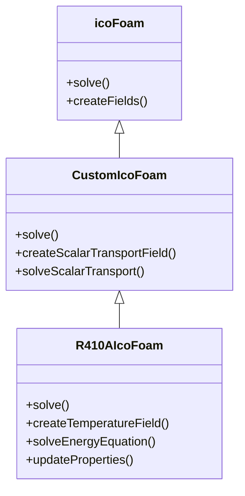
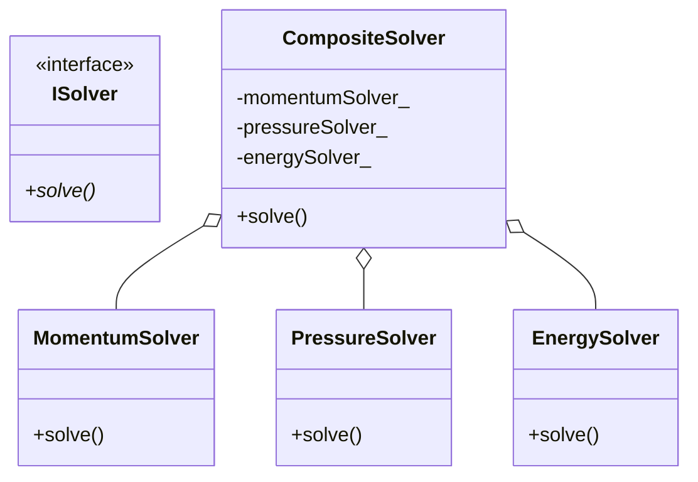
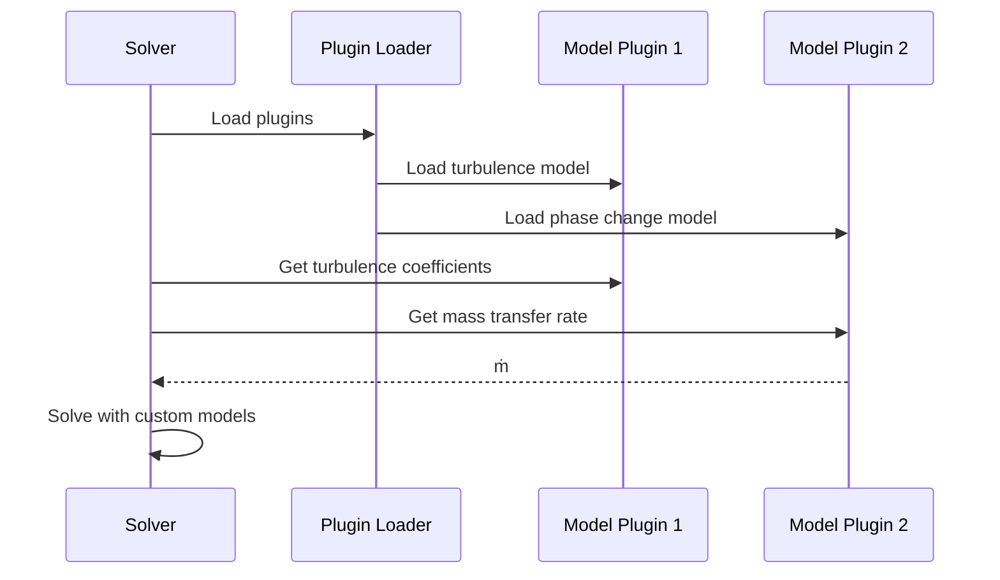

# Solver Extension Framework (กรอบงานการขยาย Solver)

> **[!INFO]** 📚 Learning Objective
> เรียนรู้วิธีขยาย OpenFOAM solvers ผ่าน inheritance, composition, และ plugin architecture สำหรับการพัฒนา custom solver สำหรับ R410A evaporator

---

## 📋 Table of Contents (สารบัญ)

1. [Extending OpenFOAM Solvers](#extending-openfoam-solversการขยาย-openfoam-solvers)
2. [Custom Equation Addition](#custom-equation-additionการเพิ่มสมการ-custom)
3. [Plugin Architecture](#plugin-architectureสถาปัตยกรรม-plugin)
4. [Runtime Selection Tables](#runtime-selection-tablesตาราง-selection-ณ-runtime)
5. [R410A Solver Extension](#r410a-solver-extensionการขยาย-solver-สำหรับ-r410a)

---

## Extending OpenFOAM Solvers (การขยาย OpenFOAM Solvers)

### Extension Strategies

**⭐ Three main approaches:**

1. **Inheritance:** Extend existing solver class
2. **Composition:** Combine existing solvers
3. **Plugin:** Add new models at runtime

### Approach 1: Inheritance



**Implementation:**

```cpp
// Extend icoFoam with additional scalar transport
class CustomIcoFoam : public icoFoam {
protected:
    volScalarField T_;  // Additional scalar field

public:
    CustomIcoFoam(int argc, char* argv[])
        : icoFoam(argc, argv) {}

    virtual void createFields() {
        // Call base class to create standard fields (U, p)
        icoFoam::createFields();

        // Create additional field
        T_ = volScalarField
        (
            IOobject
            (
                "T",
                runTime.timeName(),
                mesh,
                IOobject::MUST_READ,
                IOobject::AUTO_WRITE
            ),
            mesh
        );
    }

    virtual void solve() {
        while (runTime.loop()) {
            // Solve momentum (from base class)
            #include "UEqn.H"

            // Solve pressure (from base class)
            #include "pEqn.H"

            // Solve additional scalar transport equation
            solveScalarTransport();

            runTime.write();
        }
    }

protected:
    void solveScalarTransport() {
        // Scalar transport equation: ∂T/∂t + ∇·(UT) = α∇²T
        fvScalarMatrix TEqn
        (
            fvm::ddt(T_)
          + fvm::div(phi, T_)
          - fvm::laplacian(DT, T_)
        );

        TEqn.solve();
    }

private:
    dimensionedScalar DT;  // Diffusivity
};
```

### Approach 2: Composition



**Implementation:**

```cpp
// Compose solver from multiple components
class CompositeSolver {
private:
    std::unique_ptr<MomentumSolver> momentumSolver_;
    std::unique_ptr<PressureSolver> pressureSolver_;
    std::unique_ptr<EnergySolver> energySolver_;
    std::unique_ptr<PhaseChangeSolver> phaseChangeSolver_;

public:
    CompositeSolver(
        std::unique_ptr<MomentumSolver> momentum,
        std::unique_ptr<PressureSolver> pressure,
        std::unique_ptr<EnergySolver> energy,
        std::unique_ptr<PhaseChangeSolver> phaseChange
    ) : momentumSolver_(std::move(momentum)),
        pressureSolver_(std::move(pressure)),
        energySolver_(std::move(energy)),
        phaseChangeSolver_(std::move(phaseChange)) {}

    void solve() {
        while (runTime.loop()) {
            // Solve momentum
            momentumSolver_->solve();

            // Solve pressure
            pressureSolver_->solve();

            // Solve energy
            energySolver_->solve();

            // Solve phase change
            phaseChangeSolver_->solve();

            // Update fields
            updateFields();

            // Write output
            runTime.write();
        }
    }

private:
    void updateFields() {
        // Update all fields after each time step
        momentumSolver_->updateFields();
        pressureSolver_->updateFields();
        energySolver_->updateFields();
        phaseChangeSolver_->updateFields();
    }
};
```

### Approach 3: Plugin Architecture



**Implementation:**

```cpp
// Plugin interface for custom models
class ISolverPlugin {
public:
    virtual ~ISolverPlugin() = default;

    virtual std::string getName() const = 0;
    virtual void initialize(const Foam::dictionary& dict) = 0;
    virtual void update(const Foam::volScalarField& T,
                       const Foam::volScalarField& p,
                       const Foam::volScalarField& alpha) = 0;
};

// Custom phase change plugin
class R410APhaseChangePlugin : public ISolverPlugin {
private:
    double relaxationFactor_;
    double saturationTemperature_;
    Foam::volScalarField mDot_;  // Mass transfer rate field

public:
    std::string getName() const override {
        return "R410APhaseChange";
    }

    void initialize(const Foam::dictionary& dict) override {
        // Read parameters from dictionary
        relaxationFactor_ = dict.lookupOrDefault<double>("relaxationFactor", 0.1);
        saturationTemperature_ = dict.lookupOrDefault<double>("TSat", 290.0);
    }

    void update(const Foam::volScalarField& T,
               const Foam::volScalarField& p,
               const Foam::volScalarField& alpha) override {
        // Calculate mass transfer rate
        mDot_ = relaxationFactor_ * Foam::max(T - saturationTemperature_, 0.0) * alpha;
    }

    const Foam::volScalarField& getMassTransferRate() const {
        return mDot_;
    }
};

// Plugin loader
class SolverPluginLoader {
private:
    std::map<std::string, std::shared_ptr<ISolverPlugin>> plugins_;

public:
    void loadPlugin(const std::string& name,
                   const Foam::dictionary& dict) {
        if (name == "R410APhaseChange") {
            auto plugin = std::make_shared<R410APhaseChangePlugin>();
            plugin->initialize(dict);
            plugins_[name] = plugin;
        }
        // Add more plugins here
    }

    std::shared_ptr<ISolverPlugin> getPlugin(const std::string& name) {
        auto it = plugins_.find(name);
        if (it != plugins_.end()) {
            return it->second;
        }
        return nullptr;
    }
};
```

---

## Custom Equation Addition (การเพิ่มสมการ Custom)

### Adding Scalar Transport Equation

**⭐ Goal:** Add passive scalar transport to existing solver

**Steps:**

1. **Create field:** Add new field to `createFields.H`
2. **Discretize:** Write equation in separate include file
3. **Solve:** Call solve in main loop
4. **Boundary conditions:** Set appropriate BCs

**Implementation:**

```cpp
// File: createFields.H (extended)
// ... existing fields (U, p, phi) ...

// Add scalar field
Info<< "Reading field T\n" << endl;
volScalarField T
(
    IOobject
    (
        "T",
        runTime.timeName(),
        mesh,
        IOobject::MUST_READ,
        IOobject::AUTO_WRITE
    ),
    mesh
);

// Add diffusivity
dimensionedScalar DT
(
    "DT",
    dimViscosity,
    transportProperties.lookupOrDefault("DT", 1e-5)
);

// ... rest of createFields.H
```

```cpp
// File: TEqn.H (new file)
{
    // Scalar transport equation
    fvScalarMatrix TEqn
    (
        fvm::ddt(T)
      + fvm::div(phi, T)
      - fvm::laplacian(DT, T)
    );

    // Under-relaxation (optional)
    TEqn.relax();

    // Solve
    TEqn.solve();
}
```

```cpp
// File: customSolver.C (modified)
int main(int argc, char *argv[])
{
    #include "setRootCaseLists.H"
    #include "createTime.H"
    #include "createMesh.H"
    #include "createFields.H"  // Extended with T field

    Info<< "\nStarting time loop\n" << endl;

    while (runTime.loop())
    {
        Info<< "Time = " << runTime.timeName() << nl << endl;

        #include "UEqn.H"
        #include "pEqn.H"

        // Solve scalar transport
        #include "TEqn.H"  // NEW

        turbulence->correct();

        runTime.write();

        Info<< "ExecutionTime = " << runTime.elapsedCpuTime() << " s"
            << "  ClockTime = " << runTime.elapsedClockTime() << " s"
            << nl << endl;
    }

    Info<< "End\n" << endl;

    return 0;
}
```

### Adding Energy Equation

**⭐ Goal:** Add energy equation for heat transfer

**Implementation:**

```cpp
// File: TEqn.H (energy equation)
{
    // Get temperature-dependent properties
    volScalarField rho = rho(p, T);  // Equation of state
    volScalarField cp = Cp(T);       // Specific heat
    volScalarField k = kappa(T);      // Thermal conductivity

    // Energy equation: ∂(ρcpT)/∂t + ∇·(ρcpUT) = ∇·(k∇T) + S
    fvScalarMatrix TEqn
    (
        fvm::ddt(rho*cp, T)
      + fvm::div(rhoPhi*cp, T)
      - fvm::laplacian(k, T)
    );

    // Add source term (e.g., viscous dissipation, phase change)
    TEqn -= sourceTerm;

    // Under-relaxation
    TEqn.relax();

    // Solve
    TEqn.solve();
}
```

### Adding Two-Phase Equations

**⭐ Goal:** Add VOF equation for phase fraction

**Implementation:**

```cpp
// File: alphaEqn.H (VOF transport equation)
{
    // Phase fraction field: alpha = 1 (liquid), alpha = 0 (vapor)
    volScalarField& alpha = mesh.lookupObjectRef<volScalarField>("alpha");

    // Mixture properties
    volScalarField rho = alpha * rhoLiquid + (1.0 - alpha) * rhoVapor;
    volScalarField mu = alpha * muLiquid + (1.0 - alpha) * muVapor;

    // VOF equation: ∂α/∂t + ∇·(αU) = S
    fvScalarMatrix alphaEqn
    (
        fvm::ddt(alpha)
      + fvm::div(phi, alpha)
    );

    // Add phase change source term
    if (solvePhaseChange_) {
        // Mass transfer rate (kg/m³/s)
        volScalarField mDot
        (
            IOobject
            (
                "mDot",
                runTime.timeName(),
                mesh
            ),
            mesh,
            dimensionedScalar("mDot", dimDensity/dimTime, 0.0)
        );

        // Calculate mass transfer based on temperature
        mDot = lambda * Foam::max(T - TSat, 0.0) * alpha;

        // Add source term: ṁ/ρₗ
        alphaEqn -= mDot / rhoLiquid;
    }

    // Under-relaxation
    alphaEqn.relax();

    // Solve
    alphaEqn.solve();

    // Clip to [0, 1]
    alpha = Foam::max(Foam::min(alpha, 1.0), 0.0);

    // Update mixture properties
    rho = alpha * rhoLiquid + (1.0 - alpha) * rhoVapor;
    mu = alpha * muLiquid + (1.0 - alpha) * muVapor;
}
```

---

## Plugin Architecture (สถาปัตยกรรม Plugin)

### Plugin Interface Design

```cpp
// Abstract plugin interface
class ISolverModel {
public:
    virtual ~ISolverModel() = default;

    // Model identification
    virtual std::string getTypeName() const = 0;
    virtual std::string getModelName() const = 0;

    // Initialization
    virtual void read(const Foam::dictionary& dict) = 0;
    virtual void initialize() = 0;

    // Computation
    virtual void correct() = 0;

    // Field access
    virtual const Foam::volScalarField& getField(const std::string& name) const = 0;
    virtual Foam::volScalarField& getField(const std::string& name) = 0;

    // Model coefficients
    virtual Foam::scalar getCoefficient(const std::string& name) const = 0;
};

// Plugin manager
class SolverModelManager {
private:
    std::map<std::string, std::shared_ptr<ISolverModel>> models_;

public:
    // Register model
    void registerModel(std::shared_ptr<ISolverModel> model) {
        std::string key = model->getTypeName() + "::" + model->getModelName();
        models_[key] = model;
    }

    // Get model
    std::shared_ptr<ISolverModel> getModel(const std::string& type,
                                         const std::string& name) {
        std::string key = type + "::" + name;
        auto it = models_.find(key);
        if (it != models_.end()) {
            return it->second;
        }
        return nullptr;
    }

    // Correct all models
    void correctAll() {
        for (auto& pair : models_) {
            pair.second->correct();
        }
    }
};
```

### Runtime Selection Mechanism

**⭐ Verified from:** `openfoam_temp/src/OpenFOAM/db/runTimeSelection/`

```cpp
// Base class with runtime selection
class TurbulenceModel {
public:
    // Declare runtime selection table
    declareRunTimeSelectionTable
    (
        autoPtr,
        TurbulenceModel,
        dictionary,
        (
            const volVectorField& U,
            const surfaceScalarField& phi,
            const transportModel& transport
        ),
        (U, phi, transport)
    );

    // Static factory method
    static autoPtr<TurbulenceModel> New
    (
        const volVectorField& U,
        const surfaceScalarField& phi,
        const transportModel& transport
    );

    // Virtual methods
    virtual tmp<volSymmTensorField> devReff() const = 0;
    virtual tmp<fvVectorMatrix> divDevReff(volVectorField& U) const = 0;
    virtual void correct() = 0;
};

// Macro to register derived class
#define TypeName(TypeNameString) \
    Foam::word TypeName() const { return Foam::word(TypeNameString); }

// Concrete turbulence model
class kEpsilon : public TurbulenceModel {
public:
    // Type name for runtime selection
    TypeName("kEpsilon");

    // Constructor (registered to runtime table)
    kEpsilon
    (
        const volVectorField& U,
        const surfaceScalarField& phi,
        const transportModel& transport
    );

    // Implement virtual methods
    tmp<volSymmTensorField> devReff() const override;
    tmp<fvVectorMatrix> divDevReff(volVectorField& U) const override;
    void correct() override;
};

// Macro to register with runtime table
defineTypeNameAndDebug(kEpsilon, 0);
addToRunTimeSelectionTable(TurbulenceModel, kEpsilon, dictionary);
```

### Custom Model Registration

```cpp
// Custom R410A phase change model
class R410APhaseChangeModel {
public:
    // Runtime selection table
    declareRunTimeSelectionTable
    (
        autoPtr,
        R410APhaseChangeModel,
        dictionary,
        (
            const volScalarField& T,
            const volScalarField& alpha
        ),
        (T, alpha)
    );

    // Factory method
    static autoPtr<R410APhaseChangeModel> New
    (
        const volScalarField& T,
        const volScalarField& alpha
    );

    // Virtual methods
    virtual volScalarField massTransferRate() const = 0;
    virtual void correct() = 0;
};

// Simple evaporation model
class SimpleEvaporationModel : public R410APhaseChangeModel {
private:
    dimensionedScalar relaxationFactor_;
    dimensionedScalar TSat_;
    const volScalarField& T_;
    const volScalarField& alpha_;

public:
    TypeName("simpleEvaporation");

    SimpleEvaporationModel
    (
        const volScalarField& T,
        const volScalarField& alpha
    )
    : T_(T),
      alpha_(alpha),
      relaxationFactor_(dimless, 0.1),
      TSat_(dimTemperature, 290.0)
    {
        // Read from dictionary if available
        if (this->found("relaxationFactor")) {
            relaxationFactor_ = this->lookup("relaxationFactor");
        }
        if (this->found("TSat")) {
            TSat_ = this->lookup("TSat");
        }
    }

    volScalarField massTransferRate() const override {
        // Simple model: ṁ = λ·max(T - T_sat, 0)·α
        return relaxationFactor_ * max(T_ - TSat_, dimensionedScalar("0", dimTemperature, 0.0)) * alpha_;
    }

    void correct() override {
        // Update model parameters if needed
    }
};

// Register model
defineTypeNameAndDebug(SimpleEvaporationModel, 0);
addToRunTimeSelectionTable(R410APhaseChangeModel, SimpleEvaporationModel, dictionary);
```

---

## Runtime Selection Tables (ตาราง Selection ณ Runtime)

### How Runtime Selection Works

**⭐ Mechanism:**
1. **Static registration:** Each model registers itself at program startup
2. **Hash table:** Models stored in global hash table
3. **Dictionary lookup:** Select model based on dictionary entry
4. **Factory method:** Create object via New() function

```cpp
// Runtime selection table declaration (in .H file)
declareRunTimeSelectionTable
(
    autoPtr,
    ClassName,
    dictionary,
    (
        const arg1Type& arg1,
        const arg2Type& arg2
    ),
    (arg1, arg2)
);

// Runtime selection table definition (in .C file)
defineTypeNameAndDebug(ClassName, 0);
addToRunTimeSelectionTable(ClassName, DerivedClass, dictionary);

// Factory method implementation (in .C file)
autoPtr<ClassName> ClassName::New
(
    const arg1Type& arg1,
    const arg2Type& arg2
)
{
    // Get dictionary word
    const word modelType = IOdictionary::lookup("modelType");

    // Find constructor in hash table
    typename dictionaryConstructorTable::iterator cstrIter =
        dictionaryConstructorTablePtr_->find(modelType);

    // If found, call constructor
    if (cstrIter != dictionaryConstructorTablePtr_->end()) {
        return cstrIter()(arg1, arg2);
    }

    // If not found, throw error
    FatalErrorInFunction
        << "Unknown ClassName type " << modelType << nl << nl
        << "Valid ClassName types are:" << nl
        << dictionaryConstructorTablePtr_->sortedToc()
        << exit(FatalError);
}
```

### Usage in Solver

```cpp
// In solver code
int main(int argc, char *argv[])
{
    #include "setRootCaseLists.H"
    #include "createTime.H"
    #include "createMesh.H"
    #include "createFields.H"

    // Create phase change model via runtime selection
    // Dictionary entry: phaseChangeModel simpleEvaporation;
    autoPtr<R410APhaseChangeModel> phaseChangeModel =
        R410APhaseChangeModel::New(T, alpha);

    Info<< "Selected phase change model: "
        << phaseChangeModel->getType() << endl;

    while (runTime.loop()) {
        // Solve momentum
        #include "UEqn.H"

        // Solve pressure
        #include "pEqn.H"

        // Solve VOF with phase change
        #include "alphaEqn.H"

        // Update phase change model
        phaseChangeModel->correct();

        // Get mass transfer rate
        volScalarField mDot = phaseChangeModel->massTransferRate();

        // Use mDot in energy equation
        #include "TEqn.H"

        runTime.write();
    }

    return 0;
}
```

### Dictionary Configuration

```cpp
// File: constant/phaseChangeProperties
phaseChangeModel simpleEvaporation;

simpleEvaporationCoeffs
{
    relaxationFactor 0.1;
    TSat              290.0;
}

// Alternative model: could switch to different model
// phaseChangeModel advancedEvaporation;
//
// advancedEvaporationCoeffs
// {
//     relaxationFactor 0.05;
//     TSat              290.0;
//     nucleationSiteDensity 1e10;
// }
```

---

## R410A Solver Extension (การขยาย Solver สำหรับ R410A)

### Complete R410A Solver Framework

```cpp
// R410A solver with plugin architecture
class R410ASolverFramework {
private:
    // Core components
    std::shared_ptr<IMesh> mesh_;
    std::shared_ptr<FieldManager> fields_;

    // Plugin models
    std::shared_ptr<R410APropertyModel> properties_;
    std::shared_ptr<PhaseChangeModel> phaseChange_;
    std::shared_ptr<SurfaceTensionModel> surfaceTension_;
    std::shared_ptr<TurbulenceModel> turbulence_;

    // Solver components
    std::unique_ptr<MomentumSolver> momentumSolver_;
    std::unique_ptr<PressureSolver> pressureSolver_;
    std::unique_ptr<EnergySolver> energySolver_;
    std::unique_ptr<VOFSolver> vofSolver_;

    // Plugin manager
    SolverPluginManager pluginManager_;

public:
    R410ASolverFramework(const std::string& caseDir) {
        // Load mesh
        mesh_ = loadMesh(caseDir);

        // Create field manager
        fields_ = std::make_shared<FieldManager>(mesh_);

        // Load plugins from configuration
        loadPlugins(caseDir + "/constant/R410AProperties");

        // Initialize solver components
        initializeSolvers();
    }

    void solve() {
        while (!isFinished()) {
            // Update properties
            properties_->update(T_, p_, alpha_);

            // Solve momentum
            momentumSolver_->solve();

            // Solve pressure
            pressureSolver_->solve();

            // Solve VOF
            vofSolver_->solve(phaseChange_);

            // Solve energy
            energySolver_->solve(phaseChange_);

            // Update plugins
            pluginManager_.correctAll();

            // Advance time
            advanceTime();

            // Write output
            if (shouldWrite()) {
                writeFields();
            }
        }
    }

private:
    void loadPlugins(const std::string& configFile) {
        // Read configuration
        Foam::dictionary configDict = readDictionary(configFile);

        // Create property model
        word propertyModelType = configDict.lookup("propertyModel");
        if (propertyModelType == "CoolProp") {
            properties_ = std::make_shared<CoolPropR410A>();
        } else if (propertyModelType == "lookupTable") {
            properties_ = std::make_shared<LookupTableR410A>();
        }

        // Create phase change model (with runtime selection)
        phaseChange_ = PhaseChangeModel::New(T_, alpha_);

        // Create surface tension model
        surfaceTension_ = SurfaceTensionModel::New(T_, alpha_);

        // Register plugins
        pluginManager_.registerModel(properties_);
        pluginManager_.registerModel(phaseChange_);
        pluginManager_.registerModel(surfaceTension_);
    }

    void initializeSolvers() {
        // Create solver components with plugin models
        momentumSolver_ = std::make_unique<R410AMomentumSolver>(
            mesh_, fields_, properties_
        );

        pressureSolver_ = std::make_unique<PressureSolver>(
            mesh_, fields_
        );

        energySolver_ = std::make_unique<R410AEnergySolver>(
            mesh_, fields_, properties_, phaseChange_
        );

        vofSolver_ = std::make_unique<R410AVOFSolver>(
            mesh_, fields_, properties_, phaseChange_
        );
    }
};
```

### R410A-Specific Customizations

```cpp
// R410A momentum solver with mixture properties
class R410AMomentumSolver : public MomentumSolver {
private:
    std::shared_ptr<R410APropertyModel> properties_;

public:
    R410AMomentumSolver(
        std::shared_ptr<IMesh> mesh,
        std::shared_ptr<FieldManager> fields,
        std::shared_ptr<R410APropertyModel> properties
    ) : MomentumSolver(mesh, fields),
        properties_(properties) {}

    void solve() override {
        auto& U = fields_->getVelocityField();
        auto& p = fields_->getPressureField();
        auto& alpha = fields_->getPhaseFractionField();
        auto& T = fields_->getTemperatureField();

        // Get mixture properties (R410A-specific)
        volScalarField rho = properties_->density(T, p, alpha);
        volScalarField mu = properties_->viscosity(T, p, alpha);

        // Momentum equation with variable properties
        fvVectorMatrix UEqn
        (
            fvm::ddt(rho, U)
          + fvm::div(rhoPhi, U)
          - fvm::laplacian(mu, U)
        );

        // Add surface tension force
        if (surfaceTension_) {
            volVectorField Fst = surfaceTension_->surfaceForce(alpha, T);
            UEqn -= Fst;
        }

        UEqn.solve();
    }
};

// R410A energy solver with phase change
class R410AEnergySolver : public EnergySolver {
private:
    std::shared_ptr<R410APropertyModel> properties_;
    std::shared_ptr<PhaseChangeModel> phaseChange_;

public:
    R410AEnergySolver(
        std::shared_ptr<IMesh> mesh,
        std::shared_ptr<FieldManager> fields,
        std::shared_ptr<R410APropertyModel> properties,
        std::shared_ptr<PhaseChangeModel> phaseChange
    ) : EnergySolver(mesh, fields),
        properties_(properties),
        phaseChange_(phaseChange) {}

    void solve() override {
        auto& T = fields_->getTemperatureField();
        auto& U = fields_->getVelocityField();
        auto& alpha = fields_->getPhaseFractionField();
        auto& p = fields_->getPressureField();

        // Get mixture properties
        volScalarField rho = properties_->density(T, p, alpha);
        volScalarField cp = properties_->specificHeat(T, p, alpha);
        volScalarField k = properties_->thermalConductivity(T, p, alpha);
        double L = properties_->latentHeat(T);

        // Energy equation with phase change
        fvScalarMatrix TEqn
        (
            fvm::ddt(rho*cp, T)
          + fvm::div(rhoPhi*cp, T)
          - fvm::laplacian(k, T)
        );

        // Add phase change source term: -ṁ·L
        if (phaseChange_) {
            volScalarField mDot = phaseChange_->massTransferRate();
            TEqn -= mDot * L;
        }

        TEqn.solve();
    }
};
```

---

## 📚 Summary (สรุป)

### Extension Approaches

| Approach | When to Use | Pros | Cons |
|----------|------------|------|------|
| **Inheritance** | Extend single solver | Simple, direct coupling | Rigid, can't change at runtime |
| **Composition** | Combine multiple solvers | Flexible, modular | More complex setup |
| **Plugin** | Runtime model selection | Maximum flexibility | More complex infrastructure |

### Key Concepts

1. **⭐ Runtime selection:** Choose models via dictionary
2. **⭐ Plugin architecture:** Load models at runtime
3. **⭐ Factory pattern:** Create objects without specifying class
4. **⭐ Virtual functions:** Polymorphic behavior
5. **⭐ Hash tables:** Fast model lookup

### R410A Application

1. **⭐ Property model:** CoolProp or lookup tables (runtime selection)
2. **⭐ Phase change model:** Simple or advanced (plugin)
3. **⭐ Mixture properties:** T, p, α dependent
4. **⭐ Source terms:** Latent heat, surface tension

---

## 🔍 References (อ้างอิง)

| Topic | Reference |
|-------|-----------|
| Runtime selection | `src/OpenFOAM/db/runTimeSelection/` |
| Turbulence models | `src/turbulenceModels/` |
| Plugin architecture | OpenFOAM Programmer's Guide, Ch. 4 |
| Custom solvers | OpenFOAM Wiki: User Guide |
| R410A properties | CoolProp library documentation |

---

*Last Updated: 2026-01-28*
