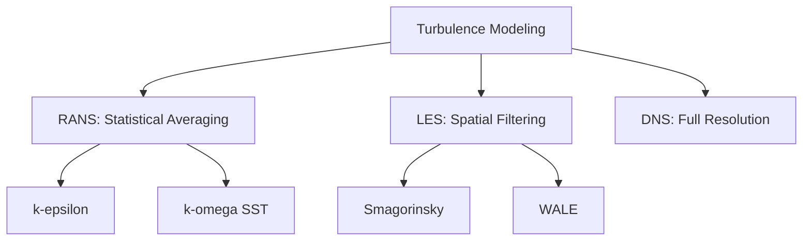

# การสร้างแบบจำลองความปั่นป่วน (Turbulence Modeling)

## 🔍 ภาพรวม (Overview)

ความปั่นป่วน (Turbulence) เป็นลักษณะการไหลที่วุ่นวาย (Chaotic) สุ่ม (Random) และมีหลายสเกล (Multiscale) ซึ่งพบได้ในงานวิศวกรรมส่วนใหญ่ โมดูลนี้จะครอบคลุมแนวทางการคำนวณความปั่นป่วนใน OpenFOAM ตั้งแต่การหาค่าเฉลี่ยแบบ RANS ไปจนถึงการแก้ปัญหาเชิงโครงสร้างแบบ LES

---

## 🎯 วัตถุประสงค์การเรียนรู้ (Learning Objectives)

เมื่อจบโมดูลนี้ คุณจะสามารถ:
1. **แยกแยะแนวทางหลัก**: เข้าใจความแตกต่างระหว่าง RANS, LES และ DNS
2. **เลือกโมเดลที่เหมาะสม**: เลือก Turbulence Model (เช่น k-ε, k-ω SST, Smagorinsky) ตามลักษณะการไหล
3. **จัดการบริเวณใกล้ผนัง**: กำหนดค่า $y^+$ และเลือกใช้ Wall Functions ได้ถูกต้อง
4. **ตั้งค่ากรณีศึกษา**: กำหนด Boundary Conditions สำหรับปริมาณความปั่นป่วน (k, epsilon, omega)
5. **วิเคราะห์ความถูกต้อง**: ตรวจสอบผลลัพธ์ผ่านตัวชี้วัดทางกายภาพและเปรียบเทียบกับ Benchmark

---

## 📐 1. แนวทางการจำลองเชิงตัวเลข (Numerical Approaches)

OpenFOAM แบ่งแนวทางการคำนวณความปั่นป่วนออกเป็น 3 ระดับ:

| แนวทาง | การจัดการความปั่นป่วน | ต้นทุนการคำนวณ | การใช้งานหลัก |
|--------|----------------------|---------------|-------------|
| **RANS** | สร้างแบบจำลองทุกสเกลผ่านค่าเฉลี่ย | ต่ำ | งานวิศวกรรมทั่วไป, อุตสาหกรรม |
| **LES** | แก้ปัญหาโครงสร้างใหญ่โดยตรง, จำลองโครงสร้างเล็ก | สูง | งานวิจัยที่ต้องการความละเอียดสูง |
| **DNS** | แก้ปัญหาทุกสเกลโดยตรงโดยไม่ใช้โมเดล | สูงมาก | งานวิจัยพื้นฐาน, ฟิสิกส์เชิงทฤษฎี |



---

## 🌊 2. แบบจำลอง RANS (Reynolds-Averaged Navier-Stokes)

แบบจำลอง RANS อาศัยการแยกความเร็วออกเป็นส่วนเฉลี่ยและส่วนผันผวน ($\mathbf{u} = \overline{\mathbf{u}} + \mathbf{u}'$) และใช้ **สมมติฐาน Boussinesq** เพื่อเชื่อมโยงความเค้นปั่นป่วนกับความหนืดไหลวน (Eddy Viscosity):

- **k-ε Model**: ดีสำหรับ Free-shear flows และการไหลที่ห่างจากผนัง
- **k-ω SST Model**: ดีที่สุดสำหรับการไหลที่มีแรงดันไล่ระดับ (Pressure gradients) และการไหลติดผนัง

---

## 🧱 3. การจัดการบริเวณใกล้ผนัง (Wall Treatment)

ความแม่นยำของโมเดลความปั่นป่วนขึ้นอยู่กับความละเอียดของ Mesh ใกล้ผนัง ซึ่งวัดด้วยพารามิเตอร์ $y^+$:

- **Low-Re Approach ($y^+ \approx 1$)**: แก้สมการถึงผนังโดยตรง ต้องการ Mesh ละเอียดมาก
- **High-Re Approach ($y^+ \approx 30-300$)**: ใช้ **Wall Functions** เพื่อประมาณพฤติกรรมในชั้น Boundary Layer ประหยัดทรัพยากร

---

## 🛠️ 4. ตัวอย่างการตั้งค่าใน OpenFOAM

การเลือกโมเดลใน `constant/turbulenceProperties`:
```cpp
simulationType  RAS; // หรือ LES
RAS
{
    RASModel        kOmegaSST;
    turbulence      on;
    printCoeffs     on;
}
```

---

## ⏱️ ระยะเวลาเรียนโดยประมาณ
- **ภาคทฤษฎี**: 2-3 ชั่วโมง (พื้นฐานคณิตศาสตร์และแบบจำลอง)
- **ภาคปฏิบัติ**: 3-4 ชั่วโมง (แบบฝึกหัดตั้งค่าและวิเคราะห์ Case)
- **รวม**: 5-7 ชั่วโมง

---
**หัวข้อถัดไป**: [พื้นฐานทางฟิสิกส์ของความปั่นป่วน](./01_Turbulence_Fundamentals.md)
