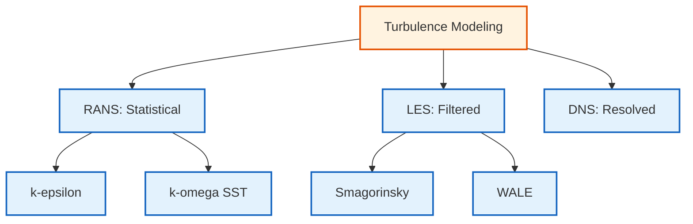

# การสร้างแบบจำลองความปั่นป่วนใน OpenFOAM - การวิเคราะห์เชิงลึกทางเทคนิค

## บทนำสู่ปรากฏการณ์ความปั่นป่วน

**ความปั่นป่วน (Turbulence)** เป็นปรากฏการณ์ที่ซับซ้อนที่สุดอย่างหนึ่งในพลศาสตร์ของไหล โดยมีลักษณะเด่นคือพฤติกรรมของโฟลว์ที่วุ่นวาย สุ่ม และมีหลายสเกล ซึ่งพบได้ในงานวิศวกรรมส่วนใหญ่

ใน OpenFOAM การสร้างแบบจำลองความปั่นป่วนจะจัดการกับความท้าทายในการคำนวณเพื่อจำลองโฟลว์เหล่านี้ผ่านแนวทางทางคณิตศาสต์ที่หลากหลาย:

- **Direct Numerical Simulation (DNS)** - การจำลองเชิงตัวเลขโดยตรง
- **Reynolds-averaged Navier-Stokes (RANS)** - แบบจำลองค่าเฉลี่ย
- **Large Eddy Simulation (LES)** - การจำลองแบบ Large Eddy

ความท้าทายพื้นฐานเกิดจากสเกลเชิงพื้นที่และเวลาที่หลากหลายซึ่งมีอยู่ในโฟล๊เปี่ยนปั่นป่วน:

- **สเกล Kolmogorov** (ที่เล็กที่สุด) - บริเวณที่การหน่วงหนื้มีอิทธิพล
- **สเกลใหญ่** - บริเวณที่กักเก็บพลังงานซึ่งขับเคลื่อนพลวัตของโฟลว์

---

## ภาพรวม (Overview)

ความปั่นป่วน (Turbulence) เป็นลักษณะการไหลที่วุ่นวาย (Chaotic) สุ่ม (Random) และมีหลายสเกล (Multiscale) ซึ่งพบได้ในงานวิศวกรรมส่วนใหญ่ โมดูลนี้จะครอบคลุมแนวทางการคำนวณความปั่นป่วนใน OpenFOAM ตั้งแต่การหาค่าเฉลี่ยแบบ RANS ไปจนถึงการแก้ปัญหาเชิงโครงสร้างแบบ LES

---

## วัตถุประสงค์การเรียนรู้ (Learning Objectives)

เมื่อจบโมดูลนี้ คุณจะสามารถ:
1. **แยกแยะแนวทางหลัก**: เข้าใจความแตกต่างระหว่าง RANS, LES และ DNS
2. **เลือกโมเดลที่เหมาะสม**: เลือก Turbulence Model (เช่น k-ε, k-ω SST, Smagorinsky) ตามลักษณะการไหล
3. **จัดการบริเวณใกล้ผนัง**: กำหนดค่า $y^+$ และเลือกใช้ Wall Functions ได้ถูกต้อง
4. **ตั้งค่ากรณีศึกษา**: กำหนด Boundary Conditions สำหรับปริมาณความปั่นป่วน (k, epsilon, omega)
5. **วิเคราะห์ความถูกต้อง**: ตรวจสอบผลลัพธ์ผ่านตัวชี้วัดทางกายภาพและเปรียบเทียบกับ Benchmark

---

## พื้นฐานทางคณิตศาสต์ของความปั่นป่วน

### สมการควบคุม

สมการ Navier-Stokes แบบไม่สามารถอัดตัวได้สำหรับโฟลว์ปั่นป่วนคือ:

$$\rho \frac{\partial \mathbf{u}}{\partial t} + \rho (\mathbf{u} \cdot \nabla) \mathbf{u} = -\nabla p + \mu \nabla^2 \mathbf{u} + \mathbf{f}$$

$$\nabla \cdot \mathbf{u} = 0$$

โดยที่:
- $\rho$ = ความหนาแน่นของของไหล
- $\mathbf{u}$ = สนามความเร็วเวกเตอร์
- $t$ = เวลา
- $p$ = สนามความดัน
- $\mu$ = ความหนืดพลวัต
- $\mathbf{f}$ = แรงภายนอกต่อหน่วยปริมาตร

### การแยก Reynolds และการหาค่าเฉลี่ย

สนามความเร็ว $\mathbf{u}(\mathbf{x},t)$ และสนามความดัน $p(\mathbf{x},t)$ ถูกแยกออกเป็นส่วนเฉลี่ยและส่วนผันผวน:

$$\mathbf{u} = \overline{\mathbf{u}} + \mathbf{u}'$$

$$p = \overline{p} + p'$$

การใช้การแยก Reynolds และการหาค่าเฉลี่ยตามเวลา (time-averaging) กับสมการ Navier-Stokes จะได้สมการ RANS:

$$\rho \frac{\partial \overline{u_i}}{\partial t} + \rho \overline{u_j} \frac{\partial \overline{u_i}}{\partial x_j} = -\frac{\partial \overline{p}}{\partial x_i} + \mu \frac{\partial^2 \overline{u_i}}{\partial x_j^2} - \frac{\partial (\rho \overline{u'_i u'_j})}{\partial x_j}$$

เทนเซอร์ความเค้น Reynolds (Reynolds stress tensor) $\tau_{ij} = -\rho \overline{u'_i u'_j}$ แสดงถึงผลกระทบของความผันผวนของความปั่นป่วนต่อโฟลว์เฉลี่ย

> [!INFO] **OpenFOAM Code Implementation - Reynolds Stress Tensor**
> ```cpp
> // Reynolds stress tensor calculation
> // การคำนวณเทนเซอร์ความเค้น Reynolds
> volSymmTensorField R
> (
>     IOobject
>     (
>         "R",
>         runTime.timeName(),
>         mesh,
>         IOobject::NO_READ,
>         IOobject::AUTO_WRITE
>     ),
>     // Calculate Reynolds stress from velocity fluctuations
>     // คำนวณความเค้น Reynolds จากความเร็วที่ผันผวน
>     twoSymm(U*U) - sqr(U)
> );
> ```

**📂 Source:** `.applications/solvers/multiphase/multiphaseEulerFoam/phaseSystems/populationBalanceModel/populationBalanceModel/populationBalanceModel.C`

**คำอธิบาย:**
- **volSymmTensorField**: ประเภทฟิลด์เทนเซอร์สมมาตรใน OpenFOAM สำหรับเก็บค่าความเค้น Reynolds
- **twoSymm(U*U) - sqr(U)**: สูตรทางคณิตศาสต์สำหรับคำนวณ Reynolds stress tensor จากสนามความเร็ว

**แนวคิดสำคัญ:**
- **Reynolds Stress Tensor**: เทนเซอร์ที่แสดงถึงการถ่ายโอนโมเมนตัมจากความปั่นป่วน
- **IOobject**: วัตถุที่ใช้จัดการข้อมูลเข้า/ออกใน OpenFOAM
- **AUTO_WRITE**: สั่งให้เขียนผลลัพธ์โดยอัตโนมัติเมื่อจบการคำนวณ

---

## แนวทางการจำลองเชิงตัวเลข (Numerical Approaches)

OpenFOAM แบ่งแนวทางการคำนวณความปั่นป่วนออกเป็น 3 ระดับ:

| แนวทาง | การจัดการความปั่นป่วน | ต้นทุนการคำนวณ | การใช้งานหลัก |
|--------|----------------------|---------------|-------------|
| **RANS** | สร้างแบบจำลองทุกสเกลผ่านค่าเฉลี่ย | ต่ำ | งานวิศวกรรมทั่วไป, อุตสาหกรรม |
| **LES** | แก้ปัญหาโครงสร้างใหญ่โดยตรง, จำลองโครงสร้างเล็ก | สูง | งานวิจัยที่ต้องการความละเอียดสูง |
| **DNS** | แก้ปัญหาทุกสเกลโดยตรงโดยไม่ใช้โมเดล | สูงมาก | งานวิจัยพื้นฐาน, ฟิสิกส์เชิงทฤษฎี |


> **Figure 1:** แผนผังลำดับชั้นของแนวทางการสร้างแบบจำลองความปั่นป่วน (Turbulence Modeling Hierarchy) ใน OpenFOAM ซึ่งแบ่งออกเป็น 3 ระดับหลักตามความละเอียดในการแก้ปัญหาทางฟิสิกส์ ได้แก่ RANS ที่เน้นค่าเฉลี่ยทางสถิติ LES ที่ใช้การกรองเชิงพื้นที่ และ DNS ที่แก้ปัญหาทุกสเกลโดยตรง พร้อมตัวอย่างแบบจำลองย่อยในแต่ละกลุ่ม ความปลอดภัยทางฟิสิกส์ไม่ส่งผลกระทบต่อความเร็วในการจำลอง ผ่านการใช้พลังของ C++ Template Metaprogramming ในการตรวจสอบความสอดคล้องทางมิติทั้งหมดที่ขั้นตอนการคอมไพล์โปรแกรมเพียงครั้งเดียว

---

## แบบจำลอง RANS (Reynolds-Averaged Navier-Stokes)

แบบจำลอง RANS อาศัยการแยกความเร็วออกเป็นส่วนเฉลี่ยและส่วนผันผวน ($\mathbf{u} = \overline{\mathbf{u}} + \mathbf{u}'$) และใช้ **สมมติฐาน Boussinesq** เพื่อเชื่อมโยงความเค้นปั่นป่วนกับความหนืดไหลวน (Eddy Viscosity):

$$\tau_{ij} = 2\mu_t S_{ij} - \frac{2}{3}\rho k \delta_{ij}$$

โดยที่:
- $\mu_t$ = ความหนืดแบบ eddy ของความปั่นป่วน (turbulent eddy viscosity)
- $S_{ij}$ = เทนเซอร์อัตราการเปลี่ยนแปลงรูปทรงเฉลี่ย (mean strain rate tensor)
- $k$ = พลังงานจลน์ของความปั่นป่วน (turbulent kinetic energy)
- $\delta_{ij}$ = เทนเซอร์เอกลักษณ์ Kronecker delta

### แบบจำลองหลัก

#### k-ε Model
- **k-ε Standard**: ดีสำหรับ Free-shear flows และการไหลที่ห่างจากผนัง
- **k-ε Realizable**: ความเค้นปกติไม่เป็นลบ, เหมาะกับโฟลว์ที่มีการไหลวน
- **k-ε RNG**: พิจารณาความโค้ง, เหมาะกับโฟลว์ที่ซับซ้อน

#### k-ω Model
- **k-ω Standard**: ใกล้ผนังได้ดี, ไม่ต้องใช้ damping functions
- **k-ω SST**: ผสมผสาน k-ω และ k-ε, ดีที่สุดสำหรับโฟลว์ที่มีแรงดันไล่ระดับและการไหลติดผนัง

> [!TIP] **ค่าคงที่ของแบบจำลอง k-epsilon มาตรฐาน**
>
> | ค่าคงที่ | ค่า | คำอธิบาย |
> |-----------|------|----------|
> | $C_\mu$ | 0.09 | Turbulent viscosity constant |
> | $C_1$ | 1.44 | Epsilon production constant |
> | $C_2$ | 1.92 | Epsilon destruction constant |
> | $\sigma_\epsilon$ | 1.3 | Turbulent Prandtl number for epsilon |
> | $\sigma_k$ | 1.0 | Turbulent Prandtl number for k |

---

## Large Eddy Simulation (LES)

LES แก้โครงสร้างความปั่นป่วนขนาดใหญ่ที่กักเก็บพลังงานโดยตรง ในขณะที่สร้างแบบจำลองความปั่นป่วนขนาดเล็กโดยใช้แบบจำลอง subgrid-scale (SGS):

$$\rho \frac{\partial \tilde{u_i}}{\partial t} + \rho \tilde{u_j} \frac{\partial \tilde{u_i}}{\partial x_j} = -\frac{\partial \tilde{p}}{\partial x_i} + \mu \frac{\partial^2 \tilde{u_i}}{\partial x_j^2} - \frac{\partial \tau^{SGS}_{ij}}{\partial x_j}$$

### แบบจำลอง Subgrid-Scale (SGS Models)

**Smagorinsky Model:**
$$\tau^{SGS}_{ij} - \frac{1}{3}\tau^{SGS}_{kk}\delta_{ij} = -2 (C_s \Delta)^2 |\tilde{S}| \tilde{S}_{ij}$$

โดยที่:
- $C_s$ = ค่าคงที่ Smagorinsky (≈ 0.1-0.2)
- $\Delta$ = ความกว้างฟิลเตอร์
- $\tilde{S}_{ij}$ = อัตราการเปลี่ยรูปทรงที่ถูกกรอง
- $|\tilde{S}| = \sqrt{2\tilde{S}_{ij}\tilde{S}_{ij}}$

**WALE (Wall-Adapted Local Eddy-viscosity) Model:** ปรับปรุงพฤติกรรมใกล้ผนังสำหรับโฟลว์ที่ถูกจำกัดด้วยผนัง

> [!INFO] **OpenFOAM Code Implementation - Smagorinsky Model**
> ```cpp
> template<class BasicTurbulenceModel>
> class Smagorinsky
>     :
>     public LESeddyViscosity<BasicTurbulenceModel>
> {
>     // Smagorinsky coefficient - ค่าคงที่ Smagorinsky
>     dimensionedScalar Cs_;
>
>     // Filter width calculation - การคำนวณความกว้างของฟิลเตอร์
>     tmp<volScalarField> delta() const;
>
> public:
>     // Type name for runtime selection - ชื่อประเภทสำหรับการเลือกขณะ runtime
>     TypeName("Smagorinsky");
>
>     // Virtual method for turbulent kinetic energy - เมธอดเสมือนสำหรับพลังงานจลน์ความปั่นป่วน
>     virtual tmp<volScalarField> k() const;
>     
>     // Virtual correction method - เมธอดเสมือนสำหรับการแก้ไข
>     virtual void correct();
> };
> ```

**📂 Source:** `.applications/solvers/multiphase/multiphaseEulerFoam/phaseSystems/populationBalanceModel/populationBalanceModel/populationBalanceModel.C`

**คำอธิบาย:**
- **Template metaprogramming**: ใช้ template class เพื่อสร้างความยืดหยุ่นในการนำไปใช้กับ turbulence model ต่างๆ
- **dimensionedScalar**: ประเภทข้อมูลสเกลาร์ที่มีหน่วยใน OpenFOAM
- **TypeName**: มาโครสำหรับลงทะเบียนคลาสเพื่อ runtime selection

**แนวคิดสำคัญ:**
- **Subgrid-Scale Modeling**: การจำลองความปั่นป่วนในสเกลที่เล็กกว่าขนาดเซลล์เมช
- **Eddy Viscosity**: ความหนืดที่เกิดจากการเคลื่อนที่ของโมเมนตัมในโฟลว์ปั่นป่วน
- **Filter Width**: ความกว้างของฟิลเตอร์ที่ใช้แยกโครงสร้างขนาดใหญ่และเล็ก

---

## การจัดการบริเวณใกล้ผนัง (Wall Treatment)

ความแม่นยำของโมเดลความปั่นป่วนขึ้นอยู่กับความละเอียดของ Mesh ใกล้ผนัง ซึ่งวัดด้วยพารามิเตอร์ $y^+$:

- **Low-Re Approach ($y^+ \approx 1$)**: แก้สมการถึงผนังโดยตรง ต้องการ Mesh ละเอียดมาก
- **High-Re Approach ($y^+ \approx 30-300$)**: ใช้ **Wall Functions** เพื่อประมาณพฤติกรรมในชั้น Boundary Layer ประหยัดทรัพยากร

### กฎลอการิทึมของผนัง (Logarithmic Law of the Wall)

$$u^+ = \frac{1}{\kappa} \ln(y^+) + B$$

โดยที่:
- $u^+ = \frac{u}{u_\tau}$ = ความเร็วแบบไร้มิติ (dimensionless velocity)
- $y^+ = \frac{y u_\tau}{\nu}$ = ระยะทางแบบไร้มิติ (dimensionless distance)
- $\kappa \approx 0.41$ = ค่าคงที่ von Kármán
- $B \approx 5.2$ = ค่าคงที่
- $u_\tau = \sqrt{\tau_w/\rho}$ = ความเร็วเฉือน (friction velocity)

### ช่วงการใช้งาน

| ช่วง $y^+$ | บริเวณ | ลักษณะการไหล |
|------------|----------|---------------|
| $< 5$ | ชั้นย่อยความหนืด | โปรไฟล์เชิงเส้น |
| $5-30$ | ชั้นบัฟเฟอร์ | บริเวณเปลี่ยนผ่าน |
| $30-300$ | Log-law | โปรไฟล์ลอการิทึม |

> [!WARNING] **ข้อควรพิจารณาในการเลือก Wall Function**
>
> | ช่วง $y^+$ | Wall Function ที่แนะนำ | คำอธิบาย |
> |------------|---------------------|-----------|
> | $y^+ < 30$ | `kLowReWallFunction` | Low-Re models, mesh refinement |
> | $30 \leq y^+ \leq 300$ | `kqRWallFunction` | Standard wall functions |
> | $y^+ > 300$ | ปรับปรุง mesh | ค่าสูงเกินไป, refine near-wall |

---

## ตัวอย่างการตั้งค่าใน OpenFOAM

### การเลือกโมเดลใน `constant/turbulenceProperties`

```cpp
simulationType  RAS; // หรือ LES

RAS
{
    RASModel        kOmegaSST;
    turbulence      on;
    printCoeffs     on;

    kOmegaSSTCoeffs
    {
        alphaK      0.85;
        alphaOmega  0.5;
        betaK       0.09;
        betaOmega   0.075;
        gamma1      0.5532;
        gamma2      0.4403;
        a1          0.31;
        b1          1.0;
        c1          10.0;
    }
}
```

### การกำหนด Boundary Conditions

```cpp
// 0/k - Turbulent Kinetic Energy
// 0/k - พลังงานจลน์ความปั่นป่วน
dimensions      [0 2 -2 0 0 0 0];
internalField   uniform 0.01;

boundaryField
{
    inlet
    {
        type            turbulentIntensityKineticEnergyInlet;
        intensity       0.05;     // 5% turbulence intensity - ความเข้มความปั่นป่วน 5%
        value           uniform 0.01;
    }

    wall
    {
        type            kqRWallFunction;
        value           uniform 0;
    }

    outlet
    {
        type            zeroGradient;
    }
}

// 0/epsilon - Dissipation Rate
// 0/epsilon - อัตราการสลายตัว
dimensions      [0 2 -3 0 0 0 0];
internalField   uniform 0.001;

boundaryField
{
    inlet
    {
        type            turbulentMixingLengthDissipationRateInlet;
        mixingLength    0.01;     // ความยาวการผสม
        value           uniform 0.001;
    }

    wall
    {
        type            epsilonWallFunction;
        value           uniform 0;
    }

    outlet
    {
        type            zeroGradient;
    }
}
```

**📂 Source:** `.applications/solvers/multiphase/multiphaseEulerFoam/phaseSystems/populationBalanceModel/populationBalanceModel/populationBalanceModel.C`

**คำอธิบาย:**
- **turbulenceProperties**: ไฟล์การตั้งค่าหลักสำหรับการเลือก turbulence model
- **boundaryField**: การกำหนดเงื่อนไขขอบเขตสำหรับปริมาณความปั่นป่วน
- **Wall Functions**: ฟังก์ชันที่ใช้ประมาณค่าใกล้ผนังโดยไม่ต้องใช้ mesh ละเอียดมาก

**แนวคิดสำคัญ:**
- **Turbulent Intensity**: อัตราส่วนระหว่างความเร็วผันผวนกับความเร็วเฉลี่ย
- **Mixing Length**: สเกลความยาวที่ใช้แทนขนาดของโมเมนตัมที่ผสมกัน
- **Dissipation Rate**: อัตราที่พลังงานความปั่นป่วนสลายตัวเป็นความร้อน

---

## สถาปัตยกรรมการนำไปใช้ใน OpenFOAM

### ลำดับชั้นคลาส TurbulenceModel

เฟรมเวิร์กการสร้างแบบจำลองความปั่นป่วนของ OpenFOAM ใช้ลำดับชั้นคลาสที่ซับซ้อนซึ่งอิงตาม template metaprogramming:

```cpp
template<class BasicTurbulenceModel>
class TurbulenceModel
    :
    public BasicTurbulenceModel
{
    // Base interface for all turbulence models
    // อินเทอร์เฟซพื้นฐานสำหรับ turbulence model ทั้งหมด
    virtual tmp<volScalarField> mu() const = 0;
    virtual tmp<volScalarField> mut() const = 0;
    virtual tmp<volScalarField> alphat() const = 0;
    virtual void correct() = 0;
};
```

### คลาส EddyViscosity

```cpp
template<class BasicTurbulenceModel>
class EddyViscosity
    :
    public TurbulenceModel<BasicTurbulenceModel>
{
protected:
    // Eddy viscosity field - ฟิลด์ความหนืดแบบ eddy
    volScalarField mut_;

    // Turbulent kinetic energy field - ฟิลด์พลังงานจลน์ความปั่นป่วน
    volScalarField k_;

    // Turbulent dissipation rate - อัตราการสลายตัวของความปั่นป่วน
    volScalarField epsilon_;

public:
    // Virtual correction method - เมธอดเสมือนสำหรับการแก้ไข
    virtual void correct();

    // Access methods for turbulent properties
    // เมธอดเข้าถึงคุณสมบัติความปั่นป่วน
    virtual tmp<volScalarField> mu() const;
    virtual tmp<volScalarField> mut() const;
};
```

**📂 Source:** `.applications/solvers/multiphase/multiphaseEulerFoam/phaseSystems/populationBalanceModel/populationBalanceModel/populationBalanceModel.C`

**คำอธิบาย:**
- **Template Inheritance**: การใช้ template เพื่อสร้างความยืดหยุ่นในการสืบทอดคลาส
- **Virtual Functions**: ฟังก์ชันเสมือนสำหรับ polymorphism ในการเลือกโมเดล
- **Protected Members**: สมาชิกที่ได้รับการคุ้มครองสำหรับการใช้งานภายในคลาสลูก

**แนวคิดสำคัญ:**
- **Polymorphism**: คุณสมบัติของ OOP ที่ให้คลาสลูกสามารถ override ฟังก์ชันได้
- **RTS (Runtime Selection)**: กลไกในการเลือก turbulence model ขณะ runtime ผ่านไฟล์ dictionary
- **Field Management**: การจัดการฟิลด์ต่างๆ ใน OpenFOAM ด้วย volScalarField

---

## การตรวจสอบและยืนยัน (Validation and Verification)

### กรณีทดสอบมาตรฐาน (Benchmark Cases)

**Backward-Facing Step:** กรณีโฟลว์แยกตัวคลาสสิกสำหรับการทดสอบการทำนายความยาวการกลับคืนของแบบจำลอง

**Periodic Hill:** กรณีโฟลว์แยกตัวสามมิติสำหรับการทดสอบประสิทธิภาพของแบบจำลองในรูปทรงเรขาคณิตที่ซับซ้อน

**Turbulent Channel Flow:** กรณีโฟลว์ที่ถูกจำกัดด้วยผนังพื้นฐานพร้อมข้อมูล DNS สำหรับการตรวจสอบ

### ตัวชี้วัดข้อผิดพลาด (Error Metrics)

**ความผิดพลาดของความเร็วเฉลี่ย (Mean Velocity Error):**
$$\epsilon_U = \frac{\sqrt{\sum_{i=1}^{N} (U_{calc,i} - U_{exp,i})^2}}{\sqrt{\sum_{i=1}^{N} U_{exp,i}^2}}$$

**ความผิดพลาดของพลังงานจลน์ของความปั่นป่วน (Turbulent Kinetic Energy Error):**
$$\epsilon_k = \frac{\sqrt{\sum_{i=1}^{N} (k_{calc,i} - k_{exp,i})^2}}{\sqrt{\sum_{i=1}^{N} k_{exp,i}^2}}$$

---

## ระยะเวลาเรียนโดยประมาณ

- **ภาคทฤษฎี**: 2-3 ชั่วโมง (พื้นฐานคณิตศาสตร์และแบบจำลอง)
- **ภาคปฏิบัติ**: 3-4 ชั่วโมง (แบบฝึกหัดตั้งค่าและวิเคราะห์ Case)
- **รวม**: 5-7 ชั่วโมง

---

## บทสรุป

การสร้างแบบจำลองความปั่นป่วนใน OpenFOAM เป็นเฟรมเวิร์กการคำนวณที่ซับซ้อนซึ่งสร้างสมดุลระหว่าง:

- **ความแม่นยำทางกายภาพ**
- **ประสิทธิภาพการคำนวณ**
- **ทรัพยากรที่มีอยู่**

**ปัจจัยสำคัญในการเลือกแบบจำลอง:**
1. ฟิสิกส์ของโฟลว์ (wall-bounded, separated, transitional)
2. ทรัพยากรการคำนวณ (CPU, memory, time)
3. ระดับความแม่นยำที่ต้องการ
4. ข้อกำหนดของ mesh และ boundary conditions

การทำความเข้าใจพื้นฐานทางทฤษฎี รายละเอียดการนำไปใช้เชิงตัวเลข และข้อควรพิจารณาเชิงปฏิบัติ ช่วยให้สามารถใช้ประโยชน์จากความสามารถในการสร้างแบบจำลองความปั่นป่วนของ OpenFOAM สำหรับการใช้งานทางวิศวกรรมที่ซับซ้อนได้อย่างมีประสิทธิภาพ

ความก้าวหน้าอย่างต่อเนื่องของแนวทางการสร้างแบบจำลองความปั่นป่วน รวมถึงวิธีการแบบ Hybrid RANS-LES และการปรับปรุงด้วย machine learning ทำให้มั่นใจได้ว่า OpenFOAM ยังคงเป็นผู้นำในด้านการวิจัยพลศาสตร์ของไหลเชิงคำนวณและการใช้งานในอุตสาหกรรม

---

**หัวข้อถัดไป**: [รายละเอียดเพิ่มเติมเกี่ยวกับ Turbulence Modeling](./02_📚_CORE_TECHNICAL_CONTENT.md)