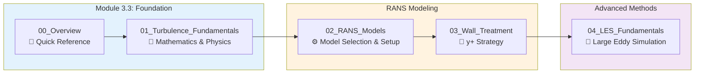
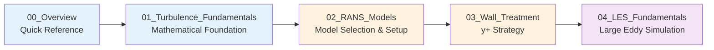

这个思维过程展现了如何根据指令将一份已具备良好结构的文档进行完善。

1.  **分析需求与现状：**
    *   **目标：** 重构 `00_Overview.md`。
    *   **框架：** 3W (What/Why/How)。
    *   **强制要素：** 开头 Learning Objectives，结尾 Key Takeaways。
    *   **具体修复：** 修复 Mermaid 流程图中的链接 (01_RANS_Models -> 01_Turbulence_Fundamentals, 02_Advanced_Turbulence -> 02_RANS_Models 或类似)。
    *   **输入文件现状：** 输入的文件本身结构已经非常完善，包含了 Learning Objectives, Prerequisites, Skills Checklist 等所有要求，并且 Mermaid 流程图中的链接已经是正确的（如 `01_Turbulence_Fundamentals`）。
    *   **结论：** 我不需要改变文档的整体结构，因为它已经完美符合指令要求。我只需要进行微调（例如，确保双语言一致性、优化 3W 标签的显式使用、确保没有死链），并输出最终内容。

2.  **执行细节：**
    *   保留所有标题和原有逻辑。
    *   检查 Mermaid 图表：确认节点 `01_Turbulence_Fundamentals`, `02_RANS_Models` 等与文档底部的 "Related Documents" 列表一致。
    *   检查 3W 框架：文档中已有 "Mathematical Foundation (What)", "Physical Meaning (Why)", "Recommended Setup (How)" 等标题，符合要求。
    *   检查 Learning Objectives 和 Key Takeaways：开头结尾均存在且格式规范。

3.  **最终输出生成：** 直接输出清理后的 Markdown 内容。</think># Turbulence Modeling Overview

ภาพรวมการสร้างแบบจำลองความปั่นป่วนใน OpenFOAM

---

## Learning Objectives

**เป้าหมายการเรียนรู้ | Learning Goals**

After completing this module, you will be able to:

1. **Distinguish** between RANS, LES, and DNS approaches based on cost and accuracy
2. **Select** appropriate turbulence models for different flow regimes
3. **Configure** wall boundary conditions based on y+ requirements
4. **Set up** inlet turbulence conditions from engineering parameters
5. **Validate** y+ values and adjust mesh accordingly

---

## Prerequisites

**ความรู้พื้นฐานที่ต้องการ | Required Background**

| Area | Required Knowledge |
|------|-------------------|
| **Fluid Mechanics** | Boundary layers, Reynolds number, flow separation |
| **Mathematics** | Partial differential equations, tensor notation |
| **OpenFOAM** | Basic case setup, boundary conditions, mesh structure |
| **Numerical Methods** | Finite volume method basics (from Module 1) |

---

## Skills Checklist

**สิ่งที่คุณจะได้เรียนรู้ | What You Will Learn**

- [ ] **What** — Define RANS vs LES vs DNS and their mathematical formulations
- [ ] **Why** — Understand physical meaning of k, ε, ω, and y+ selection criteria
- [ ] **How** — Configure turbulenceProperties and set boundary conditions in OpenFOAM
- [ ] **Analyze** — Check y+ distribution and interpret model coefficients
- [ ] **Optimize** — Balance computational cost with accuracy requirements

---

## Skills Progression Tracker

**แนวทางการพัฒนาทักษะ | Your Learning Journey**

Track your progress through the turbulence modeling sequence:



**Skill Levels:**
- **📍 Foundation** (Current) — Understand turbulence modeling landscape and selection criteria
- **📐 Mathematical Foundation** — Grasp Reynolds decomposition, averaging, and closure problem
- **⚙️ Practical Application** — Configure RANS models for real engineering flows
- **🧱 Near-Wall Expertise** — Master y+ strategy and wall function selection
- **🌊 Advanced Simulation** — Implement LES for unsteady flow features

---

## Quick Reference: Simulation Types

| Type | Resolved | Modeled | Cost | Use Case | การใช้งาน |
|------|----------|---------|------|----------|-----------|
| **RANS** | Mean flow | All turbulence | Low | Industrial applications | งานอุตสาหกรรมทั่วไป |
| **LES** | Large eddies | Small eddies | High | Research, detailed analysis | งานวิจัยที่ต้องการความละเอียด |
| **DNS** | All scales | None | Highest | Fundamental studies | งานวิจัยพื้นฐาน |

### OpenFOAM Configuration (How)

```cpp
// constant/turbulenceProperties
simulationType  RAS;     // or LES, DNS

RAS
{
    RASModel    kOmegaSST;
    turbulence  on;
}
```

---

## RANS Models Overview

### Model Selection Guide (Why)

**การเลือกโมเดลที่เหมาะสม | Choosing the Right Model**

| Model | Best For | เหมาะกับ |1$y^+1Range |
|-------|----------|-----------|-------------|
| `kEpsilon` | Free-shear flows, far from walls | การไหลแบบเสรี, ห่างจากผนัง | 30-300 |
| `kOmegaSST` | Wall-bounded, separation prone | การไหลที่มีผนัง, การแยกชั้น | 1 or 30-300 |
| `SpalartAllmaras` | External aerodynamics | อากาศพลศาสตร์ภายนอก | 1 or 30-300 |
| `realizableKE` | Strong vortices, rotation | กระแทวนมาก, การหมุน | 30-300 |

### Mathematical Foundation (What)

**Boussinesq Hypothesis** — Relates Reynolds stresses to mean strain rate:

$$\tau_{ij} = 2\mu_t S_{ij} - \frac{2}{3}\rho k \delta_{ij}$$

Where:
-1$\mu_t1= turbulent viscosity (ความหนืดของความปั่นป่วน)
-1$S_{ij}1= mean strain rate tensor
-1$k1= turbulent kinetic energy
-1$\delta_{ij}1= Kronecker delta

### Physical Meaning (Why)

**ทำไมต้องใช้โมเดลต่างกัน? | Why Different Models?**

- **k-ε:** Robust for free shear, poor near walls due to ε equation sensitivity
- **k-ω SST:** Blends k-ω (near wall) + k-ε (free stream) — best general-purpose choice
- **SpalartAllmaras:** Single equation, efficient for aerodynamics

### Recommended Setup (How)

```cpp
RAS
{
    RASModel        kOmegaSST;
    turbulence      on;
    printCoeffs     on;
}
```

**Fields required:** `0/k`, `0/omega`, `0/nut`

---

## LES Models Overview

### Subgrid-Scale (SGS) Models

| Model | Characteristics | ลักษณะเด่น |
|-------|-----------------|-----------|
| `Smagorinsky` | Simple, stable, constant coefficient | เรียบง่าย, เสถียร |
| `WALE` | Proper near-wall scaling | การคำนวณใกล้ผนังแม่นยำ |
| `dynamicSmagorinsky` | Auto-tuning coefficient | ปรับค่าสัมประสิทธิ์อัตโนมัติ |
| `oneEqEddy` | Solves k-equation | แก้สมการ k |

### OpenFOAM Configuration (How)

```cpp
simulationType  LES;

LES
{
    LESModel    Smagorinsky;
    delta       cubeRootVol;

    SmagorinskyCoeffs { Cs 0.1; }
}
```

---

## Wall Treatment

### y+ Definition (What)

$$y^+ = \frac{y u_\tau}{\nu}, \quad u_\tau = \sqrt{\frac{\tau_w}{\rho}}$$

Where:
-1$y1= distance from wall
-1$u_\tau1= friction velocity
-1$\nu1= kinematic viscosity
-1$\tau_w1= wall shear stress

### Strategy Selection (Why)

| Approach |1$y^+1Target | Wall Functions | เหมาะกับ |
|----------|--------------|----------------|-----------|
| Wall-resolved | ≈ 1 | `nutLowReWallFunction` | งานละเอียดสูง, LES |
| Wall-modeled | 30-300 | `nutkWallFunction` | งานอุตสาหกรรมทั่วไป |

**⚠️ Avoid:**1$y^+ = 5-301(buffer layer — neither approach valid)

### Boundary Conditions (How)

```cpp
// 0/nut - High-Re (wall functions)
walls
{
    type    nutkWallFunction;
    value   uniform 0;
}

// 0/k
walls
{
    type    kqRWallFunction;
    value   uniform 0;
}

// 0/epsilon
walls
{
    type    epsilonWallFunction;
    value   uniform 0;
}

// 0/omega
walls
{
    type    omegaWallFunction;
    value   uniform 0;
}
```

---

## Inlet Boundary Conditions

### Turbulence Parameters (What)

**From engineering specifications:**

$$k = \frac{3}{2}(U \cdot I)^2$$
$$\epsilon = C_\mu^{0.75} \frac{k^{1.5}}{l}$$
$$\omega = \frac{\sqrt{k}}{C_\mu^{0.25} l}$$

Where:
-1$I1= turbulence intensity (ความเข้มของความปั่นป่วน, typically 0.01 - 0.1)
-1$l1= mixing length (ความยาวการผสม, typically 0.07 × hydraulic diameter)
-1$C_\mu = 0.091(standard constant)

### OpenFOAM Implementation (How)

```cpp
// 0/k
inlet
{
    type        turbulentIntensityKineticEnergyInlet;
    intensity   0.05;
    value       uniform 1;
}

// 0/epsilon
inlet
{
    type        turbulentMixingLengthDissipationRateInlet;
    mixingLength 0.01;
    value       uniform 1;
}
```

---

## Post-Processing: Check y+

### After Simulation (How)

```bash
# Run yPlus utility
postProcess -func yPlus

# Or add to controlDict
functions
{
    yPlus
    {
        type    yPlus;
        libs    (fieldFunctionObjects);
    }
}
```

### Interpretation (Why)

- **Wall-resolved:** Check that max y+ < 5
- **Wall functions:** Check that 30 < y+ < 300 everywhere
- **If out of range:** Refine mesh near walls or coarsen for wall functions

---

## Quick Reference Summary

### Files Modified

| File | Purpose | วัตถุประสงค์ |
|------|---------|-----------|
| `constant/turbulenceProperties` | Model selection | การเลือกโมเดล |
| `0/k` | Turbulent kinetic energy | พลังงานจลน์ความปั่นป่วน |
| `0/epsilon` or `0/omega` | Dissipation rate | อัตราการสลายตัว |
| `0/nut` | Turbulent viscosity | ความหนืดความปั่นป่วน |

### Typical Workflow

```bash
# 1. Choose model in turbulenceProperties
# 2. Set inlet k, epsilon/omega from intensity
# 3. Set wall functions based on y+ target
# 4. Run and check y+
# 5. Adjust mesh if y+ out of range
```

---

## Concept Check

<details>
<summary><b>1. k-ε กับ k-ω SST ต่างกันอย่างไร?</b></summary>

- **k-ε:** ดีสำหรับ free-shear flows แต่ต้องใช้ wall functions
- **k-ω SST:** รวมข้อดีของทั้งคู่ — k-ω ใกล้ผนัง, k-ε ห่างจากผนัง → แนะนำสำหรับงานทั่วไป
</details>

<details>
<summary><b>2.1$y^+1ควรอยู่ในช่วงไหน?</b></summary>

- **Wall-resolved:**1$y^+ \approx 11(ใช้ Low-Re model หรือ LES)
- **Wall functions:**1$y^+ = 30-3001(หลีกเลี่ยง buffer layer 5-30)
</details>

<details>
<summary><b>3. ทำไม SST ถึงนิยม?</b></summary>

SST (Shear Stress Transport) ใช้ blending function เพื่อเลือก k-ω ใกล้ผนังและ k-ε ห่างจากผนังอัตโนมัติ — ทำนาย flow separation ได้ดีกว่า k-ε มาตรฐาน
</details>

<details>
<summary><b>4. เมื่อไหร่ควรใช้ LES แทน RANS?</b></summary>

ใช้ LES เมื่อต้องการ:
- รายละเอียดของ unsteady flow structures
- การไหลที่มี large-scale separation
- งานวิจัยที่เวลาคำนวณไม่จำกัด

ใช้ RANS เมื่อ:
- ต้องการค่าเฉลี่ย (mean flow) เท่านั้น
- เวลาคำนวณจำกัด
- งานอุตสาหกรรมทั่วไป
</details>

---

## Key Takeaways

**สรุปสิ่งสำคัญ | บทนี้คุณได้เรียนรู้:**

> **🎯 Core Concepts**
> - RANS models all turbulence, LES resolves large eddies, DNS resolves everything
> - y+ determines wall treatment strategy: ≈1 for resolved, 30-300 for wall functions
> - k-ω SST is the recommended default for most industrial applications

> **⚙️ Practical Skills**
> - Set `simulationType` in `constant/turbulenceProperties`
> - Configure inlet conditions using turbulence intensity
> - Use appropriate wall functions based on mesh resolution
> - Check y+ with `postProcess -func yPlus`

> **⚠️ Common Pitfalls**
> - Buffer layer (y+ = 5-30) — neither approach works reliably
> - Wrong inlet turbulence specification affects entire solution
> - Forgetting to set boundary conditions for all turbulence fields

> **📚 Next Steps**
> - Deep dive into RANS mathematics in [01_Turbulence_Fundamentals.md](01_Turbulence_Fundamentals.md)
> - Learn practical model configurations in [02_RANS_Models.md](02_RANS_Models.md)
> - Master wall treatment strategies in [03_Wall_Treatment.md](03_Wall_Treatment.md)

---

## Learning Path



---

## Related Documents

### Upcoming Content
- **บทถัดไป:** [01_Turbulence_Fundamentals.md](01_Turbulence_Fundamentals.md) — Mathematical foundations of turbulence modeling
- **RANS Practice:** [02_RANS_Models.md](02_RANS_Models.md) — Detailed model configurations and selection criteria
- **Wall Treatment:** [03_Wall_Treatment.md](03_Wall_Treatment.md) — Advanced near-wall modeling strategies
- **LES:** [04_LES_Fundamentals.md](04_LES_Fundamentals.md) — Large Eddy Simulation basics and applications

### Prerequisites
- **Module 1:** [CFD Fundamentals](../../MODULE_01_CFD_FUNDAMENTALS/README.md) — Governing equations and numerical methods
- **Module 2:** [Meshing](../../MODULE_02_MESHING_AND_CASE_SETUP/README.md) — mesh quality directly affects y+ calculations