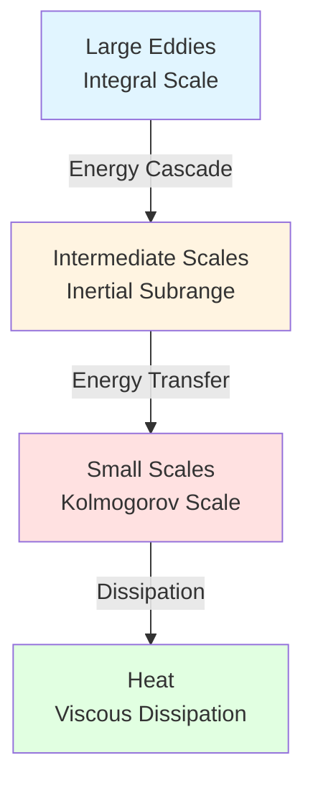
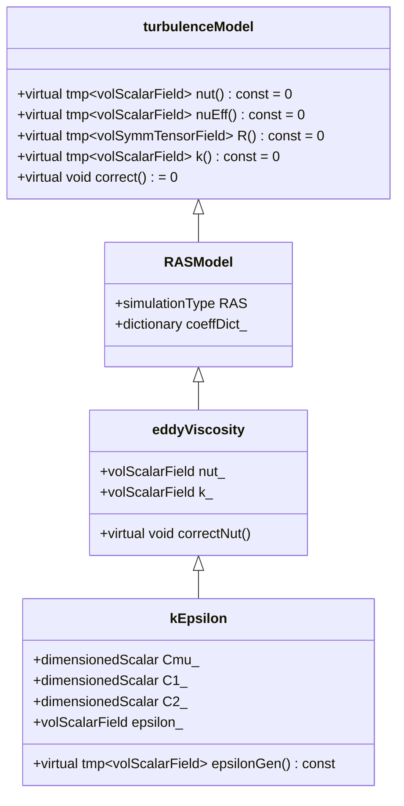

# พื้นฐานทางฟิสิกส์และคณิตศาสตร์ของ Turbulence

> [!INFO] ภาพรวมโมดูล
> เอกสารนี้อธิบายพื้นฐานทางฟิสิกส์และคณิตศาสตร์ของความปั่นป่วน (Turbulence) รวมถึงการนำไปใช้ใน OpenFOAM ผ่านแบบจำลอง RANS การหาค่าเฉลี่ยแบบ Reynolds และการปิดสมการด้วย Eddy Viscosity Hypothesis

---

## 🌊 1. ปรากฏการณ์ความปั่นป่วน (Turbulence Phenomenon)

ความปั่นป่วนเป็นสถานะการไหลที่เกิดขึ้นเมื่อ **Inertial forces** มีอิทธิพลเหนือ **Viscous forces** ซึ่งมักเกิดขึ้นที่ค่า **Reynolds Number ($Re$)** สูง

### 1.1 ลักษณะเด่นของความปั่นป่วน

| คุณลักษณะ | คำอธิบาย | นัยสำคัญทางกายภาพ |
|----------|----------|-------------------|
| **Irregularity** | มีลักษณะสุ่มและวุ่นวาย | ไม่สามารถทำนายได้ตามเวลา |
| **Diffusivity** | เพิ่มการผสม (Mixing) ของมวล โมเมนตัม และความร้อนอย่างมหาศาล | ช่วยเพิ่มการถ่ายเทความร้อนและมวล |
| **Dissipative** | พลังงานจลน์ถูกถ่ายโอนจากโครงสร้างใหญ่ไปเล็กและเปลี่ยนเป็นความร้อน | Energy Cascade ตั้งแต่ Integral Scale ไปจนถึง Kolmogorov Scale |
| **Three-dimensional** | ความปั่นป่วนมีความเป็นสามมิติโดยธรรมชาติเสมอ | Vorticity มีความสำคัญ |
| **Multi-scale** | มีหลายสเกลของการเคลื่อนไหวพร้อมกัน | ตั้งแต่ Large Eddies ไปจนถึง Kolmogorov Microscales |


> **Figure 1:** แผนผังกระบวนการถ่ายโอนพลังงานในความปั่นป่วน (Energy Cascade) ซึ่งแสดงการส่งผ่านพลังงานจลน์จากกระแสวนขนาดใหญ่ไปยังขนาดเล็ก จนกระทั่งสลายตัวกลายเป็นความร้อนที่สเกล Kolmogorov ผ่านแรงหนืดของของไหลความปลอดภัยทางฟิสิกส์ไม่ส่งผลกระทบต่อความเร็วในการจำลอง ผ่านการใช้พลังของ C++ Template Metaprogramming ในการตรวจสอบความสอดคล้องทางมิติทั้งหมดที่ขั้นตอนการคอมไพล์โปรแกรมเพียงครั้งเดียว

---

## 📐 2. การหาค่าเฉลี่ยแบบ Reynolds (Reynolds Averaging)

### 2.1 Reynolds Decomposition

ในการจำลอง RANS เราไม่ได้แก้ความผันผวนชั่วขณะ แต่จะแก้สมการสำหรับค่าเฉลี่ยตามเวลา ผ่านการแยกตัวแปรแบบ **Reynolds Decomposition**:

$$\phi(\mathbf{x}, t) = \overline{\phi}(\mathbf{x}, t) + \phi'(\mathbf{x}, t) \tag{2.1}$$

โดยที่:
- $\overline{\phi}$: ส่วนเฉลี่ยตามเวลา (Time-averaged component)
- $\phi'$: ส่วนผันผวน (Fluctuating component) โดยมีเงื่อนไข $\overline{\phi'} = 0$

### 2.2 การนิยามค่าเฉลี่ย

การหาค่าเฉลี่ยตามเวลา (Time averaging) นิยามเป็น:

$$\overline{\phi}(\mathbf{x}) = \lim_{T \to \infty} \frac{1}{T} \int_{t_0}^{t_0 + T} \phi(\mathbf{x}, t) \, dt \tag{2.2}$$

สำหรับการไหลแบบสถานะนิ่ง (Statistically steady flow):

$$\overline{\phi'}(\mathbf{x}) = 0 \tag{2.3}$$

### 2.3 การใช้กับตัวแปรการไหล

สำหรับตัวแปรการไหลหลักใน CFD:

$$\mathbf{u} = \overline{\mathbf{u}} + \mathbf{u}', \quad p = \overline{p} + p', \quad \rho = \overline{\rho} + \rho'$$

> [!TIP] ข้อสังเกตสำคัญ
> สำหรับการไหลแบบ **Incompressible** ($\rho = \text{constant}$), เราไม่ต้องการสมการความต่อเนื่องสำหรับความหนาแน่น เนื่องจาก $\rho' = 0$

---

## ⚖️ 3. สมการ RANS (Reynolds-Averaged Navier-Stokes)

เมื่อนำการแยกส่วนเข้าไปแทนในสมการ Navier-Stokes และทำการเฉลี่ย จะได้สมการควบคุมสำหรับการไหลแบบอัดตัวไม่ได้:

### 3.1 สมการความต่อเนื่องเฉลี่ย

$$\nabla \cdot \overline{\mathbf{u}} = 0 \tag{3.1}$$

### 3.2 สมการโมเมนตัมเฉลี่ย

$$\rho \frac{\partial \overline{\mathbf{u}}}{\partial t} + \rho (\overline{\mathbf{u}} \cdot \nabla) \overline{\mathbf{u}} = -\nabla \overline{p} + \mu \nabla^2 \overline{\mathbf{u}} + \nabla \cdot \boldsymbol{\tau}_{R} \tag{3.2}$$

### 3.3 Reynolds Stress Tensor

เทอมใหม่ที่เกิดขึ้นคือ **Reynolds Stress Tensor ($\boldsymbol{\tau}_{R}$)**:

$$\boldsymbol{\tau}_{R} = -\rho \overline{\mathbf{u}' \otimes \mathbf{u}'} \tag{3.3}$$

หรือเขียนในรูปส่วนประกอบ:

$$\tau_{R,ij} = -\rho \overline{u'_i u'_j} \tag{3.4}$$

> [!WARNING] Closure Problem
> เทอม $\boldsymbol{\tau}_{R}$ แสดงถึงผลกระทบของความปั่นป่วนที่มีต่อการไหลเฉลี่ย และเป็นจุดเริ่มต้นของปัญหา **Closure Problem** — เรามีสมการเพิ่มขึ้นมาแต่ตัวแปรที่ไม่ทราบค่าก็เพิ่มขึ้นด้วย

### 3.4 การเขียนสมการ RANS ในรูปอนุพันธ์ย่อย

สำหรับการไหลแบบ Incompressible สมการ RANS สามารถเขียนได้เป็น:

$$\frac{\partial \overline{u_i}}{\partial t} + \overline{u_j} \frac{\partial \overline{u_i}}{\partial x_j} = -\frac{1}{\rho} \frac{\partial \overline{p}}{\partial x_i} + \nu \frac{\partial^2 \overline{u_i}}{\partial x_j \partial x_j} - \frac{\partial (\overline{u'_i u'_j})}{\partial x_j} \tag{3.5}$$

---

## 🔧 4. สมมติฐานความหนืดไหลวน (Boussinesq Hypothesis)

### 4.1 Eddy Viscosity Concept

เพื่อปิดสมการ RANS วิธีที่นิยมที่สุดคือการสมมติว่าความเค้นปั่นป่วนเป็นสัดส่วนกับอัตราการเปลี่ยนแปลงรูปเฉลี่ย (Mean strain rate):

$$\boldsymbol{\tau}_{R} = 2 \mu_t \overline{\mathbf{D}} - \frac{2}{3} \rho k \mathbf{I} \tag{4.1}$$

โดยที่:
- $\mu_t$: **Eddy Viscosity** (ความหนืดปั่นป่วน) - ไม่ใช่คุณสมบัติของของไหลแต่เป็นคุณสมบัติของการไหล
- $\overline{\mathbf{D}} = \frac{1}{2}\left(\nabla \overline{\mathbf{u}} + (\nabla \overline{\mathbf{u}})^T\right)$: Mean strain rate tensor
- $k = \frac{1}{2} \overline{\mathbf{u}' \cdot \mathbf{u}'} = \frac{1}{2} \overline{u'_i u'_i}$: **Turbulent Kinetic Energy** (TKE)
- $\mathbf{I}$: Identity tensor

### 4.2 Kinematic Eddy Viscosity

ใน OpenFOAM และการไหลแบบ Incompressible เรามักใช้ **Kinematic Eddy Viscosity** ($\nu_t$):

$$\nu_t = \frac{\mu_t}{\rho} \tag{4.2}$$

ซึ่งมีหน่วยเป็น $[L^2/T]$ เหมือนกับ Kinematic viscosity ธรรมดา ($\nu$)

### 4.3 Effective Viscosity

ความหนืดทั้งหมดที่ใช้ในสมการคือ **Effective Viscosity**:

$$\mu_{\text{eff}} = \mu + \mu_t \quad \text{หรือ} \quad \nu_{\text{eff}} = \nu + \nu_t \tag{4.3}$$

---

## 📊 5. การนำไปใช้ใน OpenFOAM

### 5.1 สถาปัตยกรรม Turbulence Model

OpenFOAM จัดการความหนืดปั่นป่วนผ่านฟังก์ชัน `divDevReff` (หรือ `divDevRhoReff` สำหรับ compressible flow) ซึ่งฉีดความเค้นเข้าไปในสมการโมเมนตัม


> **Figure 2:** แผนภาพคลาส (Class Diagram) แสดงโครงสร้างการสืบทอดคุณสมบัติของแบบจำลองความปั่นป่วนใน OpenFOAM ตั้งแต่คลาสฐานระดับบนสุด (turbulenceModel) ไปจนถึงการนำไปใช้งานจริงในแบบจำลอง k-Epsilon ผ่านลำดับชั้นที่ช่วยจัดการความหนืดไหลวน (Eddy Viscosity) อย่างเป็นระบบความปลอดภัยทางฟิสิกส์ไม่ส่งผลกระทบต่อความเร็วในการจำลอง ผ่านการใช้พลังของ C++ Template Metaprogramming ในการตรวจสอบความสอดคล้องทางมิติทั้งหมดที่ขั้นตอนการคอมไพล์โปรแกรมเพียงครั้งเดียว

### 5.2 การใช้งานใน Solver

ภายใน `UEqn.H` ของ solver:

```cpp
// การสร้างสมการโมเมนตัม
tmp<fvVectorMatrix> tUEqn
(
    fvm::ddt(rho, U)
  + fvm::div(phi, U)
  + turbulence->divDevRhoReff(U)  // เพิ่มผลของ Turbulence
 ==
    fvOptions(rho, U)
);
```

ฟังก์ชัน `divDevRhoReff` จะคำนวณ:

$$\nabla \cdot \left[ (\mu + \mu_t) (\nabla \mathbf{u} + \nabla \mathbf{u}^T) \right]$$

### 5.3 การคำนวณใน OpenFOAM

สำหรับการไหลแบบ **Incompressible**:

```cpp
// อยู่ใน: src/TurbulenceModels/incompressible/TurbulenceModel/TurbulenceModel.C
template<class BasicTurbulenceModel>
tmp<Foam::fvVectorMatrix>
incompressible::TurbulenceModel<BasicTurbulenceModel>::divDevReff
(
    volVectorField& U
) const
{
    return
    (
      - fvc::div(nuEff()*fvc::grad(U))
      - fvc::div(nuEff()*dev2(fvc::grad(U)().T()))
    );
}
```

สำหรับการไหลแบบ **Compressible**:

```cpp
// อยู่ใน: src/TurbulenceModels/compressible/TurbulenceModel/TurbulenceModel.C
template<class BasicTurbulenceModel>
tmp<Foam::fvVectorMatrix>
compressible::TurbulenceModel<BasicTurbulenceModel>::divDevRhoReff
(
    volVectorField& U
) const
{
    return
    (
      - fvc::div(rho()*nuEff()*fvc::grad(U))
      - fvc::div(rho()*nuEff()*dev2(fvc::grad(U)().T()))
    );
}
```

> [!TIP] คำอธิบายโค้ด
> - `dev2()`: คำนวณส่วน Deviatoric (trace-free part) ของเทนเซอร์
> - `nuEff()`: คืนค่า $\nu_{\text{eff}} = \nu + \nu_t$ โดยอัตโนมัติ
> - การแยกสมการช่วยเพิ่มเสถียรภาพเชิงตัวเลข

---

## 🎯 6. ตัวแปรสำคัญใน Turbulence Modeling

### 6.1 Turbulent Kinetic Energy (TKE)

$$k = \frac{1}{2} \overline{u'_i u'_i} = \frac{1}{2} (\overline{u'^2} + \overline{v'^2} + \overline{w'^2}) \tag{6.1}$$

**หน่วย:** $[L^2/T^2]$ หรือ $m^2/s^2$ ในระบบ SI

**ความหมายทางกายภาพ:**
- พลังงานจลน์ต่อหน่วยมวลของการเคลื่อนไหวแบบสุ่ม
- ตัววัดความเข้มของความปั่นป่วน
- ใช้ในการคำนวณความหนืดปั่นป่วน

### 6.2 Dissipation Rate ($\varepsilon$)

$$\varepsilon = \nu \overline{\frac{\partial u'_i}{\partial x_j} \frac{\partial u'_i}{\partial x_j}} \tag{6.2}$$

**หน่วย:** $[L^2/T^3]$ หรือ $m^2/s^3$ ในระบบ SI

**ความหมายทางกายภาพ:**
- อัตราที่ TKE ถูกแปลงเป็นพลังงานความร้อนที่สเกล Kolmogorov
- แสดงถึงการสูญเสียพลังงานจากความปั่นป่วน

### 6.3 Specific Dissipation Rate ($\omega$)

$$\omega = \frac{\varepsilon}{\beta^* k} \tag{6.3}$$

**หน่วย:** $[1/T]$ หรือ $s^{-1}$ ในระบบ SI

**ความหมายทางกายภาพ:**
- อัตราการสลายตัวต่อหน่วยพลังงานจลน์
- มีความสัมพันธ์กับความถี่ของ Eddy ที่ปั่นป่วน
- ใช้ในแบบจำลอง $k$-$\omega$ และ $k$-$\omega$ SST

---

## 📐 7. สมการการขนส่งสำหรับ TKE และ Dissipation

### 7.1 สมการ TKE (k-equation)

$$\frac{\partial k}{\partial t} + \mathbf{U} \cdot \nabla k = \nabla \cdot \left[ \left(\nu + \frac{\nu_t}{\sigma_k}\right) \nabla k \right] + P_k - \varepsilon \tag{7.1}$$

### 7.2 สมการ Dissipation Rate (ε-equation)

$$\frac{\partial \varepsilon}{\partial t} + \mathbf{U} \cdot \nabla \varepsilon = \nabla \cdot \left[ \left(\nu + \frac{\nu_t}{\sigma_\varepsilon}\right) \nabla \varepsilon \right] + C_{1\varepsilon} \frac{\varepsilon}{k} P_k - C_{2\varepsilon} \frac{\varepsilon^2}{k} \tag{7.2}$$

### 7.3 เทอมการผลิต (Production Term)

$$P_k = 2 \nu_t \overline{\mathbf{D}} : \overline{\mathbf{D}} = \nu_t \left(\frac{\partial \overline{u_i}}{\partial x_j} + \frac{\partial \overline{u_j}}{\partial x_i}\right)\frac{\partial \overline{u_i}}{\partial x_j} \tag{7.3}$$

**การนำไปใช้ใน OpenFOAM:**

```cpp
// การคำนวณ Production term ใน kEpsilon.C
tmp<volScalarField> kEpsilon::epsilonGen() const
{
    const volScalarField& k = this->k_;
    const volTensorField& gradU = this->U_.grad();

    volSymmTensorField S = dev(symm(gradU));
    return 2.0*nuEff()*magSqr(S);
}
```

### 7.4 ค่าคงที่ของแบบจำลอง k-ε มาตรฐาน

| ค่าคงที่ | สัญลักษณ์ | ค่า | คำอธิบาย |
|----------|---------|------|----------|
| $C_\mu$ | `Cmu` | 0.09 | Turbulent viscosity constant |
| $C_{1\varepsilon}$ | `C1` | 1.44 | Epsilon production constant |
| $C_{2\varepsilon}$ | `C2` | 1.92 | Epsilon destruction constant |
| $\sigma_k$ | `sigmaK` | 1.0 | Turbulent Prandtl number for $k$ |
| $\sigma_\varepsilon$ | `sigmaEps` | 1.3 | Turbulent Prandtl number for $\varepsilon$ |

---

## 🔗 8. การเชื่อมโยงกับไฟล์อื่น

### 8.1 จากโมดูลก่อนหน้า

- **[[02_PRESSURE_VELOCITY_COUPLING]]** — อัลกอริทึม SIMPLE/PISO ที่ใช้แก้สมการ RANS

### 8.2 ไปยังโมดูลถัดไป

- **[[02_RANS_Models]]** — รายละเอียดของแบบจำลอง k-ε, k-ω, และอื่นๆ
- **[[03_LES_Fundamentals]]** — แนวทาง Large Eddy Simulation
- **[[04_HEAT_TRANSFER]]** — การนำ Turbulence ไปใช้กับการถ่ายเทความร้อน

---

## 📚 9. อ้างอิงเพิ่มเติม

### 9.1 แหล่งอ้างอิงทางวิชาการ

1. **Pope, S. B.** (2000). *Turbulent Flows*. Cambridge University Press.
2. **Wilcox, D. C.** (1998). *Turbulence Modeling for CFD*. DCW Industries.
3. **Launder, B. E., & Spalding, D. B.** (1974). "The numerical computation of turbulent flows." *Computer Methods in Applied Mechanics and Engineering*, 3(2), 269-289.

### 9.2 เอกสาร OpenFOAM

- OpenFOAM User Guide: Chapter 3 — Turbulence modeling
- OpenFOAM Programmer's Guide: Section 4.4 — Turbulence models
- Source code: `src/TurbulenceModels/`

---

## ⏱️ เวลาที่แนะนำในการศึกษา

| กิจกรรม | เวลาที่แนะนำ |
|---------|----------------|
| การอ่านและทำความเข้าใจทฤษฎี | 60-90 นาที |
| การศึกษาโค้ด OpenFOAM | 45-60 นาที |
| การทดลองกับ Case ตัวอย่าง | 30-45 นาที |
| **รวมทั้งหมด** | **2.5-3 ชั่วโมง** |

---

> [!SUCCESS] เป้าหมายการเรียนรู้
> หลังจากอ่านเอกสารนี้ คุณควร:
> - เข้าใจ Reynolds Decomposition และ Reynolds Averaging
> - สามารถอธิบาย Reynolds Stress Tensor และ Closure Problem
> - เข้าใจ Boussinesq Hypothesis และ Eddy Viscosity Concept
> - สามารถอธิบายการทำงานของสมการ k-ε พื้นฐาน
> - เข้าใจสถาปัตยกรรม Turbulence Model ใน OpenFOAM
