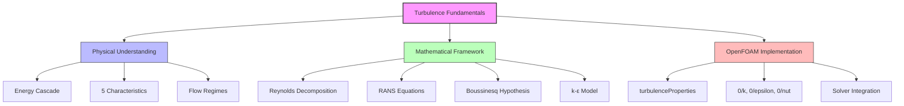

# Turbulence Fundamentals

พื้นฐานทางฟิสิกส์และคณิตศาสตร์ของความปั่นป่วน

---

## Learning Objectives

**บทนี้คุณจะได้เรียนรู้ (In this section you will learn):**

- **What** - เข้าใจคำจำกัดความและสมการพื้นฐานของความปั่นป่วน (Reynolds decomposition, RANS equations, k-ε model)
- **Why** - เข้าใจความหมายทางฟิสิกส์และเกณฑ์การเลือกใช้โมเดล (Energy cascade, closure problem, ความแตกต่าง RANS/LES/DNS)
- **How** - นำไปใช้ใน OpenFOAM (turbulenceProperties, boundary conditions, solver integration)

---

## Skills Checklist

**ทักษะที่คุณจะได้พัฒนา (Skills you will develop):**

- [ ] อธิบายลักษณะเฉพาะของ turbulent flow (5 characteristics)
- [ ] ใช้ Reynolds decomposition แยก mean และ fluctuation
- [ ] เขียน RANS equations และระบุ Reynolds stress terms
- [ ] อธิบาย closure problem และวิธีแก้ด้วย Boussinesq hypothesis
- [ ] ตั้งค่า k-ε model ใน OpenFOAM
- [ ] ระบุความแตกต่างระหว่าง ν และ νₜ

---

## Prerequisites

**ความรู้พื้นฐานที่ต้องมี (Required background):**

- สมการ Navier-Stokes (Conservation of mass & momentum)
- แนวคิดเรื่อง Reynolds number (Re = ρUL/μ)
- ความเข้าใจพื้นฐานเกี่ยวกับ partial differential equations
- ไฟล์การตั้งค่า OpenFOAM: `constant/turbulenceProperties`, `0/U`, `0/p`

---

## Flow Regime Overview

| Regime | Condition | Model | OpenFOAM Keyword |
|--------|-----------|-------|------------------|
| Laminar | $Re < 2300$ (pipe) | `laminar` | `simulationType laminar;` |
| Transitional | $2300 < Re < 4000$ | Transition models | `simulationType RAS;` + transition model |
| Turbulent | $Re > 4000$ | RANS, LES, DNS | `simulationType RAS;` / `LES;` / `DNS;` |

> **Why This Matters:** การเลือก regime ที่ถูกต้องสำคัญเพราะ model ที่ไม่เหมาะสมจะให้ผลลัพธ์ที่คลาดเคลื่อนอย่างมาก

<!-- IMAGE: IMG_03_005 -->
<!--
Purpose: เพื่อเปรียบเทียบ "ราคา" (Cost) และ "ความละเอียด" (Resolution) ของวิธีการจำลอง Turbulence 3 ระดับหลัก. ภาพนี้ต้องสื่อว่า DNS ละเอียดสุดแต่แพงสุด (ยอดพีระมิด), LES คือทางสายกลาง, และ RANS คือฐานที่กว้างที่สุด (ใช้บ่อยสุดแต่หยาบสุด)
Prompt: "Infographic Pyramid diagram of Turbulence Modeling Hierarchy. **Levels:** 1. **Base (Bottom): RANS (Reynolds-Averaged Navier-Stokes)** - Broadest base, labelled 'Industrial Standard / Low Cost / High Approximation'. 2. **Middle: LES (Large Eddy Simulation)** - Labelled 'Resolves Large Scales / Research & High-Fidelity'. 3. **Apex (Top): DNS (Direct Numerical Simulation)** - Sharp tip, labelled 'Resolves All Scales / Extremely Expensive'. **Side Arrows:** Arrow pointing UP labelled 'Computational Cost & Accuracy'. Arrow pointing DOWN labelled 'Usage Frequency'. STYLE: Clean corporate infographic, flat design, distinct colors for each level (e.g., Grey, Blue, Gold)."
-->
![[IMG_03_005.JPg]]

---

## 1. Turbulence Characteristics

**สิ่งที่คือ (What):** ลักษณะเฉพาะของ turbulent flow

| Property | Description | Physical Meaning |
|----------|-------------|------------------|
| **Irregular** | Random, chaotic motion | ไม่มีรูปแบบที่ซ้ำกัน / คาดเดาได้ยาก |
| **Diffusive** | Enhanced mixing of mass, momentum, heat | การผสมที่เร็วกว่า molecular diffusion |
| **Dissipative** | Energy cascades from large to small scales | พลังงานถูกทำลายเป็นความร้อน |
| **3D** | Always three-dimensional | Vortex stretching ต้องการ 3D |
| **Multi-scale** | Integral scale → Kolmogorov scale | ช่วง scale กว้าง (อันดับของ magnitude) |

<!-- IMAGE: IMG_03_003 -->
<!--
Purpose: เพื่ออธิบาย "Energy Cascade" ซึ่งเป็นหัวใจของ Turbulence: พลังงานถูกส่งจาก Eddy ขนาดใหญ่ $\rightarrow$ ขนาดเล็ก $\rightarrow$ หายไปเป็นความร้อนโดย Viscosity. ภาพนี้ต้องเชื่อมโยงภาพลักษณะทางกายภาพ (Vortices) กับกราฟทางคณิตศาสตร์ (Spectrum Log-Log Plot)
Prompt: "Dual-panel technical illustration of the Turbulent Energy Cascade. **Left Panel (Physical View):** A large swirling vortex breaking down into smaller and smaller eddies, finally turning into heat at the smallest scale. **Right Panel (Spectral View):** Log-log plot of Energy $E(\kappa)$ vs Batchelor Wavenumber $\kappa$. Curve shows 3 zones: 1. **Production** (Low $\kappa$, high Energy). 2. **Inertial Subrange** (Slope $-5/3$). 3. **Dissipation** (High $\kappa$, steep drop-off). Connect the physical eddies on the left to their corresponding position on the graph on the right with dotted lines. STYLE: High-end textbook illustration, detailed line work, mathematical precision."
-->
![[IMG_03_003.JPG]]


> **Why This Matters:** Energy cascade คือแก่นของทุก turbulence model — RANS โมเดลทั้งหมดพยายามจำลอง cascade นี้

---

## 2. Reynolds Decomposition

**สิ่งที่คือ (What):** การแยกส่วนตัวแปรออกเป็น mean และ fluctuation

$$\phi = \bar{\phi} + \phi'$$

| Term | Symbol | Physical Meaning |
|------|--------|------------------|
| Time-averaged (mean) | $\bar{\phi}$ | ค่าเฉลี่ยตามเวลา — "โครงสร้างหลัก" |
| Fluctuation | $\phi'$ | การสั่นไหว — $\overline{\phi'} = 0$ |

**Applied to velocity:**
$$\mathbf{u} = \bar{\mathbf{u}} + \mathbf{u}'$$

> **Why Decompose?** เพราะ turbulent flow มีการสั่นสะเทือนรวดเร็ว — เราไม่สนใจรายละเอียด instantaneous แต่สนใจค่าเฉลี่ยทางสถิติ

---

## 3. RANS Equations

**สิ่งที่คือ (What):** Reynolds-Averaged Navier-Stokes — สมการที่ถูก averaged

### Continuity (Averaged)
$$\nabla \cdot \bar{\mathbf{u}} = 0$$

### Momentum (Averaged)
$$\rho \frac{\partial \bar{\mathbf{u}}}{\partial t} + \rho (\bar{\mathbf{u}} \cdot \nabla) \bar{\mathbf{u}} = -\nabla \bar{p} + \mu \nabla^2 \bar{\mathbf{u}} + \nabla \cdot \boldsymbol{\tau}_R$$

### Reynolds Stress Tensor
$$\tau_{R,ij} = -\rho \overline{u'_i u'_j}$$

> **Closure Problem:** 6 unknowns ($\tau_{R,ij}$) แต่ไม่มีสมการเพิ่ม — ต้อง "ปิด" (close) ด้วย turbulence model

> **Why This Happens:** Reynolds averaging สร้าง correlation terms ($\overline{u'_i u'_j}$) ที่ไม่มีสมการควบคุม — นี่คือปัญหาหลักของ turbulence modeling

---

## 4. Boussinesq Hypothesis

**สิ่งที่คือ (What):** สมมติฐานที่เปรียบ Reynolds stress เสมือน viscous stress

$$\boldsymbol{\tau}_R = 2\mu_t \bar{\mathbf{D}} - \frac{2}{3}\rho k \mathbf{I}$$

| Term | Definition | Physical Meaning |
|------|------------|------------------|
| $\mu_t$ | Eddy viscosity | ความหนืดของ turbulent eddies — **ไม่ใช่คุณสมบัติของของไหล** |
| $\bar{\mathbf{D}}$ | Mean strain rate tensor | การบิดเบี้ยวของ flow |
| $k$ | Turbulent kinetic energy | พลังงานของ fluctuation |

### Effective Viscosity
$$\nu_{eff} = \nu + \nu_t$$

> **Why This Works:** แม้จะเป็นสมมติฐานหยาบ แต่ใช้ได้ดีในหลายกรณี — เพราะ turbulent eddies ทำตัวเหมือน "molecules" ที่ผสม momentum

> **Limitations:** ไม่เหมาะกับ flow ที่มี strong anisotropy (เช่น การหมุนที่ซับซ้อน, curved streamline)

---

## 5. Key Turbulence Variables

**สิ่งที่คือ (What):** ตัวแปรสำคัญที่ใช้ในทุก turbulence model

### Turbulent Kinetic Energy (TKE)
$$k = \frac{1}{2}\overline{u'_i u'_i} = \frac{1}{2}(\overline{u'^2} + \overline{v'^2} + \overline{w'^2})$$

- **หน่วย:** $m^2/s^2$
- **ความหมาย:** พลังงานของการสั่นสะเทือน

### Dissipation Rate
$$\varepsilon = \nu \overline{\frac{\partial u'_i}{\partial x_j}\frac{\partial u'_i}{\partial x_j}}$$

- **หน่วย:** $m^2/s^3$
- **ความหมาย:** อัตราที่ TKE ถูกทำลายเป็นความร้อน (ที่ Kolmogorov scale)

### Specific Dissipation Rate
$$\omega = \frac{\varepsilon}{\beta^* k}$$

- **หน่วย:** $1/s$
- **ความหมาย:** อัตราส่วนระหว่างการสร้างและการทำลาย

> **Why Three Variables?** $k$ บอก "พลังงานมีเท่าไหร่" / $\varepsilon$ บอก "หายไปเร็วแค่ไหน" / $\omega$ บอก "scale มีขนาดเท่าไหร่" (length scale ∝ k/ω)

---

## 6. k-ε Model

**สิ่งที่คือ (What):** Standard two-equation model — ที่นิยมที่สุดในอุตสาหกรรม

### Eddy Viscosity
$$\nu_t = C_\mu \frac{k^2}{\varepsilon}$$

### Transport Equations

**k-equation:**
$$\frac{\partial k}{\partial t} + \bar{u}_j \frac{\partial k}{\partial x_j} = P_k - \varepsilon + \nabla \cdot \left(\frac{\nu_t}{\sigma_k}\nabla k\right)$$

**ε-equation:**
$$\frac{\partial \varepsilon}{\partial t} + \bar{u}_j \frac{\partial \varepsilon}{\partial x_j} = C_1 \frac{\varepsilon}{k} P_k - C_2 \frac{\varepsilon^2}{k} + \nabla \cdot \left(\frac{\nu_t}{\sigma_\varepsilon}\nabla \varepsilon\right)$$

### Standard Constants

| Constant | Value | Physical Role |
|----------|-------|---------------|
| $C_\mu$ | 0.09 | Relates $k$, $\varepsilon$ to $\nu_t$ |
| $C_1$ | 1.44 | Production of $\varepsilon$ |
| $C_2$ | 1.92 | Destruction of $\varepsilon$ |
| $\sigma_k$ | 1.0 | Diffusivity of $k$ |
| $\sigma_\varepsilon$ | 1.3 | Diffusivity of $\varepsilon$ |

> **Why k-ε Popular:** **Robust** (เสถียร), **Fast** (คำนวณเร็ว), **Calibrated** (มีประสบการณ์มาก) — แต่ไม่เหมาะกับ flow ที่ซับซ้อน (separation, strong pressure gradient)

> **When to Use:** Internal flows, pipe flow, free jets, far-field wakes — **NOT** near-wall regions (use wall functions or k-ω)

---

## 7. OpenFOAM Implementation

**สิ่งที่ต้องทำ (How):** การตั้งค่า k-ε model ใน OpenFOAM

### turbulenceProperties

**File:** `constant/turbulenceProperties`

```cpp
simulationType RAS;

RAS
{
    RASModel    kEpsilon;      // Standard k-ε
    turbulence  on;
    printCoeffs on;

    // Model coefficients (optional - uses defaults if omitted)
    Cmu         0.09;
    C1          1.44;
    C2          1.92;
    sigmaEps    1.3;
}
```

### Initial Conditions

**Files:** `0/k`, `0/epsilon`, `0/nut`

```cpp
// 0/k - Turbulent kinetic energy
dimensions      [0 2 -2 0 0 0 0];
internalField   uniform 0.1;  // m²/s²

boundaryField
{
    inlet
    {
        type            fixedValue;
        value           uniform 0.1;
    }
    outlet
    {
        type            zeroGradient;
    }
    walls
    {
        type            kqWallFunction;  // Automatic wall treatment
        value           uniform 0;
    }
}
```

```cpp
// 0/epsilon - Dissipation rate
dimensions      [0 2 -3 0 0 0 0];
internalField   uniform 0.01;  // m²/s³

boundaryField
{
    inlet
    {
        type            fixedValue;
        value           uniform 0.01;
    }
    outlet
    {
        type            zeroGradient;
    }
    walls
    {
        type            epsilonWallFunction;
        value           uniform 0;
    }
}
```

```cpp
// 0/nut - Eddy viscosity (calculated field)
dimensions      [0 2 -1 0 0 0 0];
internalField   uniform 0;

boundaryField
{
    inlet
    {
        type            calculated;
        value           uniform 0;
    }
    outlet
    {
        type            zeroGradient;
    }
    walls
    {
        type            nutkWallFunction;
        value           uniform 0;
    }
}
```

### Solver Integration

**Code snippet from solver (e.g., `simpleFoam`, `pisoFoam`):**

```cpp
// UEqn.H - Momentum equation with turbulence
tmp<fvVectorMatrix> tUEqn
(
    fvm::ddt(rho, U)
  + fvm::div(phi, U)
  + turbulence->divDevRhoReff(U)  // Reynolds stress term
 ==
    fvOptions(rho, U)
);

// turbulence->divDevRhoReff(U) expands to:
// - fvm::laplacian(nuEff, U) - fvc::div(nuEff*dev(T(fvc::grad(U))))
// where nuEff = nu + nut
```

> **How It Works:** OpenFOAM คำนวณ `nut` จาก `k` และ `epsilon` แล้วนำไปใช้ใน momentum equation ผ่าน `divDevRhoReff()`

### Common Models

| Model | OpenFOAM Name | When to Use |
|-------|---------------|-------------|
| Standard k-ε | `kEpsilon` | General purpose, high Re |
| Realizable k-ε | `realizableKE` | Better for flows with rotation |
| RNG k-ε | `RNGkEpsilon` | Better for rapid strain |
| k-ω SST | `kOmegaSST` | Near-wall accuracy, adverse pressure gradients |

> **Why Different Models?** แต่ละ model calibrated สำหรับ flow ต่างกัน — เลือกให้เหมาะกับปัญหาของคุณ

---

## Skills Progression

**ขั้นตอนการพัฒนาความเชี่ยวชาญ (Your learning path):**

### Module 03_TURBULENCE_MODELING - Skills Tracker

| Skill | Novice | Practitioner | Expert |
|-------|--------|--------------|--------|
| **RANS Fundamentals** | อธิบาย closure problem ได้ | อนุมาน Reynolds stress จาก flow characteristics | วิเคราะห์ limitations ของ Boussinesq hypothesis |
| **Model Selection** | ใช้ k-ε จาก template | เลือก model ตาม flow regime | ปรับ coefficients สำหรับ case-specific |
| **OpenFOAM Setup** | ตั้งค่า k, ε, nut | คำนวณ initial conditions จาก I, ℓ | Debug convergence ของ turbulence quantities |
| **Wall Treatment** | ใช้ wall functions | เลือก y⁺ ที่เหมาะสม | Implement low-Re models |
| **Advanced Methods** | รู้จัก LES/DNS | เข้าใจ scale resolution | ใช้ hybrid RANS-LES methods |

**Current Topic:** 01_Turbulence_Fundamentals → Focus: **RANS Fundamentals** & **Model Selection** (Novice → Practitioner)

**Next Steps:**
- 02_Advanced_Turbulence → Deep dive into k-ω, RSM, and advanced models
- 03_Wall_Treatment → Near-wall modeling & y⁺ considerations
- 04_LES_Fundamentals → Beyond RANS to scale-resolving methods

---

## Concept Check

<details>
<summary><b>1. ทำไม Reynolds Stress ถึงต้องการ closure model?</b></summary>

**Why:** เพราะการทำ Reynolds averaging สร้างเทอมใหม่ $\overline{u'_i u'_j}$ (6 ตัวแปร) ที่ไม่มีสมการควบคุม — ต้องสร้างสมการเพิ่มหรือใช้สมมติฐานเช่น Boussinesq

**What:** Closure problem คือการที่เรามี unknowns มากกว่า equations — ต้อง "ปิด" ระบบด้วย turbulence model

**How:** Boussinesq hypothesis แก้ปัญหาโดย assume ว่า Reynolds stress ∝ strain rate (เหมือน Newtonian fluid)
</details>

<details>
<summary><b>2. $\nu_t$ กับ $\nu$ ต่างกันอย่างไร?</b></summary>

**What:**
- **$\nu$**: Molecular viscosity — คุณสมบัติของ **ของไหล** (constant สำหรับ given T, P)
- **$\nu_t$**: Eddy viscosity — คุณสมบัติของ **การไหล** (varies ตาม position & time)

**Why:**
- $\nu$ มาจาก molecular interaction — ค่าต่ำ (water ≈ 10⁻⁶ m²/s)
- $\nu_t$ มาจาก turbulent mixing — ค่าสูงกว่า $\nu$ มาก (100-1000× ใน high Re flow)

**How:**
- $\nu$ ใช้ใน `constant/transportProperties`
- $\nu_t$ คำนวณจาก turbulence model: `nut` field — **ไม่ต้อง set manual**

**Consequence:** $\nu_{eff} = \nu + \nu_t \approx \nu_t$ (ใน high Re flow)
</details>

<details>
<summary><b>3. Energy cascade คืออะไร?</b></summary>

**What:** กระบวนการถ่ายโอนพลังงานจาก **large eddies** → **small eddies** → **Kolmogorov scale** → **ความร้อน**

**Why:**
- Large eddies รับพลังงานจาก mean flow (production)
- Vortex stretching แยก eddy ใหญ่เป็น eddy เล็ก (inertial transfer)
- Small eddies ทำลายพลังงานด้วย viscosity (dissipation)

**How (in k-ε model):**
- $P_k$ ≈ production rate ที่ large scales
- $\varepsilon$ ≈ dissipation rate ที่ small scales
- Equilibrium: $P_k \approx \varepsilon$ (ใน high Re)

**Key Insight:** ทุก turbulence model พยายามจำลอง cascade นี้ — ไม่ว่าจะด้วย 1, 2 หรือ 7 equations
</details>

---

## Key Takeaways



### ✅ Core Concepts

| Aspect | Key Point |
|--------|-----------|
| **Physics** | Turbulence = multi-scale, dissipative, 3D, chaotic motion |
| **Problem** | Reynolds averaging creates unclosed Reynolds stresses (closure problem) |
| **Solution** | Boussinesq hypothesis relates stresses to strain rate via eddy viscosity |
| **Model** | k-ε model: 2 equations (k, ε) → $\nu_t$ → closure |
| **Implementation** | `turbulenceProperties` + initial fields (`0/k`, `0/epsilon`, `0/nut`) |

### 🎯 Selection Guide

**When to use RANS (k-ε):**
- Industrial applications
- High Reynolds numbers
- Limited computational resources
- Time-averaged quantities sufficient

**When NOT to use RANS:**
- Strong separation or unsteadiness
- Acoustic predictions
- Detailed vortex dynamics
- Use LES/DNS instead (if resources allow)

### 🔧 Practical Tips

1. **Initial Conditions:** $k = 1.5 (U I)^2$, $\varepsilon = C_\mu^{3/4} k^{3/2} / \ell$
2. **Mesh Quality:** $y^+$ ≈ 30-300 for wall functions, $y^+$ < 1 for low-Re models
3. **Convergence:** Monitor residuals of $k$ and $\varepsilon$ (not just $U$ and $p$)
4. **Validation:** Always compare with experimental data or higher-fidelity simulations

---

## Related Documents

### Within This Module
- **ภาพรวม:** [00_Overview.md](00_Overview.md)
- **โมเดลขั้นสูง:** [02_Advanced_Turbulence.md](02_Advanced_Turbulence.md)
- **Wall Treatment:** [03_Wall_Treatment.md](03_Wall_Treatment.md)
- **LES Fundamentals:** [04_LES_Fundamentals.md](04_LES_Fundamentals.md)

### Cross-Module References
- **Governing Equations:** [../../MODULE_01_CFD_FUNDAMENTALS/CONTENT/01_GOVERNING_EQUATIONS/02_Continuity_and_Momentum_Equations.md](../../MODULE_01_CFD_FUNDAMENTALS/CONTENT/01_GOVERNING_EQUATIONS/02_Continuity_and_Momentum_Equations.md)
- **First Simulation:** [../../MODULE_01_CFD_FUNDAMENTALS/CONTENT/04_FIRST_SIMULATION/04_Step-by-Step_Tutorial.md](../../MODULE_01_CFD_FUNDAMENTALS/CONTENT/04_FIRST_SIMULATION/04_Step-by-Step_Tutorial.md)
- **Boundary Conditions:** [../../MODULE_02_MESHING_AND_CASE_SETUP/CONTENT/02_CASE_SETUP/03_Boundary_Conditions.md](../../MODULE_02_MESHING_AND_CASE_SETUP/CONTENT/02_CASE_SETUP/03_Boundary_Conditions.md)

### External Resources
- **OpenFOAM Guide:** [https://www.openfoam.com/documentation/user-guide/turbulence](https://www.openfoam.com/documentation/user-guide/turbulence)
- **Pope (2000):** Turbulent Flows — Comprehensive textbook
- **Wilcox (1998):** Turbulence Modeling for CFD — Practical focus