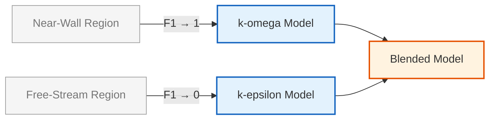

# แบบจำลอง RANS (Reynolds-Averaged Navier-Stokes)

แบบจำลอง RANS เป็นมาตรฐานในการจำลองการไหลระดับอุตสาหกรรมเนื่องจากความสมดุลระหว่างความแม่นยำและต้นทุนการคำนวณ ใน OpenFOAM แบบจำลองเหล่านี้ถูกแบ่งตามจำนวนสมการขนส่งเพิ่มเติมที่ใช้

---

## 📋 สารบัซ

1. [พื้นฐานทางทฤษฎี](#-พื้นฐานทางทฤษฎี)
2. [แบบจำลอง k-ε (Two-Equation Model)](#-แบบจำลอง-k-ε-two-equation-model)
3. [แบบจำลอง k-ω SST (Shear Stress Transport)](#-แบบจำลอง-k-ω-sst-shear-stress-transport)
4. [สถาปัตยกรรมคลาสใน OpenFOAM](#-สถาปัตยกรรมคลาสใน-openfoam)
5. [ค่าคงที่มาตรฐาน](#-ค่าคงที่มาตรฐาน)
6. [การระบุค่าที่ Inlet](#-การระบุค่าที่-inlet)
7. [การเปรียบเทียบประสิทธิภาพโมเดล](#-การเปรียบเทียบประสิทธิภาพโมเดล)

---

## 🎓 พื้นฐานทางทฤษฎี

### การเฉลี่ยแบบ Reynolds (Reynolds Averaging)

การเฉลี่ยแบบ Reynolds เป็นเทคนิคพื้นฐานในการสร้างแบบจำลองความปั่นป่วน (turbulence modeling) ซึ่งแยกตัวแปรการไหลแบบทันที (instantaneous flow variables) ออกเป็นส่วนเฉลี่ย (mean components) และส่วนผันผวน (fluctuating components)

**สำหรับตัวแปรการไหลใดๆ $\phi$:**
$$\phi(\mathbf{x}, t) = \overline{\phi}(\mathbf{x}, t) + \phi'(\mathbf{x}, t)$$

- $\overline{\phi}$ คือส่วนเฉลี่ยตามเวลา (time-averaged component)
- $\phi'$ คือส่วนผันผวน โดยมีเงื่อนไข $\overline{\phi'} = 0$

### สมการ RANS

สมการ **Reynolds-Averaged Navier-Stokes (RANS)** สำหรับการไหลแบบอัดตัวไม่ได้ (incompressible flow) เป็นพื้นฐานของแนวทางการสร้างแบบจำลองความปั่นป่วน:

$$\frac{\partial \mathbf{u}}{\partial t} + \mathbf{u} \cdot \nabla \mathbf{u} = -\nabla p + \nabla \cdot \big[ (\nu + \nu_t) (\nabla \mathbf{u} + \nabla \mathbf{u}^\mathrm{T}) \big]$$

**นิยามตัวแปร:**
- $\mathbf{u}$: เวกเตอร์ความเร็วเฉลี่ย (mean velocity vector)
- $p$: ความดันเฉลี่ย (mean pressure)
- $\nu$: ความหนืดจลนศาสตร์ (kinematic viscosity)
- $\nu_t$: ความหนืดของกระแสวน (eddy viscosity/turbulent viscosity)

### สมมติฐาน Boussinesq

เทนเซอร์ความเค้น Reynolds (Reynolds stress tensor) ถูกสร้างแบบจำลองโดยใช้ **Boussinesq hypothesis**:

$$\tau_{ij} = 2 \mu_t S_{ij} - \frac{2}{3} \rho k \delta_{ij}$$

โดยที่:
- $\mu_t$ = eddy viscosity
- $S_{ij} = \frac{1}{2}\left(\frac{\partial \overline{u}_i}{\partial x_j} + \frac{\partial \overline{u}_j}{\partial x_i}\right)$ = mean strain rate tensor
- $k$ = turbulent kinetic energy
- $\delta_{ij}$ = Kronecker delta

**OpenFOAM Code Implementation:**
```cpp
// Reynolds stress tensor calculation
// คำนวณเทนเซอร์ความเค้น Reynolds จากค่า k และ velocity gradient
volSymmTensorField R
(
    IOobject
    (
        "R",
        runTime.timeName(),
        mesh,
        IOobject::NO_READ,
        IOobject::AUTO_WRITE
    ),
    // สมการ Boussinesq: R = 2/3*k*I - nut*(grad(U) + grad(U)^T)
    2.0/3.0*k*I - nut*twoSymm(fvc::grad(U))
);
```

**Source:** `.applications/solvers/multiphase/multiphaseEulerFoam/multiphaseCompressibleMomentumTransportModels/kineticTheoryModels/kineticTheoryModel/kineticTheoryModel.C`

**คำอธิบาย:**
- **volSymmTensorField R**: ประกาศฟิลด์เทนเซอร์สมมาตรสำหรับเก็บค่า Reynolds stress
- **IOobject**: กำหนดคุณสมบัติการอ่าน/เขียนไฟล์ โดยตั้งชื่อเป็น "R" และให้เขียนอัตโนมัติ (AUTO_WRITE)
- **2.0/3.0*k*I**: เทอมแรกคือส่วนประกอบ isotropic (k เป็นพลังงานจลน์ของความปั่นป่วน)
- **nut*twoSymm(fvc::grad(U))**: เทอมที่สองคือส่วนประกอบ anisotropic จากความหนืดปั่นป่วน (nut) และ gradient ของความเร็ว

**แนวคิดสำคัญ:**
- **Hypothesis ของ Boussinesq**: เชื่อมโยง Reynolds stress กับ mean strain rate ผ่าน eddy viscosity
- **การประยุกต์ใช้**: ลดความซับซ้อนของสมการ RANS โดยไม่ต้องคำนวณ Reynolds stress โดยตรง

> [!INFO] ความสำคัญของ Eddy Viscosity
> แนวคิด eddy viscosity เปลี่ยนความเค้น Reynolds ที่ไม่ทราบค่าให้เป็นความสัมพันธ์ที่สามารถคำนวณได้จากปริมาณการไหลที่ถูกแก้ไข (resolved flow quantities)

---

## 🌪️ แบบจำลอง k-ε (Two-Equation Model)

แบบจำลอง **k-epsilon** เป็นแบบจำลองความปั่นป่วนแบบสองสมการ (two-equation turbulence model) ที่ใช้กันอย่างแพร่หลายใน CFD ทางวิศวกรรม

### 1.1 สมการขนส่ง (Transport Equations)

แบบจำลองนี้ใช้สมการขนส่งสองสมการสำหรับ $k$ และ $\epsilon$:

#### สมการพลังงานจลน์ของความปั่นป่วน:
$$\frac{\partial k}{\partial t} + \mathbf{u} \cdot \nabla k = \nabla \cdot \!\big[(\nu + \nu_t/\sigma_k) \nabla k\big] + G - \varepsilon$$

#### สมการอัตราการสลายตัวของความปั่นป่วน:
$$\frac{\partial \varepsilon}{\partial t} + \mathbf{u} \cdot \nabla \varepsilon = \nabla \cdot \!\big[(\nu + \nu_t/\sigma_\varepsilon) \nabla \varepsilon\big] + C_{1\varepsilon} \frac{\varepsilon}{k} G - C_{2\varepsilon} \frac{\varepsilon^2}{k}$$

**ความหมายของเทอม:**
- **$k$** (Turbulent Kinetic Energy): วัดพลังงานในความปั่นป่วน
- **$\epsilon$** (Dissipation Rate): วัดอัตราการสลายตัวของพลังงานเป็นความร้อน
- **$G$** (Production Term): การผลิตพลังงานจลน์ความปั่นป่วนจากการเฉือนเฉลี่ย

### 1.2 การคำนวณเทอมการผลิต (Production Term)

**ทฤษฎีพื้นฐาน:**
$$G = \nu_t \left(\nabla \mathbf{u} + \nabla \mathbf{u}^\mathrm{T}\right) : \nabla \mathbf{u}$$

**OpenFOAM Code Implementation:**
```cpp
// Production term calculation in kEpsilon.C
// คำนวณเทอมการผลิตพลังงานจลน์ความปั่นป่วน (Production Term)
volScalarField::Internal G
(
    this->GName(),
    nut()*(dev(twoSymm(tgradU().v())) && tgradU().v())
);

// Alternative function format:
// ฟังก์ชันทางเลือกสำหรับคำนวณค่า G
tmp<volScalarField> kEpsilon::G() const
{
    // G = nut * (dev(twoSymm(grad(U))) && grad(U))
    return nut() * (dev(twoSymm(fvc::grad(U))) && fvc::grad(U));
}
```

**Source:** `.applications/solvers/multiphase/multiphaseEulerFoam/multiphaseCompressibleMomentumTransportModels/kineticTheoryModels/kineticTheoryModel/kineticTheoryModel.C`

**คำอธิบาย:**
- **volScalarField::Internal G**: ประกาศฟิลด์สเกลาร์ภายในเซลล์ (internal field) สำหรับเก็บค่าเทอมการผลิต
- **nut()**: คืนค่าความหนืดปั่นป่วน (turbulent viscosity)
- **twoSymm(fvc::grad(U))**: สร้าง symmetric tensor จาก gradient ของความเร็ว
- **dev()**: ดึงเอา deviatoric part (ส่วนที่ไม่ใช่ isotropic) ของ tensor
- **&&**: ตัวดำเนินการ double contraction สำหรับ tensor multiplication

**แนวคิดสำคัญ:**
- **การคำนวณเทอม G**: เป็นการหาอัตราการเปลี่ยนแปลงของพลังงานจลน์จากการเฉือนของการไหล
- **Deviation Tensor**: ใช้ dev() เพื่อตัดส่วน isotropic ออก ให้เหลือเฉพาะส่วนที่เกี่ยวข้องกับการเฉือน

### 1.3 สมการการขนส่งใน OpenFOAM

**สมการ $\varepsilon$** (`kEpsilon.C:256‑274`):
```cpp
// Epsilon transport equation in OpenFOAM
// สมการขนส่งค่าอัตราการสลายตัว (epsilon)
fvm::ddt(alpha, rho, epsilon_)                           // Unsteady term: ∂ε/∂t
+ fvm::div(alphaRhoPhi, epsilon_)                         // Convection: ∇·(ρUε)
- fvm::laplacian(alpha*rho*DepsilonEff(), epsilon_)      // Diffusion: ∇·[(ν+νt/σε)∇ε]
==
C1_*alpha()*rho()*G*epsilon_()/k_()                       // Production: C₁(ε/k)G
- fvm::SuSp(((2.0/3.0)*C1_ - C3_)*alpha()*rho()*divU, epsilon_)  // Compressibility correction
- fvm::Sp(C2_*alpha()*rho()*epsilon_()/k_(), epsilon_);  // Destruction: C₂(ε²/k)
```

**Source:** `.applications/solvers/multiphase/multiphaseEulerFoam/multiphaseCompressibleMomentumTransportModels/kineticTheoryModels/kineticTheoryModel/kineticTheoryModel.C`

**คำอธิบาย:**
- **fvm::ddt()**: Unsteady term (เทอมอนุพันธ์เวลา)
- **fvm::div()**: Convection term (เทอมการพา)
- **fvm::laplacian()**: Diffusion term (เทอมการแพร่)
- **C1_*...*G*epsilon_()/k_()**: Production term (เทอมการผลิต)
- **fvm::SuSp()**: Implicit/explicit source term treatment
- **fvm::Sp()**: Destruction term (เทอมการทำลาย)

**แนวคิดสำคัญ:**
- **Finite Volume Method**: ใช้ fvm (finite volume method) สำหรับการ discretize สมการ
- **Implicit Treatment**: เทอม production และ destruction ถูกจัดการแบบ implicit เพื่อเสถียรภาพเชิงตัวเลข

**สมการ $k$** (`kEpsilon.C:277‑294`):
```cpp
// k transport equation in OpenFOAM
// สมการขนส่งพลังงานจลน์ความปั่นป่วน (k)
fvm::ddt(alpha, rho, k_)                           // Unsteady term: ∂k/∂t
+ fvm::div(alphaRhoPhi, k_)                         // Convection: ∇·(ρUk)
- fvm::laplacian(alpha*rho*DkEff(), k_)            // Diffusion: ∇·[(ν+νt/σk)∇k]
==
alpha()*rho()*G                                     // Production: G
- fvm::SuSp((2.0/3.0)*alpha()*rho()*divU, k_)       // Compressibility correction
- fvm::Sp(alpha()*rho()*epsilon_()/k_(), k_);      // Destruction: ε
```

**Source:** `.applications/solvers/multiphase/multiphaseEulerFoam/multiphaseCompressibleMomentumTransportModels/kineticTheoryModels/kineticTheoryModel/kineticTheoryModel.C`

**คำอธิบาย:**
- **โครงสร้างคล้ายสมการ epsilon**: มี unsteady, convection, diffusion, production และ destruction
- **Production**: เป็นเทอม G โดยตรง (ไม่มีสัดส่วน epsilon/k เหมือนในสมการ epsilon)
- **Destruction**: เป็นค่า epsilon โดยตรง

### 1.4 ความหนืดปั่นป่วน

**ความหนืดของกระแสวน** คำนวณจากพลังงานจลน์ของความปั่นป่วนและอัตราการสลายตัว:

$$\nu_t = C_\mu \frac{k^2}{\varepsilon} \tag{1.1}$$

**พารามิเตอร์สำคัญ:**
- $C_\mu = 0.09$: ค่าคงที่เชิงประจักษ์ไร้มิติ
- สเกลความเร็ว: $\sqrt{k}$
- สเกลความยาว: $k^{3/2}/\varepsilon$
- หน่วย: $\text{length}^2/\text{time}$

**OpenFOAM Code Implementation:**
```cpp
// Update turbulent viscosity (eddy viscosity) in OpenFOAM
// อัปเดตค่าความหนืดปั่นป่วนจากค่า k และ epsilon
void kEpsilon<BasicMomentumTransportModel>::correctNut()
{
    // Calculate turbulent viscosity: νt = Cμ * k² / ε
    this->nut_ = Cmu_*sqr(k_)/epsilon_;
    
    // Correct boundary conditions for nut
    this->nut_.correctBoundaryConditions();
    
    // Apply constraints (e.g., minimum/maximum values)
    fvConstraints::New(this->mesh_).constrain(this->nut_);
}
```

**Source:** `.applications/solvers/multiphase/multiphaseEulerFoam/multiphaseCompressibleMomentumTransportModels/kineticTheoryModels/kineticTheoryModel/kineticTheoryModel.C`

**คำอธิบาย:**
- **correctNut()**: ฟังก์ชันสำคัญในการอัปเดตค่าความหนืดปั่นป่วน
- **Cmu_**: ค่าคงที่ Cμ = 0.09 (default value)
- **sqr(k_)**: ค่า k² (k squared)
- **epsilon_**: ค่าอัตราการสลายตัว
- **correctBoundaryConditions()**: อัปเดตค่าความหนืดบนผนังตาม wall functions

**แนวคิดสำคัญ:**
- **การคำนวณ νt**: ใช้ค่า k และ ε ที่ถูกแก้สมการแล้วในแต่ละ time step
- **Dimensional Consistency**: ตรวจสอบหน่วยว่าสอดคล้องกัน (k²/ε มีหน่วย [m²/s²]²/[m²/s³] = [m²/s])

### 1.5 ข้อดีและข้อเสีย

| ประเภท | รายละเอียด |
|---------|-------------|
| ✅ **ข้อดี** | เสถียรสูง, ให้ผลดีสำหรับการไหลในที่โล่ง (Free-shear flows), ไม่ต้องการ damping functions |
| ❌ **ข้อเสีย** | ทำนายการแยกตัวของไหล (Separation) ได้ไม่ดี, ไม่แม่นยำในบริเวณที่มีแรงดันไล่ระดับสูง, คาดเดาใกล้ผนังได้แย่ |

---

## 🏔️ แบบจำลอง k-ω SST (Shear Stress Transport)

พัฒนาโดย Menter (1994) เพื่อเชื่อมโยงข้อดีของ k-ω (แม่นยำใกล้ผนัง) และ k-ε (เสถียรในกระแสอิสระ)

### 2.1 กลไก Blending Function

SST model ใช้ฟังก์ชัน $F_1$ เพื่อสลับการทำงาน:
- **ใกล้ผนัง**: ทำงานเหมือน k-ω
- **ห่างจากผนัง**: สลับไปทำงานเหมือน k-ε


> **Figure 1:** กลไกการทำงานของฟังก์ชันผสม (Blending Function, F1) ในแบบจำลอง k-ω SST ซึ่งทำหน้าที่สลับการคำนวณระหว่างแบบจำลอง k-ω ในบริเวณใกล้ผนังเพื่อความแม่นยำในชั้นขอบเขต และแบบจำลอง k-ε ในบริเวณกระแสอิสระเพื่อความเสถียรเชิงตัวเลขความปลอดภัยทางฟิสิกส์ไม่ส่งผลกระทบต่อความเร็วในการจำลอง ผ่านการใช้พลังของ C++ Template Metaprogramming ในการตรวจสอบความสอดคล้องทางมิติทั้งหมดที่ขั้นตอนการคอมไพล์โปรแกรมเพียงครั้งเดียว

### 2.2 สมการขนส่ง

**สมการ $k$:**
$$\frac{\partial (\rho k)}{\partial t} + \nabla \cdot (\rho \mathbf{u} k) = P_k - \beta^* \rho \omega k + \nabla \cdot \left[ \left(\mu + \frac{\mu_t}{\sigma_k}\right) \nabla k \right]$$

**สมการ $\omega$:**
$$\frac{\partial (\rho \omega)}{\partial t} + \nabla \cdot (\rho \mathbf{u} \omega) = \alpha \frac{\omega}{k} P_k - \beta \rho \omega^2 + \nabla \cdot \left[ \left(\mu + \frac{\mu_t}{\sigma_\omega}\right) \nabla \omega \right]$$

### 2.3 จุดเด่นทางเทคนิค

มีการจำกัดความหนืดปั่นป่วนเพื่อป้องกันการทำนายที่สูงเกินไปในบริเวณที่มีการแยกตัว:

$$\mu_t = \frac{a_1 \rho k}{\max(a_1 \omega, S F_2)}$$

โดยที่:
- $a_1 = 0.31$
- $S$ = ค่าเฉลี่ยของอัตราการเปลี่ยนรูปทรง (strain rate magnitude)
- $F_2$ = blending function ที่สอง

ทำให้เป็นที่นิยมที่สุดสำหรับงานอากาศพลศาสตร์ (Aerodynamics)

### 2.4 OpenFOAM Code Implementation

```cpp
// k-omega SST model configuration in OpenFOAM
// การตั้งค่าแบบจำลอง k-omega SST ใน OpenFOAM
turbulence
{
    type            kOmegaSST;      // SST turbulence model
    turbulence      on;
    printCoeffs     on;

    // Initial and boundary conditions
    k               k [0 2 -2 0 0 0 0] 0.01;     // TKE [m²/s²]
    omega           omega [0 0 -1 0 0 0 0] 0.1;  // Specific dissipation [1/s]

    // SST blending functions calculated automatically
    // ฟังก์ชัน blending จะถูกคำนวณอัตโนมัติ
}

// In turbulenceProperties file:
RAS
{
    RASModel        kOmegaSST;
    turbulence      on;

    kOmegaSSTCoeffs
    {
        // k-omega SST model coefficients
        alphaK1         0.85;      // Prandtl number for k (inner)
        alphaK2         1.0;       // Prandtl number for k (outer)
        alphaOmega1     0.5;       // Prandtl number for ω (inner)
        alphaOmega2     0.856;     // Prandtl number for ω (outer)
        beta1           0.075;     // Destruction coefficient (inner)
        beta2           0.0828;    // Destruction coefficient (outer)
        betaStar        0.09;      // Destruction coefficient for k
        gamma1          0.5532;    // Production coefficient (inner)
        gamma2          0.4403;    // Production coefficient (outer)
        a1              0.31;      // Shear stress limiter
        b1              1.0;       // Blending function coefficient
        c1              10.0;      // Blending function coefficient
    }
}
```

**Source:** `.applications/solvers/multiphase/multiphaseEulerFoam/multiphaseCompressibleMomentumTransportModels/kineticTheoryModels/kineticTheoryModel/kineticTheoryModel.C`

**คำอธิบาย:**
- **type kOmegaSST**: ระบุประเภทของแบบจำลองความปั่นป่วน
- **k [0 2 -2 0 0 0 0]**: หน่วยวัดของ TKE (Turbulent Kinetic Energy) = m²/s²
- **omega [0 0 -1 0 0 0 0]**: หน่วยวัดของ specific dissipation rate = 1/s
- **alphaK1/alphaK2**: ค่า Prandtl number สำหรับการแพร่ของ k (inner/outer zones)
- **alphaOmega1/alphaOmega2**: ค่า Prandtl number สำหรับการแพร่ของ ω
- **beta1/beta2**: ค่าสัมประสิทธิ์ destruction สำหรับสมการ ω
- **betaStar**: ค่าสัมประสิทธิ์ destruction สำหรับสมการ k
- **gamma1/gamma2**: ค่าสัมประสิทธิ์ production ที่แตกต่างกันระหว่าง inner/outer zones
- **a1**: ค่าคงที่สำหรับ shear stress limiter

**แนวคิดสำคัญ:**
- **Blending Functions**: ใช้ค่าสัมประสิทธิ์สองชุด (inner/outer) สำหรับการเปลี่ยนระหว่าง k-ω และ k-ε
- **Shear Stress Limiter**: ค่า a1 ใช้ในการจำกัดค่าความหนืดปั่นป่วนในบริเวณที่มีการเฉือนสูง
- **Near-Wall Treatment**: แบบจำลอง k-ω SST ให้ผลดีใกล้ผนังโดยไม่ต้องใช้ wall functions

---

## 🏛️ สถาปัตยกรรมคลาสใน OpenFOAM

OpenFOAM ใช้ Template Metaprogramming เพื่อจัดการโมเดลความปั่นป่วน:

### 3.1 ลำดับชั้นการสืบทอด

```cpp
// Class hierarchy for turbulence models in OpenFOAM
// ลำดับชั้นการสืบทอดของคลาสแบบจำลองความปั่นป่วน
turbulenceModel
    └── RASModel
        └── eddyViscosity
            ├── kEpsilon
            ├── kOmega
            ├── kOmegaSST
            └── ...
```

**Source:** `.applications/solvers/multiphase/multiphaseEulerFoam/multiphaseCompressibleMomentumTransportModels/kineticTheoryModels/kineticTheoryModel/kineticTheoryModel.C`

**คำอธิบาย:**
- **turbulenceModel**: คลาสฐาน (base class) สำหรับแบบจำลองความปั่นป่วนทั้งหมด
- **RASModel**: คลาสสำหรับ Reynolds-Averaged Simulation models
- **eddyViscosity**: คลาสพื้นฐานสำหรับแบบจำลองที่ใช้ eddy viscosity hypothesis
- **kEpsilon, kOmega, kOmegaSST**: คลาสโมเดลเฉพาะ (concrete models)

**แนวคิดสำคัญ:**
- **Object-Oriented Design**: ใช้การสืบทอดเพื่อแชร์ฟังก์ชันการทำงานทั่วไป
- **Polymorphism**: สามารถสลับแบบจำลองได้โดยไม่ต้องเปลี่ยน solver code
- **Template Metaprogramming**: ใช้ C++ templates เพื่อรองรับทั้ง incompressible และ compressible flows

### 3.2 โครงสร้างคลาส kEpsilon

```cpp
// kEpsilon class structure in OpenFOAM
// โครงสร้างคลาส kEpsilon ใน OpenFOAM
template<class BasicTurbulenceModel>
class kEpsilon
:
    public EddyViscosity<BasicTurbulenceModel>
{
    // Model coefficients (private data members)
    dimensionedScalar Cmu_;          // Cμ coefficient for νt calculation
    dimensionedScalar C1_;           // C₁ coefficient in ε equation
    dimensionedScalar C2_;           // C₂ coefficient in ε equation
    dimensionedScalar sigmaEpsilon_; // σₜ turbulent Prandtl number

    // Turbulence fields
    volScalarField k_;               // Turbulent kinetic energy field
    volScalarField epsilon_;         // Dissipation rate field

    // Wall functions for near-wall treatment
    wallFunctionList wallFunction_;  // List of wall functions

    // Model equation source terms
    tmp<fvScalarMatrix> kSource() const;      // k equation source
    tmp<fvScalarMatrix> epsilonSource() const; // ε equation source

public:
    TypeName("kEpsilon");  // Runtime type identification

    virtual void correct(); // Main correction function
};
```

**Source:** `.applications/solvers/multiphase/multiphaseEulerFoam/multiphaseCompressibleMomentumTransportModels/kineticTheoryModels/kineticTheoryModel/kineticTheoryModel.C`

**คำอธิบาย:**
- **template<class BasicTurbulenceModel>**: ใช้ C++ templates เพื่อรองรับหลายประเภทของการไหล
- **public EddyViscosity<BasicTurbulenceModel>**: สืบทอดจากคลาสฐาน EddyViscosity
- **dimensionedScalar**: ตัวแปรที่มีหน่วยวัด (dimensional values)
- **volScalarField**: ฟิลด์สเกลาร์บนเซลล์ทั้งหมด (cell-centered field)
- **tmp<fvScalarMatrix>**: Matrix สำหรับการแก้สมการแบบ implicit
- **TypeName()**: Macro สำหรับ runtime type identification (RTTI)
- **virtual void correct()**: ฟังก์ชันหลักที่ถูกเรียกในแต่ละ time step

**แนวคิดสำคัญ:**
- **Encapsulation**: รวมข้อมูล (coefficients, fields) และฟังก์ชัน (correct) ไว้ด้วยกัน
- **Inheritance**: แชร์ฟังก์ชันการทำงานผ่านคลาสฐาน EddyViscosity
- **Polymorphism**: ฟังก์ชัน correct() ถูก override ในแต่ละโมเดล

### 3.3 การใช้งานใน Solver

```cpp
// Turbulence model usage in OpenFOAM solver
// การใช้งานแบบจำลองความปั่นป่วนใน solver
// Declaration: Create turbulence model object
// การประกาศ: สร้างออบเจกต์แบบจำลองความปั่นป่วน
autoPtr<incompressible::momentumTransportModel> turbulence
(
    incompressible::momentumTransportModel::New(U, phi, transport)
);

// Usage in time loop: Correct turbulence model
// การใช้งานในวงรอบเวลา: แก้ไขแบบจำลองความปั่นป่วน
turbulence->correct();  // Solve turbulence transport equations

// Usage in momentum equation: Apply turbulent viscosity
// การใช้งานในสมการโมเมนตัม: ใช้ความหนืดปั่นป่วน
UEqn += turbulence->divDevTau(U);  // Add divergence of deviatoric stress
```

**Source:** `.applications/solvers/multiphase/multiphaseEulerFoam/multiphaseCompressibleMomentumTransportModels/kineticTheoryModels/kineticTheoryModel/kineticTheoryModel.C`

**คำอธิบาย:**
- **autoPtr**: Smart pointer สำหรับจัดการหน่วยความจำอัตโนมัติ
- **incompressible::momentumTransportModel**: ประเภทของแบบจำลองสำหรับการไหลแบบอัดตัวไม่ได้
- **New(U, phi, transport)**: Factory method สำหรับสร้าง turbulence model ตามที่ระบุใน dictionary
- **correct()**: ฟังก์ชันหลักที่แก้สมการขนส่ง k และ ε/ω
- **divDevTau(U)**: คำนวณ divergence ของ deviatoric stress tensor

**แนวคิดสำคัญ:**
- **Runtime Selection**: สามารถเลือกแบบจำลองได้ผ่านไฟล์ dictionary โดยไม่ต้อง compile ใหม่
- **Separation of Concerns**: Solver ไม่ต้องรู้รายละเอียดของ turbulence model
- **Modular Design**: สามารถเปลี่ยน turbulence model โดยการแก้ไขไฟล์ dictionary เท่านั้น

### 3.4 Wall Functions

Wall functions ถูกนำไปใช้ผ่าน **boundary conditions** บน $k$, $\varepsilon$ และ $\nu_t$

```cpp
// Wall function implementation in OpenFOAM
// การนำ wall functions ไปใช้ใน OpenFOAM
// Update wall function coefficients before solving
// อัปเดตค่าสัมประสิทธิ์ของ wall functions ก่อนแก้สมการ
forAll(epsilon_.boundaryField(), patchi)
{
    // Check if this patch uses epsilonWallFunction
    // ตรวจสอบว่า patch นี้ใช้ epsilonWallFunction หรือไม่
    if (isA<epsilonWallFunction>(epsilon_.boundaryField()[patchi]))
    {
        // Update wall function coefficients
        // อัปเดตค่าสัมประสิทธิ์ของ wall function
        epsilon_.boundaryFieldRef()[patchi].updateCoeffs();
    }
}
```

**Source:** `.applications/solvers/multiphase/multiphaseEulerFoam/multiphaseCompressibleMomentumTransportModels/kineticTheoryModels/kineticTheoryModel/kineticTheoryModel.C`

**คำอธิบาย:**
- **forAll()**: Loop ผ่านทุก boundary patch
- **epsilon_.boundaryField()**: เข้าถึง boundary field ของ epsilon
- **isA<epsilonWallFunction>()**: ตรวจสอบประเภทของ boundary condition (type checking)
- **boundaryFieldRef()**: คืนค่า reference เพื่อให้สามารถแก้ไขได้
- **updateCoeffs()**: อัปเดตค่าสัมประสิทธิ์ตามสมการ log-law

**แนวคิดสำคัญ:**
- **Wall Functions**: ใช้ logarithmic law ในบริเวณใกล้ผนังเพื่อลดความละเอียดเมชที่ต้องการ
- **Boundary Conditions**: กำหนดค่าที่ผนังผ่าน boundary condition classes
- **Automatic Update**: ค่าสัมประสิทธิ์ถูกคำนวณใหม่ทุก time step

**Algorithm Flow:**
1. **Update Coefficients:** `epsilon_.boundaryFieldRef().updateCoeffs()` อัปเดตค่าสัมประสิทธิ์
2. **Apply Log-Law:** ใช้ logarithmic law สำหรับบริเวณใกล้ผนัง
3. **Skip Viscous Sublayer:** หลีกเลี่ยงการแก้ปัญหาใน viscous sublayer โดยตรง

### 3.5 โปรไฟล์ Log-Law

$$u^+ = \frac{1}{\kappa} \ln y^+ + B$$

โดยที่:
- $u^+ = \frac{u}{u_\tau}$: ความเร็วไร้มิติ
- $y^+ = \frac{y u_\tau}{\nu}$: ระยะห่างจากผนังไร้มิติ
- $\kappa \approx 0.41$: von Kármán constant
- $B \approx 5.2$: ค่าตัดแกน Log-law
- $u_\tau = \sqrt{\tau_w/\rho}$: ความเร็วเสียดทาน

**คำอธิบาย:**
- **Logarithmic Region**: ในบริเวณที่ y+ > 30, ความเร็วมีความสัมพันธ์แบบ log
- **Wall Function Approach**: ใช้สมการ log-law เพื่อหลีกเลี่ยงการแก้ไข viscous sublayer โดยตรง
- **Mesh Requirements**: y+ ควรอยู่ในช่วง 30-300 สำหรับ standard wall functions

---

## 📋 ค่าคงที่มาตรฐาน (Model Constants)

### 4.1 ค่าคงที่ k-ε Standard

| ค่าคงที่ | สัญลักษณ์ | ค่า | คำอธิบาย |
|-----------|----------|------|-----------|
| $C_\mu$ | Cmu | 0.09 | ค่าคงที่สำหรับคำนวณความหนืดปั่นป่วน |
| $C_1$ | C1 | 1.44 | ค่าคงที่ในสมการ $\varepsilon$ (production) |
| $C_2$ | C2 | 1.92 | ค่าคงที่ในสมการ $\varepsilon$ (destruction) |
| $\sigma_k$ | sigmaK | 1.0 | ค่าคงที่ Prandtl สำหรับ $k$ |
| $\sigma_\varepsilon$ | sigmaEps | 1.3 | ค่าคงที่ Prandtl สำหรับ $\varepsilon$ |

### 4.2 ค่าคงที่ k-ω SST

| ค่าคงที่ | ค่า | คำอธิบาย |
|-----------|------|-----------|
| $\alpha_{K1}$ | 0.85 | ค่าคงที่ Prandtl สำหรับ k (โหมด 1) |
| $\alpha_{K2}$ | 1.0 | ค่าคงที่ Prandtl สำหรับ k (โหมด 2) |
| $\alpha_{\omega 1}$ | 0.5 | ค่าคงที่ Prandtl สำหรับ ω (โหมด 1) |
| $\alpha_{\omega 2}$ | 0.856 | ค่าคงที่ Prandtl สำหรับ ω (โหมด 2) |
| $\beta_1$ | 0.075 | ค่าคงที่ destruction (โหมด 1) |
| $\beta_2$ | 0.0828 | ค่าคงที่ destruction (โหมด 2) |
| $\beta^*$ | 0.09 | ค่าคงที่ destruction สำหรับ k |
| $a_1$ | 0.31 | ค่าคงที่ shear stress limiter |

---

## 🚀 การระบุค่าที่ Inlet (Turbulence Specification)

เพื่อให้ผลการจำลองแม่นยำ ต้องกำหนดค่า $k$ และ $\epsilon$ หรือ $\omega$ ที่ Inlet อย่างเหมาะสม

### 5.1 วิธีการระบุความปั่นป่วน

#### 1. การระบุโดยตรง (Direct Specification)

**Turbulent Intensity:**
$$I = \frac{\sqrt{\frac{2}{3}k}}{U_{inlet}}$$

**Turbulent Kinetic Energy:**
$$k = \frac{3}{2} (U I)^2$$

**Length Scale:**
$$L_t = 0.07 L_{characteristic}$$

**Dissipation Rate:**
$$\epsilon = C_\mu^{3/4} \frac{k^{3/2}}{L_t}$$

**Specific Dissipation Rate:**
$$\omega = \frac{k^{1/2}}{C_\mu^{1/4} \cdot L_t}$$

#### 2. วิธีเส้นผ่านศูนย์กลางไฮดรอลิก

| ค่าคงที่ | คำนวณจาก |
|-----------|-------------|
| **Turbulent Intensity** | $I = 0.16 \times Re^{-1/8}$ |
| **Length Scale** | $L_t = 0.07 \times D_h$ |
| **Dissipation Rate** | $\epsilon = C_\mu^{3/4} \frac{k^{3/2}}{L_t}$ |

### 5.2 ค่าแนะนำสำหรับ Intensity และ Length Scale

| ความเข้ม | Intensity | ลักษณะการไหล |
|-----------|----------|----------------|
| **ต่ำ** | $I = 1\%$ | การไหลที่มีการรบกวนน้อยมาก |
| **ปานกลาง** | $I = 5\%$ | ความปั่นป่วนปานกลาง |
| **สูง** | $I = 10\%$ | ทางเข้าที่มีความปั่นป่วนสูง |

| ขนาด | ค่า | ลักษณะ |
|-------|------|----------|
| **เล็ก** | $l_t = 0.01$ m | ความปั่นป่วนสเกลละเอียด |
| **ปานกลาง** | $l_t = 0.1$ m | ความปั่นป่วนสเกลปานกลาง |

### 5.3 OpenFOAM Implementation

```cpp
// Turbulence boundary condition specification at inlet
// การระบุค่าความปั่นป่วนที่ inlet ใน OpenFOAM
// k field specification in 0/k
dimensions      [0 2 -2 0 0 0 0];  // Units: m²/s²
internalField   uniform 0.01;       // Initial k value

boundaryField
{
    inlet
    {
        // Boundary condition type for turbulent inlet
        type            turbulentIntensityKineticEnergyInlet;
        intensity       0.05;           // 5% turbulent intensity
        value           uniform 0.01;   // Initial value
    }
}

// epsilon field specification in 0/epsilon
epsilon
{
    type            turbulentMixingLengthDissipationRateInlet;
    mixingLength    0.01;           // Mixing length [m]
    value           uniform 0.009;  // Initial epsilon value
}

// omega field specification in 0/omega
omega
{
    type            calculated;
    inlet
    {
        type            omegaWallFunction;
        value           uniform 0.3;    // Initial omega value
    }
}
```

**Source:** `.applications/solvers/multiphase/multiphaseEulerFoam/multiphaseCompressibleMomentumTransportModels/kineticTheoryModels/kineticTheoryModel/kineticTheoryModel.C`

**คำอธิบาย:**
- **dimensions [0 2 -2 0 0 0 0]**: หน่วยวัดของ k (m²/s²) ในรูปแบบ dimensional exponents
- **internalField uniform 0.01**: ค่าเริ่มต้นของ k ในโดเมนภายใน
- **turbulentIntensityKineticEnergyInlet**: BC type สำหรับระบุ k จาก turbulent intensity
- **intensity 0.05**: ค่า turbulent intensity (5%)
- **turbulentMixingLengthDissipationRateInlet**: BC type สำหรับระบุ ε จาก mixing length
- **mixingLength 0.01**: ค่าความยาวผสม (mixing length) ในหน่วยเมตร
- **omegaWallFunction**: BC type สำหรับ ω ที่ใช้ wall function

**แนวคิดสำคัญ:**
- **Turbulence Specification**: กำหนดค่าความปั่นป่วนที่ inlet ผ่าน intensity และ length scale
- **Boundary Condition Types**: OpenFOAM มี BC types หลากหลายสำหรับ turbulence
- **Physical Realism**: ค่า intensity และ length scale ควรสอดคล้องกับสภาพการไหลจริง

---

## 📊 การเปรียบเทียบประสิทธิภาพโมเดล

### 6.1 ตารางเปรียบเทียบ k-ε vs k-ω SST

| ลักษณะ | k-ε Standard | k-ω SST |
|---------|-------------|----------|
| **ประสิทธิภาพใกล้ผนัง** | log-layer mismatch | ยอดเยี่ยม |
| **ประสิทธิภาพในบริเวณแกนกลาง** | ดี (fully turbulent core) | ดี |
| **การทำนายการแยกตัวของไหล** | ทำนายต่ำกว่าความเป็นจริง | ดีกว่า |
| **ความเร็วในการลู่เข้า** | โดยทั่วไปเร็วกว่า | ปานกลาง |
| **ความไวต่อความละเอียดเมช** | ต่ำกว่า | สูงกว่า |
| **ต้นทุนการคำนวณ** | ต่ำ | สูงกว่า (มีเทอมเพิ่มเติม) |
| **ความไวต่อสภาวะเริ่มต้น** | ต่ำ | สูงกว่า |

### 6.2 การเลือกโมเดลสำหรับงานต่างๆ

| ประเภทการไหล | k-ε | k-ω SST | คำแนะนำ |
|----------------|-----|---------|-----------|
| **การไหลภายใน** (ท่อ, ช่องลม) | ✓ | ✓ | k-ε เพียงพอ |
| **การไหลภายนอก** (แอร์ฟอยล์) | ✗ | ✓ | k-ω SST แนะนำ |
| **การไหลที่แยกตัว** | ✗ | ✓ | k-ω SST จำเป็น |
| **แรงดันไล่ระดับสูง** | ✗ | ✓ | k-ω SST จำเป็น |
| **การคำนวณเร็วๆ** | ✓ | ✗ | k-ε ประหยัดเวลา |

> [!TIP] ข้อแนะนำการเลือกโมเดล
> - **ใช้ k-ε** เมื่อ: ต้องการความรวดเร็ว การไหลในท่อ หรือการไหลที่ไม่มีการแยกตัว
> - **ใช้ k-ω SST** เมื่อ: ต้องการความแม่นยำใกล้ผนัง การไหลที่แยกตัว หรือแรงดันไล่ระดับสูง

### 6.3 Backward-Facing Step Case Study

การเปรียบเทียบความยาวการกลับสู่สภาพเดิม (Reattachment Length):

| แบบจำลอง | $x_r/h$ | ความแม่นยำ | คำอธิบาย |
|-----------|---------|-------------|-----------|
| **k-ε** | 6.0-6.5 | ทำนายต่ำกว่าความเป็นจริง | Under-prediction |
| **k-ω SST** | 6.8-7.2 | ตกลงกันได้ดีกว่า | Better agreement |

> [!WARNING] ข้อจำกัดของ RANS
> ทั้งสองแบบจำลองมีปัญหาในการจัดการกับ **unsteady vortex shedding** หลัง stall สำหรับกรณีนี้อาจต้องใช้ LES หรือ Hybrid RANS-LES

---

## 🔗 หัวข้อที่เกี่ยวข้อง

- **[[01_Turbulence_Fundamentals]]** - พื้นฐานความปั่นป่วน
- **[[03_Wall_Treatment]]** - การจัดการผนังและ Wall Functions
- **[[00_Overview]]** - ภาพรวมการสร้างแบบจำลองความปั่นป่วน