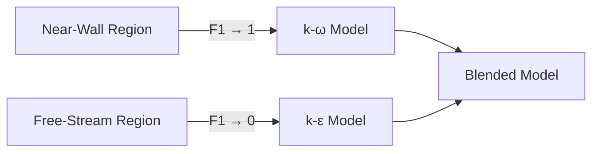

# แบบจำลอง RANS (Reynolds-Averaged Navier-Stokes)

แบบจำลอง RANS เป็นมาตรฐานในการจำลองการไหลระดับอุตสาหกรรมเนื่องจากความสมดุลระหว่างความแม่นยำและต้นทุนการคำนวณ ใน OpenFOAM แบบจำลองเหล่านี้ถูกแบ่งตามจำนวนสมการขนส่งเพิ่มเติมที่ใช้

---

## 📋 สารบัซ

1. [พื้นฐานทางทฤษฎี](#-พื้นฐานทางทฤษฎี)
2. [แบบจำลอง k-ε (Two-Equation Model)](#-แบบจำลอง-k-ε-two-equation-model)
3. [แบบจำลอง k-ω SST (Shear Stress Transport)](#-แบบจำลอง-k-ω-sst-shear-stress-transport)
4. [สถาปัตยกรรมคลาสใน OpenFOAM](#-สถาปัตยกรรมคลาสใน-openfoam)
5. [ค่าคงที่มาตรฐาน](#-ค่าคงที่มาตรฐาน)
6. [การระบุค่าที่ Inlet](#-การระบุค่าที่-inlet)
7. [การเปรียบเทียบประสิทธิภาพโมเดล](#-การเปรียบเทียบประสิทธิภาพโมเดล)

---

## 🎓 พื้นฐานทางทฤษฎี

### การเฉลี่ยแบบ Reynolds (Reynolds Averaging)

การเฉลี่ยแบบ Reynolds เป็นเทคนิคพื้นฐานในการสร้างแบบจำลองความปั่นป่วน (turbulence modeling) ซึ่งแยกตัวแปรการไหลแบบทันที (instantaneous flow variables) ออกเป็นส่วนเฉลี่ย (mean components) และส่วนผันผวน (fluctuating components)

**สำหรับตัวแปรการไหลใดๆ $\phi$:**
$$\phi(\mathbf{x}, t) = \overline{\phi}(\mathbf{x}, t) + \phi'(\mathbf{x}, t)$$

- $\overline{\phi}$ คือส่วนเฉลี่ยตามเวลา (time-averaged component)
- $\phi'$ คือส่วนผันผวน โดยมีเงื่อนไข $\overline{\phi'} = 0$

### สมการ RANS

สมการ **Reynolds-Averaged Navier-Stokes (RANS)** สำหรับการไหลแบบอัดตัวไม่ได้ (incompressible flow) เป็นพื้นฐานของแนวทางการสร้างแบบจำลองความปั่นป่วน:

$$\frac{\partial \mathbf{u}}{\partial t} + \mathbf{u} \cdot \nabla \mathbf{u} = -\nabla p + \nabla \cdot \big[ (\nu + \nu_t) (\nabla \mathbf{u} + \nabla \mathbf{u}^\mathrm{T}) \big]$$

**นิยามตัวแปร:**
- $\mathbf{u}$: เวกเตอร์ความเร็วเฉลี่ย (mean velocity vector)
- $p$: ความดันเฉลี่ย (mean pressure)
- $\nu$: ความหนืดจลนศาสตร์ (kinematic viscosity)
- $\nu_t$: ความหนืดของกระแสวน (eddy viscosity/turbulent viscosity)

### สมมติฐาน Boussinesq

เทนเซอร์ความเค้น Reynolds (Reynolds stress tensor) ถูกสร้างแบบจำลองโดยใช้ **Boussinesq hypothesis**:

$$\tau_{ij} = 2 \mu_t S_{ij} - \frac{2}{3} \rho k \delta_{ij}$$

โดยที่:
- $\mu_t$ = eddy viscosity
- $S_{ij} = \frac{1}{2}\left(\frac{\partial \overline{u}_i}{\partial x_j} + \frac{\partial \overline{u}_j}{\partial x_i}\right)$ = mean strain rate tensor
- $k$ = turbulent kinetic energy
- $\delta_{ij}$ = Kronecker delta

**OpenFOAM Code Implementation:**
```cpp
// Reynolds stress tensor calculation
volSymmTensorField R
(
    IOobject
    (
        "R",
        runTime.timeName(),
        mesh,
        IOobject::NO_READ,
        IOobject::AUTO_WRITE
    ),
    2.0/3.0*k*I - nut*twoSymm(fvc::grad(U))
);
```

> [!INFO] ความสำคัญของ Eddy Viscosity
> แนวคิด eddy viscosity เปลี่ยนความเค้น Reynolds ที่ไม่ทราบค่าให้เป็นความสัมพันธ์ที่สามารถคำนวณได้จากปริมาณการไหลที่ถูกแก้ไข (resolved flow quantities)

---

## 🌪️ แบบจำลอง k-ε (Two-Equation Model)

แบบจำลอง **k-epsilon** เป็นแบบจำลองความปั่นป่วนแบบสองสมการ (two-equation turbulence model) ที่ใช้กันอย่างแพร่หลายใน CFD ทางวิศวกรรม

### 1.1 สมการขนส่ง (Transport Equations)

แบบจำลองนี้ใช้สมการขนส่งสองสมการสำหรับ $k$ และ $\epsilon$:

#### สมการพลังงานจลน์ของความปั่นป่วน:
$$\frac{\partial k}{\partial t} + \mathbf{u} \cdot \nabla k = \nabla \cdot \!\big[(\nu + \nu_t/\sigma_k) \nabla k\big] + G - \varepsilon$$

#### สมการอัตราการสลายตัวของความปั่นป่วน:
$$\frac{\partial \varepsilon}{\partial t} + \mathbf{u} \cdot \nabla \varepsilon = \nabla \cdot \!\big[(\nu + \nu_t/\sigma_\varepsilon) \nabla \varepsilon\big] + C_{1\varepsilon} \frac{\varepsilon}{k} G - C_{2\varepsilon} \frac{\varepsilon^2}{k}$$

**ความหมายของเทอม:**
- **$k$** (Turbulent Kinetic Energy): วัดพลังงานในความปั่นป่วน
- **$\epsilon$** (Dissipation Rate): วัดอัตราการสลายตัวของพลังงานเป็นความร้อน
- **$G$** (Production Term): การผลิตพลังงานจลน์ความปั่นป่วนจากการเฉือนเฉลี่ย

### 1.2 การคำนวณเทอมการผลิต (Production Term)

**ทฤษฎีพื้นฐาน:**
$$G = \nu_t \left(\nabla \mathbf{u} + \nabla \mathbf{u}^\mathrm{T}\right) : \nabla \mathbf{u}$$

**OpenFOAM Code Implementation:**
```cpp
// Production term calculation in kEpsilon.C
volScalarField::Internal G
(
    this->GName(),
    nut()*(dev(twoSymm(tgradU().v())) && tgradU().v())
);

// หรือในรูปแบบฟังก์ชัน:
tmp<volScalarField> kEpsilon::G() const
{
    return nut() * (dev(twoSymm(fvc::grad(U))) && fvc::grad(U));
}
```

### 1.3 สมการการขนส่งใน OpenFOAM

**สมการ $\varepsilon$** (`kEpsilon.C:256‑274`):
```cpp
fvm::ddt(alpha, rho, epsilon_)
+ fvm::div(alphaRhoPhi, epsilon_)
- fvm::laplacian(alpha*rho*DepsilonEff(), epsilon_)
==
C1_*alpha()*rho()*G*epsilon_()/k_()
- fvm::SuSp(((2.0/3.0)*C1_ - C3_)*alpha()*rho()*divU, epsilon_)
- fvm::Sp(C2_*alpha()*rho()*epsilon_()/k_(), epsilon_)
```

**สมการ $k$** (`kEpsilon.C:277‑294`):
```cpp
fvm::ddt(alpha, rho, k_)
+ fvm::div(alphaRhoPhi, k_)
- fvm::laplacian(alpha*rho*DkEff(), k_)
==
alpha()*rho()*G
- fvm::SuSp((2.0/3.0)*alpha()*rho()*divU, k_)
- fvm::Sp(alpha()*rho()*epsilon_()/k_(), k_)
```

### 1.4 ความหนืดปั่นป่วน

**ความหนืดของกระแสวน** คำนวณจากพลังงานจลน์ของความปั่นป่วนและอัตราการสลายตัว:

$$\nu_t = C_\mu \frac{k^2}{\varepsilon} \tag{1.1}$$

**พารามิเตอร์สำคัญ:**
- $C_\mu = 0.09$: ค่าคงที่เชิงประจักษ์ไร้มิติ
- สเกลความเร็ว: $\sqrt{k}$
- สเกลความยาว: $k^{3/2}/\varepsilon$
- หน่วย: $\text{length}^2/\text{time}$

**OpenFOAM Code Implementation:**
```cpp
void kEpsilon<BasicMomentumTransportModel>::correctNut()
{
    this->nut_ = Cmu_*sqr(k_)/epsilon_;
    this->nut_.correctBoundaryConditions();
    fvConstraints::New(this->mesh_).constrain(this->nut_);
}
```

### 1.5 ข้อดีและข้อเสีย

| ประเภท | รายละเอียด |
|---------|-------------|
| ✅ **ข้อดี** | เสถียรสูง, ให้ผลดีสำหรับการไหลในที่โล่ง (Free-shear flows), ไม่ต้องการ damping functions |
| ❌ **ข้อเสีย** | ทำนายการแยกตัวของไหล (Separation) ได้ไม่ดี, ไม่แม่นยำในบริเวณที่มีแรงดันไล่ระดับสูง, คาดเดาใกล้ผนังได้แย่ |

---

## 🏔️ แบบจำลอง k-ω SST (Shear Stress Transport)

พัฒนาโดย Menter (1994) เพื่อเชื่อมโยงข้อดีของ k-ω (แม่นยำใกล้ผนัง) และ k-ε (เสถียรในกระแสอิสระ)

### 2.1 กลไก Blending Function

SST model ใช้ฟังก์ชัน $F_1$ เพื่อสลับการทำงาน:
- **ใกล้ผนัง**: ทำงานเหมือน k-ω
- **ห่างจากผนัง**: สลับไปทำงานเหมือน k-ε


> **Figure 1:** กลไกการทำงานของฟังก์ชันผสม (Blending Function, F1) ในแบบจำลอง k-ω SST ซึ่งทำหน้าที่สลับการคำนวณระหว่างแบบจำลอง k-ω ในบริเวณใกล้ผนังเพื่อความแม่นยำในชั้นขอบเขต และแบบจำลอง k-ε ในบริเวณกระแสอิสระเพื่อความเสถียรเชิงตัวเลขความปลอดภัยทางฟิสิกส์ไม่ส่งผลกระทบต่อความเร็วในการจำลอง ผ่านการใช้พลังของ C++ Template Metaprogramming ในการตรวจสอบความสอดคล้องทางมิติทั้งหมดที่ขั้นตอนการคอมไพล์โปรแกรมเพียงครั้งเดียว

### 2.2 สมการขนส่ง

**สมการ $k$:**
$$\frac{\partial (\rho k)}{\partial t} + \nabla \cdot (\rho \mathbf{u} k) = P_k - \beta^* \rho \omega k + \nabla \cdot \left[ \left(\mu + \frac{\mu_t}{\sigma_k}\right) \nabla k \right]$$

**สมการ $\omega$:**
$$\frac{\partial (\rho \omega)}{\partial t} + \nabla \cdot (\rho \mathbf{u} \omega) = \alpha \frac{\omega}{k} P_k - \beta \rho \omega^2 + \nabla \cdot \left[ \left(\mu + \frac{\mu_t}{\sigma_\omega}\right) \nabla \omega \right]$$

### 2.3 จุดเด่นทางเทคนิค

มีการจำกัดความหนืดปั่นป่วนเพื่อป้องกันการทำนายที่สูงเกินไปในบริเวณที่มีการแยกตัว:

$$\mu_t = \frac{a_1 \rho k}{\max(a_1 \omega, S F_2)}$$

โดยที่:
- $a_1 = 0.31$
- $S$ = ค่าเฉลี่ยของอัตราการเปลี่ยนรูปทรง (strain rate magnitude)
- $F_2$ = blending function ที่สอง

ทำให้เป็นที่นิยมที่สุดสำหรับงานอากาศพลศาสตร์ (Aerodynamics)

### 2.4 OpenFOAM Code Implementation

```cpp
// การตั้งค่า k-omega SST model ใน OpenFOAM
turbulence
{
    type            kOmegaSST;
    turbulence      on;
    printCoeffs     on;

    k               k [0 2 -2 0 0 0 0] 0.01;
    omega           omega [0 0 -1 0 0 0 0] 0.1;

    // SST blending functions จะถูกคำนวณโดยอัตโนมัติ
}

// ใน turbulenceProperties:
RAS
{
    RASModel        kOmegaSST;
    turbulence      on;

    kOmegaSSTCoeffs
    {
        alphaK1         0.85;
        alphaK2         1.0;
        alphaOmega1     0.5;
        alphaOmega2     0.856;
        beta1           0.075;
        beta2           0.0828;
        betaStar        0.09;
        gamma1          0.5532;
        gamma2          0.4403;
        a1              0.31;
        b1              1.0;
        c1              10.0;
    }
}
```

---

## 🏛️ สถาปัตยกรรมคลาสใน OpenFOAM

OpenFOAM ใช้ Template Metaprogramming เพื่อจัดการโมเดลความปั่นป่วน:

### 3.1 ลำดับชั้นการสืบทอด

```cpp
// ลำดับชั้นของคลาส turbulence model
turbulenceModel
    └── RASModel
        └── eddyViscosity
            ├── kEpsilon
            ├── kOmega
            ├── kOmegaSST
            └── ...
```

### 3.2 โครงสร้างคลาส kEpsilon

```cpp
template<class BasicTurbulenceModel>
class kEpsilon
:
    public EddyViscosity<BasicTurbulenceModel>
{
    // Model coefficients
    dimensionedScalar Cmu_;
    dimensionedScalar C1_;
    dimensionedScalar C2_;
    dimensionedScalar sigmaEpsilon_;

    // Fields
    volScalarField k_;
    volScalarField epsilon_;

    // Wall functions
    wallFunctionList wallFunction_;

    // Model equations
    tmp<fvScalarMatrix> kSource() const;
    tmp<fvScalarMatrix> epsilonSource() const;

public:
    TypeName("kEpsilon");

    virtual void correct();
};
```

### 3.3 การใช้งานใน Solver

```cpp
// การประกาศใน solver
autoPtr<incompressible::momentumTransportModel> turbulence
(
    incompressible::momentumTransportModel::New(U, phi, transport)
);

// การเรียกใช้ใน time loop
turbulence->correct();  // แก้สมการความปั่นป่วน

// การใช้ในสมการโมเมนตัม
UEqn += turbulence->divDevTau(U);  // ใช้ค่า nut ที่อัปเดตแล้ว
```

### 3.4 Wall Functions

Wall functions ถูกนำไปใช้ผ่าน **boundary conditions** บน $k$, $\varepsilon$ และ $\nu_t$

**OpenFOAM Code Implementation:**
```cpp
// Update wall function coefficients before solving
forAll(epsilon_.boundaryField(), patchi)
{
    if (isA<epsilonWallFunction>(epsilon_.boundaryField()[patchi]))
    {
        epsilon_.boundaryFieldRef()[patchi].updateCoeffs();
    }
}
```

**Algorithm Flow:**
1. **Update Coefficients:** `epsilon_.boundaryFieldRef().updateCoeffs()` อัปเดตค่าสัมประสิทธิ์
2. **Apply Log-Law:** ใช้ logarithmic law สำหรับบริเวณใกล้ผนัง
3. **Skip Viscous Sublayer:** หลีกเลี่ยงการแก้ปัญหาใน viscous sublayer โดยตรง

### 3.5 โปรไฟล์ Log-Law

$$u^+ = \frac{1}{\kappa} \ln y^+ + B$$

โดยที่:
- $u^+ = \frac{u}{u_\tau}$: ความเร็วไร้มิติ
- $y^+ = \frac{y u_\tau}{\nu}$: ระยะห่างจากผนังไร้มิติ
- $\kappa \approx 0.41$: von Kármán constant
- $B \approx 5.2$: ค่าตัดแกน Log-law
- $u_\tau = \sqrt{\tau_w/\rho}$: ความเร็วเสียดทาน

---

## 📋 ค่าคงที่มาตรฐาน (Model Constants)

### 4.1 ค่าคงที่ k-ε Standard

| ค่าคงที่ | สัญลักษณ์ | ค่า | คำอธิบาย |
|-----------|----------|------|-----------|
| $C_\mu$ | Cmu | 0.09 | ค่าคงที่สำหรับคำนวณความหนืดปั่นป่วน |
| $C_1$ | C1 | 1.44 | ค่าคงที่ในสมการ $\varepsilon$ (production) |
| $C_2$ | C2 | 1.92 | ค่าคงที่ในสมการ $\varepsilon$ (destruction) |
| $\sigma_k$ | sigmaK | 1.0 | ค่าคงที่ Prandtl สำหรับ $k$ |
| $\sigma_\varepsilon$ | sigmaEps | 1.3 | ค่าคงที่ Prandtl สำหรับ $\varepsilon$ |

### 4.2 ค่าคงที่ k-ω SST

| ค่าคงที่ | ค่า | คำอธิบาย |
|-----------|------|-----------|
| $\alpha_{K1}$ | 0.85 | ค่าคงที่ Prandtl สำหรับ k (โหมด 1) |
| $\alpha_{K2}$ | 1.0 | ค่าคงที่ Prandtl สำหรับ k (โหมด 2) |
| $\alpha_{\omega 1}$ | 0.5 | ค่าคงที่ Prandtl สำหรับ ω (โหมด 1) |
| $\alpha_{\omega 2}$ | 0.856 | ค่าคงที่ Prandtl สำหรับ ω (โหมด 2) |
| $\beta_1$ | 0.075 | ค่าคงที่ destruction (โหมด 1) |
| $\beta_2$ | 0.0828 | ค่าคงที่ destruction (โหมด 2) |
| $\beta^*$ | 0.09 | ค่าคงที่ destruction สำหรับ k |
| $a_1$ | 0.31 | ค่าคงที่ shear stress limiter |

---

## 🚀 การระบุค่าที่ Inlet (Turbulence Specification)

เพื่อให้ผลการจำลองแม่นยำ ต้องกำหนดค่า $k$ และ $\epsilon$ หรือ $\omega$ ที่ Inlet อย่างเหมาะสม

### 5.1 วิธีการระบุความปั่นป่วน

#### 1. การระบุโดยตรง (Direct Specification)

**Turbulent Intensity:**
$$I = \frac{\sqrt{\frac{2}{3}k}}{U_{inlet}}$$

**Turbulent Kinetic Energy:**
$$k = \frac{3}{2} (U I)^2$$

**Length Scale:**
$$L_t = 0.07 L_{characteristic}$$

**Dissipation Rate:**
$$\epsilon = C_\mu^{3/4} \frac{k^{3/2}}{L_t}$$

**Specific Dissipation Rate:**
$$\omega = \frac{k^{1/2}}{C_\mu^{1/4} \cdot L_t}$$

#### 2. วิธีเส้นผ่านศูนย์กลางไฮดรอลิก

| ค่าคงที่ | คำนวณจาก |
|-----------|-------------|
| **Turbulent Intensity** | $I = 0.16 \times Re^{-1/8}$ |
| **Length Scale** | $L_t = 0.07 \times D_h$ |
| **Dissipation Rate** | $\epsilon = C_\mu^{3/4} \frac{k^{3/2}}{L_t}$ |

### 5.2 ค่าแนะนำสำหรับ Intensity และ Length Scale

| ความเข้ม | Intensity | ลักษณะการไหล |
|-----------|----------|----------------|
| **ต่ำ** | $I = 1\%$ | การไหลที่มีการรบกวนน้อยมาก |
| **ปานกลาง** | $I = 5\%$ | ความปั่นป่วนปานกลาง |
| **สูง** | $I = 10\%$ | ทางเข้าที่มีความปั่นป่วนสูง |

| ขนาด | ค่า | ลักษณะ |
|-------|------|----------|
| **เล็ก** | $l_t = 0.01$ m | ความปั่นป่วนสเกลละเอียด |
| **ปานกลาง** | $l_t = 0.1$ m | ความปั่นป่วนสเกลปานกลาง |

### 5.3 OpenFOAM Implementation

```cpp
// ตัวอย่างการระบุค่า k ที่ inlet ในไฟล์ 0/k
dimensions      [0 2 -2 0 0 0 0];
internalField   uniform 0.01;  // ค่า k เริ่มต้น

boundaryField
{
    inlet
    {
        type            turbulentIntensityKineticEnergyInlet;
        intensity       0.05;           // 5% turbulent intensity
        value           uniform 0.01;   // ค่าเริ่มต้น
    }
}

// สำหรับ epsilon ใน 0/epsilon
epsilon
{
    type            turbulentMixingLengthDissipationRateInlet;
    mixingLength    0.01;
    value           uniform 0.009;  // ค่า epsilon เริ่มต้น
}

// สำหรับ omega ใน 0/omega
omega
{
    type            calculated;
    inlet
    {
        type            omegaWallFunction;
        value           uniform 0.3;    // ค่า omega เริ่มต้น
    }
}
```

---

## 📊 การเปรียบเทียบประสิทธิภาพโมเดล

### 6.1 ตารางเปรียบเทียบ k-ε vs k-ω SST

| ลักษณะ | k-ε Standard | k-ω SST |
|---------|-------------|----------|
| **ประสิทธิภาพใกล้ผนัง** | log-layer mismatch | ยอดเยี่ยม |
| **ประสิทธิภาพในบริเวณแกนกลาง** | ดี (fully turbulent core) | ดี |
| **การทำนายการแยกตัวของไหล** | ทำนายต่ำกว่าความเป็นจริง | ดีกว่า |
| **ความเร็วในการลู่เข้า** | โดยทั่วไปเร็วกว่า | ปานกลาง |
| **ความไวต่อความละเอียดเมช** | ต่ำกว่า | สูงกว่า |
| **ต้นทุนการคำนวณ** | ต่ำ | สูงกว่า (มีเทอมเพิ่มเติม) |
| **ความไวต่อสภาวะเริ่มต้น** | ต่ำ | สูงกว่า |

### 6.2 การเลือกโมเดลสำหรับงานต่างๆ

| ประเภทการไหล | k-ε | k-ω SST | คำแนะนำ |
|----------------|-----|---------|-----------|
| **การไหลภายใน** (ท่อ, ช่องลม) | ✓ | ✓ | k-ε เพียงพอ |
| **การไหลภายนอก** (แอร์ฟอยล์) | ✗ | ✓ | k-ω SST แนะนำ |
| **การไหลที่แยกตัว** | ✗ | ✓ | k-ω SST จำเป็น |
| **แรงดันไล่ระดับสูง** | ✗ | ✓ | k-ω SST จำเป็น |
| **การคำนวณเร็วๆ** | ✓ | ✗ | k-ε ประหยัดเวลา |

> [!TIP] ข้อแนะนำการเลือกโมเดล
> - **ใช้ k-ε** เมื่อ: ต้องการความรวดเร็ว การไหลในท่อ หรือการไหลที่ไม่มีการแยกตัว
> - **ใช้ k-ω SST** เมื่อ: ต้องการความแม่นยำใกล้ผนัง การไหลที่แยกตัว หรือแรงดันไล่ระดับสูง

### 6.3 Backward-Facing Step Case Study

การเปรียบเทียบความยาวการกลับสู่สภาพเดิม (Reattachment Length):

| แบบจำลอง | $x_r/h$ | ความแม่นยำ | คำอธิบาย |
|-----------|---------|-------------|-----------|
| **k-ε** | 6.0-6.5 | ทำนายต่ำกว่าความเป็นจริง | Under-prediction |
| **k-ω SST** | 6.8-7.2 | ตกลงกันได้ดีกว่า | Better agreement |

> [!WARNING] ข้อจำกัดของ RANS
> ทั้งสองแบบจำลองมีปัญหาในการจัดการกับ **unsteady vortex shedding** หลัง stall สำหรับกรณีนี้อาจต้องใช้ LES หรือ Hybrid RANS-LES

---

## 🔗 หัวข้อที่เกี่ยวข้อง

- **[[01_Turbulence_Fundamentals]]** - พื้นฐานความปั่นป่วน
- **[[03_Wall_Treatment]]** - การจัดการผนังและ Wall Functions
- **[[00_Overview]]** - ภาพรวมการสร้างแบบจำลองความปั่นป่วน
