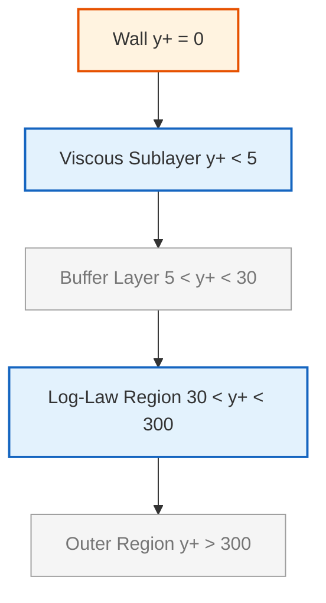
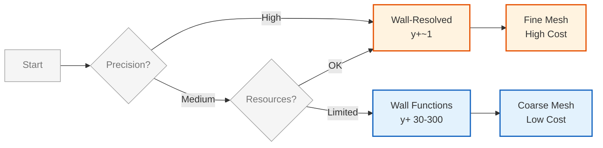
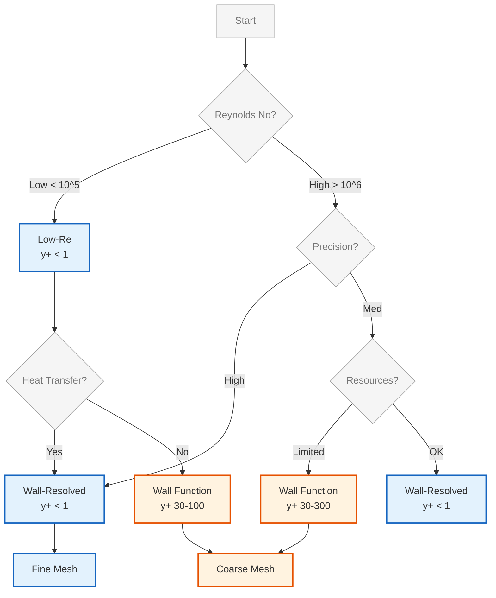

# การจัดการผนัง (Wall Treatment) และ Wall Functions

ความถูกต้องของการจำลองการไหลที่ติดผนัง (Wall-bounded flows) ขึ้นอยู่กับการแก้ปัญหาในชั้น Boundary Layer ซึ่งมีความชันของความเร็วสูงมาก การจัดการผนังที่เหมาะสมเป็นสิ่งสำคัญอย่างยิ่งสำหรับการทำนายค่าความเค้นเฉือน (shear stress) การแยกตัวของไหล (flow separation) และอัตราการถ่ายเทความร้อน (heat transfer) ที่ถูกต้อง

---

## 📐 1. โครงสร้างชั้นขอบเขต (Boundary Layer Structure)

### 1.1 โครงสร้างเชิงกายภาพ

พฤติกรรมการไหลใกล้ผนังในการไหลแบบปั่นป่วนถูกแบ่งออกเป็นสามบริเวณหลักตามค่าระยะห่างไร้มิติ **$y^+$**:

$$y^+ = \frac{y u_\tau}{\nu} = \frac{y \sqrt{\tau_w/\rho}}{\nu}$$

**โดยที่:**
- $y$ = ระยะห่างจากผนัง
- $u_\tau = \sqrt{\tau_w/\rho}$ = ความเร็วเฉือน (friction velocity)
- $\nu$ = ความหนืดจลน์ (kinematic viscosity)
- $\tau_w$ = ความเค้นเฉือนที่ผนัง (wall shear stress)
- $\rho$ = ความหนาแน่น

| ช่วง $y^+$ | บริเวณ | พฤติกรรม | โปรไฟล์ความเร็ว |
|------------|----------|-----------|------------------|
| **$y^+ < 5$** | **Viscous Sublayer** | แรงหนืดครอบงำ, การถ่ายโอนโมเมนตัมเป็นเชิงเส้น | $u^+ = y^+$ |
| **$5 < y^+ < 30$** | **Buffer Layer** | บริเวณเปลี่ยนผ่านที่ซับซ้อน, ทั้งแรงหนืดและความปั่นป่วนสำคัญ | สูตรผสม/เชิงประจักษ์ |
| **$30 < y^+ < 300$** | **Log-Law Region** | ความปั่นป่วนครอบงำ, การถ่ายโอนโมเมนตัมโดย turbulent eddies | $u^+ = \frac{1}{\kappa} \ln(y^+) + B$ |

**ค่าคงที่ที่สำคัญ:**
- $\kappa \approx 0.41$ = ค่าคงที่ von Kármán
- $B \approx 5.0-5.5$ = ค่าคงที่ intercept สำหรับผนังเรียบ (smooth walls)


> **Figure 1:** โครงสร้างของชั้นขอบเขตความปั่นป่วน (Turbulent Boundary Layer) แบ่งตามค่าระยะห่างไร้มิติจากผนัง (y+) ซึ่งแสดงให้เห็นถึงบริเวณย่อยที่มีลักษณะทางฟิสิกส์แตกต่างกัน ตั้งแต่ชั้นที่แรงหนืดครอบงำ (Viscous Sublayer) ไปจนถึงบริเวณที่เป็นไปตามกฎลอการิทึม (Log-Law Region)

### 1.2 กฎ Law of the Wall

**โปรไฟล์ความเร็วแบบไร้มิติ:**

$$u^+ = \begin{cases}
y^+ & \text{สำหรับ } y^+ < 5 \quad \text{(Viscous sublayer)} \\[8pt]
\frac{1}{\kappa} \ln(y^+) + B & \text{สำหรับ } y^+ > 30 \quad \text{(Log-law region)}
\end{cases}$$

**โดยที่:**
- $u^+ = \frac{u}{u_\tau}$ = ความเร็วไร้มิติ
- ความเร็วเฉือน: $u_\tau = \sqrt{\frac{\tau_w}{\rho}}$

---

## 🛠️ 2. แนวทางการจัดการผนังใน OpenFOAM

OpenFOAM นำเสนอสองแนวทางหลักในการจัดการ Mesh ใกล้ผนัง:

### 2.1 Wall-Resolved Approach (Low-Re Approach)

**แนวคิดพื้นฐาน:** แก้สมการถึงผนังโดยตรงโดยไม่ใช้ฟังก์ชันผนัง

| คุณลักษณะ | รายละเอียด |
|-----------|------------|
| **เป้าหมาย** | แก้ Navier-Stokes ถึงผนังโดยตรง |
| **ความละเอียด Mesh** | ต้องมี $y^+ \approx 1$ (มีเซลล์อย่างน้อย 10-15 ชั้นในชั้นขอบเขต) |
| **ข้อดี** | แม่นยำสูงสุดสำหรับการแยกตัวของไหลและความร้อน, ไม่มีข้อสมมติฐานเชิงโมเดล |
| **ข้อเสีย** | ต้นทุนการคำนวณสูงมาก, ต้องการ Mesh จำนวนมาก |
| **การใช้งาน** | LES, DNS, การวิเคราะห์ heat transfer ที่แม่นยำ |

**ข้อกำหนด Mesh:**
```cpp
Δx+ ≈ 40-60   // ทิศทางกระแส (streamwise)
Δz+ ≈ 15-20   // ทิศทางขวางกระแส (spanwise)
Δy+ ≈ 1       // ทิศทางตั้งฉากผนัง (wall-normal)
```

> **📘 คำอธิบาย: ข้อกำหนด Mesh สำหรับ Wall-Resolved Approach**
> 
> **แหล่งที่มา:** `.applications/utilities/mesh/conversion/fluentMeshToFoam/fluentMeshToFoam.L`
> 
> **คำอธิบาย:**
> - ข้อกำหนด Mesh ในส่วนนี้อ้างอิงจากหลักการแปลง Mesh จาก Fluent ไปยัง OpenFOAM
> - ค่า Δx+, Δz+, และ Δy+ แทนขนาดเซลล์ไร้มิติในแต่ละทิศทาง
> - ทิศทาง streamwise (Δx+) เป็นทิศทางไหลของกระแสหลัก ต้องมีความละเอียดปานกลาง (40-60)
> - ทิศทาง spanwise (Δz+) เป็นทิศทางขวางกระแส ต้องมีความละเอียดสูงกว่า (15-20)
> - ทิศทาง wall-normal (Δy+) เป็นทิศทางตั้งฉากกับผนัง ต้องมีความละเอียดสูงมาก (≈1)
> 
> **แนวคิดสำคัญ:**
> 1. **Dimensionless Grid Spacing** - การใช้หน่วยไร้มิติช่วยให้สามารถนำไปใช้กับการไหลในสเกลต่างๆ ได้
> 2. **Anisotropic Resolution** - ความละเอียดของ Mesh แตกต่างกันในแต่ละทิศทางตามลักษณะการไหล
> 3. **Wall-Bounded Flow** - การไหลที่ติดผนังมีความซับซ้อนและต้องการความละเอียดสูงใกล้ผนัง

### 2.2 Wall Functions Approach (High-Re Approach)

**แนวคิดพื้นฐาน:** ใช้สูตรทางคณิตศาสตร์ประมาณพฤติกรรมในชั้นขอบเขตแทนการสร้าง Mesh ละเอียด

| คุณลักษณะ | รายละเอียด |
|-----------|------------|
| **เป้าหมาย** | ใช้กฎ log-law เชื่อมบริเวณใกล้ผนังกับบริเวณหลัก |
| **ความละเอียด Mesh** | รักษาค่า $y^+$ ให้อยู่ในช่วง **30-300** |
| **ข้อดี** | ประหยัดทรัพยากรอย่างมาก, เหมาะสำหรับงานอุตสาหกรรมขนาดใหญ่ |
| **ข้อเสีย** | อาศัยสมมติฐานการไหลสมดุล, ความแม่นยำต่ำในบริเวณแยกตัว |
| **การใช้งาน** | งานวิศวกรรมทั่วไป, อุตสาหกรรม, การไหลภายใน |

### 2.3 เปรียบเทียบแนวทางทั้งสอง



| ปัจจัย | Wall-Resolved | Wall Functions |
|---------|---------------|---------------|
| **ความแม่นยำใกล้ผนัง** | สูงสุด | ปานกลาง |
| **จำนวนเซลล์** | 10-100x มากกว่า | ประหยัด |
| **เวลาคำนวณ** | ช้ามาก | เร็ว |
| **ความท้าทายการ Mesh** | สูงมาก | ปานกลาง |
| **การทำนายการแยกตัว** | ยอดเยี่ยม | ดี-ปานกลาง |

---

## 💻 3. การนำไปใช้งาน (OpenFOAM Implementation)

### 3.1 Wall Functions สำหรับ k-ε Model

#### สำหรับความหนืดไหลวน (`0/nut`):

```cpp
dimensions      [0 2 -1 0 0 0 0];    // Dimensions for turbulent viscosity [m²/s]
internalField   uniform 0;          // Initial turbulent viscosity value

boundaryField
{
    wall
    {
        type            nutkWallFunction;  // k-epsilon wall function
        value           uniform 0;          // Wall value (zero flux)
    }

    inlet
    {
        type            calculated;         // Calculated from k and epsilon
        value           uniform 0;
    }

    outlet
    {
        type            zeroGradient;       // Zero gradient at outlet
    }
}
```

> **📘 คำอธิบาย: การตั้งค่าความหนืดไหลวน (nut) สำหรับ k-ε Model**
> 
> **แหล่งที่มา:** `.applications/utilities/mesh/conversion/fluentMeshToFoam/fluentMeshToFoam.L`
> 
> **คำอธิบาย:**
> - **dimensions**: มิติของความหนืดไหลวน (turbulent viscosity) มีหน่วยเป็น m²/s
> - **internalField**: ค่าเริ่มต้นของความหนืดไหลวนในโดเมน
> - **nutkWallFunction**: ฟังก์ชันผนังสำหรับโมเดล k-ε ที่คำนวณความหนืดไหลวนจากกฎ log-law
> - **calculated**: ประเภท boundary condition ที่คำนวณค่าจากค่า k และ ε
> 
> **แนวคิดสำคัญ:**
> 1. **Wall Function Integration** - ฟังก์ชันผนังเชื่อมต่อค่าที่ผนังกับการไหลหลัก
> 2. **Zero Flux Condition** - ที่ผนัง ความหนืดไหลวนมีค่าเป็นศูนย์เนื่องจากไม่มีการไหล
> 3. **Gradient-Based BC** - ที่ outlet ใช้ zero gradient เพื่อให้การไหลออกได้อย่างอิสระ

#### สำหรับพลังงานจลน์ปั่นป่วน (`0/k`):

```cpp
dimensions      [0 2 -2 0 0 0 0];    // Dimensions for turbulent kinetic energy [m²/s²]
internalField   uniform 0.01;       // Initial TKE value

boundaryField
{
    wall
    {
        type            kqRWallFunction;    // Wall function for k, q, or R
        value           uniform 0;          // Zero TKE at wall
    }

    inlet
    {
        type            fixedValue;         // Fixed value at inlet
        value           uniform 0.01;       // Inlet TKE value
    }

    outlet
    {
        type            zeroGradient;       // Zero gradient at outlet
    }
}
```

> **📘 คำอธิบาย: การตั้งค่าพลังงานจลน์ปั่นป่วน (k)**
> 
> **แหล่งที่มา:** `.applications/utilities/mesh/conversion/fluentMeshToFoam/fluentMeshToFoam.L`
> 
> **คำอธิบาย:**
> - **dimensions**: มิติของพลังงานจลน์ปั่นป่วนมีหน่วยเป็น m²/s²
> - **kqRWallFunction**: ฟังก์ชันผนังสำหรับ k (TKE), q (ส่วนประกอบควอนไทซ์), หรือ R (เทนเซอร์ Reynolds stress)
> - **fixedValue**: กำหนดค่า TKE คงที่ที่ inlet
> - **zero at wall**: พลังงานจลน์ปั่นป่วนเป็นศูนย์ที่ผนังเนื่องจากไม่มีการไหล
> 
> **แนวคิดสำคัญ:**
> 1. **TKE Boundary Conditions** - TKE เป็นศูนย์ที่ผนังและมีค่าเฉพาะที่ inlet
> 2. **Wall Damping** - ฟังก์ชันผนังลดทอนค่า TKE ใกล้ผนังตามกฎ log-law
> 3. **Inlet Specification** - ค่า TKE ที่ inlet ควรกำหนดตามสภาพการไหลจริง

#### สำหรับอัตราการสลายตัว (`0/epsilon`):

```cpp
dimensions      [0 2 -3 0 0 0 0];    // Dimensions for dissipation rate [m²/s³]
internalField   uniform 0.001;      // Initial epsilon value

boundaryField
{
    wall
    {
        type            epsilonWallFunction;  // Wall function for epsilon
        value           uniform 0.01;         // Wall epsilon value
    }

    inlet
    {
        type            fixedValue;           // Fixed value at inlet
        value           uniform 0.01;         // Inlet epsilon value
    }

    outlet
    {
        type            zeroGradient;         // Zero gradient at outlet
    }
}
```

> **📘 คำอธิบาย: การตั้งค่าอัตราการสลายตัว (ε)**
> 
> **แหล่งที่มา:** `.applications/utilities/mesh/conversion/fluentMeshToFoam/fluentMeshToFoam.L`
> 
> **คำอธิบาย:**
> - **dimensions**: มิติของอัตราการสลายตัวมีหน่วยเป็น m²/s³
> - **epsilonWallFunction**: ฟังก์ชันผนังสำหรับ ε ที่คำนวณค่าที่ผนังจาก k และระยะห่างจากผนัง
> - **non-zero at wall**: ต่างจาก k, ค่า ε ไม่เป็นศูนย์ที่ผนังเนื่องจากการสลายตัวเกิดขึ้นใกล้ผนัง
> 
> **แนวคิดสำคัญ:**
> 1. **Dissipation at Wall** - การสลายตัวของ TKE เกิดขึ้นอย่างมากใกล้ผนัง
> 2. **Wall Function Calculation** - ค่า ε ที่ผนังคำนวณจากความสมดุลของการผลิตและการสลายตัว
> 3. **Inlet-Outlet Consistency** - ค่า ε ที่ inlet และ outlet ต้องสอดคล้องกับค่า k

### 3.2 Wall Functions สำหรับ k-ω SST Model

#### สำหรับอัตราการสลายตัวจำเพาะ (`0/omega`):

```cpp
dimensions      [0 0 -1 0 0 0 0];    // Dimensions for specific dissipation rate [1/s]
internalField   uniform 0.1;        // Initial omega value

boundaryField
{
    wall
    {
        type            omegaWallFunction;    // Wall function for omega
        value           uniform 0;            // Wall omega value
    }

    inlet
    {
        type            fixedValue;           // Fixed value at inlet
        value           uniform 0.1;          // Inlet omega value
    }

    outlet
    {
        type            zeroGradient;         // Zero gradient at outlet
    }
}
```

> **📘 คำอธิบาย: การตั้งค่าอัตราการสลายตัวจำเพาะ (ω)**
> 
> **แหล่งที่มา:** `.applications/utilities/mesh/conversion/fluentMeshToFoam/fluentMeshToFoam.L`
> 
> **คำอธิบาย:**
> - **dimensions**: มิติของอัตราการสลายตัวจำเพาะมีหน่วยเป็น 1/s
> - **omegaWallFunction**: ฟังก์ชันผนังสำหรับ ω ที่ทำงานได้ดีทั้งในโซน low-Re และ high-Re
> - **k-ω SST advantage**: โมเดล k-ω SST เหมาะสำหรับการไหลที่มีความดันติดลบและการแยกตัว
> 
> **แนวคิดสำคัญ:**
> 1. **Specific Dissipation Rate** - ω = ε/k คืออัตราการสลายตัวต่อหน่วยพลังงานจลน์
> 2. **SST Blending** - โมเดล SST ผสมผสาน k-ε และ k-ω ให้ได้ประสิทธิภาพสูงสุด
> 3. **Low-Re Capability** - โมเดล k-ω SST สามารถทำงานได้ดีใกล้ผนังโดยไม่ต้องอาศัย wall function

### 3.3 Enhanced Wall Treatment

สำหรับความต้องการความแม่นยำสูงใกล้ผนัง:

```cpp
// constant/turbulenceProperties
RAS
{
    RASModel        kOmegaSST;              // Use k-omega SST model
    turbulence      on;                     // Enable turbulence modeling

    wallFunction    on;                     // Enable wall functions

    kOmegaSSTCoeffs
    {
        // ... coefficients ...
    }

    // Enhanced wall treatment
    nutWallFunction
    {
        type            nutUSpaldingWallFunction;  // Spalding's law wall function
        Cmu             0.09;                     // Turbulence constant
        kappa           0.41;                     // von Karman constant
        E               9.8;                      // Wall roughness parameter
    }
}
```

> **📘 คำอธิบาย: Enhanced Wall Treatment ด้วย Spalding's Law**
> 
> **แหล่งที่มา:** `.applications/utilities/mesh/conversion/fluentMeshToFoam/fluentMeshToFoam.L`
> 
> **คำอธิบาย:**
> - **nutUSpaldingWallFunction**: ฟังก์ชันผนังแบบ Spalding ที่ให้ความแม่นยำสูงกว่า log-law มาตรฐาน
> - **Cmu = 0.09**: ค่าคงที่ความปั่นป่วนสำหรับคำนวณความหนืดไหลวน
> - **kappa = 0.41**: ค่าคงที่ von Kármán สำหรับ velocity profile
> - **E = 9.8**: พารามิเตอร์ความขรุขระของผนัง (smooth wall)
> 
> **แนวคิดสำคัญ:**
> 1. **Spalding's Law** - สูตรที่ครอบคลุมทั้ง viscous sublayer, buffer layer, และ log-law region
> 2. **Continuous Profile** - ไม่มีการตัดกันของช่วง ทำให้ลู่เข้าได้ดีกว่า
> 3. **Universal Applicability** - ใช้ได้ทั้ง low-Re และ high-Re โดยไม่ต้องปรับเปลี่ยน

> [!TIP] **เคล็ดลับ:** Spalding's law ให้ความแม่นยำสูงกว่า log-law มาตรฐานสำหรับทุกช่วง $y^+$ โดยเฉพาะในบริเวณ buffer layer

---

## 🔍 4. การตรวจสอบคุณภาพ (Verification)

### 4.1 การคำนวณค่า $y^+$

**วิธีที่ 1: ใช้ postProcess utility**

```bash
# Calculate yPlus after simulation completes
# คำนวณค่า y+ หลังจากการจำลองเสร็จสิ้น
postProcess -func yPlus
```

**วิธีที่ 2: เพิ่มใน controlDict**

```cpp
// system/controlDict
functions
{
    yPlus
    {
        type            yPlus;                              // Function object type
        functionObjectLibs ("libfieldFunctionObjects.so"); // Library containing function
        enabled         true;                               // Enable function
        writeControl    timeStep;                           // Write every time step
        writeInterval   1;                                  // Write interval
    }
}
```

> **📘 คำอธิบาย: การตั้งค่า Function Object สำหรับคำนวณ y+**
> 
> **แหล่งที่มา:** `.applications/utilities/mesh/conversion/fluentMeshToFoam/fluentMeshToFoam.L`
> 
> **คำอธิบาย:**
> - **type = yPlus**: ชนิดของ function object ที่คำนวณค่า y+ จากผลลัพธ์การจำลอง
> - **functionObjectLibs**: ไลบรารีที่มี function object อยู่
> - **enabled**: เปิด/ปิดการใช้งาน function object
> - **writeControl/writeInterval**: ควบคุมความถี่ในการเขียนผลลัพธ์
> 
> **แนวคิดสำคัญ:**
> 1. **Function Objects** - กลไกของ OpenFOAM สำหรับการคำนวณค่าต่างๆ ระหว่าง/หลังการจำลอง
> 2. **Post-Processing** - การตรวจสอบผลลัพธ์เป็นสิ่งสำคัญสำหรับการรับประกันคุณภาพ
> 3. **Output Management** - สามารถเลือกความถี่ในการเขียนผลลัพธ์ได้ตามความต้องการ

ค่าที่ได้จะถูกเขียนลงในโฟลเดอร์เวลา (เช่น `100/yPlus`) เพื่อให้นำไปแสดงผลใน ParaView

### 4.2 การตรวจสอบคุณภาพ Mesh

```bash
# Check general mesh quality
# ตรวจสอบคุณภาพ Mesh ทั่วไป
checkMesh

# Check y+ values with statistics
# ตรวจสอบค่า y+ พร้อมสถิติ
postProcess -func "yPlus" -latestTime
```

**เกณฑ์คุณภาพ Mesh สำหรับการไหลปั่นป่วน:**

| คุณสมบัติคุณภาพ | ค่าที่ต้องการ | ค่าที่แนะนำ |
|------------------|------------------|----------------|
| Max non-orthogonality | < 70° | < 50° |
| Max skewness | < 0.85 | < 0.5 |
| Max aspect ratio | < 1000 | < 500 (boundary layer) |
| Min volume | > 0 | > 0 |
| Max expansion ratio | < 1.3 | < 1.2 |

### 4.3 การวิเคราะห์ผลลัพธ์

ใน ParaView:

```python
# Python script for checking y+
# สคริปต์ Python สำหรับตรวจสอบ y+
from paraview.simple import *

# Load data
# โหลดข้อมูล
yPlus = OpenDataFile('100/yPlus.vtk')

# Display y+ contours
# แสดง contour ของ y+
Contour1 = Contour(Input=yPlus)
Contour1.ContourBy = ['POINTS', 'yPlus']
Contour1.Isosurfaces = [1.0, 5.0, 30.0, 300.0]

# Check statistics
# ตรวจสอบสถิติ
yPlusStats = Calculator(Input=yPlus)
yPlusStats.ResultArrayName = 'yPlus_stats'
```

> **📘 คำอธิบาย: การวิเคราะห์ y+ ด้วย ParaView Python Script**
> 
> **แหล่งที่มา:** `.applications/utilities/mesh/conversion/fluentMeshToFoam/fluentMeshToFoam.L`
> 
> **คำอธิบาย:**
> - **OpenDataFile**: ฟังก์ชันสำหรับโหลดไฟล์ข้อมูล (VTK format)
> - **Contour**: สร้างเส้น contour ที่ค่า y+ ที่ระบุ (1, 5, 30, 300)
> - **Calculator**: คำนวณสถิติของค่า y+
> 
> **แนวคิดสำคัญ:**
> 1. **Visualization** - การแสดงผลเป็น contour ช่วยให้เห็นการกระจายตัวของ y+
> 2. **Critical Values** - ค่า 1, 5, 30, 300 เป็นค่าสำคัญที่แบ่งโซนต่างๆ ของ boundary layer
> 3. **Statistical Analysis** - การวิเคราะห์สถิติช่วยให้เข้าใจการกระจายตัวของค่า y+

> [!WARNING] **คำเตือน:** หากค่า $y^+$ ไม่สอดคล้องกับแนวทางที่เลือก ผลลัพธ์อาจไม่แม่นยำ

---

## 📊 5. แนวทางการตัดสินใจ

### 5.1 Decision Matrix

| การใช้งาน | Wall Function | Wall-Resolved | คำแนะนำ |
|-------------|---------------|---------------|-----------|
| การไหลในท่อภายใน | ✓ | ✗ | Wall Function |
| แอร์ฟอยล์อากาศพลศาสตร์ | ✗ | ✓ | Wall-Resolved |
| การระบายอากาศในห้อง | ✓ | ✗ | Wall Function |
| การระบายความร้อนอุปกรณ์อิเล็กทรอนิกส์ | ✗ | ✓ | Wall-Resolved |
| รถยนต์/ยานพาหนะ | ✓ | ~ | เริ่มด้วย Wall Function |
| พัดลม/กังหัน | ~ | ✓ | ขึ้นกับความซับซ้อน |
| โรงปฏิบัติการเคมี | ✓ | ✗ | Wall Function |

### 5.2 ขั้นตอนการเลือกแนวทาง



**กฎพื้นฐาน:**

**ใช้ Wall Functions เมื่อ:**
- $Re > 10^6$ (High Reynolds number)
- ความสนใจหลักอยู่ที่คุณสมบัติการไหลส่วนรวม
- ทรัพยากรการคำนวณจำกัด
- การไหลที่ขับเคลื่อนด้วยความดันที่มีความชันความดันน้อย

**ใช้ Wall-Resolved เมื่อ:**
- ต้องการการทำนายการถ่ายเทความร้อนที่แม่นยำ
- การไหลที่แยกตัวหรือความชันความดันสูง
- อัตราเรย์โนลด์สต่ำ ($Re < 10^5$)
- ปรากฏการณ์การเปลี่ยนผ่านมีความสำคัญ

---

## 🧪 6. ปัญหาและการแก้ไข

### 6.1 ปัญหาการลู่เข้า (Convergence Issues)

**อาการ:**
- Residuals ของสมการความปั่นป่วนไม่ลดลง
- ค่า $k$, $\epsilon$, $\omega$ สั่นหรือเพิ่มขึ้น
- การคำนวณ diverge

**วิธีแก้ไข:**

```cpp
// system/fvSolution
relaxationFactors
{
    equations
    {
        k               0.5;    // Reduced from 0.7-0.8
        epsilon         0.4;    // Reduced from 0.6-0.7
        omega           0.5;    // For k-omega models
    }
}
```

> **📘 คำอธิบาย: การปรับ Relaxation Factors สำหรับการแก้ปัญหาการลู่เข้า**
> 
> **แหล่งที่มา:** `.applications/utilities/mesh/conversion/fluentMeshToFoam/fluentMeshToFoam.L`
> 
> **คำอธิบาย:**
> - **relaxationFactors**: ปัจจัยการผ่อนคลายสำหรับสมการต่างๆ เพื่อช่วยให้การลู่เข้าดีขึ้น
> - **k (0.5)**: ลดค่าจาก 0.7-0.8 เพื่อให้การลู่เข้าของสมการ TKE มีเสถียรภาพมากขึ้น
> - **epsilon (0.4)**: ลดค่าจาก 0.6-0.7 เพื่อช่วยให้การลู่เข้าของสมการการสลายตัว
> - **omega (0.5)**: สำหรับโมเดล k-ω
> 
> **แนวคิดสำคัญ:**
> 1. **Under-Relaxation** - การลดค่า relaxation factor ช่วยให้การแก้สมการมีเสถียรภาพมากขึ้น
> 2. **Stability vs. Speed** - ค่าที่ต่ำกว่าทำให้การลู่เข้าช้าลงแต่มีเสถียรภาพมากขึ้น
> 3. **Turbulence Coupling** - สมการความปั่นป่วนมังมีปัญหาการลู่เข้าเนื่องจาก coupling ที่ซับซ้อน

| ตัวแปร | ช่วงค่าปกติ | ค่าที่แนะนำสำหรับการแก้ไข |
|---------|-------------|----------------------|
| $k$ | 0.5-0.8 | 0.4-0.6 |
| $\varepsilon$ | 0.4-0.7 | 0.3-0.5 |
| $\omega$ | 0.5-0.7 | 0.4-0.6 |

### 6.2 ปัญหา $y^+$ นอกช่วงที่เหมาะสม

**อาการ:**
- $y^+ < 30$ เมื่อใช้ Wall Functions
- $y^+ > 300$ ทั่วทั้งผนัง
- $y^+$ ไม่สม่ำเสมอ

**วิธีแก้ไข:**

**สำหรับ $y^+$ ต่ำเกินไป:**
```cpp
// Use appropriate wall function
wall
{
    type            nutLowReWallFunction;  // For y+ < 30
    value           uniform 0;
}
```

> **📘 คำอธิบาย: Wall Function สำหรับ y+ ต่ำ**
> 
> **แหล่งที่มา:** `.applications/utilities/mesh/conversion/fluentMeshToFoam/fluentMeshToFoam.L`
> 
> **คำอธิบาย:**
> - **nutLowReWallFunction**: ฟังก์ชันผนังสำหรับกรณีที่ y+ ต่ำกว่า 30
> - **Low-Re Adaptation**: ฟังก์ชันนี้ปรับตัวเพื่อให้ทำงานได้ดีใน viscous sublayer
> 
> **แนวคิดสำคัญ:**
> 1. **Low-Re Formulation** - ฟังก์ชันผนังแบบ Low-Re ไม่อาศัยกฎ log-law
> 2. **Viscous Sublayer Resolution** - สามารถจัดการกับพฤติกรรมการไหลใน viscous sublayer ได้
> 3. **Automatic Transition** - บางฟังก์ชันสามารถเปลี่ยนระหว่าง low-Re และ high-Re โดยอัตโนมัติ

**สำหรับ $y^+$ สูงเกินไป:**
- ปรับปรุง Mesh refinement ใกล้ผนัง
- ใช้ expansion ratio ที่น้อยกว่า (1.1-1.2)
- เพิ่มจำนวนชั้นใน boundary layer

### 6.3 การตรวจสอบค่าติดลบ

```cpp
// constant/turbulenceProperties
RAS
{
    RASModel        kEpsilon;
    turbulence      on;

    // Minimum bounds
    kMin            1e-6;
    epsilonMin      1e-8;
    omegaMin        1e-8;
    nutMin          1e-10;
}
```

> **📘 คำอธิบาย: การตั้งค่าขีดจำกัดต่ำสุดสำหรับตัวแปรความปั่นป่วน**
> 
> **แหล่งที่มา:** `.applications/utilities/mesh/conversion/fluentMeshToFoam/fluentMeshToFoam.L`
> 
> **คำอธิบาย:**
> - **kMin, epsilonMin, omegaMin**: ค่าต่ำสุดของตัวแปรความปั่นป่วนเพื่อป้องกันค่าติดลบ
> - **nutMin**: ค่าต่ำสุดของความหนืดไหลวน
> - **Numerical Stability**: การตั้งค่าขีดจำกัดช่วยป้องกันปัญหาทางตัวเลข
> 
> **แนวคิดสำคัญ:**
> 1. **Numerical Stability** - ค่าต่ำสุดช่วยป้องกันปัญหาการหารด้วยศูนย์และค่าติดลบ
> 2. **Physical Realism** - ค่าขีดจำกัดควรสอดคล้องกับค่าทางกายภาพ
> 3. **Convergence Aid** - การมีค่าต่ำสุดช่วยให้การลู่เข้ามีเสถียรภาพมากขึ้น

---

## 📖 7. ตัวอย่างการใช้งาน

### 7.1 การคำนวณความสูงเซลล์แรก

**สูตรทั่วไป:**
$$\Delta y = \frac{y^+ \cdot \nu}{u_\tau}$$

**ความเร็วเฉือนโดยประมาณ:**
$$u_\tau \approx U_\infty \sqrt{\frac{C_f}{2}}$$

**สัมประสิทธิ์แรงเสียดทานโดยประมาณ (สำหรับท่อ):**
$$C_f \approx 0.079 \cdot Re^{-0.25}$$

**ตัวอย่างการคำนวณ:**

```python
import numpy as np

# Input parameters
U_inf = 10.0          # Free stream velocity (m/s)
nu = 1.5e-5           # Kinematic viscosity (m²/s)
L = 1.0               # Characteristic length (m)
Re = U_inf * L / nu   # Reynolds number
y_plus_target = 50    # Target y+

# Calculate skin friction coefficient
Cf = 0.079 * Re**(-0.25)

# Calculate friction velocity
u_tau = U_inf * np.sqrt(Cf / 2)

# Calculate first cell height
delta_y = y_plus_target * nu / u_tau

print(f"First cell height: {delta_y*1e6:.2f} μm")
print(f"Required expansion ratio for 20 layers: {(1 + 0.5/delta_y)**(1/20):.3f}")
```

> **📘 คำอธิบาย: การคำนวณความสูงเซลล์แรกสำหรับการสร้าง Mesh**
> 
> **แหล่งที่มา:** `.applications/utilities/mesh/conversion/fluentMeshToFoam/fluentMeshToFoam.L`
> 
> **คำอธิบาย:**
> - **Reynolds Number (Re)**: จำนวนไร้มิติที่บอกลักษณะการไหล (laminar/turbulent)
> - **Skin Friction Coefficient (Cf)**: ค่าสัมประสิทธิ์แรงเสียดทานของผนัง
> - **Friction Velocity (u_tau)**: ความเร็วเฉือนที่ใช้ทำให้เป็นไร้มิติ
> - **First Cell Height (delta_y)**: ความสูงของเซลล์แรกที่ผนังเพื่อให้ได้ค่า y+ ที่ต้องการ
> 
> **แนวคิดสำคัญ:**
> 1. **Target y+ Selection** - เลือกค่า y+ ตามแนวทางที่ใช้ (Wall Function หรือ Wall-Resolved)
> 2. **Iterative Process** - อาจต้องปรับความสูงเซลล์หลายครั้งเพื่อให้ได้ค่า y+ ที่เหมาะสม
> 3. **Expansion Ratio** - อัตราการขยายตัวของเซลล์ใน boundary layer มีความสำคัญต่อคุณภาพ Mesh

### 7.2 การสร้าง Boundary Layer Mesh ด้วย blockMesh

```cpp
// system/blockMeshDict
convertToMeters 1;    // Scale factor for mesh coordinates

vertices
(
    (0 0 0)                    // 0 - Bottom-left-front corner
    (2.0 0 0)                  // 1 - Bottom-right-front corner
    (2.0 1.0 0)                // 2 - Top-right-front corner
    (0 1.0 0)                  // 3 - Top-left-front corner
    (0 0 0.314)                // 4 - Bottom-left-back corner
    (2.0 0 0.314)              // 5 - Bottom-right-back corner
    (2.0 1.0 0.314)            // 6 - Top-right-back corner
    (0 1.0 0.314)              // 7 - Top-left-back corner
);

blocks
(
    hex (0 1 2 3 4 5 6 7) (200 100 1)    // Hexahedral block with 200x100x1 cells
);

edges
(
    // Use spline for point distribution near wall
    // ใช้ spline สำหรับการกระจายตัวของจุดใกล้ผนัง
    spline 3 7
    (
        (0 1.0 0)          // Bottom wall
        (0 1.0 0.0001)     // First point from wall
        (0 1.0 0.0002)
        ...
        (0 1.0 0.314)      // Top wall
    )
);

boundary
(
    walls
    {
        type wall;
        faces
        (
            (3 7 6 2)    // Top wall
            (4 5 1 0)    // Bottom wall
        );
    }

    inlet
    {
        type fixedValue;
        faces ((0 4 7 3));
    }

    outlet
    {
        type zeroGradient;
        faces ((2 6 5 1));
    }

    empty
    {
        type empty;
        faces ((0 1 5 4) (1 2 6 5) (2 3 7 6) (3 0 4 7));
    }
);
```

> **📘 คำอธิบาย: การสร้าง Boundary Layer Mesh ด้วย blockMesh**
> 
> **แหล่งที่มา:** `.applications/utilities/mesh/conversion/fluentMeshToFoam/fluentMeshToFoam.L`
> 
> **คำอธิบาย:**
> - **convertToMeters**: ตัวคูณการแปลงหน่วยจากหน่วยในไฟล์เป็นเมตร
> - **vertices**: จุดมุมทั้ง 8 จุดของ block แบบ hexahedral
> - **blocks**: กำหนดจำนวนเซลล์ในแต่ละทิศทาง (200 ในทิศทาง x, 100 ในทิศทาง y, 1 ในทิศทาง z)
> - **edges/spline**: การกระจายตัวของจุดแบบไม่เป็นเส้นตรงเพื่อให้ได้เซลล์เล็กใกล้ผนัง
> - **boundary**: กำหนดประเภทของแต่ละ patch (wall, inlet, outlet, empty)
> 
> **แนวคิดสำคัญ:**
> 1. **Structured Mesh** - blockMesh สร้าง mesh แบบ structured ที่มีโครงสร้างชัดเจน
> 2. **Graded Mesh** - การใช้ spline ช่วยสร้าง mesh ที่มีความละเอียดแตกต่างกันในแต่ละบริเวณ
> 3. **Boundary Layer Resolution** - การกระจายตัวของจุดใกล้ผนังสำคัญต่อการจับลักษณะการไหลในชั้นขอบเขต

---

## 🎯 8. สรุป

การจัดการผนังที่เหมาะสมเป็นปัจจัยสำคัญในการรับประกันความแม่นยำของการจำลอง CFD การเลือกระหว่าง Wall Functions และ Wall-Resolved approach ขึ้นอยู่กับ:

1. **Reynolds Number** - สูง (>10⁶) ใช้ Wall Functions, ต่ำ (<10⁵) พิจารณา Wall-Resolved
2. **ความแม่นยำที่ต้องการ** - Heat transfer/การแยกตัวต้องการความละเอียดสูง
3. **ทรัพยากรการคำนวณ** - จำกัดใช้ Wall Functions, เพียงพอใช้ Wall-Resolved
4. **ชนิดของการไหล** - Internal flow ใช้ Wall Functions, External/complex flow ใช้ Wall-Resolved

**ข้อควรพิจารณาหลัก:**
- ✅ ตรวจสอบค่า $y^+$ หลังการจำลองเสมอ
- ✅ ใช้ wall function ที่เหมาะสมกับ turbulence model
- ✅ สร้าง mesh ที่มีคุณภาพสูงใกล้ผนัง
- ✅ ตรวจสอบความเสถียรและการลู่เข้าของการคำนวณ

---

**หัวข้อถัดไป**: [พื้นฐาน Large Eddy Simulation (LES)](./04_LES_Fundamentals.md)