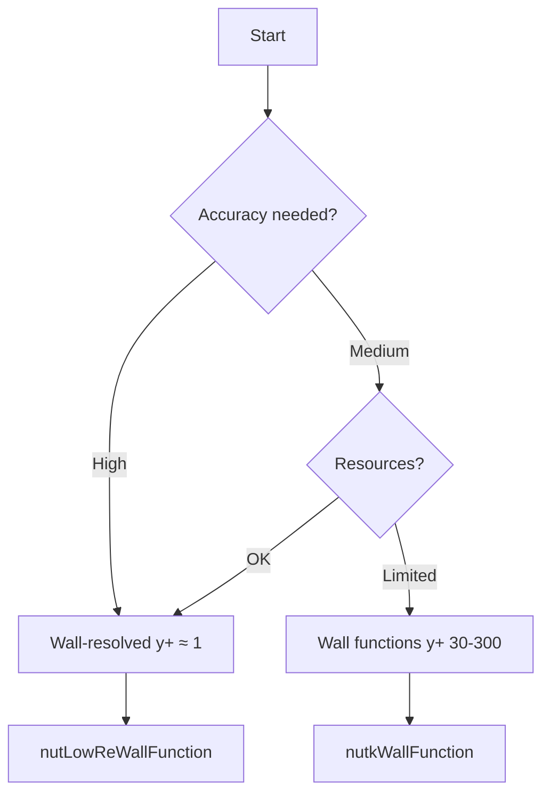

# Wall Treatment

การจัดการผนังและ Wall Functions สำหรับ Turbulence Modeling

---

## Learning Objectives

**After completing this section, you will be able to:**

1. **Understand** boundary layer structure and the physical meaning of1$y^+1values
2. **Distinguish** between wall-resolved and wall function approaches
3. **Select** appropriate wall treatment for your simulation requirements
4. **Implement** correct boundary conditions for different turbulence models
5. **Verify** and adjust1$y^+1values through mesh refinement
6. **Troubleshoot** common wall treatment issues

### Decision Flowchart



**Skills Checklist:**

| Skill | Beginner | Intermediate | Advanced |
|-------|----------|--------------|----------|
| Understanding1$y^+1concept | ☐ | ☐ | ☐ |
| Selecting wall treatment strategy | ☐ | ☐ | ☐ |
| Configuring wall BCs in OpenFOAM | ☐ | ☐ | ☐ |
| Checking1$y^+1with postProcess | ☐ | ☐ | ☐ |
| Calculating first cell height | ☐ | ☐ | ☐ |
| Troubleshooting divergence issues | ☐ | ☐ | ☐ |

---

## Overview

การเลือก Wall Treatment กำหนดความแม่นยำของ:
- **Shear stress** ที่ผนัง
- **Flow separation**
- **Heat transfer**

---

## 1. Boundary Layer Structure (WHAT)

###1$y^+1Definition

$$y^+ = \frac{y \cdot u_\tau}{\nu}$$

โดย1$u_\tau = \sqrt{\tau_w / \rho}1= friction velocity

### Physical Meaning (WHY)

The dimensionless wall distance1$y^+1represents:
- **Distance normalized by viscous length scale**
- **Indicator of which boundary layer region the first cell center occupies**
- **Critical for selecting appropriate wall treatment**

### Layer Regions

|1$y^+1Range | Region | Profile | Physical Meaning |
|-------------|--------|---------|------------------|
| 0-5 | Viscous sublayer |1$u^+ = y^+1| Viscous forces dominate, linear velocity profile |
| 5-30 | Buffer layer | Transition | Neither viscous nor turbulent forces dominate |
| 30-300 | Log-law region |1$u^+ = \frac{1}{\kappa}\ln(y^+) + B1| Turbulent forces dominate, logarithmic profile |

-1$\kappa = 0.411(von Kármán constant)
-1$B \approx 5.21(intercept constant)

**Why avoid1$y^+1= 5-30?**
The buffer layer lacks a valid theoretical model — neither linear nor log-law formulations are accurate → wall functions produce errors

<!-- IMAGE: IMG_03_002 -->
<!--
Purpose: เพื่ออธิบาย "Law of the Wall" ผ่านกราฟ Semi-log ($u^+1vs Log1$y^+$). ภาพนี้สำคัญมากในการตัดสินใจเลือกขนาด Mesh ($y^+$) โดยต้องแสดงให้เห็นพฤติกรรม 2 แบบที่แตกต่างกัน: 1) Viscous Sublayer (เส้นตรง Linear) ที่แรงหนืดครองผิวด้านล่าง และ 2) Log-law Region (เส้นตรง Logarithmic) ที่ Inertia เริ่มมีบทบาท
Prompt: "Engineering Plot of Law of the Wall (u+ vs y+). **Axes:** X-axis 'Log y+', Y-axis 'u+'. **Curve:** A single continuous curve starting from origin. It has a straight linear slope for y+ < 5 (Viscous Sublayer) and a logarithmic curve for y+ > 30 (Log-law). **Annotations:** Label 'Viscous Sublayer' and 'Log-law Region'. **Style:** Clear scientific plot, black lines, white background, textbook quality."
-->
![[IMG_03_002.JPg]]

---

## 2. Wall Treatment Approaches (WHY)

### Comparison Table

| Approach |1$y^+1Target | Mesh Requirements | Accuracy | Computational Cost | Best Use Cases |
|----------|--------------|-------------------|----------|-------------------|----------------|
| **Wall-resolved** | ≈ 1 | Fine, 10-15 cells in BL | Highest | High | LES, DNS, heat transfer, separation prediction |
| **Wall functions** | 30-300 | Coarse, fewer BL cells | Good | Low | Industrial RANS, large geometries |

### Selection Criteria

**Use Wall-Resolved (Low-Re) when:**
- Highest accuracy required for wall shear stress
- Predicting flow separation accurately
- Simulating heat transfer
- Running LES or DNS
- Computational resources available

**Use Wall Functions (High-Re) when:**
- Industrial applications with good accuracy acceptable
- Limited computational resources
- Large geometries where wall-resolved is prohibitive
- Primary interest in bulk flow, not near-wall physics

### Wall-Resolved (Low-Re) Details

**What:** Directly resolve viscous sublayer with fine mesh

**Why needed:**
- Captures sharp velocity gradients near wall
- Required for accurate heat transfer prediction
- Essential for LES/DNS

**How to implement:**
- Mesh first cell at1$y^+ \approx 1$
- Need 10-15 cells in boundary layer
- Use Low-Re wall functions (e.g., `nutLowReWallFunction`)

### Wall Functions (High-Re) Details

**What:** Use log-law bridge to model viscous sublayer

**Why effective:**
- Reduces mesh requirements significantly
- Based on well-established universal velocity profile
- Valid for most engineering applications

**How to implement:**
- Mesh first cell at1$y^+ = 30-300$
- Use standard wall functions (e.g., `nutkWallFunction`)
- Avoid buffer layer ($y^+1= 5-30)

---

## 3. Boundary Conditions in OpenFOAM (HOW)

### For k-ε Model

```cpp
// 0/nut
walls
{
    type    nutkWallFunction;
    value   uniform 0;
}

// 0/k
walls
{
    type    kqRWallFunction;
    value   uniform 0;
}

// 0/epsilon
walls
{
    type    epsilonWallFunction;
    value   uniform 0;
}
```

### For k-ω SST

```cpp
// 0/omega
walls
{
    type    omegaWallFunction;
    value   uniform 0;
}

// 0/nut - can use same as k-epsilon
walls
{
    type    nutkWallFunction;
    value   uniform 0;
}
```

### Low-Re / Wall-Resolved

```cpp
// 0/nut
walls
{
    type    nutLowReWallFunction;
    value   uniform 0;
}

// 0/k
walls
{
    type    fixedValue;
    value   uniform 0;
}
```

### Enhanced (Spalding) - Flexible Option

```cpp
// 0/nut - works for any y+
walls
{
    type    nutUSpaldingWallFunction;
    value   uniform 0;
}
```

**Why use Spalding?**
Spalding's law covers viscous sublayer, buffer layer, and log-law region in a single formula — works with any1$y^+1value, no need to worry about mesh placement

---

## 4. Wall Function Types Reference

| Function | Variable | Use Case |1$y^+1Range |
|----------|----------|----------|-------------|
| `nutkWallFunction` | nut | Standard k-ε, k-ω SST | 30-300 |
| `nutLowReWallFunction` | nut | Low-Re simulations | ≈ 1 |
| `nutUSpaldingWallFunction` | nut | Any mesh (flexible) | Any |
| `kqRWallFunction` | k, q, R | General TKE | Model-dependent |
| `epsilonWallFunction` | epsilon | k-ε models | 30-300 |
| `omegaWallFunction` | omega | k-ω models | Model-dependent |

---

## 5. Checking1$y^+1(HOW)

### Post-Process Method

```bash
# After simulation completes
postProcess -func yPlus

# Latest time only
postProcess -func yPlus -latestTime

# Specific time directory
postProcess -func yPlus -time 1000
```

Output: `yPlus` field written to time directories

### Runtime Monitoring

```cpp
// system/controlDict
functions
{
    yPlus
    {
        type            yPlus;
        libs            (fieldFunctionObjects);
        writeControl    writeTime;

        // Optional: write only at end
        // writeControl    writeTime;
        // writeInterval   1;
    }
}
```

### Expected Values and Actions

| Strategy | Target1$y^+1| Action if too low | Action if too high |
|----------|--------------|-------------------|-------------------|
| Wall function | 30-300 | Coarsen mesh or switch to Low-Re | Refine mesh |
| Wall-resolved | < 1 | Acceptable | Add boundary layers |

### Visualization

```bash
# ParaView: Open yPlus field
# Color by yPlus magnitude
# Check range at wall boundaries
```

---

## 6. Mesh Design for Wall Treatment (HOW)

### Calculate First Cell Height

**Formula:**
$$\Delta y = \frac{y^+ \cdot \nu}{u_\tau}$$

**Step-by-step:**
1. Estimate friction velocity:1$u_\tau \approx U_\infty \sqrt{C_f/2}$
2. Calculate skin friction coefficient:1$C_f \approx 0.058 \cdot Re_L^{-0.2}1(flat plate correlation)
3. Compute first cell height1$\Delta y$

**Example calculation:**
- Target1$y^+1= 50 (wall function)
-1$U_\infty1= 10 m/s
-1$\nu1= 1.5×10⁻⁵ m²/s (air)
-1$Re_L1= 10⁶ →1$C_f1≈ 0.0037
-1$u_\tau1≈ 0.43 m/s
-1$\Delta y1≈ 1.7 mm

### snappyHexMesh Layer Configuration

```cpp
// system/snappyHexMeshDict
addLayersControls
{
    layers
    {
        "wall.*"
        {
            nSurfaceLayers  10;  // Number of layers
        }
    }

    expansionRatio          1.2;   // Growth rate
    finalLayerThickness     0.3;   // Relative to surface cell size
    minThickness            0.1;   // Minimum layer thickness

    // Quality controls
    maxFaceThicknessRatio   0.5;
    nGrow                   0;
    featureAngle            180;
}
```

**Key parameters:**
- `nSurfaceLayers`: 10-15 for wall-resolved, 5-10 for wall functions
- `expansionRatio`: 1.1-1.3 (lower = smoother transition)
- `finalLayerThickness`: Controls first cell height

---

## 7. Troubleshooting (HOW)

### Problem:1$y^+1too low (< 30) with wall functions

**Why it's a problem:**
First cell in buffer layer where wall functions are invalid

**Solutions:**
1. **Use `nutLowReWallFunction`** instead — switch to wall-resolved approach
2. **Coarsen mesh near walls** — reduce boundary layer count
3. **Switch to Low-Re model** — if resolution is sufficient

### Problem:1$y^+1too high (> 300)

**Why it's a problem:**
First cell outside log-law region, wall function accuracy degrades

**Solutions:**
1. **Add more boundary layers** — increase `nSurfaceLayers`
2. **Reduce first cell height** — adjust `finalLayerThickness`
3. **Use lower expansion ratio** — creates thinner first layer

### Problem: Divergence near walls

**Why it happens:**
Turbulence variables becoming negative or too large

**Solutions:**

```cpp
// system/fvSolution - Add under-relaxation
relaxationFactors
{
    equations
    {
        k           0.5;   // Reduce from default
        epsilon     0.4;   // Reduce from default
        omega       0.5;   // Reduce from default
    }
}

// constant/turbulenceProperties - Add bounds
RAS
{
    kMin        1e-10;  // Prevent negative k
    epsilonMin  1e-10;  // Prevent negative epsilon
    omegaMin    1e-10;  // Prevent negative omega
}
```

### Problem: Poor convergence

**Additional checks:**
1. Verify boundary condition types match turbulence model
2. Check mesh quality (non-orthogonality, skewness)
3. Ensure proper initial conditions for turbulence fields
4. Gradually increase relaxation factors as solution stabilizes

---

## Concept Check

<details>
<summary><b>1. ทำไมต้องหลีกเลี่ยง1$y^+ = 5-30$?</b></summary>

Buffer layer เป็นบริเวณ transition ที่ไม่มีสูตรที่ถูกต้อง — ทั้ง linear profile ($u^+ = y^+$) และ log-law ไม่ใช้ได้ → wall functions จะให้ผลผิดพลาด
</details>

<details>
<summary><b>2. nutUSpaldingWallFunction ดีกว่า nutkWallFunction อย่างไร?</b></summary>

Spalding's law ครอบคลุมทั้ง viscous sublayer, buffer layer, และ log-law region ในสูตรเดียว — ทำงานได้กับ1$y^+1ค่าใดก็ได้ ไม่ต้องกังวลว่า mesh จะอยู่ในช่วงไหน
</details>

<details>
<summary><b>3. จะรู้ได้อย่างไรว่าต้อง refine หรือ coarsen mesh?</b></summary>

- ถ้า1$y^+ < 301แต่ใช้ wall functions → coarsen หรือเปลี่ยนเป็น Low-Re
- ถ้า1$y^+ > 3001→ refine โดยเพิ่ม boundary layers
- ตรวจสอบด้วย `postProcess -func yPlus`
</details>

---

## Key Takeaways

### What (Definitions & Equations)
-1$y^+ = y \cdot u_\tau / \nu1is the dimensionless wall distance
- Boundary layer has three regions: viscous sublayer (0-5), buffer (5-30), log-law (30-300)
- Two main approaches: wall-resolved ($y^+ \approx 1$) and wall functions ($y^+1= 30-300)

### Why (Physical Meaning & Selection)
- Wall treatment selection determines accuracy of shear stress, flow separation, and heat transfer
- Avoid buffer layer ($y^+1= 5-30) — no valid theoretical model exists
- Wall-resolved: highest accuracy, high cost — required for LES/DNS/heat transfer
- Wall functions: good accuracy, low cost — suitable for industrial RANS

### How (OpenFOAM Implementation)
- **Check1$y^+$**: `postProcess -func yPlus` or runtime function object
- **k-ε BCs**: `nutkWallFunction`, `kqRWallFunction`, `epsilonWallFunction`
- **k-ω SST BCs**: `omegaWallFunction`, `nutkWallFunction`
- **Low-Re BCs**: `nutLowReWallFunction`, `fixedValue` for k
- **Flexible option**: `nutUSpaldingWallFunction` works for any1$y^+$
- **Mesh design**: Calculate first cell height, configure `addLayersControls` in snappyHexMeshDict
- **Troubleshoot**: Adjust mesh, relaxation factors, and turbulence bounds

### Skills Progression

You have now mastered:
- ☐ Understanding1$y^+1and boundary layer structure
- ☐ Selecting appropriate wall treatment strategy
- ☐ Configuring wall boundary conditions in OpenFOAM
- ☐ Checking and adjusting1$y^+1values
- ☐ Designing mesh for wall treatment requirements
- ☐ Troubleshooting wall treatment issues

**Next Steps:** Apply these concepts in your simulations and verify1$y^+1values before trusting results

---

## Related Documents

- **บทก่อนหน้า:** [02_RANS_Models.md](02_RANS_Models.md)
- **บทถัดไป:** [04_LES_Fundamentals.md](04_LES_Fundamentals.md)
- **Module Overview:** [00_Overview.md](00_Overview.md)