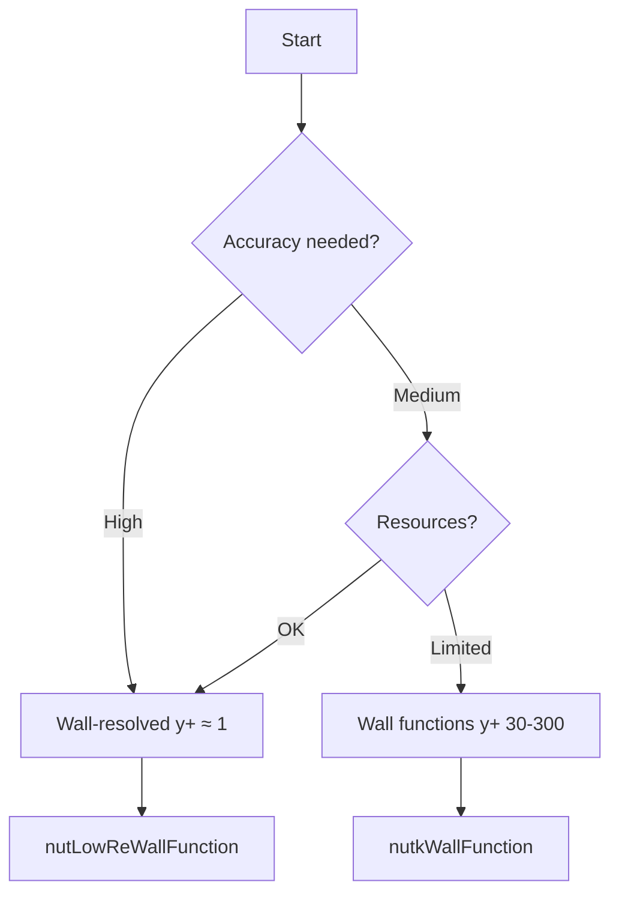

# Wall Treatment

การจัดการผนังและ Wall Functions สำหรับ Turbulence Modeling

---

## Overview

การเลือก Wall Treatment กำหนดความแม่นยำของ:
- **Shear stress** ที่ผนัง
- **Flow separation**
- **Heat transfer**

---

## 1. Boundary Layer Structure

### $y^+$ Definition

$$y^+ = \frac{y \cdot u_\tau}{\nu}$$

โดย $u_\tau = \sqrt{\tau_w / \rho}$ = friction velocity

### Layer Regions

| $y^+$ Range | Region | Profile |
|-------------|--------|---------|
| 0-5 | Viscous sublayer | $u^+ = y^+$ |
| 5-30 | Buffer layer | Transition |
| 30-300 | Log-law region | $u^+ = \frac{1}{\kappa}\ln(y^+) + B$ |

- $\kappa = 0.41$ (von Kármán)
- $B \approx 5.2$

---

## 2. Wall Treatment Approaches

### Comparison

| Approach | $y^+$ | Mesh | Accuracy |
|----------|-------|------|----------|
| **Wall-resolved** | ≈ 1 | Fine | Highest |
| **Wall functions** | 30-300 | Coarse | Good |

### Wall-Resolved (Low-Re)

- Mesh first cell at $y^+ \approx 1$
- Need 10-15 cells in boundary layer
- Required for: LES, DNS, heat transfer

### Wall Functions (High-Re)

- Mesh first cell at $y^+ = 30-300$
- Use log-law to bridge viscous sublayer
- Suitable for: Industrial RANS

---

## 3. Boundary Conditions

### For k-ε Model

```cpp
// 0/nut
walls
{
    type    nutkWallFunction;
    value   uniform 0;
}

// 0/k
walls
{
    type    kqRWallFunction;
    value   uniform 0;
}

// 0/epsilon
walls
{
    type    epsilonWallFunction;
    value   uniform 0;
}
```

### For k-ω SST

```cpp
// 0/omega
walls
{
    type    omegaWallFunction;
    value   uniform 0;
}

// 0/nut - can use same as k-epsilon
walls
{
    type    nutkWallFunction;
    value   uniform 0;
}
```

### Low-Re / Wall-Resolved

```cpp
// 0/nut
walls
{
    type    nutLowReWallFunction;
    value   uniform 0;
}

// 0/k
walls
{
    type    fixedValue;
    value   uniform 0;
}
```

### Enhanced (Spalding)

```cpp
// 0/nut - works for any y+
walls
{
    type    nutUSpaldingWallFunction;
    value   uniform 0;
}
```

---

## 4. Wall Function Types

| Function | Variable | Use Case |
|----------|----------|----------|
| `nutkWallFunction` | nut | Standard k-ε |
| `nutLowReWallFunction` | nut | Low-Re, y+ < 5 |
| `nutUSpaldingWallFunction` | nut | Any y+ (flexible) |
| `kqRWallFunction` | k, q, R | General TKE |
| `epsilonWallFunction` | epsilon | k-ε models |
| `omegaWallFunction` | omega | k-ω models |

---

## 5. Checking $y^+$

### Post-Process

```bash
# After simulation
postProcess -func yPlus

# Latest time only
postProcess -func yPlus -latestTime
```

### Runtime

```cpp
// system/controlDict
functions
{
    yPlus
    {
        type            yPlus;
        libs            (fieldFunctionObjects);
        writeControl    writeTime;
    }
}
```

### Expected Values

| Strategy | Target $y^+$ | Action if wrong |
|----------|--------------|-----------------|
| Wall function | 30-300 | Refine/coarsen mesh |
| Wall-resolved | < 1 | Add boundary layers |

---

## 6. Mesh for Wall Treatment

### Calculate First Cell Height

$$\Delta y = \frac{y^+ \cdot \nu}{u_\tau}$$

**Estimate $u_\tau$:**
$$u_\tau \approx U_\infty \sqrt{\frac{C_f}{2}}$$

**Flat plate correlation:**
$$C_f \approx 0.058 \cdot Re_L^{-0.2}$$

### snappyHexMeshDict Layers

```cpp
addLayersControls
{
    layers
    {
        "wall.*"
        {
            nSurfaceLayers  10;
        }
    }
    
    expansionRatio          1.2;
    finalLayerThickness     0.3;
    minThickness            0.1;
}
```

---

## 7. Troubleshooting

### Problem: $y^+$ too low (< 30) with wall functions

**Solutions:**
1. Use `nutLowReWallFunction` instead
2. Coarsen mesh near walls
3. Switch to Low-Re model

### Problem: $y^+$ too high (> 300)

**Solutions:**
1. Add more boundary layers
2. Reduce first cell height
3. Use lower expansion ratio

### Problem: Divergence near walls

**Solutions:**
```cpp
// system/fvSolution
relaxationFactors
{
    equations
    {
        k           0.5;
        epsilon     0.4;
        omega       0.5;
    }
}

// constant/turbulenceProperties
RAS
{
    kMin        1e-10;
    epsilonMin  1e-10;
    omegaMin    1e-10;
}
```

---

## Decision Flowchart



---

## Concept Check

<details>
<summary><b>1. ทำไมต้องหลีกเลี่ยง $y^+ = 5-30$?</b></summary>

Buffer layer เป็นบริเวณ transition ที่ไม่มีสูตรที่ถูกต้อง — ทั้ง linear profile ($u^+ = y^+$) และ log-law ไม่ใช้ได้ → wall functions จะให้ผลผิดพลาด
</details>

<details>
<summary><b>2. nutUSpaldingWallFunction ดีกว่า nutkWallFunction อย่างไร?</b></summary>

Spalding's law ครอบคลุมทั้ง viscous sublayer, buffer layer, และ log-law region ในสูตรเดียว — ทำงานได้กับ $y^+$ ค่าใดก็ได้ ไม่ต้องกังวลว่า mesh จะอยู่ในช่วงไหน
</details>

<details>
<summary><b>3. จะรู้ได้อย่างไรว่าต้อง refine หรือ coarsen mesh?</b></summary>

- ถ้า $y^+ < 30$ แต่ใช้ wall functions → coarsen หรือเปลี่ยนเป็น Low-Re
- ถ้า $y^+ > 300$ → refine โดยเพิ่ม boundary layers
- ตรวจสอบด้วย `postProcess -func yPlus`
</details>

---

## Related Documents

- **บทก่อนหน้า:** [02_Advanced_Turbulence.md](02_Advanced_Turbulence.md)
- **บทถัดไป:** [04_LES_Fundamentals.md](04_LES_Fundamentals.md)