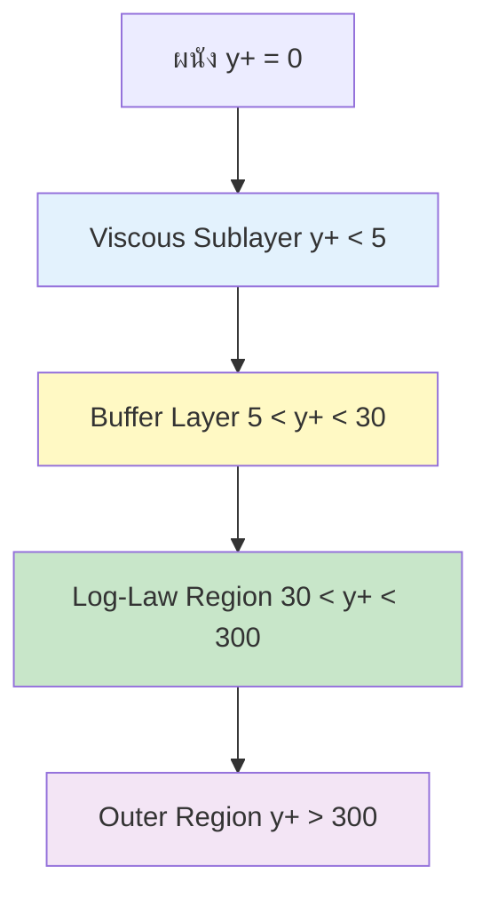
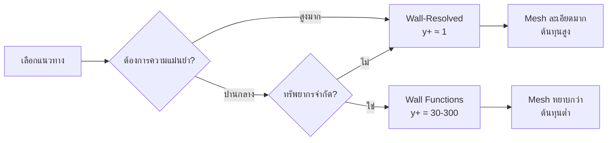
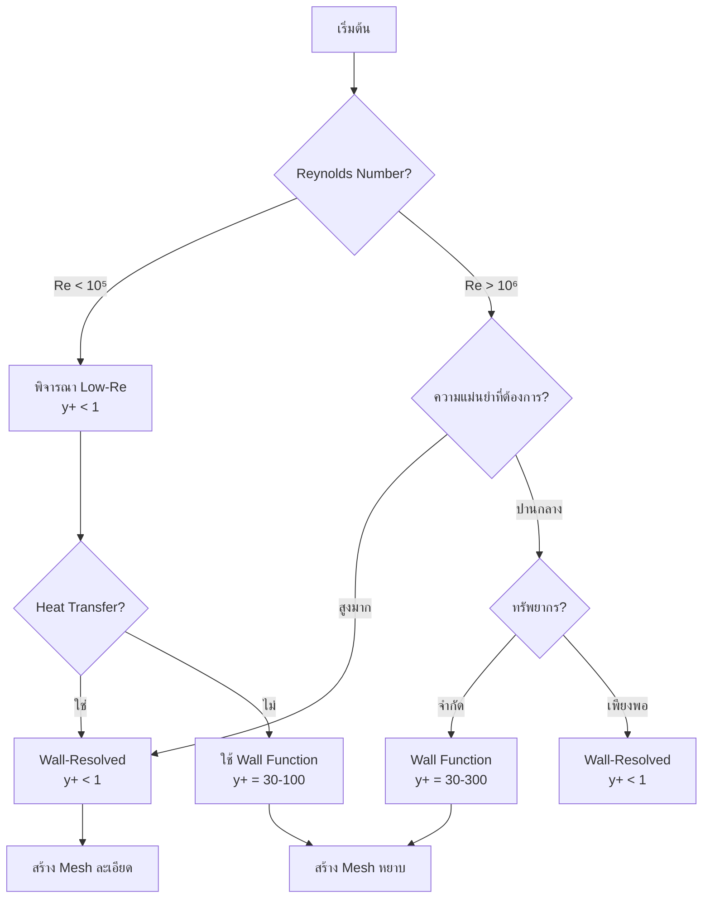

# การจัดการผนัง (Wall Treatment) และ Wall Functions

ความถูกต้องของการจำลองการไหลที่ติดผนัง (Wall-bounded flows) ขึ้นอยู่กับการแก้ปัญหาในชั้น Boundary Layer ซึ่งมีความชันของความเร็วสูงมาก การจัดการผนังที่เหมาะสมเป็นสิ่งสำคัญอย่างยิ่งสำหรับการทำนายค่าความเค้นเฉือน (shear stress) การแยกตัวของไหล (flow separation) และอัตราการถ่ายเทความร้อน (heat transfer) ที่ถูกต้อง

---

## 📐 1. โครงสร้างชั้นขอบเขต (Boundary Layer Structure)

### 1.1 โครงสร้างเชิงกายภาพ

พฤติกรรมการไหลใกล้ผนังในการไหลแบบปั่นป่วนถูกแบ่งออกเป็นสามบริเวณหลักตามค่าระยะห่างไร้มิติ **$y^+$**:

$$y^+ = \frac{y u_\tau}{\nu} = \frac{y \sqrt{\tau_w/\rho}}{\nu}$$

**โดยที่:**
- $y$ = ระยะห่างจากผนัง
- $u_\tau = \sqrt{\tau_w/\rho}$ = ความเร็วเฉือน (friction velocity)
- $\nu$ = ความหนืดจลน์ (kinematic viscosity)
- $\tau_w$ = ความเค้นเฉือนที่ผนัง (wall shear stress)
- $\rho$ = ความหนาแน่น

| ช่วง $y^+$ | บริเวณ | พฤติกรรม | โปรไฟล์ความเร็ว |
|------------|----------|-----------|------------------|
| **$y^+ < 5$** | **Viscous Sublayer** | แรงหนืดครอบงำ, การถ่ายโอนโมเมนตัมเป็นเชิงเส้น | $u^+ = y^+$ |
| **$5 < y^+ < 30$** | **Buffer Layer** | บริเวณเปลี่ยนผ่านที่ซับซ้อน, ทั้งแรงหนืดและความปั่นป่วนสำคัญ | สูตรผสม/เชิงประจักษ์ |
| **$30 < y^+ < 300$** | **Log-Law Region** | ความปั่นป่วนครอบงำ, การถ่ายโอนโมเมนตัมโดย turbulent eddies | $u^+ = \frac{1}{\kappa} \ln(y^+) + B$ |

**ค่าคงที่ที่สำคัญ:**
- $\kappa \approx 0.41$ = ค่าคงที่ von Kármán
- $B \approx 5.0-5.5$ = ค่าคงที่ intercept สำหรับผนังเรียบ (smooth walls)


> **Figure 1:** โครงสร้างของชั้นขอบเขตความปั่นป่วน (Turbulent Boundary Layer) แบ่งตามค่าระยะห่างไร้มิติจากผนัง (y+) ซึ่งแสดงให้เห็นถึงบริเวณย่อยที่มีลักษณะทางฟิสิกส์แตกต่างกัน ตั้งแต่ชั้นที่แรงหนืดครอบงำ (Viscous Sublayer) ไปจนถึงบริเวณที่เป็นไปตามกฎลอการิทึม (Log-Law Region)

### 1.2 กฎ Law of the Wall

**โปรไฟล์ความเร็วแบบไร้มิติ:**

$$u^+ = \begin{cases}
y^+ & \text{สำหรับ } y^+ < 5 \quad \text{(Viscous sublayer)} \\[8pt]
\frac{1}{\kappa} \ln(y^+) + B & \text{สำหรับ } y^+ > 30 \quad \text{(Log-law region)}
\end{cases}$$

**โดยที่:**
- $u^+ = \frac{u}{u_\tau}$ = ความเร็วไร้มิติ
- ความเร็วเฉือน: $u_\tau = \sqrt{\frac{\tau_w}{\rho}}$

---

## 🛠️ 2. แนวทางการจัดการผนังใน OpenFOAM

OpenFOAM นำเสนอสองแนวทางหลักในการจัดการ Mesh ใกล้ผนัง:

### 2.1 Wall-Resolved Approach (Low-Re Approach)

**แนวคิดพื้นฐาน:** แก้สมการถึงผนังโดยตรงโดยไม่ใช้ฟังก์ชันผนัง

| คุณลักษณะ | รายละเอียด |
|-----------|------------|
| **เป้าหมาย** | แก้ Navier-Stokes ถึงผนังโดยตรง |
| **ความละเอียด Mesh** | ต้องมี $y^+ \approx 1$ (มีเซลล์อย่างน้อย 10-15 ชั้นในชั้นขอบเขต) |
| **ข้อดี** | แม่นยำสูงสุดสำหรับการแยกตัวของไหลและความร้อน, ไม่มีข้อสมมติฐานเชิงโมเดล |
| **ข้อเสีย** | ต้นทุนการคำนวณสูงมาก, ต้องการ Mesh จำนวนมาก |
| **การใช้งาน** | LES, DNS, การวิเคราะห์ heat transfer ที่แม่นยำ |

**ข้อกำหนด Mesh:**
```cpp
Δx+ ≈ 40-60   // ทิศทางกระแส (streamwise)
Δz+ ≈ 15-20   // ทิศทางขวางกระแส (spanwise)
Δy+ ≈ 1       // ทิศทางตั้งฉากผนัง (wall-normal)
```

### 2.2 Wall Functions Approach (High-Re Approach)

**แนวคิดพื้นฐาน:** ใช้สูตรทางคณิตศาสตร์ประมาณพฤติกรรมในชั้นขอบเขตแทนการสร้าง Mesh ละเอียด

| คุณลักษณะ | รายละเอียด |
|-----------|------------|
| **เป้าหมาย** | ใช้กฎ log-law เชื่อมบริเวณใกล้ผนังกับบริเวณหลัก |
| **ความละเอียด Mesh** | รักษาค่า $y^+$ ให้อยู่ในช่วง **30-300** |
| **ข้อดี** | ประหยัดทรัพยากรอย่างมาก, เหมาะสำหรับงานอุตสาหกรรมขนาดใหญ่ |
| **ข้อเสีย** | อาศัยสมมติฐานการไหลสมดุล, ความแม่นยำต่ำในบริเวณแยกตัว |
| **การใช้งาน** | งานวิศวกรรมทั่วไป, อุตสาหกรรม, การไหลภายใน |

### 2.3 เปรียบเทียบแนวทางทั้งสอง



| ปัจจัย | Wall-Resolved | Wall Functions |
|---------|---------------|---------------|
| **ความแม่นยำใกล้ผนัง** | สูงสุด | ปานกลาง |
| **จำนวนเซลล์** | 10-100x มากกว่า | ประหยัด |
| **เวลาคำนวณ** | ช้ามาก | เร็ว |
| **ความท้าทายการ Mesh** | สูงมาก | ปานกลาง |
| **การทำนายการแยกตัว** | ยอดเยี่ยม | ดี-ปานกลาง |

---

## 💻 3. การนำไปใช้งาน (OpenFOAM Implementation)

### 3.1 Wall Functions สำหรับ k-ε Model

#### สำหรับความหนืดไหลวน (`0/nut`):

```cpp
dimensions      [0 2 -1 0 0 0 0];
internalField   uniform 0;

boundaryField
{
    wall
    {
        type            nutkWallFunction;
        value           uniform 0;
    }

    inlet
    {
        type            calculated;
        value           uniform 0;
    }

    outlet
    {
        type            zeroGradient;
    }
}
```

#### สำหรับพลังงานจลน์ปั่นป่วน (`0/k`):

```cpp
dimensions      [0 2 -2 0 0 0 0];
internalField   uniform 0.01;

boundaryField
{
    wall
    {
        type            kqRWallFunction;
        value           uniform 0;
    }

    inlet
    {
        type            fixedValue;
        value           uniform 0.01;
    }

    outlet
    {
        type            zeroGradient;
    }
}
```

#### สำหรับอัตราการสลายตัว (`0/epsilon`):

```cpp
dimensions      [0 2 -3 0 0 0 0];
internalField   uniform 0.001;

boundaryField
{
    wall
    {
        type            epsilonWallFunction;
        value           uniform 0.01;
    }

    inlet
    {
        type            fixedValue;
        value           uniform 0.01;
    }

    outlet
    {
        type            zeroGradient;
    }
}
```

### 3.2 Wall Functions สำหรับ k-ω SST Model

#### สำหรับอัตราการสลายตัวจำเพาะ (`0/omega`):

```cpp
dimensions      [0 0 -1 0 0 0 0];
internalField   uniform 0.1;

boundaryField
{
    wall
    {
        type            omegaWallFunction;
        value           uniform 0;
    }

    inlet
    {
        type            fixedValue;
        value           uniform 0.1;
    }

    outlet
    {
        type            zeroGradient;
    }
}
```

### 3.3 Enhanced Wall Treatment

สำหรับความต้องการความแม่นยำสูงใกล้ผนัง:

```cpp
// constant/turbulenceProperties
RAS
{
    RASModel        kOmegaSST;
    turbulence      on;

    wallFunction    on;

    kOmegaSSTCoeffs
    {
        // ... coefficients ...
    }

    // Enhanced wall treatment
    nutWallFunction
    {
        type            nutUSpaldingWallFunction;
        Cmu             0.09;
        kappa           0.41;
        E               9.8;
    }
}
```

> [!TIP] **เคล็ดลับ:** Spalding's law ให้ความแม่นยำสูงกว่า log-law มาตรฐานสำหรับทุกช่วง $y^+$ โดยเฉพาะในบริเวณ buffer layer

---

## 🔍 4. การตรวจสอบคุณภาพ (Verification)

### 4.1 การคำนวณค่า $y^+$

**วิธีที่ 1: ใช้ postProcess utility**

```bash
# รันคำสั่งใน terminal หลังจากการจำลองเสร็จสิ้น
postProcess -func yPlus
```

**วิธีที่ 2: เพิ่มใน controlDict**

```cpp
// system/controlDict
functions
{
    yPlus
    {
        type            yPlus;
        functionObjectLibs ("libfieldFunctionObjects.so");
        enabled         true;
        writeControl    timeStep;
        writeInterval   1;
    }
}
```

ค่าที่ได้จะถูกเขียนลงในโฟลเดอร์เวลา (เช่น `100/yPlus`) เพื่อให้นำไปแสดงผลใน ParaView

### 4.2 การตรวจสอบคุณภาพ Mesh

```bash
# ตรวจสอบคุณภาพ Mesh ทั่วไป
checkMesh

# ตรวจสอบค่า y+ พร้อมสถิติ
postProcess -func "yPlus" -latestTime
```

**เกณฑ์คุณภาพ Mesh สำหรับการไหลปั่นป่วน:**

| คุณสมบัติคุณภาพ | ค่าที่ต้องการ | ค่าที่แนะนำ |
|------------------|------------------|----------------|
| Max non-orthogonality | < 70° | < 50° |
| Max skewness | < 0.85 | < 0.5 |
| Max aspect ratio | < 1000 | < 500 (boundary layer) |
| Min volume | > 0 | > 0 |
| Max expansion ratio | < 1.3 | < 1.2 |

### 4.3 การวิเคราะห์ผลลัพธ์

ใน ParaView:

```python
# Python script สำหรับตรวจสอบ y+
from paraview.simple import *

# Load data
yPlus = OpenDataFile('100/yPlus.vtk')

# แสดง contour ของ y+
Contour1 = Contour(Input=yPlus)
Contour1.ContourBy = ['POINTS', 'yPlus']
Contour1.Isosurfaces = [1.0, 5.0, 30.0, 300.0]

# ตรวจสอบสถิติ
yPlusStats = Calculator(Input=yPlus)
yPlusStats.ResultArrayName = 'yPlus_stats'
```

> [!WARNING] **คำเตือน:** หากค่า $y^+$ ไม่สอดคล้องกับแนวทางที่เลือก ผลลัพธ์อาจไม่แม่นยำ

---

## 📊 5. แนวทางการตัดสินใจ

### 5.1 Decision Matrix

| การใช้งาน | Wall Function | Wall-Resolved | คำแนะนำ |
|-------------|---------------|---------------|-----------|
| การไหลในท่อภายใน | ✓ | ✗ | Wall Function |
| แอร์ฟอยล์อากาศพลศาสตร์ | ✗ | ✓ | Wall-Resolved |
| การระบายอากาศในห้อง | ✓ | ✗ | Wall Function |
| การระบายความร้อนอุปกรณ์อิเล็กทรอนิกส์ | ✗ | ✓ | Wall-Resolved |
| รถยนต์/ยานพาหนะ | ✓ | ~ | เริ่มด้วย Wall Function |
| พัดลม/กังหัน | ~ | ✓ | ขึ้นกับความซับซ้อน |
| โรงปฏิบัติการเคมี | ✓ | ✗ | Wall Function |

### 5.2 ขั้นตอนการเลือกแนวทาง



**กฎพื้นฐาน:**

**ใช้ Wall Functions เมื่อ:**
- $Re > 10^6$ (High Reynolds number)
- ความสนใจหลักอยู่ที่คุณสมบัติการไหลส่วนรวม
- ทรัพยากรการคำนวณจำกัด
- การไหลที่ขับเคลื่อนด้วยความดันที่มีความชันความดันน้อย

**ใช้ Wall-Resolved เมื่อ:**
- ต้องการการทำนายการถ่ายเทความร้อนที่แม่นยำ
- การไหลที่แยกตัวหรือความชันความดันสูง
- อัตราเรย์โนลด์สต่ำ ($Re < 10^5$)
- ปรากฏการณ์การเปลี่ยนผ่านมีความสำคัญ

---

## 🧪 6. ปัญหาและการแก้ไข

### 6.1 ปัญหาการลู่เข้า (Convergence Issues)

**อาการ:**
- Residuals ของสมการความปั่นป่วนไม่ลดลง
- ค่า $k$, $\epsilon$, $\omega$ สั่นหรือเพิ่มขึ้น
- การคำนวณ diverge

**วิธีแก้ไข:**

```cpp
// system/fvSolution
relaxationFactors
{
    equations
    {
        k               0.5;    // Reduced from 0.7-0.8
        epsilon         0.4;    // Reduced from 0.6-0.7
        omega           0.5;    // For k-omega models
    }
}
```

| ตัวแปร | ช่วงค่าปกติ | ค่าที่แนะนำสำหรับการแก้ไข |
|---------|-------------|----------------------|
| $k$ | 0.5-0.8 | 0.4-0.6 |
| $\varepsilon$ | 0.4-0.7 | 0.3-0.5 |
| $\omega$ | 0.5-0.7 | 0.4-0.6 |

### 6.2 ปัญหา $y^+$ นอกช่วงที่เหมาะสม

**อาการ:**
- $y^+ < 30$ เมื่อใช้ Wall Functions
- $y^+ > 300$ ทั่วทั้งผนัง
- $y^+$ ไม่สม่ำเสมอ

**วิธีแก้ไข:**

**สำหรับ $y^+$ ต่ำเกินไป:**
```cpp
// ใช้ wall function ที่เหมาะสม
wall
{
    type            nutLowReWallFunction;  // สำหรับ y+ < 30
    value           uniform 0;
}
```

**สำหรับ $y^+$ สูงเกินไป:**
- ปรับปรุง Mesh refinement ใกล้ผนัง
- ใช้ expansion ratio ที่น้อยกว่า (1.1-1.2)
- เพิ่มจำนวนชั้นใน boundary layer

### 6.3 การตรวจสอบค่าติดลบ

```cpp
// constant/turbulenceProperties
RAS
{
    RASModel        kEpsilon;
    turbulence      on;

    // Minimum bounds
    kMin            1e-6;
    epsilonMin      1e-8;
    omegaMin        1e-8;
    nutMin          1e-10;
}
```

---

## 📖 7. ตัวอย่างการใช้งาน

### 7.1 การคำนวณความสูงเซลล์แรก

**สูตรทั่วไป:**
$$\Delta y = \frac{y^+ \cdot \nu}{u_\tau}$$

**ความเร็วเฉือนโดยประมาณ:**
$$u_\tau \approx U_\infty \sqrt{\frac{C_f}{2}}$$

**สัมประสิทธิ์แรงเสียดทานโดยประมาณ (สำหรับท่อ):**
$$C_f \approx 0.079 \cdot Re^{-0.25}$$

**ตัวอย่างการคำนวณ:**

```python
import numpy as np

# Input parameters
U_inf = 10.0          # Free stream velocity (m/s)
nu = 1.5e-5           # Kinematic viscosity (m²/s)
L = 1.0               # Characteristic length (m)
Re = U_inf * L / nu   # Reynolds number
y_plus_target = 50    # Target y+

# Calculate skin friction coefficient
Cf = 0.079 * Re**(-0.25)

# Calculate friction velocity
u_tau = U_inf * np.sqrt(Cf / 2)

# Calculate first cell height
delta_y = y_plus_target * nu / u_tau

print(f"First cell height: {delta_y*1e6:.2f} μm")
print(f"Required expansion ratio for 20 layers: {(1 + 0.5/delta_y)**(1/20):.3f}")
```

### 7.2 การสร้าง Boundary Layer Mesh ด้วย blockMesh

```cpp
// system/blockMeshDict
convertToMeters 1;

vertices
(
    (0 0 0)                    // 0
    (2.0 0 0)                  // 1
    (2.0 1.0 0)                // 2
    (0 1.0 0)                  // 3
    (0 0 0.314)                // 4
    (2.0 0 0.314)              // 5
    (2.0 1.0 0.314)            // 6
    (0 1.0 0.314)              // 7
);

blocks
(
    hex (0 1 2 3 4 5 6 7) (200 100 1)
);

edges
(
    // ใช้ spline สำหรับการกระจายตัวของจุดใกล้ผนัง
    spline 3 7
    (
        (0 1.0 0)          // ผนังล่าง
        (0 1.0 0.0001)     // จุดแรกห่างจากผนัง
        (0 1.0 0.0002)
        ...
        (0 1.0 0.314)      // ผนังบน
    )
);

boundary
(
    walls
    {
        type wall;
        faces
        (
            (3 7 6 2)    // ผนังด้านบน
            (4 5 1 0)    // ผนังด้านล่าง
        );
    }

    inlet
    {
        type fixedValue;
        faces ((0 4 7 3));
    }

    outlet
    {
        type zeroGradient;
        faces ((2 6 5 1));
    }

    empty
    {
        type empty;
        faces ((0 1 5 4) (1 2 6 5) (2 3 7 6) (3 0 4 7));
    }
);
```

---

## 🎯 8. สรุป

การจัดการผนังที่เหมาะสมเป็นปัจจัยสำคัญในการรับประกันความแม่นยำของการจำลอง CFD การเลือกระหว่าง Wall Functions และ Wall-Resolved approach ขึ้นอยู่กับ:

1. **Reynolds Number** - สูง (>10⁶) ใช้ Wall Functions, ต่ำ (<10⁵) พิจารณา Wall-Resolved
2. **ความแม่นยำที่ต้องการ** - Heat transfer/การแยกตัวต้องการความละเอียดสูง
3. **ทรัพยากรการคำนวณ** - จำกัดใช้ Wall Functions, เพียงพอใช้ Wall-Resolved
4. **ชนิดของการไหล** - Internal flow ใช้ Wall Functions, External/complex flow ใช้ Wall-Resolved

**ข้อควรพิจารณาหลัก:**
- ✅ ตรวจสอบค่า $y^+$ หลังการจำลองเสมอ
- ✅ ใช้ wall function ที่เหมาะสมกับ turbulence model
- ✅ สร้าง mesh ที่มีคุณภาพสูงใกล้ผนัง
- ✅ ตรวจสอบความเสถียรและการลู่เข้าของการคำนวณ

---

**หัวข้อถัดไป**: [พื้นฐาน Large Eddy Simulation (LES)](./04_LES_Fundamentals.md)
