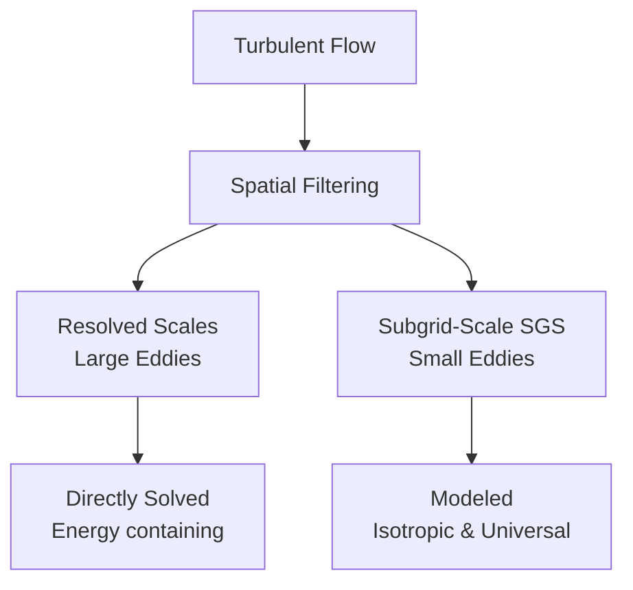
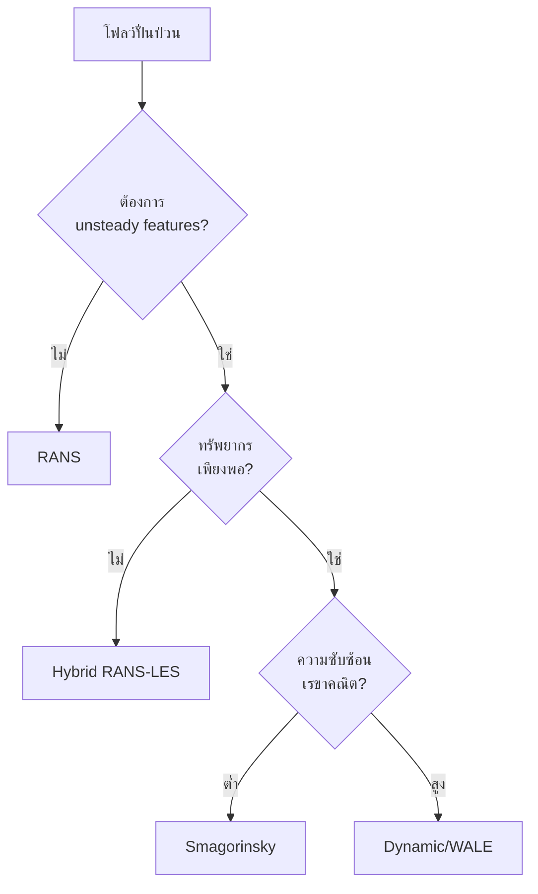

# พื้นฐาน Large Eddy Simulation (LES)

## 📋 ภาพรวม

**Large Eddy Simulation (LES)** เป็นเทคนิคการจำลองความปั่นป่วนที่อยู่ระหว่าง RANS (Reynolds-Averaged Navier-Stokes) ซึ่งหาค่าเฉลี่ยทั้งหมด และ DNS (Direct Numerical Simulation) ซึ่งแก้ปัญหาทุกสเกล โดย LES แก้ปัญหาโครงสร้างความปั่นป่วนขนาดใหญ่โดยตรงและสร้างแบบจำลองเฉพาะสเกลเล็ก

---

## 🎯 วัตถุประสงค์การเรียนรู้

เมื่อสิ้นสุดบทนี้ ผู้เรียนควรสามารถ:

1. **เข้าใจหลักการพื้นฐานของ LES** รวมถึงการกรองเชิงพื้นที่ (spatial filtering) และแนวคิด subgrid-scale (SGS)
2. **อธิบายสมการ LES** และความแตกต่างจากสมการ RANS
3. **เปรียบเทียบแบบจำลอง SGS** ที่สำคัญ เช่น Smagorinsky, Dynamic Smagorinsky, และ WALE
4. **ตั้งค่า LES ใน OpenFOAM** อย่างถูกต้อง
5. **เข้าใจข้อกำหนด Mesh** และข้อจำกัดทรัพยากรสำหรับ LES

---

## 📚 ทฤษฎีพื้นฐานของ LES

### หลักการแยกสเกล (Scale Separation)

LES ใช้แนวคิดการ **กรอง (filtering)** เพื่อแยกความปั่นป่วนออกเป็นสองส่วน:


> **Figure 1:** แนวคิดการแยกสเกลใน Large Eddy Simulation (LES) ซึ่งใช้กระบวนการกรองเชิงพื้นที่ (Spatial Filtering) เพื่อแบ่งโครงสร้างความปั่นป่วนออกเป็นสเกลใหญ่ (Resolved Scales) ที่แก้ปัญหาโดยตรง และสเกลเล็ก (Subgrid-Scale) ที่ต้องใช้แบบจำลองทางสถิติในการประมาณค่า

> [!INFO] **ความสำคัญของการแยกสเกล**
> LES แก้สมการการไหลสำหรับ **large eddies** ซึ่งเป็นโครงสร้างที่กักเก็บพลังงานและขับเคลื่อนพลวัตของโฟลว์ ในขณะที่ **small eddies** ถูกสร้างแบบจำลองด้วยแบบจำลอง SGS เนื่องจากมีพฤติกรรมเป็นสากล (universal) มากกว่า

---

## 📐 การกรองเชิงพื้นที่ (Spatial Filtering)

### นิยามทางคณิตศาสตร์

การกรองเชิงพื้นที่ดำเนินการผ่านตัวกรอง (filter) $G$:

$$
\bar{\phi}(\mathbf{x}, t) = \int_{\Omega} \phi(\mathbf{x}', t) G(\mathbf{x}, \mathbf{x}'; \Delta) \mathrm{d}\mathbf{x}'
$$

โดยที่:
- $\bar{\phi}$ = ปริมาณที่ถูกกรอง (filtered quantity)
- $\phi$ = ปริมาณต้นฉบับ (original quantity)
- $G$ = ฟังก์ชันตัวกรอง (filter function)
- $\Delta$ = ความกว้างของตัวกรอง (filter width)

### ประเภทของตัวกรอง

| ตัวกรอง | นิยาม | คุณสมบัติ | การใช้งาน |
|-----------|--------|------------|-------------|
| **Top-hat** | $G = \begin{cases} 1/\Delta^3 & \text{if } |\mathbf{x}-\mathbf{x}'| < \Delta/2 \\ 0 & \text{otherwise} \end{cases}$ | การกรองแบบสม่ำเสมอ | Mesh-based filtering |
| **Gaussian** | $G = \left(\frac{6}{\pi \Delta^2}\right)^{3/2} \exp\left(-\frac{6|\mathbf{x}-\mathbf{x}'|^2}{\Delta^2}\right)$ | ความราบรื่นสูง | Spectral methods |
| **Spectral cut-off** | Defined in Fourier space | การแยกความถี่ชัดเจน | Spectral DNS/LES |

### ความกว้างของตัวกรอง (Filter Width)

ใน OpenFOAM ความกว้างของตัวกรองมักสัมพันธ์กับขนาด Mesh:

$$
\Delta \approx \sqrt[3]{V_{cell}} = h
$$

โดย $V_{cell}$ คือปริมาตรของเซลล์ และ $h$ คือขนาดลักษณะเฉพาะของเซลล์

---

## 🔢 สมการควบคุม LES

### การกรองสมการ Navier-Stokes

เมื่อใช้การกรองกับสมการ Navier-Stokes แบบอัดตัวไม่ได้ (incompressible):

$$
\frac{\partial \bar{u}_i}{\partial t} + \frac{\partial}{\partial x_j}(\bar{u}_i \bar{u}_j) = -\frac{1}{\rho}\frac{\partial \bar{p}}{\partial x_i} + \nu \frac{\partial^2 \bar{u}_i}{\partial x_j^2} - \frac{\partial \tau_{ij}^{SGS}}{\partial x_j}
$$

พร้อมกับสมการต่อเนื่อง:
$$
\frac{\partial \bar{u}_i}{\partial x_i} = 0
$$

### เทนเซอร์ความเค้น Subgrid-Scale

เทอมที่ไม่ทราบค่าคือ **SGS stress tensor**:

$$
\tau_{ij}^{SGS} = \overline{u_i u_j} - \bar{u}_i \bar{u}_j
$$

ซึ่งแสดงถึงผลกระทบของสเกลเล็กที่ถูกกรองออกต่อสเกลที่ถูกแก้ปัญหา

> [!WARNING] **ความท้าทายในการปิดสมการ (Closure Problem)**
> $\tau_{ij}^{SGS}$ ไม่สามารถคำนวณได้โดยตรงจากตัวแปรที่ถูกกรอง จำเป็นต้องใช้แบบจำลอง SGS เพื่อประมาณค่านี้

---

## 🧮 แบบจำลอง Subgrid-Scale (SGS Models)

### สมมติฐานพื้นฐาน

แบบจำลอง SGS ส่วนใหญ่อิงตาม **สมมติฐานความหนืดแบบ Eddy (Eddy Viscosity Hypothesis)**:

$$
\tau_{ij}^{SGS} - \frac{1}{3}\tau_{kk}^{SGS}\delta_{ij} = -2 \nu_{SGS} \bar{S}_{ij}
$$

โดยที่:
- $\nu_{SGS}$ = ความหนืด SGS (subgrid-scale viscosity)
- $\bar{S}_{ij} = \frac{1}{2}\left(\frac{\partial \bar{u}_i}{\partial x_j} + \frac{\partial \bar{u}_j}{\partial x_i}\right)$ = อัตราการเฉือนที่ถูกกรอง

### เทนเซอร์อัตราการเฉือน

$$
|\bar{S}| = \sqrt{2\bar{S}_{ij}\bar{S}_{ij}}
$$

---

## 🔧 แบบจำลอง SGS หลักใน OpenFOAM

### 1. Smagorinsky Model (Standard)

เป็นแบบจำลอง SGS ที่เรียบง่ายที่สุดและใช้กันอย่างแพร่หลาย

$$
\nu_{SGS} = (C_s \Delta)^2 |\bar{S}|
$$

**พารามิเตอร์:**
- $C_s$ = ค่าคงที่ Smagorinsky (โดยทั่วไป $C_s \approx 0.1 - 0.2$)
- $\Delta$ = ความกว้างของตัวกรอง
- $|\bar{S}|$ = ขนาดของเทนเซอร์อัตราการเฉือน

#### ข้อดีและข้อเสีย

| ข้อดี | ข้อเสีย |
|--------|----------|
| • การนำไปใช้งานง่าย<br/>• เสถียรทางตัวเลข<br/>• ค่าใช้จ่ายต่ำ | • $C_s$ คงที่ (ไม่ปรับตามโฟลว์)<br/>• การกระจายตัวมากเกินไปในบริเวณที่มีการเฉือนต่ำ<br/>• ไม่เหมาะกับโฟลว์ใกล้ผนัง |

### 2. Dynamic Smagorinsky Model

แบบจำลองที่ปรับค่า $C_s$ โดยอัตโนมัติตามเวลาและตำแหน่ง

$$
C_s(\mathbf{x}, t) = \text{computed from test filter}
$$

**หลักการ:**
1. ใช้ test filter $\hat{\Delta} = 2\Delta$
2. คำนวณค่า $C_s$ ที่ทำให้ Leonard stress เป็นไปตามสมการ
3. ค่า $C_s$ สามารถเป็นลบได้ (backscatter)

#### ข้อดีและข้อเสีย

| ข้อดี | ข้อเสีย |
|--------|----------|
| • ปรับตัวตามสภาพโฟลว์<br/>• ความแม่นยำดีกว่า<br/>• ไม่ต้องระบุ $C_s$ | • อาจไม่เสถียร<br/>• ต้องการ averaging<br/>• ค่าใช้จ่ายสูงกว่า |

### 3. WALE (Wall-Adapting Local Eddy-viscosity)

แบบจำลองที่ถูกออกแบบมาเพื่อให้ $\nu_{SGS} \rightarrow 0$ ในบริเวณใกล้ผนังโดยอัตโนมัติ

$$
\nu_{SGS} = (C_w \Delta)^2 \frac{(S_{ij}^{d}S_{ij}^{d})^{3/2}}{(\bar{S}_{ij}\bar{S}_{ij})^{5/2} + (S_{ij}^{d}S_{ij}^{d})^{5/4}}
$$

โดยที่:
$$
S_{ij}^{d} = \frac{1}{2}(\bar{g}_{ij}^2 + \bar{g}_{ji}^2) - \frac{1}{3}\delta_{ij}\bar{g}_{kk}^2, \quad \bar{g}_{ij} = \frac{\partial \bar{u}_i}{\partial x_j}
$$

**ค่าคงที่:** $C_w \approx 0.325$

#### ข้อดีและข้อเสีย

| ข้อดี | ข้อเสีย |
|--------|----------|
| • พฤติกรรมใกล้ผนังที่ถูกต้อง<br/>• ไม่ต้องใช้ damping functions<br/>• เหมาะกับ complex geometries | • ซับซ้อนกว่า Smagorinsky<br/>• ต้องการ mesh ที่ดี |

### 4. แบบจำลองอื่นๆ

| แบบจำลอง | คำอธิบาย | การใช้งาน |
|-----------|----------|-------------|
| **One-equation model** | แก้สมการขนส่งสำหรับ $k_{SGS}$ | โฟลว์ที่ซับซ้อน |
| **Deardorff** | แบบจำลองหนึ่งสมการสำหรับ atmospheric flows | Meteorology |
| **Scale-similar** | ใช้ความสัมพันธ์ scale-similar | การวิจัย |

---

## ⚙️ การตั้งค่า LES ใน OpenFOAM

### การกำหนดค่าพื้นฐาน

ไฟล์ `constant/turbulenceProperties`:

```cpp
simulationType LES;

LES
{
    // Select the SGS model
    LESModel        Smagorinsky;

    // Enable turbulence
    turbulence      on;

    // Filter width calculation method
    delta           cubeRootVol;

    // Smagorinsky coefficient
    SmagorinskyCoeffs
    {
        Cs          0.15;
    }
}
```

> **📂 Source:** การตั้งค่าแบบจำลอง Smagorinsky ใน OpenFOAM ใช้โครงสร้าง dictionary ในไฟล์ `constant/turbulenceProperties` เพื่อกำหนดประเภทการจำลอง (LES) และพารามิเตอร์ของแบบจำลอง SGS
>
> **💡 คำอธิบาย:** บล็อกนี้กำหนดการตั้งค่าพื้นฐานสำหรับ LES โดยเลือกใช้แบบจำลอง Smagorinsky ซึ่งเป็นแบบจำลอง SGS ที่เรียบง่ายที่สุด ค่า Cs = 0.15 อยู่ในช่วงมาตรฐาน (0.1-0.2)
>
> **🔑 หลักการสำคัญ:**
> - `LESModel`: ระบุแบบจำลอง SGS (Smagorinsky, dynamicSmagorinsky, WALE, etc.)
> - `delta`: วิธีคำนวณความกว้างตัวกรอง (cubeRootVol, maxDeltaxyz, etc.)
> - `SmagorinskyCoeffs`: พารามิเตอร์เฉพาะสำหรับแบบจำลอง Smagorinsky

### ตัวเลือกการคำนวณ Filter Width

| วิธี | คำอธิบาย | OpenFOAM keyword |
|------|-----------|-----------------|
| **Cube root of volume** | $\Delta = \sqrt[3]{V_{cell}}$ | `cubeRootVol` |
| **Max cell dimension** | $\Delta = \max(\Delta x, \Delta y, \Delta z)$ | `maxDeltaxyz` |
| **Smooth coefficient** | การกรองแบบสม่ำเสมอ | `smoothCoeff` |
| **Grid-based** | อิงตาม gradient | `gridDelta` |

### การตั้งค่า WALE Model

```cpp
LES
{
    // Select WALE model for wall-adapting behavior
    LESModel        WALE;
    turbulence      on;
    delta           cubeRootVol;

    // WALE model coefficient
    WALECoeffs
    {
        Cw          0.325;
    }
}
```

> **📂 Source:** การตั้งค่าแบบจำลอง WALE ใน OpenFOAM ซึ่งถูกออกแบบให้ทำงานได้ดีใกล้ผนังโดยอัตโนมัติ
>
> **💡 คำอธิบาย:** แบบจำลอง WALE ให้ความหนืด SGS ที่เป็นศูนย์ใกล้ผนังโดยอัตโนมัติ ทำให้เหมาะสำหรับ wall-bounded flows โดยไม่ต้องใช้ damping functions
>
> **🔑 หลักการสำคัญ:**
> - `WALE`: เลือกแบบจำลอง WALE ที่เหมาะกับโฟลว์ใกล้ผนัง
> - `Cw = 0.325`: ค่าสัมประสิทธิ์มาตรฐานสำหรับแบบจำลอง WALE

### การตั้งค่า Dynamic Model

```cpp
LES
{
    // Dynamic model computes Cs automatically
    LESModel        dynamicSmagorinsky;
    turbulence      on;
    delta           cubeRootVol;

    // No need to specify Cs - computed dynamically
}
```

> **📂 Source:** การตั้งค่าแบบจำลอง Dynamic Smagorinsky ใน OpenFOAM ซึ่งคำนวณค่าสัมประสิทธิ์ Cs อัตโนมัติตามเวลาและตำแหน่ง
>
> **💡 คำอธิบาย:** แบบจำลอง Dynamic Smagorinsky ใช้ test filtering เพื่อคำนวณค่า Cs แบบ local ทำให้สามารถ capture backscatter และปรับตัวตามสภาพโฟลว์ได้ดีกว่าแบบ standard
>
> **🔑 หลักการสำคัญ:**
> - `dynamicSmagorinsky`: คำนวณ Cs อัตโนมัติโดยไม่ต้องกำหนดค่าคงที่
> - ต้องการ computational cost สูงกว่าแบบ standard
> - อาจมีปัญหาเรื่อง numerical stability ในบางกรณี

---

## 🌐 การกำหนด Boundary Conditions สำหรับ LES

### เงื่อนไข Inlet

#### 1. Fixed Value แบบง่าย

```cpp
U
{
    // Fixed velocity at inlet
    type            fixedValue;
    value           uniform (10 0 0);  // m/s
}

k
{
    // Fixed turbulent kinetic energy
    type            fixedValue;
    value           uniform 0.1;       // m²/s²
}
```

> **📂 Source:** การกำหนด boundary condition แบบ fixed value สำหรับ velocity และ turbulent kinetic energy ที่ inlet ใน OpenFOAM
>
> **💡 คำอธิบาย:** วิธีที่เรียบง่ายที่สุดในการกำหนด inlet condition โดยระบุค่าคงที่สำหรับ velocity และ turbulent kinetic energy
>
> **🔑 หลักการสำคัญ:**
> - `fixedValue`: กำหนดค่าคงที่ที่ boundary
> - เหมาะสำหรับการทดสอบเบื้องต้น แต่ไม่ realistic สำหรับ LES
> - ควรใช้ turbulent inlet conditions สำหรับการจำลองที่แม่นยำ

#### 2. Turbulent Inlet

```cpp
U
{
    // Turbulent inlet with fluctuations
    type            turbulentInlet;
    mean            (10 0 0);
    fluctuation     (0.5 0 0);         // Fluctuation intensity
    referenceField  U;
}

k
{
    // Turbulent kinetic energy from intensity
    type            turbulentIntensityKineticEnergyInlet;
    intensity       0.05;              // 5% intensity
    value           uniform 0.1;
}
```

> **📂 Source:** การกำหนด turbulent inlet boundary condition ใน OpenFOAM ซึ่งสร้างการผันผวนที่ realistic สำหรับ LES
>
> **💡 คำอธิบาย:** สร้าง turbulent fluctuations ที่ inlet โดยระบุค่าเฉลี่ยและความเข้มของการผันผวน ทำให้ได้ turbulent inflow ที่ realistic มากขึ้น
>
> **🔑 หลักการสำคัญ:**
> - `turbulentInlet`: สร้าง velocity fluctuations แบบ stochastic
> - `intensity`: ระดับความรุนแรงของความปั่นป่วน (typical 1-10%)
> - ควรใช้สำหรับ LES simulation ที่ต้องการ realistic inflow

#### 3. Synthetic Eddy Method

```cpp
U
{
    // Synthetic turbulence generation
    type            syntheticTurbulence;
    RField          R;                  // Reynolds stress field
    nEddy           100;
}
```

> **📂 Source:** การกำหนด synthetic turbulence boundary condition ใน OpenFOAM ซึ่งใช้ synthetic eddy method ในการสร้าง turbulent structures
>
> **💡 คำอธิบาย:** Synthetic Eddy Method สร้าง turbulent structures ที่มีสถิติตามที่กำหนด (Reynolds stress) โดยการ superposition ของ eddies สังเคราะห์
>
> **🔑 หลักการสำคัญ:**
> - `syntheticTurbulence`: สร้าง turbulent inflow ที่มี spatial correlations
> - `RField`: ระบุ Reynolds stress tensor ที่ต้องการ
> - `nEddy`: จำนวน eddies ที่ใช้ในการสร้าง synthetic turbulence

### เงื่อนไข Outlet

```cpp
U
{
    // Zero gradient for velocity
    type            zeroGradient;
}

k
{
    // Zero gradient for turbulent kinetic energy
    type            zeroGradient;
}

nut
{
    // InletOutlet for eddy viscosity
    type            inletOutlet;
    inletValue      uniform 0;
    value           uniform 0;
}
```

> **📂 Source:** การกำหนด outlet boundary conditions สำหรับ LES simulation ใน OpenFOAM
>
> **💡 คำอธิบาย:** Outlet conditions สำหรับ LES ใช้ zero gradient สำหรับ velocity และ k ในขณะที่ nut ใช้ inletOutlet เพื่อป้องกัน backflow issues
>
> **🔑 หลักการสำคัญ:**
> - `zeroGradient`: อนุญาตให้ flow ออกจาก domain โดยไม่มีการกระทบ
> - `inletOutlet`: ใช้ zeroGradient เมื่อ flow ออก และ fixedValue เมื่อมี backflow

### เงื่อนไขผนัง

#### Wall-resolved ($y^+ \approx 1$)

```cpp
U
{
    // No-slip condition for velocity
    type            noSlip;
}

k
{
    // Zero turbulent kinetic energy at wall
    type            fixedValue;
    value           uniform 0;
}

nut
{
    // Zero gradient for eddy viscosity
    type            zeroGradient;
}
```

> **📂 Source:** การกำหนด wall boundary conditions สำหรับ wall-resolved LES ใน OpenFOAM
>
> **💡 คำอธิบาย:** Wall-resolved LES ต้องการ mesh resolution สูงมาก ($y^+ \approx 1$) เพื่อแก้ปัญหา viscous sublayer โดยตรง
>
> **🔑 หลักการสำคัญ:**
> - `noSlip`: velocity เป็นศูนย์ที่ผนัง
> - `fixedValue` สำหรับ k: turbulent kinetic energy เป็นศูนย์ที่ผนัง
> - ต้องการ mesh resolution สูงมาก (expensive)

#### Wall-modeled ($y^+ \approx 50-200$)

```cpp
U
{
    // Wall function for velocity
    type            wallFunction;
}

k
{
    // Wall function for turbulent kinetic energy
    type            kqRWallFunction;
    value           uniform 0;
}

nut
{
    // Wall function for eddy viscosity
    type            nutWallFunction;
    value           uniform 0;
}
```

> **📂 Source:** การกำหนด wall function boundary conditions สำหรับ wall-modeled LES ใน OpenFOAM
>
> **💡 คำอธิบาย:** Wall-modeled LES ใช้ wall functions เพื่อลดความละเอียดของ mesh ที่จำเป็นใกล้ผนัง ทำให้คำนวณได้เร็วขึ้น
>
> **🔑 หลักการสำคัญ:**
> - `wallFunction`: ใช้ wall functions เพื่อ model near-wall region
> - `kqRWallFunction`: wall function สำหรับ k, q, หรือ R
> - ลดค่าใช้จ่าย computational อย่างมาก แต่ลดความแม่นยำใกล้ผนัง

---

## 🔬 ข้อกำหนดของ Mesh สำหรับ LES

### ความละเอียดเชิงพื้นที่

#### กฎการสร้าง Mesh พื้นฐาน

LES ต้องการ Mesh ที่ละเอียดพอที่จะจับ **โครงสร้างความปั่นป่วนที่มีพลังงานสูง**:

$$
\Delta \leq \frac{1}{2} L_{integral}
$$

หรือในรูปแบบ inertial range:
$$
\eta_K < \Delta < L_I
$$

โดยที่:
- $\eta_K$ = สเกล Kolmogorov (ความยาวการกระจาย)
- $L_I$ = สเกล integral (ความยาวการบูรณาการ)

#### เกณฑ์ความละเอียด

| ประเภท LES | เป้าหมาย Resolution | ข้อกำหนด Mesh |
|-------------|---------------------|----------------|
| **LES คุณภาพต่ำ** | จับ 60-70% พลังงาน | $\Delta \approx L_I/10$ |
| **LES คุณภาพปานกลาง** | จับ 80% พลังงาน | $\Delta \approx L_I/20$ |
| **LES คุณภาพสูง** | จับ >90% พลังงาน | $\Delta \approx L_I/50$ |

#### ข้อกำหนดใกล้ผนัง

**Wall-resolved LES:**
- $y^+ \approx 1$ สำหรับเซลล์แรก
- 8-12 เซลล์ใน $y^+ < 20$
- Expansion ratio < 1.2

**Wall-modeled LES:**
- $y^+ \approx 50-200$ สำหรับเซลล์แรก
- ใช้ wall functions

### ความละเอียดเชิงเวลา

#### ข้อกำหนด CFL

สำหรับ LES ค่า CFL ต้องต่ำกว่า RANS อย่างมาก:

$$
CFL = \frac{U \Delta t}{\Delta x} < 1
$$

**ค่าแนะนำ:**
- Explicit schemes: $CFL < 0.5$
- Implicit schemes: $CFL < 1$
- สำหรับโฟลว์ที่ซับซ้อน: $CFL < 0.3$

#### ความละเอียดเชิงเวลา

$$
\Delta t < \frac{\Delta}{U} \approx \frac{\Delta x}{U_{max}}
$$

### คุณภาพ Mesh

| พารามิเตอร์ | ค่าที่แนะนำ | ความสำคัญ |
|-----------|----------------|-------------|
| **Non-orthogonality** | < 50° (ideal < 30°) | สูง - กระทบต่อความแม่นยำ |
| **Skewness** | < 0.5 (ideal < 0.3) | สูง - กระทบต่อการลู่เข้า |
| **Aspect ratio** | < 50 (near-wall) < 10 (bulk) | ปานกลาง |
| **Cell quality** | > 0.3 (determinant) | สูง |

---

## 🧪 การตรวจสอบความถูกต้องของ LES

### ตัวชี้วัดการตรวจสอบ

#### 1. Energy Spectrum

ตรวจสอบสเปกตรัมพลังงานจลน์:

$$
E(\kappa) = C_K \varepsilon^{2/3} \kappa^{-5/3}
$$

โดย:
- $\kappa$ = เลขคลื่น (wavenumber)
- $C_K \approx 1.5$ = ค่าคงที่ Kolmogorov
- ช่วง inertial subrange ควรแสดง $\kappa^{-5/3}$ law

#### 2. SGS Resolution

$$
\eta = \frac{\nu_{SGS}}{\nu + \nu_{SGS}}
$$

- $\eta < 0.2$: การแก้ปัญหาที่ดี
- $\eta > 0.5$: ต้องการ Mesh ที่ละเอียดขึ้น

#### 3. Turbulent Statistics

- **Mean velocity:** $\langle \bar{u}_i \rangle$
- **RMS fluctuations:** $u_{i,rms} = \sqrt{\langle \bar{u}_i'^2 \rangle}$
- **Reynolds stresses:** $\langle \bar{u}_i' \bar{u}_j' \rangle$

---

## 📊 การเปรียบเทียบ LES กับ RANS

### ความแตกต่างพื้นฐาน

| ลักษณะ | RANS | LES |
|---------|------|-----|
| **สิ่งที่แก้ปัญหา** | เฉลี่ยเชิงเวลา | Large scales (filtered) |
| **สิ่งที่สร้างแบบจำลอง** | สเกลทั้งหมด | Small scales (SGS) |
| **ข้อกำหนด Mesh** | $10^5 - 10^6$ cells | $10^7 - 10^9$ cells |
| **ข้อกำหนด CPU** | วัน-สัปดาห์ | เดือน-ปี |
| **ความแม่นยำ** | ปานกลาง (mean flow) | สูง (unsteady features) |
| **การใช้งาน** | การออกแบบทางวิศวกรรม | การวิจัย, โฟลว์ที่ซับซ้อน |

### ความต้องการทรัพยากร

$$
\frac{Cost_{LES}}{Cost_{RANS}} \approx \left(\frac{L_I}{\Delta}\right)^3 \times \frac{T_{LES}}{T_{RANS}} \approx 10^2 - 10^4
$$

---

## 🎯 แนวทางการเลือกแบบจำลอง SGS

### กรณีที่เหมาะสม

#### Smagorinsky (Standard)

```cpp
// ✅ Suitable for:
// - Homogeneous shear flow
// - Isotropic turbulence
// - Preliminary analysis
// ❌ Not suitable for:
// - Wall-bounded flows
// - Flows with backscatter
```

> **📂 Source:** แนวทางการเลือกใช้แบบจำลอง Smagorinsky สำหรับการจำลองความปั่นป่วนใน OpenFOAM
>
> **💡 คำอธิบาย:** แบบจำลอง Smagorinsky เหมาะสำหรับโฟลว์ที่ไม่ซับซ้อนและอยู่ห่างจากผนัง แต่ไม่เหมาะกับ wall-bounded flows เนื่องจาก over-dissipation
>
> **🔑 หลักการสำคัญ:**
> - เลือก Smagorinsky เมื่อต้องการความเรียบง่ายและเสถียร
> - หลีกเลี่ยงการใช้สำหรับ flows ใกล้ผนัง
> - เหมาะสำหรับการวิเคราะห์เบื้องต้น

#### Dynamic Smagorinsky

```cpp
// ✅ Suitable for:
// - Complex, varying flows
// - High-accuracy simulations
// - Flows with backscatter
// ❌ Not suitable for:
// - Cases requiring high stability
// - Limited computational resources
```

> **📂 Source:** แนวทางการเลือกใช้แบบจำลอง Dynamic Smagorinsky ซึ่งปรับตัวตามสภาพโฟลว์
>
> **💡 คำอธิบาย:** แบบจำลอง Dynamic Smagorinsky เหมาะสำหรับโฟลว์ที่ซับซ้อนเนื่องจากสามารถปรับค่า Cs ตามเวลาและตำแหน่งได้
>
> **🔑 หลักการสำคัญ:**
> - เลือก Dynamic เมื่อต้องการความแม่นยำสูง
> - ต้องการ computational resources สูงกว่า
> - อาจมีปัญหาเรื่อง numerical stability

#### WALE

```cpp
// ✅ Suitable for:
// - Wall-bounded flows
// - Complex geometries
// - Cases requiring high y+
// - Flows with transition regions
// ❌ Not suitable for:
// - Purely isotropic flows
```

> **📂 Source:** แนวทางการเลือกใช้แบบจำลอง WALE สำหรับ wall-bounded flows ใน OpenFOAM
>
> **💡 คำอธิบาย:** แบบจำลอง WALE ถูกออกแบบมาเพื่อให้ทำงานได้ดีใกล้ผนังโดยอัตโนมัติ ทำให้เหมาะสำหรับ wall-bounded flows
>
> **🔑 หลักการสำคัญ:**
> - เลือก WALE สำหรับ wall-bounded flows
> - เหมาะกับ complex geometries
> - ไม่ต้องการ damping functions

---

## 🔧 การปรับแต่งและการแก้ปัญหา

### ปัญหาทั่วไป

#### 1. Damping มากเกินไป (Over-dissipation)

**อาการ:**
- SGS viscosity สูงเกินไป
- เสียโครงสร้างขนาดเล็ก

**วิธีแก้:**
- ลดค่า $C_s$ หรือใช้ dynamic model
- เพิ่มความละเอียด Mesh
- ใช้ numerical schemes ที่มี dissipation ต่ำ

#### 2. การไม่เสถียร

**อาการ:**
- Residuals ไม่ลู่เข้า
- ค่า $k$ หรือ $\nu_{SGS}$ เพิ่มขึ้นอย่างรวดเร็ว

**วิธีแก้:**
- ลดค่า CFL
- ใช้ under-relaxation (สำหรับ implicit)
- ตรวจสอบ mesh quality
- ตรวจสอบ boundary conditions

#### 3. การลู่เข้าช้า

**อาการ:**
- ใช้เวลานานในการพัฒนาความปั่นป่วน

**วิธีแก้:**
- เริ่มต้นด้วยค่าเริ่มต้นที่สมจริง
- ใช้ synthetic turbulence ที่ inlet
- เพิ่ม perturbation ในบริเวณที่เกี่ยวข้อง

---

## 💻 ตัวอย่างการนำไปใช้

### ตัวอย่าง 1: Channel Flow LES

```cpp
// constant/turbulenceProperties
simulationType LES;

LES
{
    LESModel        Smagorinsky;
    turbulence      on;
    delta           cubeRootVol;

    SmagorinskyCoeffs
    {
        Cs          0.1;
    }
}

// system/fvSchemes
ddtSchemes
{
    // Second-order backward scheme for time accuracy
    default         backward;
}

gradSchemes
{
    // Central differencing for gradients
    default         Gauss linear;
}

divSchemes
{
    default         none;
    // Linear scheme for convection
    div(phi,U)      Gauss linear;
}

laplacianSchemes
{
    // Corrected scheme for diffusion
    default         Gauss linear corrected;
}

// system/fvSolution
solvers
{
    p
    {
        // GAMG solver for pressure
        solver          GAMG;
        tolerance       1e-06;
        relTol          0.01;
    }

    U
    {
        // Smooth solver for velocity
        solver          smoothSolver;
        smoother        GaussSeidel;
        tolerance       1e-05;
        relTol          0.1;
    }
}
```

> **📂 Source:** การตั้งค่า complete LES simulation สำหรับ channel flow ใน OpenFOAM
>
> **💡 คำอธิบาย:** ตัวอย่างนี้แสดงการตั้งค่า LES simulation ที่สมบูรณ์ รวมถึงการเลือก numerical schemes และ solvers ที่เหมาะสม
>
> **🔑 หลักการสำคัญ:**
> - `backward`: Second-order time scheme สำหรับความแม่นยำ
> - `GAMG`: Geometric-algebraic multigrid solver สำหรับ pressure
> - `smoothSolver`: Iterative solver สำหรับ velocity
> - Tolerances ที่เหมาะสมสำหรับ LES

### ตัวอย่าง 2: การติดตาม Statistics

```cpp
// system/controlDict
functions
{
    // Monitoring point statistics
    monitorPoint
    {
        type            sets;
        functionObjectLibs ("libsampling.so");
        enabled         true;
        writeControl    timeStep;
        writeInterval   10;

        sets
        (
            centerline
        );

        fields
        (
            U
            p
            k
            nut
        );
    }

    // Field averaging
    fieldAverage1
    {
        type            fieldAverage;
        functionObjectLibs ("libfieldFunctionObjects.so");
        enabled         true;
        writeControl    writeTime;
        timeStart       5.0;

        fields
        (
            U
            {
                // Calculate mean velocity
                mean            on;
                // Calculate Reynolds stresses
                prime2Mean      on;
                base            time;
            }

            p
            {
                mean            on;
                prime2Mean      on;
                base            time;
            }
        );
    }
}
```

> **📂 Source:** การตั้งค่า function objects สำหรับการเก็บสถิติใน LES simulation ด้วย OpenFOAM
>
> **💡 คำอธิบาย:** Function objects ใช้สำหรับเก็บ turbulent statistics เช่น mean velocity และ Reynolds stresses ซึ่งจำเป็นสำหรับการวิเคราะห์ผลลัพธ์ LES
>
> **🔑 หลักการสำคัญ:**
> - `sets`: 采样 ค่าที่จุดหรือเส้นที่กำหนด
> - `fieldAverage`: คำนวณค่าเฉลี่ยและสถิติระดับสอง
> - `prime2Mean`: คำนวณ Reynolds stresses ($\langle u_i' u_j' \rangle$)
> - `timeStart`: เริ่มสะสมสถิติหลังจาก flow พัฒนาเรียบร้อย

---

## 📚 บทสรุป

### จุดสำคัญที่ควรจำ

1. **หลักการ LES**: แก้ปัญหา large eddies โดยตรง สร้างแบบจำลอง small eddies ด้วย SGS
2. **การกรอง**: แยกสเกลผ่าน spatial filter ด้วยความกว้าง $\Delta$
3. **แบบจำลอง SGS**: Smagorinsky (ง่าย), Dynamic (ปรับตัว), WALE (ใกล้ผนัง)
4. **ข้อกำหนด Mesh**: ต้องละเอียดพอจับ inertial range, $y^+ \approx 1$ (wall-resolved)
5. **CFL**: ต้องต่ำ (< 0.5) สำหรับความแม่นยำ

### เมื่อใดควรใช้ LES


> **Figure 2:** แผนผังการตัดสินใจเลือกใช้แนวทางการจำลองความปั่นป่วน (LES selection logic) โดยพิจารณาจากความต้องการข้อมูลพลวัตที่ไม่คงที่ ทรัพยากรการคำนวณ และความซับซ้อนของรูปทรงเรขาคณิต เพื่อเลือกแบบจำลอง SGS ที่เหมาะสมที่สุด

### เส้นทางการเรียนรู้ต่อ

- **Hybrid RANS-LES**: DES, DDES, IDDES
- **Wall-modeled LES**: ลดค่าใช้จ่ายสำหรับ high-Re flows
- **Advanced SGS**: Scale-similar, mixed models
- **A posteriori analysis**: การประเมินความแม่นยำของ LES

---

**อ้างอิงเพิ่มเติม:**
- Sagaut, P. (2006). *Large Eddy Simulation for Incompressible Flows*. Springer.
- Pope, S.B. (2000). *Turbulent Flows*. Cambridge University Press.
- OpenFOAM User Guide: LES Models