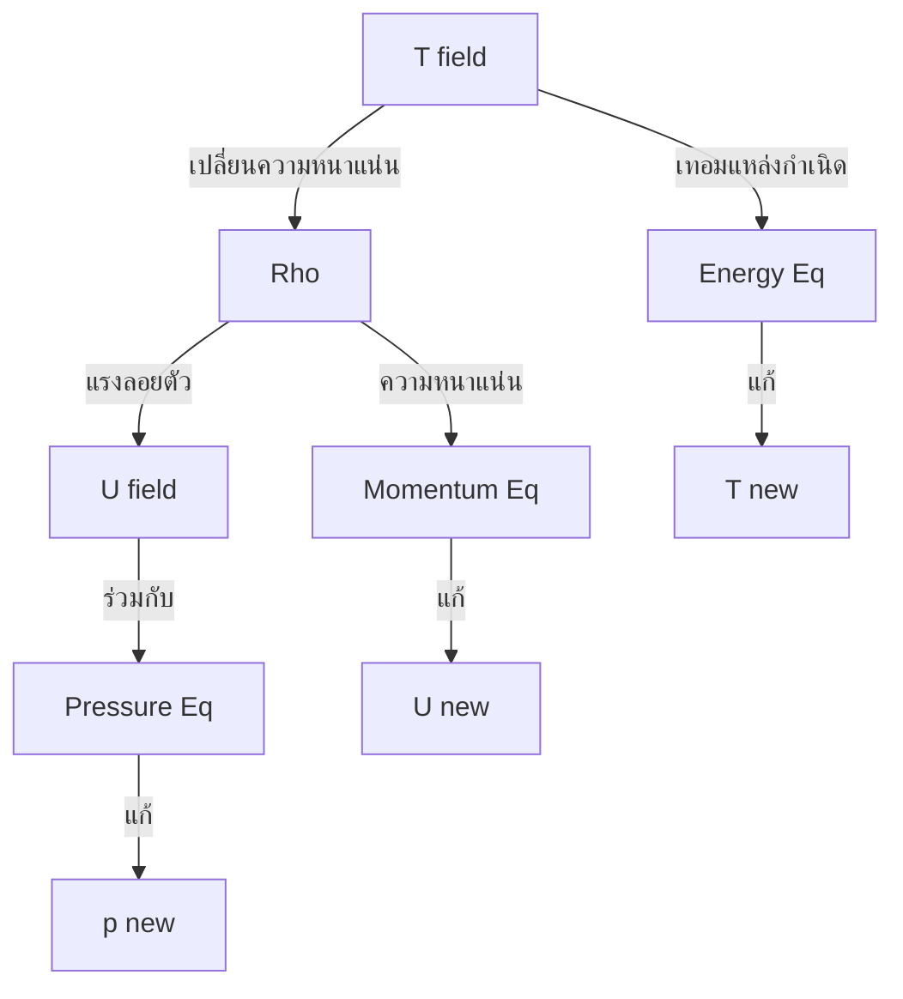

# พื้นฐานสมการพลังงานใน OpenFOAM

## 📖 บทนำ (Introduction)

**สมการการอนุรักษ์พลังงาน** เป็นหัวใจสำคัญของการวิเคราะห์ความร้อน ซึ่งเชื่อมโยงการไหลของของไหลเข้ากับการถ่ายเทพลังงาน โดยพิจารณาสมดุลระหว่างการพาความร้อน การนำความร้อน และแหล่งกำเนิดความร้อนอื่นๆ

### ความสำคัญของสมการพลังงาน

> [!INFO] ทำไมสมการพลังงานจำเป็น?
> สมการพลังงานเป็นเครื่องมือหลักในการพยากรณ์การกระจายตัวของอุณหภูมิ ฟลักซ์ความร้อน และประสิทธิภาพการถ่ายเทความร้อนในระบบทางวิศวกรรม

การถ่ายเทความร้อนใน CFD ครอบคลุม **3 รูปแบบหลัก**:

1. **การนำความร้อน (Conduction)**: การถ่ายเทพลังงานผ่านการปฏิสัมพันธ์ของโมเลกุล
2. **การพาความร้อน (Convection)**: การรวมกันของการนำและการเคลื่อนที่ของของไหล
3. **การแผ่รังสี (Radiation)**: การถ่ายเทพลังงานผ่านคลื่นแม่เหล็กไฟฟ้า

---

## 📐 1. สมการพลังงานเชิงคณิตศาสตร์

### สมการพลังงานสำหรับการไหลแบบอัดได้

สำหรับการจำลองใน OpenFOAM สมการพลังงานถูกเขียนในรูปของเอนทาลปีสัมผัส (Sensible Enthalpy, $h$):

$$\frac{\partial (\rho h)}{\partial t} + \nabla \cdot (\rho \mathbf{u} h) = \nabla \cdot (k \nabla T) + \frac{Dp}{Dt} + \Phi_v + Q$$

**นิยามตัวแปร:**
- $\rho$ = ความหนาแน่นของของไหล (kg/m³)
- $h$ = เอนทาลปีสัมผัส (J/kg)
- $\mathbf{u}$ = เวกเตอร์ความเร็ว (m/s)
- $k$ = สภาพนำความร้อน (W/(m·K))
- $T$ = อุณหภูมิ (K)
- $p$ = ความดัน (Pa)
- $\Phi_v$ = การกระจายตัวเนื่องจากความหนืด (W/m³)
- $Q$ = แหล่งกำเนิดความร้อนภายนอก (W/m³)

**ความหมายของแต่ละเทอม:**
- $\frac{\partial (\rho h)}{\partial t}$: อัตราการเปลี่ยนแปลงพลังงานตามเวลา
- $\nabla \cdot (\rho \mathbf{u} h)$: การขนส่งพลังงานโดยการไหล (Convection)
- $\nabla \cdot (k \nabla T)$: การถ่ายเทความร้อนโดยการนำ (Conduction)
- $\frac{Dp}{Dt} = \frac{\partial p}{\partial t} + \mathbf{u} \cdot \nabla p$: งานที่เกิดจากการเปลี่ยนแปลงความดัน
- $\Phi_v$: การกระจายตัวเนื่องจากความหนืด (Viscous dissipation)

### สมการพลังงานสำหรับการไหลแบบอัดไม่ได้

สำหรับการไหลแบบอัดไม่ได้ (Incompressible Flow) ที่มีคุณสมบัติคงที่ สมการจะลดรูปเหลือรูปแบบอุณหภูมิ:

$$\rho c_p \left( \frac{\partial T}{\partial t} + \mathbf{u} \cdot \nabla T \right) = k \nabla^2 T + Q$$

**นิยามตัวแปรเพิ่มเติม:**
- $c_p$ = ความจุความร้อนจำเพาะที่ความดันคงที่ (J/(kg·K))

---

## 🔥 2. กฎของฟูเรียร์ (Fourier's Law)

กฎของฟูเรียร์อธิบายการถ่ายเทความร้อนแบบนำผ่านวัสดุเนื่องจากความแตกต่างของอุณหภูมิ:

$$\mathbf{q} = -k \nabla T$$

**นิยามตัวแปร:**
- $\mathbf{q}$ = เวกเตอร์ฟลักซ์ความร้อน (W/m²)
- $k$ = สภาพนำความร้อน (W/(m·K))
- $\nabla T$ = ไล่เกรเดียนต์ของอุณหภูมิ

> [!TIP] เครื่องหมายลบ
> เครื่องหมายลบแสดงว่าความร้อนไหลจากบริเวณที่มีอุณหภูมิสูงกว่าไปยังบริเวณที่มีอุณหภูมิต่ำกว่า

### การนำไปใช้ใน OpenFOAM

ความแตกต่างของฟลักซ์ความร้อนจะกลายเป็น:
$$\nabla \cdot \mathbf{q} = \nabla \cdot (k \nabla T)$$

ซึ่งใน OpenFOAM ถูกนำไปใช้ผ่านตัวดำเนินการ Laplacian:

```cpp
// Temperature equation with laplacian operator in OpenFOAM
// สมการอุณหภูมิที่มีการใช้ตัวดำเนินการ Laplacian
fvScalarMatrix TEqn
(
    fvm::ddt(rho, T)      // Unsteady term: ∂(ρT)/∂t
  + fvm::div(phi, T)      // Convection term: ∇·(ρuT)
  - fvm::laplacian(k, T)  // Diffusion term: ∇·(k∇T)
);
TEqn.solve();
```

> **📂 Source:** ตัวอย่างโค้ดนี้แสดงรูปแบบการใช้งานตัวดำเนินการ `fvm::laplacian()` ในการแก้สมการการแพร่ความร้อน ซึ่งเป็นรูปแบบมาตรฐานใน solver ของ OpenFOAM ที่เกี่ยวข้องกับการถ่ายเทความร้อน เช่น `buoyantSimpleFoam`, `buoyantPimpleFoam` และ solver อื่นๆ ที่ใช้ไฟล์ `TEqn.H`
> 
> **คำอธิบาย:**
> - `fvm::ddt(rho, T)`: เทอมอนุพันธ์เชิงเวลา (Unsteady term) สำหรับการเปลี่ยนแปลงของอุณหภูมิตามเวลา
> - `fvm::div(phi, T)`: เทอมการพาความร้อน (Convection term) โดย `phi` คือฟลักซ์มวลสาร
> - `fvm::laplacian(k, T)`: เทอมการนำความร้อน (Diffusion term) ตามกฎของฟูเรียร์
> - การใช้ `fvm` (finite volume method) หมายถึง implicit discretization ซึ่งเหมาะสมสำหรับการแก้สมการ
> 
> **แนวคิดสำคัญ:**
> - การใช้ `fvm::laplacian(k, T)` แทน `fvc::laplacian(k, T)` เพื่อให้ได้ระบบสมการเชิงเส้นที่เหมาะสมกับการแก้โดยตรง
> - ความแตกต่างระหว่าง `fvm` (implicit) และ `fvc` (explicit) มีความสำคัญต่อเสถียรภาพและประสิทธิภาพของการแก้สมการ
> - ตัวดำเนินการเหล่านี้เป็นส่วนหนึ่งของ finite volume library ใน OpenFOAM ที่ออกแบบมาเพื่อการจัดการสมการเชิงอนุพันธ์แบบ partial

---

## 💻 3. การนำไปใช้ใน OpenFOAM

### 3.1 ไฟล์ EEqn.H – สมการเอนทาลปี/พลังงานภายใน

ในระดับซอร์สโค้ด สมการพลังงานถูกประกอบขึ้นโดยใช้ Finite Volume Method (FVM):

```cpp
// Energy equation for enthalpy/internal energy in OpenFOAM
// สมการพลังงานสำหรับเอนทาลปีหรือพลังงานภายในใน OpenFOAM
volScalarField& he = thermo.he();  // Reference to enthalpy or internal energy field

// Construct the energy equation matrix
// สร้างเมทริกซ์สมการพลังงาน
fvScalarMatrix EEqn
(
    fvm::ddt(rho, he)                               // Unsteady term: ∂(ρh)/∂t
  + fvm::div(phi, he)                               // Convection term: ∇·(ρuh)
  + fvc::ddt(rho, K) + fvc::div(phi, K)             // Kinetic energy terms
  + (
        he.name() == "e"
      ? fvc::div(fvc::absolute(phi, rho, U), p/rho) // Pressure work for internal energy
      : -fvc::ddt(p) - fvc::div(phi, p)              // Pressure work for enthalpy
    )
  - fvm::laplacian(turbulence->alphaEff(), he)      // Diffusion term: ∇·(α_eff∇h)
 ==
    reaction->Qdot()      // Heat source from chemical reactions
  + fvOptions(rho, he)    // Additional source terms from fvOptions
);

// Relax and solve the equation
// ผ่อนคลายและแก้สมการ
EEqn.relax();
EEqn.solve();

// Update temperature and other thermodynamic properties
// อัปเดตอุณหภูมิและคุณสมบัติเทอร์โมไดนามิกอื่นๆ
thermo.correct();
```

> **📂 Source:** โครงสร้างของสมการพลังงานนี้ถูกนำมาใช้ใน solver ของ OpenFOAM ที่ทำงานกับ compressible flow และ buoyancy-driven flow เช่น `buoyantSimpleFoam`, `buoyantPimpleFoam` และ `rhoPimpleFoam` ซึ่งใช้ไฟล์ `EEqn.H` ในการแก้สมการเอนทาลปีหรือพลังงานภายใน
> 
> **คำอธิบาย:**
> - `he`: อาจเป็นพลังงานภายใน ($e$) หรือเอนทาลปี ($h$) ขึ้นอยู่กับการเลือกใน `thermophysicalProperties`
> - `K`: พลังงานจลน์ ($K = 0.5|\mathbf{u}|^2$) ซึ่งเพิ่มเข้าไปในสมการพลังงานรวม
> - `alphaEff()`: สัมประสิทธิ์การแพร่ความร้อนที่มีประสิทธิผล ($\alpha_{eff} = \alpha_{molecular} + \alpha_{turbulent}$)
> - การเลือกแบบจำลอง (`e` หรือ `h`) จะส่งผลต่อรูปแบบของเทอมงานความดัน (pressure work)
> 
> **แนวคิดสำคัญ:**
> - สมการพลังงานใน OpenFOAM รองรับทั้งพลังงานภายในและเอนทาลปี ขึ้นอยู่กับการตั้งค่าใน `thermophysicalProperties`
> - เทอมพลังงานจลน์ถูกเพิ่มเข้าไปเพื่อความถูกต้องทางกายภาพสำหรับการไหลแบบอัดได้
> - การใช้ `fvc` (explicit) สำหรับเทอมที่ไม่ได้เป็นส่วนหนึ่งของตัวแปรที่ถูกแก้ (implicit terms)
> - `thermo.correct()` จะอัปเดตค่าอุณหภูมิและคุณสมบัติทางเทอร์โมฟิสิกส์หลังจากแก้สมการพลังงาน

**ตัวแปรที่สำคัญ:**
- `he`: อาจเป็นพลังงานภายใน ($e$) หรือเอนทาลปี ($h$) ขึ้นอยู่กับการเลือกใน `thermophysicalProperties`
- `alphaEff()`: สัมประสิทธิ์การแพร่ความร้อนที่มีประสิทธิผล ($\alpha_{eff} = \alpha_{molecular} + \alpha_{turbulent}$)
- `K`: พลังงานจลน์ ($K = 0.5|\mathbf{u}|^2$)

### 3.2 ไฟล์ TEqn.H – สมการอุณหภูมิ

สำหรับปัญหาที่ไม่ซับซ้อน สามารถแก้สมการโดยตรงสำหรับอุณหภูมิ:

```cpp
// Temperature equation solver for simpler problems
// สมการอุณหภูมิสำหรับปัญหาที่ไม่ซับซ้อน
fvScalarMatrix TEqn
(
    fvm::ddt(rho, T)               // Unsteady term: ∂(ρT)/∂t
  + fvm::div(rhoPhi, T)            // Convection term: ∇·(ρuT)
  - fvm::Sp(contErr, T)            // Continuity correction term
  - fvm::laplacian(turbulence->alphaEff(), T)  // Diffusion term: ∇·(α_eff∇T)
 ==
    fvModels.source(rho, T)        // Source terms from fvModels
);

// Relax and solve the temperature equation
// ผ่อนคลายและแก้สมการอุณหภูมิ
TEqn.relax();
TEqn.solve();
```

> **📂 Source:** รูปแบบสมการอุณหภูมินี้ถูกใช้ใน solver ที่แก้โดยตรงสำหรับอุณหภูมิ เช่น `compressibleInterFoam` และ solver แบบ multiphase อื่นๆ ที่ไม่ต้องการการแปลงระหว่างเอนทาลปีและอุณหภูมิ
> 
> **คำอธิบาย:**
> - `rhoPhi`: ฟลักซ์มวลสารที่ถูกคำนวณจากสมการต่อเนื่อง
> - `contErr`: ความผิดพลาดในสมการต่อเนื่อง (continuity error) ซึ่งใช้ในการแก้ไขความแม่นยำ
> - `alphaEff()`: สัมปราสิทธิ์การแพร่ความร้อนที่มีประสิทธิผล
> - การแก้สมการโดยตรงสำหรับอุณหภูมิช่วยลดภาระการคำนวณเมื่อเทียบกับการแก้สมการเอนทาลปี
> 
> **แนวคิดสำคัญ:**
> - สมการแบบตรง (direct temperature solve) เหมาะสมสำหรับการจำลองที่ไม่ต้องการความแม่นยำสูงในด้านเทอร์โมไดนามิก
> - การใช้ `fvm::Sp(contErr, T)` เป็นเทคนิคในการรักษาความสมดุลของมวลในระบบ
> - ข้อดีของการแก้สมการอุณหภูมิโดยตรงคือความเรียบง่ายและความเร็วในการคำนวณ
> - Solver แบบ multiphase มักใช้รูปแบบนี้เพื่อหลีกเลี่ยงความซับซ้อนของการจัดการคุณสมบัติเทอร์โมฟิสิกส์แบบผสม

**ความสำคัญ:**
- แก้สมการโดยตรงสำหรับอุณหภูมิ ช่วยหลีกเลี่ยงขั้นตอนเพิ่มเติมในการแปลง `he` เป็น `T`
- มักใช้ใน Solver แบบหลายเฟส (multiphase solvers) เช่น `compressibleInterFoam`

### 3.3 ลำดับชั้นของคลาส Thermophysical Models

OpenFOAM จัดระเบียบคลาสเทอร์โมฟิสิกส์ในลำดับชั้นที่ชัดเจน:

```
basicThermo (T, p, he, Cp, Cv, ...)
└── fluidThermo (mu, kappa, ...)
    ├── psiThermo (psi, rho = psi*p)
    │   └── hePsiThermo
    └── rhoThermo (rho field, correctRho)
        └── heRhoThermo
```

| แพ็กเกจ | คลาสพื้นฐาน | ตัวแปรหลัก | การปรับปรุงความหนาแน่น | Solver ที่ใช้ |
|---------|------------|------------------|----------------|-----------------|
| **PSI** | `psiThermo` | ความดัน-อุณหภูมิ ($\psi = 1/(RT)$) | $\rho = \psi p$ | `rhoPimpleFoam`, `sonicFoam` |
| **RHO** | `rhoThermo` | ความหนาแน่น-อุณหภูมิ (การจัดเก็บโดยตรง) | $\rho$ ถูกจัดเก็บ, ปรับปรุงผ่าน EOS | `rhoSimpleFoam`, `buoyantFoam` |

---

## 🌡️ 4. สมการพลังงานสำหรับการไหลแบบอัดไม่ได้

### 4.1 รูปแบบย่อ

สำหรับ Incompressible Flow (ความหนาแน่นคงที่) สมการพลังงานจะลดรูปเหลือ:

$$\rho c_p \left( \frac{\partial T}{\partial t} + \mathbf{u} \cdot \nabla T \right) = k \nabla^2 T + Q$$

หรือในรูปแบบที่มีการแพร่:

$$\frac{\partial T}{\partial t} + \mathbf{u} \cdot \nabla T = \alpha \nabla^2 T + \frac{Q}{\rho c_p}$$

โดยที่ $\alpha = \frac{k}{\rho c_p}$ คือ **ความแพร่ความร้อน (Thermal Diffusivity)**

### 4.2 ผลกระทบจากความปั่นป่วน

ในการไหลแบบปั่นป่วน ความหนืดปั่นป่วน ($\nu_t$) จะช่วยเพิ่มการแพร่ความร้อนผ่าน **Turbulent Prandtl Number** ($Pr_t$):

$$\alpha_{eff} = \alpha_{molecular} + \alpha_{turbulent} = \frac{k}{\rho c_p} + \frac{\nu_t}{Pr_t}$$

```cpp
// Effective thermal diffusivity calculation with turbulence
// การคำนวณสัมประสิทธิ์การแพร่ความร้อนที่มีประสิทธิผลที่มีผลจากความปั่นป่วน
volScalarField alphaEff
(
    turbulence->nu() / Pr   +  // Molecular diffusivity: α_mol = ν/Pr
    turbulence->nut() / Pr_t    // Turbulent diffusivity: α_turb = ν_t/Pr_t
);
```

> **📂 Source:** การคำนวณสัมประสิทธิ์การแพร่ความร้อนที่มีประสิทธิผลนี้เป็นส่วนหนึ่งของการจำลองการไหลแบบปั่นป่วนที่มีการถ่ายเทความร้อน ซึ่งใช้ใน solver เช่น `buoyantSimpleFoam`, `buoyantPimpleFoam` และ solver ที่เกี่ยวข้องกับการถ่ายเทความร้อนในกระแสปั่นป่วน
> 
> **คำอธิบาย:**
> - `turbulence->nu()`: ความหนืดเชิงกล (kinematic viscosity) ของโมเลกุล
> - `turbulence->nut()`: ความหนืดเชิงกลแบบปั่นป่วน (turbulent kinematic viscosity)
> - `Pr`: จำนวน Prandtl ของโมเลกุล (molecular Prandtl number)
> - `Pr_t`: จำนวน Prandtl แบบปั่นป่วน (turbulent Prandtl number)
> - `alphaEff`: สัมประสิทธิ์การแพร่ความร้อนที่มีประสิทธิผลที่รวมทั้งส่วนโมเลกุลและส่วนปั่นป่วน
> 
> **แนวคิดสำคัญ:**
> - ในกระแสปั่นป่วน การแพร่ความร้อนเกิดจากสองส่วน: การแพร่แบบโมเลกุลและการแพร่แบบปั่นป่วน
> - การเพิ่มของการแพร่แบบปั่นป่วนจะช่วยเพิ่มอัตราการถ่ายเทความร้อนอย่างมีนัยสำคัญ
> - ค่า $Pr_t$ ทั่วไปอยู่ระหว่าง 0.85-0.9 สำหรับของไหลส่วนใหญ่
> - การจำลองที่เหมาะสมต้องคำนึงถึงผลของความปั่นป่วนต่อการถ่ายเทความร้อน

**ค่าทั่วไปของ $Pr_t$:**
- อากาศ: $0.85 - 0.9$
- ของไหลอื่น: $0.7 - 0.9$

---

## 📊 5. จำนวนไร้มิติที่สำคัญ (Dimensionless Numbers)

### 5.1 จำนวน Prandtl (Prandtl Number)

จำนวน Prandtl วัดอัตราส่วนของการแพร่โมเมนตัมต่อการแพร่ความร้อน:

$$Pr = \frac{\nu}{\alpha} = \frac{\mu c_p}{k}$$

**ความหมายทางกายภาพ:**
- $Pr < 1$: การแพร่ความร้อนเด่นกว่าการแพร่โมเมนตัม (เช่น โลหะเหลว)
- $Pr \approx 1$: การแพร่โมเมนตัมและความร้อนใกล้เคียงกัน (เช่น อากาศ)
- $Pr > 1$: การแพร่โมเมนตัมเด่นกว่าการแพร่ความร้อน (เช่น น้ำมัน)

| ของไหล | ค่า Pr โดยประมาณ |
|---------|------------------|
| โลหะเหลว | ~0.01 |
| อากาศ | ~0.71 |
| น้ำ | ~7.0 |
| น้ำมัน | ~100 |

### 5.2 จำนวน Peclet (Peclet Number)

จำนวน Peclet วัดอัตราส่วนของการพาความร้อนต่อการนำความร้อน:

$$Pe = Re \cdot Pr = \frac{u L}{\alpha} = \frac{\rho c_p u L}{k}$$

- $u$ = ความเร็ว (m/s)
- $L$ = ความยาวลักษณะเฉพาะ (m)

**การตีความ:**
- $Pe < 1$: การนำความร้อนเด่นกว่าการพา
- $Pe > 10$: การพาความร้อนเด่นกว่าการนำ
- $Pe$ สูงมาก: ต้องการ schemes การจำแนกเชิงตัวเลขที่เหมาะสม

### 5.3 จำนวน Nusselt (Nusselt Number)

จำนวน Nusselt วัดอัตราส่วนของการถ่ายเทความร้อนแบบพาต่อการนำ:

$$Nu = \frac{h L}{k}$$

โดย $h$ คือสัมประสิทธิ์การถ่ายเทความร้อนแบบพา (W/(m²·K))

**ความสัมพันธ์เชิงประจักษ์สำหรับ forced convection:**

| สภาวะการไหล | ความสัมพันธ์ | เงื่อนไข |
|-------------|-------------------|----------|
| Laminar | $Nu = 0.664 Re^{1/2} Pr^{1/3}$ | เหนือแผ่นเรียบ |
| Turbulent | $Nu = 0.037 Re^{4/5} Pr^{1/3}$ | เหนือแผ่นเรียบ |

---

## 🔄 6. การเชื่อมโยงระหว่างสมการโมเมนตัมและพลังงาน

### 6.1 แรงลอยตัว (Buoyancy Force)

การเปลี่ยนแปลงความหนาแน่นเนื่องจากความแตกต่างของอุณหภูมิสร้างแรงลอยตัว:

$$\mathbf{F}_b = (\rho - \rho_{ref}) \mathbf{g}$$

สำหรับการเปลี่ยนแปลงความหนาแน่นเล็กน้อย สามารถใช้ **การประมาณแบบ Boussinesq**:

$$\mathbf{F}_b = \rho_0 \beta (T - T_{ref}) \mathbf{g}$$

**นิยามตัวแปร:**
- $\mathbf{g}$ = เวกเตอร์ความเร่งเนื่องจากแรงโน้มถ่วง (9.81 m/s²)
- $\beta$ = สัมประสิทธิ์การขยายตัวทางความร้อน (1/K)
- $T_{ref}$ = อุณหภูมิอ้างอิง

```cpp
// Boussinesq approximation for buoyancy-driven flow
// การประมาณแบบ Boussinesq สำหรับการไหลที่เกิดจากแรงลอยตัว
volScalarField rhok
(
    IOobject("rhok", runTime.timeName(), mesh),
    1.0 - beta*(T - TRef)  // Density variation: ρ/ρ₀ = 1 - β(T - T_ref)
);

// Momentum equation with buoyancy source term
// สมการโมเมนตัมที่มีเทอมแหล่งกำเนิดแรงลอยตัว
fvVectorMatrix UEqn
(
    fvm::ddt(U)              // Unsteady term: ∂U/∂t
  + fvm::div(phi, U)         // Convection term: ∇·(uU)
  - fvm::laplacian(nu, U)    // Diffusion term: ∇·(ν∇U)
 ==
    rhok * g                 // Buoyancy source term: (ρ-ρ₀)g
);
```

> **📂 Source:** การใช้งานการประมาณแบบ Boussinesq ใน OpenFOAM พบได้ใน solver เช่น `buoyantBoussinesqSimpleFoam` และ `buoyantBoussinesqPimpleFoam` ซึ่งออกแบบมาสำหรับการจำลองการไหลที่เกิดจากแรงลอยตัวในของไหลที่มีการเปลี่ยนแปลงความหนาแน่นเล็กน้อย
> 
> **คำอธิบาย:**
> - `rhok`: สัดส่วนความหนาแน่นที่เปลี่ยนแปลงตามอุณหภูมิ (ρ/ρ₀)
> - `beta`: สัมประสิทธิ์การขยายตัวทางความร้อน (thermal expansion coefficient)
> - `TRef`: อุณหภูมิอ้างอิงที่ใช้ในการคำนวณความแตกต่างของความหนาแน่น
> - `g`: เวกเตอร์ความเร่งเนื่องจากแรงโน้มถ่วง
> - การประมาณแบบ Boussinesq ถือว่าความหนาแน่นคงที่ในเทอมอื่นๆ ยกเว้นเทอมแรงลอยตัว
> 
> **แนวคิดสำคัญ:**
> - การประมาณแบบ Boussinesq เหมาะสมสำหรับการเปลี่ยนแปลงอุณหภูมิเล็กน้อย (ΔT/T < 0.1)
> - ข้อดีคือลดความซับซ้อนในการคำนวณเมื่อเทียบกับการจำลองแบบ compressible
> - ข้อจำกัดคือไม่เหมาะสมสำหรับอุณหภูมิสูงหรือความแตกต่างของอุณหภูมิที่มาก
> - การเชื่อมโยงระหว่างสมการโมเมนตัมและพลังงานผ่านเทอมแรงลอยตัวเป็นหัวใจสำคัญของการจำลองการไหลแบบ buoyancy-driven

### 6.2 การเชื่อมโยง Pressure-Velocity-Temperature


> **Figure 1:** แผนผังการเชื่อมโยงความสัมพันธ์ระหว่างสนามความเร็ว (U), ความดัน (p) และอุณหภูมิ (T) ในการจำลองที่มีการถ่ายเทความร้อน ซึ่งแสดงให้เห็นว่าอุณหภูมิส่งผลต่อความหนาแน่นที่นำไปสู่แรงลอยตัวในสมการโมเมนตัม ในขณะที่ความเร็วและความดันมีอิทธิพลต่อการพาความร้อนในสมการพลังงาน สร้างระบบการคำนวณที่ต้องแก้คู่กันไปอย่างสมบูรณ์

---

## 🛠️ 7. การตั้งค่า Thermophysical Properties

### 7.1 การเลือกประเภท Thermophysical Model

```cpp
// Thermophysical properties configuration in OpenFOAM
// การตั้งค่าคุณสมบัติทางเทอร์โมฟิสิกส์ใน OpenFOAM
thermoType
{
    type            hePsiThermo;   // Enthalpy-based thermodynamics for compressible flow
    mixture         pureMixture;   // Single fluid species
    transport       sutherland;     // Viscosity model: sutherland, const, polynomial
    thermo          hConst;         // Specific heat model: hConst, janaf, polynomial
    equationOfState perfectGas;     // EOS: perfectGas, rhoConst, etc.
    specie          specie;         // Species properties
    energy          sensibleEnthalpy; // Energy form: sensibleEnthalpy or sensibleInternalEnergy
}
```

> **📂 Source:** การตั้งค่า `thermoType` นี้เป็นส่วนหนึ่งของไฟล์ `constant/thermophysicalProperties` ใน OpenFOAM ซึ่งกำหนดคุณสมบัติทางเทอร์โมฟิสิกส์ที่จะใช้ในการจำลอง โครงสร้างนี้ถูกใช้ใน solver หลายตัว เช่น `rhoPimpleFoam`, `buoyantSimpleFoam` และ `buoyantPimpleFoam`
> 
> **คำอธิบาย:**
> - `hePsiThermo`: คลาส thermodynamics ที่ใช้เอนทาลปีเป็นตัวแปรหลัก
> - `sutherland`: แบบจำลองความหนืดแบบ Sutherland ที่ขึ้นกับอุณหภูมิ
> - `hConst`: ความจุความร้อนจำเพาะคงที่
> - `perfectGas`: สมการสถานะของแก๊สอุดมคติ
> - `sensibleEnthalpy`: ใช้เอนทาลปีสัมผัสเป็นรูปแบบพลังงาน
> 
> **แนวคิดสำคัญ:**
> - การเลือก `thermoType` ที่เหมาะสมขึ้นอยู่กับชนิดของการไหลและความแม่นยำที่ต้องการ
> - ความแตกต่างระหว่าง `hePsiThermo` (PSI) และ `heRhoThermo` (RHO) มีผลต่อวิธีการคำนวณความหนาแน่น
> - แบบจำลองความหนืดและความจุความร้อนสามารถเลือกได้ตามความเหมาะสมกับแอปพลิเคชัน
> - การเลือกรูปแบบพลังงาน (enthalpy vs internal energy) ส่งผลต่อรูปแบบของสมการพลังงาน

### 7.2 แบบจำลองสภาพนำความร้อน

| แบบจำลอง | ความแม่นยำ | ประสิทธิภาพ | การใช้งานที่เหมาะสม |
|------------|------------|-------------|-------------------|
| `const` | ต่ำ | สูงมาก | การจำลองศึกษา, อุณหภูมิคงที่ |
| `polynomial` | สูง | สูง | แก๊ส, ของไหลที่อุณหภูมิสูง |
| `sutherland` | สูง | ปานกลาง | อากาศ, แก๊สบรรยากาศ |

**ตัวอย่างการตั้งค่า:**

```cpp
// Constant thermal conductivity
// สภาพนำความร้อนคงที่
transport
{
    type            const;
    kappa           0.025;  // W/(m·K) สำหรับอากาศที่อุณหภูมิห้อง
}

// Temperature-dependent thermal conductivity (polynomial)
// สภาพนำความร้อนแบบขึ้นกับอุณหภูมิ (พหุนาม)
transport
{
    type            polynomial;
    kappaCoeffs<8>  (2.5e-2 1.0e-5 -2.0e-8 1.0e-11 0 0 0 0);
}

// Sutherland's law for thermal conductivity
// กฎของซัทเธอร์แลนด์สำหรับสภาพนำความร้อน
transport
{
    type            sutherland;
    As              1.458e-06;  // ค่าคงที่ของซัทเธอร์แลนด์
    Ts              110.4;      // อุณหภูมิซัทเธอร์แลนด์ [K]
}
```

### 7.3 แบบจำลองความจุความร้อนจำเพาะ

| แบบจำลอง | ความแม่นยำ | ประสิทธิภาพ | การใช้งานที่เหมาะสม |
|------------|------------|-------------|-------------------|
| `const` | ต่ำ | สูงมาก | ช่วงอุณหภูมิแคบ, ของเหลว |
| `janaf` | สูงมาก | สูง | แก๊ส, ช่วงอุณหภูมิกว้าง |
| `polynomial` | สูง | สูง | ของไหลที่อุณหภูมิสูง |

**ตัวอย่างการตั้งค่า:**

```cpp
// Constant specific heat capacity
// ความจุความร้อนจำเพาะคงที่
thermodynamics
{
    type            const;
    Cp              1005;  // J/(kg·K) สำหรับอากาศ
    Hf              0;     // ความร้อนของการก่อตัว [J/kg]
}

// JANAF Thermo tables
// ตาราง JANAF Thermo
thermodynamics
{
    type            janaf;
    lowCpCoeffs     (1000 0 0 0 0 -1000 0);    // สัมประสิทธิ์ช่วงอุณหภูมิต่ำ
    highCpCoeffs    (1000 0 0 0 0 -1000 0);    // สัมประสิทธิ์ช่วงอุณหภูมิสูง
    Tcommon         1000;                       // อุณหภูมิเปลี่ยนผ่าน [K]
}
```

---

## 📝 8. สรุป

### 8.1 ประเด็นสำคัญ

- OpenFOAM มีการใช้งานสมการพลังงานสองแบบหลัก: `EEqn.H` (เอนทาลปี/พลังงานภายใน) และ `TEqn.H` (อุณหภูมิ)
- ไลบรารี `thermophysicalModels` จัดเตรียมการปิดคุณสมบัติที่จำเป็นผ่านระบบลำดับชั้นของคลาส
- การเลือกแบบจำลองที่เหมาะสม (PSI vs RHO) ขึ้นอยู่กับลักษณะของการไหล
- จำนวนไร้มิติ ($Pr$, $Pe$, $Nu$) มีความสำคัญในการวิเคราะห์และตีความผลลัพธ์การถ่ายเทความร้อน
- แรงลอยตัวเชื่อมโยงสมการโมเมนตัมและพลังงานเข้าด้วยกัน

### 8.2 Solver ที่เกี่ยวข้อง

| Solver | ประเภท | การใช้งาน |
|--------|--------|--------------|
| `buoyantSimpleFoam` | Steady-state | การไหลที่มีแรงลอยตัวแบบคงที่ |
| `buoyantBoussinesqSimpleFoam` | Steady-state | การไหลที่มีแรงลอยตัวแบบ Boussinesq |
| `buoyantPimpleFoam` | Transient | การไหลแบบอัดได้ที่มีแรงลอยตัว |
| `chtMultiRegionFoam` | Conjugate | การถ่ายเทความร้อนระหว่างของแข็ง-ของไหล |

---

**หัวข้อถัดไป**: [[กลไกการถ่ายเทความร้อน: การนำ การพา และการแผ่รังสี]](./02_Heat_Transfer_Mechanisms.md) | [[00_Overview]](./00_Overview.md)