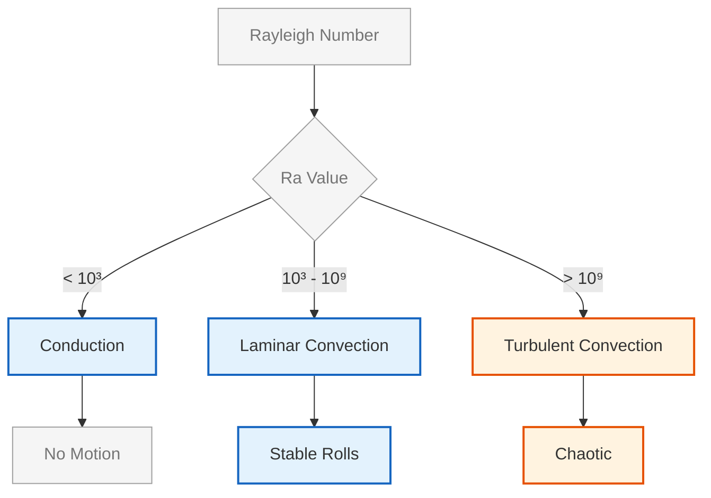

# การไหลที่ขับเคลื่อนด้วยแรงลอยตัว (Buoyancy-Driven Flows)

## 📖 บทนำ (Introduction)

การพาความร้อนตามธรรมชาติ (**Natural Convection**) เปิดขึ้นเมื่อความแตกต่างของอุณหภูมิทำให้เกิดความหนาแน่นที่ไม่สม่ำเสมอ จนเกิดแรงลอยตัวที่ขับเคลื่อนการไหลในสนามแรงโน้มถ่วง ปรากฏการณ์นี้เป็นพื้นฐานสำคัญของการถ่ายเทความร้อนในระบบทางวิศวกรรมมากมาย

> [!TIP] ความสำคัญทางวิศวกรรม
> การไหลที่ขับเคลื่อนด้วยแรงลอยตัวมีบทบาทสำคัญใน:
> - การระบายความร้อนอุปกรณ์อิเล็กทรอนิกส์ (Electronic cooling)
> - ระบบระบายความร้อนอาคาร (Building ventilation)
> - การวิเคราะห์อัคคีภัย (Fire safety analysis)
> - กระบวนการผลิตทางอุตสาหกรรม (Industrial processes)

---

## 🔄 1. การประมาณแบบบูสสิเนสก์ (Boussinesq Approximation)

### 1.1 หลักการพื้นฐาน

ในกรณีที่ความแตกต่างของอุณหภูมิไม่มากนัก ($\Delta T$ น้อย) เราสามารถใช้สมมติฐานเพื่อประหยัดเวลาคำนวณ โดยถือว่าความหนาแน่นคงที่ในทุกเทอม **ยกเว้นในเทอมแรงลอยตัว**

### 1.2 สมการความหนาแน่น

$$\rho = \rho_0 [1 - \beta (T - T_0)]$$

โดยที่:
- $\rho$ = ความหนาแน่นของของไหล ณ ตำแหน่งนั้น [kg/m³]
- $\rho_0$ = ความหนาแน่นอ้างอิงที่อุณหภูมิ $T_0$ [kg/m³]
- $\beta$ = สัมประสิทธิ์การขยายตัวทางความร้อน [1/K]
- $T$ = อุณหภูมิของของไหล [K]
- $T_0$ = อุณหภูมิอ้างอิง [K]

### 1.3 แรงลอยตัวในสมการโมเมนตัม

$$\mathbf{F}_b = \rho_0 \mathbf{g} \beta (T - T_0)$$

โดยที่:
- $\mathbf{F}_b$ = เวกเตอร์แรงลอยตัว [N/m³]
- $\mathbf{g}$ = เวกเตอร์ความเร่งเนื่องจากแรงโน้มถ่วง [m/s²]

### 1.4 สมมติฐานหลัก

| สมมติฐาน | คำอธิบาย | เงื่อนไขที่ใช้ได้ |
|:----------:|:----------:|:------------------:|
| **ความแตกต่างอุณหภูมิเล็กน้อย** | $\|\Delta T\|/T_0 \ll 1$ | $\Delta T < 20$°C สำหรับอากาศ |
| **การเปลี่ยนแปลงความหนาแน่นเป็นเชิงเส้น** | ความสัมพันธ์เชิงเส้นของ $\rho$ และ $T$ | ขอบเขตจำกัด |
| **การพิจารณาแบบไม่สามารถอัดตัวได้** | ยกเว้นในเทอมแรงลอยตัว | ความดันต่ำถึงปานกลาง |

> [!WARNING] ข้อจำกัด
> การประมาณแบบบูสสิเนสก์ **ไม่เหมาะสม** สำหรับ:
> - ความแตกต่างของอุณหภูมิที่มาก ($>50$°C)
> - แก๊สอัดตัวสูง
> - ปัญหาใกล้จุดวิกฤต

---

## 🔬 2. จำนวนไร้มิติที่สำคัญ (Important Dimensionless Numbers)

พฤติกรรมการไหลตามธรรมชาติถูกควบคุมโดยจำนวนไร้มิติหลักสามค่า:

### 2.1 จำนวนกราสชอฟ (Grashof Number, Gr)

อัตราส่วนของแรงลอยตัวต่อแรงหนืด:

$$Gr = \frac{g \beta \Delta T L^3}{\nu^2}$$

**นิยามตัวแปร:**
- $g$ = ความเร่งเนื่องจากแรงโน้มถ่วง (9.81 m/s²)
- $\Delta T$ = ความแตกต่างของอุณหภูมิลักษณะเฉพาะ [K]
- $L$ = ความยาวลักษณะเฉพาะ [m]
- $\nu$ = ความหนืดจลนศาสตร์ [m²/s]

### 2.2 จำนวนเรย์ลี (Rayleigh Number, Ra)

ตัวชี้วัดความแข็งแกร่งของการพาความร้อนตามธรรมชาติ:

$$Ra = Gr \cdot Pr = \frac{g \beta \Delta T L^3}{\nu \alpha}$$

โดยที่ $\alpha = \frac{k}{\rho c_p}$ คือ ความแพร่ความร้อน (thermal diffusivity)

### 2.3 การจำแนกระบอบการไหลตามค่า Rayleigh

| ช่วง Rayleigh | ระบอบการไหล | ลักษณะการถ่ายเทความร้อน |
|:--------------:|:----------------:|:------------------------:|
| **$Ra < 10^3$** | การนำความร้อนเป็นหลัก | Conduction dominates |
| **$10^3 < Ra < 10^9$** | การพาความร้อนแบบลามินาร์ | Laminar natural convection |
| **$Ra > 10^9$** | การพาความร้อนแบบปั่นป่วน | Turbulent natural convection |

### 2.4 จำนวนปรานท์ (Prandtl Number, Pr)

อัตราส่วนของความแพร่พลศาสตร์ต่อความแพร่ความร้อน:

$$Pr = \frac{\nu}{\alpha} = \frac{\mu c_p}{k}$$

**ค่า Prandtl ทั่วไป:**

| ของไหล | ค่า Pr | คุณสมบัติ |
|:--------:|:-------:|:-----------|
| โลหะเหลว (Liquid metals) | $\approx 0.01$ | ตัวนำความร้อนดีเยี่ยม |
| ก๊าซ (Gases) | $\approx 0.7$ | อากาศ: 0.71 |
| น้ำ (Water) | $\approx 7$ | ที่ 20°C |
| น้ำมัน (Oils) | $\approx 100$ | ตัวนำความร้อนไม่ดี |


> **Figure 1:** แผนผังการจำแนกระบอบการไหลตามค่าตัวเลขเรย์ลี (Rayleigh Number, Ra) ซึ่งเป็นพารามิเตอร์หลักที่กำหนดลักษณะการถ่ายเทความร้อนและพฤติกรรมการเคลื่อนที่ของของไหลในการพาความร้อนตามธรรมชาติ ตั้งแต่สภาวะการนำความร้อนที่หยุดนิ่งไปจนถึงการไหลแบบปั่นป่วนที่ซับซ้อน

---

## 💻 3. การนำไปใช้ใน OpenFOAM

### 3.1 Solvers สำหรับการไหลที่ขับเคลื่อนด้วยแรงลอยตัว

| Solver | ประเภท | ความสามารถ | การใช้งานที่เหมาะสม |
|:-------:|:-------:|:------------:|:---------------------:|
| **buoyantBoussinesqSimpleFoam** | Steady-state | การประมาณแบบ Boussinesq | ความแตกต่างอุณหภูมิเล็กน้อย |
| **buoyantBoussinesqPimpleFoam** | Transient | การประมาณแบบ Boussinesq | ปัญหาขึ้นกับเวลา |
| **buoyantSimpleFoam** | Steady-state | แรงลอยตัวเต็มรูปแบบ | ความแตกต่างอุณหภูมิมาก |
| **buoyantPimpleFoam** | Transient | แรงลอยตัวเต็มรูปแบบ | ปัญหาขึ้นกับเวลาที่ซับซ้อน |

### 3.2 การระบุแรงโน้มถ่วง

กำหนดในไฟล์ `constant/g`:

```cpp
/*--------------------------------*- C++ -*----------------------------------*\
| =========                 |                                                 |
| \\      /  F ield         | OpenFOAM: The Open Source CFD Toolbox           |
|  \\    /   O peration     | Version:  v2312                                 |
|   \\  /    A nd           | Website:  www.openfoam.com                      |
|    \\/     M anipulation  |                                                 |
\*---------------------------------------------------------------------------*/
FoamFile
{
    version     2.0;
    format      ascii;
    class       uniformDimensionedVectorField;
    location    "constant";
    object      g;
}
// * * * * * * * * * * * * * * * * * * * * * * * * * * * * * * * * * * * * * //

dimensions      [0 1 -2 0 0 0 0];
value           (0 0 -9.81);

// ************************************************************************* //
```

> **📂 Source:** `.applications/solvers/heatTransfer/buoyantSimpleFoam/createFields.H`
> 
> **คำอธิบาย:**
> - `dimensions` = มิติของความเร่ง [m/s²] ตามระบบหน่วย SI
> - `value` = เวกเตอร์แรงโน้มถ่วง (x, y, z) สามารถปรับทิศทางได้ตามปัญหา
> - ค่าเริ่มต้น (0, 0, -9.81) หมายถึงแรงโน้มถ่วงในทิศทางลบของแกน Z
> 
> **หลักการ:**
> - **หน่วยมิติ:** `[0 1 -2 0 0 0 0]` แทน `[mass length time temperature ...]`
> - **ทิศทาง:** ใช้ค่าบวกหรือลบขึ้นอยู่กับระบบพิกัดของเรขาคณิต
> - **ขนาด:** 9.81 m/s² สำหรับโลก สามารถเปลี่ยนสำหรับสภาพแวดล้อมอื่น

### 3.3 การกำหนดตัวแปร Beta

ระบุใน `constant/transportProperties`:

```cpp
/*--------------------------------*- C++ -*----------------------------------*\
| =========                 |                                                 |
| \\      /  F ield         | OpenFOAM: The Open Source CFD Toolbox           |
|  \\    /   O peration     | Version:  v2312                                 |
|   \\  /    A nd           | Website:  www.openfoam.com                      |
|    \\/     M anipulation  |                                                 |
\*---------------------------------------------------------------------------*/
FoamFile
{
    version     2.0;
    format      ascii;
    class       dictionary;
    location    "constant";
    object      transportProperties;
}
// * * * * * * * * * * * * * * * * * * * * * * * * * * * * * * * * * * * * * //

transportModel  Newtonian;

nu              [0 2 -1 0 0 0 0] 1.5e-05;

beta            [0 0 0 -1 0 0 0] 3.0e-03;

Prt             [0 0 0 0 0 0 0] 0.9;

// ************************************************************************* //
```

> **📂 Source:** `.applications/solvers/heatTransfer/buoyantBoussinesqSimpleFoam/createFields.H`
> 
> **คำอธิบาย:**
> - `nu` = ความหนืดจลนศาสตร์ (kinematic viscosity) [m²/s]
> - `beta` = สัมประสิทธิ์การขยายตัวทางความร้อน [1/K]
> - `Prt` = จำนวน Prandtl แบบปั่นป่วน (turbulent Prandtl number) ไม่มีมิติ
> 
> **หลักการ:**
> - **Beta ($\beta$):** ค่า $\beta = 3.0 \times 10^{-3}$ K⁻¹ เหมาะสำหรับอากาศ
> - **Prt:** ค่าทั่วไป 0.85-0.9 สำหรับการไหลแบบปั่นป่วน
> - **การเลือกค่า:** ต้องตรวจสอบจากคุณสมบัติทางกายภาพของของไหลที่ใช้จริง
> - **น้ำ:** $\beta \approx 2.1 \times 10^{-4}$ K⁻¹ ที่ 20°C
> - **อากาศ:** $\beta \approx 3.0 \times 10^{-3}$ K⁻¹ ที่ 20°C

### 3.4 การประมาณแบบ Boussinesq ใน OpenFOAM

```cpp
// Boussinesq approximation for density variation
// Boussinesq approximation for density calculation
volScalarField rhok
(
    IOobject
    (
        "rhok",                               // Field name
        runTime.timeName(),                   // Time directory
        mesh,                                 // Mesh reference
        IOobject::READ_IF_PRESENT,            // Read if exists, otherwise create
        IOobject::AUTO_WRITE                  // Auto-write to disk
    ),
    mesh,                                     // Reference to mesh
    dimensionedScalar("rhok", dimless, 1.0)   // Initial value: dimensionless 1.0
);

// Calculate temperature-dependent density
// Compute density variation based on temperature difference
rhok = 1.0 - beta * (T - TRef);

// Momentum equation with buoyancy force term
// Add buoyancy source term to momentum equation
fvVectorMatrix UEqn
(
    fvm::ddt(U)                           // Unsteady term: ∂U/∂t
  + fvm::div(phi, U)                      // Convection term: ∇·(φU)
  - fvm::laplacian(nu, U)                 // Diffusion term: ∇·(ν∇U)
 ==
    rhok * g                              // Buoyancy source term: ρ₀gβ(T-T₀)
);
```

> **📂 Source:** `.applications/solvers/heatTransfer/buoyantBoussinesqSimpleFoam/UEqn.H`
> 
> **คำอธิบาย:**
> - `volScalarField rhok` = สนามสเกลาร์สำหรับความหนาแน่นโดยประมาณ (normalized density)
> - `IOobject` = ระบุการจัดการข้อมูล: ชื่อ, เวลา, mesh, การอ่าน/เขียน
> - `dimensionedScalar` = ค่าคงที่ที่มีหน่วยมิติ ค่าเริ่มต้น = 1.0 (ไร้มิติ)
> - `fvm::ddt(U)` = เทอมอนุพันธ์เวลาแบบ implicit (unsteady term)
> - `fvm::div(phi, U)` = เทอมการพา (convection term) แบบ implicit
> - `fvm::laplacian(nu, U)` = เทอมการแพร่ (diffusion term) แบบ implicit
> - `rhok * g` = เทอมแหล่งกำเนิดแรงลอยตัว (buoyancy source term)
> 
> **หลักการ:**
> - **การประมาณแบบ Boussinesq:** ความหนาแน่น $\rho = \rho_0[1 - \beta(T - T_0)]$ จึงให้ $\rho/\rho_0 = 1 - \beta(T - T_0)$
> - **rhok:** คืออัตราส่วน $\rho/\rho_0$ (normalized density ratio)
> - **เทอมแรงลอยตัว:** แรงลอยตัวต่อหน่วยปริมาตร = $(\rho - \rho_0)g = \rho_0[1 - \beta(T - T_0) - 1]g = -\rho_0\beta(T - T_0)g$
> - **สมการโมเมนตัม:** แรงลอยตัวถูกเพิ่มเป็นเทอมแหล่งกำเนิดในสมการโมเมนตัม
> - **การทำให้เป็นมิติเดียว:** ทั้งสมการถูกหารด้วย $\rho_0$ เพื่อให้ rhok ปรากฏในเทอมแรงลอยตัว
> - **TRef:** อุณหภูมิอ้างอิงซึ่ง $\rho = \rho_0$ มักเป็นค่าเริ่มต้นหรือค่าเฉลี่ย
> - **ความถูกต้อง:** ถูกต้องเมื่อ $\beta\Delta T \ll 1$ (ความแตกต่างอุณหภูมิเล็กน้อย)

---

## ⚠️ 4. ข้อควรพิจารณา (Stability and Convergence)

### 4.1 ความละเอียดของ Mesh

| ประเด็น | คำแนะนำ | เหตุผล |
|:--------:|:----------:|:-------:|
| **Thermal Boundary Layer** | Mesh ละเอียดใกล้ผนัง | ชั้นขอบเขตความร้อนมักบางมาก |
| **Aspect Ratio** | < 10 | ป้องกันปัญหาความเสถียร |
| **Expansion Ratio** | < 1.3 | การเปลี่ยนแปลงขนาดควรเป็นเชิงเส้น |

### 4.2 การตั้งค่า Under-Relaxation

สำหรับปัญหาแรงลอยตัวสูง อาจต้องลด relaxation factors สำหรับอุณหภูมิลงเหลือ 0.5 - 0.7 เพื่อป้องกันการแกว่ง:

```cpp
/*--------------------------------*- C++ -*----------------------------------*\
| =========                 |                                                 |
| \\      /  F ield         | OpenFOAM: The Open Source CFD Toolbox           |
|  \\    /   O peration     | Version:  v2312                                 |
|   \\  /    A nd           | Website:  www.openfoam.com                      |
|    \\/     M anipulation  |                                                 |
\*---------------------------------------------------------------------------*/
FoamFile
{
    version     2.0;
    format      ascii;
    class       dictionary;
    location    "system";
    object      fvSolution;
}
// * * * * * * * * * * * * * * * * * * * * * * * * * * * * * * * * * * * * * //

solvers
{
    p
    {
        solver          GAMG;                          // Geometric-Algebraic Multi-Grid
        tolerance       1e-06;                         // Absolute convergence tolerance
        relTol          0.1;                           // Relative tolerance
    }

    pFinal
    {
        $p;                                          // Inherit from p
        relTol          0;                            // Zero relative tolerance for final iteration
    }

    "(U|T|k|epsilon|omega)"
    {
        solver          PBiCGStab;                    // Preconditioned BiCGStab
        preconditioner  DILU;                         // Diagonal Incomplete LU
        tolerance       1e-05;                        // Absolute convergence tolerance
        relTol          0.1;                          // Relative tolerance
    }

    "(U|T|k|epsilon|omega)Final"
    {
        $U;                                          // Inherit from U
        relTol          0;                            // Zero relative tolerance for final
    }
}

SIMPLE
{
    nNonOrthogonalCorrectors 0;                      // Non-orthogonal correction iterations

    consistent      yes;                             // Use consistent SIMPLE algorithm

    residualControl                                  // Residual control for convergence
    {
        p               1e-4;                        // Pressure residual target
        U               1e-4;                        // Velocity residual target
        T               1e-4;                        // Temperature residual target
        // possibly check turbulence fields
    }
}

relaxationFactors
{
    fields
    {
        p               0.3;                         // Pressure relaxation factor
        rho             1;                           // Density relaxation (no relaxation)
    }
    equations
    {
        U               0.7;                         // Momentum equation relaxation
        T               0.7;                         // Energy equation relaxation (reduce for high buoyancy)
        h               0.7;                         // Enthalpy equation relaxation
    }
}

// ************************************************************************* //
```

> **📂 Source:** `.applications/solvers/heatTransfer/buoyantBoussinesqSimpleFoam/`
> 
> **คำอธิบาย:**
> - **solvers.p:** การตั้งค่า solver สำหรับสมการความดัน
> - **GAMG:** Geometric-Algebraic Multi-Grid solver เหมาะกับปัญหาขนาดใหญ่
> - **tolerance:** เกณฑ์การลู่เข้าสัมบูรณ์ (absolute tolerance)
> - **relTol:** เกณฑ์การลู่เข้าสัมพัทธ์ (relative tolerance)
> - **PBiCGStab:** Preconditioned Biconjugate Gradient Stabilized solver สำหรับเวกเตอร์
> - **DILU:** Diagonal Incomplete LU preconditioner
> - **SIMPLE.consistent:** ใช้ variant ของอัลกอริทึม SIMPLE ที่มีความสอดคล้อง
> - **residualControl:** การควบคุมค่า residual สำหรับการตรวจสอบการลู่เข้า
> - **relaxationFactors:** ค่าปรับความเร็วในการลู่เข้า (under-relaxation)
> 
> **หลักการ:**
> - **Under-Relaxation:** ช่วยป้องกันการแกว่งของคำตอบใน iterative process
> - **การเลือกค่า:** 
>   - ค่า p = 0.3 เหมาะสำหรับการไหลที่ขับเคลื่อนด้วยแรงลอยตัว
>   - ค่า T = 0.7 อาจต้องลดเหลือ 0.5-0.6 สำหรับปัญหาที่มีแรงลอยตัวสูงมาก
> - **pFinal:** การทำให้ relTol = 0 ช่วยให้การลู่เข้าใน iteration สุดท้ายแม่นยำ
> - **Tolerance:** ค่า 1e-06 สำหรับความดันและ 1e-05 สำหรับตัวแปรอื่นเป็นค่ามาตรฐาน
> - **การตรวจสอบการลู่เข้า:** ใช้ residualControl เพื่อกำหนดเกณฑ์การหยุดการคำนวณ
> - **นัยสำคัญ:** การปรับค่าเหล่านี้มีผลต่อความเสถียรและเวลาในการคำนวณ

### 4.3 การเลือก Discretization Schemes

```cpp
/*--------------------------------*- C++ -*----------------------------------*\
| =========                 |                                                 |
| \\      /  F ield         | OpenFOAM: The Open Source CFD Toolbox           |
|  \\    /   O peration     | Version:  v2312                                 |
|   \\  /    A nd           | Website:  www.openfoam.com                      |
|    \\/     M anipulation  |                                                 |
\*---------------------------------------------------------------------------*/
FoamFile
{
    version     2.0;
    format      ascii;
    class       dictionary;
    location    "system";
    object      fvSchemes;
}
// * * * * * * * * * * * * * * * * * * * * * * * * * * * * * * * * * * * * * //

ddtSchemes
{
    default         steadyState;                   // Steady-state: no time derivative
}

gradSchemes
{
    default         Gauss linear;                  // Linear gradient reconstruction
}

divSchemes
{
    default         none;                          // Require explicit scheme specification
    div(phi,U)      bounded Gauss limitedLinearV 1;  // Bounded convection scheme for velocity
    div(phi,T)      bounded Gauss limitedLinear 1;   // Bounded convection scheme for temperature (ensures stability)
    div(phi,k)      bounded Gauss limitedLinear 1;   // Bounded scheme for turbulent kinetic energy
    div(phi,epsilon) bounded Gauss limitedLinear 1;  // Bounded scheme for dissipation rate
    div((nuEff*dev2(T(grad(U))))) Gauss linear;     // Linear diffusion scheme for stress tensor
}

laplacianSchemes
{
    default         Gauss linear corrected;         // Corrected linear Laplacian scheme
}

interpolationSchemes
{
    default         linear;                        // Linear interpolation to face centers
}

snGradSchemes
{
    default         corrected;                     // Corrected surface normal gradient
}

// ************************************************************************* //
```

> **📂 Source:** `.applications/solvers/heatTransfer/buoyantBoussinesqSimpleFoam/`
> 
> **คำอธิบาย:**
> - **ddtSchemes:** รูปแบบการประมาณอนุพันธ์เวลา (temporal discretization)
> - **gradSchemes:** รูปแบบการประมาณ gradient (spatial reconstruction)
> - **divSchemes:** รูปแบบการประมาณเทอมการพา (convection terms)
> - **laplacianSchemes:** รูปแบบการประมาณเทอมการแพร่ (diffusion terms)
> - **Gauss:** ใช้ทฤษฎีบทของเกาส์เพื่อแปลง volume integral เป็น surface integral
> - **limitedLinearV:** Limited linear scheme with van Leer limiter สำหรับความเสถียร
> - **bounded:** บังคับให้ผลลัพธ์อยู่ในช่วงที่เหมาะสม (เช่น T ไม่ติดลบ)
> - **corrected:** แก้ไขความคลาดเคลื่อนจาก non-orthogonal mesh
> 
> **หลักการ:**
> - **การเลือก Scheme:** สำคัญต่อความเสถียร ความแม่นยำ และการลู่เข้าของการคำนวณ
> - **Convection Schemes:**
>   - `limitedLinearV`: ให้ความเสถียรสูงกับ boundedness และความแม่นยำระดับที่สอง
>   - ค่า `1` คือ limiting factor (1 = full limiting, 0 = no limiting)
> - **Diffusion Schemes:**
>   - `linear corrected`: ใช้ linear interpolation พร้อม corrected term สำหรับ non-orthogonal meshes
> - **bounded Scheme:** สำคัญมากสำหรับสมการอุณหภูมิเพื่อป้องกันค่าที่ไม่เป็นกายภาพ
> - **Gradient Schemes:**
>   - `Gauss linear`: ใช้ Green-Gauss theorem พร้อม linear interpolation
> - **Interpolation Schemes:**
>   - `linear`: ค่าเฉลี่ยถ่วงน้ำหนักของค่าที่ cell centers ที่ใกล้เคียง
> - **Surface Normal Gradient:**
>   - `corrected`: แก้ไขความคลาดเคลื่อนจาก non-orthogonality
> - **นัยสำคัญ:** การเลือก scheme ที่เหมาะสมช่วยป้องกันการ oscillate และ divergence

---

## 📊 5. การคำนวณและการวิเคราะห์ผลลัพธ์

### 5.1 การคำนวณจำนวนเรย์ลี

```cpp
// Calculate Rayleigh number for flow regime identification
// Compute Rayleigh number from dimensional parameters
scalar Ra = g * beta * deltaT * pow(Lchar, 3) / (nu * alpha);

// Output Rayleigh number to console
// Display computed Rayleigh number for verification
Info << "Rayleigh number: " << Ra << endl;
```

> **📂 Source:** Custom function field for post-processing
> 
> **คำอธิบาย:**
> - `scalar Ra` = ตัวแปรสเกลาร์สำหรับเก็บค่าจำนวนเรย์ลี
> - `g` = ความเร่งเนื่องจากแรงโน้มถ่วง [m/s²]
> - `beta` = สัมประสิทธิ์การขยายตัวทางความร้อน [1/K]
> - `deltaT` = ความแตกต่างอุณหภูมิลักษณะเฉพาะ [K]
> - `Lchar` = ความยาวลักษณะเฉพาะ [m]
> - `pow(Lchar, 3)` = ยกกำลังสามของความยาว
> - `nu` = ความหนืดจลนศาสตร์ [m²/s]
> - `alpha` = ความแพร่ความร้อน [m²/s]
> - `Info <<` = การ output ข้อมูลไปยัง console ของ OpenFOAM
> 
> **หลักการ:**
> - **สูตรจำนวนเรย์ลี:** $Ra = \frac{g \beta \Delta T L^3}{\nu \alpha}$
> - **การใช้งาน:**
>   - ใช้เพื่อจำแนกระบอบการไหล (ลามินาร์/ปั่นป่วน)
>   - ใช้เพื่อตรวจสอบความถูกต้องของการจำลอง
>   - ใช้เพื่อเปรียบเทียบกับความสัมพันธ์เชิงประจักษ์
> - **การตีความ:**
>   - $Ra < 10^3$: การนำความร้อน (conduction)
>   - $10^3 < Ra < 10^9$: การพาความร้อนแบบลามินาร์
>   - $Ra > 10^9$: การพาความร้อนแบบปั่นป่วน
> - **การคำนวณ:** ทุกตัวแปรต้องมีหน่วยที่ถูกต้องและสอดคล้องกัน

### 5.2 การคำนวณ Nusselt Number

$$Nu = \frac{hL}{k} = \frac{Q_{\text{conv}}}{Q_{\text{cond}}}$$

**การคำนวณฟลักซ์ความร้อนที่ผนัง:**

```cpp
// Calculate wall heat flux for Nusselt number computation
// Compute conductive heat flux at wall surfaces: q'' = -k * ∇T·n
volScalarField wallHeatFlux
(
    -k * fvc::snGrad(T) * mesh.magSf()
);

// Calculate local Nusselt number
// Compute Nu = hL/k = (q'' * L) / [k * (T_wall - T_bulk)]
volScalarField NuLocal
(
    wallHeatFlux * Lchar / (k * (T_wall - T_bulk))
);

// Calculate surface-averaged Nusselt number
// Compute average Nu over the wall boundary
scalar NuAvg = average(NuLocal.boundaryField()[wallID]);
```

> **📂 Source:** Custom function object for post-processing
> 
> **คำอธิบาย:**
> - **wallHeatFlux:**
>   - `-k` = สัญลักษณ์ลบเนื่องจากความร้อนไหลจากอุณหภูมิสูงไปต่ำ
>   - `fvc::snGrad(T)` = surface normal gradient ของอุณหภูมิ (∂T/∂n)
>   - `mesh.magSf()` = พื้นที่ผิวของหน้า (face magnitude)
> - **NuLocal:**
>   - ค่า Nusselt number เฉพาะที่ (local Nusselt number)
>   - `Lchar` = ความยาวลักษณะเฉพาะ (characteristic length)
>   - `T_wall` = อุณหภูมิผนัง
>   - `T_bulk` = อุณหภูมิ bulk หรือ mean temperature
> - **NuAvg:**
>   - ค่า Nusselt number เฉลี่ยบนผนัง
>   - `average()` = ฟังก์ชันคำนวณค่าเฉลี่ย
>   - `boundaryField()[wallID]` = ช่องข้อมูลบนผนัง
> 
> **หลักการ:**
> - **นิยามจำนวน Nu:** $Nu = \frac{hL}{k} = \frac{Q_{conv}}{Q_{cond}}$
> - **ความหมาย:** อัตราส่วนของการถ่ายเทความร้อนโดยการพาต่อการนำ
> - **การคำนวณ:**
>   - ฟลักซ์ความร้อน: $q'' = -k \frac{\partial T}{\partial n}$
>   - สัมประสิทธิ์การถ่ายเทความร้อน: $h = \frac{q''}{T_{wall} - T_{bulk}}$
>   - จำนวน Nu: $Nu = \frac{hL}{k} = \frac{q'' L}{k(T_{wall} - T_{bulk})}$
> - **ความสำคัญ:**
>   - ใช้เพื่อประเมินประสิทธิภาพการถ่ายเทความร้อน
>   - ใช้เพื่อเปรียบเทียบกับสหสัมพันธ์เชิงประจักษ์
>   - ใช้เพื่อตรวจสอบความถูกต้องของการจำลอง
> - **Local vs Average:**
>   - Local: ค่าที่ตำแหน่งใดๆ บนผนัง
>   - Average: ค่าเฉลี่ยทั่วทั้งผนัง
> - **การเลือก T_bulk:**
>   - สำหรับ internal flows: ค่าเฉลี่ย cross-section
>   - สำหรับ external flows: ค่า far-field temperature

### 5.3 ความสัมพันธ์เชิงประจักษ์สำหรับ Natural Convection

| การไหล (Flow Type) | ความสัมพันธ์ (Correlation) | เงื่อนไข (Conditions) |
|:---------------------:|:---------------------------:|:-----------------------:|
| **การพาความร้อนตามธรรมชาติ - แผ่นแนวตั้ง** | $Nu = 0.59 Ra^{1/4}$ | $10^4 < Ra < 10^9$ |
| **การพาความร้อนตามธรรมชาติ - แผ่นแนวตั้ง** | $Nu = 0.10 Ra^{1/3}$ | $10^9 < Ra < 10^{13}$ |

---

## 🎯 6. ตัวอย่างการประยุกต์ใช้ (Application Examples)

### 6.1 การระบายความร้อนพัดลม (Radiator Cooling)

**ปัญหา:** การวิเคราะห์การไหลของอากาศรอบพัดลมร้อน

**การตั้งค่า:**
- ความแตกต่างอุณหภูมิ: 40-60°C
- จำนวนเรย์ลี: $10^7 - 10^9$
- Solver: `buoyantBoussinesqSimpleFoam`

### 6.2 การวิเคราะห์อัคคีภัย (Fire Analysis)

**ปัญหา:** การกระจายตัวของควันและความร้อนจากไฟไหม้

**การตั้งค่า:**
- ความแตกต่างอุณหภูมิ: 200-800°C
- จำนวนเรย์ลี: $10^{12} - 10^{15}$
- Solver: `buoyantPimpleFoam` (เนื่องจากความแตกต่างอุณหภูมิสูง)

### 6.3 การระบายความร้อนอาคาร (Building Ventilation)

**ปัญหา:** การไหลเวียนของอากาศตามธรรมชาติในอาคาร

**การตั้งค่า:**
- ความแตกต่างอุณหภูมิ: 5-15°C
- จำนวนเรย์ลี: $10^8 - 10^{10}$
- Solver: `buoyantBoussinesqPimpleFoam`

---

## 📚 7. การเชื่อมโยงกับหัวข้ออื่นๆ

### 7.1 ต่อยอดจาก: [[03_TURBULENCE_MODELING]]

- แบบจำลองความปั่นป่วนที่ใช้ในการไหลแบบแรงลอยตัว
- ความสัมพันธ์ระหว่างความหนืดแบบปั่นป่วนและการแพร่ความร้อนแบบปั่นป่วน

### 7.2 นำไปสู่: [[04_Conjugate_Heat_Transfer]]

- การถ่ายเทความร้อนระหว่างของไหลและของแข็งในระบบที่มีแรงลอยตัว
- การจำลองระบบระบายความร้อนที่ซับซ้อน

---

## 🔍 8. สรุปประเด็นสำคัญ (Key Takeaways)

| หัวข้อ | ประเด็นสำคัญ |
|:-------:|:--------------|
| **การประมาณแบบ Boussinesq** | เหมาะสำหรับความแตกต่างอุณหภูมิเล็กน้อย ($\Delta T < 20$°C) |
| **จำนวนเรย์ลี** | ตัวบ่งชี้ระบอบการไหล: $<10^3$ (นำ), $10^3-10^9$ (ลามินาร์), $>10^9$ (ปั่นป่วน) |
| **Mesh Resolution** | ต้องการ Mesh ละเอียดใกล้ผนังสำหรับ thermal boundary layer |
| **Solver Selection** | `buoyantBoussinesqSimpleFoam` สำหรับ steady-state, `buoyantBoussinesqPimpleFoam` สำหรับ transient |
| **Under-Relaxation** | ควรลดค่าสำหรับอุณหภูมิ (0.5-0.7) เมื่อแรงลอยตัวสูง |

---

**หัวข้อถัดไป**: [[04_Conjugate_Heat_Transfer]]