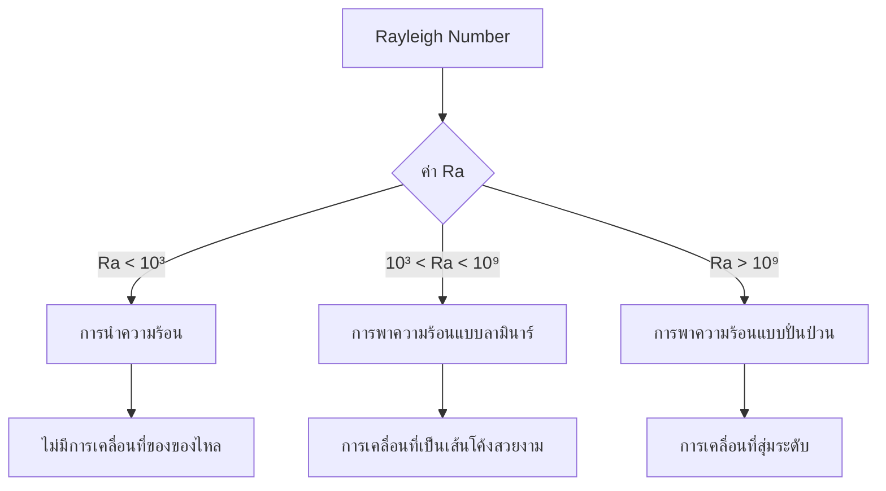

# การไหลที่ขับเคลื่อนด้วยแรงลอยตัว (Buoyancy-Driven Flows)

## 📖 บทนำ (Introduction)

การพาความร้อนตามธรรมชาติ (**Natural Convection**) เปิดขึ้นเมื่อความแตกต่างของอุณหภูมิทำให้เกิดความหนาแน่นที่ไม่สม่ำเสมอ จนเกิดแรงลอยตัวที่ขับเคลื่อนการไหลในสนามแรงโน้มถ่วง ปรากฏการณ์นี้เป็นพื้นฐานสำคัญของการถ่ายเทความร้อนในระบบทางวิศวกรรมมากมาย

> [!TIP] ความสำคัญทางวิศวกรรม
> การไหลที่ขับเคลื่อนด้วยแรงลอยตัวมีบทบาทสำคัญใน:
> - การระบายความร้อนอุปกรณ์อิเล็กทรอนิกส์ (Electronic cooling)
> - ระบบระบายความร้อนอาคาร (Building ventilation)
> - การวิเคราะห์อัคคีภัย (Fire safety analysis)
> - กระบวนการผลิตทางอุตสาหกรรม (Industrial processes)

---

## 🔄 1. การประมาณแบบบูสสิเนสก์ (Boussinesq Approximation)

### 1.1 หลักการพื้นฐาน

ในกรณีที่ความแตกต่างของอุณหภูมิไม่มากนัก ($\Delta T$ น้อย) เราสามารถใช้สมมติฐานเพื่อประหยัดเวลาคำนวณ โดยถือว่าความหนาแน่นคงที่ในทุกเทอม **ยกเว้นในเทอมแรงลอยตัว**

### 1.2 สมการความหนาแน่น

$$\rho = \rho_0 [1 - \beta (T - T_0)]$$

โดยที่:
- $\rho$ = ความหนาแน่นของของไหล ณ ตำแหน่งนั้น [kg/m³]
- $\rho_0$ = ความหนาแน่นอ้างอิงที่อุณหภูมิ $T_0$ [kg/m³]
- $\beta$ = สัมประสิทธิ์การขยายตัวทางความร้อน [1/K]
- $T$ = อุณหภูมิของของไหล [K]
- $T_0$ = อุณหภูมิอ้างอิง [K]

### 1.3 แรงลอยตัวในสมการโมเมนตัม

$$\mathbf{F}_b = \rho_0 \mathbf{g} \beta (T - T_0)$$

โดยที่:
- $\mathbf{F}_b$ = เวกเตอร์แรงลอยตัว [N/m³]
- $\mathbf{g}$ = เวกเตอร์ความเร่งเนื่องจากแรงโน้มถ่วง [m/s²]

### 1.4 สมมติฐานหลัก

| สมมติฐาน | คำอธิบาย | เงื่อนไขที่ใช้ได้ |
|:----------:|:----------:|:------------------:|
| **ความแตกต่างอุณหภูมิเล็กน้อย** | $\|\Delta T\|/T_0 \ll 1$ | $\Delta T < 20$°C สำหรับอากาศ |
| **การเปลี่ยนแปลงความหนาแน่นเป็นเชิงเส้น** | ความสัมพันธ์เชิงเส้นของ $\rho$ และ $T$ | ขอบเขตจำกัด |
| **การพิจารณาแบบไม่สามารถอัดตัวได้** | ยกเว้นในเทอมแรงลอยตัว | ความดันต่ำถึงปานกลาง |

> [!WARNING] ข้อจำกัด
> การประมาณแบบบูสสิเนสก์ **ไม่เหมาะสม** สำหรับ:
> - ความแตกต่างของอุณหภูมิที่มาก ($>50$°C)
> - แก๊สอัดตัวสูง
> - ปัญหาใกล้จุดวิกฤต

---

## 🔬 2. จำนวนไร้มิติที่สำคัญ (Important Dimensionless Numbers)

พฤติกรรมการไหลตามธรรมชาติถูกควบคุมโดยจำนวนไร้มิติหลักสามค่า:

### 2.1 จำนวนกราสชอฟ (Grashof Number, Gr)

อัตราส่วนของแรงลอยตัวต่อแรงหนืด:

$$Gr = \frac{g \beta \Delta T L^3}{\nu^2}$$

**นิยามตัวแปร:**
- $g$ = ความเร่งเนื่องจากแรงโน้มถ่วง (9.81 m/s²)
- $\Delta T$ = ความแตกต่างของอุณหภูมิลักษณะเฉพาะ [K]
- $L$ = ความยาวลักษณะเฉพาะ [m]
- $\nu$ = ความหนืดจลนศาสตร์ [m²/s]

### 2.2 จำนวนเรย์ลี (Rayleigh Number, Ra)

ตัวชี้วัดความแข็งแกร่งของการพาความร้อนตามธรรมชาติ:

$$Ra = Gr \cdot Pr = \frac{g \beta \Delta T L^3}{\nu \alpha}$$

โดยที่ $\alpha = \frac{k}{\rho c_p}$ คือ ความแพร่ความร้อน (thermal diffusivity)

### 2.3 การจำแนกระบอบการไหลตามค่า Rayleigh

| ช่วง Rayleigh | ระบอบการไหล | ลักษณะการถ่ายเทความร้อน |
|:--------------:|:----------------:|:------------------------:|
| **$Ra < 10^3$** | การนำความร้อนเป็นหลัก | Conduction dominates |
| **$10^3 < Ra < 10^9$** | การพาความร้อนแบบลามินาร์ | Laminar natural convection |
| **$Ra > 10^9$** | การพาความร้อนแบบปั่นป่วน | Turbulent natural convection |

### 2.4 จำนวนปรานท์ (Prandtl Number, Pr)

อัตราส่วนของความแพร่พลศาสตร์ต่อความแพร่ความร้อน:

$$Pr = \frac{\nu}{\alpha} = \frac{\mu c_p}{k}$$

**ค่า Prandtl ทั่วไป:**

| ของไหล | ค่า Pr | คุณสมบัติ |
|:--------:|:-------:|:-----------|
| โลหะเหลว (Liquid metals) | $\approx 0.01$ | ตัวนำความร้อนดีเยี่ยม |
| ก๊าซ (Gases) | $\approx 0.7$ | อากาศ: 0.71 |
| น้ำ (Water) | $\approx 7$ | ที่ 20°C |
| น้ำมัน (Oils) | $\approx 100$ | ตัวนำความร้อนไม่ดี |


> **Figure 1:** แผนผังการจำแนกระบอบการไหลตามค่าตัวเลขเรย์ลี (Rayleigh Number, Ra) ซึ่งเป็นพารามิเตอร์หลักที่กำหนดลักษณะการถ่ายเทความร้อนและพฤติกรรมการเคลื่อนที่ของของไหลในการพาความร้อนตามธรรมชาติ ตั้งแต่สภาวะการนำความร้อนที่หยุดนิ่งไปจนถึงการไหลแบบปั่นป่วนที่ซับซ้อนความปลอดภัยทางฟิสิกส์ไม่ส่งผลกระทบต่อความเร็วในการจำลอง ผ่านการใช้พลังของ C++ Template Metaprogramming ในการตรวจสอบความสอดคล้องทางมิติทั้งหมดที่ขั้นตอนการคอมไพล์โปรแกรมเพียงครั้งเดียว

---

## 💻 3. การนำไปใช้ใน OpenFOAM

### 3.1 Solvers สำหรับการไหลที่ขับเคลื่อนด้วยแรงลอยตัว

| Solver | ประเภท | ความสามารถ | การใช้งานที่เหมาะสม |
|:-------:|:-------:|:------------:|:---------------------:|
| **buoyantBoussinesqSimpleFoam** | Steady-state | การประมาณแบบ Boussinesq | ความแตกต่างอุณหภูมิเล็กน้อย |
| **buoyantBoussinesqPimpleFoam** | Transient | การประมาณแบบ Boussinesq | ปัญหาขึ้นกับเวลา |
| **buoyantSimpleFoam** | Steady-state | แรงลอยตัวเต็มรูปแบบ | ความแตกต่างอุณหภูมิมาก |
| **buoyantPimpleFoam** | Transient | แรงลอยตัวเต็มรูปแบบ | ปัญหาขึ้นกับเวลาที่ซับซ้อน |

### 3.2 การระบุแรงโน้มถ่วง

กำหนดในไฟล์ `constant/g`:

```cpp
/*--------------------------------*- C++ -*----------------------------------*\
| =========                 |                                                 |
| \\      /  F ield         | OpenFOAM: The Open Source CFD Toolbox           |
|  \\    /   O peration     | Version:  v2312                                 |
|   \\  /    A nd           | Website:  www.openfoam.com                      |
|    \\/     M anipulation  |                                                 |
\*---------------------------------------------------------------------------*/
FoamFile
{
    version     2.0;
    format      ascii;
    class       uniformDimensionedVectorField;
    location    "constant";
    object      g;
}
// * * * * * * * * * * * * * * * * * * * * * * * * * * * * * * * * * * * * * //

dimensions      [0 1 -2 0 0 0 0];
value           (0 0 -9.81);

// ************************************************************************* //
```

**คำอธิบาย:**
- `dimensions` = มิติของความเร่ง [m/s²]
- `value` = เวกเตอร์แรงโน้มถ่วง (สามารถปรับทิศทางได้ตามปัญหา)

### 3.3 การกำหนดตัวแปร Beta

ระบุใน `constant/transportProperties`:

```cpp
/*--------------------------------*- C++ -*----------------------------------*\
| =========                 |                                                 |
| \\      /  F ield         | OpenFOAM: The Open Source CFD Toolbox           |
|  \\    /   O peration     | Version:  v2312                                 |
|   \\  /    A nd           | Website:  www.openfoam.com                      |
|    \\/     M anipulation  |                                                 |
\*---------------------------------------------------------------------------*/
FoamFile
{
    version     2.0;
    format      ascii;
    class       dictionary;
    location    "constant";
    object      transportProperties;
}
// * * * * * * * * * * * * * * * * * * * * * * * * * * * * * * * * * * * * * //

transportModel  Newtonian;

nu              [0 2 -1 0 0 0 0] 1.5e-05;

beta            [0 0 0 -1 0 0 0] 3.0e-03;

Prt             [0 0 0 0 0 0 0] 0.9;

// ************************************************************************* //
```

**คำอธิบาย:**
- `beta` = สัมประสิทธิ์การขยายตัวทางความร้อน [1/K]
- `Prt` = จำนวน Prandtl แบบปั่นป่วน (ค่าทั่วไป: 0.85-0.9)

### 3.4 การประมาณแบบ Boussinesq ใน OpenFOAM

```cpp
// การประมาณแบบ Boussinesq สำหรับความหนาแน่น
volScalarField rhok
(
    IOobject
    (
        "rhok",
        runTime.timeName(),
        mesh,
        IOobject::READ_IF_PRESENT,
        IOobject::AUTO_WRITE
    ),
    mesh,
    dimensionedScalar("rhok", dimless, 1.0)
);

// คำนวณความหนาแน่นที่ขึ้นกับอุณหภูมิ
rhok = 1.0 - beta * (T - TRef);

// สมการโมเมนตัมพร้อมแรงลอยตัว
fvVectorMatrix UEqn
(
    fvm::ddt(U)
  + fvm::div(phi, U)
  - fvm::laplacian(nu, U)
 ==
    rhok * g  // เทอมแรงลอยตัว
);
```

---

## ⚠️ 4. ข้อควรพิจารณา (Stability and Convergence)

### 4.1 ความละเอียดของ Mesh

| ประเด็น | คำแนะนำ | เหตุผล |
|:--------:|:----------:|:-------:|
| **Thermal Boundary Layer** | Mesh ละเอียดใกล้ผนัง | ชั้นขอบเขตความร้อนมักบางมาก |
| **Aspect Ratio** | < 10 | ป้องกันปัญหาความเสถียร |
| **Expansion Ratio** | < 1.3 | การเปลี่ยนแปลงขนาดควรเป็นเชิงเส้น |

### 4.2 การตั้งค่า Under-Relaxation

สำหรับปัญหาแรงลอยตัวสูง อาจต้องลด relaxation factors สำหรับอุณหภูมิลงเหลือ 0.5 - 0.7 เพื่อป้องกันการแกว่ง:

```cpp
/*--------------------------------*- C++ -*----------------------------------*\
| =========                 |                                                 |
| \\      /  F ield         | OpenFOAM: The Open Source CFD Toolbox           |
|  \\    /   O peration     | Version:  v2312                                 |
|   \\  /    A nd           | Website:  www.openfoam.com                      |
|    \\/     M anipulation  |                                                 |
\*---------------------------------------------------------------------------*/
FoamFile
{
    version     2.0;
    format      ascii;
    class       dictionary;
    location    "system";
    object      fvSolution;
}
// * * * * * * * * * * * * * * * * * * * * * * * * * * * * * * * * * * * * * //

solvers
{
    p
    {
        solver          GAMG;
        tolerance       1e-06;
        relTol          0.1;
    }

    pFinal
    {
        $p;
        relTol          0;
    }

    "(U|T|k|epsilon|omega)"
    {
        solver          PBiCGStab;
        preconditioner  DILU;
        tolerance       1e-05;
        relTol          0.1;
    }

    "(U|T|k|epsilon|omega)Final"
    {
        $U;
        relTol          0;
    }
}

SIMPLE
{
    nNonOrthogonalCorrectors 0;

    consistent      yes;

    residualControl
    {
        p               1e-4;
        U               1e-4;
        T               1e-4;
        // possibly check turbulence fields
    }
}

relaxationFactors
{
    fields
    {
        p               0.3;
        rho             1;
    }
    equations
    {
        U               0.7;
        T               0.7;  // ลดค่าลงสำหรับปัญหาแรงลอยตัวสูง
        h               0.7;
    }
}

// ************************************************************************* //
```

### 4.3 การเลือก Discretization Schemes

```cpp
/*--------------------------------*- C++ -*----------------------------------*\
| =========                 |                                                 |
| \\      /  F ield         | OpenFOAM: The Open Source CFD Toolbox           |
|  \\    /   O peration     | Version:  v2312                                 |
|   \\  /    A nd           | Website:  www.openfoam.com                      |
|    \\/     M anipulation  |                                                 |
\*---------------------------------------------------------------------------*/
FoamFile
{
    version     2.0;
    format      ascii;
    class       dictionary;
    location    "system";
    object      fvSchemes;
}
// * * * * * * * * * * * * * * * * * * * * * * * * * * * * * * * * * * * * * //

ddtSchemes
{
    default         steadyState;
}

gradSchemes
{
    default         Gauss linear;
}

divSchemes
{
    default         none;
    div(phi,U)      bounded Gauss limitedLinearV 1;
    div(phi,T)      bounded Gauss limitedLinear 1;  // จำกัดค่าเพื่อความเสถียร
    div(phi,k)      bounded Gauss limitedLinear 1;
    div(phi,epsilon) bounded Gauss limitedLinear 1;
    div((nuEff*dev2(T(grad(U))))) Gauss linear;
}

laplacianSchemes
{
    default         Gauss linear corrected;
}

interpolationSchemes
{
    default         linear;
}

snGradSchemes
{
    default         corrected;
}

// ************************************************************************* //
```

---

## 📊 5. การคำนวณและการวิเคราะห์ผลลัพธ์

### 5.1 การคำนวณจำนวนเรย์ลี

```cpp
// การคำนวณ Rayleigh number
scalar Ra = g * beta * deltaT * pow(Lchar, 3) / (nu * alpha);

Info << "Rayleigh number: " << Ra << endl;
```

### 5.2 การคำนวณ Nusselt Number

$$Nu = \frac{hL}{k} = \frac{Q_{\text{conv}}}{Q_{\text{cond}}}$$

**การคำนวณฟลักซ์ความร้อนที่ผนัง:**

```cpp
// การคำนวณฟลักซ์ความร้อนที่ผนัง
volScalarField wallHeatFlux
(
    -k * fvc::snGrad(T) * mesh.magSf()
);

// จำนวน Nusselt เฉพาะที่
volScalarField NuLocal
(
    wallHeatFlux * Lchar / (k * (T_wall - T_bulk))
);

// จำนวน Nusselt เฉลี่ยพื้นผิว
scalar NuAvg = average(NuLocal.boundaryField()[wallID]);
```

### 5.3 ความสัมพันธ์เชิงประจักษ์สำหรับ Natural Convection

| การไหล (Flow Type) | ความสัมพันธ์ (Correlation) | เงื่อนไข (Conditions) |
|:---------------------:|:---------------------------:|:-----------------------:|
| **การพาความร้อนตามธรรมชาติ - แผ่นแนวตั้ง** | $Nu = 0.59 Ra^{1/4}$ | $10^4 < Ra < 10^9$ |
| **การพาความร้อนตามธรรมชาติ - แผ่นแนวตั้ง** | $Nu = 0.10 Ra^{1/3}$ | $10^9 < Ra < 10^{13}$ |

---

## 🎯 6. ตัวอย่างการประยุกต์ใช้ (Application Examples)

### 6.1 การระบายความร้อนพัดลม (Radiator Cooling)

**ปัญหา:** การวิเคราะห์การไหลของอากาศรอบพัดลมร้อน

**การตั้งค่า:**
- ความแตกต่างอุณหภูมิ: 40-60°C
- จำนวนเรย์ลี: $10^7 - 10^9$
- Solver: `buoyantBoussinesqSimpleFoam`

### 6.2 การวิเคราะห์อัคคีภัย (Fire Analysis)

**ปัญหา:** การกระจายตัวของควันและความร้อนจากไฟไหม้

**การตั้งค่า:**
- ความแตกต่างอุณหภูมิ: 200-800°C
- จำนวนเรย์ลี: $10^{12} - 10^{15}$
- Solver: `buoyantPimpleFoam` (เนื่องจากความแตกต่างอุณหภูมิสูง)

### 6.3 การระบายความร้อนอาคาร (Building Ventilation)

**ปัญหา:** การไหลเวียนของอากาศตามธรรมชาติในอาคาร

**การตั้งค่า:**
- ความแตกต่างอุณหภูมิ: 5-15°C
- จำนวนเรย์ลี: $10^8 - 10^{10}$
- Solver: `buoyantBoussinesqPimpleFoam`

---

## 📚 7. การเชื่อมโยงกับหัวข้ออื่นๆ

### 7.1 ต่อยอดจาก: [[03_TURBULENCE_MODELING]]

- แบบจำลองความปั่นป่วนที่ใช้ในการไหลแบบแรงลอยตัว
- ความสัมพันธ์ระหว่างความหนืดแบบปั่นป่วนและการแพร่ความร้อนแบบปั่นป่วน

### 7.2 นำไปสู่: [[04_Conjugate_Heat_Transfer]]

- การถ่ายเทความร้อนระหว่างของไหลและของแข็งในระบบที่มีแรงลอยตัว
- การจำลองระบบระบายความร้อนที่ซับซ้อน

---

## 🔍 8. สรุปประเด็นสำคัญ (Key Takeaways)

| หัวข้อ | ประเด็นสำคัญ |
|:-------:|:--------------|
| **การประมาณแบบ Boussinesq** | เหมาะสำหรับความแตกต่างอุณหภูมิเล็กน้อย ($\Delta T < 20$°C) |
| **จำนวนเรย์ลี** | ตัวบ่งชี้ระบอบการไหล: $<10^3$ (นำ), $10^3-10^9$ (ลามินาร์), $>10^9$ (ปั่นป่วน) |
| **Mesh Resolution** | ต้องการ Mesh ละเอียดใกล้ผนังสำหรับ thermal boundary layer |
| **Solver Selection** | `buoyantBoussinesqSimpleFoam` สำหรับ steady-state, `buoyantBoussinesqPimpleFoam` สำหรับ transient |
| **Under-Relaxation** | ควรลดค่าสำหรับอุณหภูมิ (0.5-0.7) เมื่อแรงลอยตัวสูง |

---

**หัวข้อถัดไป**: [[04_Conjugate_Heat_Transfer]]
