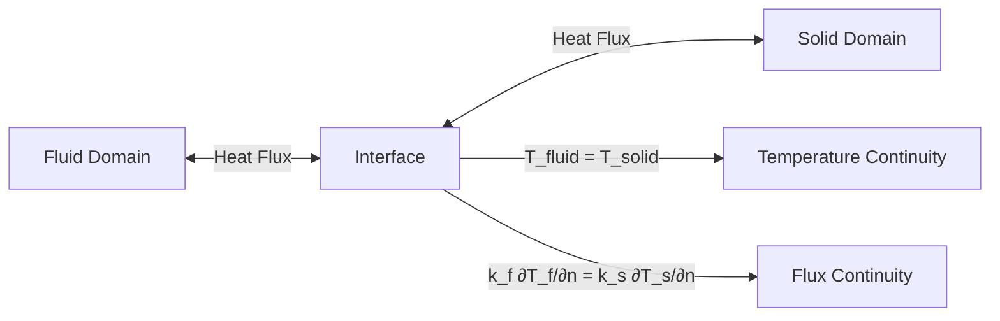
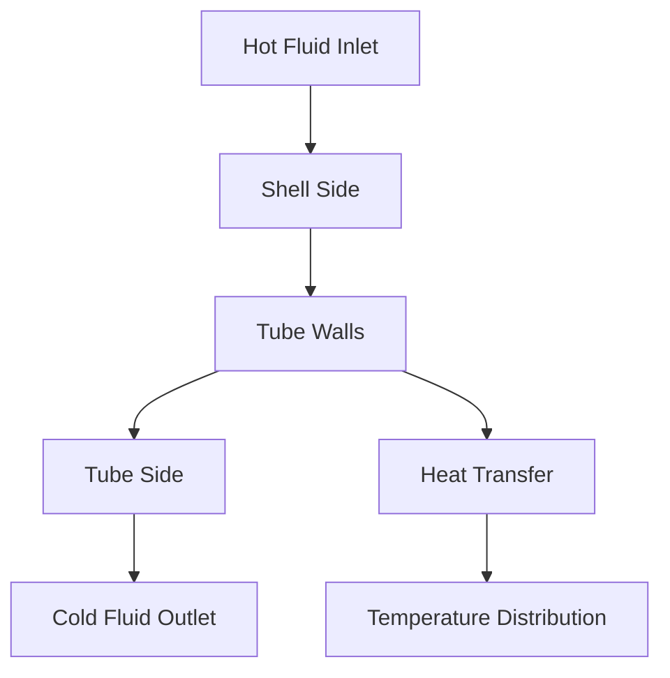

# การถ่ายเทความร้อนแบบควบคู่ (Conjugate Heat Transfer - CHT)

## 📐 1. แนวคิดพื้นฐาน

**Conjugate Heat Transfer (CHT)** คือการจำลองการถ่ายเทความร้อนที่มีการโต้ตอบกันระหว่างโดเมน **ของไหล (Fluid)** และ **ของแข็ง (Solid)** โดยความร้อนจะถูกพาโดยการไหลและนำผ่านโครงสร้างของแข็ง

> [!INFO] ความสำคัญของ CHT
> CHT เป็นเทคนิคที่สำคัญในการออกแบบระบบถ่ายเทความร้อน เช่น เครื่องแลกเปลี่ยนความร้อน ระบบระบายความร้อนอิเล็กทรอนิกส์ และ components ทางอุตสาหกรรม

### หลักการพื้นฐานของ CHT

การถ่ายเทความร้อนแบบควบคู่เกี่ยวข้องกับ:

1. **การพาความร้อน (Convection)** ในโดเมนของไหล
2. **การนำความร้อน (Conduction)** ในโดเมนของแข็ง
3. **การแลกเปลี่ยนความร้อน** ที่ interface ระหว่างของไหลและของแข็ง

---

## 🔗 2. เงื่อนไขที่อินเทอร์เฟซ (Interface Conditions)

ที่รอยต่อระหว่างของแข็งและของไหล จะต้องรักษาความต่อเนื่องสองประการ:

### 2.1 Temperature Continuity

อุณหภูมิต้องต่อเนื่องกันที่ interface:

$$T_{\text{fluid}} = T_{\text{solid}}$$

### 2.2 Heat Flux Continuity

ฟลักซ์ความร้อนต้องสมดุลกันที่ interface:

$$k_f \frac{\partial T_f}{\partial n} = k_s \frac{\partial T_s}{\partial n}$$

โดยที่:
- $k_f$ = สภาพนำความร้อนของของไหล
- $k_s$ = สภาพนำความร้อนของของแข็ง
- $\frac{\partial T_f}{\partial n}$ = ความชันอุณหภูมิของของไหลในแนวตั้งฉากกับ interface
- $\frac{\partial T_s}{\partial n}$ = ความชันอุณหภูมิของของแข็งในแนวตั้งฉากกับ interface


> **Figure 1:** แผนผังการเชื่อมโยงที่ส่วนต่อประสาน (Interface) ในการถ่ายเทความร้อนแบบควบคู่ (CHT) ซึ่งต้องรักษาความต่อเนื่องของอุณหภูมิ (Temperature Continuity) และความสมดุลของฟลักซ์ความร้อน (Flux Continuity) ระหว่างโดเมนของไหลและของแข็งตามกฎการอนุรักษ์พลังงาน

---

## 🏗️ 3. การนำไปใช้ใน OpenFOAM (Multi-Region)

OpenFOAM ใช้แนวทาง **Multi-region** โดยแบ่งโดเมนออกเป็นส่วนๆ และใช้ Solver **`chtMultiRegionFoam`**

### 3.1 โครงสร้างไฟล์

```bash
case/
├── 0/
│   ├── fluid/          # เงื่อนไขขอบเขตสำหรับโดเมนของไหล
│   │   ├── U           # Velocity
│   │   ├── p           # Pressure
│   │   ├── T           # Temperature
│   │   └── ...
│   └── solid/          # เงื่อนไขขอบเขตสำหรับโดเมนของแข็ง
│       └── T           # Temperature
├── constant/
│   ├── fluid/          # คุณสมบัติของไหล
│   │   ├── thermophysicalProperties
│   │   └── turbulenceProperties
│   ├── solid/          # คุณสมบัติของแข็ง
│   │   └── thermophysicalProperties
│   └── regionProperties # กำหนดว่าภูมิภาคใดเป็น fluid หรือ solid
└── system/
    ├── fluid/          # การตั้งค่า solver สำหรับของไหล
    │   ├── controlDict
    │   ├── fvSchemes
    │   └── fvSolution
    └── solid/          # การตั้งค่า solver สำหรับของแข็ง
        ├── controlDict
        ├── fvSchemes
        └── fvSolution
```

### 3.2 ไฟล์ regionProperties

```cpp
// constant/regionProperties
FoamFile
{
    version     2.0;
    format      ascii;
    class       dictionary;
    object      regionProperties;
}

regions
(
    fluid
    solid
);
```

### 3.3 ตัวอย่าง Boundary Condition ที่ Interface

#### 3.3.1 สำหรับโดเมนของไหล (Fluid Side)

```cpp
// 0/fluid/T
dimensions      [0 0 0 1 0 0 0];
internalField   uniform 300;

boundaryField
{
    // เงื่อนไขขอบเขตอื่นๆ

    fluid_to_solid_interface
    {
        type            compressible::turbulentTemperatureCoupledBaffleMixed;
        Tnbr            T;
        kappaMethod     fluidThermo;
        value           $internalField;
    }
}
```

#### 3.3.2 สำหรับโดเมนของแข็ง (Solid Side)

```cpp
// 0/solid/T
dimensions      [0 0 0 1 0 0 0];
internalField   uniform 300;

boundaryField
{
    // เงื่อนไขขอบเขตอื่นๆ

    solid_to_fluid_interface
    {
        type            compressible::turbulentTemperatureCoupledBaffleMixed;
        Tnbr            T;
        kappaMethod     solidThermo;
        value           $internalField;
    }
}
```

> [!TIP] การทำความเข้าใจ Boundary Condition
> - `Tnbr`: ชื่อฟิลด์อุณหภูมิใน region ที่เชื่อมโยง (neighbor)
> - `kappaMethod`: วิธีการคำนวณสภาพนำความร้อน (`fluidThermo` หรือ `solidThermo`)
> - BC นี้จะบังคับให้ทั้ง temperature และ heat flux continuity อัตโนมัติ

### 3.4 การตั้งค่า Thermophysical Properties

#### 3.4.1 สำหรับของไหล (Fluid)

```cpp
// constant/fluid/thermophysicalProperties
thermoType
{
    type            heRhoThermo;
    mixture         pureMixture;
    transport       const;
    thermo          hConst;
    equationOfState perfectGas;
    specie          specie;
    energy          sensibleEnthalpy;
}

mixture
{
    specie
    {
        molWeight       28.96;
    }
    thermodynamics
    {
        Cp              1005;
        Hf              0;
    }
    transport
    {
        mu              1.8e-5;
        Pr              0.71;
    }
}
```

#### 3.4.2 สำหรับของแข็ง (Solid)

```cpp
// constant/solid/thermophysicalProperties
thermoType
{
    type            heSolidThermo;
    mixture         pureMixture;
    transport       const;
    thermo          hConst;
    equationOfState rhoConst;
    specie          specie;
    energy          sensibleEnthalpy;
}

mixture
{
    specie
    {
        molWeight       28.96;
    }
    thermodynamics
    {
        Cp              450;    // J/(kg·K) สำหรับโลหะ
        Hf              0;
    }
    transport
    {
        kappa           50;     // W/(m·K) สภาพนำความร้อน
    }
}
```

---

## 📊 4. การประเมินประสิทธิภาพ (Performance Metrics)

### 4.1 Overall Heat Transfer Coefficient ($U$)

สัมประสิทธิ์การถ่ายเทความร้อนโดยรวม:

$$\frac{1}{U} = \frac{1}{h_h} + \frac{t_w}{k_w} + \frac{1}{h_c}$$

โดยที่:
- $U$ = สัมประสิทธิ์การถ่ายเทความร้อนโดยรวม [W/(m²·K)]
- $h_h$ = สัมประสิทธิ์การถ่ายเทความร้อนฝั่งร้อน [W/(m²·K)]
- $t_w$ = ความหนาของผนัง [m]
- $k_w$ = สภาพนำความร้อนของผนัง [W/(m·K)]
- $h_c$ = สัมประสิทธิ์การถ่ายเทความร้อนฝั่งเย็น [W/(m²·K)]

### 4.2 Effectiveness ($\varepsilon$)

ประสิทธิภาพของเครื่องแลกเปลี่ยนความร้อน:

$$\varepsilon = \frac{Q_{\text{actual}}}{Q_{\text{max}}}$$

โดยที่:
- $Q_{\text{actual}}$ = อัตราการถ่ายเทความร้อนจริง
- $Q_{\text{max}}$ = อัตราการถ่ายเทความร้อนสูงสุดตามทฤษฎี

### 4.3 การคำนวณใน OpenFOAM

```cpp
// การคำนวณสัมประสิทธิ์การถ่ายเทความร้อน
volScalarField hLocal
(
    -k*fvc::snGrad(T) / (T_wall - T_ref)
);

// ค่าเฉลี่ยบนพื้นผิว
scalar hAvg = average(hLocal.boundaryField()[wallPatchID]);

// Overall heat transfer coefficient
scalar U = 1.0 / (1.0/h_h + thickness/k_w + 1.0/h_c);
```

---

## ✅ 5. แนวทางปฏิบัติที่ดีที่สุด (Best Practices)

### 5.1 Consistent Mesh

แม้ OpenFOAM จะรองรับ Mesh ที่ไม่ตรงกันที่ Interface (AMI) แต่:

> [!WARNING] ข้อควรระวัง
> การใช้ Mesh ที่มีจุดตรงกัน (Conformal mesh) จะให้:
> - ความแม่นยำสูงกว่าในการคำนวณฟลักซ์ความร้อน
> - ความเสถียรที่ดีกว่าของการลู่เข้า
> - เวลาคำนวณที่เร็วกว่า

**แนะนำ:**
- ใช้ conformal mesh เมื่อเป็นไปได้
- หากต้องใช้ non-conformal mesh ให้ตรวจสอบค่า tolerance ของ AMI

### 5.2 Thermal Inertia

พึงระลึกว่าของแข็งมีสเกลเวลาการเปลี่ยนแปลงอุณหภูมิที่ช้ากว่าของไหลมาก:

$$\tau_{\text{thermal}} = \frac{\rho c_p L^2}{k}$$

ซึ่งอาจส่งผลต่อ:
- การลู่เข้าของผลเฉลยที่ช้าลง
- ความจำเป็นต้องใช้ under-relaxation สำหรับสมการอุณหภูมิ
- การเลือก time step ที่เหมาะสม

### 5.3 การตั้งค่า Solver

```cpp
// system/fluid/fvSolution
solvers
{
    T
    {
        solver          GAMG;
        tolerance       1e-6;
        relTol          0.01;
        smoother        GaussSeidel;
    }
}

relaxationFactors
{
    fields
    {
        T               0.7;    // ผ่อนคลายสำหรับอุณหภูมิ
    }
}
```

### 5.4 การตรวจสอบความถูกต้อง

**ตรวจสอบสมดุลพลังงาน:**
```bash
# คำนวณฟลักซ์ความร้อนที่ interface
postProcess -func "surfaceHeatFlux" -region fluid

# ตรวจสอบว่าฟลักซ์เข้าและออกสมดุลกัน
```

**ตรวจสอบ continuity ของอุณหภูมิ:**
- อุณหภูมิต้องต่อเนื่องกันที่ interface
- ความแตกต่างควรน้อยกว่าค่า tolerance ที่กำหนด

---

## 📖 6. ตัวอย่างการประยุกต์ใช้

### 6.1 Heat Exchanger

การจำลองเครื่องแลกเปลี่ยนความร้อนแบบ shell-and-tube:


> **Figure 2:** กลไกการถ่ายเทความร้อนในเครื่องแลกเปลี่ยนความร้อนแบบ Shell-and-Tube ซึ่งแสดงกระบวนการพาความร้อนของของไหลฝั่งร้อน การนำความร้อนผ่านผนังท่อ และการรับความร้อนของของไหลฝั่งเย็น นำไปสู่การกระจายอุณหภูมิที่สอดคล้องกันทั่วทั้งระบบความปลอดภัยทางฟิสิกส์ไม่ส่งผลกระทบต่อความเร็วในการจำลอง ผ่านการใช้พลังของ C++ Template Metaprogramming ในการตรวจสอบความสอดคล้องทางมิติทั้งหมดที่ขั้นตอนการคอมไพล์โปรแกรมเพียงครั้งเดียว

### 6.2 Electronic Cooling

การจำลองการระบายความร้อนของ electronic components:

- **Heat Source**: Components ที่ใช้พลังงานสูง
- **Heat Sink**: โครงสร้างโลหะสำหรับระบายความร้อน
- **Cooling Fluid**: อากาศหรือ coolant ที่ไหลผ่าน

### 6.3 Building Thermal Analysis

การวิเคราะห์ความร้อนในอาคาร:

- **ผนังอาคาร**: Solid domain พร้อมคุณสมบัติฉนวน
- **อากาศภายใน**: Fluid domain พร้อมการไหลเวียน
- **ภายนอกอาคาร**: Boundary conditions สำหรับสภาพอากาศ

---

## 🔬 7. หัวข้อขั้นสูง

### 7.1 Anisotropic Thermal Conductivity

สำหรับวัสดุที่มีสภาพนำความร้อนแตกต่างกันในแต่ละทิศทาง:

```cpp
// สภาพนำความร้อนแบบ anisotropic
volTensorField kappa
(
    IOobject
    (
        "kappa",
        runTime.timeName(),
        mesh,
        IOobject::NO_READ,
        IOobject::AUTO_WRITE
    ),
    mesh,
    dimensionedTensor
    (
        "kappa",
        dimensionSet(1 1 -3 -1 0 0 0),
        tensor(1, 0, 0, 0, 0.1, 0, 0, 0, 0.1)  // k_x, k_y, k_z
    )
);
```

### 7.2 Temperature-Dependent Properties

สำหรับคุณสมบัติที่แปรผันตามอุณหภูมิ:

```cpp
// สภาพนำความร้อนที่ขึ้นกับอุณหภูมิ
kappa = k0 * (1.0 + beta*(T - T0));
```

### 7.3 Phase Change Materials

การจำลองวัสดุที่มีการเปลี่ยนสถานะ:

```cpp
// แบบจำลอง enthalpy-porosity
volScalarField liquidFraction
(
    IOobject("liquidFraction", runTime.timeName(), mesh),
    mesh,
    dimensionedScalar("liquidFraction", dimless, 0)
);

forAll(liquidFraction, i)
{
    if (T[i] < Tsolidus)
    {
        liquidFraction[i] = 0;
    }
    else if (T[i] > Tliquidus)
    {
        liquidFraction[i] = 1;
    }
    else
    {
        liquidFraction[i] = (T[i] - Tsolidus)/(Tliquidus - Tsolidus);
    }
}
```

---

## 📚 8. บทสรุป

**Conjugate Heat Transfer** เป็นเทคนิคที่ทรงพลังใน OpenFOAM สำหรับการจำลองปัญหาความร้อนที่ซับซ้อน ซึ่งเกี่ยวข้องกับการโต้ตอบระหว่างของไหลและของแข็ง

**ประเด็นสำคัญ:**
1. ✅ ใช้ solver `chtMultiRegionFoam` สำหรับปัญหา CHT
2. ✅ ตั้งค่า boundary condition `turbulentTemperatureCoupledBaffleMixed` ที่ interface
3. ✅ รักษาความต่อเนื่องของทั้งอุณหภูมิและฟลักซ์ความร้อน
4. ✅ ใช้ conformal mesh เมื่อเป็นไปได้เพื่อความแม่นยำและเสถียรภาพ
5. ✅ พิจารณา thermal inertia ของของแข็งในการเลือก time step และ under-relaxation

**การนำไปประยุกต์ใช้:**
- เครื่องแลกเปลี่ยนความร้อน
- การระบายความร้อนอุปกรณ์อิเล็กทรอนิกส์
- การวิเคราะห์ความร้อนในอาคาร
- การออกแบบ components ทางอุตสาหกรรม

---

**จบเนื้อหาโมดูลการถ่ายเทความร้อน**
