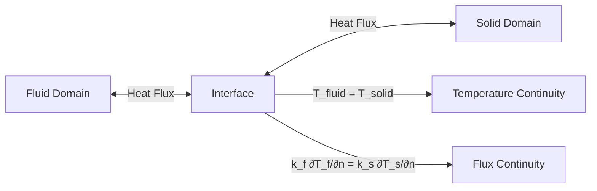
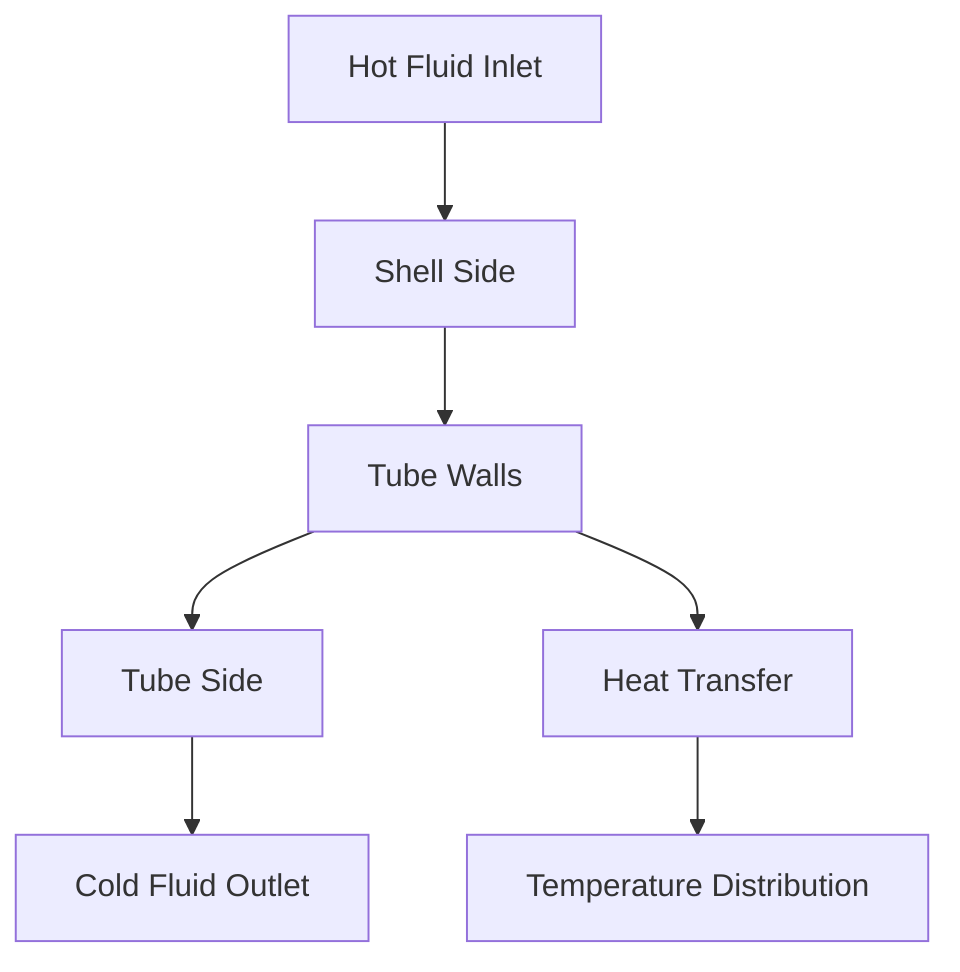

# การถ่ายเทความร้อนแบบควบคู่ (Conjugate Heat Transfer - CHT)

## 📐 1. แนวคิดพื้นฐาน

**Conjugate Heat Transfer (CHT)** คือการจำลองการถ่ายเทความร้อนที่มีการโต้ตอบกันระหว่างโดเมน **ของไหล (Fluid)** และ **ของแข็ง (Solid)** โดยความร้อนจะถูกพาโดยการไหลและนำผ่านโครงสร้างของแข็ง

> [!INFO] ความสำคัญของ CHT
> CHT เป็นเทคนิคที่สำคัญในการออกแบบระบบถ่ายเทความร้อน เช่น เครื่องแลกเปลี่ยนความร้อน ระบบระบายความร้อนอิเล็กทรอนิกส์ และ components ทางอุตสาหกรรม

### หลักการพื้นฐานของ CHT

การถ่ายเทความร้อนแบบควบคู่เกี่ยวข้องกับ:

1. **การพาความร้อน (Convection)** ในโดเมนของไหล
2. **การนำความร้อน (Conduction)** ในโดเมนของแข็ง
3. **การแลกเปลี่ยนความร้อน** ที่ interface ระหว่างของไหลและของแข็ง

---

## 🔗 2. เงื่อนไขที่อินเทอร์เฟซ (Interface Conditions)

ที่รอยต่อระหว่างของแข็งและของไหล จะต้องรักษาความต่อเนื่องสองประการ:

### 2.1 Temperature Continuity

อุณหภูมิต้องต่อเนื่องกันที่ interface:

$$T_{\text{fluid}} = T_{\text{solid}}$$

### 2.2 Heat Flux Continuity

ฟลักซ์ความร้อนต้องสมดุลกันที่ interface:

$$k_f \frac{\partial T_f}{\partial n} = k_s \frac{\partial T_s}{\partial n}$$

โดยที่:
- $k_f$ = สภาพนำความร้อนของของไหล
- $k_s$ = สภาพนำความร้อนของของแข็ง
- $\frac{\partial T_f}{\partial n}$ = ความชันอุณหภูมิของของไหลในแนวตั้งฉากกับ interface
- $\frac{\partial T_s}{\partial n}$ = ความชันอุณหภูมิของของแข็งในแนวตั้งฉากกับ interface


> **Figure 1:** แผนผังการเชื่อมโยงที่ส่วนต่อประสาน (Interface) ในการถ่ายเทความร้อนแบบควบคู่ (CHT) ซึ่งต้องรักษาความต่อเนื่องของอุณหภูมิ (Temperature Continuity) และความสมดุลของฟลักซ์ความร้อน (Flux Continuity) ระหว่างโดเมนของไหลและของแข็งตามกฎการอนุรักษ์พลังงาน

---

## 🏗️ 3. การนำไปใช้ใน OpenFOAM (Multi-Region)

OpenFOAM ใช้แนวทาง **Multi-region** โดยแบ่งโดเมนออกเป็นส่วนๆ และใช้ Solver **`chtMultiRegionFoam`**

### 3.1 โครงสร้างไฟล์

```bash
case/
├── 0/
│   ├── fluid/          # เงื่อนไขขอบเขตสำหรับโดเมนของไหล
│   │   ├── U           # Velocity
│   │   ├── p           # Pressure
│   │   ├── T           # Temperature
│   │   └── ...
│   └── solid/          # เงื่อนไขขอบเขตสำหรับโดเมนของแข็ง
│       └── T           # Temperature
├── constant/
│   ├── fluid/          # คุณสมบัติของไหล
│   │   ├── thermophysicalProperties
│   │   └── turbulenceProperties
│   ├── solid/          # คุณสมบัติของแข็ง
│   │   └── thermophysicalProperties
│   └── regionProperties # กำหนดว่าภูมิภาคใดเป็น fluid หรือ solid
└── system/
    ├── fluid/          # การตั้งค่า solver สำหรับของไหล
    │   ├── controlDict
    │   ├── fvSchemes
    │   └── fvSolution
    └── solid/          # การตั้งค่า solver สำหรับของแข็ง
        ├── controlDict
        ├── fvSchemes
        └── fvSolution
```

### 3.2 ไฟล์ regionProperties

```cpp
// constant/regionProperties
// Define regions in the multi-region simulation
FoamFile
{
    version     2.0;
    format      ascii;
    class       dictionary;
    object      regionProperties;
}

// List of all regions in the simulation
regions
(
    fluid    // Fluid region name
    solid    // Solid region name
);
```

> **📂 Source:** ไฟล์การตั้งค่าภูมิภาค (regionProperties) ใน OpenFOAM สำหรับการจำลองแบบ multi-region  
> **คำอธิบาย:** ไฟล์นี้มีหน้าที่กำหนดว่าโดเมนการจำลองประกอบด้วยภูมิภาคใดบ้าง โดยแต่ละภูมิภาคจะมีไดเรกทอรี 0/, constant/, และ system/ ของตัวเองเพื่อเก็บการตั้งค่าเฉพาะสำหรับภูมิภาคนั้นๆ  
> **แนวคิดสำคัญ:**
> - **Region-based approach**: แต่ละภูมิภาคทำงานแบบอิสระ แต่เชื่อมโยงกันที่ interface ผ่าน boundary conditions
> - **Parallel computing**: แต่ละ region สามารถคำนวณแบบขนานได้
> - **Flexibility**: รองรับหลายชนิดของไหลและวัสดุแข็งในการจำลองครั้งเดียว

### 3.3 ตัวอย่าง Boundary Condition ที่ Interface

#### 3.3.1 สำหรับโดเมนของไหล (Fluid Side)

```cpp
// 0/fluid/T - Temperature boundary condition for fluid region
dimensions      [0 0 0 1 0 0 0];    // Temperature dimensions [K]
internalField   uniform 300;        // Initial temperature field [K]

boundaryField
{
    // Other boundary conditions...

    // Interface between fluid and solid regions
    fluid_to_solid_interface
    {
        // Coupled boundary condition for CHT
        type            compressible::turbulentTemperatureCoupledBaffleMixed;
        
        // Name of temperature field in neighboring region
        Tnbr            T;
        
        // Method to calculate thermal conductivity
        kappaMethod     fluidThermo;
        
        // Initial value (will be overwritten during solving)
        value           $internalField;
    }
}
```

> **📂 Source:** ไฟล์เงื่อนไขขอบเขตอุณหภูมิ (0/fluid/T) สำหรับโดเมนของไหลใน OpenFOAM  
> **คำอธิบาย:** Boundary Condition นี้ใช้สำหรับเชื่อมโยงการถ่ายเทความร้อนระหว่างโดเมนของไหลและของแข็ง โดยรักษาความต่อเนื่องของทั้งอุณหภูมิและฟลักซ์ความร้อนอัตโนมัติ  
> **แนวคิดสำคัญ:**
> - **Coupled BC**: Boundary condition แบบคู่ (coupled) ที่ทำงานร่วมกับ region อื่น
> - **Tnbr**: ชื่อฟิลด์อุณหภูมิใน region เพื่อนบ้าน (neighbor) ที่ต้องการเชื่อมโยง
> - **kappaMethod**: วิธีการคำนวณสัมประสิทธิ์การนำความร้อน (fluidThermo/solidThermo/lookup)
> - **Automatic enforcement**: BC นี้บังคับใช้ continuity ของ temperature และ heat flux โดยอัตโนมัติ

#### 3.3.2 สำหรับโดเมนของแข็ง (Solid Side)

```cpp
// 0/solid/T - Temperature boundary condition for solid region
dimensions      [0 0 0 1 0 0 0];    // Temperature dimensions [K]
internalField   uniform 300;        // Initial temperature field [K]

boundaryField
{
    // Other boundary conditions...

    // Interface between solid and fluid regions
    solid_to_fluid_interface
    {
        // Coupled boundary condition for CHT (must match fluid side)
        type            compressible::turbulentTemperatureCoupledBaffleMixed;
        
        // Name of temperature field in neighboring region
        Tnbr            T;
        
        // Method to calculate thermal conductivity
        kappaMethod     solidThermo;
        
        // Initial value (will be overwritten during solving)
        value           $internalField;
    }
}
```

> **📂 Source:** ไฟล์เงื่อนไขขอบเขตอุณหภูมิ (0/solid/T) สำหรับโดเมนของแข็งใน OpenFOAM  
> **คำอธิบาย:** Boundary Condition ฝั่งของแข็งที่ต้องสัมพันธ์กับฝั่งของไหล โดยค่าของ `type`, `Tnbr` และ `kappaMethod` ต้องกำหนดให้สอดคล้องกัน  
> **แนวคิดสำคัญ:**
> - **Symmetry**: การตั้งค่า BC ทั้งสองฝั่งต้องสอดคล้องกัน (consistent)
> - **Solid thermo**: ใช้ `solidThermo` เพื่อคำนวณ thermal conductivity จากคุณสมบัติของวัสดุแข็ง
> - **Heat balance**: ฟลักซ์ความร้อนที่ interface จะสมดุลกันโดยอัตโนมัติ

> [!TIP] การทำความเข้าใจ Boundary Condition
> - `Tnbr`: ชื่อฟิลด์อุณหภูมิใน region ที่เชื่อมโยง (neighbor)
> - `kappaMethod`: วิธีการคำนวณสภาพนำความร้อน (`fluidThermo` หรือ `solidThermo`)
> - BC นี้จะบังคับให้ทั้ง temperature และ heat flux continuity อัตโนมัติ

### 3.4 การตั้งค่า Thermophysical Properties

#### 3.4.1 สำหรับของไหล (Fluid)

```cpp
// constant/fluid/thermophysicalProperties
// Thermophysical properties for fluid region
thermoType
{
    type            heRhoThermo;           // Thermodynamics type for compressible fluid
    mixture         pureMixture;           // Single component fluid
    transport       const;                 // Constant transport properties
    thermo          hConst;                // Constant specific heat
    equationOfState perfectGas;            // Perfect gas equation of state
    specie          specie;                // Species properties
    energy          sensibleEnthalpy;      // Use sensible enthalpy for energy
}

mixture
{
    specie
    {
        molWeight       28.96;             // Molecular weight [kg/kmol] for air
    }
    thermodynamics
    {
        Cp              1005;              // Specific heat at constant pressure [J/(kg·K)]
        Hf              0;                 // Heat of formation [J/kg]
    }
    transport
    {
        mu              1.8e-5;            // Dynamic viscosity [Pa·s]
        Pr              0.71;              // Prandtl number
    }
}
```

> **📂 Source:** ไฟล์คุณสมบัติทางเทอร์โมไดนามิกส์ (constant/fluid/thermophysicalProperties)  
> **คำอธิบาย:** กำหนดคุณสมบัติทางเคมีและฟิสิกส์ของของไหลที่ใช้ในการจำลอง ซึ่งมีผลต่อการคำนวณสมการการถ่ายเทความร้อนและการไหล  
> **แนวคิดสำคัญ:**
> - **heRhoThermo**: คำนวณคุณสมบัติจากความหนาแน่นและเอนทาลปี
> - **Perfect gas**: ใช้สมการสถานะของก๊าซอุดมคติ (p = ρRT)
> - **Prandtl number**: ใช้ในการคำนวณสัมประสิทธิ์การนำความร้อนจากความหนืด (k = μCp/Pr)
> - **Sensible enthalpy**: พิจารณาเฉพาะพลังงานที่เกี่ยวข้องกับการเปลี่ยนแปลงอุณหภูมิ

#### 3.4.2 สำหรับของแข็ง (Solid)

```cpp
// constant/solid/thermophysicalProperties
// Thermophysical properties for solid region
thermoType
{
    type            heSolidThermo;         // Thermodynamics type for solid
    mixture         pureMixture;           // Single component material
    transport       const;                 // Constant transport properties
    thermo          hConst;                // Constant specific heat
    equationOfState rhoConst;              // Constant density equation of state
    specie          specie;                // Species properties
    energy          sensibleEnthalpy;      // Use sensible enthalpy for energy
}

mixture
{
    specie
    {
        molWeight       28.96;             // Molecular weight [kg/kmol]
    }
    thermodynamics
    {
        Cp              450;               // Specific heat [J/(kg·K)] for metal (e.g., steel)
        Hf              0;                 // Heat of formation [J/kg]
    }
    transport
    {
        kappa           50;                // Thermal conductivity [W/(m·K)] for metal
    }
}
```

> **📂 Source:** ไฟล์คุณสมบัติทางเทอร์โมไดนามิกส์ (constant/solid/thermophysicalProperties)  
> **คำอธิบาย:** กำหนดคุณสมบัติทางเทอร์มอลของวัสดุแข็ง ซึ่งส่วนใหญ่เป็นค่าคงที่ไม่แปรผันตามเวลาหรืออุณหภูมิ  
> **แนวคิดสำคัญ:**
> - **heSolidThermo**: คำนวณเฉพาะ conduction ในของแข็ง (ไม่มี convection)
> - **rhoConst**: ความหนาแน่นของแข็งเป็นค่าคงที่
> - **kappa**: สัมประสิทธิ์การนำความร้อนเป็นค่าสำคัญที่สุดในการกำหนดอัตราการนำความร้อน
> - **Heat capacity**: Cp ใช้ในการคำนวณ thermal inertia (ความสามารถในการเก็บพลังงานความร้อน)

---

## 📊 4. การประเมินประสิทธิภาพ (Performance Metrics)

### 4.1 Overall Heat Transfer Coefficient ($U$)

สัมประสิทธิ์การถ่ายเทความร้อนโดยรวม:

$$\frac{1}{U} = \frac{1}{h_h} + \frac{t_w}{k_w} + \frac{1}{h_c}$$

โดยที่:
- $U$ = สัมประสิทธิ์การถ่ายเทความร้อนโดยรวม [W/(m²·K)]
- $h_h$ = สัมประสิทธิ์การถ่ายเทความร้อนฝั่งร้อน [W/(m²·K)]
- $t_w$ = ความหนาของผนัง [m]
- $k_w$ = สภาพนำความร้อนของผนัง [W/(m·K)]
- $h_c$ = สัมประสิทธิ์การถ่ายเทความร้อนฝั่งเย็น [W/(m²·K)]

### 4.2 Effectiveness ($\varepsilon$)

ประสิทธิภาพของเครื่องแลกเปลี่ยนความร้อน:

$$\varepsilon = \frac{Q_{\text{actual}}}{Q_{\text{max}}}$$

โดยที่:
- $Q_{\text{actual}}$ = อัตราการถ่ายเทความร้อนจริง
- $Q_{\text{max}}$ = อัตราการถ่ายเทความร้อนสูงสุดตามทฤษฎี

### 4.3 การคำนวณใน OpenFOAM

```cpp
// Calculate local heat transfer coefficient [W/(m²·K)]
// at the wall boundary using Fourier's law: q = -k∇T
volScalarField hLocal
(
    // Heat flux divided by temperature difference
    -k * fvc::snGrad(T) / (T_wall - T_ref)
);

// Average heat transfer coefficient over the wall surface
scalar hAvg = average(hLocal.boundaryField()[wallPatchID]);

// Calculate overall heat transfer coefficient
// considering both fluid and solid sides with wall resistance
scalar U = 1.0 / (1.0/h_h + thickness/k_w + 1.0/h_c);
```

> **📂 Source:** โค้ดการคำนวณสัมประสิทธิ์การถ่ายเทความร้อนใน OpenFOAM  
> **คำอธิบาย:** การคำนวณค่าสัมประสิทธิ์การถ่ายเทความร้อน (Heat Transfer Coefficient) จากผลการจำลอง CHT โดยใช้กฎของ Fourier ในการคำนวณฟลักซ์ความร้อน  
> **แนวคิดสำคัญ:**
> - **snGrad(T)**: คำนวณ gradient ของอุณหภูมิในแนวตั้งฉากกับผิว (surface normal gradient)
> - **Local vs Average**: hLocal ให้ค่าทุกจุดบนผิว ส่วน hAvg ให้ค่าเฉลี่ยทั้งผิว
> - **Reference temperature**: T_ref คืออุณหภูมิอ้างอิง (เช่น bulk temperature ของของไหล)
> - **Overall U**: คำนวณจากความต้านทานความร้อนรวมของทั้งระบบ (thermal resistance network)

---

## ✅ 5. แนวทางปฏิบัติที่ดีที่สุด (Best Practices)

### 5.1 Consistent Mesh

แม้ OpenFOAM จะรองรับ Mesh ที่ไม่ตรงกันที่ Interface (AMI) แต่:

> [!WARNING] ข้อควรระวัง
> การใช้ Mesh ที่มีจุดตรงกัน (Conformal mesh) จะให้:
> - ความแม่นยำสูงกว่าในการคำนวณฟลักซ์ความร้อน
> - ความเสถียรที่ดีกว่าของการลู่เข้า
> - เวลาคำนวณที่เร็วกว่า

**แนะนำ:**
- ใช้ conformal mesh เมื่อเป็นไปได้
- หากต้องใช้ non-conformal mesh ให้ตรวจสอบค่า tolerance ของ AMI

### 5.2 Thermal Inertia

พึงระลึกว่าของแข็งมีสเกลเวลาการเปลี่ยนแปลงอุณหภูมิที่ช้ากว่าของไหลมาก:

$$\tau_{\text{thermal}} = \frac{\rho c_p L^2}{k}$$

ซึ่งอาจส่งผลต่อ:
- การลู่เข้าของผลเฉลยที่ช้าลง
- ความจำเป็นต้องใช้ under-relaxation สำหรับสมการอุณหภูมิ
- การเลือก time step ที่เหมาะสม

### 5.3 การตั้งค่า Solver

```cpp
// system/fluid/fvSolution
// Solver settings for temperature equation in fluid region
solvers
{
    T
    {
        // Use Geometric-Algebraic Multi-Grid solver for efficiency
        solver          GAMG;
        
        // Absolute convergence tolerance
        tolerance       1e-6;
        
        // Relative convergence tolerance (1% of initial residual)
        relTol          0.01;
        
        // Smoother for pre- and post-smoothing in GAMG
        smoother        GaussSeidel;
    }
}

// Under-relaxation factors to improve stability
relaxationFactors
{
    fields
    {
        // Reduce temperature update to 70% of calculated value
        T               0.7;
    }
}
```

> **📂 Source:** ไฟล์การตั้งค่า solver (system/fluid/fvSolution) สำหรับการแก้สมการอุณหภูมิ  
> **คำอธิบาย:** ตั้งค่าพารามิเตอร์ solver และ under-relaxation เพื่อให้การแก้สมการอุณหภูมิมีความเสถียรและลู่เข้าได้ดี  
> **แนวคิดสำคัญ:**
> - **GAMG**: Geometric-Algebraic Multi-Grid solver เหมาะกับปัญหาที่มี mesh จำนวนมาก
> - **Tolerance**: ค่ายอมรับที่ 1e-6 และ relative tolerance ที่ 1% ให้ความสมดุลระหว่างความแม่นยำและเวลาคำนวณ
> - **Under-relaxation**: ลดการอัปเดตค่า T เพื่อป้องกันการ oscillate ในการแก้สมการที่มี coupling แบบ strong (fluid-structure interaction)

### 5.4 การตรวจสอบความถูกต้อง

**ตรวจสอบสมดุลพลังงาน:**
```bash
# คำนวณฟลักซ์ความร้อนที่ interface
postProcess -func "surfaceHeatFlux" -region fluid

# ตรวจสอบว่าฟลักซ์เข้าและออกสมดุลกัน
```

**ตรวจสอบ continuity ของอุณหภูมิ:**
- อุณหภูมิต้องต่อเนื่องกันที่ interface
- ความแตกต่างควรน้อยกว่าค่า tolerance ที่กำหนด

---

## 📖 6. ตัวอย่างการประยุกต์ใช้

### 6.1 Heat Exchanger

การจำลองเครื่องแลกเปลี่ยนความร้อนแบบ shell-and-tube:


> **Figure 2:** กลไกการถ่ายเทความร้อนในเครื่องแลกเปลี่ยนความร้อนแบบ Shell-and-Tube ซึ่งแสดงกระบวนการพาความร้อนของของไหลฝั่งร้อน การนำความร้อนผ่านผนังท่อ และการรับความร้อนของของไหลฝั่งเย็น นำไปสู่การกระจายอุณหภูมิที่สอดคล้องกันทั่วทั้งระบบ

### 6.2 Electronic Cooling

การจำลองการระบายความร้อนของ electronic components:

- **Heat Source**: Components ที่ใช้พลังงานสูง
- **Heat Sink**: โครงสร้างโลหะสำหรับระบายความร้อน
- **Cooling Fluid**: อากาศหรือ coolant ที่ไหลผ่าน

### 6.3 Building Thermal Analysis

การวิเคราะห์ความร้อนในอาคาร:

- **ผนังอาคาร**: Solid domain พร้อมคุณสมบัติฉนวน
- **อากาศภายใน**: Fluid domain พร้อมการไหลเวียน
- **ภายนอกอาคาร**: Boundary conditions สำหรับสภาพอากาศ

---

## 🔬 7. หัวข้อขั้นสูง

### 7.1 Anisotropic Thermal Conductivity

สำหรับวัสดุที่มีสภาพนำความร้อนแตกต่างกันในแต่ละทิศทาง:

```cpp
// Anisotropic thermal conductivity tensor [W/(m·K)]
// Different conductivity values in x, y, z directions
volTensorField kappa
(
    IOobject
    (
        "kappa",                    // Field name
        runTime.timeName(),         // Time directory
        mesh,                       // Mesh reference
        IOobject::NO_READ,          // Do not read from file
        IOobject::AUTO_WRITE        // Auto-write to file
    ),
    mesh,
    dimensionedTensor
    (
        "kappa",                    // Name
        dimensionSet(1 1 -3 -1 0 0 0),  // Dimensions [W/(m·K)]
        // Tensor components: xx, xy, xz, yx, yy, yz, zx, zy, zz
        // High conductivity in x-direction, low in y and z
        tensor(1, 0, 0, 0, 0.1, 0, 0, 0, 0.1)
    )
);
```

> **📂 Source:** การกำหนดสัมประสิทธิ์การนำความร้อนแบบ anisotropic ใน OpenFOAM  
> **คำอธิบาย:** สำหรับวัสดุที่มีสภาพนำความร้อนแตกต่างกันในแต่ละทิศทาง (เช่น composite materials, crystals) จำเป็นต้องใช้ tensor แทน scalar  
> **แนวคิดสำคัญ:**
> - **Tensor notation**: ค่าทแยงมุม (xx, yy, zz) เป็นค่าหลัก ค่านอกทแยงมุม (xy, xz, ...) เป็นค่า cross-coupling
> - **Orthotropic materials**: กรณีที่ค่านอกทแยงมุมเป็นศูนย์ (เช่นในตัวอย่าง)
> - **Heat flux direction**: ฟลักซ์ความร้อนไม่จำเป็นต้องตั้งฉากกับความชันอุณหภูมิในกรณี anisotropic
> - **Applications**: ใช้ในวัสดุคอมโพสิต ผลึก และวัสดุที่มีโครงสร้าง directional

### 7.2 Temperature-Dependent Properties

สำหรับคุณสมบัติที่แปรผันตามอุณหภูมิ:

```cpp
// Temperature-dependent thermal conductivity model
// Linear variation: kappa(T) = k0 * (1 + beta*(T - T0))
scalar k0 = 50.0;           // Reference thermal conductivity at T0 [W/(m·K)]
scalar beta = 0.001;        // Temperature coefficient [1/K]
scalar T0 = 300.0;          // Reference temperature [K]

// Calculate thermal conductivity as function of temperature
kappa = k0 * (1.0 + beta*(T - T0));
```

> **📂 Source:** การจำลองสมบัติวัสดุที่ขึ้นกับอุณหภูมิใน OpenFOAM  
> **คำอธิบาย:** ในทางปฏิบัติ สัมประสิทธิ์การนำความร้อนของวัสดุส่วนใหญ่จะแปรผันตามอุณหภูมิ ซึ่งส่งผลต่อความแม่นยำของการจำลอง  
> **แนวคิดสำคัญ:**
> - **Linear approximation**: แบบจำลองเชิงเส้นเหมาะสำหรับช่วงอุณหภูมิที่ไม่กว้างนัก
> - **Non-linear behavior**: สำหรับช่วงอุณหภูมิกว้าง อาจต้องใช้ polynomial หรือ table lookup
> - **Iterative coupling**: คุณสมบัติที่แปรผันตาม T ทำให้เกิด non-linearity ในสมการ
> - **Material database**: ควรดึงค่าสัมประสิทธิ์จากแหล่งข้อมูลวัสดุที่เชื่อถือได้

### 7.3 Phase Change Materials

การจำลองวัสดุที่มีการเปลี่ยนสถานะ:

```cpp
// Enthalpy-porosity method for phase change modeling
// Calculate liquid fraction based on temperature
volScalarField liquidFraction
(
    IOobject("liquidFraction", runTime.timeName(), mesh),
    mesh,
    dimensionedScalar("liquidFraction", dimless, 0)
);

// Define phase change temperatures
scalar Tsolidus = 600.0;    // Solidus temperature [K] - start of melting
scalar Tliquidus = 650.0;   // Liquidus temperature [K] - end of melting

// Calculate liquid fraction for each cell
forAll(liquidFraction, i)
{
    if (T[i] < Tsolidus)
    {
        // Below solidus: completely solid
        liquidFraction[i] = 0;
    }
    else if (T[i] > Tliquidus)
    {
        // Above liquidus: completely liquid
        liquidFraction[i] = 1;
    }
    else
    {
        // In mushy zone: linear interpolation
        liquidFraction[i] = (T[i] - Tsolidus)/(Tliquidus - Tsolidus);
    }
}
```

> **📂 Source:** การจำลองการเปลี่ยนสถานะของวัสดุ (Phase Change) ใน OpenFOAM  
> **คำอธิบาย:** แบบจำลอง Enthalpy-Porosity ใช้สำหรับจำลองกระบวนการหลอมละลายและเกิดผลึก โดยพิจารณาบริเวณ Mushy Zone ที่มีทั้งของแข็งและของไหลปนกัน  
> **แนวคิดสำคัญ:**
> - **Mushy zone**: ช่วงอุณหภูมิระหว่าง solidus และ liquidus ที่วัสดุอยู่ในสถานะผสม
> - **Latent heat**: พลังงานที่ใช้ในการเปลี่ยนสถานะจะถูกพิจารณาผ่าน enthalpy
> - **Porosity**: ในแบบจำลอง เหมือง (porous media) ถูกจำลองในบริเวณ mushy zone เพื่อจำลองความต้านทานต่อการไหล
> - **Applications**: ใช้ในการจำลองการหลอมโลหะ, การเก็บพลังงานความร้อน (PCM), และการเย็นแข็ง

---

## 📚 8. บทสรุป

**Conjugate Heat Transfer** เป็นเทคนิคที่ทรงพลังใน OpenFOAM สำหรับการจำลองปัญหาความร้อนที่ซับซ้อน ซึ่งเกี่ยวข้องกับการโต้ตอบระหว่างของไหลและของแข็ง

**ประเด็นสำคัญ:**
1. ✅ ใช้ solver `chtMultiRegionFoam` สำหรับปัญหา CHT
2. ✅ ตั้งค่า boundary condition `turbulentTemperatureCoupledBaffleMixed` ที่ interface
3. ✅ รักษาความต่อเนื่องของทั้งอุณหภูมิและฟลักซ์ความร้อน
4. ✅ ใช้ conformal mesh เมื่อเป็นไปได้เพื่อความแม่นยำและเสถียรภาพ
5. ✅ พิจารณา thermal inertia ของของแข็งในการเลือก time step และ under-relaxation

**การนำไปประยุกต์ใช้:**
- เครื่องแลกเปลี่ยนความร้อน
- การระบายความร้อนอุปกรณ์อิเล็กทรอนิกส์
- การวิเคราะห์ความร้อนในอาคาร
- การออกแบบ components ทางอุตสาหกรรม

---

**จบเนื้อหาโมดูลการถ่ายเทความร้อน**