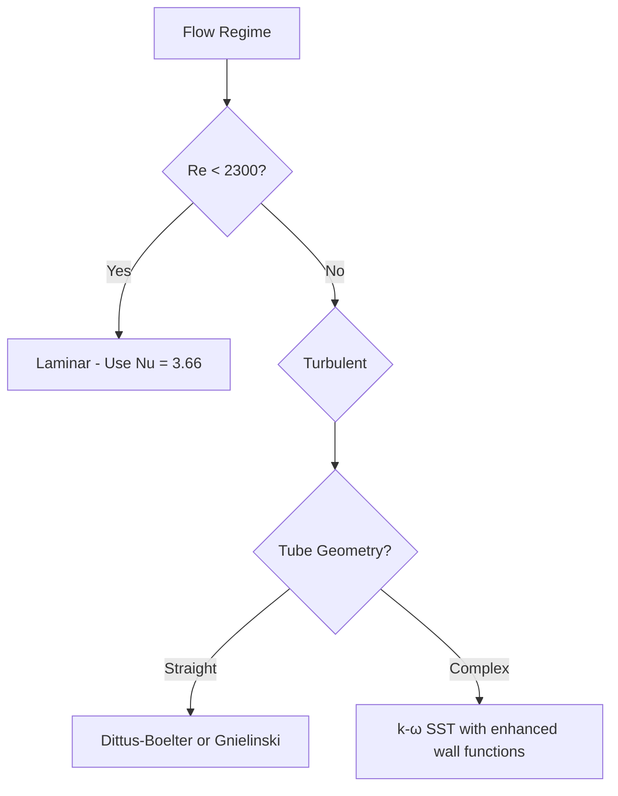

# R410A Single-Phase Flow Properties

> R410A Refrigerant Flow Analysis for Single-Phase Conditions

## Overview

This section provides comprehensive properties and correlations for R410A single-phase flow, essential for accurate CFD simulations of refrigerant flow in heat exchangers and HVAC systems. The content covers both liquid and vapor phases, with specific focus on thermophysical properties, heat transfer correlations, and turbulence modeling considerations.

### Why Study R410A Single-Phase Flow?

**⭐ Key Applications:**
- Pre-heating and superheating zones in evaporators
- Post-condensing and subcooling zones in condensers
- Single-phase refrigerant transport in piping systems
- Safety analysis of refrigerant flow components

**⭐ Why R410A?**
- Commonly used replacement for R22 in HVAC systems
- High pressure operation (≈2.6 MPa at condenser conditions)
- Temperature glide during phase change (non-azeotropic mixture)
- Requires accurate property models for simulation accuracy

## Key Learning Objectives

| Objective | Description | Application |
|----------|-------------|-------------|
| **Property Modeling** | Understand R410A thermophysical properties | Accurate simulation results |
| **Heat Transfer** | Implement proper Nusselt correlations | Heat exchanger design |
| **Turbulence** | Apply suitable turbulence models | Flow prediction accuracy |
| **Validation** | Compare with experimental data | Model verification |

---

## Physical Properties Overview

### Liquid Phase Properties (10°C, 1.0 MPa)
- Density (ρ): 1200 kg/m³
- Dynamic viscosity (μ): 1.2×10⁻⁴ Pa·s
- Kinematic viscosity (ν): 1.0×10⁻⁷ m²/s
- Thermal conductivity (k): 0.08 W/m·K
- Prandtl number (Pr): 2.25

### Vapor Phase Properties (10°C, 1.0 MPa)
- Density (ρ): 70 kg/m³
- Dynamic viscosity (μ): 1.3×10⁻⁵ Pa·s
- Kinematic viscosity (ν): 1.86×10⁻⁷ m²/s
- Thermal conductivity (k): 0.014 W/m·K
- Prandtl number (Pr): 1.12

> **⭐ Note:** These values are typical but should be verified against CoolProp or REFPROP for specific conditions

---

## Nusselt Number Correlations

### Dittus-Boelter Correlation (Liquid Phase)
$$
Nu = 0.023 Re^{0.8} Pr^{0.4}
$$

**Applicability:**
- Smooth tubes
- Reynolds number: 4,000 < Re < 100,000
- Prandtl number: 0.6 < Pr < 160
- Heating cases (n = 0.4)

### Gnielinski Correlation (Vapor Phase)
$$
Nu = \frac{(f/8)(Re-1000)Pr}{1 + 12.7(f/8)^{0.5}(Pr^{2/3}-1)}
$$

**Where f is the Darcy friction factor:**
$$
f = (1.82 \log_{10}(Re) - 1.64)^{-2}
$$

**Applicability:**
- Reynolds number: Re > 3,000
- Prandtl number: 0.5 < Pr < 2000
- More accurate than Dittus-Boelter for wider range

---

## Turbulence Modeling Considerations

### Recommended Models for R410A Flow

| Model | Liquid Phase | Vapor Phase | Rationale |
|-------|-------------|-------------|-----------|
| **k-ε Standard** | ✅ | ✅ | Good for high Reynolds numbers |
| **k-ω SST** | ✅ | ✅ | Better near-wall treatment |
| **Spalart-Allmaras** | ❌ | ✅ | Good for simple flows |

### Wall Function Compatibility
- Standard wall functions work well for R410A
- Enhanced treatment needed near phase change regions
- Consider y+ requirements:
  - Standard wall functions: y+ > 30
  - Enhanced wall functions: y+ ≈ 1-5

---

## Practical Implementation in OpenFOAM

### Setting Up R410A Properties

```cpp
// File: constant/transportProperties
transportModel  Newtonian;

nu              nu [ 0 2 -1 0 0 0 0 ]  (1e-6);  // Kinematic viscosity
rho             rho [ 1 -3 0 0 0 0 0 ]    (1200); // Density
```

### Thermal Properties Setup

```cpp
// File: constant/thermophysicalProperties
thermoType
{
    type            heRhoThermo;
    mixture         pureMixture;
    transport       const;
    thermo          hConst;
    equationOfState icoPoly8;
    specie          specie;
    energy          sensibleEnthalpy;
}

mixture
{
    specie
    {
        nMoles          1;
        molWeight       72.585;  // R410A molar mass
    }
    thermodynamics
    {
        Cp              1800;    // Specific heat capacity
        Hf              0;
    }
    transport
    {
        mu              1.2e-4;  // Dynamic viscosity
        Pr              2.25;
    }
}
```

---

## Validation Requirements

### Minimum Validation Cases
1. **Single-phase flow in straight pipe**
   - Pressure drop comparison
   - Heat transfer coefficient comparison

2. **Flow through fittings**
   - Minor loss coefficients
   - Turbulent mixing analysis

3. **Heat exchanger tubes**
   - Overall heat transfer coefficient
   - Temperature distribution

### Experimental Data Sources
- [ASHRAE Handbook - Fundamentals](https://www.ashrae.org)
- [REFPROP Database](https://www.nist.gov/srd/refprop)
- [CoolProp Library](http://www.coolprop.org)

---

## Module Structure

```
04_R410A_SINGLE_PHASE_FLOW/
├── 00_Overview.md                    # This file
├── 01_Liquid_Phase_Properties.md    # Liquid phase properties
├── 02_Vapor_Phase_Properties.md     # Vapor phase properties
├── 03_Heat_Transfer_Correlations.md # Nusselt correlations
├── 04_Turbulence_Modeling.md        # Turbulence considerations
└── 05_Validation_Cases.md           # Validation examples
```

### Learning Path
1. Start with **Liquid Phase Properties** (01)
2. Study **Vapor Phase Properties** (02)
3. Master **Heat Transfer Correlations** (03)
4. Learn **Turbulence Modeling** (04)
5. Practice **Validation Cases** (05)

---

## Quick References

### Property Tables
- **Table 1:** Liquid phase properties vs. temperature
- **Table 2:** Vapor phase properties vs. temperature
- **Table 3:** Property ratios for dimensionless analysis

### Correlation Selection Guide


### OpenFOAM Setup Checklist
- [ ] Transport properties defined
- [ ] Turbulence model selected
- [ ] Wall functions appropriate
- [ ] Boundary conditions set
- [ ] Mesh quality verified (y+ requirements)

---

**Prerequisites:** Understanding of single-phase flow fundamentals from previous modules
**Next:** [Liquid Phase Properties](01_Liquid_Phase_Properties.md)