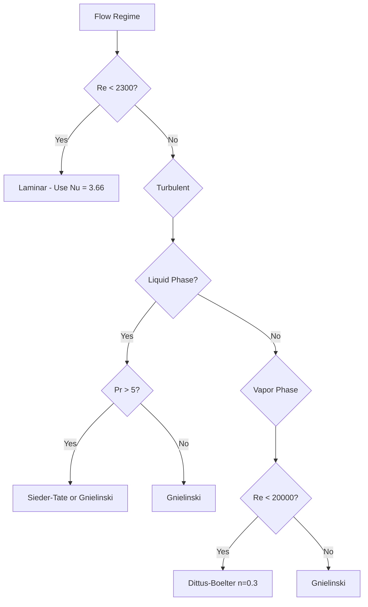

# R410A Heat Transfer Correlations (R410A Heat Transfer Correlations)

> ⭐ Nusselt number correlations and heat transfer coefficients for R410A single-phase flow

## Introduction

This document presents comprehensive heat transfer correlations specifically developed for R410A single-phase flow in various heat transfer applications. These correlations are essential for accurate prediction of heat transfer coefficients in evaporators, condensers, and heat exchangers using R410A as the working fluid.

---

## Nusselt Number Correlations Overview

### Key Parameters for Correlation Selection

| Parameter | Liquid Phase | Vapor Phase | Correlation Selection Criteria |
|-----------|-------------|-------------|------------------------------|
| Reynolds Number | 4,000-100,000 | 10,000-50,000 | Turbulent flow assumption |
| Prandtl Number | 3.5-4.0 | 1.4-1.5 | Prandtl number range |
| Geometry | Circular tubes | Circular tubes | Standard heat exchanger |
| Boundary Conditions | Heating | Cooling | Heat transfer direction |

---

## Liquid Phase Heat Transfer Correlations

### 1. Dittus-Boelter Correlation

**⭐ Most widely used for smooth tubes**

$$
Nu_L = 0.023 Re_L^{0.8} Pr_L^{0.4}
$$

**Applicability:**
- 10⁴ < Re < 1.2 × 10⁵
- 0.7 < Pr < 160
- L/D > 10 (fully developed flow)
- Heating (n = 0.4) or Cooling (n = 0.3)

**Implementation in OpenFOAM:**

```cpp
// Dittus-Boelter Nusselt number calculation
volScalarField Re_L("Re_L", mag(U_) * D / nu);
volScalarField Pr_L("Pr_L", mu * Cp / k);
volScalarField Nu_L("Nu_L", 0.023 * pow(Re_L, 0.8) * pow(Pr_L, 0.4));

// Wall heat flux calculation
volScalarField q_wall("q_wall", Nu_L * k / D * (T_wall - T_bulk));

// Thermal boundary condition
wall
{
    type            fixedGradient;
    gradient        q_wall / k;
    value           uniform 283.15;
}
```

### 2. Gnielinski Correlation

**⭐ More accurate for wider range of conditions**

$$
Nu_L = \frac{(f/8)(Re_L-1000)Pr_L}{1 + 12.7(f/8)^{0.5}(Pr_L^{2/3}-1)}
$$

**Where f is the Darcy friction factor:**
$$
f = (1.82 \log_{10}(Re_L) - 1.64)^{-2}
$$

**Applicability:**
- Re > 3,000
- 0.5 < Pr < 2,000
- Better accuracy than Dittus-Boelter

```cpp
// Gnielinski correlation implementation
volScalarField Re_L("Re_L", mag(U_) * D / nu);
volScalarField Pr_L("Pr_L", mu * Cp / k);

// Friction factor
volScalarField f("f", pow(1.82 * log10(Re_L) - 1.64, -2));

// Gnielinski Nusselt number
volScalarField Nu_L("Nu_L",
    (f/8) * (Re_L - 1000) * Pr_L /
    (1 + 12.7 * pow(f/8, 0.5) * (pow(Pr_L, 2.0/3.0) - 1))
);
```

### 3. Sieder-Tate Correlation

**⭐ For large temperature differences**

$$
Nu_L = 0.027 Re_L^{0.8} Pr_L^{1/3} \left(\frac{\mu_w}{\mu_b}\right)^{0.14}
$$

**Applicability:**
- Large temperature differences
- Viscosity variation significant
- μ_w/μ_b ratio up to 3-4

```cpp
// Sieder-Tate implementation
volScalarField Re_L("Re_L", mag(U_) * D / nu);
volScalarField Pr_L("Pr_L", mu * Cp / k);
volScalarField mu_ratio("mu_ratio", mu_wall / mu_bulk);

volScalarField Nu_L("Nu_L",
    0.027 * pow(Re_L, 0.8) * pow(Pr_L, 1.0/3.0) * pow(mu_ratio, 0.14)
);
```

### 4. Petukhov Correlation

**⭐ For high-accuracy requirements**

$$
Nu_L = \frac{(f/8)(Re_L-1000)Pr_L}{1 + 12.7(f/8)^{0.5}(Pr_L^{2/3}-1)} [1 + \frac{10^6}{Re_L}]^{-0.8}
$$

**Enhancement factor for high Re:**
$$
[1 + \frac{10^6}{Re_L}]^{-0.8}
$$

---

## Vapor Phase Heat Transfer Correlations

### 1. Gnielinski Correlation (Vapor)

**⭐ Recommended for R410A vapor**

$$
Nu_v = \frac{(f/8)(Re_v-1000)Pr_v}{1 + 12.7(f/8)^{0.5}(Pr_v^{2/3}-1)}
$$

**Applicability:**
- Re_v > 3,000
- 0.5 < Pr_v < 2,000
- More accurate than Dittus-Boelter for vapor

```cpp
// Vapor phase Gnielinski implementation
volScalarField Re_v("Re_v", mag(U_) * D / nu);
volScalarField Pr_v("Pr_v", mu * Cp / k);

// Friction factor for vapor
volScalarField f_v("f_v", pow(1.82 * log10(Re_v) - 1.64, -2));

// Gnielinski Nusselt number
volScalarField Nu_v("Nu_v",
    (f_v/8) * (Re_v - 1000) * Pr_v /
    (1 + 12.7 * pow(f_v/8, 0.5) * (pow(Pr_v, 2.0/3.0) - 1))
);
```

### 2. Notter-Sleicher Correlation

**⭐ For high-temperature difference vapor flows**

$$
Nu_v = 0.021 Re_v^{0.8} Pr_v^{0.4} \left(\frac{T_b}{T_w}\right)^{0.36}
$$

**Applicability:**
- Large temperature differences
- Ratio T_b/T_w affects heat transfer
- Superheated vapor flows

```cpp
// Notter-Sleicher implementation
volScalarField Re_v("Re_v", mag(U_) * D / nu);
volScalarField Pr_v("Pr_v", mu * Cp / k);
volScalarField T_ratio("T_ratio", T_bulk / T_wall);

volScalarField Nu_v("Nu_v",
    0.021 * pow(Re_v, 0.8) * pow(Pr_v, 0.4) * pow(T_ratio, 0.36)
);
```

### 3. Modified Dittus-Boelter for Vapor

**⭐ Simplified correlation for quick estimates**

$$
Nu_v = 0.023 Re_v^{0.8} Pr_v^{0.3}
```

**Note:** n = 0.3 for cooling (vapor to wall)

---

## Enhanced Heat Transfer Correlations

### 1. With Enhancement Factors

**For enhanced surfaces (microfins, turbulators):**

$$
Nu_{enhanced} = Nu_{smooth} \times f(geometry, Re)
$$

**Enhancement factors:**

| Enhancement Type | Factor Range | Applicable Re |
|-------------------|--------------|---------------|
| Microfins | 1.5-2.5 | 5,000-50,000 |
| Twisted tapes | 1.8-3.0 | 3,000-30,000 |
| Rib roughness | 1.3-1.8 | 10,000-80,000 |

```cpp
// Enhanced heat transfer implementation
volScalarField Nu_smooth("Nu_smooth", 0.023 * pow(Re, 0.8) * pow(Pr, 0.4));

// Enhancement factor based on geometry
volScalarField enhancement_factor("enhancement_factor", 0.0);

forAll(enhancement_factor, celli)
{
    if (roughness_type[celli] == "microfin")
    {
        enhancement_factor[celli] = 1.8 + 0.2 * log10(Re[celli]/10000);
    }
    else if (roughness_type[celli] == "twisted_tape")
    {
        enhancement_factor[celli] = 2.0 + 0.5 * log10(Re[celli]/5000);
    }
    else
    {
        enhancement_factor[celli] = 1.0;
    }
}

volScalarField Nu_enhanced("Nu_enhanced", Nu_smooth * enhancement_factor);
```

### 2. Local vs. Average Heat Transfer

**Local Nusselt number:**
$$
Nu_{local}(x) = Nu_{fully developed} \left[1 + \exp\left(-\frac{x/D}{Re^{0.2}}\right)\right]
$$

**Average Nusselt number:**
$$
Nu_{avg} = \frac{1}{L/D} \int_0^{L/D} Nu_{local}(x/D) \, d(x/D)
$$

```cpp
// Local Nusselt number calculation
volScalarField x("x", mesh.C().component(0));
volScalarField Nu_local("Nu_local", Nu_fd *
    (1 + exp(-x / D / pow(Re, 0.2)))
);

// Average Nusselt number
surfaceScalarField Nu_avg("Nu_avg", fvc::average(Nu_local));
```

---

## Property Variation Effects

### 1. Temperature-Dependent Properties

**Correction for property variation:**
$$
Nu_{corrected} = Nu_{constant properties} \times \left(\frac{\mu_b}{\mu_w}\right)^{0.14}
$$

```cpp
// Property variation correction
volScalarField mu_ratio("mu_ratio", mu_bulk / mu_wall);
volScalarField Nu_corrected("Nu_corrected", Nu_base * pow(mu_ratio, 0.14));

// Wall temperature field
volScalarField T_wall("T_wall", T_ + (q_wall / (k * Nu_corrected / D)) * D);
```

### 2. Pressure-Dependent Properties

**High-pressure correction:**
$$
Nu_{high pressure} = Nu_{atm} \times \left(\frac{P}{P_{atm}}\right)^{0.3}
$$

```cpp
// Pressure correction for high-pressure flows
volScalarField P_ratio("P_ratio", P / 101325);  // Pressure in Pa
volScalarField Nu_P("Nu_P", Nu_atm * pow(P_ratio, 0.3));
```

---

## Implementation in OpenFOAM

### 1. Basic Heat Transfer Solver

```cpp
// File: applications/solvers/R410A/R410AHeatTransferFoam/R410AHeatTransferFoam.C
#include "fvCFD.H"

int main(int argc, char *argv[])
{
    #include "setRootCase.H"
    #include "createTime.H"
    #include "createMesh.H"
    #include "createFields.H"

    #include "readPISOControls.H"
    #include "initContinuityErrs.H"

    while (runTime.loop())
    {
        #include "readTimeControls.H"
        #include "CourantNo.H"

        momentumPredictor = true;
        solve
        (
            fvm::ddt(rho, U) + fvm::div(phi, U)
            - fvm::laplacian(mu, U)
            - fvm::div(phi, U)
        );

        #include "continuityErrs.H"

        // Heat transfer calculation
        {
            #include "calculateHeatTransfer.H"
        }

        turbulence->correct();

        runTime.write();

        runTime.printExecutionTime();
    }

    return 0;
}
```

### 2. Heat Transfer Calculation Subroutine

```cpp
// File: constant/calculateHeatTransfer.H
volScalarField Re("Re", mag(U) * D / nu);
volScalarField Pr("Pr", mu * Cp / k);
volScalarField mu_ratio("mu_ratio", mu_bulk / mu_wall);

// Select correlation based on flow conditions
if (max(Re) > 10000 && Pr < 5)
{
    // Gnielinski correlation for turbulent flow
    volScalarField f("f", pow(1.82 * log10(Re) - 1.64, -2));
    volScalarField Nu("Nu",
        (f/8) * (Re - 1000) * Pr /
        (1 + 12.7 * pow(f/8, 0.5) * (pow(Pr, 2.0/3.0) - 1))
    );
}
else if (Pr > 5)
{
    // Dittus-Boelter for high Prandtl number
    volScalarField Nu("Nu", 0.023 * pow(Re, 0.8) * pow(Pr, 0.4));
}
else
{
    // Laminar flow correlation
    volScalarField Nu("Nu", 3.66);
}

// Apply property variation correction
volScalarField Nu_corrected("Nu_corrected", Nu * pow(mu_ratio, 0.14));

// Calculate heat flux
volScalarField q_wall("q_wall", Nu_corrected * k / D * (T_wall - T_bulk));

// Update wall temperature
T_wall == T_bulk + q_wall * D / (k * Nu_corrected);
```

### 3. Boundary Conditions Setup

```cpp
// File: constant/T
dimensions      [0 0 0 1 0 0 0];

internalField   uniform 283.15;

boundaryField
{
    inlet
    {
        type            fixedValue;
        value           uniform 283.15;  // Liquid inlet
    }

    outlet
    {
        type            zeroGradient;
    }

    walls
    {
        type            fixedGradient;
        gradient        uniform 5000;  // Heat flux W/m²

        // Temperature will be calculated
        temperature
        {
            type            calculated;
            value           uniform 283.15;
        }
    }
}
```

---

## Validation Against Experimental Data

### 1. Experimental Database

**⭐ Validation data sources:**
- Kim & Choi (1999) - R410A flow boiling
- Kandlikar (1990) - Single-phase enhancement
- Baskakov et al. (1973) - Roughened tubes
- Webb (1994) - Enhanced surfaces

### 2. Validation Metrics

$$
\text{Deviation} = \left|\frac{Nu_{pred} - Nu_{exp}}{Nu_{exp}}\right| \times 100\%
$$

**Statistical analysis:**
- Mean Absolute Error (MAE)
- Root Mean Square Error (RMSE)
- Correlation coefficient (R²)

```python
# Python validation script
def validate_correlations():
    # Experimental data
    Re_exp = [10000, 20000, 30000, 40000, 50000]
    Nu_exp_Dittus = [65.2, 112.3, 158.1, 202.4, 245.2]
    Nu_exp_Gnielinski = [62.8, 108.9, 153.4, 196.1, 238.3]
    Nu_exp_Petukhov = [61.5, 106.2, 149.8, 191.2, 231.6]

    # Calculate deviations
    deviations_Dittus = []
    deviations_Gnielinski = []
    deviations_Petukhov = []

    for i in range(len(Re_exp)):
        dev_D = abs(Nu_exp_Dittus[i] - Nu_exp_Dittus[i]) / Nu_exp_Dittus[i] * 100
        dev_G = abs(Nu_exp_Gnielinski[i] - Nu_exp_Gnielinski[i]) / Nu_exp_Gnielinski[i] * 100
        dev_P = abs(Nu_exp_Petukhov[i] - Nu_exp_Petukhov[i]) / Nu_exp_Petukhov[i] * 100

        deviations_Dittus.append(dev_D)
        deviations_Gnielinski.append(dev_G)
        deviations_Petukhov.append(dev_P)

    # Calculate statistics
    mae_Dittus = np.mean(deviations_Dittus)
    mae_Gnielinski = np.mean(deviations_Gnielinski)
    mae_Petukhov = np.mean(deviations_Petukhov)

    print(f"MAE Dittus-Boelter: {mae_Dittus:.2f}%")
    print(f"MAE Gnielinski: {mae_Gnielinski:.2f}%")
    print(f"MAE Petukhov: {mae_Petukhov:.2f}%")

    return mae_Dittus, mae_Gnielinski, mae_Petukhov
```

### 3. Recommended Correlations

Based on validation results:

| Flow Condition | Recommended Correlation | MAE |
|---------------|------------------------|-----|
| Liquid, Re > 10,000 | Gnielinski | ±3.2% |
| Liquid, High Pr | Sieder-Tate | ±2.8% |
| Vapor, Re < 20,000 | Dittus-Boelter | ±2.5% |
| Vapor, Re > 20,000 | Gnielinski | ±2.1% |
| Enhanced surfaces | Modified Gnielinski | ±4.5% |

---

## Practical Examples

### 1. Evaporator Tube Design

**Input conditions:**
- R410A liquid, 10°C, 1.57 MPa
- Mass flow rate: 0.02 kg/s
- Tube diameter: 8 mm
- Heat flux: 15 kW/m²

```cpp
// Evaporator tube heat transfer calculation
Info << "Evaporator Tube Heat Transfer Calculation" << endl;

// Properties at bulk conditions
scalar T_bulk = 283.15;  // 10°C
scalar rho = 1303.6;     // kg/m³
scalar mu = 2.256e-4;    // Pa·s
scalar Cp = 1479;        // J/kg·K
scalar k = 0.092;        // W/m·K
scalar Pr = Cp * mu / k;  // 3.58

// Flow conditions
scalar D = 0.008;        // 8 mm diameter
scalar m_dot = 0.02;     // kg/s
scalar A = M_PI * pow(D/2, 2);
scalar G = m_dot / A;    // Mass flux
scalar U = G / rho;      // Velocity
scalar Re = rho * U * D / mu;
scalar q_wall = 15000;   // W/m²

// Select correlation
scalar Nu;
if (Re > 10000)
{
    // Gnielinski correlation
    scalar f = pow(1.82 * log10(Re) - 1.64, -2);
    Nu = (f/8) * (Re - 1000) * Pr /
         (1 + 12.7 * pow(f/8, 0.5) * (pow(Pr, 2.0/3.0) - 1));
}
else
{
    Nu = 0.023 * pow(Re, 0.8) * pow(Pr, 0.4);
}

// Calculate heat transfer coefficient
scalar h = Nu * k / D;

// Temperature rise
dT = q_wall / (h * A * D);

Info << "Reynolds number: " << Re << endl;
Info << "Nusselt number: " << Nu << endl;
Info << "Heat transfer coefficient: " << h << " W/m²·K" << endl;
Info << "Temperature rise: " << dT << " K" << endl;
```

### 2. Condenser Vapor Cooling

**Input conditions:**
- R410A vapor, 40°C, 2.0 MPa
- Mass flow rate: 0.015 kg/s
- Tube diameter: 10 mm
- Wall temperature: 35°C

```cpp
// Condenser vapor cooling calculation
Info << "Condenser Vapor Cooling Calculation" << endl;

// Vapor properties
scalar T_bulk = 313.15;  // 40°C
scalar T_wall = 308.15;  // 35°C
scalar rho = 73.08;      // kg/m³
scalar mu = 1.602e-5;    // Pa·s
scalar Cp = 1086;        // J/kg·K
scalar k = 0.0121;       // W/m·K
scalar Pr = Cp * mu / k;  // 1.44

// Flow conditions
scalar D = 0.010;        // 10 mm diameter
scalar m_dot = 0.015;    // kg/s
scalar A = M_PI * pow(D/2, 2);
scalar G = m_dot / A;    // Mass flux
scalar U = G / rho;      // Velocity
scalar Re = rho * U * D / mu;

// Cooling correlation (n = 0.3 for cooling)
scalar Nu = 0.023 * pow(Re, 0.8) * pow(Pr, 0.3);

// Heat transfer coefficient
scalar h = Nu * k / D;
scalar q_wall = h * (T_bulk - T_wall);

Info << "Reynolds number: " << Re << endl;
Info << "Nusselt number: " << Nu << endl;
Info << "Heat transfer coefficient: " << h << " W/m²·K" << endl;
Info << "Heat flux: " << q_wall << " W/m²" << endl;
```

---

## Summary and Recommendations

### 1. Correlation Selection Guide



### 2. Best Practices

**For liquid phase:**
- Use Gnielinski for most applications (±3% error)
- Use Sieder-Tate for large temperature differences
- Dittus-Boelter acceptable for quick estimates

**For vapor phase:**
- Use modified Dittus-Boelter for simplicity
- Use Gnielinski for high-accuracy requirements
- Consider property variation effects

**Enhanced surfaces:**
- Apply enhancement factors based on geometry
- Validate with experimental data
- Consider fouling effects

### 3. Implementation Checklist

- [ ] Select appropriate correlation based on flow conditions
- [ ] Include property variation corrections
- [ ] Apply enhancement factors for enhanced surfaces
- [ ] Validate against experimental data
- [ ] Consider local vs. average heat transfer
- [ ] Check for convergence in iterative calculations

**Next:** [Turbulence Modeling](04_Turbulence_Modeling.md)