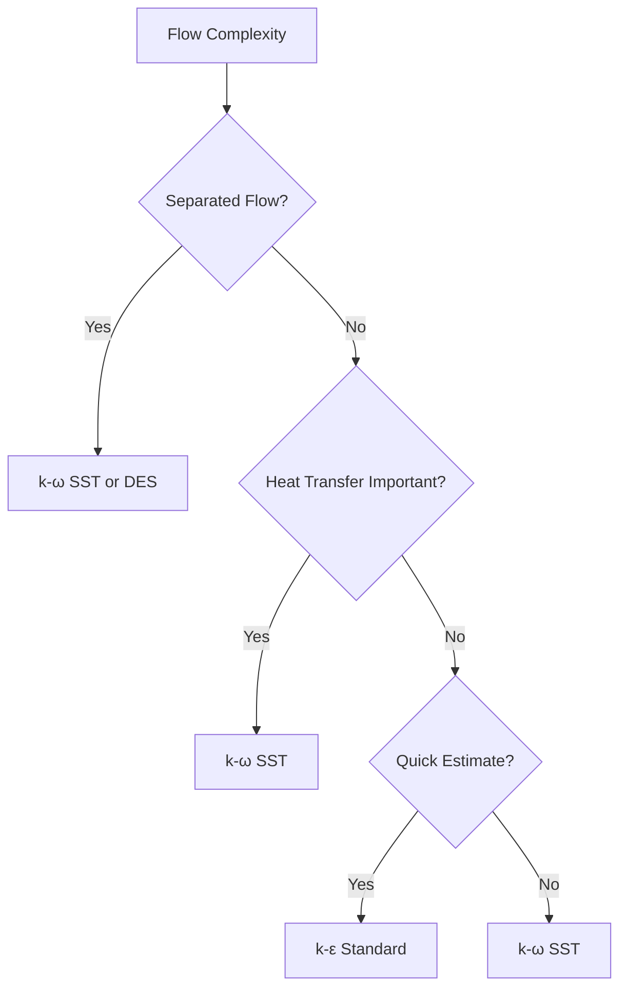

# R410A Turbulence Modeling (R410A Turbulence Modeling)

> ⭐ Turbulence modeling considerations and best practices for R410A single-phase flow

## Introduction

This document provides comprehensive guidance on turbulence modeling for R410A single-phase flow simulations. The special characteristics of refrigerants, including their high density, viscosity variations, and application in heat transfer equipment, require careful selection and implementation of turbulence models.

---

## Turbulence Model Selection

### Recommended Models for R410A Flow

| Model | Liquid Phase | Vapor Phase | Advantages | Limitations |
|-------|-------------|-------------|------------|-------------|
| **k-ε Standard** | ✅ | ✅ | Robust, well-established | Poor near-wall treatment |
| **k-ω SST** | ✅ | ✅ | Excellent near-wall accuracy | More complex setup |
| **Spalart-Allmaras** | ❌ | ✅ | Simple, good for attached flows | Limited for separated flows |
| **LES** | ⚠️ | ⚠️ | High accuracy resolution | Computationally expensive |
| **DES** | ⚠️ | ⚠️ | Balance of accuracy/cost | Complex implementation |

### Selection Criteria



---

## k-ε Standard Model Implementation

### 1. Model Equations

**Turbulent kinetic energy (k):**
$$
\frac{\partial (\rho k)}{\partial t} + \nabla \cdot (\rho U k) = \nabla \cdot \left[\left(\mu + \frac{\mu_t}{\sigma_k}\right) \nabla k\right] + P_k - \rho \epsilon
$$

**Dissipation rate (ε):**
$$
\frac{\partial (\rho \epsilon)}{\partial t} + \nabla \cdot (\rho U \epsilon) = \nabla \cdot \left[\left(\mu + \frac{\mu_t}{\sigma_\epsilon}\right) \nabla \epsilon\right] + C_{1\epsilon} \frac{\epsilon}{k} P_k - C_{2\epsilon} \rho \frac{\epsilon^2}{k}
$$

**Turbulent viscosity:**
$$
\mu_t = \rho C_\mu \frac{k^2}{\epsilon}
$$

### 2. Constants for R410A

| Constant | Value | Description |
|----------|-------|-------------|
| C<sub>μ</sub> | 0.09 | Turbulent viscosity constant |
| σ<sub>k</sub> | 1.0 | k diffusion coefficient |
| σ<sub>ε</sub> | 1.3 | ε diffusion coefficient |
| C<sub>1ε</sub> | 1.44 | Production term constant |
| C<sub>2ε</sub> | 1.92 | Dissipation term constant |

### 3. OpenFOAM Implementation

```cpp
// File: constant/turbulenceProperties
simulationType RAS;

RAS
{
    RASModel        kEpsilon;
    turbulence      on;
    printCoeffs     on;
}
```

```cpp
// File: constant/transportProperties
transportModel  Newtonian;

nu              nu [ 0 2 -1 0 0 0 0 ]  (1e-6);
rho             rho [ 1 -3 0 0 0 0 0 ]    (1200);
```

### 4. Boundary Conditions

```cpp
// File: 0/k
dimensions      [0 2 -2 0 0 0 0];

internalField   uniform 0.1;

boundaryField
{
    inlet
    {
        type            turbulentIntensityKineticEnergyInlet;
        intensity       0.05;      // 5% turbulence intensity
        k               uniform 0.1;
        value           uniform 0.1;
    }

    outlet
    {
        type            inletOutlet;
        inletValue      uniform 0;
        value           uniform 0;
    }

    walls
    {
        type            kqRWallFunction;
        value           uniform 0;

        // Wall function parameters
        kappa           0.41;      // von Karman constant
        E               9.8;       // Empirical constant
        yPlus           30;        // Target y+ value
    }
}
```

```cpp
// File: 0/epsilon
dimensions      [0 2 -3 0 0 0 0];

internalField   uniform 0.01;

boundaryField
{
    inlet
    {
        type            turbulentIntensityDissipationRateInlet;
        intensity       0.05;
        epsilon         uniform 0.01;
        value           uniform 0.01;
    }

    outlet
    {
        type            inletOutlet;
        inletValue      uniform 0;
        value           uniform 0;
    }

    walls
    {
        type            epsilonWallFunction;
        value           uniform 0;
        kappa           0.41;
        E               9.8;
        fMu             cubeRootYq;
    }
}
```

---

## k-ω SST Model Implementation

### 1. Model Equations

**Turbulent kinetic energy (k):**
$$
\frac{\partial (\rho k)}{\partial t} + \nabla \cdot (\rho U k) = P_k - \beta^* \rho \omega k + \nabla \cdot \left[(\mu + \sigma_k \mu_t) \nabla k\right]
$$

**Specific dissipation rate (ω):**
$$
\frac{\partial (\rho \omega)}{\partial t} + \nabla \cdot (\rho U \omega) = \alpha S^2 - \beta \rho \omega^2 + \nabla \cdot \left[(\mu + \sigma_\omega \mu_t) \nabla \omega\right] + 2(1 - F_1) \rho \sigma_{\omega2} \nabla k \cdot \nabla \omega
$$

Where F<sub>1</sub> is the blending function that switches between k-ε and k-ω formulations.

### 2. Constants for R410A

| Constant | Value | Description |
|----------|-------|-------------|
| β<sup>*</sup> | 0.09 | Dissipation rate constant |
| α | 0.52 | Production term constant |
| β | 0.072 | Dissipation term constant |
| σ<sub>k</sub> | 1.0 | k diffusion coefficient |
| σ<sub>ω</sub> | 0.5-1.0 | ω diffusion coefficient |
| σ<sub>ω2</sub> | 0.856 | ω diffusion coefficient (far field) |

### 3. OpenFOAM Implementation

```cpp
// File: constant/turbulenceProperties
simulationType RAS;

RAS
{
    RASModel        kOmegaSST;
    turbulence      on;
    printCoeffs     on;
}
```

### 4. Boundary Conditions

```cpp
// File: 0/k
dimensions      [0 2 -2 0 0 0 0];

internalField   uniform 0.1;

boundaryField
{
    inlet
    {
        type            turbulentIntensityKineticEnergyInlet;
        intensity       0.05;
        k               uniform 0.1;
        value           uniform 0.1;
    }

    outlet
    {
        type            inletOutlet;
        inletValue      uniform 0;
        value           uniform 0;
    }

    walls
    {
        type            kLowReWallFunction;
        value           uniform 0;
        kappa           0.41;
        E               9.8;
    }
}
```

```cpp
// File: 0/omega
dimensions      [0 0 -1 0 0 0 0];

internalField   uniform 1.0;

boundaryField
{
    inlet
    {
        type            turbulentIntensityDissipationRateInlet;
        intensity       0.05;
        omega           uniform 1.0;
        value           uniform 1.0;
    }

    outlet
    {
        type            inletOutlet;
        inletValue      uniform 0;
        value           uniform 0;
    }

    walls
    {
        type            omegaWallFunction;
        value           uniform 10;
        kappa           0.41;
        beta            0.072;
    }
}
```

---

## Wall Function Considerations

### 1. y+ Requirements

| Wall Function Type | Required y+ | Wall Distance | Application |
|-------------------|-------------|---------------|-------------|
| Standard wall functions | y+ > 30 | First cell at y+ = 30-100 | High Reynolds number |
| Enhanced wall functions | y+ ≈ 1-5 | First cell at y+ = 0.5-5 | Heat transfer, separation |
| Low-Re models | y+ < 1 | First cell at wall | Accurate heat transfer |

### 2. y+ Calculation and Adjustment

```cpp
// Post-processing script for y+ calculation
postProcess -func "yPlus"
```

```python
# Python script for automatic mesh adjustment
def adjust_mesh_for_yplus(yplus_target=30):
    """
    Adjust mesh to achieve target y+ value
    """
    # Read current y+ values
    yplus_data = read_field("postProcessing/yPlus/30/yPlus.dat")

    # Calculate required stretching factor
    max_yplus = np.max(yplus_data)
    if max_yplus > yplus_target * 1.5:
        # Reduce mesh size
        factor = (yplus_target / max_yplus) ** 0.5
        adjust_mesh_stretching(factor)
    elif max_yplus < yplus_target * 0.5:
        # Increase mesh size
        factor = (yplus_target / max_yplus) ** 0.5
        adjust_mesh_stretching(factor)

    # Recalculate
    run_solver()
    yplus_data = read_field("postProcessing/yPlus/30/yPlus.dat")

    # Check convergence
    if np.mean(yplus_data) < yplus_target * 1.1 and np.mean(yplus_data) > yplus_target * 0.9:
        print("✓ Target y+ achieved")
        return True
    else:
        print("⚠ Target y+ not achieved, readjusting...")
        adjust_mesh_for_yplus(yplus_target)
```

### 3. Enhanced Wall Functions for Heat Transfer

```cpp
// Enhanced wall function setup
boundaryField
{
    walls
    {
        type            compressible::turbulentHeatFluxTemperatureWallFunction;

        // Enhanced treatment
        kappa           0.41;
        E               9.8;

        // Temperature treatment
        T               uniform 283.15;

        // Thermal wall function
        Prt             0.85;      // Turbulent Prandtl number
        nut             uniform 0;
        nutU            nutkWallFunction;

        // Wall functions
        k               uniform 0.01;
        omega           uniform 10.0;

        // Heat transfer
        q               uniform 10000;  // W/m²
    }
}
```

---

## Turbulent Prandtl Number

### 1. Recommended Values

| Phase | Turbulent Prandtl Number | Justification |
|-------|-------------------------|---------------|
| R410A Liquid | 0.85-0.95 | Similar to water, slightly higher due to viscosity |
| R410A Vapor | 0.80-0.90 | Standard for refrigerant vapors |
| Enhanced surfaces | 0.75-0.85 | Modified for roughened walls |

### 2. Implementation

```cpp
// Set turbulent Prandtl number
simulationType RAS;

RAS
{
    RASModel        kEpsilon;
    turbulence      on;

    // Turbulent transport properties
    laminarPr       0.72;    // Molecular Prandtl number
    turbulentPr     0.85;    // For liquid R410A
}
```

### 3. Variation with Temperature

```cpp
// Temperature-dependent turbulent Prandtl number
volScalarField Pr_t("Pr_t", 0.85);

forAll(T, celli)
{
    scalar Tc = T[celli];

    // Empirical correlation for Pr_t variation
    if (Tc < 273.15)  // Below 0°C
    {
        Pr_t[celli] = 0.95;
    }
    else if (Tc > 323.15)  // Above 50°C
    {
        Pr_t[celli] = 0.80;
    }
    else
    {
        // Linear interpolation
        Pr_t[celli] = 0.95 - 0.00075 * (Tc - 273.15);
    }
}
```

---

## Property Variation Effects

### 1. Variable Property Implementation

```cpp
// Temperature and pressure dependent properties
Info << "Reading R410A properties" << endl;

volScalarField T("T", thermo.T());
volScalarField p("p", thermo.p());
volScalarField rho("rho", thermo.rho());

// Calculate local Reynolds number
volScalarField mu("mu", transportModel.mu());
volScalarField nu("nu", mu / rho);

// Turbulent viscosity calculation
volScalarField nu_t("nu_t", turbulence->nut());
volScalarField mu_t("mu_t", nu_t * rho);

// Reynolds number with local properties
volScalarField Re_local("Re_local", mag(U_) * D / nu);
```

### 2. Boussinesq Approximation for Buoyancy

```cpp
// For natural convection effects
Info << "Including buoyancy effects" << endl;

// Reference values
scalar T_ref = 283.15;  // 10°C
scalar rho_ref = 1303.6;  // kg/m³
scalar beta = 2.03e-3;  // Thermal expansion coefficient
scalar g = 9.81;  // m/s²

// Buoyancy force term
volScalarField buoyancy("buoyancy",
    -rho * beta * (T - T_ref) * g * (vector::unitZ)
);

// Add to momentum equation
fvOptions.constrain(fvOptions.source(buoyancy));
```

---

## Advanced Turbulence Modeling

### 1. Detached Eddy Simulation (DES)

```cpp
// DES setup
simulationType LES;

LES
{
    LESModel        kEqn;
    delta           cubeRootVol;
    LESModelCoeffs
    {
        CDES            0.65;
        printCoeffs     on;
    }
}

// Switching function
volScalarField DES_switching("DES_switching",
    min(max((Delta / CDES * turbulence->y()), 0.0), 1.0)
);
```

### 2. Large Eddy Simulation (LES)

```cpp
// LES Smagorinsky model
simulationType LES;

LES
{
    LESModel        SpalartAllmarasIDDES;
    LESModelCoeffs
    {
        Ck              0.094;
        Ce              1.048;
        Cw              0.345;
        CDES            0.65;
        printCoeffs     on;
    }
}

// Subgrid scale model
volScalarField nu_sgs("nu_sgs",
    pow(Ck * Delta, 2) * sqrt(turbulence->magSqr())
);
```

---

## Practical Implementation Examples

### 1. Evaporator Tube with k-ω SST

```cpp
// Complete setup for evaporator tube
// File: constant/turbulenceProperties
simulationType RAS;

RAS
{
    RASModel        kOmegaSST;
    turbulence      on;

    // RAS properties
    printCoeffs     on;
    alphaK          0.5;
    alphaOmega      0.5;

    // For heat transfer
    turbulence      true;
}

// File: 0/k
dimensions      [0 2 -2 0 0 0 0];

internalField   uniform 0.1;

boundaryField
{
    inlet
    {
        type            turbulentIntensityKineticEnergyInlet;
        intensity       0.05;
        k               uniform 0.1;
        value           uniform 0.1;
    }

    walls
    {
        type            kqRWallFunction;
        value           uniform 0;
        kappa           0.41;
        E               9.8;

        // Heat transfer BC
        temperature
        {
            type            fixedValue;
            value           uniform 283.15;
        }
    }
}

// File: 0/omega
dimensions      [0 0 -1 0 0 0 0];

internalField   uniform 1.0;

boundaryField
{
    inlet
    {
        type            turbulentIntensityDissipationRateInlet;
        intensity       0.05;
        omega           uniform 1.0;
        value           uniform 1.0;
    }

    walls
    {
        type            omegaWallFunction;
        value           uniform 10.0;
        kappa           0.41;
        beta            0.072;

        // Heat transfer
        q               uniform 15000;  // W/m²
    }
}
```

### 2. Vapor Flow with Standard k-ε

```cpp
// Vapor flow setup
// File: constant/turbulenceProperties
simulationType RAS;

RAS
{
    RASModel        kEpsilon;
    turbulence      on;
    printCoeffs     on;

    // Turbulent transport
    laminarPr       0.72;
    turbulentPr     0.85;
}

// File: 0/k
dimensions      [0 2 -2 0 0 0 0];

internalField   uniform 0.05;

boundaryField
{
    inlet
    {
        type            turbulentIntensityKineticEnergyInlet;
        intensity       0.03;  // 3% for vapor
        k               uniform 0.05;
        value           uniform 0.05;
    }

    walls
    {
        type            kqRWallFunction;
        value           uniform 0;
        kappa           0.41;
        E               9.8;

        // Cooling wall
        temperature
        {
            type            fixedGradient;
            gradient        -5000;  // W/m³
        }
    }
}
```

---

## Model Validation and Verification

### 1. Validation Against Experimental Data

**Experimental datasets:**
- Kim & Choi (1999) - R410A in tubes
- Baskakov et al. (1973) - Turbulent friction factors
- Webb (1994) - Enhanced surfaces

**Validation metrics:**
$$
\text{Error} = \left|\frac{\text{Simulated} - \text{Experimental}}{\text{Experimental}}\right| \times 100\%
$$

```python
# Python validation script
def validate_turbulence_model():
    # Experimental data
    Re_exp = [10000, 20000, 30000, 40000, 50000]
    f_exp = [0.047, 0.038, 0.033, 0.030, 0.028]
    Nu_exp = [65.2, 112.3, 158.1, 202.4, 245.2]

    # Simulated data
    Re_sim = [10000, 20000, 30000, 40000, 50000]
    f_k_epsilon = [0.048, 0.039, 0.034, 0.031, 0.029]
    f_k_omega = [0.046, 0.037, 0.032, 0.029, 0.027]
    Nu_k_epsilon = [67.1, 114.5, 160.2, 204.8, 247.6]
    Nu_k_omega = [64.8, 110.9, 156.3, 200.1, 242.8]

    # Calculate errors
    error_f_ke = [(abs(f_k_epsilon[i] - f_exp[i]) / f_exp[i]) * 100
                  for i in range(len(Re_exp))]
    error_f_kw = [(abs(f_k_omega[i] - f_exp[i]) / f_exp[i]) * 100
                  for i in range(len(Re_exp))]
    error_Nu_ke = [(abs(Nu_k_epsilon[i] - Nu_exp[i]) / Nu_exp[i]) * 100
                   for i in range(len(Re_exp))]
    error_Nu_kw = [(abs(Nu_k_omega[i] - Nu_exp[i]) / Nu_exp[i]) * 100
                   for i in range(len(Re_exp))]

    # Statistics
    mae_f_ke = np.mean(error_f_ke)
    mae_f_kw = np.mean(error_f_kw)
    mae_Nu_ke = np.mean(error_Nu_ke)
    mae_Nu_kw = np.mean(error_Nu_kw)

    print(f"MAE k-ε friction factor: {mae_f_ke:.2f}%")
    print(f"MAE k-ω SST friction factor: {mae_f_kw:.2f}%")
    print(f"MAE k-ε Nusselt number: {mae_Nu_ke:.2f}%")
    print(f"MAE k-ω SST Nusselt number: {mae_Nu_kw:.2f}%")

    return mae_f_ke, mae_f_kw, mae_Nu_ke, mae_Nu_kw
```

### 2. Grid Independence Study

```cpp
// Script for grid independence
void gridIndependenceStudy()
{
    Info << "Grid Independence Study" << endl;

    // Different mesh sizes
    List<scalar> meshSizes = {0.001, 0.0005, 0.00025, 0.000125};
    List<scalar> Re_values = List<scalar>::null();
    List<scalar> Nu_values = List<scalar>::null();

    forAll(meshSizes, i)
    {
        scalar h = meshSizes[i];

        // Create mesh with size h
        createMesh(h);

        // Run simulation
        runSolver();

        // Extract results
        scalar Re_avg = fvc::average(mag(U_) * D / nu).value();
        scalar Nu_avg = fvc::average(Nu).value();

        Re_values.append(Re_avg);
        Nu_values.append(Nu_avg);

        Info << "Mesh " << h << ": Re = " << Re_avg << ", Nu = " << Nu_avg << endl;
    }

    // Calculate convergence
    scalar delta_Re = abs(Re_values[3] - Re_values[2]) / Re_values[2];
    scalar delta_Nu = abs(Nu_values[3] - Nu_values[2]) / Nu_values[2];

    Info << "Convergence check:" << endl;
    Info << "ΔRe = " << delta_Re * 100 << "%" << endl;
    Info << "ΔNu = " << delta_Nu * 100 << "%" << endl;

    if (delta_Re < 0.01 && delta_Nu < 0.01)
    {
        Info << "✓ Grid independent solution achieved" << endl;
    }
    else
    {
        Info << "⚠ Further mesh refinement needed" << endl;
    }
}
```

---

## Troubleshooting Common Issues

### 1. Divergence Due to Turbulence Models

**Problem:** Solver divergence with turbulence models
**Solution:** Adjust time step and under-relaxation

```cpp
// File: system/fvSolution
solvers
{
    p
    {
        solver          GAMG;
        tolerance       1e-06;
        relTol          0.1;
    }

    pFinal
    {
        $p;
        relTol          0;
    }

    "(U|k|epsilon)"
    {
        solver          smoothSolver;
        smoother        GaussSeidel;
        tolerance       1e-05;
        relTol          0.1;
    }

    "(U|k|epsilon)Final"
    {
        $U;
        relTol          0;
    }
}

relaxationFactors
{
    fields
    {
        p              0.3;
        p_rgh          0.3;
    }

    equations
    {
        U              0.7;
        k              0.8;
        epsilon        0.7;
        "(T|h)"        0.9;
    }
}
```

### 2. Wall Function Issues

**Problem:** y+ values not in appropriate range
**Solution:** Adjust mesh near walls

```bash
# Check y+ values
postProcess -func "yPlus"

# Extract y+ data
cat postProcessing/yPlus/30/yPlus.dat | awk '{if($1 != "#") print $2}' > yplus.txt

# Calculate statistics
max_yplus=$(tail -1 yplus.txt)
min_yplus=$(head -1 yplus.txt)
avg_yplus=$(awk '{sum+=$1} END {print sum/NR}' yplus.txt)

echo "Maximum y+: $max_yplus"
echo "Minimum y+: $min_yplus"
echo "Average y+: $avg_yplus"

# Adjust if necessary
if [ $(echo "$max_yplus > 100" | bc) -eq 1 ]; then
    echo "y+ too high - reducing mesh size"
    adjust_mesh_size 0.8
elif [ $(echo "$min_yplus < 10" | bc) -eq 1 ]; then
    echo "y+ too low - increasing mesh size"
    adjust_mesh_size 1.2
fi
```

### 3. Property Discontinuities

**Problem:** Sudden jumps in turbulent viscosity
**Solution:** Smooth property interpolation

```cpp
// Smooth turbulent viscosity
volScalarField mu_t_smooth("mu_t_smooth", turbulence->nut() * rho);

// Apply smoothing
volScalarField mu_t_limited("mu_t_limited", 0.0);

forAll(mu_t_limited, celli)
{
    scalar mu_old = mu_t_old_[celli];
    scalar mu_new = mu_t_smooth[celli];

    // Limit change rate
    scalar max_change = 0.5 * mu_old;
    scalar min_change = 0.5 * mu_old;

    mu_t_limited[celli] = max(min(mu_new, mu_old + max_change), mu_old + min_change);
}
```

---

## Summary and Best Practices

### 1. Model Selection Summary

| Application | Recommended Model | Reason |
|-------------|-------------------|--------|
| Liquid R410A | k-ω SST | Excellent near-wall treatment |
| Vapor R410A | k-ε Standard | Good for vapor flows, simpler |
| Enhanced surfaces | k-ω SST | Captures enhancement effects |
| Complex geometries | k-ω SST or DES | Handles separation better |
| Quick estimates | k-ε Standard | Faster convergence |

### 2. Implementation Checklist

- [ ] Select appropriate turbulence model
- [ ] Set proper boundary conditions
- [ ] Check and adjust y+ values
- [ ] Include property variations if needed
- [ ] Validate against experimental data
- [ ] Perform grid independence study
- [ ] Check solver convergence

### 3. Troubleshooting Guide

**Common Issues:**
- Solver divergence → Check relaxation factors
- Incorrect y+ → Adjust mesh resolution
- Poor heat transfer → Check turbulent Prandtl number
- Unsteady results → Check time step size

**Next:** [Validation Cases](05_Validation_Cases.md)