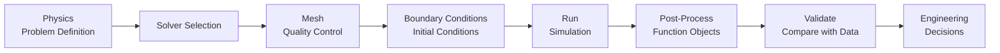

# Practical Applications Overview

การประยุกต์ใช้ OpenFOAM ในงานวิศวกรรมจริง

> **ทำไมต้องเรียนบทนี้?**
> - **เชื่อมโยง theory กับงานจริง** — aerodynamics, piping, heat exchangers
> - รู้ **engineering metrics** ที่สำคัญ — $C_D$, $\Delta p$, $Nu$
> - ใช้ **function objects** คำนวณค่าระหว่าง simulation

---

## Learning Objectives

หลังจากอ่านบทนี้ คุณควรจะสามารถ:

1. **เลือก solver ที่เหมาะสม** กับปัญหาวิศวกรรมที่ต้องการแก้ได้อย่างถูกต้อง
2. **ระบุ engineering metrics** ที่เกี่ยวข้องกับแต่ละประเภทของการใช้งาน (aerodynamics, piping, heat transfer, mixing)
3. **ใช้ function objects** เพื่อคำนวณค่าสำคัญระหว่างการจำลองได้อย่างมีประสิทธิภาพ
4. **ออกแบบเหมาะสม** ตามความต้องการของแต่ละประเภทปัญหา
5. **ติดตาม workflow** จาก problem definition ไปจนถึง validation ได้อย่างเป็นระบบ

---

## 1. What is CFD Workflow?

### 1.1 What (สิ่งที่เป็น)

CFD Workflow คือขั้นตอนเชิงโครงสร้างในการแก้ปัญหาวิศวกรรมด้วย CFD ตั้งแต่การนิยามปัญหา การเลือก solver การสร้าง mesh การกำหนด boundary conditions การรัน simulation การประมวลผล และการ validate ผลลัพธ์

### 1.2 Why (ทำไมสำคัญ)

- **ความสอดคล้อง**: มั่นใจว่า simulation ตอบโจทย์ปัญหาวิศวกรรม
- **ประสิทธิภาพ**: ลดการทดลองผิดพลาดและเวลาคำนวณ
- **ความน่าเชื่อถือ**: Validation กับข้อมูลจริงหรือ correlations

### 1.3 How (การปฏิบัติ)



---

## 2. Application Categories

### 2.1 External Aerodynamics

**What**: การไหลของ fluid รอบตัววัตถุ เช่น รถยนต์ อากาศยาน อาคาร

**Why**: สำคัญต่อ fuel efficiency, stability, การออกแบบที่เสถียร

**How**: 
- Solver: `simpleFoam` (steady), `pimpleFoam` (transient)
- Turbulence: k-ω SST สำหรับ boundary layer ที่แม่นยำ
- Key Metrics: $C_D$, $C_L$, $C_p$

### 2.2 Internal Flow and Piping

**What**: การไหลภายในท่อ ช่องทาง  heat exchangers

**Why**: ขนส่ง fluid ในโรงงาน ระบบทำความเย็น ระบายความร้อน

**How**:
- Solver: `simpleFoam`, `pimpleFoam`
- Key Metrics: $\Delta p$, friction factor $f$, Reynolds number

### 2.3 Heat Transfer

**What**: การถ่ายเทความร้อน convection, conduction, CHT

**Why**: ออกแบบ heat exchangers, cooling systems, การระบายความร้อน

**How**:
- Solver: `buoyantSimpleFoam` (buoyancy), `chtMultiRegionFoam` (CHT)
- Key Metrics: Nusselt number $Nu$, heat transfer coefficient $h$
- ดูเพิ่มเติม: [MODULE 03_SINGLE_PHASE_FLOW/CONTENT/04_HEAT_TRANSFER](../../MODULE_03_SINGLE_PHASE_FLOW/CONTENT/04_HEAT_TRANSFER)

### 2.4 Mixing

**What**: การผสม scalar ใน fluid — เคมี การเจือจาง

**Why**: ความสม่ำเสมอของสาร, reaction engineering

**How**:
- Solver: `scalarTransportFoam`, `reactingFoam`
- Key Metrics: Coefficient of Variation (CoV), Mixing Index (MI)

---

## 3. Solver Selection Guide

### 3.1 By Flow Physics

| Flow Type | Condition | Solver | When to Use |
|-----------|-----------|--------|-------------|
| **Incompressible** | Steady, turbulent | `simpleFoam` | การไหลแบบ steady state — pipe flow, external aerodynamics |
| **Incompressible** | Transient | `pimpleFoam` | การไหลที่ไม่สม่ำเสมอ — vortex shedding, unsteady wakes |
| **Heat Transfer** | Buoyancy-driven | `buoyantSimpleFoam` | Natural convection, thermal plumes |
| **Heat Transfer** | CHT | `chtMultiRegionFoam` | Conjugate heat transfer — solid-fluid coupling |
| **Mixing** | Passive scalar | `scalarTransportFoam` | การเจือจางโดยไม่มี chemical reaction |
| **Rotating** | Steady, MRF | `SRFSimpleFoam` | Stirred tanks, propellers (steady frame) |
| **Rotating** | Transient | `pimpleDyMFoam` | Moving meshes, arbitrary motion |

### 3.2 By Application Domain

| Application | Recommended Solver | Turbulence Model | ข้อควรพิจารณา |
|-------------|-------------------|------------------|----------------|
| **Vehicle aerodynamics** | `simpleFoam` | k-ω SST | $y^+$ ≈ 1-30, boundary layers สำคัญ |
| **Pipe flow** | `simpleFoam` | k-ε | $y^+$ ≈ 30-300, wall functions ใช้ได้ |
| **Heat exchanger** | `chtMultiRegionFoam` | k-ω SST | ต้องการ mesh ทั้ง solid + fluid regions |
| **Stirred tank** | `SRFSimpleFoam` | k-ε | MRF zone รอบ impeller |
| **Natural convection** | `buoyantSimpleFoam` | k-ε หรือ laminar | Gravity term สำคัญ, Boussinesq approximation |

---

## 4. Key Engineering Metrics

### 4.1 Pressure Drop (Internal Flow)

**What**: ความแตกต่างของความดันระหว่าง inlet และ outlet

**Why**: ขนส่ง fluid, pump sizing, energy consumption

**How**:
$$\Delta p = p_{inlet} - p_{outlet}$$
$$K = \frac{\Delta p}{0.5 \rho U^2} \quad \text{(Loss coefficient)}$$

**OpenFOAM Implementation**:
```cpp
pressureDrop
{
    type            surfaceFieldValue;
    operation       areaAverage;
    regionType      patch;
    patches         (inlet outlet);
    fields          (p);
}
```

### 4.2 Force Coefficients (External Aerodynamics)

**What**: ค่าไร้มิติของแรงที่กระทำต่อวัตถุ

**Why**: เปรียบเทียบระหว่าง designs, validate กับ experiment

**How**:
$$C_D = \frac{F_D}{0.5 \rho U_\infty^2 A} \quad \text{(Drag coefficient)}$$
$$C_L = \frac{F_L}{0.5 \rho U_\infty^2 A} \quad \text{(Lift coefficient)}$$

**OpenFOAM Implementation**:
```cpp
forceCoeffs
{
    type            forceCoeffs;
    patches         (body);
    rhoInf          1.225;      // Reference density (kg/m³)
    CofR            (0 0 0);    // Center of rotation
    lRef            1.0;        // Reference length (m)
    Aref            1.0;        // Reference area (m²)
    liftDir         (0 1 0);    // Lift direction
    dragDir         (1 0 0);    // Drag direction
    pitchAxis       (0 0 1);    // Pitch axis
    magUInf         10.0;       // Freestream velocity (m/s)
}
```

### 4.3 Heat Transfer Coefficients

**What**: อัตราการถ่ายเทความร้อนต่อหน่วยอุณหภูมิ

**Why**: Sizing heat exchangers, cooling system design

**How**:
$$Nu = \frac{hL}{k} \quad \text{(Nusselt number)}$$
$$h = \frac{q''}{T_s - T_\infty} \quad \text{(Heat transfer coefficient)}$$
$$\varepsilon = \frac{Q_{actual}}{Q_{max}} \quad \text{(Heat exchanger effectiveness)}$$

**Cross-reference**: ดูรายละเอียด equations ใน [MODULE 03_SINGLE_PHASE_FLOW/CONTENT/04_HEAT_TRANSFER/02_Heat_Transfer_Mechanisms.md](../../MODULE_03_SINGLE_PHASE_FLOW/CONTENT/04_HEAT_TRANSFER/02_Heat_Transfer_Mechanisms.md)

### 4.4 Mixing Metrics

**What**: ระดับความสม่ำเสมอของ scalar concentration

**Why**: Quality control, reaction uniformity

**How**:
$$CoV = \frac{\sigma_c}{\bar{c}} \quad \text{(Coefficient of Variation)}$$
$$MI = 1 - \frac{\sigma}{\sigma_0} \quad \text{(Mixing Index)}$$

---

## 5. Function Objects for Runtime Monitoring

### 5.1 What (คืออะไร)

Function objects เป็น utilities ใน OpenFOAM ที่คำนวณค่าต่างๆ **ระหว่าง simulation** โดยอัตโนมัติ

### 5.2 Why (ทำไมสำคัญ)

- **Real-time monitoring**: ดู convergence ได้ระหว่างรัน
- **Efficiency**: ไม่ต้อง post-processing ทีหลัง
- **Automation**: บันทึกค่าสำคัญทุก time step

### 5.3 How (การใช้งาน)

**ใส่ใน `system/controlDict`:**

```cpp
functions
{
    // 1. Forces และ Moments
    forces
    {
        type            forces;
        libs            ("libforces.so");
        writeControl    timeStep;
        writeInterval   1;
        
        patches         (body);
        rhoInf          1.225;
        CofR            (0 0 0);        // Center of rotation
        log             true;
    }
    
    // 2. Force Coefficients
    forceCoeffs
    {
        type            forceCoeffs;
        libs            ("libforces.so");
        writeControl    timeStep;
        writeInterval   1;
        
        patches         (body);
        rhoInf          1.225;
        CofR            (0 0 0);
        lRef            1.0;            // Reference length
        Aref            1.0;            // Reference area
        liftDir         (0 1 0);
        dragDir         (1 0 0);
        pitchAxis       (0 0 1);
        magUInf         10.0;
    }
    
    // 3. Pressure Drop (Between patches)
    pressureDrop
    {
        type            surfaceFieldValue;
        libs            ("libfieldFunctionObjects.so");
        writeControl    timeStep;
        writeInterval   1;
        
        regionType      patch;
        operation       weightedAverage;
        weightField     phi;
        patches         (inlet outlet);
        fields          (p);
    }
    
    // 4. Heat Flux (Heat transfer)
    heatFlux
    {
        type            surfaceFieldValue;
        libs            ("libfieldFunctionObjects.so");
        writeControl    timeStep;
        writeInterval   1;
        
        regionType      patch;
        operation       areaAverage;
        patches         (heatedWall);
        fields          (q);  // Requires heat flux field
    }
    
    // 5. Scalar Statistics (Mixing)
    scalarStats
    {
        type            volFieldValue;
        libs            ("libfieldFunctionObjects.so");
        writeControl    timeStep;
        writeInterval   1;
        
        operation       weightedAverage;
        weightField     rho;
        fields          (C T);
    }
}
```

**Cross-reference**: ดูรายละเอียด function objects ใน [MODULE_02_MESHING_AND_CASE_SETUP/CONTENT/06_RUNTIME_POST_PROCESSING](../../MODULE_02_MESHING_AND_CASE_SETUP/CONTENT/06_RUNTIME_POST_PROCESSING)

---

## 6. Mesh Requirements by Application

### 6.1 What (คืออะไร)

Mesh quality และ refinement strategy ที่แตกต่างกันไปตามประเภทปัญหา

### 6.2 Why (ทำสำคัญ)

- **ความแม่นยำ**: Boundary layers, shear layers ต้องการ mesh ละเอียด
- **ความเสถียร**: คุณภาพ mesh ต่ำทำให้ diverge
- **ประสิทธิภาพ**: Mesh มากเกินไป = เวลานาน, mesh น้อยเกินไป = ผลผิด

### 6.3 Mesh Guidelines by Application

| Application | $y^+$ Target | Mesh Type | Boundary Layers | Refinement Zones |
|-------------|--------------|-----------|-----------------|------------------|
| **External Aerodynamics** | 1-30 (resolved) หรือ 30-100 (wall functions) | snappyHexMesh | ใช่ (ถ้า $y^+$ ≈ 1) | รอบ body, wake region |
| **Internal Flow (Pipes)** | 30-300 | blockMesh/snappyHexMesh | ไม่จำเป็น (ถ้าใช้ wall functions) | Near walls, bends |
| **Heat Transfer** | 1-5 (conjugate HT) | snappyHexMesh | ใช่ (หลายชั้น) | รอบ heated walls |
| **Mixing** | 30-100 | snappyHexMesh | ไม่จำเป็น | Injection points, mixing zones |
| **CHT (Conjugate HT)** | 1-5 (fluid side) | snappyHexMesh | ใช่ | Fluid-solid interface |

**Cross-reference**: ดูรายละเอียด mesh quality ใน [MODULE_02_MESHING_AND_CASE_SETUP/CONTENT/05_MESH_QUALITY_AND_MANIPULATION/01_Mesh_Quality_Criteria.md](../../MODULE_02_MESHING_AND_CASE_SETUP/CONTENT/05_MESH_QUALITY_AND_MANIPULATION/01_Mesh_Quality_Criteria.md)

---

## 7. Typical End-to-End Workflow

### 7.1 Problem Definition

1. **ระบุ objectives**: ต้องการหาอะไร? (drag, pressure drop, heat transfer rate)
2. **Simplify assumptions**: 2D/3D, steady/transient, turbulence model
3. **Identify constraints**: computational resources, deadline

### 7.2 Geometry Preparation

1. **CAD → STL**: Clean geometry, remove small features
2. **Domain sizing**: ทั่วไป 10-20x characteristic length
3. **Boundary identification**: inlet, outlet, walls, symmetry

### 7.3 Meshing

1. **Background mesh**: `blockMesh` — คร่างๆ แต่ mesh quality ดี
2. **Surface refinement**: `snappyHexMesh` — รอบ geometries
3. **Boundary layers**: สำคัญสำหรับ aerodynamics/heat transfer
4. **Quality check**: `checkMesh` — verify non-orthogonality < 70°, aspect ratio < 1000

### 7.4 Case Setup

1. **Select solver**: ดู Section 3
2. **Boundary conditions**: `0/` directory — consistent with solver
3. **Turbulence settings**: `turbulenceProperties` — ดู [MODULE_03_SINGLE_PHASE_FLOW/CONTENT/03_TURBULENCE_MODELING](../../MODULE_03_SINGLE_PHASE_FLOW/CONTENT/03_TURBULENCE_MODELING)
4. **Numerical schemes**: `fvSchemes` — upwind for turbulence, linear for others
5. **Solver controls**: `fvSolution` — relaxation factors, tolerances

### 7.5 Running Simulation

1. **Decompose**: `decomposePar` (parallel)
2. **Run**: `mpirun -np <N> <solver>` หรือ `<solver>` (serial)
3. **Monitor**: log file, residuals, function objects
4. **Reconstruct**: `reconstructPar` (if parallel)

### 7.6 Post-Processing

1. **Visualization**: `paraFoam` — contours, vectors, streamlines
2. **Quantitative**: function objects outputs, probes
3. **Validation**: compare with:
   - Experimental data
   - Empirical correlations (e.g., Darcy-Weisbach)
   - Literature/benchmark cases

### 7.7 Common Troubleshooting

| Symptom | Possible Cause | Solution |
|---------|----------------|----------|
| Residuals stall | Poor mesh quality | Re-mesh ด้วย refinement ที่ดีขึ้น |
| High $C_D$ | Wrong turbulence model | ลอง k-ω SST แทน k-ε |
| Unphysical pressure | Inconsistent BCs | ตรวจ `0/p` และ `0/U` — ใช้ zeroGradient ที่ outlet |
| Divergence | High Courant number | ลด time step หรือเพิ่ม under-relaxation |
| Heat transfer ต่่าเกินไป | $y^+$ สูงเกินไป | Add boundary layers ให้ $y^+$ ≈ 1 |

---

## 8. Key Takeaways

> **📌 Summary Box**
>
> 1. **Solver Selection = Physics Matching**: เลือก solver ตาม physics ของปัญหา — `simpleFoam` (steady incompressible), `pimpleFoam` (transient), `chtMultiRegionFoam` (CHT)
>
> 2. **Engineering Metrics Drive Design**: $C_D$, $\Delta p$, $Nu$, CoV — ใช้ function objects คำนวณระหว่าง simulation ไม่ต้อง post-process ทีหลัง
>
> 3. **Mesh Quality Matters Most**: $y^+$ target ต่างกันไปตาม application — aerodynamics (1-30), pipe flow (30-300), CHT (1-5)
>
> 4. **Validate Always**: เปรียบเทียบกับ experiment, correlations, หรือ benchmark cases เพื่อความมั่นใจ
>
> 5. **Use This Workflow**: Physics → Solver → Mesh → BCs → Run → Function Objects → Post-Process → Validate

---

## Concept Check

<details>
<summary><b>1. ทำไมต้องเลือก Solver ให้ตรงกับ physics?</b></summary>

เพราะแต่ละ solver ถูกออกแบบมาสำหรับสมการที่ต่างกัน — เช่น `simpleFoam` ไม่มี energy equation ถ้าต้องการ heat transfer ต้องใช้ `buoyantSimpleFoam` หรือ `chtMultiRegionFoam` การใช้ solver ที่ผิดทำให้ไม่สามารถ capture ปรากฏการณ์ที่ต้องการได้
</details>

<details>
<summary><b>2. Force coefficients ($C_D$, $C_L$) ใช้ทำอะไร?</b></summary>

เป็นค่าไร้มิติที่ใช้เปรียบเทียบ performance ระหว่างการออกแบบต่างๆ หรือเทียบกับ experiment/literature ได้ง่ายกว่าแรงสัมบูรณ์ — ทำให้ scale-independent และเปรียบเทียบได้ข้าม conditions ที่ต่างกัน
</details>

<details>
<summary><b>3. Function objects ช่วยอะไร?</b></summary>

คำนวณค่าสำคัญ **ระหว่างการจำลอง** โดยอัตโนมัติ ไม่ต้อง post-process ทีหลัง — เช่น $C_D$, $\Delta p$, heat flux, scalar statistics ช่วย monitor convergence, validate ระหว่างรัน, และ save time ในการวิเคราะห์
</details>

<details>
<summary><b>4. $y^+$ คืออะไร และทำไมสำคัญ?</b></summary>

$y^+$ เป็นค่าไร้มิติของระยะห่างจากผนัง บอกว่า mesh ใกล้ผนังพอที่จะ resolve boundary layer หรือไม่ ถ้า $y^+$ ≈ 1 จะ resolve viscous sublayer ได้แม่นยำ ถ้า $y^+$ = 30-100 ใช้ wall functions ได้ ค่าที่ผิดทำให้ drag/heat transfer ผิดพลาด
</details>

<details>
<summary><b>5. เมื่อไหร่ต้องใช้ CHT solver?</b></summary>

เมื่อต้องการ simulate heat transfer ระหว่าง solid และ fluid พร้อมกัน — เช่น heat exchangers, electronics cooling, engine components ที่ fluid และ solid มีอุณหภูมิต่างกันและ affect กันทั้งสองทิศทาง
</details>

---

## Related Documents

- **บทถัดไป:** [01_External_Aerodynamics.md](01_External_Aerodynamics.md) — รายละเอียดการจำลอง external aerodynamics
- **Internal Flow:** [02_Internal_Flow_and_Piping.md](02_Internal_Flow_and_Piping.md) — pipe flow, pressure drop correlations
- **Heat Exchangers:** [03_Heat_Exchangers.md](03_Heat_Exchangers.md) — CHT setup, effectiveness-NTU method
- **Turbulence Modeling:** [MODULE_03_SINGLE_PHASE_FLOW/CONTENT/03_TURBULENCE_MODELING](../../MODULE_03_SINGLE_PHASE_FLOW/CONTENT/03_TURBULENCE_MODELING) — k-ε, k-ω SST, wall treatment
- **Heat Transfer:** [MODULE_03_SINGLE_PHASE_FLOW/CONTENT/04_HEAT_TRANSFER](../../MODULE_03_SINGLE_PHASE_FLOW/CONTENT/04_HEAT_TRANSFER) — equations, Nu correlations, buoyancy
- **Function Objects:** [MODULE_02_MESHING_AND_CASE_SETUP/CONTENT/06_RUNTIME_POST_PROCESSING](../../MODULE_02_MESHING_AND_CASE_SETUP/CONTENT/06_RUNTIME_POST_PROCESSING) — forces, sampling, probes
- **Mesh Quality:** [MODULE_02_MESHING_AND_CASE_SETUP/CONTENT/05_MESH_QUALITY_AND_MANIPULATION](../../MODULE_02_MESHING_AND_CASE_SETUP/CONTENT/05_MESH_QUALITY_AND_MANIPULATION) — mesh criteria, $y^+$ calculation