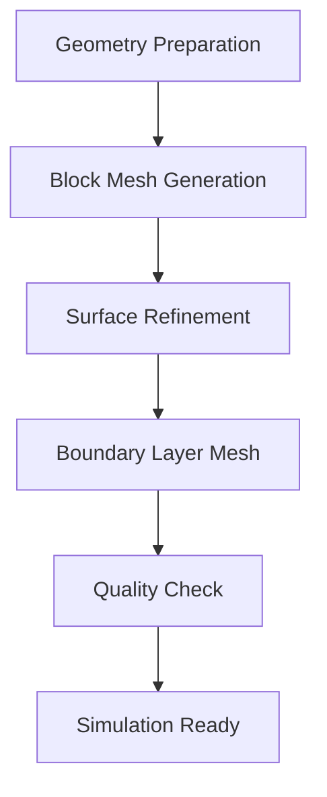

# การประยุกต์ใช้งานจริงในโลกวิศวกรรม (Practical Engineering Applications)

## 🔍 ภาพรวม (Overview)

โมดูลนี้เปลี่ยนจากทฤษฎีพื้นฐานไปสู่การแก้ปัญหาทางวิศวกรรมในโลกแห่งความเป็นจริง โดยใช้ OpenFOAM ในการวิเคราะห์และปรับปรุงการออกแบบ เราจะสำรวจกรณีศึกษาตั้งแต่พลศาสตร์อากาศของยานพาหนะไปจนถึงประสิทธิภาพของเครื่องแลกเปลี่ยนความร้อน

---

## 📖 วัตถุประสงค์ของไฟล์

ไฟล์นี้ทำหน้าที่เป็น **สะพานเชื่อมที่ครอบคลุม** ระหว่างความรู้ทางทฤษฎีของ CFD และการนำไปใช้จริงกับ OpenFOAM โดยมุ่งเน้นเฉพาะการใช้งานกับการไหลแบบเฟสเดียว (single-phase flow)

**วัตถุปราสงค์หลัก**: การแปลงแนวคิดพลศาสต์ของไหลที่เป็นนามธรรมให้เป็นกรณีจำลองที่สามารถดำเนินการได้ ซึ่งแสดงให้เห็นถึงการประยุกต์ใช้ทางวิศวกรรมในโลกแห่งความเป็นจริง

### 🎯 วัตถุปราสงค์ทางการศึกษา

#### **การบูรณาการทฤษฎีสู่การปฏิบัติ**

ไฟล์นี้เชื่อมโยง **สมการ CFD พื้นฐาน** กับการนำไปใช้ใน OpenFOAM แสดงให้เห็นว่าสูตรทางคณิตศาสตร์ถูกแปลงเป็น:
- **โครงสร้าง Solver**
- **Boundary Condition**
- **พารามิเตอร์การตั้งค่ากรณีจำลอง** (case setup)

#### **การเรียนรู้แบบลงมือปฏิบัติ**

แต่ละตัวอย่างประกอบด้วย **ไดเรกทอรีกรณีจำลอง (case directories) ที่สมบูรณ์** พร้อมไฟล์ที่จำเหนือทั้งหมด:

| ไดเรกทอรี | คำอธิบาย |
|------------|-----------|
| `0/` | เงื่อนไขเริ่มต้น |
| `constant/` | ข้อมูลคงที่ |
| `system/` | การตั้งค่าระบบ |

ทำให้สามารถ **ดำเนินการและปรับเปลี่ยนได้ทันที** โดยไม่ต้องมีการตั้งค่าเพิ่มเติม

---

## 🎯 วัตถุปราสงค์การเรียนรู้ (Learning Objectives)

เมื่อจบโมดูลนี้ คุณจะสามารถ:

### 1. ตั้งค่ากรณีศึกษาที่ซับซ้อน
- **การสร้างโครงสร้างไดเรกทอรีที่ถูกต้อง** ตามหลักการของ OpenFOAM (`0/`, `constant/`, `system/`)
- **การกำหนดค่าพารามิเตอร์ `controlDict`** สำหรับสกีมการแบ่งช่วงเวลาและปริภูมิขั้นสูง
- **การตั้งค่าตัวเลือก Solver ที่เหมาะสม** สำหรับการวิเคราะห์แบบสภาวะคงตัว (steady-state) เทียบกับการวิเคราะห์แบบชั่วคราว (transient)

### 2. เลือกแบบจำลองและ Solver ที่เหมาะสม
- **การเลือกแบบจำลองความปั่นป่วน** (Turbulence Modeling Selection): RANS models ($k$-$\epsilon$, $k$-$\omega$, SST), LES, DES
- **เกณฑ์การเลือก Solver** สำหรับการไหลแบบอัดตัวไม่ได้ อัดตัวได้ และการไหลที่ขับเคลื่อนด้วยแรงลอยตัว

### 3. สร้าง Mesh ที่เหมาะสมสำหรับการใช้งาน
- **เทคนิคการสร้าง Mesh**: blockMesh, snappyHexMesh, cfMesh
- **การปรับปรุงคุณภาพ Mesh**: อัตราส่วนภาพ (Aspect ratio), ความตั้งฉาก (Orthogonality), ความเบ้ (Skewness)
- **การแบ่งชั้นขอบเขต** (Boundary Layer Resolution): การใช้ wall-function กับ $y^+ \approx 30-300$

### 4. กำหนดเงื่อนไขขอบเขตที่สมจริง (Specify Realistic Boundary Conditions)
- **เงื่อนไขขอบเขตความเร็ว**: `fixedValue`, `zeroGradient`, `inletOutlet`
- **เงื่อนไขขอบเขตความดัน**: `fixedValue`, `totalPressure`, `waveTransmissive`
- **เงื่อนไขขอบเขตทางความร้อน**: `fixedValue`, `fixedGradient`, `mixed`

### 5. วิเคราะห์และตีความผลลัพธ์
- **การวิเคราะห์เชิงปริมาณ**: สัมประสิทธิ์แรงฉุก $C_D$, สัมประสิทธิ์แรงยก $C_L$, Reynolds stresses
- **การแสดงภาพการไหล** (Flow Visualization): Streamlines, Vorticity magnitude, Q-criterion
- **การวิเคราะห์ทางสถิติ**: การหาค่าเฉลี่ยตามเวลา, การคำนวณ RMS, การวิเคราะห์สเปกตรัม

### 6. ตรวจสอบความถูกต้องของการจำลองเทียบกับความคาดหวัง
- **การยืนยัน (Verification)**: การศึกษาความลู่เข้าของกริด (Grid Convergence Studies), การเปรียบเทียบกับผลเฉลยเชิงวิเคราะห์
- **การตรวจสอบความถูกต้อง (Validation)**: การเปรียบเทียบกับข้อมูลจากการทดลอง, การตรวจสอบความสัมพันธ์เชิงประจักษ์

### 7. เสนอแนะการปรับปรุงการออกแบบ
- **การปรับปรุงประสิทธิภาพ** (Performance Optimization): กลยุทธ์การลดแรงฉุก, การเพิ่มประสิทธิภาพการถ่ายเทความร้อน
- **ความไวต่อการออกแบบ** (Design Sensitivity): การศึกษาพารามิเตอร์, การปรับปรุงรูปทรง

---

## 📚 หัวข้อที่จะครอบคลุม

### 1. แนวทางการเรียนรู้ตามการประยุกต์ใช้งาน

#### ความสำคัญของการประยุกต์ใช้งานจริง

**CFD คือสาขาวิศวกรรมประยุกต์** ที่ความรู้เชิงทฤษฎีต้องถูกแปลงเป็นการจำลองที่เชื่อถือได้

การประยุกต์ใช้งานจริงจะยึดสมการนามธรรมเข้ากับข้อจำกัดในโลกแห่งความเป็นจริง:
- ความซับซ้อนของรูปทรงเรขาคณิต
- **Boundary Condition**
- คุณสมบัติของวัสดุ
- ทรัพยากรในการคำนวณ

> [!INFO] **การเชื่อมโยงทฤษฎีสู่การปฏิบัติ**
>
> โมดูลนี้จะเชื่อมช่องว่างระหว่างทฤษฎีและการปฏิบัติ โดยแสดงให้เห็นว่า OpenFOAM นำทฤษฎีไปใช้อย่างไร:
> - ตั้งแต่การแบ่งส่วนด้วยวิธี Finite Volume ใน `fvSchemes`
> - ไปจนถึงการจับคู่ความดัน-ความเร็ว (pressure-velocity coupling) ใน `simpleFoam`/`pimpleFoam`

---

## 🏗️ หัวข้อหลักที่ครอบคลุม

### 1.1 พลศาสตร์อากาศภายนอก (External Aerodynamics)

#### การไหลรอบวัตถุทึบ (Flow Over Bluff Bodies)

วัตถุทึบมีลักษณะเด่นคือแรงต้าน (pressure drag) สูงเนื่องจากการแยกตัวของไหล

**ระบอบการไหลของกระบอกกลม**:
| ช่วง Reynolds Number | ลักษณะการไหล | คุณสมบัติ |
|---------------------|----------------|------------|
| Subcritical ($\Re < 3\times10^5$) | Laminar boundary layer | $C_D \approx 1.2$ |
| Critical ($3\times10^5 < \Re < 3\times10^6$) | Transition to turbulent | การเปลี่ยนผ่าน |
| Supercritical ($\Re > 3\times10^6$) | Turbulent boundary layer | $C_D$ ลดลง |

**สมการโมเมนตัมสำหรับการไหลภายนอก:**

$$\rho \frac{\partial \mathbf{u}}{\partial t} + \rho (\mathbf{u} \cdot \nabla) \mathbf{u} = -\nabla p + \mu \nabla^2 \mathbf{u} + \mathbf{f}_{body} + \mathbf{f}_{turb}$$

โดยที่:
- $\mathbf{f}_{turb}$ แสดงถึงผลกระทบของ Reynolds stress tensor จากการสร้างแบบจำลองความปั่นป่วน
- $\mathbf{f}_{body}$ แสดงถึงแรงร่างกาย (เช่น แรงโน้มถ่วง)

**สัมประสิทธิ์แรงต้านและแรงยก (Drag and Lift Coefficients):**

$$C_D = \frac{F_D}{0.5 \rho U_\infty^2 A}, \quad C_L = \frac{F_L}{0.5 \rho U_\infty^2 A}$$

**OpenFOAM Code Implementation:**

เพิ่ม object ฟังก์ชัน `forces` ใน `controlDict`:
```cpp
// Function object to compute forces and moments on a patch
forces {
    type          forces;                       // Type of function object
    libs          (fieldFunctionObjects);       // Library to load
    patches       (cylinder);                   // List of patches to analyze
    rho           rhoInf;                       // Use reference density
    rhoInf        1.2;                          // Reference density value (kg/m³)
    CofR          (0 0 0);                      // Center of rotation for moments
    liftDir       (0 1 0);                      // Direction for lift coefficient
    dragDir       (1 0 0);                      // Direction for drag coefficient
    writeControl  timeStep;                     // Write output control
    writeInterval 1;                            // Write every time step
}
```

> **📂 Source:** `.applications/test/fieldMapping/pipe1D/system/controlDict`
>
> **คำอธิบาย:** Function object `forces` ใช้สำหรับคำนวณแรงและโมเมนต์ที่กระทำต่อพื้นผิวที่ระบุ โดยจะคำนวณสัมประสิทธิ์แรงฉุก ($C_D$) และแรงยก ($C_L$) จากแรงที่วัดได้ ความเร็วกระแสอิสระ และความหนาแน่นอ้างอิง
>
> **แนวคิดสำคัญ:**
> - **Center of Rotation (CofR):** จุดอ้างอิงสำหรับการคำนวณโมเมนต์
> - **Reference Density (rhoInf):** ความหนาแน่นที่ใช้ในการคำนวณสัมประสิทธิ์แรง สำคัญสำหรับการไหลแบบอัดตัวไม่ได้
> - **Force Components:** แรงที่คำนวณได้ประกอบด้วยแรงดันและแรงเฉือน (viscous force) รวมกัน

#### แอร์ฟอยล์และปีก (Airfoils and Wings)

แอร์ฟอยล์ถูกออกแบบมาเพื่อสร้างแรงยกโดยมีแรงต้านน้อยที่สุด

**อนุกรม NACA 4 หลัก** (เช่น NACA 2412) กำหนด:
- ความโค้ง (camber)
- ความหนา (thickness)

**Aspect ratio**: $AR = b^2/S$ มีผลต่อแรงต้านเหนี่ยวนำ (induced drag)

**การสร้าง Mesh ใน OpenFOAM**:
- 2 มิติ: `blockMesh` สำหรับแอร์ฟอยล์
- 3 มิติ: `snappyHexMesh` พร้อม `refinementBox` รอบๆ ขอบนำและขอบท้าย และปลายปีก
- สร้างบล็อกโครงสร้างแบบ C-type หรือ O-type เพื่อการแยกความละเอียดของ boundary layer ที่ดีขึ้น


> **Figure 1:** ขั้นตอนมาตรฐานในการเตรียมเมชสำหรับการจำลองพลศาสตร์อากาศของแอร์ฟอยล์และปีก เริ่มต้นจากการเตรียมรูปทรงเรขาคณิต การสร้างเมชโครงสร้างพื้นฐาน การปรับความละเอียดที่พื้นผิว การสร้างชั้นขอบเขต (Boundary Layer) และการตรวจสอบคุณภาพเมชเพื่อให้มั่นใจว่าพร้อมสำหรับการคำนวณที่แม่นยำ

#### อากาศพลศาสตร์ยานยนต์ (Vehicle Aerodynamics)

อากาศพลศาสตร์ยานยนต์เกี่ยวข้องกับการไหลแบบสามมิติที่ซับซ้อน, โครงสร้าง wake, และการรบกวนระหว่างตัวถัง, ล้อ และกระจก

**พื้นที่สำคัญ**:
- จุดหยุดนิ่งด้านหน้า
- กระแสวนที่เสา A (A-pillar vortices)
- Wake ของกระจกข้าง
- โซนแยกตัวด้านหลัง

**ค่าสัมประสิทธิ์แรงต้าน** $C_D$ (อิงตามพื้นที่หน้าตัวด้าน) อยู่ในช่วง 0.25 (รถยนต์ที่มีรูปทรงลู่ลม) ถึง 0.35 (SUV)

**การตั้งค่าใน OpenFOAM**:
- Mesh: `snappyHexMesh` พร้อมการปรับความละเอียดพื้นผิวบนตัวรถและล้อ
- Steady-state: `simpleFoam` พร้อม $k$-$\omega$ SST
- Transient: `pimpleFoam`

**Boundary Conditions**:
- ทางเข้า: `freestreamVelocity`
- ทางออก: `pressureInletOutlet`
- พื้นผิวด้านล่าง: ผนังเคลื่อนที่ (`movingWallVelocity`)

---

### 1.2 การไหลภายในและเครือข่ายท่อ (Internal Flows and Piping)

#### การไหลในท่อและช่องลม (Pipe and Duct Flow)

**การไหลในท่อแบบลามินาร์และปั่นป่วน (Laminar and Turbulent Pipe Flow)**

ระบอบการไหลในท่อถูกกำหนดโดย **Reynolds number**:
$$\Re = \frac{\rho U D}{\mu}$$

โดยที่:
- $\rho$ = ความหนาแน่นของของไหล
- $U$ = ความเร็วเฉลี่ย
- $D$ = เส้นผ่านศูนย์กลางท่อ
- $\mu$ = ความหนืดแบบไดนามิก

**จำแนกระบอบการไหล**:
- $\Re < 2300$: การไหลแบบลามินาร์ โปรไฟล์ความเร็วแบบพาราโบลา
  $$u(r) = 2U\left[1 - \left(\frac{r}{R}\right)^2\right]$$
- $\Re \approx 4000$: การเปลี่ยนผ่านสู่ความปั่นป่วน
- $\Re > 4000$: การไหลแบบปั่นป่วน โปรไฟล์ความเร็วที่แบนลงพร้อมชั้นบางๆ ที่มีความหนืด (viscous sublayer)

**OpenFOAM Code Implementation:**

เลือกแบบจำลองความปั่นป่วนใน `constant/turbulenceProperties`:
```cpp
// Turbulence model selection dictionary
simulationType RAS;                      // Use RANS (Reynolds-Averaged Navier-Stokes)
RAS { 
    RASModel kEpsilon;                   // Select k-epsilon turbulence model
    // Alternative models: kOmegaSST, SpalartAllmaras, etc.
}
```

สำหรับการจำลองแบบลามินาร์ ให้ตั้งค่า `simulationType laminar`

> **📂 Source:** `.applications/solvers/multiphase/compressibleInterFoam/compressibleInterPhaseTransportModel/compressibleInterPhaseTransportModel.C`
>
> **คำอธิบาย:** การตั้งค่าประเภทของการจำลองความปั่นป่วนใน OpenFOAM โดยใช้ `simulationType` เพื่อระบุว่าจะใช้แบบจำลองใด ในตัวอย่างนี้ใช้ RANS (Reynolds-Averaged Navier-Stokes) กับแบบจำลอง k-epsilon
>
> **แนวคิดสำคัญ:**
> - **RAS vs. LES:** RAS ให้ผลลัพธ์เฉลี่ยตามเวลา (time-averaged) เหมาะกับ steady-state ในขณะที่ LES ให้ผลลัพธ์ที่ละเอียดกว่าแต่ต้องการคอมพิวติ้งมากกว่า
> - **k-epsilon Model:** เหมาะกับการไหลที่มีความปั่นป่วนสูงและไม่มี gradient ความดันสูง เหมาะสำหรับการไหลในท่อและช่องลม
> - **Wall Functions:** แบบจำลอง k-epsilon ต้องการ wall functions สำหรับประเมิน shear stress ที่ผนังใกล้เคียง

**ตัวเลือก Solver**:
| Solver | ประเภท | ความเหมาะสม |
|--------|--------|--------------|
| **simpleFoam** | steady-state | การไหลแบบสม่ำเสมอ |
| **pisoFoam** | transient | การไหลแบบไม่สม่ำเสมอ |

#### การคำนวณความดันตกคร่อม (Pressure Drop Calculation)

การสูญเสียความดันในท่อเป็นไปตามสมการ **Darcy–Weisbach**:
$$\Delta p = f \frac{L}{D} \frac{\rho U^2}{2},$$

**ค่า Friction Factor**:
- การไหลแบบลามินาร์: $f = 64/\Re$
- การไหลแบบปั่นป่วน: ใช้สมการ **Colebrook–White**:
  $$\frac{1}{\sqrt{f}} = -2.0 \log_{10}\left( \frac{\varepsilon/D}{3.7} + \frac{2.51}{\Re\sqrt{f}} \right).$$

**OpenFOAM Code Implementation:**

เพิ่ม object ฟังก์ชัน `pressureDrop` ใน `controlDict`:
```cpp
// Function object to compute pressure drop between inlet and outlet
pressureDrop {
    type          pressureDrop;               // Type of function object
    libs          (fieldFunctionObjects);     // Library to load
    inletPatch    inlet;                      // Name of inlet patch
    outletPatch   outlet;                     // Name of outlet patch
    log           true;                       // Enable logging
}
```

> **📂 Source:** `.applications/test/fieldMapping/pipe1D/system/controlDict`
>
> **คำอธิบาย:** Function object `pressureDrop` ใช้สำหรับคำนวณความต่างความดันระหว่าง patch ทางเข้าและทางออก โดยจะคำนวณค่าเฉลี่ยของความดันบนแต่ละ patch และรายงานความต่างที่ได้
>
> **แนวคิดสำคัญ:**
> - **Patch Selection:** ต้องระบุชื่อของ patch ทางเข้าและทางออกให้ถูกต้องตามที่กำหนดใน `boundary` file
> - **Pressure Averaging:** ค่าความดันที่รายงานเป็นค่าเฉลี่ยบนพื้นที่ผิว (area-weighted average)
> - **Applications:** ใช้สำหรับการประเมินประสิทธิภาพของระบบท่อ และการออกแบบเครื่องแลกเปลี่ยนความร้อน

#### การถ่ายเทความร้อนในท่อ (Heat Transfer in Pipes)

การถ่ายเทความร้อนแบบพาหะ (convective heat transfer) ถูกอธิบายด้วย **Nusselt number** $\Nu = h D / k$

**สูตรคำนวณความสามารถในการถ่ายเทความร้อน**:
| ชื่อสูตร | สมการ | ช่วงที่เหมาะสม |
|------------|---------|---------------|
| Dittus–Boelter | $\Nu = 0.023 \Re^{0.8} \Pr^{0.4}$ (การให้ความร้อน) | ความปั่นป่วนทั่วไป |
| Gnielinski | $$\Nu = \frac{(f/8)(\Re-1000)\Pr}{1+12.7\sqrt{f/8}(\Pr^{2/3}-1)}$$ | ความแม่นยำสูง |

**การเลือก Solver ใน OpenFOAM**:
| Solver | ประเภท | ความเหมาะสม |
|--------|--------|--------------|
| **buoyantFoam** | Conjugate heat transfer | การถ่ายเทความร้อนระหว่างของแข็ง-ของไหล |
| **chtMultiRegionFoam** | Multi-region | การจับคู่ของแข็ง-ของไหลหลายโซน |

---

### 1.3 การผสมและการกวน (Mixing and Stirring)

#### เครื่องผสมแบบสถิต (Static Mixers)

เครื่องผสมแบบสถิต (Kenics, helical) อาศัยองค์ประกอบทางเรขาคณิตในการแบ่งและรวมกระแส ทำให้เกิดการผสมโดยการไหลแบบสุ่ม (chaotic advection)

**คุณสมบัติ**:
- แรงดันตกคร่อมสูงกว่าท่อเปล่า
- ไม่มีชิ้นส่วนที่เคลื่อนไหว
- ประสิทธิภาพวัดด้วย **coefficient of variation**: $CoV = \sigma_c / \bar{c}$
  - $\sigma_c$ = ส่วนเบี่ยงเบนมาตรฐานของความเข้มข้น
  - $\bar{c}$ = ค่าเฉลี่ยของความเข้มข้น
  - $c$ = ความเข้มข้นของสารติดตาม (tracer concentration)

**OpenFOAM Code Implementation**:
- Solver: `scalarTransportFoam` หรือเพิ่ม passive scalar ใน `simpleFoam`
- กำหนดค่าการแพร่ (diffusivity) ใน `transportProperties`
- Mesh: `snappyHexMesh` โดยปรับความละเอียดที่ใบพัด (mixer blades)

#### ถังผสมแบบกวน (Stirred Tanks)

ถังผสมแบบกวนใช้ใบพัดหมุน (impellers) (Rushton, pitched-blade) เพื่อสร้างการไหลเวียน แผ่นกั้น (baffles) ป้องกันการหมุนแบบ solid-body

**ตัวชี้วัดประสิทธิภาพ**:
- **เวลาผสม** $\theta_{95}$ (เวลาที่ถึง 95% ของความสม่ำเสมอ) สัมพันธ์กับกำลังที่ป้อนเข้าไป $P$

**แนวทางการใช้ OpenFOAM**:

| วิธีการ | Solver | ความแม่นยำ | ความเร็ว |
|-----------|--------|--------------|-----------|
| Moving Reference Frame (MRF) | `SRFSimpleFoam` | ปานกลาง | เร็ว |
| Sliding Mesh | `pimpleDyMFoam` | สูง | ช้า |
| Immersed Boundary | `overPimpleDyMFoam` | ปานกลาง-สูง | ปานกลาง |

**การตั้งค่า**:
- `turbulenceProperties` ด้วย `RASModel kEpsilon` หรือ `LES` สำหรับกระแสวนขนาดใหญ่
- ติดตามค่าแรงบิด (torque) ผ่าน object ฟังก์ชัน `forces` บนพื้นผิวใบพัด

#### การกระจายเวลาพำนัก (Residence Time Distribution - RTD)

**RTD** อธิบายการกระจายอายุของของไหลในภาชนะ วัดได้จากการตอบสนองต่อการฉีดสารติดตาม (tracer pulse response)

**ประเภทของเครื่องปฏิกรณ์**:
- **CSTR ในอุดมคติ**: RTD แบบ exponential
- **PFR ในอุดมคติ**: RTD แบบ Dirac delta

OpenFOAM สามารถจำลองการฉีดสารติดตามด้วย `scalarTransportFoam` และส่งออกอนุกรมเวลาความเข้มข้นที่ทางออก

---

### 1.4 เครื่องแลกเปลี่ยนความร้อน (Heat Exchangers)

#### เครื่องแลกเปลี่ยนความร้อนแบบเปลือกและท่อ (Shell-and-Tube Heat Exchangers)

เครื่องแลกเปลี่ยนความร้อนแบบเปลือกและท่อประกอบด้วยกลุ่มท่อที่อยู่ภายในเปลือกทรงกระบอก

**โครงสร้าง**:
- ของไหลหนึ่งไหลภายในท่อ (tube-side)
- อีกของไหลหนึ่งไหลภายนอกท่อในเปลือก (shell-side)
- แผ่นกั้น (baffles) จะนำทางการไหลของเปลือกให้ข้ามท่อ

**การประเมินประสิทธิภาพ**:
- วิธี **Log Mean Temperature Difference (LMTD)**
- วิธี **Number of Transfer Units (NTU)**

**การจำลองใน OpenFOAM**:
- จำลองหน่วยเซลล์ซ้ำ (representative periodic unit cell) เพื่อลดต้นทุนการคำนวณ
- ใช้ `chtMultiRegionFoam` สำหรับ conjugate heat transfer ระหว่างท่อของแข็งและของไหล
- ตั้งค่า `turbulenceProperties` สำหรับแต่ละโซนของไหล
- สำหรับเปลือกด้านนอกที่เป็นพรุน ให้ใช้ `fvOptions` พร้อมสัมประสิทธิ์ Darcy-Forchheimer

**OpenFOAM Code Implementation**: กำหนดใน `constant/fvOptions`:
```cpp
// Porous media model using Darcy-Forchheimer equation
porosity
{
    type            explicitPorositySource;       // Type of source term
    active          true;                        // Activate this source
    selectionMode   cellZone;                    // Select by cell zone
    cellZone        radiator;                    // Name of cell zone
    
    explicitPorositySourceCoeffs {
        type            DarcyForchheimer;         // Darcy-Forchheimer model
        DarcyForchheimerCoeffs {
            d   (1e5 1e5 1e5);                   // Darcy coefficient (viscous resistance)
            f   (10 10 10);                      // Forchheimer coefficient (inertial resistance)
        }
    }
}
```

> **📂 Source:** `.applications/test/patchRegion/cavity_pinched/system/controlDict`
>
> **คำอธิบาย:** Model ของสื่อพรุน (porous media) ใน OpenFOAM ใช้สมการ Darcy-Forchheimer เพื่อจำลองแรงต้านของการไหลผ่านวัสดุพรุน โดยมีสองส่วนคือแรงต้านภายใต้การไหลแบบซิม (Darcy term) และแรงต้านภายใต้การไหลแบบเทอร์บูลุน (Forchheimer term)
>
> **แนวคิดสำคัญ:**
> - **Darcy Coefficient (d):** ค่าสัมประสิทธิ์แรงต้านแบบ viscous มีหน่วย [1/m²] สำคัญเมื่อ Reynolds number ต่ำ
> - **Forchheimer Coefficient (f):** ค่าสัมประสิทธิ์แรงต้านแบบ inertial มีหน่วย [1/m] สำคัญเมื่อ Reynolds number สูง
> - **Cell Zone Selection:** ต้องสร้าง cellZone ใน mesh ก่อนโดยใช้ `topoSet` หรือ `snappyHexMesh`
> - **Applications:** ใช้สำหรับจำลอง heat exchangers, radiators, catalytic converters, และ filters

#### การประเมินประสิทธิภาพ (Performance Evaluation)

**ตัวชี้วัดประสิทธิภาพ**:
- **ประสิทธิภาพ**: $\varepsilon = Q_{\text{actual}} / Q_{\text{max}}$
- **ค่าสัมประสิทธิ์การถ่ายเทความร้อนโดยรวม**: $U$ คำนวณจาก $Q = U A \Delta T_{\text{LMTD}}$
- **แรงดันตกคร่อม**: $\Delta p$ ทั้งสองด้านจะกำหนดกำลังของปั๊ม

**การประมวลผลภายหลังใน OpenFOAM**:
- ใช้ `fieldAverage` เพื่อหาค่าเฉลี่ยอุณหภูมิที่ทางเข้า/ทางออก
- คำนวณ $Q = \dot{m} c_p (T_{\text{out}} - T_{\text{in}})$ สำหรับแต่ละกระแส
- เพิ่ม object ฟังก์ชัน `pressureDrop` สำหรับแต่ละกระแส

---

## 🏭 การเชื่อมโยงกับอุตสาหกรรม (Industry Connections)

| อุตสาหกรรม | การใช้งาน CFD | ตัวชี้วัดสำคัญ |
|------------|--------------|---------------|
| **ยานยนต์** | พลศาสตร์อากาศตัวถัง, ระบายความร้อนเครื่องยนต์ | $C_D$, $C_L$, อุณหภูมิใต้ฝากระโปรง |
| **อากาศยาน** | ปีกเครื่องบิน, ระบบขับเคลื่อน | Stall angle, ประสิทธิภาพแรงยก |
| **วิศวกรรมเคมี** | เครื่องปฏิกรณ์, ถังผสม | Mixing index, เวลากักตัว |
| **พลังงาน** | กังหันลม, หม้อน้ำ | แรงบิด (Torque), อัตราถ่ายเทความร้อน |
| **การแปรรูปทางเคมี** | เครื่องปฏิกรณ์เคมี, ระบบเผาไหม้ | Conversion, Selectivity, Residence Time |
| **HVAC** | การระบายอากาศในอาคาร, เครื่องแลกเปลี่ยนความร้อน | Thermal comfort, Pressure drop, Effectiveness |
| **ชีวการแพทย์** | การไหลของเลือด, ทางเดินหายใจ | Wall shear stress, Flow rate, Pressure gradient |

---

## 📊 ตัวชี้วัดทางวิศวกรรมที่สำคัญ (Key Metrics)

OpenFOAM ช่วยให้เราสกัดค่าสำคัญมาวิเคราะห์ผ่าน `system/controlDict`:

### 1. ความดันตก (Pressure Drop)

**ความดันตกพื้นฐาน:**
$$\Delta p = p_{\text{inlet}} - p_{\text{outlet}}$$

**ค่าสัมประสิทธิ์ความดันตก ($K_p$):**
$$K_p = \frac{\Delta p}{0.5 \rho U_{\text{avg}}^2}$$

**การประยุกต์ใช้**: การเลือกขนาดปั๊ม, ประเมินประสิทธิภาพการถ่ายเทความร้อน

### 2. สัมประสิทธิ์การถ่ายเทความร้อน (Heat Transfer Coefficient)

**สัมประสิทธิ์การถ่ายเทความร้อน:**
$$h = \frac{q''}{T_s - T_\infty}$$

**จำนวนนัสเซิลต์ (Nusselt number) แบบไร้มิติ:**
$$Nu = \frac{hL}{k}$$

**การประยุกต์ใช้**: เครื่องแลกเปลี่ยนความร้อน, อุปกรณ์อิเล็กทรอนิกส์, อาคาร

### 3. สัมประสิทธิ์แรงฉุดและแรงยก (Drag and Lift Coefficients)

**สัมประสิทธิ์แรงฉุก (Drag Coefficient):**
$$C_D = \frac{F_D}{0.5 \rho U_\infty^2 A}$$

**สัมประสิทธิ์แรงยก (Lift Coefficient):**
$$C_L = \frac{F_L}{0.5 \rho U_\infty^2 A}$$

**การประยุกต์ใช้**: ยานพาหนะ, ใบพัดกังหันลม, ปีกเครื่องบิน, เรือ

### 4. ประสิทธิภาพการผสม (Mixing Efficiency)

**ดัชนีการผสม (Mixing Index - MI):**
$$MI = \frac{\sigma_{\text{max}}^2 - \sigma^2}{\sigma_{\text{max}}^2 - \sigma_{\text{min}}^2}$$

**ระดับของการผสม (Degree of Mixing - DOM):**
$$\text{DOM} = 1 - \frac{\sigma}{\sigma_0}$$

**การประยุกต์ใช้**: เครื่องปฏิกรณ์เคมี, ระบบการเผาไหม้, สิ่งแวดล้อม

### 5. เวลากักตัว (Residence Time)

**เวลาการกักตัวเฉลี่ย (Mean Residence Time):**
$$\bar{t} = \frac{V}{\dot{V}}$$

**การกระจายตัวของเวลาการกักตัว (Residence Time Distribution - RTD):**
$$E(t) = \frac{c(t)}{\int_0^\infty c(t) \, \mathrm{d}t}$$

**การประยุกต์ใช้**: เครื่องปฏิกรณ์เคมี, บำบัดน้ำเสีย, อาหาร, ยา

### 6. การใช้พลังงาน (Power Consumption)

**กำลังของปั๊ม (Pump Power):**
$$P = \Delta p \cdot \dot{V}$$

**เลขกำลัง (Power Number):**
$$N_P = \frac{P}{\rho N^3 D^5}$$

**การประยุกต์ใช้**: ปั๊มและพัดลม, ถังผสม, กังหันและคอมเพรสเซอร์

---

## ⏱️ ระยะเวลาเรียนโดยประมาณ

### ส่วนการอ่าน: 3-4 ชั่วโมง

ส่วนการอ่านครอบคลุมการศึกษาเชิงลึกเกี่ยวกับ:
- **ทฤษฎีพื้นฐานของ CFD**
- **สถาปัตยกรรมของ OpenFOAM**
- **แนวคิดการนำไปปฏิบัติจริง**

### ส่วนแบบฝึกหัด: 6-8 ชั่วโมง

| กิจกรรม | เวลาที่คาดหวัง | คำอธิบาย |
|----------|--------------|-------------|
| **การตั้งค่า Case** | 1-2 ชั่วโมง | การสร้างและกำหนดค่า OpenFOAM simulation cases |
| **การสร้าง Mesh** | 2-3 ชั่วโมง | การนำ blockMesh และ snappyHexMesh workflows ไปใช้ |
| **การรัน Solver** | 1-2 ชั่วโมง | การรัน simulation และการติดตาม convergence |
| **การ Post-processing** | 1 ชั่วโมง | การวิเคราะห์ผลลัพธ์โดยใช้ paraFoam และยูทิลิตี้อื่นๆ |
| **การ Debugging** | 1 ชั่วโมง | การระบุและแก้ไขปัญหา simulation ทั่วไป |

### การลงทุนทั้งหมด: 9-12 ชั่วโมง

---

## 🔍 แนวคิดหลัก (KEY CONCEPTS)

### การสร้างแบบจำลองเฉพาะสำหรับงาน (Application-Specific Modeling)

การสร้างแบบจำลองเฉพาะสำหรับงานใน OpenFOAM เกี่ยวข้องกับการปรับแนวทางการคำนวณให้เข้ากับฟิสิกส์และความต้องการทางวิศวกรรมที่เป็นเอกลักษณ์ของอุตสาหกรรมและกระบวนการเฉพาะต่างๆ

แนวทางนี้ตระหนักดีว่าแอปพลิเคชันที่แตกต่างกันมักต้องการ:
- **กลยุทธ์การสร้างแบบจำลอง** เฉพาะทาง
- **เงื่อนไขขอบเขต (Boundary Condition)** ที่เหมาะสม
- **โครงร่างเชิงตัวเลข (Numerical Schemes)** ที่เชี่ยวชาญเฉพาะทาง

### การปรับปรุงประสิทธิภาพการออกแบบ (Design Optimization)

การปรับปรุงประสิทธิภาพการออกแบบโดยใช้ OpenFOAM เป็นการบูรณาการการจำลอง CFD เข้ากับอัลกอริทึมการปรับปรุงประสิทธิภาพเพื่อปรับปรุงประสิทธิภาพการออกแบบอย่างเป็นระบบ

**กระบวนการทำงานของการปรับปรุงประสิทธิภาพ:**

$$\text{Design Space} \rightarrow \text{CFD Evaluation} \rightarrow \text{Performance Metrics} \rightarrow \text{Optimizer} \rightarrow \text{New Design}$$

### การตรวจสอบความถูกต้องและการยืนยัน (Validation and Verification)

**Verification and Validation (V&V)** เป็นส่วนประกอบที่สำคัญของการวิเคราะห์ CFD ที่เชื่อถือได้

**Grid Convergence Index (GCI)** ให้การวัดเชิงปริมาณของความไม่แน่นอนเชิงตัวเลข:

$$\text{GCI} = \frac{1.25|\epsilon_{21}|}{r^p - 1}$$

โดยที่:
- $\epsilon_{21}$ = ข้อผิดพลาดสัมพัทธ์ระหว่างกริดละเอียดและกริดปานกลาง
- $r$ = อัตราส่วนการปรับปรุง (Refinement Ratio)
- $p$ = อันดับความแม่นยำที่สังเกตได้

### แนวทางปฏิบัติที่ดีที่สุด (Best Practices)

**คุณภาพของกริด (Mesh Quality)**:
- **คุณภาพเชิงตั้งฉาก (Orthogonal Quality)** > 0.3
- **อัตราส่วนภาพ (Aspect Ratio)** < 1000
- **ความไม่เป็นเชิงตั้งฉาก (Non-orthogonality)** น้อยที่สุด

**กลยุทธ์การนำไปใช้ใน OpenFOAM**:
1. **ใช้ Function Objects ที่มีมาให้** สำหรับตัวชี้วัดมาตรฐาน
2. **สร้าง Function Objects แบบกำหนดเอง** สำหรับการคำนวณเฉพาะทาง
3. **ใช้ Post-processing Utilities** สำหรับการวิเคราะห์ที่ครอบคลุม
4. **ตรวจสอบความถูกต้อง** กับผลเฉลยเชิงวิเคราะห์หรือข้อมูลจากการทดลอง

---

**หัวข้อถัดไป**: [พลศาสตร์อากาศภายนอกอย่างละเอียด](./01_External_Aerodynamics.md)