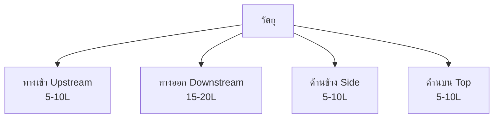

# พลศาสตร์อากาศภายนอก (External Aerodynamics)

## 📖 บทนำ (Introduction)

พลศาสตร์อากาศภายนอกเป็นการศึกษาการไหลรอบวัตถุ ซึ่งมีความสำคัญอย่างยิ่งในการออกแบบยานพาหนะ เครื่องบิน และโครงสร้างพื้นฐาน OpenFOAM มีเครื่องมือที่ทรงพลังสำหรับการวิเคราะห์แรงต้าน แรงยก และลักษณะกระแสลมท้าย (Wake) ด้วยความแม่นยำสูง

> [!INFO] ความสำคัญทางวิศวกรรม
> การวิเคราะห์พลศาสตร์อากาศภายนอกช่วยให้วิศวกรสามารถ:
> - ลดแรงต้านและปรับปรุงประสิทธิภาพการใช้เชื้อเพลิง
> - เพิ่มประสิทธิภาพแรงยกสำหรับยานพาหนะ
> - ทำนายโหมดการสั่นสะเทือนและเสียง
> - วิเคราะห์การกระจายความดันและอุณหภูมิ

---

## 🔍 1. ตัวชี้วัดอากาศพลศาสตร์ที่สำคัญ

### 1.1 สัมประสิทธิ์แรงต้านและแรงยก (Drag and Lift Coefficients)

แรงที่กระทำต่อวัตถุถูกทำให้ไร้มิติเพื่อการเปรียบเทียบ:

**Drag Coefficient ($C_D$):**
$$C_D = \frac{F_D}{0.5 \rho U_\infty^2 A} \tag{1.1}$$

**Lift Coefficient ($C_L$):**
$$C_L = \frac{F_L}{0.5 \rho U_\infty^2 A} \tag{1.2}$$

โดยที่:
- $F_D, F_L$: แรงต้านและแรงยก [N]
- $\rho$: ความหนาแน่นของของไหล [kg/m³]
- $A$: พื้นที่อ้างอิง (Projected area สำหรับแรงต้าน, Planform area สำหรับแรงยก) [m²]
- $U_\infty$: ความเร็วกระแสอิสระ [m/s]

**Pressure Coefficient ($C_p$):**
$$C_p = \frac{p - p_\infty}{0.5 \rho U_\infty^2} \tag{1.3}$$

แสดงถึงการกระจายความดันบนพื้นผิววัตถุ โดยที่:
- $p$: ความดันเฉพาะจุด [Pa]
- $p_\infty$: ความดันกระแสอิสระ [Pa]

### 1.2 ตัวเลขสเตราฮัล (Strouhal Number, St)

ใช้ระบุความถี่ของการแยกตัวของกระแสวน (Vortex Shedding):

$$St = \frac{f_s D}{U_\infty} \tag{1.4}$$

โดยที่:
- $f_s$: ความถี่ของการสลัดกระแสวน [Hz]
- $D$: ขนาดลักษณะเฉพาะ (เช่น เส้นผ่านศูนย์กลาง) [m]

**ค่าทั่วไป:**
- กระบอกกลม: $St \approx 0.2$ สำหรับ $10^3 < Re < 10^5$
- ทรงกลม: $St \approx 0.1-0.2$

> [!TIP] ความสำคัญของ Strouhal Number
> การทราบค่า St ช่วยให้เราทำนายความถี่ของการสั่นสะเทือนเนื่องจาก vortex shedding ซึ่งเป็นสิ่งสำคัญในการออกแบบโครงสร้างให้ทนต่อการเกิดความเหนื่อยจากการสั่น

### 1.3 ตัวเลขเรย์โนลด์ (Reynolds Number, Re)

กำหนดระบอบการไหล:

$$Re = \frac{\rho U_\infty L}{\mu} = \frac{U_\infty L}{\nu} \tag{1.5}$$

โดยที่:
- $L$: ความยาวลักษณะเฉพาะ [m]
- $\mu$: ความหนืดพลศาสตร์ [Pa·s]
- $\nu$: ความหนืดเชิงจลน์ [m²/s]

**จำแนกระบอบการไหล:**
- $Re < 2300$: การไหลแบบ Laminar (ในท่อ)
- $2300 < Re < 4000$: การไหลแบบเปลี่ยนผ่าน
- $Re > 4000$: การไหลแบบ Turbulent

---

## 🏗️ 2. การสร้าง Mesh สำหรับการไหลภายนอก

การจำลองการไหลภายนอกต้องการโดเมนขนาดใหญ่เพื่อป้องกัน "ผลกระทบจากขอบเขต" (Boundary effects):

### 2.1 ขนาดโดเมนการคำนวณ


> **Figure 1:** ข้อแนะนำในการกำหนดขนาดโดเมนการคำนวณสำหรับการไหลภายนอกรอบวัตถุ โดยต้องมีระยะห่างที่เพียงพอในทิศทางต้นน้ำ (Upstream) ท้ายน้ำ (Downstream) และด้านข้าง เพื่อป้องกันไม่ให้เงื่อนไขขอบเขตส่งผลกระทบต่อลักษณะการไหลจริงรอบรูปทรงที่พิจารณาความปลอดภัยทางฟิสิกส์ไม่ส่งผลกระทบต่อความเร็วในการจำลอง ผ่านการใช้พลังของ C++ Template Metaprogramming ในการตรวจสอบความสอดคล้องทางมิติทั้งหมดที่ขั้นตอนการคอมไพล์โปรแกรมเพียงครั้งเดียว

**กฎทั่วไป:**
- **ทางเข้า (Upstream)**: 5-10 เท่าของความยาววัตถุ
- **ทางออก (Downstream)**: 15-20 เท่าของความยาววัตถุ (เพื่อจับภาพ Wake ที่สมบูรณ์)
- **ด้านข้างและด้านบน**: 5-10 เท่าของความสูงวัตถุ

### 2.2 การปรับความละเอียดบริเวณผนัง (Near-Wall Resolution)

บริเวณใกล้ผิวต้องมีการใส่ **Prism Layers** เพื่อจับชั้น Boundary Layer:

**$y^+$ Parameter:**
$$y^+ = \frac{u_\tau y}{\nu} = \frac{\sqrt{\tau_w/\rho} \cdot y}{\nu} \tag{2.1}$$

โดยที่:
- $u_\tau$: ความเร็วเชิงเฉือน (friction velocity) [m/s]
- $y$: ระยะห่างจากผนัง [m]
- $\tau_w$: แรงเฉือนผนัง (wall shear stress) [Pa]

**แนวทางการเลือก:**

| แนวทาง | $y^+$ ที่เหมาะสม | ความละเอียดชั้น | Turbulence Model |
|---------|-------------------|------------------|-------------------|
| **Wall-resolved LES/DNS** | $\approx 1$ | 10-15 เซลล์ | LES, DNS |
| **Wall functions (RANS)** | 30-300 | 5-10 เซลล์ | k-ε, k-ω SST |
| **Hybrid DES** | $\approx 1$ บริเวณแยกตัว | 10-15 เซลล์ | DES |

**ความสูงเซลล์แรก:**
$$\Delta y = \frac{y^+ \mu}{\rho u_\tau} \tag{2.2}$$

### 2.3 การกำหนดค่า SnappyHexMesh

```cpp
// system/snappyHexMeshDict
castellatedMesh true;
snap            true;
addLayers       true;

geometry
{
    vehicle.stl
    {
        type triSurfaceMesh;
        name vehicle;
    }
}

refinementSurfaces
{
    vehicle
    {
        level (2 2);  // Surface refinement level
        patchInfo
        {
            type wall;
            inGroups (vehicleGroup);
        }
    }
}

refinementRegions
{
    wakeBox
    {
        mode inside;
        levels ((10 2) (20 3));  // Gradual wake refinement
    }

    nearVehicleBox
    {
        mode distance;
        levels ((0.1 4) (0.5 3) (1.0 2));
    }
}

addLayersControls
{
    relativeSizes true;

    layers
    {
        vehicle
        {
            nSurfaceLayers 15;  // Number of prism layers

            expansionRatio 1.2;  // Growth ratio

            finalLayerThickness 0.5;  // Target y+ ~ 30-50

            minThickness 0.001;  // Minimum layer thickness
        }
    }
}
```

---

## 💻 3. การนำไปใช้ใน OpenFOAM

### 3.1 การคำนวณสัมประสิทธิ์แรง (Force Coefficients)

เราใช้ Function Object `forces` ในไฟล์ `system/controlDict` เพื่อดึงค่าสัมประสิทธิ์ออกมาโดยอัตโนมัติ:

```cpp
// system/controlDict
functions
{
    forcesCoeffs
    {
        type            forces;
        libs            (fieldFunctionObjects);
        writeControl    timeStep;
        writeInterval   1;
        timeStart       0;

        patches         (vehicleBody);

        // Density specification
        rho             rhoInf;      // ใช้ความหนาแน่นคงที่
        rhoInf          1.225;       // ความหนาแน่นอากาศ [kg/m³]

        // Center of rotation
        CofR            (0 0 0);     // จุดศูนย์กลางการหมุน

        // Coordinate system
        coordinateSystem
        {
            type    cartesian;
            origin  (0 0 0);
            e1      (1 0 0);  // X-axis = drag direction
            e3      (0 0 1);  // Z-axis = vertical
        }

        // Force directions
        dragDir         (1 0 0);    // ทิศทางแรงต้าน (แกน X)
        liftDir         (0 0 1);    // ทิศทางแรงยก (แกน Z)
        pitchAxis       (0 1 0);    // แกนการหมุนควง (แกน Y)

        // Reference quantities
        magUInf         30.0;       // ความเร็วอ้างอิง [m/s]
        lRef            4.5;        // ความยาวอ้างอิง [m]
        Aref            2.2;        // พื้นที่อ้างอิง [m²]

        // Output settings
        log             true;
        writeFields     false;
    }
}
```

### 3.2 การติดตามความดัน (Pressure Monitoring)

```cpp
functions
{
    surfacePressureCoeff
    {
        type            surfaceRegion;
        libs            (fieldFunctionObjects);
        writeControl    timeStep;
        writeInterval   1;

        operation       average;
        surfaceFormat   none;

        regionType      patch;
        name            vehicleBody;

        fields
        (
            Cp  // Pressure coefficient
        );
    }

    pressureProbes
    {
        type            probes;
        libs            (sampling);
        writeControl    timeStep;
        writeInterval   1;

        probeLocations
        (
            (0.5  0.0  0.0)   // หน้ารถ
            (1.5  0.0  0.0)   // บนหลังคา
            (2.5  0.0  0.0)   // ท้ายรถ
            (3.0  0.0  0.0)   // ใน wake
        );

        fields          (p U Cp);
    }
}
```

### 3.3 การวิเคราะห์ Wake

```cpp
functions
{
    wakeAnalysis
    {
        type            sets;
        libs            (fieldFunctionObjects);
        writeControl    timeStep;
        writeInterval   10;

        setFormat       raw;

        sets
        (
            wakeLineX
            {
                type        uniform;
                axis        x;
                start       (3.0  0.0  0.0);
                end         (10.0 0.0  0.0);
                nPoints     100;
            }

            wakeLineZ
            {
                type        uniform;
                axis        z;
                start       (3.0  0.0 -1.0);
                end         (3.0  0.0  1.0);
                nPoints     50;
            }
        );

        fields          (p U k omega);
    }
}
```

---

## 🌪️ 4. การเลือกแบบจำลองความปั่นป่วน

### 4.1 แนวทางการเลือกแบบจำลอง

| แบบจำลอง | ความแม่นยำ | ต้นทุนการคำนวณ | กรณีที่เหมาะสม | เวลาคำนวณ |
|------------|-------------|------------------|-------------------|-------------|
| **k-ω SST** | สูงสำหรับการไหลติดผนัง | ปานกลาง | การไหลที่ติดกับพื้นผิวและมีการแยกตัวเล็กน้อย | 1-10 ชม. |
| **k-ε** | ปานกลางสำหรับ free shear | ต่ำ | การไหลแบบ free shear | 0.5-5 ชม. |
| **LES** | สูงมาก | สูงมาก | การไหลที่มีโครงสร้างไม่คงที่ซับซ้อน | 10-100 ชม. |
| **DES/Hybrid** | สูง | สูง | การสมดุลระหว่างความแม่นยำและต้นทุน | 5-50 ชม. |

### 4.2 Steady-state vs Transient

**Steady-state (simpleFoam):**
```cpp
// system/fvSolution
SIMPLE
{
    nNonOrthogonalCorrectors 2;

    residualControl
    {
        p           1e-6;
        U           1e-6;
        k           1e-6;
        omega       1e-6;
    }
}

relaxationFactors
{
    fields
    {
        p       0.3;
    }
    equations
    {
        U       0.7;
        k       0.7;
        omega   0.7;
    }
}
```

**Transient (pimpleFoam):**
```cpp
PIMPLE
{
    nCorrectors     2;      // Outer correctors
    nNonOrthogonalCorrectors 2;
    nAlphaCorr      1;
    nAlphaSubCycles 2;

    residualControl
    {
        p           1e-5;
        U           1e-5;
        k           1e-5;
        omega       1e-5;
    }
}

// Time step control
adjustTimeStep  yes;
maxCo          0.8;  // Courant number < 1
maxDeltaT      1e-3;
```

### 4.3 การตั้งค่า Turbulence Model

**k-ω SST Model (แนะนำสำหรับพลศาสตร์อากาศ):**
```cpp
// constant/turbulenceProperties
simulationType  RAS;
RAS
{
    RASModel        kOmegaSST;

    turbulence      on;

    printCoeffs     on;

    // k-ω SST coefficients
    kOmegaSSTCoeffs
    {
        alphaK1     0.85;
        alphaK2     1.0;
        alphaOmega1 0.5;
        alphaOmega2 0.856;
        gamma1      0.5532;
        gamma2      0.4403;
        beta1       0.075;
        beta2       0.0828;
        betaStar    0.09;
        a1          0.31;
        b1          1.0;
        c1          10.0;
        F3          no;
    }
}
```

### 4.4 การกำหนด Boundary Conditions

**Inlet Boundary Condition:**
```cpp
// 0/U
inlet
{
    type            freestreamVelocity;
    freestreamValue uniform (30 0 0);  // U_inf
}

// 0/k
inlet
{
    type            fixedValue;
    value           uniform 0.24;  // k = 1.5*(U*I)^2, I=0.5%
}

// 0/omega
inlet
{
    type            fixedValue;
    value           uniform 2.5;   // ω = k^0.5/(0.09*L)
}

// 0/p
inlet
{
    type            freestreamPressure;
    freestreamValue uniform 0;
}
```

**Outlet Boundary Condition:**
```cpp
// 0/U
outlet
{
    type            zeroGradient;
}

// 0/p
outlet
{
    type            fixedValue;
    value           uniform 0;
}
```

**Wall Boundary Condition:**
```cpp
// 0/U
vehicleBody
{
    type            noSlip;
}

// 0/k
vehicleBody
{
    type            kLowReWallFunction;
    value           uniform 0;
}

// 0/omega
vehicleBody
{
    type            omegaWallFunction;
    value           uniform 0;
}
```

---

## 📊 5. การวิเคราะห์และการตีความผลลัพธ์

### 5.1 การวิเคราะห์แรงต้าน

**การแยกแรงต้าน:**
แรงต้านทั้งหมดประกอบด้วย:
$$C_D = C_{D,pressure} + C_{D,friction} \tag{5.1}$$

**Pressure Drag:** เกิดจากความแตกต่างของความดันระหว่างด้านหน้าและด้านหลัง
$$F_{D,p} = \oint (p - p_\infty) \mathbf{n} \cdot \mathbf{e}_x \, dA \tag{5.2}$$

**Friction Drag:** เกิดจากความเฉือนผนัง
$$F_{D,f} = \oint \tau_w \mathbf{t} \cdot \mathbf{e}_x \, dA \tag{5.3}$$

### 5.2 การวิเคราะห์ลักษณะ Wake

**คุณลักษณะเชิงปริมาณของ Wake:**

1. **Velocity Deficit:**
$$\Delta U(x,r) = U_\infty - U(x,r) \tag{5.4}$$

2. **Wake Width:**
$$b(x) = \text{width at which } \Delta U/b_{\max} = 0.5 \tag{5.5}$$

3. **Turbulent Kinetic Energy:**
$$k = \frac{1}{2} \overline{u_i' u_i'} \tag{5.6}$$

### 5.3 การตรวจสอบความถูกต้อง

**การเปรียบเทียบกับข้อมูลอ้างอิง:**

```python
# Python script for validation
import numpy as np
import matplotlib.pyplot as plt

# Load CFD results
cfd_data = np.loadtxt('postProcessing/forcesCoeffs/0/forceCoeffs.dat')
time_cfd = cfd_data[:, 0]
Cd_cfd = cfd_data[:, 1]

# Load experimental data
exp_data = np.loadtxt('experimental_data.csv')
time_exp = exp_data[:, 0]
Cd_exp = exp_data[:, 1]

# Calculate error
error = np.abs(Cd_cfd[-1] - Cd_exp[-1]) / Cd_exp[-1] * 100
print(f"Drag coefficient error: {error:.2f}%")

# Plot comparison
plt.figure(figsize=(10, 6))
plt.plot(time_cfd, Cd_cfd, label='CFD', linewidth=2)
plt.plot(time_exp, Cd_exp, 'o--', label='Experiment', markersize=8)
plt.xlabel('Time (s)')
plt.ylabel('Drag Coefficient $C_D$')
plt.legend()
plt.grid(True)
plt.title('Drag Coefficient Comparison')
plt.savefig('validation.png', dpi=300)
```

---

## 🚗 6. กรณีศึกษา: พลศาสตร์อากาศยานยนต์

### 6.1 ปัญหา Ahmed Body

**Ahmed Body** เป็นมาตรฐานอุตสาหกรรมสำหรับการตรวจสอบพลศาสตร์อากาศยานยนต์

**รูปทรงเรขาคณิต:**
```cpp
// constant/transportModel
transportModel  Newtonian;
nu              [0 2 -1 0 0 0 0] 1.5e-05;  // อากาศที่ 25°C
```

**เงื่อนไขการทดลอง:**
- ความยาว $L = 1.044$ m
- ความสูง $H = 0.288$ m
- ความกว้าง $W = 0.389$ m
- ความเร็ว $U_\infty = 40$ m/s
- $Re_L = 2.78 \times 10^6$

**ผลลัพธ์ที่คาดหวัง:**
- $C_D \approx 0.285$ (slant angle 25°)
- จุดแยกตัวที่ด้านหลัง
- Wake structure ที่ซับซ้อน

### 6.2 กลยุทธ์การลดแรงต้าน

**เทคนิคที่ใช้:**

1. **Streamlining:**
   - ลดความคมของจุดยอด
   - เพิ่มความยาวด้านหลัง

2. **Surface Smoothing:**
   - ลดความหยาบของพื้นผิว
   - ปิดช่องว่าง

3. **Rear Spoilers:**
   - ควบคุมการแยกตัว
   - เพิ่มความดันด้านหลัง

4. **Underbody Panels:**
   - ลดความปั่นป่วนใต้ท้องรถ

---

## 📚 7. แหล่งเรียนรู้เพิ่มเติม

**หนังสือและบทความ:**
1. Hucho, W.-H. (Ed.). (1998). *Aerodynamics of Road Vehicles*. SAE International.
2. Katz, J. (2006). *New Directions in Race Car Aerodynamics*. SAE International.
3. Ahmed, S. R., Ramm, G., & Faltin, G. (1984). Some Salient Features of the Time-Averaged Ground Vehicle Wake. *SAE Technical Paper 840300*.

**OpenFOAM Tutorials:**
- `$FOAM_TUTORIALS/incompressible/simpleFoam/airFoil2D`
- `$FOAM_TUTORIALS/incompressible/pimpleFoam/motorBike`

**ข้อมูลอ้างอิงทางเทคนิค:**
- [OpenFOAM User Guide](https://cfd.direct/openfoam/user-guide/)
- [NACA Airfoil Coordinates](https://nasa.gov/)

---

## 🔗 การเชื่อมโยงกับไฟล์อื่น

- **[[02_Internal_Flow_and_Piping.md]]**: การไหลภายในและระบบท่อ
- **[[03_Heat_Transfer_Applications.md]]**: การถ่ายเทความร้อน
- **[[../04_HEAT_TRANSFER/00_Overview.md]]**: ภาพรวมการถ่ายเทความร้อน

---

**หัวข้อถัดไป**: [การไหลภายในและระบบท่อ](./02_Internal_Flow_and_Piping.md)