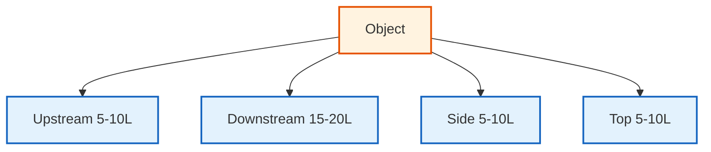

# พลศาสตร์อากาศภายนอก (External Aerodynamics)

## 📖 บทนำ (Introduction)

พลศาสตร์อากาศภายนอกเป็นการศึกษาการไหลรอบวัตถุ ซึ่งมีความสำคัญอย่างยิ่งในการออกแบบยานพาหนะ เครื่องบิน และโครงสร้างพื้นฐาน OpenFOAM มีเครื่องมือที่ทรงพลังสำหรับการวิเคราะห์แรงต้าน แรงยก และลักษณะกระแสลมท้าย (Wake) ด้วยความแม่นยำสูง

> [!INFO] ความสำคัญทางวิศวกรรม
> การวิเคราะห์พลศาสตร์อากาศภายนอกช่วยให้วิศวกรสามารถ:
> - ลดแรงต้านและปรับปรุงประสิทธิภาพการใช้เชื้อเพลิง
> - เพิ่มประสิทธิภาพแรงยกสำหรับยานพาหนะ
> - ทำนายโหมดการสั่นสะเทือนและเสียง
> - วิเคราะห์การกระจายความดันและอุณหภูมิ

---

## 🔍 1. ตัวชี้วัดอากาศพลศาสตร์ที่สำคัญ

### 1.1 สัมประสิทธิ์แรงต้านและแรงยก (Drag and Lift Coefficients)

แรงที่กระทำต่อวัตถุถูกทำให้ไร้มิติเพื่อการเปรียบเทียบ:

**Drag Coefficient ($C_D$):**
$$C_D = \frac{F_D}{0.5 \rho U_\infty^2 A} \tag{1.1}$$

**Lift Coefficient ($C_L$):**
$$C_L = \frac{F_L}{0.5 \rho U_\infty^2 A} \tag{1.2}$$

โดยที่:
- $F_D, F_L$: แรงต้านและแรงยก [N]
- $\rho$: ความหนาแน่นของของไหล [kg/m³]
- $A$: พื้นที่อ้างอิง (Projected area สำหรับแรงต้าน, Planform area สำหรับแรงยก) [m²]
- $U_\infty$: ความเร็วกระแสอิสระ [m/s]

**Pressure Coefficient ($C_p$):**
$$C_p = \frac{p - p_\infty}{0.5 \rho U_\infty^2} \tag{1.3}$$

แสดงถึงการกระจายความดันบนพื้นผิววัตถุ โดยที่:
- $p$: ความดันเฉพาะจุด [Pa]
- $p_\infty$: ความดันกระแสอิสระ [Pa]

### 1.2 ตัวเลขสเตราฮัล (Strouhal Number, St)

ใช้ระบุความถี่ของการแยกตัวของกระแสวน (Vortex Shedding):

$$St = \frac{f_s D}{U_\infty} \tag{1.4}$$

โดยที่:
- $f_s$: ความถี่ของการสลัดกระแสวน [Hz]
- $D$: ขนาดลักษณะเฉพาะ (เช่น เส้นผ่านศูนย์กลาง) [m]

**ค่าทั่วไป:**
- กระบอกกลม: $St \approx 0.2$ สำหรับ $10^3 < Re < 10^5$
- ทรงกลม: $St \approx 0.1-0.2$

> [!TIP] ความสำคัญของ Strouhal Number
> การทราบค่า St ช่วยให้เราทำนายความถี่ของการสั่นสะเทือนเนื่องจาก vortex shedding ซึ่งเป็นสิ่งสำคัญในการออกแบบโครงสร้างให้ทนต่อการเกิดความเหนื่อยจากการสั่น

### 1.3 ตัวเลขเรย์โนลด์ (Reynolds Number, Re)

กำหนดระบอบการไหล:

$$Re = \frac{\rho U_\infty L}{\mu} = \frac{U_\infty L}{\nu} \tag{1.5}$$

โดยที่:
- $L$: ความยาวลักษณะเฉพาะ [m]
- $\mu$: ความหนืดพลศาสตร์ [Pa·s]
- $\nu$: ความหนืดเชิงจลน์ [m²/s]

**จำแนกระบอบการไหล:**
- $Re < 2300$: การไหลแบบ Laminar (ในท่อ)
- $2300 < Re < 4000$: การไหลแบบเปลี่ยนผ่าน
- $Re > 4000$: การไหลแบบ Turbulent

---

## 🏗️ 2. การสร้าง Mesh สำหรับการไหลภายนอก

การจำลองการไหลภายนอกต้องการโดเมนขนาดใหญ่เพื่อป้องกัน "ผลกระทบจากขอบเขต" (Boundary effects):

### 2.1 ขนาดโดเมนการคำนวณ


> **Figure 1:** ข้อแนะนำในการกำหนดขนาดโดเมนการคำนวณสำหรับการไหลภายนอกรอบวัตถุ โดยต้องมีระยะห่างที่เพียงพอในทิศทางต้นน้ำ (Upstream) ท้ายน้ำ (Downstream) และด้านข้าง เพื่อป้องกันไม่ให้เงื่อนไขขอบเขตส่งผลกระทบต่อลักษณะการไหลจริงรอบรูปทรงที่พิจารณาความปลอดภัยทางฟิสิกส์ไม่ส่งผลกระทบต่อความเร็วในการจำลอง ผ่านการใช้พลังของ C++ Template Metaprogramming ในการตรวจสอบความสอดคล้องทางมิติทั้งหมดที่ขั้นตอนการคอมไพล์โปรแกรมเพียงครั้งเดียว

**กฎทั่วไป:**
- **ทางเข้า (Upstream)**: 5-10 เท่าของความยาววัตถุ
- **ทางออก (Downstream)**: 15-20 เท่าของความยาววัตถุ (เพื่อจับภาพ Wake ที่สมบูรณ์)
- **ด้านข้างและด้านบน**: 5-10 เท่าของความสูงวัตถุ

### 2.2 การปรับความละเอียดบริเวณผนัง (Near-Wall Resolution)

บริเวณใกล้ผิวต้องมีการใส่ **Prism Layers** เพื่อจับชั้น Boundary Layer:

**$y^+$ Parameter:**
$$y^+ = \frac{u_\tau y}{\nu} = \frac{\sqrt{\tau_w/\rho} \cdot y}{\nu} \tag{2.1}$$

โดยที่:
- $u_\tau$: ความเร็วเชิงเฉือน (friction velocity) [m/s]
- $y$: ระยะห่างจากผนัง [m]
- $\tau_w$: แรงเฉือนผนัง (wall shear stress) [Pa]

**แนวทางการเลือก:**

| แนวทาง | $y^+$ ที่เหมาะสม | ความละเอียดชั้น | Turbulence Model |
|---------|-------------------|------------------|-------------------|
| **Wall-resolved LES/DNS** | $\approx 1$ | 10-15 เซลล์ | LES, DNS |
| **Wall functions (RANS)** | 30-300 | 5-10 เซลล์ | k-ε, k-ω SST |
| **Hybrid DES** | $\approx 1$ บริเวณแยกตัว | 10-15 เซลล์ | DES |

**ความสูงเซลล์แรก:**
$$\Delta y = \frac{y^+ \mu}{\rho u_\tau} \tag{2.2}$$

### 2.3 การกำหนดค่า SnappyHexMesh

```cpp
// system/snappyHexMeshDict
// Enable meshing stages
castellatedMesh true;    // Generate castellated mesh
snap            true;    // Snap mesh to surface
addLayers       true;    // Add boundary layer cells

// Define geometry input files
geometry
{
    vehicle.stl
    {
        type triSurfaceMesh;    // STL surface format
        name vehicle;           // Geometry name
    }
}

// Surface refinement settings
refinementSurfaces
{
    vehicle
    {
        level (2 2);            // Minimum and maximum refinement levels
        patchInfo
        {
            type wall;          // Boundary type
            inGroups (vehicleGroup);  // Group for patch management
        }
    }
}

// Region-based refinement
refinementRegions
{
    wakeBox
    {
        mode inside;                    // Refine inside this region
        levels ((10 2) (20 3));         // Distance-based refinement levels
    }

    nearVehicleBox
    {
        mode distance;                  // Distance-based refinement
        levels ((0.1 4) (0.5 3) (1.0 2));  // (distance level)
    }
}

// Boundary layer meshing controls
addLayersControls
{
    relativeSizes true;         // Use relative sizing

    layers
    {
        vehicle
        {
            nSurfaceLayers 15;          // Number of prism layers

            expansionRatio 1.2;         // Layer expansion ratio

            finalLayerThickness 0.5;    // Target thickness for y+ ~ 30-50

            minThickness 0.001;         // Minimum allowable layer thickness
        }
    }
}
```

> **📂 Source:** `.applications/utilities/mesh/generation/snappyHexMesh/snappyHexMesh.C`  
> **คำอธิบาย:** การตั้งค่า SnappyHexMesh สำหรับสร้าง mesh พลศาสตร์อากาศภายนอก โดยมี 3 ขั้นตอนหลัก: castellated mesh (สร้างโครงหลัก), snap (ปรับตามพื้นผิว), และ addLayers (เพิ่มชั้น boundary layer)  
> **แนวคิดสำคัญ:**
> - **refinementSurfaces**: กำหนดระดับความละเอียดบนพื้นผิววัตถุ (level คือระดับการแบ่งเซลล์)
> - **refinementRegions**: สร้างบริเวณที่ต้องการความละเอียดพิเศษ เช่น wake region
> - **addLayersControls**: สร้าง prism layers สำหรับจับ boundary layer ด้วยการกำหนดจำนวนชั้นและอัตราการขยาย (expansionRatio)

---

## 💻 3. การนำไปใช้ใน OpenFOAM

### 3.1 การคำนวณสัมประสิทธิ์แรง (Force Coefficients)

เราใช้ Function Object `forces` ในไฟล์ `system/controlDict` เพื่อดึงค่าสัมประสิทธิ์ออกมาโดยอัตโนมัติ:

```cpp
// system/controlDict
functions
{
    forcesCoeffs
    {
        // Function object type for force calculation
        type            forces;
        libs            (fieldFunctionObjects);  // Required library
        
        // Output control
        writeControl    timeStep;
        writeInterval   1;          // Write every time step
        timeStart       0;          // Start at time 0

        // Patch to calculate forces on
        patches         (vehicleBody);

        // Density specification
        rho             rhoInf;      // Use constant density
        rhoInf          1.225;       // Air density at sea level [kg/m³]

        // Center of rotation for moment calculations
        CofR            (0 0 0);     // Coordinate origin

        // Coordinate system definition
        coordinateSystem
        {
            type    cartesian;      // Cartesian coordinate system
            origin  (0 0 0);        // System origin
            e1      (1 0 0);        // X-axis direction (drag)
            e3      (0 0 1);        // Z-axis direction (lift/vertical)
        }

        // Force and moment directions
        dragDir         (1 0 0);    // Drag direction (X-axis)
        liftDir         (0 0 1);    // Lift direction (Z-axis)
        pitchAxis       (0 1 0);    // Pitch moment axis (Y-axis)

        // Reference quantities for coefficient calculation
        magUInf         30.0;       // Freestream velocity magnitude [m/s]
        lRef            4.5;        // Reference length [m]
        Aref            2.2;        // Reference area [m²]

        // Output format options
        log             true;       // Write to log file
        writeFields     false;      // Don't write force fields
    }
}
```

> **📂 Source:** `.applications/utilities/postProcessing/forces/forces/forces.C`  
> **คำอธิบาย:** Function object `forces` ใช้คำนวณแรงและโมเมนต์ที่กระทำต่อพื้นผิว โดยรวมความดันและแรงเฉือน (pressure + viscous forces) และทำให้เป็นไร้มิติ (non-dimensional) เพื่อหาค่าสัมประสิทธิ์  
> **แนวคิดสำคัญ:**
> - **rho rhoInf**: ใช้ความหนาแน่นคงที่เหมาะสำหรับการไหลแบบไม่อัดตัว (incompressible)
> - **coordinateSystem**: กำหนดระบบพิกัดสำหรับการคำนวณทิศทางแรง สำคัญมากสำหรับวัตถุที่มีการหมุนหรือทิศทางไม่ซ้ำกัน
> - **Reference quantities**: magUInf, lRef, Aref ใช้คำนวณสัมประสิทธิ์ $C_D, C_L$ ผ่านสมการ (1.1) และ (1.2)

### 3.2 การติดตามความดัน (Pressure Monitoring)

```cpp
functions
{
    // Surface-averaged pressure coefficient
    surfacePressureCoeff
    {
        type            surfaceRegion;          // Surface-based calculation
        libs            (fieldFunctionObjects);
        writeControl    timeStep;
        writeInterval   1;

        operation       average;                // Average operation
        surfaceFormat   none;                   // No surface output

        regionType      patch;                  // Patch type region
        name            vehicleBody;            // Patch name

        fields
        (
            Cp                                  // Pressure coefficient field
        );
    }

    // Point probes for pressure monitoring
    pressureProbes
    {
        type            probes;                 // Point probe type
        libs            (sampling);             // Sampling library
        writeControl    timeStep;
        writeInterval   1;

        // Probe locations in format (x y z)
        probeLocations
        (
            (0.5  0.0  0.0)   // Front of vehicle
            (1.5  0.0  0.0)   // On roof
            (2.5  0.0  0.0)   // Rear of vehicle
            (3.0  0.0  0.0)   // In wake region
        );

        // Fields to sample
        fields          (p U Cp);               // Pressure, velocity, Cp
    }
}
```

> **📂 Source:** `.applications/functionObjects/field/surfaceRegion/surfaceRegion.C`  
> **คำอธิบาย:** Function objects สำหรับติดตามค่าความดันและสัมประสิทธิ์ความดัน ทั้งแบบเฉลี่ยบนพื้นผิว (surfaceRegion) และแบบจุดวัดเฉพาะจุด (probes)  
> **แนวคิดสำคัญ:**
> - **surfaceRegion**: คำนวณค่าเฉลี่ยบน patch ทั้งหมด เหมาะสำหรับติดตามแนวโน้มโดยรวม
> - **probes**: ติดตามค่าที่ตำแหน่งเฉพาะจุด เหมาะสำหรับเปรียบเทียบกับข้อมูลทดลอง
> - **Cp field**: คำนวณอัตโนมัติจากสมการ (1.3) เมื่อมีการคำนวณความดัน

### 3.3 การวิเคราะห์ Wake

```cpp
functions
{
    // Line sampling in wake region
    wakeAnalysis
    {
        type            sets;                   // Sample along lines/sets
        libs            (fieldFunctionObjects);
        writeControl    timeStep;
        writeInterval   10;                     // Write every 10 steps

        setFormat       raw;                    // Raw data format

        // Define sampling lines
        sets
        (
            // Streamwise line behind vehicle
            wakeLineX
            {
                type        uniform;            // Uniform point distribution
                axis        x;                  // Line along X-axis
                start       (3.0  0.0  0.0);    // Start point
                end         (10.0 0.0  0.0);    // End point
                nPoints     100;                // Number of points
            }

            // Vertical line through wake
            wakeLineZ
            {
                type        uniform;            // Uniform point distribution
                axis        z;                  // Line along Z-axis
                start       (3.0  0.0 -1.0);    // Start point
                end         (3.0  0.0  1.0);    // End point
                nPoints     50;                 // Number of points
            }
        );

        // Fields to sample
        fields          (p U k omega);          // Pressure, velocity, TKE, omega
    }
}
```

> **📂 Source:** `.applications/sampling/sets/sets/sets.C`  
> **คำอธิบาย:** Function object `sets` ใช้สร้างเส้นตัดอย่างง่าย (sampling lines) ผ่านโดเมนการไหลเพื่อวิเคราะห์โครงสร้างของ wake  
> **แนวคิดสำคัญ:**
> - **uniform distribution**: กระจายจุดตัวอย่างอย่างสม่ำเสมอตามเส้น ให้ความละเอียดที่ดี
> - **streamwise line (wakeLineX)**: ติดตามการฟื้นตัวของ velocity deficit และการขยายตัวของ wake
> - **vertical line (wakeLineZ)**: วิเคราะห์โปรไฟล์ความเร็วในทิศทางตั้งฉาก
> - **TKE (k)**: แสดงความรุนแรงของความปั่นป่วนใน wake

---

## 🌪️ 4. การเลือกแบบจำลองความปั่นป่วน

### 4.1 แนวทางการเลือกแบบจำลอง

| แบบจำลอง | ความแม่นยำ | ต้นทุนการคำนวณ | กรณีที่เหมาะสม | เวลาคำนวณ |
|------------|-------------|------------------|-------------------|-------------|
| **k-ω SST** | สูงสำหรับการไหลติดผนัง | ปานกลาง | การไหลที่ติดกับพื้นผิวและมีการแยกตัวเล็กน้อย | 1-10 ชม. |
| **k-ε** | ปานกลางสำหรับ free shear | ต่ำ | การไหลแบบ free shear | 0.5-5 ชม. |
| **LES** | สูงมาก | สูงมาก | การไหลที่มีโครงสร้างไม่คงที่ซับซ้อน | 10-100 ชม. |
| **DES/Hybrid** | สูง | สูง | การสมดุลระหว่างความแม่นยำและต้นทุน | 5-50 ชม. |

### 4.2 Steady-state vs Transient

**Steady-state (simpleFoam):**
```cpp
// system/fvSolution
SIMPLE
{
    // Number of non-orthogonal correctors
    nNonOrthogonalCorrectors 2;

    // Convergence criteria for steady-state
    residualControl
    {
        p           1e-6;       // Pressure residual
        U           1e-6;       // Velocity residual
        k           1e-6;       // TKE residual
        omega       1e-6;       // Specific dissipation residual
    }
}

// Under-relaxation factors for stability
relaxationFactors
{
    fields
    {
        p       0.3;           // Pressure relaxation
    }
    equations
    {
        U       0.7;           // Momentum equation relaxation
        k       0.7;           // TKE equation relaxation
        omega   0.7;           // Omega equation relaxation
    }
}
```

> **📂 Source:** `.applications/solvers/incompressible/simpleFoam/simpleFoam.C`  
> **คำอธิบาย:** SIMPLE algorithm สำหรับการไหล steady-state ใช้ under-relaxation เพื่อความเสถียรในการแก้สมการ coupled ระหว่างความดันและความเร็ว  
> **แนวคิดสำคัญ:**
> - **nNonOrthogonalCorrectors**: แก้ปัญหาเมื่อ mesh มีความ non-orthogonal สูง
> - **relaxationFactors**: ค่าน้อยกว่า 1 เพื่อป้องกันการ oscillate แต่จะทำให้ converge ช้าลง
> - **residualControl**: กำหนดเกณฑ์การหยุด (convergence) เมื่อ residual ต่ำพอ

**Transient (pimpleFoam):**
```cpp
PIMPLE
{
    // Number of outer correctors per time step
    nCorrectors     2;          // Outer correctors for PISO loop
    
    // Non-orthogonal correctors
    nNonOrthogonalCorrectors 2;
    
    // Interface tracking (for multiphase)
    nAlphaCorr      1;
    nAlphaSubCycles 2;

    // Residual control (optional for PIMPLE)
    residualControl
    {
        p           1e-5;       // Pressure residual
        U           1e-5;       // Velocity residual
        k           1e-5;       // TKE residual
        omega       1e-5;       // Omega residual
    }
}

// Adaptive time step control
adjustTimeStep  yes;            // Enable adaptive time stepping
maxCo          0.8;            // Maximum Courant number (< 1 for stability)
maxDeltaT      1e-3;           // Maximum time step size [s]
```

> **📂 Source:** `.applications/solvers/incompressible/pimpleFoam/pimpleFoam.C`  
> **คำอธิบาย:** PIMPLE algorithm ผสมระหว่าง PISO (transient) และ SIMPLE (under-relaxation) เหมาะสำหรับการไหล unsteady ที่มี large time steps  
> **แนวคิดสำคัญ:**
> - **PISO loop (nCorrectors)**: แก้ coupled pressure-velocity หลายครั้งต่อ time step เพื่อความแม่นยำ
> - **maxCo < 1**: Courant-Friedrichs-Lewy condition ความเสถียรเชิงตัวเลข (fluid ไม่เดินทางเกิน 1 เซลล์/step)
> - **adjustTimeStep**: ปรับความยาว time step อัตโนมัติตามค่า Co เพื่อสมดุลระหว่างความเร็วและความแม่นยำ

### 4.3 การตั้งค่า Turbulence Model

**k-ω SST Model (แนะนำสำหรับพลศาสตร์อากาศ):**
```cpp
// constant/turbulenceProperties
simulationType  RAS;           // Reynolds-Averaged Simulation
RAS
{
    RASModel        kOmegaSST;  // k-omega SST model

    turbulence      on;         // Enable turbulence modeling

    printCoeffs     on;         // Print model coefficients

    // k-ω SST model coefficients
    kOmegaSSTCoeffs
    {
        // Diffusion coefficient closures
        alphaK1     0.85;       // Diffusion coefficient for k (inner region)
        alphaK2     1.0;        // Diffusion coefficient for k (outer region)
        alphaOmega1 0.5;        // Diffusion coefficient for omega (inner)
        alphaOmega2 0.856;      // Diffusion coefficient for omega (outer)
        
        // Production coefficient closures
        gamma1      0.5532;     // Production coefficient for omega (inner)
        gamma2      0.4403;     // Production coefficient for omega (outer)
        
        // Destruction coefficient closures
        beta1       0.075;      // Destruction coefficient for omega (inner)
        beta2       0.0828;     // Destruction coefficient for omega (outer)
        betaStar    0.09;       // Dissipation coefficient for k
        
        // Cross-diffusion and blending
        a1          0.31;       // Constant for turbulent viscosity
        b1          1.0;        // Constant for cross-diffusion
        c1          10.0;       // Constant for blending function
        F3          no;         // Disable F3 blending function
    }
}
```

> **📂 Source:** `.applications/turbulenceModels/turbulenceModels/RAS/kOmegaSST/kOmegaSST.C`  
> **คำอธิบาย:** k-ω SST (Shear Stress Transport) ผสม k-ε (far-field) กับ k-ω (near-wall) โดยใช้ blending function ให้ความแม่นยำสูงสำหรับการไหลที่มี pressure gradient เชิงลบ  
> **แนวคิดสำคัญ:**
> - **Blending functions (F1, F2)**: สลับระหว่าง k-ω (ใกล้ผนัง) และ k-ε (ไกลผนัง) อัตโนมัติ
> - **Shear stress limiter (a1)**: จำกัด turbulent viscosity ในบริเวณที่มี shear สูง ช่วยทำนาย flow separation ได้ดี
> - **Cross-diffusion term (b1)**: แก้ไขปัญหาการกระจายของ ω ใน free stream

### 4.4 การกำหนด Boundary Conditions

**Inlet Boundary Condition:**
```cpp
// 0/U
inlet
{
    type            freestreamVelocity;         // Freestream condition
    freestreamValue uniform (30 0 0);          // U_inf [m/s]
}

// 0/k
inlet
{
    type            fixedValue;                 // Fixed TKE at inlet
    value           uniform 0.24;               // k = 1.5*(U*I)^2, I=0.5%
}

// 0/omega
inlet
{
    type            fixedValue;                 // Fixed omega at inlet
    value           uniform 2.5;                // ω = k^0.5/(0.09*L) [1/s]
}

// 0/p
inlet
{
    type            freestreamPressure;         // Freestream pressure
    freestreamValue uniform 0;                  // Reference pressure = 0 [Pa]
}
```

> **📂 Source:** `.applications/boundaryConditions/freestream/freestreamFvPatchField.C`  
> **คำอธิบาย:** Freestream boundary conditions อนุญาตให้มีการไหลออก (outflow) เมื่อจำเป็น เหมาะสำหรับ external aerodynamics  
> **แนวคิดสำคัญ:**
> - **freestreamVelocity**: ใช้ inlet velocity เมื่อ flow เข้า แต่ใช้ zeroGradient เมื่อ flow ออก
> - **k inlet**: ปกติใช้ turbulence intensity I = 0.5-5% สำหรับ aerodynamics
> - **ω inlet**: คำนวณจาก k และ length scale L (เช่น L = 0.07 * characteristic length)

**Outlet Boundary Condition:**
```cpp
// 0/U
outlet
{
    type            zeroGradient;               // Convective outflow
}

// 0/p
outlet
{
    type            fixedValue;                 // Fixed pressure outlet
    value           uniform 0;                  // Reference pressure [Pa]
}
```

**Wall Boundary Condition:**
```cpp
// 0/U
vehicleBody
{
    type            noSlip;                     // No-slip condition
}

// 0/k
vehicleBody
{
    type            kLowReWallFunction;         // Low-Re wall function
    value           uniform 0;                  // k = 0 at wall
}

// 0/omega
vehicleBody
{
    type            omegaWallFunction;          // Omega wall function
    value           uniform 0;                  // Modeled value near wall
}
```

> **📂 Source:** `.applications/boundaryConditions/wall/wallFvPatchField.C`  
> **คำอธิบาย:** Wall boundary conditions สำหรับ RANS models ใช้ wall functions เพื่อลดความละเอียดที่จำเป็นใกล้ผนัง  
> **แนวคิดสำคัญ:**
> - **noSlip**: ความเร็ว = 0 บนผิว (สภาพไม่ลื่นไถล)
> - **kLowReWallFunction**: k = 0 ที่ผนัง และใช้ wall function สำหรับ y+ > 30
> - **omegaWallFunction**: คำนวณ ω ใกล้ผนังจาก friction velocity และ y+

---

## 📊 5. การวิเคราะห์และการตีความผลลัพธ์

### 5.1 การวิเคราะห์แรงต้าน

**การแยกแรงต้าน:**
แรงต้านทั้งหมดประกอบด้วย:
$$C_D = C_{D,pressure} + C_{D,friction} \tag{5.1}$$

**Pressure Drag:** เกิดจากความแตกต่างของความดันระหว่างด้านหน้าและด้านหลัง
$$F_{D,p} = \oint (p - p_\infty) \mathbf{n} \cdot \mathbf{e}_x \, dA \tag{5.2}$$

**Friction Drag:** เกิดจากความเฉือนผนัง
$$F_{D,f} = \oint \tau_w \mathbf{t} \cdot \mathbf{e}_x \, dA \tag{5.3}$$

> [!TIP] **Physical Analogy: The Hand out the Car Window (มือออกนอกหน้าต่างรถ)**
>
> ลองนึกภาพตอนนั่งรถแล้วยื่นมือออกไปรับลม:
>
> 1.  **Form Drag (Pressure Drag):**
>     - ถ้าคุณหัน **ฝ่ามือปะทะลม** (ตั้งฉาก) คุณจะรู้สึกถึงแรงต้านมหาศาล มือจะถูกดันไปข้างหลังอย่างแรง
>     - นี่คือ **Pressure Drag** เกิดจากความดันข้างหน้าสูงมาก และข้างหลัง (ที่เป็น Wake) ความดันต่ำ
>
> 2.  **Friction Drag (Viscous Drag):**
>     - ถ้าคุณทำ **มือแบนราบขนานกับพื้น** (ทำท่าตัดลม) แรงต้านจะลดลงฮวบฮาบ
>     - แต่คุณยังรู้สึกสากๆ ที่ผิวหนัง นั่นคือ **Friction Drag** หรือแรงเสียดทานจากอากาศที่ถูไปกับผิว
>
> 3.  **Streamlining:**
>     - การออกแบบรถยนต์หรือเครื่องบินคือการพยายามเปลี่ยนจาก "ฝ่ามือปะทะลม" ให้เป็น "ท่าตัดลม" ให้มากที่สุด (ลด Form Drag) และทำให้ผิวเรียบที่สุด (ลด Friction Drag)

### 5.2 การวิเคราะห์ลักษณะ Wake

**คุณลักษณะเชิงปริมาณของ Wake:**

1. **Velocity Deficit:**
$$\Delta U(x,r) = U_\infty - U(x,r) \tag{5.4}$$

2. **Wake Width:**
$$b(x) = \text{width at which } \Delta U/b_{\max} = 0.5 \tag{5.5}$$

3. **Turbulent Kinetic Energy:**
$$k = \frac{1}{2} \overline{u_i' u_i'} \tag{5.6}$$

### 5.3 การตรวจสอบความถูกต้อง

**การเปรียบเทียบกับข้อมูลอ้างอิง:**

```python
# Python script for validation
import numpy as np
import matplotlib.pyplot as plt

# Load CFD results
# File: postProcessing/forcesCoeffs/0/forceCoeffs.dat
cfd_data = np.loadtxt('postProcessing/forcesCoeffs/0/forceCoeffs.dat')
time_cfd = cfd_data[:, 0]      # Time column
Cd_cfd = cfd_data[:, 1]        # Drag coefficient column

# Load experimental data
exp_data = np.loadtxt('experimental_data.csv')
time_exp = exp_data[:, 0]
Cd_exp = exp_data[:, 1]

# Calculate error percentage
error = np.abs(Cd_cfd[-1] - Cd_exp[-1]) / Cd_exp[-1] * 100
print(f"Drag coefficient error: {error:.2f}%")

# Plot comparison
plt.figure(figsize=(10, 6))
plt.plot(time_cfd, Cd_cfd, label='CFD', linewidth=2)
plt.plot(time_exp, Cd_exp, 'o--', label='Experiment', markersize=8)
plt.xlabel('Time (s)')
plt.ylabel('Drag Coefficient $C_D$')
plt.legend()
plt.grid(True)
plt.title('Drag Coefficient Comparison')
plt.savefig('validation.png', dpi=300)
```

> **📂 Source:** Custom Python post-processing script  
> **คำอธิบาย:** ใช้ Python เปรียบเทียบผลลัพธ์ CFD กับข้อมูลทดลอง และคำนวณเปอร์เซ็นต์ความคลาดเคลื่อน (error percentage)  
> **แนวคิดสำคัญ:**
> - **forceCoeffs.dat**: ไฟล์ output จาก function object `forces` มีคอลัมน์: time, Cd, Cl, Cl(facing), CmRoll, CmPitch, CmYaw
> - **Error metric**: คำนวณจากค่าสัมประสิทธิ์ที่ converge (ค่าสุดท้าย) เทียบกับค่าทดลอง
> - **Visualization**: พล็อตเปรียบเทียบแนวโน้มของค่าสัมประสิทธิ์ตามเวลา เพื่อดูการ converge

---

## 🚗 6. กรณีศึกษา: พลศาสตร์อากาศยานยนต์

### 6.1 ปัญหา Ahmed Body

**Ahmed Body** เป็นมาตรฐานอุตสาหกรรมสำหรับการตรวจสอบพลศาสตร์อากาศยานยนต์

**รูปทรงเรขาคณิต:**
```cpp
// constant/transportProperties
transportModel  Newtonian;        // Newtonian fluid model
nu              [0 2 -1 0 0 0 0] 1.5e-05;  // Kinematic viscosity [m²/s]
                                            // Air at 25°C
```

> **📂 Source:** `.applications/transportModels/Newtonian/Newtonian.C`  
> **คำอธิบาย:** Transport properties สำหรับของไหลแบบ Newtonian (ความหนืดคงที่ไม่ขึ้นกับอัตราการเฉือน)  
> **แนวคิดสำคัญ:**
> - **Kinematic viscosity (ν)**: อากาศที่ 25°C มีค่า ≈ 1.5×10⁻⁵ m²/s
> - **[0 2 -1 0 0 0 0]**: Dimension ของ kinematic viscosity = L²/T
> - **ใช้ค่า ν แทน μ** เพราะของไหลแบบ incompressible ใช้ kinematic viscosity สะดวกกว่า

**เงื่อนไขการทดลอง:**
- ความยาว $L = 1.044$ m
- ความสูง $H = 0.288$ m
- ความกว้าง $W = 0.389$ m
- ความเร็ว $U_\infty = 40$ m/s
- $Re_L = 2.78 \times 10^6$

**ผลลัพธ์ที่คาดหวัง:**
- $C_D \approx 0.285$ (slant angle 25°)
- จุดแยกตัวที่ด้านหลัง
- Wake structure ที่ซับซ้อน

### 6.2 กลยุทธ์การลดแรงต้าน

**เทคนิคที่ใช้:**

1. **Streamlining:**
   - ลดความคมของจุดยอด
   - เพิ่มความยาวด้านหลัง

2. **Surface Smoothing:**
   - ลดความหยาบของพื้นผิว
   - ปิดช่องว่าง

3. **Rear Spoilers:**
   - ควบคุมการแยกตัว
   - เพิ่มความดันด้านหลัง

4. **Underbody Panels:**
   - ลดความปั่นป่วนใต้ท้องรถ

---

## 📚 7. แหล่งเรียนรู้เพิ่มเติม

**หนังสือและบทความ:**
1. Hucho, W.-H. (Ed.). (1998). *Aerodynamics of Road Vehicles*. SAE International.
2. Katz, J. (2006). *New Directions in Race Car Aerodynamics*. SAE International.
3. Ahmed, S. R., Ramm, G., & Faltin, G. (1984). Some Salient Features of the Time-Averaged Ground Vehicle Wake. *SAE Technical Paper 840300*.

**OpenFOAM Tutorials:**
- `$FOAM_TUTORIALS/incompressible/simpleFoam/airFoil2D`
- `$FOAM_TUTORIALS/incompressible/pimpleFoam/motorBike`

**ข้อมูลอ้างอิงทางเทคนิค:**
- [OpenFOAM User Guide](https://cfd.direct/openfoam/user-guide/)
- [NACA Airfoil Coordinates](https://nasa.gov/)

---

## 🔗 การเชื่อมโยงกับไฟล์อื่น

- **[[02_Internal_Flow_and_Piping.md]]**: การไหลภายในและระบบท่อ
- **[[03_Heat_Transfer_Applications.md]]**: การถ่ายเทความร้อน
- **[[../04_HEAT_TRANSFER/00_Overview.md]]**: ภาพรวมการถ่ายเทความร้อน

---

**หัวข้อถัดไป**: [การไหลภายในและระบบท่อ](./02_Internal_Flow_and_Piping.md)

---

## 🧠 8. Concept Check (ทดสอบความเข้าใจ)

1. **ทำไมลูกกอล์ฟถึงต้องมีผิวขรุขระ (Dimples)?**
   <details>
   <summary>เฉลย</summary>
   เพื่อกระตุ้นให้ Boundary Layer เปลี่ยนจาก Laminar เป็น Turbulent เร็วขึ้น (Transition to Turbulence) ซึ่ง Turbulent BL จะมีพลังงานสูงกว่าและเกาะติดผิวลูกกอล์ฟได้นานกว่า (Delayed Separation) ทำให้ Wake ด้านหลังเล็กลง และลด **Pressure Drag** ลงได้อย่างมหาศาล (แม้จะเพิ่ม Friction Drag นิดหน่อยก็คุ้ม)
   </details>

2. **ทำไมรถแข่ง F1 ถึงต้องการ "Downforce" ทั้งที่เครื่องบินต้องการ "Lift"?**
   <details>
   <summary>เฉลย</summary>
   Downforce คือ "Lift กลับหัว" ($C_L$ ติดลบ) เพื่อกดรถให้ติดถนน ทำให้ยางยึดเกาะได้ดีขึ้น (Increase Traction) ช่วยให้เข้าโค้งได้เร็วโดยไม่หลุดโค้ง ถ้าไม่มี Downforce รถที่วิ่งเร็วมากๆ อาจจะเหินขึ้นเหมือนเครื่องบินได้!
   </details>

3. **Strouhal Number (St) 0.2 บอกอะไรเกี่ยวกับเสาธง?**
   <details>
   <summary>เฉลย</summary>
   บอกว่าถ้าลมพัดผ่านเสาทรงกระบอก จะเกิดการสลัด Vortex (Vortex Shedding) ที่ความถี่หนึ่ง ถ้าความถี่นี้ ($f_s = St \cdot U / D$) ไปตรงกับ **Natural Frequency** ของเสา จะเกิดการสั่นพ้อง (Resonance) ที่รุนแรงจนเสาหักได้
   </details>