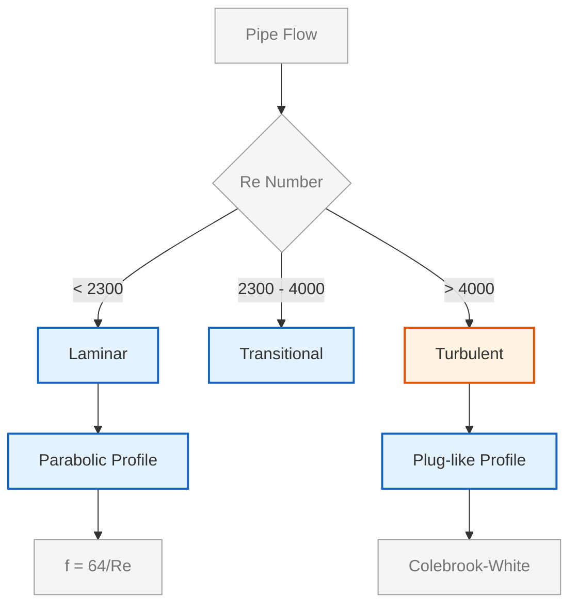
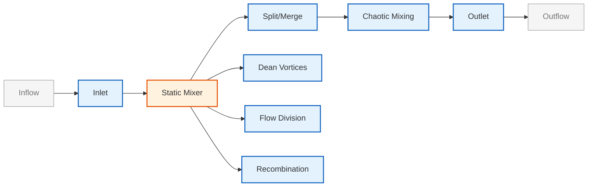

# การไหลภายในและเครือข่ายท่อ (Internal Flows and Piping)

## 📖 บทนำ (Introduction)

การไหลภายในเป็นพื้นฐานของระบบวิศวกรรมมากมาย เช่น ท่อส่งน้ำมัน ระบบระบายอากาศ (HVAC) และเครื่องปฏิกรณ์เคมี ความท้าทายหลักคือการคาดการณ์ความดันตกคร่อมและประสิทธิภาพการผสม

> [!INFO] ความสำคัญทางอุตสาหกรรม
> การไหลภายในมีบทบาทสำคัญในหลายอุตสาหกรรม รวมถึง:
> - **วิศวกรรมกระบวนการ**: ระบบท่อและเครื่องแลกเปลี่ยนความร้อน
> - **พลังงาน**: เครื่องปั๊มและกังหัน
> - **การแพทย์**: การไหลของเลือดในหลอดเลือด
> - **สิ่งแวดล้อม**: การระบายน้ำและการบำบัดน้ำเสีย

---

## 🔍 1. ฟิสิกส์ของการไหลในท่อ

### 1.1 ความดันตกคร่อม (Pressure Drop)

การสูญเสียพลังงานเนื่องจากแรงเสียดทานอธิบายด้วยสมการ **Darcy-Weisbach**:

$$\Delta p = f \frac{L}{D} \frac{\rho U^2}{2}$$

โดยที่:
- $\Delta p$ = ความดันตกคร่อม (Pa)
- $f$ = Friction factor ซึ่งขึ้นอยู่กับความหยาบผิวและ Reynolds number
- $L$ = ความยาวท่อ (m)
- $D$ = เส้นผ่านศูนย์กลางท่อ (m)
- $\rho$ = ความหนาแน่นของไหล (kg/m³)
- $U$ = ความเร็วเฉลี่ย (m/s)

ใน OpenFOAM เราวัดค่านี้ได้จาก:

$$\Delta p = p_{inlet} - p_{outlet}$$

#### การคำนวณ Friction Factor

**การไหลแบบ Laminar** ($\text{Re} < 2300$):
$$f = \frac{64}{\text{Re}}$$

**การไหลแบบ Turbulent**: ใช้สมการ **Colebrook-White**:

$$\frac{1}{\sqrt{f}} = -2 \log_{10}\left(\frac{\epsilon/D}{3.7} + \frac{2.51}{\text{Re}\sqrt{f}}\right)$$

โดย $\epsilon/D$ คือความหยาบสัมพัทธ์ (relative roughness)

### 1.2 Reynolds Number สำหรับการไหลในท่อ

$$\text{Re} = \frac{\rho U_{avg} D}{\mu}$$

โดยที่:
- $U_{avg}$ = ความเร็วเฉลี่ย
- $\mu$ = ความหนืดพลศาสตร์ (dynamic viscosity)

**การจำแนกระบอบการไหล**:
- $\text{Re} < 2300$: การไหลแบบ Laminar
- $2300 < \text{Re} < 4000$: การไหลแบบ Transitional
- $\text{Re} > 4000$: การไหลแบบ Turbulent

### 1.3 ลักษณะโปรไฟล์ความเร็ว (Velocity Profiles)

**การไหลแบบ Laminar**: โปรไฟล์แบบพาราโบลา (Hagen-Poiseuille flow)

$$u(r) = \frac{\Delta p}{4\mu L} (R^2 - r^2) = 2U_{avg}\left[1 - \left(\frac{r}{R}\right)^2\right]$$

**การไหลแบบ Turbulent**: โปรไฟล์ที่แบนลงตรงกลาง (Plug-like) พร้อมชั้นบางๆ ที่มีความหนืด (viscous sublayer) ซึ่งอธิบายด้วย **Law of the Wall**:

$$u^+ = \frac{1}{\kappa} \ln y^+ + C$$

โดยที่:
- $u^+ = u/u_{\tau}$ (ความเร็วไร้มิติ)
- $y^+ = y u_{\tau}/\nu$ (ระยะห่างไร้มิติจากผนัง)
- $\kappa \approx 0.41$ = von Kármán constant
- $C \approx 5.0$ = ค่าคงที่


> **Figure 1:** แผนผังการจำแนกระบอบการไหลในท่อ (Flow Regimes) ตามค่า Reynolds Number ซึ่งกำหนดลักษณะของโปรไฟล์ความเร็ว (Velocity Profile) และวิธีการคำนวณสัมประสิทธิ์ความเสียดทาน (Friction Factor) ที่แตกต่างกันระหว่างการไหลแบบ Laminar และ Turbulent

---

## 🛠️ 2. การสร้างแบบจำลองการผสม (Mixing Analysis)

ในระบบท่อที่มีการผสมสาร (เช่น Static Mixers) เราใช้ตัวชี้วัดเพื่อระบุประสิทธิภาพ

### 2.1 ดัชนีการผสม (Mixing Index, MI)

$$MI = 1 - \frac{\sigma}{\sigma_0}$$

โดยที่:
- $\sigma$ = ส่วนเบี่ยงเบนมาตรฐานของความเข้มข้นที่หน้าตัดใดๆ
- $\sigma_0$ = ส่วนเบี่ยงเบนมาตรฐานเริ่มต้น

**Coefficient of Variation** (สำหรับเครื่องผสมแบบสถิต):

$$CoV = \frac{\sigma_c}{\bar{c}}$$

โดยที่:
- $\sigma_c$ = ส่วนเบี่ยงเบนมาตรฐานของความเข้มข้น
- $\bar{c}$ = ค่าเฉลี่ยของความเข้มข้น
- $c$ = ความเข้มข้นของสารติดตาม (tracer concentration)

### 2.2 เวลากักตัว (Residence Time Distribution, RTD)

ใช้สเกลาร์พาสซีฟ (Passive scalar) เพื่อติดตามเวลาที่อนุภาคของไหลใช้ในระบบ:

$$\bar{t} = \frac{V}{\dot{V}}$$

**การกระจายเวลากักตัว (Residence Time Distribution)**:

$$E(t) = \frac{c(t)}{\int_0^\infty c(t) \, \mathrm{d}t}$$

**ประเภทของเครื่องปฏิกรณ์ตาม RTD**:

| ประเภทเครื่องปฏิกรณ์ | ลักษณะ RTD |
|------------------------|-------------|
| **Plug Flow Reactor (PFR)** ในอุดมคติ | RTD แบบ Dirac delta |
| **CSTR** ในอุดมคติ | RTD แบบ exponential |
| **เครื่องปฏิกรณ์ที่ไม่สมบูรณ์** | แสดงการกระจายตัวระหว่างกลาง |

---

## 💻 3. การนำไปใช้ใน OpenFOAM

### 3.1 การเลือก Solver ที่เหมาะสม

| Solver | ประเภท | ความเหมาะสม |
|--------|--------|--------------|
| **simpleFoam** | steady-state | การไหลแบบสม่ำเสมอ |
| **pimpleFoam** | transient | การไหลแบบไม่สม่ำเสมอ |
| **buoyantFoam** | CHT | การถ่ายเทความร้อนระหว่างของแข็ง-ของไหล |
| **chtMultiRegionFoam** | Multi-region | การจับคู่ของแข็ง-ของไหลหลายโซน |

### 3.2 การตั้งค่า Boundary Conditions

#### ความเร็ว (Velocity)

```cpp
// 0/U - Velocity field boundary conditions
dimensions      [0 1 -1 0 0 0 0];           // Dimensions: [length/time]
internalField   uniform (0 0 0);            // Initial velocity field (zero everywhere)

boundaryField
{
    inlet
    {
        type            fixedValue;         // Fixed value at inlet
        value           uniform (1.0 0 0);  // Inlet velocity: 1 m/s in x-direction
    }
    outlet
    {
        type            zeroGradient;       // Zero gradient (Neumann BC)
    }
    walls
    {
        type            noSlip;             // No-slip condition at walls
    }
}
```

**คำอธิบาย:**
- **แหล่งที่มา (Source):** `0/U` - Velocity boundary condition file
- **ความหมาย (Explanation):** ไฟล์นี้กำหนดเงื่อนไขขอบเขตสำหรับสนามความเร็ว ซึ่งเป็นส่วนสำคัญในการจำลองการไหลภายในท่อ
- **แนวคิดสำคัญ (Key Concepts):**
  - `fixedValue`: กำหนดค่าคงที่ที่ขอบเขต (ใช้ที่ inlet)
  - `zeroGradient`: ความชันเป็นศูนย์ตั้งฉากกับขอบเขต (ใช้ที่ outlet สำหรับการไหลออกแบบ fully developed)
  - `noSlip`: ความเร็วเป็นศูนย์ที่ผนัง (เงื่อนไขไม่มีการไหล)

#### ความดัน (Pressure)

```cpp
// 0/p - Pressure field boundary conditions
dimensions      [0 2 -2 0 0 0 0];           // Dimensions: [mass/(length·time²)]
internalField   uniform 0;                  // Initial pressure field (gauge pressure = 0)

boundaryField
{
    inlet
    {
        type            zeroGradient;       // Zero gradient at inlet
    }
    outlet
    {
        type            fixedValue;         // Fixed value at outlet
        value           uniform 0;          // Reference pressure (gauge pressure = 0)
    }
    walls
    {
        type            zeroGradient;       // Zero gradient at walls
    }
}
```

**คำอธิบาย:**
- **แหล่งที่มา (Source):** `0/p` - Pressure boundary condition file
- **ความหมาย (Explanation):** ไฟล์กำหนดเงื่อนไขขอบเขตความดัน โดยมักตั้งค่าเป็น 0 ที่ outlet เพื่อใช้เป็นค่าอ้างอิง (gauge pressure)
- **แนวคิดสำคัญ (Key Concepts):**
  - ใน OpenFOAM สำหรับการไหลแบบ incompressible ความดันที่คำนวณได้คือความดันเกจ (p/rho)
  - การตั้งค่าความดันเป็น 0 ที่ outlet เป็นเงื่อนไขมาตรฐานเพื่อให้ solver สามารถคำนวณความดันสัมพัทธ์ได้
  - `zeroGradient` ที่ inlet หมายถึงความดันไม่เปลี่ยนแปลงในทิศทางการไหลเข้า

### 3.3 การคำนวณความดันตกคร่อม

ตัวอย่างการใช้ `surfaceFieldValue` เพื่อหาค่าความดันเฉลี่ยที่ทางเข้าและทางออก:

```cpp
// system/controlDict - Function objects for pressure drop calculation
functions
{
    // Calculate average pressure at inlet
    pInlet
    {
        type            surfaceFieldValue;  // Surface field value calculation
        libs            (fieldFunctionObjects);  // Library containing the function object
        operation       weightedAverage;    // Weighted average operation
        weightField     phi;                // Weight by flux (mass flow rate)
        region          region0;            // Region to process
        surfaceFormat   none;               // No surface output
        fields          (p);                // Fields to process (pressure)
        patches         (inlet);            // Patches to process
    }

    // Calculate average pressure at outlet
    pOutlet
    {
        type            surfaceFieldValue;  // Surface field value calculation
        libs            (fieldFunctionObjects);  // Library containing the function object
        operation       weightedAverage;    // Weighted average operation
        weightField     phi;                // Weight by flux (mass flow rate)
        region          region0;            // Region to process
        surfaceFormat   none;               // No surface output
        fields          (p);                // Fields to process (pressure)
        patches         (outlet);           // Patches to process
    }

    // Calculate and report pressure drop
    pressureDrop
    {
        type            coded;              // Custom coded function object
        libs            (libutilityFunctionObjects.so);  // Library for coded functions
        code
        #{
            // Get pressure values from previous function objects
            const scalar pIn = pInlet->getValue();
            const scalar pOut = pOutlet->getValue();
            
            // Calculate pressure drop
            const scalar deltaP = pIn - pOut;

            // Output result to log
            Info << "Pressure drop: " << deltaP << " Pa" << endl;
        #};
    }
}
```

**คำอธิบาย:**
- **แหล่งที่มา (Source):** `system/controlDict` - Function objects configuration
- **ความหมาย (Explanation):** การใช้ function objects เพื่อคำนวณความดันตกคร่อมโดยอัตโนมัติระหว่างการจำลอง
- **แนวคิดสำคัญ (Key Concepts):**
  - `surfaceFieldValue`: ใช้คำนวณค่าเฉลี่ยของสนามบนพื้นผิวขอบเขต
  - `weightedAverage`: คำนวณค่าเฉลี่ยถ่วงน้ำหนักด้วยอัตราการไหล (phi) เพื่อให้ได้ค่าที่แม่นยำ
  - `coded`: อนุญาตให้เขียน C++ code แบบ inline สำหรับการคำนวณแบบกำหนดเอง
  - ความดันตกคร่อมจะถูกคำนวณและแสดงผลในไฟล์ log ทุก time step

### 3.4 การติดตามแรง (Forces)

```cpp
// system/controlDict - Force calculation function object
functions
{
    forces
    {
        type            forces;                    // Force calculation function object
        functionObjectLibs ("libforces.so");       // Library containing forces function
        patches         (walls);                   // Patches to calculate forces on
        rho             rhoInf;                    // Density type
        log             true;                      // Enable logging

        rhoInf          1.225;                     // Reference density (kg/m³) for incompressible
        CofR            (0 0 0);                   // Center of rotation for moment calculation

        writeControl    timeStep;                  // Output control
        writeInterval   1;                         // Write every time step
    }
}
```

**คำอธิบาย:**
- **แหล่งที่มา (Source):** `system/controlDict` - Forces function object
- **ความหมาย (Explanation):** คำนวณแรงและโมเมนต์ที่กระทำต่อผนังท่อ ซึ่งมีประโยชน์สำหรับการวิเคราะห์โหลดโครงสร้าง
- **แนวคิดสำคัญ (Key Concepts):**
  - `forces`: คำนวณแรงผลรวม (pressure + viscous forces) บน patches ที่ระบุ
  - `rhoInf`: ความหนาแน่นอ้างอิงสำหรับการไหลแบบ incompressible
  - `CofR` (Center of Rotation): จุดอ้างอิงสำหรับการคำนวณโมเมนต์
  - ผลลัพธ์จะถูกเก็บในไฟล์ `forces/0/forces.dat` และ `forces/0/moments.dat`

### 3.5 การคำนวณ Wall Shear Stress

```cpp
// system/controlDict - Wall shear stress calculation
wallShearStress
{
    type            wallShearStress;            // Wall shear stress function object
    libs            ("libfieldFunctionObjects.so");  // Library containing field function objects
    writeFields     true;                       // Write wall shear stress fields
}
```

**คำอธิบาย:**
- **แหล่งที่มา (Source):** `system/controlDict` - Wall shear stress function object
- **ความหมาย (Explanation):** คำนวณและบันทึกสนามความเค้นเฉือนผนัง (wall shear stress) ซึ่งเป็นตัวชี้วัดสำคัญในการไหลภายใน
- **แนวคิดสำคัญ (Key Concepts):**
  - Wall shear stress ($\tau_w$) คือแรงเฉือนต่อหน่วยพื้นที่ที่ผนัง
  - สำคัญสำหรับการคำนวณ friction factor: $f = \frac{2\tau_w}{\rho U^2}$
  - สามารถใช้ประเมินความเสียหายจากการกร่อน (erosion) ในระบบท่อ
  - ผลลัพธ์จะถูกบันทึกเป็นฟิลด์ `wallShearStress` ใน time directories

---

## 📋 4. ข้อควรระวังในการจำลองการไหลภายใน

### 4.1 Entry Length

ตรวจสอบว่าความยาวท่อเพียงพอให้การไหลพัฒนาเต็มที่ (Fully developed) หรือไม่

**ความยาวขาเข้า (Entry length)** $L_e$:

- **การไหลแบบ Laminar**: $L_{e,\text{lam}} \approx 0.06 D \text{Re}$
- **การไหลแบบ Turbulent**: $L_{e,\text{turb}} \approx 4.4 D \text{Re}^{1/6}$

> [!WARNING] ข้อควรระวัง
> หากความยาวท่อไม่เพียงพอ ต้องระบุโปรไฟล์ที่พัฒนาเต็มที่ที่ทางเข้า หรือใช้ periodic boundaries

ใน OpenFOAM โปรไฟล์ที่พัฒนาเต็มที่สามารถสร้างขึ้นด้วย `boundaryFoam` หรือตั้งค่าผ่าน `fixedValue` ด้วยฟังก์ชัน `codedFixedValue`

### 4.2 Mesh Quality

บริเวณข้อต่อ (Elbows) มักเกิดการแยกตัวของการไหล (Separation) ต้องการ Mesh ที่ละเอียดเป็นพิเศษ

**เกณฑ์คุณภาพ Mesh ที่แนะนำ**:

| เกณฑ์ | ค่าที่แนะนำ |
|----------|----------------|
| **ความเป็นฉาก (Orthogonality)** | มุมความเป็นฉาก > 60° |
| **อัตราส่วนภาพ (Aspect ratio)** | < 1000 |
| **ความเบ้ (Skewness)** | < 0.85 |
| **อัตราการขยาย (Expansion ratio)** | < 2 |

**การสร้าง Boundary Layer Mesh**:

- สำหรับ wall-resolved: $y^+ \approx 1$
- สำหรับ wall functions: $30 < y^+ < 300$

```cpp
// system/snappyHexMeshDict - Boundary layer mesh settings
addLayers
{
    walls
    {
        nSurfaceLayers 10;                // Number of boundary layers

        expansionRatio 1.2;               // Expansion ratio between layers
        finalLayerThickness 0.001;        // Thickness of outermost layer (m)
        minThickness 1e-5;                // Minimum layer thickness (m)
    }
}
```

**คำอธิบาย:**
- **แหล่งที่มา (Source):** `system/snappyHexMeshDict` - Boundary layer meshing parameters
- **ความหมาย (Explanation):** การตั้งค่าการสร้างชั้นชั้นเขตอาณาเขต (boundary layer) เพื่อจับภาพการไหลใกล้ผนังได้อย่างแม่นยำ
- **แนวคิดสำคัญ (Key Concepts):**
  - `nSurfaceLayers`: จำนวนชั้นของ prism layers ที่ผนัง
  - `expansionRatio`: อัตราส่วนการขยายตัวของความหนาชั้นระหว่างชั้นถัดไป
  - การเลือกค่า $y^+$ ที่เหมาะสมขึ้นอยู่กับโมเดลความปั่นป่วนที่ใช้
  - ชั้นเขตอาณาเขตที่ดีช่วยให้คำนวณ wall shear stress และ friction factor ได้แม่นยำ

เพื่อจับภาพกระแสวนทุติยภูมิ (Dean vortices) ที่เกิดในท่อโค้ง

---

## 🏭 5. การประยุกต์ใช้ในอุตสาหกรรม

### 5.1 เครื่องผสมแบบสถิต (Static Mixers)

เครื่องผสมแบบสถิต (Kenics, helical) อาศัยองค์ประกอบทางเรขาคณิตในการแบ่งและรวมกระแส ทำให้เกิดการผสมโดยการไหลแบบสุ่ม (chaotic advection)

**คุณสมบัติ**:
- แรงดันตกคร่อมสูงกว่าท่อเปล่า
- ไม่มีชิ้นส่วนที่เคลื่อนไหว
- ประสิทธิภาพวัดด้วย Coefficient of Variation

**การตั้งค่าใน OpenFOAM**:
- Solver: `scalarTransportFoam` หรือเพิ่ม passive scalar ใน `simpleFoam`
- กำหนดค่าการแพร่ (diffusivity) ใน `transportProperties`
- Mesh: `snappyHexMesh` โดยปรับความละเอียดที่ใบพัด (mixer blades)


> **Figure 2:** กระบวนการทำงานของเครื่องผสมแบบสถิต (Static Mixer) ซึ่งอาศัยโครงสร้างภายในในการสร้างกระแสวน (Dean Vortices) และการแบ่งส่วนกระแสการไหลเพื่อเหนี่ยวนำให้เกิดการผสมที่มีประสิทธิภาพสูงผ่านกลไกการพาแบบโกลาหล (Chaotic Advection)

### 5.2 เครื่องแลกเปลี่ยนความร้อน (Heat Exchangers)

#### เครื่องแลกเปลี่ยนความร้อนแบบเปลือกและท่อ (Shell-and-Tube)

**การประเมินประสิทธิภาพ**:
- วิธี **Log Mean Temperature Difference (LMTD)**
- วิธี **Number of Transfer Units (NTU)**

**การจำลองใน OpenFOAM**:
- จำลองหน่วยเซลล์ซ้ำ (representative periodic unit cell)
- ใช้ `chtMultiRegionFoam` สำหรับ conjugate heat transfer
- สำหรับเปลือกด้านนอกที่เป็นพรุน ใช้ `fvOptions` พร้อมสัมประสิทธิ์ Darcy-Forchheimer

```cpp
// constant/fvOptions - Porous media modeling for shell side
porosity
{
    type            explicitPorositySource;     // Explicit porosity source term
    active          true;                       // Activate this source
    selectionMode   cellZone;                   // Selection by cell zone
    cellZone        radiator;                   // Name of cell zone

    explicitPorositySourceCoeffs
    {
        type            DarcyForchheimer;       // Darcy-Forchheimer model
        DarcyForchheimerCoeffs
        {
            d   (1e5 1e5 1e5);                 // Darcy coefficient (viscous resistance)
            f   (10 10 10);                     // Forchheimer coefficient (inertial resistance)
        }
    }
}
```

**คำอธิบาย:**
- **แหล่งที่มา (Source):** `constant/fvOptions` - Finite volume options for source terms
- **ความหมาย (Explanation):** การจำลองพื้นที่พรุน (porous media) เช่น เปลือกด้านนอกของเครื่องแลกเปลี่ยนความร้อน ด้วยโมเดล Darcy-Forchheimer
- **แนวคิดสำคัญ (Key Concepts):**
  - `explicitPorositySource`: เพิ่ม source term ในสมการโมเมนตัมเพื่อจำลองความต้านทานของพื้นที่พรุน
  - **Darcy coefficient (d)**: ความต้านทานที่เกี่ยวข้องกับความเร็ว (viscous resistance) - สำคัญในกรณี Re ต่ำ
  - **Forchheimer coefficient (f)**: ความต้านทานที่เกี่ยวข้องกับกำลังสองของความเร็ว (inertial resistance) - สำคัญในกรณี Re สูง
  - โมเดลนี้อธิบายความดันตกคร่อมใน porous media: $\Delta p = \mu d U + \rho f U^2$

### 5.3 ปั๊มและกังหัน (Pumps and Turbines)

#### ปั๊มแบบแรงเหวี่ยงหนีศูนย์กลาง (Centrifugal Pumps)

**การจำลองใน OpenFOAM**:
- **MRF**: `SRFSimpleFoam` สำหรับ steady-state
- **Sliding mesh**: `pimpleDyMFoam` สำหรับ transient
- สร้าง Mesh สำหรับใบพัดและปลอกหอยแยกกัน
- เชื่อมต่อด้วย `AMI` (Arbitrary Mesh Interface)

**Boundary Conditions**:
- ทางเข้า: `flowRateInletVelocity` หรือ `pressureInletOutlet`
- ทางออก: `pressureInletOutlet`
- ติดตามแรงบิดบนเพลาใบพัดผ่าน object ฟังก์ชัน `forces`

---

## 📊 6. ตัวชี้วัดที่สำคัญ (Important Metrics)

### 6.1 ความดันตกคร่อม (Pressure Drop)

**ค่าสัมประสิทธิ์ความดันตก (Loss Coefficient)**:

$$K = \frac{\Delta p}{\frac{1}{2}\rho U^2}$$

ค่าสำหรับอุปกรณ์ต่างๆ:

| ชนิดของอุปกรณ์ | Loss Coefficient (K) |
|-------------------|----------------------|
| ข้อต่อโค้งเรียบ 90° | 0.2–0.3 |
| ข้อต่อหักศอกแบบคม | 1.1 |
| ข้อต่อสามทาง (tee-junction) | 1.8 |

### 6.2 สัมประสิทธิ์การถ่ายเทความร้อน (Heat Transfer Coefficient)

**Nusselt number** สำหรับการไหลแบบปั่นป่วนในท่อเรียบ:

**สมการ Dittus-Boelter**:
$$\text{Nu} = 0.023 \text{Re}^{0.8} \text{Pr}^n$$

โดยที่:
- $\text{Pr} = c_p \mu / k$ = Prandtl number
- $n = 0.4$ สำหรับการให้ความร้อน
- $\text{Nu} = h D/k$ = Nusselt number

### 6.3 ประสิทธิภาพการผสม (Mixing Efficiency)

$$\eta_m = 1 - \frac{CoV}{CoV_0}$$

**ตัวชี้วัดอื่นๆ**:
- **Power number**: $N_p = P/(\rho N^3 D^5)$
- **Flow number**: $N_q = Q/(N D^3)$

โดย $N$ = ความเร็วรอนของใบพัด, $D$ = เส้นผ่านศูนย์กลางใบพัด

---

## ✅ 7. การตรวจสอบความถูกต้อง (Validation)

### 7.1 การเปรียบเทียบกับสมการเชิงประจักษ์

**สำหรับการไหลแบบ Laminar ในท่อ**:
- ความดันตกคร่อม: $\Delta p = f \frac{L}{D} \frac{\rho U^2}{2}$ โดยที่ $f = 64/\text{Re}$
- โปรไฟล์ความเร็ว: $u(r) = 2U\left[1 - \left(\frac{r}{R}\right)^2\right]$

### 7.2 การตรวจสอบการอนุรักษ์

$$\sum \dot{m}_{in} = \sum \dot{m}_{out}$$

---

## 📝 สรุป (Summary)

การจำลองการไหลภายในใน OpenFOAM ต้องการความเข้าใจใน:

1. **ฟิสิกส์การไหลในท่อ**: Reynolds number, โปรไฟล์ความเร็ว, ความดันตกคร่อม
2. **การเลือก Solver ที่เหมาะสม**: simpleFoam, pimpleFoam, buoyantFoam
3. **การตั้งค่า Boundary Conditions**: ความเร็ว, ความดัน, อุณหภูมิ
4. **Mesh Quality**: ความละเอียดบริเวณผนัง, ความเป็นฉาก
5. **การประมวลผลภายหลัง**: ความดันตกคร่อม, การผสม, การถ่ายเทความร้อน

---

**หัวข้อถัดไป**: [[เครื่องแลกเปลี่ยนความร้อน|./03_Heat_Exchangers.md]]