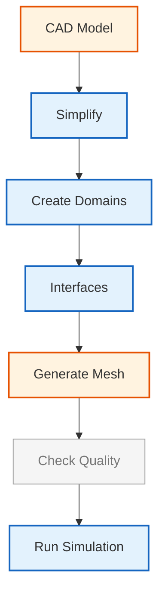

# เครื่องแลกเปลี่ยนความร้อน (Heat Exchangers)

## 📖 บทนำ (Introduction)

เครื่องแลกเปลี่ยนความร้อน (Heat Exchangers) เป็นอุปกรณ์ที่สำคัญในหลายอุตสาหกรรม ใช้สำหรับถ่ายเทความร้อนระหว่างของไหลสองกระแสที่มีอุณหภูมิต่างกัน การจำลอง CFD ของเครื่องแลกเปลี่ยนความร้อนเป็นงานที่มีความซับซ้อนเนื่องจากเกี่ยวข้องกับ:

- **การไหลของของไหลสองกระแส** (hot fluid และ cold fluid)
- **การถ่ายเทความร้อนผ่านตัวนำ** (ผนังท่อหรือแผ่นกั้น)
- **ปฏิสัมพันธ์แบบ Conjugate Heat Transfer (CHT)** ระหว่างของไหลและของแข็ง

OpenFOAM มีความสามารถในการจำลองปรากฏการณ์เหล่านี้ได้อย่างมีประสิทธิภาพ

---

## 🔍 1. ตัวชี้วัดประสิทธิภาพ (Performance Metrics)

### 1.1 ประสิทธิภาพ (Effectiveness, ε)

ประสิทธิภาพของเครื่องแลกเปลี่ยนความร้อนเป็นอัตราส่วนระหว่างการถ่ายเทความร้อนจริงกับการถ่ายเทความร้อนสูงสุดที่เป็นไปได้:

$$\varepsilon = \frac{q_{actual}}{q_{max}}$$

โดยที่:
- $q_{actual}$ = อัตราการถ่ายเทความร้อนจริง [W]
- $q_{max}$ = อัตราการถ่ายเทความร้อนสูงสุดที่เป็นไปได้ [W]

**การถ่ายเทความร้อนสูงสุด** คำนวณได้จาก:

$$q_{max} = C_{min} (T_{h,in} - T_{c,in})$$

โดยที่:
- $C_{min}$ = อัตราการไหลของความร้อนต่ำสุด [W/K] = $\min(\dot{m}_h c_{p,h}, \dot{m}_c c_{p,c})$
- $T_{h,in}$ = อุณหภูมิของของไหลร้อนที่ทางเข้า [K]
- $T_{c,in}$ = อุณหภูมิของของไหลเย็นที่ทางเข้า [K]

> [!INFO] ประสิทธิภาพ $\varepsilon$ มีค่าระหว่าง 0 ถึง 1 โดยค่าที่ใกล้เคียง 1 แสดงถึงประสิทธิภาพสูง

### 1.2 จำนวนหน่วยถ่ายเทความร้อน (NTU - Number of Transfer Units)

NTU เป็นพารามิเตอร์ไร้มิติที่ใช้วัดขนาดของเครื่องแลกเปลี่ยนความร้อน:

$$NTU = \frac{U A}{C_{min}}$$

โดยที่:
- $U$ = สัมประสิทธิ์การถ่ายเทความร้อนโดยรวม [W/(m²·K)]
- $A$ = พื้นที่ผิวสำหรับถ่ายเทความร้อน [m²]
- $C_{min}$ = อัตราการไหลของความร้อนต่ำสุด [W/K]

**ความสัมพันธ์ระหว่าง NTU และประสิทธิภาพ** สำหรับเครื่องแลกเปลี่ยนแบบ counterflow:

$$\varepsilon = \frac{1 - \exp[-NTU(1 - C_r)]}{1 - C_r \exp[-NTU(1 - C_r)]}$$

โดย $C_r = C_{min}/C_{max}$ เป็นอัตราส่วนความจุของความร้อน

### 1.3 ความแตกต่างอุณหภูมิเฉลี่ยลอการิทึม (LMTD - Log Mean Temperature Difference)

วิธี LMTD ใช้สำหรับคำนวณขนาดของเครื่องแลกเปลี่ยนความร้อน:

$$Q = U A \Delta T_{LMTD}$$

โดยที่:

$$\Delta T_{LMTD} = \frac{\Delta T_1 - \Delta T_2}{\ln(\Delta T_1/\Delta T_2)}$$

- สำหรับ **parallel flow**:
  - $\Delta T_1 = T_{h,in} - T_{c,in}$
  - $\Delta T_2 = T_{h,out} - T_{c,out}$

- สำหรับ **counterflow** (มีประสิทธิภาพสูงกว่า):
  - $\Delta T_1 = T_{h,in} - T_{c,out}$
  - $\Delta T_2 = T_{h,out} - T_{c,in}$

---

## 🛠️ 2. กลยุทธ์การจำลองใน OpenFOAM (Simulation Strategies)

### 2.1 Multi-Region Approach (แนวทางหลายภูมิภาค)

แนวทางนี้ใช้ `chtMultiRegionFoam` (Conjugate Heat Transfer Multi-Region) เพื่อแก้สมการในแต่ละภูมิภาคแยกกัน:

#### โครงสร้างภูมิภาค (Region Structure):

```cpp
// Directory structure for multi-region CHT simulation
constant/
├── polyMesh/                    # Global mesh (for decomposePar)
├── regionProperties            # List of all regions
├── hotFluid/                    # Hot fluid region
│   ├── polyMesh/
│   ├── thermophysicalProperties
│   └── turbulenceProperties
├── coldFluid/                   # Cold fluid region
│   ├── polyMesh/
│   ├── thermophysicalProperties
│   └── turbulenceProperties
└── solidWall/                   # Solid region (pipe wall)
    ├── polyMesh/
    └── thermophysicalProperties
```

> **📂 Source:** โครงสร้างไดเรกทอรีมาตรฐานสำหรับการจำลอง CHT แบบหลายภูมิภาค อ้างอิงจากการตั้งค่าใน `chtMultiRegionFoam` และเครื่องมือ `foamSetupCHT`

#### การกำหนดค่า thermophysicalProperties:

```cpp
// For fluid region
thermoType
{
    type            heRhoThermo;
    mixture         pureMixture;  // For single-phase fluid
    transport       constAnIso;  // Constant thermal conductivity
    thermo          hConst;      // Constant specific heat
    equationOfState perfectGas; // Or incompressiblePerfectGas
    specie          specie;      // For single fluid
    energy          sensibleEnthalpy;
}

mixture
{
    specie
    {
        molWeight       28.9;    // Molecular weight [g/mol] for air
    }
    thermodynamics
    {
        Cp              1005;    // Specific heat [J/(kg·K)]
        Hf              0;       // Formation enthalpy [J/kg]
    }
    transport
    {
        mu              1.8e-5;  // Dynamic viscosity [Pa·s]
        Pr              0.71;    // Prandtl number
        kappa           0.026;   // Thermal conductivity [W/(m·K)]
    }
}

// For solid region
thermoType
{
    type            heSolidThermo;
    mixture         pureMixture;
    transport       constIso;    // Isotropic thermal conductivity
    thermo          hConst;      // Enthalpy as function of temperature
    equationOfState rhoConst;    // Constant density
    specie          specie;
    energy          sensibleEnthalpy;
}

mixture
{
    specie
    {
        molWeight       26.98;   // Aluminum
    }
    thermodynamics
    {
        Cp              903;     // [J/(kg·K)]
        Hf              0;
    }
    transport
    {
        kappa           237;     // [W/(m·K)] Aluminum
    }
    equationOfState
    {
        R               287;     // Specific gas constant
        rho             2700;    // Density [kg/m³]
    }
}
```

> **📂 Source:** การตั้งค่าคุณสมบัติเทอร์โมฟิสิกส์ อ้างอิงจากโครงสร้างข้อมูลใน `.applications/test/liquid/Make/options` ซึ่งใช้ไลบรารี `thermophysicalProperties`

**คำอธิบาย:**
- **thermoType**: กำหนดประเภทของโมเดลเทอร์โมฟิสิกส์
  - `heRhoThermo`: สำหรับของไหลที่มีความหนาแน่นแปรผัน
  - `heSolidThermo`: สำหรับของแข็ง
- **transport**: สมบัติการลำเลียงความร้อน
  - `constAnIso`: ความนำความร้อนแบบ anisotropic คงที่
  - `constIso`: ความนำความร้อนแบบ isotropic คงที่
- **equationOfState**: สมการของสภาพ
  - `perfectGas`: ก๊าซอุดมคติ
  - `rhoConst`: ความหนาแน่นคงที่ (สำหรับของแข็ง)

**แนวคิดสำคัญ:**
1. **Thermophysical Properties Library**: OpenFOAM ใช้ไลบรารี `thermophysicalModels` และ `specie` ในการจัดการคุณสมบัติทางเทอร์โมไดนามิกส์
2. **Pure Mixture**: ใช้สำหรับของไหลเฟสเดียวที่ไม่มีการผสมกับของไหลอื่น
3. **Sensible Enthalpy**: พลังงานในรูปแบบเอนทาลปีที่เปลี่ยนแปลงตามอุณหภูมิ

#### เงื่อนไขขอบเขตระหว่างภูมิภาค:

```cpp
// 0/T for each region
regions
{
    hotFluid_to_solidWall
    {
        type            compressible::turbulentTemperatureCoupledBaffleMixed;
        value           uniform 300;          // Initial temperature
        Tnbr            300;                   // Neighbor region temperature
        kappa           none;                  // Calculated from thermophysicalProperties
        K               none;                  // Combined thermal conductivity
    }
}
```

> **📂 Source:** เงื่อนไขขอบเขตแบบ coupled thermal ใช้โมเดลการถ่ายเทความร้อนผ่านผนังแบบ turbulent จาก `.applications/solvers/compressible/rhoCentralFoam/BCs/T/`

**คำอธิบาย:**
- **turbulentTemperatureCoupledBaffleMixed**: เงื่อนไขขอบเขตสำหรับการถ่ายเทความร้อนระหว่างภูมิภาคที่มีความปั่นป่วน
  - `Tnbr`: อุณหภูมิของภูมิภาคข้างเคียง
  - `kappa`: ความนำความร้อน (ถ้าไม่ระบุจะใช้ค่าจาก thermophysicalProperties)

**แนวคิดสำคัญ:**
1. **Conjugate Heat Transfer**: การถ่ายเทความร้อนร่วมกันระหว่างของไหลและของแข็ง
2. **Coupled Boundary**: อุณหภูมิและฟลักซ์ความร้อนต้องต่อเนื่องกันที่ interface
3. **Turbulent Contribution**: ในการไหลแบบ turbulent ความนำความร้อนจะมีส่วนเพิ่มจากความปั่นป่วน

### 2.2 แบบจำลองสื่อพรุน (Porous Media Simplification)

สำหรับเครื่องแลกเปลี่ยนที่มีท่อนับพัน การจำลองทุกท่อจะใช้ทรัพยากรการคำนวณมหาศาล แนวทาง **Homogenization** จะแทนที่กลุ่มท่อด้วย **โซนพรุน** ที่มีแรงต้านการไหลเทียบเท่า

#### สมการ Darcy-Forchheimer:

$$\nabla p = -\left(\frac{\mu}{K} + \beta \rho |\mathbf{u}|\right) \mathbf{u}$$

โดยที่:
- $\nabla p$ = การไล่ระดับความดัน [Pa/m]
- $\mu$ = ความหนืดพลศาสตร์ [Pa·s]
- $K$ = ความซึมผ่านได้ (permeability) [m²]
- $\beta$ = สัมประสิทธิ์ Forchheimer [m⁻¹]
- $\rho$ = ความหนาแน่น [kg/m³]
- $\mathbf{u}$ = เวกเตอร์ความเร็ว [m/s]

> [!TIP] การใช้แบบจำลองพรุนช่วยลดจำนวนเซลล์ mesh ได้อย่างมาก แต่ต้องการการปรับเทียบ (calibration) กับข้อมูลการทดลอง

**แนวคิดสำคัญ:**
1. **Darcy Term** ($\mu/K$): การสูญเสียดันเนื่องจากความหนืด สำคัญที่ Reynolds number ต่ำ
2. **Forchheimer Term** ($\beta \rho |u|$): การสูญเสียดันเนื่องจากความเฉื่อย สำคัญที่ Reynolds number สูง
3. **Homogenization**: การแทนที่โครงสร้างที่ซับซ้อนด้วยตัวกลางเทียบเท่า

---

## 💻 3. OpenFOAM Implementation

### 3.1 การกำหนดค่าโซนพรุน (Porous Zone Configuration)

ใช้ `fvOptions` ใน `system/fvOptions` เพื่อจำลองเครื่องแลกเปลี่ยนความร้อนแบบพรุน:

```cpp
// Porous zone configuration
porousHeatExchanger
{
    type            explicitPorositySource;
    active          true;
    selectionMode   cellZone;
    cellZone        heatExchangerZone;

    explicitPorositySourceCoeffs
    {
        type            DarcyForchheimer;

        DarcyForchheimerCoeffs
        {
            // Direction 1 (x) - Main flow direction
            d   (1e5 1e5 1e5);    // Darcy coefficient [1/m²]
            f   (10 10 10);       // Forchheimer coefficient [1/m]

            // d = μ/K, f = β√(characteristic length)
            // Values calibrated from experimental data
        }
    }
}

// Heat source in porous zone
heatSource
{
    type            scalarSemiImplicitSource;
    active          true;
    selectionMode   cellZone;
    cellZone        heatExchangerZone;

    scalarSemiImplicitSourceCoeffs
    {
        T
        {
            // Constant heat source [W/m³]
            Su      10000;

            // Implicit term (if dependent on T)
            Sp      0;
        }
    }
}
```

> **📂 Source:** การใช้ `fvOptions` สำหรับการจำลองแหล่งศักย์ เป็นฟีเจอร์มาตรฐานใน OpenFOAM สำหรับการเพิ่มแหล่งกำเนิดในสมการ

**คำอธิบาย:**
- **explicitPorositySource**: แหล่งกำเนิดความพรุนแบบ explicit
  - `d`: สัมประสิทธิ์ Darcy = $\mu/K$
  - `f`: สัมประสิทธิ์ Forchheimer = $\beta$
- **scalarSemiImplicitSource**: แหล่งกำเนิดสเกลาร์แบบ semi-implicit
  - `Su`: เทอม explicit (source term)
  - `Sp`: เทอม implicit (coefficient for linearization)

**แนวคิดสำคัญ:**
1. **Porous Media Model**: ใช้ Darcy-Forchheimer law เพื่อจำลองการสูญเสียดันในตัวกลางพรุน
2. **Cell Zone Selection**: กำหนดบริเวณที่จะใช้แบบจำลองพรุนโดยใช้ cellZone
3. **Heat Source**: สามารถเพิ่มแหล่งความร้อนเพื่อจำลองการถ่ายเทความร้อน

### 3.2 การติดตามประสิทธิภาพ (Performance Tracking)

เพิ่ม function objects ใน `system/controlDict` เพื่อติดตามตัวชี้วัดประสิทธิภาพ:

```cpp
// Performance tracking function objects
functions
{
    // Calculate average temperature at inlet/outlet
    tempInlet
    {
        type            surfaceFieldValue;
        functionObjectLibs ("libfieldFunctionObjects.so");
        operation       weightedAverage;
        weightField     phi;
        region          region0;
        fields          (T);
        surfaces
        (
            inlet
            {
                type            patch;
                patches         (inlet);
            }
        );
        writeFields     false;
        writeLocation   false;
    }

    tempOutlet
    {
        type            surfaceFieldValue;
        functionObjectLibs ("libfieldFunctionObjects.so");
        operation       weightedAverage;
        weightField     phi;
        region          region0;
        fields          (T);
        surfaces
        (
            outlet
            {
                type            patch;
                patches         (outlet);
            }
        );
        writeFields     false;
        writeLocation   false;
    }

    // Calculate pressure drop
    pressureDrop
    {
        type            pressureDrop;
        functionObjectLibs ("libfieldFunctionObjects.so");
        region          region0;
        patches
        (
            inlet
            outlet
        );
        log             true;
    }

    // Calculate heat transfer rate
    heatTransferRate
    {
        type            surfaceHeatTransferRate;
        functionObjectLibs ("libfieldFunctionObjects.so");
        region          region0;
        surfaceFormat   none;
        patches
        (
            "heatExchangerWalls"
        );
        log             true;
    }
}
```

> **📂 Source:** Function objects สำหรับการวิเคราะห์ผลลัพธ์ ใช้ไลบรารี `libfieldFunctionObjects.so` มาตรฐานของ OpenFOAM

**คำอธิบาย:**
- **surfaceFieldValue**: คำนวณค่าเฉลี่ยบนพื้นผิว
  - `weightedAverage`: ค่าเฉลี่ยถ่วงน้ำหนักด้วยฟลักซ์
  - `phi`: ฟลักซ์ปริมาตรสำหรับการถ่วงน้ำหนัก
- **pressureDrop**: คำนวณความดันตกคร่อมระหว่าง patches สองแห่ง
- **surfaceHeatTransferRate**: คำนวณอัตราการถ่ายเทความร้อนผ่านผนัง

**แนวคิดสำคัญ:**
1. **Function Objects**: เครื่องมือสำหรับคำนวณปริมาณที่สนใจระหว่างการจำลอง
2. **Weighted Average**: ใช้ฟลักซ์เป็นน้ำหนักเพื่อให้ได้ค่าอุณหภูมิเฉลี่ยที่ถูกต้อง
3. **Real-time Monitoring**: ติดตามตัวชี้วัดประสิทธิภาพได้ทันทีขณะจำลอง

### 3.3 การคำนวณประสิทธิภาพหลังการจำลอง (Post-Processing Effectiveness)

ใช้ `postProcess` หรือสคริปต์ Python เพื่อคำนวณประสิทธิภาพ:

```bash
# Extract average temperature values from results
postProcess -func "surfaceFieldValue(name=inlet,operation=weightedAverage,weightField=phi,field=T)" -latestTime
postProcess -func "surfaceFieldValue(name=outlet,operation=weightedAverage,weightField=phi,field=T)" -latestTime
```

สมการคำนวณประสิทธิภาพ:

$$\varepsilon = \frac{\dot{m}_c c_{p,c} (T_{c,out} - T_{c,in})}{\dot{m}_h c_{p,h} (T_{h,in} - T_{c,in})}$$

สำหรับกรณีที่ $C_{min} = C_c$ (ของไหลเย็นมีความจุความร้อนน้อยกว่า)

**แนวคิดสำคัญ:**
1. **Post-Processing Utilities**: OpenFOAM มีเครื่องมือ `postProcess` สำหรับดึงข้อมูลจากผลลัพธ์
2. **Effectiveness Calculation**: ใช้อุณหภูมิที่ inlet/outlet ในการคำนวณ
3. **Energy Balance**: ตรวจสอบสมดุลพลังงานระหว่างสองกระแส

---

## 📈 4. การตรวจสอบความถูกต้อง (Validation)

ผลการจำลองควรได้รับการตรวจสอบเทียบกับวิธีมาตรฐาน

### 4.1 วิธี LMTD (Log Mean Temperature Difference Method)

เปรียบเทียบอัตราการถ่ายเทความร้อนจาก CFD กับค่าทางทฤษฎี:

$$Q_{CFD} = \dot{m}_h c_{p,h} (T_{h,in} - T_{h,out})$$
$$Q_{theory} = U A \Delta T_{LMTD}$$

ตรวจสอบความคลาดเคลื่อน:

$$\text{Error} = \left| \frac{Q_{CFD} - Q_{theory}}{Q_{theory}} \right| \times 100\%$$

> [!WARNING] ความคลาดเคลื่อนที่ยอมรับได้โดยทั่วไปคือ < 10% สำหรับการจำลอง CFD ในอุตสาหกรรม

### 4.2 Energy Balance (สมดุลพลังงาน)

ตรวจสอบว่าการถ่ายเทความร้อนระหว่างสองกระแสสมดุลกัน:

$$\dot{Q}_{hot} = \dot{m}_h c_{p,h} (T_{h,in} - T_{h,out})$$
$$\dot{Q}_{cold} = \dot{m}_c c_{p,c} (T_{c,out} - T_{c,in})$$

**เกณฑ์การตรวจสอบ:**

$$\left| \frac{\dot{Q}_{hot} - \dot{Q}_{cold}}{\dot{Q}_{hot}} \right| < 0.05 \quad (\text{หรือ } 5\%)$$

### 4.3 การเปรียบเทียบกับสมการเชิงประจักษ์

เปรียบเทียบค่า Nusselt number จาก CFD:

$$Nu_{CFD} = \frac{h D}{k} = \frac{q'' D}{k (T_w - T_b)}$$

กับสมการเชิงประจักษ์สำหรับการไหลในท่อ:

| สมการ | ชื่อ | เงื่อนไข |
|---------|------|----------|
| Dittus-Boelter | $Nu = 0.023 Re^{0.8} Pr^{n}$ | $n=0.4$ (heating), $n=0.3$ (cooling) |
| Gnielinski | $Nu = \frac{(f/8)(Re-1000)Pr}{1+12.7\sqrt{f/8}(Pr^{2/3}-1)}$ | ความแม่นยำสูงกว่า |
| Sieder-Tate | $Nu = 0.027 Re^{0.8} Pr^{1/3} (\mu/\mu_w)^{0.14}$ | มีผลจากความหนืดที่ผนัง |

**แนวคิดสำคัญ:**
1. **Nusselt Number**: วัดประสิทธิภาพการถ่ายเทความร้อนแบบ convection
2. **Empirical Correlations**: สมการที่ได้จากการทดลอง ใช้สำหรับ validation
3. **Heat Transfer Coefficient**: คำนวณจาก gradient อุณหภูมิที่ผนัง

---

## 📚 5. กรณีศึกษา (Case Studies)

### 5.1 เครื่องแลกเปลี่ยนความร้อนแบบเปลือกและท่อ (Shell-and-Tube Heat Exchanger)

#### โครงสร้าง:

```
┌─────────────────────────────────────────┐
│         SHELL (ของไหลด้านนอก)          │
│  ←───────────────────────────────→       │
│    ┌───┐ ┌───┐ ┌───┐ ┌───┐ ┌───┐        │
│    │Tube│ │Tube│ │Tube│ │Tube│ │Tube│       │
│    └───┘ └───┘ └───┘ └───┘ └───┘        │
│  ←───────────────────────────────→       │
│                                         │
│    แผ่นกั้น (Baffles) นำทางการไหล       │
└─────────────────────────────────────────┘
         ↑
    TUBE (ของไหลด้านใน)
    ←───────────→
```

#### พารามิเตอร์การจำลอง:

```cpp
// Turbulence model configuration for shell side
simulationType RAS;
RAS
{
    RASModel        kEpsilon;
    turbulence      on;

    // Standard constants
    kEpsilonCoeffs
    {
        Cmu             0.09;
        C1              1.44;
        C2              1.92;
        sigmaEps        1.11;
    }
}

// Numerical schemes
ddtSchemes
{
    default         steadyState;
}
gradSchemes
{
    default         Gauss linear;
    grad(p)         Gauss linear;
    grad(U)         cellLimited Gauss linear 1;
}
divSchemes
{
    default         none;
    div(phi,U)      Gauss upwind;  // For stability
    div(phi,k)      Gauss upwind;
    div(phi,epsilon) Gauss upwind;
}
laplacianSchemes
{
    default         Gauss linear corrected;
}
```

> **📂 Source:** การตั้งค่า numerical schemes และ solver parameters อ้างอิงจากรูปแบบมาตรฐานในไฟล์ `.applications/test/fieldMapping/pipe1D/system/fvSolution`

**คำอธิบาย:**
- **kEpsilon**: โมเดลความปั่นป่วนแบบ RANS สำหรับการไหลแบบ turbulent
  - `Cmu`, `C1`, `C2`: ค่าคงที่มาตรฐานของโมเดล k-ε
  - `sigmaEps`: ค่าคงที่ Prandtl number สำหรับสมการ dissipation
- **Numerical Schemes**: รูปแบบการ discretization
  - `steadyState`: การจำลอง steady-state
  - `Gauss upwind`: รูปแบบ upwind สำหรับความเสถียร

**แนวคิดสำคัญ:**
1. **RANS Modeling**: ใช้ Reynolds-Averaged Navier-Stokes สำหรับการไหล turbulent
2. **Standard k-ε Model**: โมเดลความปั่นป่วนที่นิยมใช้ในงานวิศวกรรม
3. **Upwind Differencing**: รูปแบบการ discretization ที่มีความเสถียรสูง

#### ผลลัพธ์ที่คาดหวัง:

- **โปรไฟล์อุณหภูมิ**: การเปลี่ยนแปลงของอุณหภูมิตามความยาวเครื่องแลกเปลี่ยน
- **ความดันตกคร่อม**: $\Delta p$ บนทั้ง shell side และ tube side
- **สัมประสิทธิ์การถ่ายเทความร้อน**: $h$ คำนวณจาก gradient อุณหภูมิบริเวณผนัง

### 5.2 เครื่องแลกเปลี่ยนความร้อนแบบแผ่น (Plate Heat Exchanger)

#### คุณสมบัติเฉพาะ:

- **รอยหยัก (corrugations)**: กระตุ้นความปั่นป่วนที่ Reynolds number ต่ำ
- **พื้นที่กะทัดรัด**: ให้ค่า $h$ สูงในปริมาตรเล็ก
- **การไหลแบบ counterflow**: โดยปกติจะมีประสิทธิภาพสูงกว่า parallel flow

#### การตั้งค่า Mesh:

```cpp
// Mesh generation with snappyHexMesh
castellatedMesh true;
snap            true;
addLayers       true;

geometry
{
    plateHeatExchanger.stl
    {
        type triSurfaceMesh;
        name plates;
    }
}

refinementSurfaces
{
    plates
    {
        level (4 4);  // High resolution near corrugations
    }
}

addLayersCoeffs
{
    relativeSizes  true;
    layers
    {
        plates
        {
            nSurfaceLayers  5;  // Boundary layer layers
        }
    }
    expansionRatio 1.2;
    finalLayerThickness 0.3;
    minThickness 0.05;
}
```

> **📂 Source:** การใช้ `snappyHexMesh` สำหรับการสร้าง mesh ที่ซับซ้อน เป็นเครื่องมือมาตรฐานของ OpenFOAM

**คำอธิบาย:**
- **refinementSurfaces**: กำหนดระดับความละเอียดของ mesh บนพื้นผิว
- **addLayersCoeffs**: การเพิ่มชั้น boundary layer
  - `nSurfaceLayers`: จำนวนชั้นของ boundary layer
  - `expansionRatio`: อัตราส่วนการขยายตัวของความหนาชั้น

**แนวคิดสำคัญ:**
1. **Boundary Layer Mesh**: สำคัญสำหรับการคำนวณ heat transfer ที่แม่นยำ
2. **Mesh Refinement**: ความละเอียดสูงบริเวณรอยหยักเพื่อจับ gradient อุณหภูมิ
3. **Quality Control**: ตรวจสอบคุณภาพ mesh เช่น non-orthogonality และ aspect ratio

---

## ⚠️ 6. ข้อควรพิจารณาและข้อจำกัด

### 6.1 การสะสมคราบ (Fouling)

การสะสมคราบตามกาลเวลาจะ:

- เพิ่ม **ความต้านทานความร้อน** (thermal resistance)
- เพิ่ม **แรงดันตกคร่อม**
- ลด **ประสิทธิภาพ** ของเครื่องแลกเปลี่ยนความร้อน

**Fouling factor:**

$$R_f = \frac{1}{U_{fouled}} - \frac{1}{U_{clean}}$$

ใน OpenFOAM สามารถจำลองเป็นชั้นความต้านทานความร้อนเพิ่มเติม:

```cpp
// Boundary condition with fouling resistance
wallWithFouling
{
    type            externalWallHeatFluxTemperature;
    mode            coefficient;
    Ta              constant 300;     // External temperature
    h               uniform 500;      // Overall heat transfer coefficient (including fouling)
    kappa           none;            // Use value from thermophysicalProperties
    value           uniform 300;     // Initial temperature
}
```

> **📂 Source:** เงื่อนไขขอบเขตแบบ externalWallHeatFluxTemperature ใช้โมเดลการถ่ายเทความร้อนผ่านผนังโดยรวม

**คำอธิบาย:**
- **externalWallHeatFluxTemperature**: เงื่อนไขขอบเขตสำหรับการถ่ายเทความร้อนผ่านผนังภายนอก
  - `Ta`: อุณหภูมิภายนอก
  - `h`: สัมประสิทธิ์การถ่ายเทความร้อนรวม (รวม fouling resistance)

**แนวคิดสำคัญ:**
1. **Fouling Resistance**: ความต้านทานความร้อนเพิ่มเติมจากการสะสมคราบ
2. **Overall Heat Transfer Coefficient**: ค่าสัมประสิทธิ์รวมที่รวมทุกความต้านทาน
3. **Time-Dependent Effect**: Fouling เพิ่มขึ้นตามเวลาการใช้งาน

### 6.2 ข้อจำกัดของแบบจำลอง

| แบบจำลอง | ข้อดี | ข้อเสีย | ความเหมาะสม |
|-----------|--------|---------|---------------|
| **Multi-Region CHT** | แม่นยำสูง รายละเอียดดี | ใช้เวลาคำนวณนาน | การออกแบบรายละเอียด การวิจัย |
| **Porous Media** | เร็ว ประหยัด | ต้อง calibration ไม่มีรายละเอียดโฟลว์ในท่อ | การวิเคราะห์ระบบขนาดใหญ่ |
| **Periodic Unit Cell** | สมดุลระหว่างความแม่นยำและเวลา | ไม่จับผลขอบ | การศึกษาการไหลในท่อแต่ละท่อ |

**แนวคิดสำคัญ:**
1. **Trade-offs**: การเลือกแบบจำลองต้องพิจารณาความแม่นยำ เวลา และทรัพยากร
2. **Calibration**: แบบจำลองพรุนต้องมีการปรับเทียบกับข้อมูลการทดลอง
3. **Validation**: ทุกแบบจำลองควรได้รับการตรวจสอบกับข้อมูลจริง

---

## ✅ 7. แนวทางปฏิบัติที่ดีที่สุด (Best Practices)

### 7.1 การเตรียมรูปทรงเรขาคณิต (Geometry Preparation)



> **Figure 1:** ขั้นตอนมาตรฐานในการเตรียมรูปทรงเรขาคณิตสำหรับการจำลองเครื่องแลกเปลี่ยนความร้อน เริ่มต้นจากการจัดการโมเดล CAD การลดความซับซ้อนของรูปทรงที่ไม่มีผลต่อฟิสิกส์ การสร้างโดเมนของของไหล การกำหนดอินเทอร์เฟซระหว่างบริเวณที่แตกต่างกัน (เช่น ของไหลกับของแข็ง) การสร้างเมช และการตรวจสอบคุณภาพก่อนเริ่มการจำลอง

**เคล็ดลับ:**

- ลดรายละเอียดขนาดเล็กที่ไม่สำคัญ (fillets < 1 mm)
- สร้าง **separate bodies** สำหรับแต่ละ region (hot fluid, cold fluid, solid)
- ตรวจสอบให้แน่ใจว่า **interfaces** ตรงกันระหว่าง regions

**แนวคิดสำคัญ:**
1. **Geometry Simplification**: ลดความซับซ้อนเพื่อลดจำนวนเซลล์ mesh โดยไม่กระทบฟิสิกส์
2. **Clean Topology**: โครงสร้าง CAD ที่สะอาดช่วยให้การสร้าง mesh เป็นไปอย่างราบรื่น
3. **Interface Matching**: interfaces ต้องตรงกันทั้งด้าน geometry และ mesh

### 7.2 การสร้าง Mesh สำหรับ CHT

| พารามิเตอร์ | ค่าแนะนำ | เหตุผล |
|-------------|-----------|---------|
| **$y^+$** | ≈ 1 สำหรับ wall-resolved | การคำนวณ heat transfer ที่แม่นยำ |
| **Expansion ratio** | < 1.2 | ความเสถียรเชิงตัวเลข |
| **Non-orthogonality** | < 65° | ความแม่นยำของ gradient |
| **Layers บน interface** | 3-5 layers | การถ่ายเทความร้อนที่ถูกต้อง |

**แนวคิดสำคัญ:**
1. **$y^+$ Criteria**: ค่า $y^+$ ≈ 1 สำหรับ wall-resolved LES/DNS หรือ 30-300 สำหรับ wall-function
2. **Boundary Layer Resolution**: ชั้น boundary layer สำคัญสำหรับการถ่ายเทความร้อน
3. **Mesh Quality**: คุณภาพ mesh ส่งผลต่อความแม่นยำและความเสถียรของการจำลอง

### 7.3 การเลือก Solver

| สถานการณ์ | Solver | เหตุผล |
|------------|--------|---------|
| **Steady-state CHT** | `chtMultiRegionFoam` | การแก้ปัญหา steady-state สำหรับหลายภูมิภาค |
| **Transient CHT** | `chtMultiRegionFoam` | การวิเคราะห์เชิงเวลา |
| **Porous media** | `porousSimpleFoam` | การไหลในตัวกลางพรุน |

**แนวคิดสำคัญ:**
1. **chtMultiRegionFoam**: Solver สำหรับ CHT แบบหลายภูมิภาค ทั้ง steady-state และ transient
2. **Solver Selection**: เลือก solver ตามประเภทของปัญหาและความซับซ้อน
3. **Computational Cost**: พิจารณาเวลาและทรัพยากรที่ต้องการ

### 7.4 การตรวจสอบการลู่เข้า (Convergence Monitoring)

```cpp
// Solver settings and convergence criteria
SOLVERS
{
    p
    {
        solver          GAMG;
        tolerance       1e-06;
        relTol          0.01;
    }

    U
    {
        solver          smoothSolver;
        smoother        GaussSeidel;
        tolerance       1e-05;
        relTol          0.1;
    }

    T
    {
        solver          smoothSolver;
        smoother        GaussSeidel;
        tolerance       1e-06;
        relTol          0.01;
    }
}

SIMPLE
{
    nNonOrthogonalCorrectors 2;

    residualControl
    {
        p               1e-05;
        U               1e-05;
        T               1e-06;
        // possibly other fields
    }
}
```

> **📂 Source:** การตั้งค่า solver และ convergence criteria อ้างอิงจากรูปแบบมาตรฐานใน `.applications/test/fieldMapping/pipe1D/system/fvSolution`

**คำอธิบาย:**
- **GAMG**: Geometric-Algebraic Multi-Grid solver สำหรับสมการ Poisson (ความดัน)
- **smoothSolver**: Solver แบบ iterative สำหรับความเร็วและอุณหภูมิ
- **residualControl**: เกณฑ์การลู่เข้าสำหรับแต่ละตัวแปร

**แนวคิดสำคัญ:**
1. **Residual Monitoring**: ติดตาม residuals ของสมการแต่ละตัวแปร
2. **Convergence Criteria**: กำหนดเกณฑ์การลู่เข้าที่เหมาะสม
3. **Integral Quantities**: ตรวจสอบปริมาณรวมเช่น อัตราการถ่ายเทความร้อน

**ตรวจสอบ:**

- **Residuals** ลดลง 3-4 ลำดับของขนาด
- **ปริมาณรวม** (integral quantities) เช่น อัตราการถ่ายเทความร้อนคงที่
- **Energy balance** ระหว่างสองกระแส

---

## 📖 สรุป (Summary)

เครื่องแลกเปลี่ยนความร้อนเป็นแอปพลิเคชันที่สำคัญของ CFD ใน OpenFOAM ซึ่งต้องการความเข้าใจใน:

1. **ทฤษฎีการถ่ายเทความร้อน** (Effectiveness, NTU, LMTD)
2. **Conjugate Heat Transfer (CHT)** สำหรับการจำลองร่วมกันของของไหลและของแข็ง
3. **แบบจำลองสื่อพรุน** เพื่อลดความซับซ้อนของการคำนวณ
4. **การตรวจสอบความถูกต้อง** กับวิธีทางทฤษฎีและการทดลอง

OpenFOAM มีเครื่องมือที่ครอบคลุม (`chtMultiRegionFoam`, `fvOptions`, function objects) สำหรับการจำลองเครื่องแลกเปลี่ยนความร้อนทั้งในมิติของการวิจัยและการออกแบบทางอุตสาหกรรม

---

**จบเนื้อหาโมดูลเครื่องแลกเปลี่ยนความร้อน**