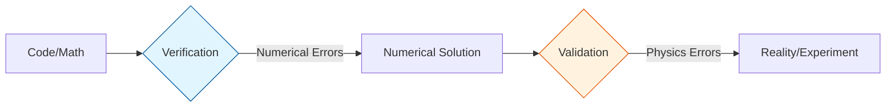
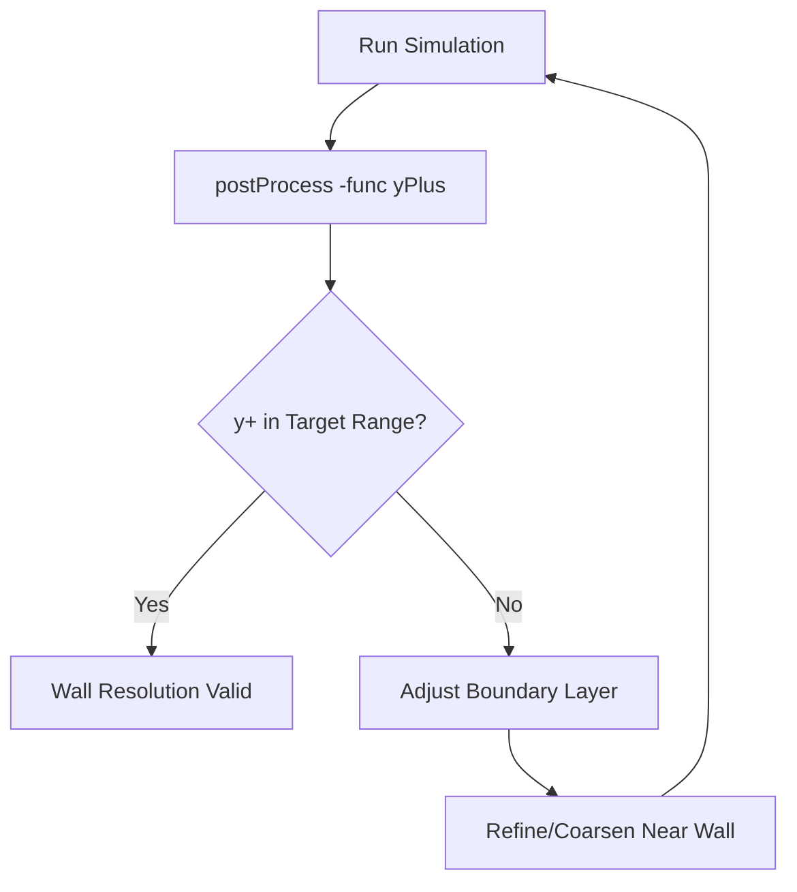
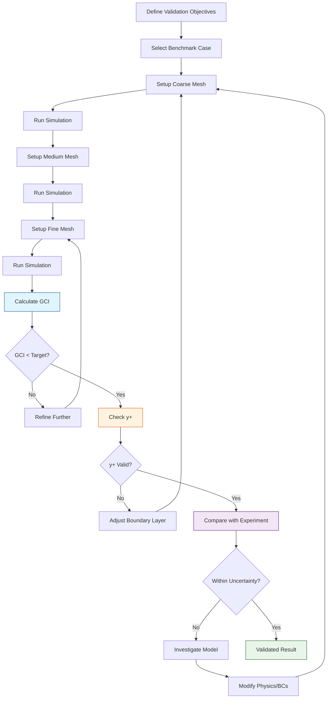

# Validation and Verification Overview

ภาพรวมการทวนสอบและตรวจสอบความถูกต้อง

---

## Learning Objectives

**🎯 หลักสูตรนี้คุณจะสามารถ:**

- **แยกแยะความแตกต่างระหว่าง Verification และ Validation** อย่างชัดเจน
- **อธิบายประเภทของความคลาดเคลื่อน** ที่เกิดขึ้นใน CFD simulation
- **คำนวณ Grid Convergence Index (GCI)** เพื่อประเมิน mesh independence
- **เลือกใช้ error norms ที่เหมาะสม** ($L_1, L_2, L_\infty$) สำหรับการประเมินผล
- **ตรวจสอบความละเอียดของ mesh บนผนัง** ด้วยค่า1$y^+1ที่เหมาะสม
- **ประยุกต์ใช้เครื่องมือของ OpenFOAM** สำหรับ V&V อย่างถูกต้อง
- **ดำเนินการ V&V workflow** จากการตั้งค่าถึงการยืนยันผลลัพธ์

---

## What is V&V?

### **Verification คืออะไร?**

**Verification** คือการตรวจสอบว่าเรา **"แก้สมการถูกต้องหรือไม่"** ("Are we solving the equations right?")

- **เป้าหมาย:** มั่นใจว่า numerical solution ใกล้เคียง exact solution ของสมการที่เราตั้ง
- **สิ่งที่ตรวจสอบ:** Numerical errors (discretization, iteration, round-off)
- **เครื่องมือ:** Mesh refinement studies, residual analysis, benchmark comparisons

### **Validation คืออะไร?**

**Validation** คือการตรวจสอบว่าเรา **"แก้สมการที่ถูกต้องหรือไม่"** ("Are we solving the right equations?")

- **เป้าหมาย:** มั่นใจว่า mathematical model ตรงกับ physical reality
- **สิ่งที่ตรวจสอบ:** Modeling errors (turbulence, boundary conditions, physics assumptions)
- **เครื่องมือ:** Experimental comparisons, analytical solutions, real-world data

---

## Why is V&V Critical?

### **ทำไม V&V สำคัญที่สุด?**

- **CFD ที่ไม่ validated = ไม่น่าเชื่อถือ** — ผิดพลาดอาจนำสู่การออกแบบที่อันตรายหรือสิ้นเปลือง
- **เข้าใจ verification vs validation = รู้ว่าตรวจสอบอะไร** — ไม่สับสนระหว่าง numerical errors และ physics errors
- **GCI (Grid Convergence Index) = benchmark สำหรับ mesh independence** — มาตรฐานสากลที่รับรู้กันทั่วไป
- **มาตรฐานวิศวกรรม:** Journal และอุตสาหกรรมต้องการหลักฐาน V&V ก่อนยอมรับผลลัพธ์
- **ประหยัดทรัพยากร:** Detect errors ตั้งแต่ early stage ป้องกันการทำซ้ำในภายหลัง

---

## How to Perform V&V?

### **Core Distinction**

> **💡 หัวใจของ V&V:**
>
> - **Verification:** "Are we solving the equations right?" → Numerical errors
> - **Validation:** "Are we solving the right equations?" → Physics vs reality

| Term | Question | Focus | Output |
|------|----------|-------|--------|
| **Verification** | Solving equations right? | Numerical errors | Error estimates, convergence |
| **Validation** | Solving right equations? | Physics vs reality | Model confidence, uncertainty |



---

### **Step 1: Understand Error Types**

#### **Numerical Errors (Verification)**

$$\varepsilon_{num} = |f_{numerical} - f_{exact}|$$

| Type | Source | Control Method | Detection |
|------|--------|----------------|-----------|
| **Discretization** | FVM approximation | Mesh refinement | GCI calculation |
| **Iteration** | Incomplete convergence | Tighter tolerances | Residual monitoring |
| **Round-off** | Floating point precision | Higher precision | Grid refinement |

#### **Modeling Errors (Validation)**

$$\varepsilon_{model} = |f_{CFD} - f_{experiment}|$$

| Type | Source | Control Method |
|------|--------|----------------|
| **Turbulence** | RANS/LES assumptions | Model comparison |
| **Boundary** | Inaccurate BCs | Sensitivity analysis |
| **Geometry** | Simplifications | CAD fidelity |

---

### **Step 2: Calculate Grid Convergence Index (GCI)**

#### **Three-Grid Method**

**1. Run Three Meshes:**
- Fine mesh:1$N_11cells
- Medium mesh:1$N_2 = N_1/r^3$
- Coarse mesh:1$N_3 = N_2/r^3$

**2. Calculate Order of Accuracy:**

$$p = \frac{\ln|\varepsilon_{32}/\varepsilon_{21}|}{\ln(r)}$$

**3. Calculate GCI for Fine Mesh:**

$$GCI_{fine} = \frac{1.25|\varepsilon_{21}|}{r^p - 1}$$

**Where:**
-1$\varepsilon_{21} = f_2 - f_11(medium - fine)
-1$\varepsilon_{32} = f_3 - f_21(coarse - medium)
-1$r1= refinement ratio (typically1$\sqrt[3]{2}1for 3D)
-1$f1= key variable (e.g., drag coefficient, Nusselt number)

#### **Acceptance Criteria**

| Application | GCI Target | Required GCI₂₁/GCI₃₂ |
|-------------|------------|---------------------|
| **Engineering** | < 5% | < 1 |
| **Research** | < 2% | < 1 |
| **High-accuracy** | < 1% | < 1 |

> **⚠️ Common Pitfall:** ไม่ตรวจสอบ asymptotic range — ให้แน่ใจว่า1$p1ค่าใกล้เคียง theoretical order (2 for second-order schemes)

---

### **Step 3: Apply Error Norms**

#### **Three Common Norms:**

$$L_1 = \frac{1}{V}\int|\phi_{CFD} - \phi_{ref}|dV$$

$$L_2 = \sqrt{\frac{1}{V}\int(\phi_{CFD} - \phi_{ref})^2 dV}$$

$$L_\infty = \max|\phi_{CFD} - \phi_{ref}|$$

| Norm | Characteristic | Best For |
|------|----------------|----------|
| **$L_1$** | Average error | Global accuracy |
| **$L_2$** | RMS error | Energy-based errors |
| **$L_\infty$** | Maximum error | Local hotspots |

> **📌 When to use which:**
> - **$L_1$:** เมื่อต้องการ overall accuracy
> - **$L_2$:** เมื่้าต้องการ penalize large errors (default choice)
> - **$L_\infty$:** เมื่อ local accuracy สำคัญ (เช่น shock detection)

---

### **Step 4: Check Wall Resolution ($y^+$)**

#### **Definition:**

$$y^+ = \frac{y u_\tau}{\nu} = \frac{y \sqrt{\tau_w/\rho}}{\nu}$$

**Where:**
-1$y1= distance to first cell center
-1$u_\tau1= friction velocity
-1$\nu1= kinematic viscosity
-1$\tau_w1= wall shear stress

#### **Target Ranges:**

| Model | Target1$y^+1| Near-Wall Treatment |
|-------|-------------|---------------------|
| **Low-Re k-ω SST** | < 1 | Viscous sublayer resolved |
| **Standard k-ε** | 30-300 | Wall functions required |
| **Spalart-Allmaras** | < 1 | Viscous sublayer resolved |
| **k-ω SST** | 1-5 | Hybrid approach |

#### **OpenFOAM Command:**

```bash
# Calculate yPlus after simulation
postProcess -func yPlus

# Check wall shear stress
postProcess -func wallShearStress
```

#### **Validation Workflow:**



---

### **Step 5: Use OpenFOAM Tools**

#### **Available Tools:**

| Tool | Purpose | Output |
|------|---------|--------|
| `postProcess -func residuals` | Monitor convergence | Residual history |
| `postProcess -func yPlus` | Wall resolution check |1$y^+1field |
| `postProcess -func wallShearStress` | Wall shear stress |1$\tau_w1field |
| `postProcess -func flowRate` | Mass/volume flow rate | Flow rate data |
| `sample` | Extract line/surface data | Point/line data |

#### **Residual Control Setup:**

```cpp
// system/fvSolution
solvers
{
    p
    {
        solver          GAMG;
        tolerance       1e-06;
        relTol          0.01;
    }
    U
    {
        solver          smoothSolver;
        tolerance       1e-06;
        relTol          0.01;
    }
}

residualControl
{
    p   1e-6;
    U   1e-6;
    k   1e-6;
    omega 1e-6;
}
```

---

### **Step 6: Use Benchmark Cases**

#### **Recommended Benchmarks:**

| Case | Physics | OpenFOAM Path | Validation Variable |
|------|---------|---------------|---------------------|
| **Lid-driven cavity** | Recirculating flow | `incompressible/icoFoam/cavity` | Velocity profiles |
| **Channel flow** | Wall turbulence | `incompressible/pisoFoam/channel395` |1$u^+1vs1$y^+1|
| **Backward-facing step** | Separation | `incompressible/pimpleFoam/backwardFacingStep` | Reattachment length |
| **Ahmed body** | External aerodynamics | `compressible/rhoSimpleFoam/ahmedBody` | Drag coefficient |

---

### **Step 7: Complete V&V Workflow**



---

## Key Takeaways

### **สิ่งสำคัญที่ต้องจำ:**

✅ **Verification กับ Validation แตกต่างกัน:**
- Verification = แก้สมการถูกไหม (numerical)
- Validation = แก้สมการที่ถูกไหม (physics)

✅ **Error Types มีสองกลุ่มหลัก:**
- Numerical errors → ควบคุมด้วย mesh refinement
- Modeling errors → ควบคุมด้วย experimental comparison

✅ **GCI คือมาตรฐานสำหรับ mesh independence:**
- ใช้ three-grid method เสมอ
- Target: < 5% (engineering), < 2% (research)
- ตรวจสอบ asymptotic range

✅ **$y^+1เป็นตัวชี้วัดความละเอียดผนัง:**
- < 1 สำหรับ low-Re models
- 30-300 สำหรับ wall functions
- ต้องตรวจสอบหลัง simulation

✅ **OpenFOAM มีเครื่องมือ V&V ในตัว:**
- `postProcess` functions สำหรับ residuals, yPlus, wallShearStress
- `sample` utility สำหรับ data extraction
- Benchmark cases พร้อมใช้งาน

✅ **V&V เป็น iterative process:**
- ไม่ใช่ one-time check
- ต้องทำซ้ำจนกว่าจะผ่านทุกเกณฑ์
- Documentation สำคัญมากสำหรับ reproducibility

---

## Concept Check

<details>
<summary><b>1. Verification กับ Validation ต่างกันอย่างไร?</b></summary>

- **Verification**: "Are we solving the equations right?" — ตรวจสอบว่าโค้ด/คณิตศาสตร์ถูกต้อง ใช้ควบคุม numerical errors
- **Validation**: "Are we solving the right equations?" — ตรวจสอบว่า model ตรงกับความจริง ใช้ควบคุม modeling errors
</details>

<details>
<summary><b>2. ทำไม1$L_21norm นิยมกว่า1$L_1$?</b></summary>

$L_21ให้น้ำหนักกับ errors ขนาดใหญ่มากกว่า ทำให้เห็นจุดที่มีปัญหาชัดเจนกว่า และมีความสัมพันธ์กับ energy norm ในหลายระบบ ทำให้เหมาะสำหรับการตรวจสอบความแม่นยำของ solutions
</details>

<details>
<summary><b>3. GCI บอกอะไร?</b></summary>

GCI (Grid Convergence Index) คือ **uncertainty estimate** ของผลลัพธ์เนื่องจากความละเอียดของ mesh — บอกว่าห่างจาก grid-independent solution เท่าไหร่ และเป็นมาตรฐานสากลที่ใช้ประเมิน mesh independence
</details>

<details>
<summary><b>4.1$y^+1คืออะไร และทำไมต้องเช็ค?</b></summary>

$y^+1คือ dimensionless distance จากผนังถึงจุดกลางของเซลล์แรก ต้องตรวจสอบเพื่อให้แน่ใจว่า mesh ละเอียดพอสำหรับ turbulence model ที่ใช้ — ถือผิดจาก target range จะทำให้ผลลัพธ์ไม่แม่นยำ
</details>

<details>
<summary><b>5. จะเลือก benchmark case อย่างไร?</b></summary>

เลือก benchmark ที่มี physics คล้ายคลึงกับปัญหาที่สนใจ — เช่น ถ้าศึกษา flow separation ให้ใช้ backward-facing step; ถ้าศึกษา wall turbulence ให้ใช้ channel flow — และต้องมี experimental/analytical data ที่เชื่อถือได้สำหรับ comparison
</details>

---

## Related Documents

- **บทถัดไป:** [01_V_and_V_Principles.md](01_V_and_V_Principles.md) — หลักการและทฤษฎีพื้นฐานของ V&V
- **Mesh Independence:** [02_Mesh_Independence.md](02_Mesh_Independence.md) — เทคนิคการศึกษาความเป็นอิสระของ mesh
- **Experimental Validation:** [03_Experimental_Validation.md](03_Experimental_Validation.md) — การเปรียบเทียบกับข้อมูลทดลอง
- **Turbulence Modeling:** [../03_TURBULENCE_MODELING/](../03_TURBULENCE_MODELING/) — ความสัมพันธ์ระหว่าง turbulence models และ validation