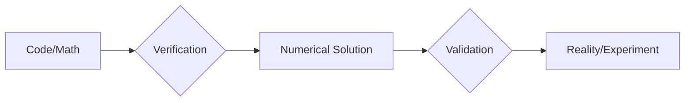
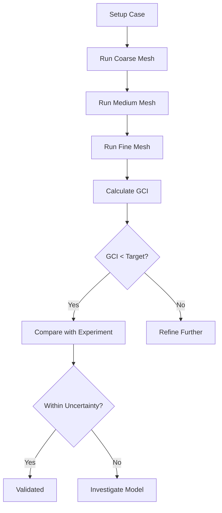

# Validation and Verification Overview

ภาพรวมการทวนสอบและตรวจสอบความถูกต้อง

> **ทำไม V&V สำคัญที่สุด?**
> - **CFD ที่ไม่ validated = ไม่น่าเชื่อถือ**
> - เข้าใจ verification vs validation = รู้ว่าตรวจสอบอะไร
> - GCI (Grid Convergence Index) = benchmark สำหรับ mesh independence

---

## Core Distinction

> **💡 หัวใจของ V&V:**
>
> - **Verification:** "Are we solving the equations right?" → Numerical errors
> - **Validation:** "Are we solving the right equations?" → Physics vs reality

| Term | Question | Focus |
|------|----------|-------|
| **Verification** | Solving equations right? | Numerical errors |
| **Validation** | Solving right equations? | Physics vs reality |



---

## 1. Error Types

### Numerical Errors (Verification)

$$\varepsilon_{num} = |f_{numerical} - f_{exact}|$$

| Type | Source | Control Method |
|------|--------|----------------|
| Discretization | FVM approximation | Mesh refinement |
| Iteration | Incomplete convergence | Tighter tolerances |
| Round-off | Floating point | Higher precision |

### Modeling Errors (Validation)

$$\varepsilon_{model} = |f_{CFD} - f_{experiment}|$$

---

## 2. Grid Convergence Index (GCI)

### Three-Grid Method

$$p = \frac{\ln|\varepsilon_{32}/\varepsilon_{21}|}{\ln(r)}$$

$$GCI_{fine} = \frac{1.25|\varepsilon_{21}|}{r^p - 1}$$

**Where:**
- $\varepsilon_{21} = f_2 - f_1$ (medium - fine)
- $\varepsilon_{32} = f_3 - f_2$ (coarse - medium)
- $r$ = refinement ratio (typically 2)

### Acceptance Criteria

| Application | GCI Target |
|-------------|------------|
| Engineering | < 5% |
| Research | < 2% |
| High-accuracy | < 1% |

---

## 3. Error Norms

$$L_1 = \frac{1}{V}\int|\phi_{CFD} - \phi_{ref}|dV$$

$$L_2 = \sqrt{\frac{1}{V}\int(\phi_{CFD} - \phi_{ref})^2 dV}$$

$$L_\infty = \max|\phi_{CFD} - \phi_{ref}|$$

---

## 4. Wall Resolution ($y^+$)

$$y^+ = \frac{y u_\tau}{\nu} = \frac{y \sqrt{\tau_w/\rho}}{\nu}$$

| Model | Target $y^+$ |
|-------|-------------|
| Low-Re k-ω SST | < 1 |
| Standard k-ε | 30-300 |
| Spalart-Allmaras | < 1 |

```bash
postProcess -func yPlus
```

---

## 5. OpenFOAM Tools

| Tool | Purpose |
|------|---------|
| `postProcess -func residuals` | Monitor convergence |
| `postProcess -func yPlus` | Wall resolution check |
| `postProcess -func wallShearStress` | Wall shear stress |
| `sample` | Extract line/surface data |

### Residual Control

```cpp
// system/fvSolution
residualControl
{
    p   1e-6;
    U   1e-6;
    k   1e-6;
}
```

---

## 6. Benchmark Cases

| Case | Physics | Path |
|------|---------|------|
| Lid-driven cavity | Recirculating flow | `incompressible/icoFoam/cavity` |
| Channel flow | Wall turbulence | `incompressible/pisoFoam/channel395` |
| Backward-facing step | Separation | `incompressible/pimpleFoam/backwardFacingStep` |

---

## 7. Workflow



---

## Concept Check

<details>
<summary><b>1. Verification กับ Validation ต่างกันอย่างไร?</b></summary>

- **Verification**: "Are we solving the equations right?" — ตรวจสอบว่าโค้ด/คณิตศาสตร์ถูกต้อง
- **Validation**: "Are we solving the right equations?" — ตรวจสอบว่า model ตรงกับความจริง
</details>

<details>
<summary><b>2. ทำไม $L_2$ norm นิยมกว่า $L_1$?</b></summary>

$L_2$ ให้น้ำหนักกับ errors ขนาดใหญ่มากกว่า ทำให้เห็นจุดที่มีปัญหาชัดเจนกว่า และมีความสัมพันธ์กับ energy norm ในหลายระบบ
</details>

<details>
<summary><b>3. GCI บอกอะไร?</b></summary>

GCI (Grid Convergence Index) คือ **uncertainty estimate** ของผลลัพธ์เนื่องจากความละเอียดของ mesh — บอกว่าห่างจาก grid-independent solution เท่าไหร่
</details>

---

## Related Documents

- **บทถัดไป:** [01_V_and_V_Principles.md](01_V_and_V_Principles.md)
- **Mesh Independence:** [02_Mesh_Independence.md](02_Mesh_Independence.md)
- **Experimental Validation:** [03_Experimental_Validation.md](03_Experimental_Validation.md)