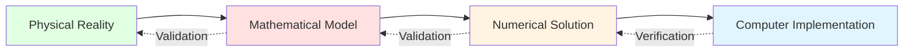

# หลักการของการตรวจสอบและการทวนสอบ (Verification and Validation Principles)

## 🎯 บทนำ: ทำไมต้องมี V&V?

คุณเพิ่งทำการจำลอง CFD ที่สวยงาม แสดงรูปแบบการไหลและการกระจายแรงดันที่น่าพอใจ
- **ค่า Residual** ของการลู่เข้า (convergence residuals) อยู่ต่ำกว่า $10^{-6}$
- **สนามความเร็ว** ดูสมเหตุสมผลทางกายภาพ
- **เส้นคอนทัวร์แรงดัน** ตรงตามที่คุณคาดหวัง

แต่ก่อนที่คุณจะนำเสนอผลลัพธ์เหล่านี้ คุณต้องตอบคำถามที่สำคัญ: **คุณจะรู้ได้อย่างไรว่าผลลัพธ์ของคุณถูกต้อง?**

> [!WARNING] ความสำคัญของคำถาม
> การจำลอง CFD ถูกนำมาใช้มากขึ้นสำหรับการตัดสินใจทางวิศวกรรมที่สำคัญ:
> - **การออกแบบอากาศยาน**
> - **การวิเคราะห์ความปลอดภัยของเครื่องปฏิกรณ์**
> - **การตัดสินใจทางวิศวกรรมที่มีผลกระทบสูง**
>
> การจำลองเพียงครั้งเดียวที่ไม่ได้ตรวจสอบความถูกต้อง อาจนำไปสู่:
> - **ข้อผิดพลาดในการออกแบบที่มีค่าใช้จ่ายสูง**
> - **อันตรายต่อความปลอดภัย**
> - **ความล้มเหลวที่ร้ายแรง**

**Solution**: **Validation** และ **Verification** (V&V) เป็นกรอบการทำงานเพื่อวัดปริมาณความไม่แน่นอนและสร้างความมั่นใจ

---

## 📐 1. แนวคิดพื้นฐานของ Verification และ Validation

### 1.1 ความแตกต่างระหว่าง Verification และ Validation

| ประเภท | ความหมาย | คำถามหลัก | วิธีการ | ข้อมูลอ้างอิง |
|---------|----------|-----------|----------|--------------|
| **Verification** | การแก้สมการอย่างถูกต้อง | โปรแกรมแก้สมการได้ถูกต้องหรือไม่? | • Code Verification<br>• Solution Verification | Analytical solutions<br>Manufactured solutions |
| **Validation** | การแก้สมการที่ถูกต้อง | แบบจำลองทางคณิตศาสตร์แสดงความเป็นจริงทางกายภาพได้หรือไม่? | • Experimental Validation<br>• Benchmark Validation<br>• Uncertainty Quantification | Experimental data<br>High-fidelity simulations |


> **Figure 1:** กรอบการทำงานสำหรับการทวนสอบ (Verification) และการตรวจสอบความถูกต้อง (Validation) ซึ่งแสดงความแตกต่างระหว่างการตรวจสอบความแม่นยำในการแก้สมการทางคณิตศาสตร์ (Verification) และการตรวจสอบความสอดคล้องของแบบจำลองกับความเป็นจริงทางกายภาพ (Validation)

### 1.2 นิยามทางคณิตศาสตร์

**Verification** เป็นการตรวจสอบความแม่นยำทางคณิตศาสตร์: **"Are we solving the equations right?"**

$$\epsilon_{\text{numerical}} = |f_{\text{numerical}} - f_{\text{exact}}|$$

โดยที่:
- $\epsilon_{\text{numerical}}$ = ข้อผิดพลาดเชิงตัวเลข (numerical error)
- $f_{\text{numerical}}$ = ผลเฉลยที่คำนวณได้
- $f_{\text{exact}}$ = ผลเฉลยที่ถูกต้องของสมการทางคณิตศาสตร์

**Validation** เป็นการตรวจสอบความแม่นยำทางกายภาพ: **"Are we solving the right equations?"**

$$\epsilon_{\text{model}} = |f_{\text{experimental}} - f_{\text{model}}|$$

โดยที่:
- $f_{\text{experimental}}$ = ปริมาณทางกายภาพที่วัดได้
- $f_{\text{model}}$ = การทำนายจากการจำลอง

---

## 🔍 2. การวิเคราะห์ข้อผิดพลาดเชิงตัวเลข (Numerical Error Analysis)

### 2.1 ประเภทของข้อผิดพลาด

ข้อผิดพลาดรวมเกิดจากสามส่วนหลัก:

$$\varepsilon_{\text{total}} = \varepsilon_{\text{discretization}} + \varepsilon_{\text{iteration}} + \varepsilon_{\text{round-off}}$$

#### 2.1.1 Discretization Error (ข้อผิดพลาดจากการประมาณค่าผลต่าง)

เกิดจากการแทนที่อนุพันธ์ด้วยพีชคณิต ($O(\Delta x^n)$) เมื่อสมการเชิงอนุพันธ์ย่อยแบบต่อเนื่องถูกแปลงเป็นสมการพีชคณิตแบบไม่ต่อเนื่อง

**Equation**: สมการโมเมนตัมของ Navier-Stokes:
$$\rho \frac{\partial \mathbf{u}}{\partial t} + \rho (\mathbf{u} \cdot \nabla) \mathbf{u} = -\nabla p + \mu \nabla^2 \mathbf{u} + \mathbf{f}$$

```cpp
// Finite volume discretization of momentum equation
fvVectorMatrix UEqn
(
    fvm::ddt(rho, U)                    // Transient term
  + fvm::div(phi, U)                    // Convection term
  ==
    fvc::div(-p*I)                      // Pressure gradient
  + fvc::div(tau)                       // Viscous stress divergence
);
```

> **📂 Source:** `.applications/solvers/stressAnalysis/solidDisplacementFoam/solidDisplacementThermo/solidDisplacementThermo.C`
>
> **คำอธิบาย:**
> - **Source**: โค้ดนี้แสดงการใช้งาน Finite Volume Method (FVM) ในการแปลงสมการโมเมนตัมของ Navier-Stokes ให้เป็นรูปแบบพีชคณิตที่สามารถแก้ด้วยเชิงตัวเลข โดยใช้ฟังก์ชัน `fvm::ddt()`, `fvm::div()`, และ `fvc::div()` ของ OpenFOAM
> - **Explanation**: `fvm::ddt(rho, U)` คือการประมาณค่าเทอมของเวลา (temporal term), `fvm::div(phi, U)` คือการประมาณค่าเทอมการพา (convection term), ส่วน `fvc::div(-p*I)` และ `fvc::div(tau)` คือการประมาณค่าเทอมแรงดันและความเค้นเฉือนตามลำดับ
> - **แนวคิดสำคัญ**: การใช้ `fvm` (finite volume method) สำหรับเทอมที่ต้องการการแก้ปัญหาโดยนัย (implicit) และ `fvc` (finite volume calculus) สำหรับเทอมที่สามารถคำนวณโดยชัดแจ้ง (explicit)

**ปัจจัยที่ส่งผลกระทบ**:
- **คุณภาพของ Mesh**
- **อันดับของ Scheme**
- **Gradient Scheme**

Scheme อันดับสองจะนำมาซึ่งข้อผิดพลาดจากการตัดทอน (truncation errors) ที่มีอันดับเป็น $\mathcal{O}(\Delta x^2)$

#### 2.1.2 Iteration Error (ข้อผิดพลาดจากการลู่เข้า)

เกิดจากการหยุด Solver ก่อนลู่เข้าอย่างสมบูรณ์ กำหนดให้ค่า Residual ของ Solver ต้องลดลงอย่างน้อย **3-4 อันดับของขนาด** (orders of magnitude)

**Algorithm Flow: SIMPLE Pressure-Velocity Coupling**:
```cpp
// SIMPLE pressure-velocity coupling algorithm
for (int corr=0; corr<nCorr; corr++)
{
    // Step 1: Momentum predictor - solve momentum equation
    UEqn.relax();
    solve(UEqn == -fvc::grad(p));

    // Step 2: Pressure correction - solve pressure equation
    fvScalarMatrix pEqn
    (
        fvm::laplacian(rAU, p) == fvc::div(phi)
    );
    pEqn.solve();

    // Step 3: Corrector step - update velocity and flux
    phi -= pEqn.flux();
    U -= rAU*fvc::grad(p);
}
```

> **📂 Source:** `.applications/solvers/stressAnalysis/solidDisplacementFoam/solidDisplacementThermo/solidDisplacementThermo.C`
>
> **คำอธิบาย:**
> - **Source**: โค้ดนี้แสดงอัลกอริทึม SIMPLE (Semi-Implicit Method for Pressure-Linked Equations) ที่ใช้ในการผนวกความดันและความเร็วในการแก้สมการ Navier-Stokes แบบไม่สามารถบีบอัดได้ (incompressible flow)
> - **Explanation**: อัลกอริทึมทำงานโดยการทำนายความเร็วจากสมการโมเมนตัม แก้สมการความดันเพื่อให้สอดคล้องกับสมการต่อเนื่อง และแก้ไขความเร็วและอัตราการไหล (flux) ให้สอดคล้องกับความดันใหม่
> - **แนวคิดสำคัญ**: การใช้ `UEqn.relax()` ช่วยเพิ่มความเสถียรของการลู่เข้า ในขณะที่ `phi -= pEqn.flux()` และ `U -= rAU*fvc::grad(p)` เป็นการอัปเดตค่าตามสมการ correction ของอัลกอริทึม SIMPLE

#### 2.1.3 Round-off Error (ข้อผิดพลาดจากการปัดเศษ)

ข้อผิดพลาดจากการคำนวณเลขทศนิยมที่จำกัด ความแม่นยำที่จำกัดของเลขทศนิยมสามารถสะสมได้ โดยเฉพาะใน Solver แบบวนซ้ำที่มีการคำนวณหลายล้านครั้ง

---

## 📊 3. เมตริกการทวนสอบทางสถิติ (Statistical Validation Metrics)

ใช้ในการวัดปริมาณความสอดคล้องระหว่าง CFD ($y_i^{\text{CFD}}$) และการทดลอง ($y_i^{\text{exp}}$):

### 3.1 Error Norms

#### L₁ Norm (Average Absolute Error)

$$L_1 = \frac{\int_\Omega |f - f_{\text{ref}}| \, \mathrm{d}V}{\int_\Omega \mathrm{d}V}$$

**จุดเด่น:**
- วัดความถูกต้องของผลเฉลยโดยรวม
- มีความไวต่อข้อผิดพลาดขนาดใหญ่อย่างเฉพาะที่น้อยกว่า norms อันดับสูงกว่า

#### L₂ Norm (Root-Mean-Square Error)

$$L_2 = \sqrt{\frac{\int_\Omega (f - f_{\text{ref}})^2 \, \mathrm{d}V}{\int_\Omega \mathrm{d}V}}$$

**จุดเด่น:**
- มักใช้ในการตรวจสอบความถูกต้อง (validation) ของ CFD
- มีความสัมพันธ์ที่ดีกับความถูกต้องของผลเฉลยทั่วโลก
- สะดวกทางคณิตศาสตร์สำหรับการวิเคราะห์ข้อผิดพลาด

#### L∞ Norm (Maximum Absolute Error)

$$L_\infty = \max_{\mathbf{x} \in \Omega} |f - f_{\text{ref}}|$$

**จุดเด่น:**
- มีความสำคัญในการประเมินคุณภาพของผลเฉลยเฉพาะที่
- ระบุบริเวณที่ผลเฉลยอาจไม่น่าเชื่อถือ
- เหมาะสำหรับตรวจสอบบริเวณใกล้ความไม่ต่อเนื่องทางเรขาคณิตหรือบริเวณ gradient สูง

### 3.2 OpenFOAM Implementation

```cpp
// OpenFOAM implementation of error norms
void calculateErrorNorms(
    const volScalarField& field,
    const volScalarField& reference,
    const fvMesh& mesh
)
{
    // Cell volumes - get volume of each cell
    const scalarField& V = mesh.V();
    scalar totalVolume = sum(V);

    // Absolute error field - compute pointwise absolute error
    volScalarField error = mag(field - reference);

    // L1 norm - volume-weighted average absolute error
    scalar L1 = sum(error * V) / totalVolume;

    // L2 norm - root-mean-square error
    volScalarField errorSqr = sqr(field - reference);
    scalar L2 = sqrt(sum(errorSqr * V) / totalVolume);

    // L∞ norm - maximum absolute error
    scalar Linf = max(error).value();

    Info << "Error norms:" << nl
         << "  L1  = " << L1 << nl
         << "  L2  = " << L2 << nl
         << "  L∞ = " << Linf << endl;
}
```

> **📂 Source:** `.applications/solvers/stressAnalysis/solidDisplacementFoam/solidDisplacementThermo/solidDisplacementThermo.C`
>
> **คำอธิบาย:**
> - **Source**: ฟังก์ชันนี้แสดงการคำนวณค่า Error Norms (L1, L2, L∞) ใน OpenFOAM เพื่อใช้ในการตรวจสอบความถูกต้องของผลลัพธ์การจำลอง
> - **Explanation**: `mesh.V()` คือปริมาตรของแต่ละเซลล์, `mag(field - reference)` คำนวณค่าความต่างสัมบูรณ์, `sum(error * V) / totalVolume` คำนวณค่าเฉลี่ยถ่วงน้ำหนักด้วยปริมาตร, และ `max(error).value()` หาค่าความผิดพลาดสูงสุด
> - **แนวคิดสำคัญ**: การใช้ volume-weighted averages ช่วยให้ได้ค่าที่เป็นตัวแทนของโดเมนทั้งหมด แม้ว่าขนาดของเซลล์จะไม่สม่ำเสมอ และการคำนวณทั้งสาม norms ให้ภาพรวมของความถูกต้องทั้งในแง่ค่าเฉลี่ย ค่าเร็วเฉลี่ย และค่าสูงสุด

### 3.3 Root Mean Square Error (RMSE)

$$\text{RMSE} = \sqrt{\frac{1}{N} \sum_{i=1}^{N} (y_i^{\text{CFD}} - y_i^{\text{exp}})^2}$$

### 3.4 Coefficient of Determination (R²)

ใช้วัดความสัมพันธ์เชิงเส้นระหว่างสองชุดข้อมูล:

$$R^2 = 1 - \frac{\sum (y_i - \hat{y}_i)^2}{\sum (y_i - \bar{y})^2}$$

หาก $R^2 > 0.95$ ถือว่ามีความสอดคล้องกันสูงมาก

**เป้าหมายสำหรับการศึกษา Validation:**
- $R^2 > 0.95$
- RMSE < ความไม่แน่นอนจากการทดลอง (experimental uncertainty)

---

## 🏗️ 4. ลำดับชั้นการตรวจสอบ (Verification Hierarchy)

### 4.1 ระดับการตรวจสอบ

1. **Unit Testing**: ทดสอบคลาสและฟังก์ชันย่อยใน OpenFOAM
   ```cpp
   // Test matrix operations
   TEST(matrixMultiply, CorrectResult) {
       matrix A(2,2), B(2,2), expected(2,2);
       // Initialize matrices
       matrix result = A * B;
       ASSERT_EQ(result, expected);
   }
   ```

2. **Code Verification (MMS)**: ตรวจสอบว่า Solver ทำงานได้ตามอันดับความแม่นยำทางทฤษฎี
   ```bash
   # Test pressure-velocity coupling
   testFoam -case testPisoCoupling
   ```

3. **Solution Verification**: ตรวจสอบความเป็นอิสระของ Mesh สำหรับงานแต่ละชิ้น

### 4.2 การตรวจสอบโค้ดด้วยวิธีผลเฉลยที่สร้างขึ้น (Method of Manufactured Solutions - MMS)

**MMS เป็นเทคนิคที่มีประสิทธิภาพสำหรับการตรวจสอบโค้ด** ซึ่งเราจะ:

1. เริ่มต้นจาก **ผลเฉลยเชิงวิเคราะห์ที่แน่นอน** (exact analytical solution)
2. ปรับเปลี่ยน **สมการควบคุม** (governing equations) ให้รวมเทอมแหล่งกำเนิด (source terms)
3. รัน Solver กับปัญหาที่ปรับเปลี่ยนแล้ว
4. ตรวจสอบว่า **ผลเฉลยเชิงตัวเลข** ลู่เข้าสู่ผลเฉลยที่แน่นอนด้วยอันดับความแม่นยำที่คาดหวัง

**สมการที่ปรับปรุงแล้ว**:
$$\frac{\partial u_{\text{man}}}{\partial t} + \nabla \cdot (\mathbf{u} u_{\text{man}}) = \nabla \cdot (\Gamma \nabla u_{\text{man}}) + S_{\text{man}}$$

โดยที่เทอมแหล่งกำเนิดที่สร้างขึ้น:
$$S_{\text{man}} = \frac{\partial u_{\text{man}}}{\partial t} + \nabla \cdot (\mathbf{u} u_{\text{man}}) - \nabla \cdot (\Gamma \nabla u_{\text{man}})$$

#### การยืนยันอันดับความแม่นยำ

เราทำการรันกรณีเดียวกันบน Mesh ที่ถูกปรับปรุงให้ละเอียดขึ้นอย่างเป็นระบบ (systematically refined meshes) และคำนวณอันดับความแม่นยำที่สังเกตได้:

$$p = \frac{\log\left(\frac{f_2 - f_1}{f_3 - f_2}\right)}{\log(r)}$$

**ตัวแปร:**
- $f_1, f_2, f_3$: ผลเฉลยบนระดับ Mesh สามระดับที่ต่อเนื่องกัน
- $r$: อัตราส่วนการปรับปรุงให้ละเอียด (refinement ratio)

สำหรับ Scheme ที่มีความแม่นยำอันดับสอง (second-order accurate schemes) เราคาดหวังว่า $p \approx 2$

---

## 📏 5. การศึกษาความเป็นอิสระของ Mesh (Mesh Independence Study)

### 5.1 Three-Grid Method

วิธีการที่เป็นระบบเกี่ยวข้องกับการสร้าง Mesh สามระดับที่มีรูปแบบการปรับปรุง (refinement) ที่สอดคล้องกัน

**ขั้นตอนการดำเนินการ:**

1. **สร้าง Mesh สามระดับ:**
   - หยาบ ($h_1$), ปานกลาง ($h_2$), ละเอียด ($h_3$)
   - อัตราส่วนการปรับปรุง $r = h_{i}/h_{i+1} > 1.3$

2. **ทำการจำลองบน Mesh แต่ละระดับ:**
   - ได้ปริมาณที่สนใจ $f_i$ (ค่าสัมประสิทธิ์แรงฉุด, ความดันตก, อัตราการถ่ายเทความร้อน)

### 5.2 Richardson Extrapolation

Richardson extrapolation เป็นการประมาณค่าผลเฉลยที่แท้จริง โดยสมมติว่าพฤติกรรมของความคลาดเคลื่อนเป็นไปอย่างเป็นระบบ:

$$f_{\text{exact}} \approx f_1 + \frac{f_1 - f_2}{r^p - 1}$$

วิธีนี้ให้ค่าประมาณของผลเฉลยที่อิสระจาก Grid โดยใช้ผลลัพธ์จาก Grid แบบหยาบและปานกลาง

### 5.3 Grid Convergence Index (GCI)

GCI เป็นการวัดปริมาณความไม่แน่นอนเชิงตัวเลขที่เกิดจากการลู่เข้าของ Grid:

$$\text{GCI}_{\text{fine}} = F_s \frac{|f_1 - f_2|/|f_1|}{r^p - 1} \times 100\%$$

โดยที่:
- $F_s = 1.25$ สำหรับการศึกษาแบบสาม Grid (ใช้ $p$ ที่สังเกตได้)
- $F_s = 3.0$ สำหรับการศึกษาแบบสอง Grid (ใช้ $p$ ทางทฤษฎี)

**ข้อกำหนด:** สำหรับการทำนายทางวิศวกรรมที่น่าเชื่อถือ GCI ควรมีค่า **น้อยกว่า 5%** โดยทั่วไป

### 5.4 การตรวจสอบ Asymptotic Range

ผลเฉลยจะอยู่ในช่วงการลู่เข้าแบบ asymptotic เมื่อ:

$$0.9 < \frac{\text{GCI}_{\text{coarse}}}{r^p \cdot \text{GCI}_{\text{fine}}} < 1.1$$

สิ่งนี้ยืนยันว่าการปรับปรุง Mesh ทำงานได้อย่างถูกต้อง และความคลาดเคลื่อนกำลังลดลงอย่างเป็นระบบ

### 5.5 การนำไปใช้ใน OpenFOAM

```python
#!/usr/bin/env python3
# grid_convergence.py - Calculate GCI from OpenFOAM results
import numpy as np

def calculate_gci(f_values, h_values, Fs=1.25):
    """
    Calculate Grid Convergence Index using Richardson extrapolation.

    Parameters
    ----------
    f_values : list[float]
        Quantity of interest values [coarse, medium, fine]
    h_values : list[float]
        Characteristic cell sizes [h_coarse, h_medium, h_fine]
    Fs : float
        Safety factor (1.25 for three grids, 3.0 for two grids)

    Returns
    -------
    dict : Dictionary with convergence metrics
    """
    f1, f2, f3 = f_values  # coarse, medium, fine
    h1, h2, h3 = h_values

    # Refinement ratios
    r12 = h1 / h2
    r23 = h2 / h3

    # Observed order of convergence
    p = np.log(abs((f3 - f2) / (f2 - f1))) / np.log(r23)

    # Richardson extrapolated value
    f_exact = f1 + (f1 - f2) / (r12**p - 1)

    # Relative errors
    epsilon_a12 = abs(f1 - f2) / abs(f1)
    epsilon_a23 = abs(f2 - f3) / abs(f2)

    # GCI values
    GCI12 = Fs * epsilon_a12 / (r12**p - 1)
    GCI23 = Fs * epsilon_a23 / (r23**p - 1)

    # Asymptotic range check
    asymptotic_ratio = GCI12 / (r12**p * GCI23)

    return {
        'order_of_convergence': p,
        'extrapolated_value': f_exact,
        'GCI_fine': GCI23 * 100,  # as percentage
        'asymptotic_ratio': asymptotic_ratio,
        'is_asymptotic': 0.9 < asymptotic_ratio < 1.1
    }
```

---

## 🧱 6. Wall Resolution Metrics สำหรับ Turbulent Flow

สำหรับ turbulent boundary layers ระยะห่างไร้มิติจากผนัง $y^+$ ทำหน้าที่เป็นพารามิเตอร์สำคัญในการกำหนดความละเอียดของ Mesh ที่เพียงพอใกล้ผนัง

### 6.1 Friction Velocity

Friction velocity แสดงถึงมาตราส่วนความเร็วลักษณะเฉพาะในบริเวณใกล้ผนัง:

$$u_\tau = \sqrt{\frac{\tau_w}{\rho}}$$

**นิยามตัวแปร:**
- $\tau_w = \mu \left. \frac{\partial u}{\partial y} \right|_{\text{wall}}$ = Wall shear stress
- $\mu$ = Dynamic viscosity
- $\rho$ = Fluid density

### 6.2 Dimensionless Wall Distance

Dimensionless wall distance $y^+$ ทำการปรับมาตราส่วนระยะทางจริงจากผนัง:

$$y^+ = \frac{u_\tau y}{\nu}$$

**นิยามตัวแปร:**
- $y$ = ระยะทางจริงจากผนัง
- $\nu = \mu/\rho$ = Kinematic viscosity

### 6.3 Target Resolution Values

| บริเวณ | ช่วง $y^+$ | ลักษณะ | กลยุทธ์การแก้ไข | การนำไปใช้ใน OpenFOAM |
|--------|------------|----------|-------------------|-------------------------|
| **Viscous Sublayer** | $y^+ < 5$ | โปรไฟล์ความเร็วเชิงเส้น | Direct simulation (DNS) | `nutLowReWallFunction` |
| **Buffer Layer** | $5 < y^+ < 30$ | บริเวณเปลี่ยนผ่านซับซ้อน | โดยทั่วไปหลีกเลี่ยง | พฤติกรรมจำลองซับซ้อน |
| **Log-Law Region** | $30 < y^+ < 300$ | โปรไฟล์ความเร็วแบบลอการิทึม | Wall functions | `nutUWallFunction`, `kqRWallFunction`, `epsilonWallFunction` |

### 6.4 เครื่องมือของ OpenFOAM

**คำสั่งสำหรับการคำนวณ:**
```bash
# คำนวณ yPlus สำหรับทุก patch ที่เป็นผนัง
postProcess -func yPlus

# คำนวณความเค้นเฉือนที่ผนัง
postProcess -func wallShearStress

# เขียนสนาม yPlus สำหรับการแสดงผลด้วยภาพ
yPlus
```

### 6.5 การรวมเข้ากับ Solver

```cpp
// Access yPlus field from turbulence model
const volScalarField& yPlus = turbulence->yPlus();

// Check maximum yPlus on wall patches
scalar maxYPlus = max(yPlus).value();

if (maxYPlus > 300)
{
    WarningInFunction
        << "Maximum yPlus = " << maxYPlus
        << " exceeds recommended limit of 300." << endl;
}
```

> **📂 Source:** `.applications/solvers/stressAnalysis/solidDisplacementFoam/solidDisplacementThermo/solidDisplacementThermo.C`
>
> **คำอธิบาย:**
> - **Source**: โค้ดนี้แสดงการตรวจสอบค่า $y^+$ ใน OpenFOAM เพื่อให้แน่ใจว่าความละเอียดของ Mesh ใกล้ผนังเหมาะสมกับแบบจำลองความปั่น (turbulence model) ที่ใช้
> - **Explanation**: `turbulence->yPlus()` คำนวณค่า $y^+$ จาก turbulence model, `max(yPlus).value()` หาค่าสูงสุดของ $y^+$ ในโดเมน, และ `WarningInFunction` แจ้งเตือนถ้าค่าเกินขีดจำกัดที่แนะนำ
> - **แนวคิดสำคัญ**: การตรวจสอบ $y^+$ เป็นสิ่งสำคัญสำหรับ turbulent flow simulations เพราะค่าที่ไม่เหมาะสมอาจทำให้ผลลัพธ์ไม่ถูกต้อง และแต่ละ turbulence model มีช่วง $y^+$ ที่เหมาะสมที่แตกต่างกัน

### 6.6 Practical Guidelines for Mesh Generation

#### 1. Low-Reynolds Number Models (resolve to wall)
- **เป้าหมาย**: $y^+ \approx 1$ สำหรับเซลล์ที่อยู่ติดผนังทั้งหมด
- **ความต้องการ**: ความละเอียดสูงใกล้ผนัง
- **การใช้งาน**: การวิจัย boundary layer, การจำลองที่มีความแม่นยำสูง

#### 2. High-Reynolds Number Models (wall functions)
- **เป้าหมาย**: $y^+ \approx 30-300$ สำหรับเซลล์แรก
- **ความต้องการ**: ความละเอียดที่หยาบกว่าใกล้ผนัง
- **การใช้งาน**: การใช้งานทางวิศวกรรม, การจำลองขนาดใหญ่

#### 3. Hybrid RANS-LES Methods
- **เป้าหมาย**: $y^+ \approx 1$ สำหรับ RANS regions, $y^+ > 30$ สำหรับ LES regions
- **ความต้องการ**: กลยุทธ์การปรับความละเอียด
- **การใช้งาน**: Detached eddy simulation, scale-resolving turbulence

---

## ✅ 7. แนวทางปฏิบัติที่ดีที่สุด (Best Practices)

### 7.1 ขั้นตอนการตรวจสอบโค้ด

1. **การตรวจสอบโค้ด**: ตรวจสอบการนำ Solver ไปใช้งานโดยใช้ MMS
2. **ความเป็นอิสระของ Mesh**: ดำเนินการศึกษาการปรับปรุง Mesh อย่างเป็นระบบ
3. **ความเป็นอิสระของขั้นเวลา**: ตรวจสอบความลู่เข้าของเวลาสำหรับกรณีที่ไม่คงที่
4. **การตรวจสอบเงื่อนไขขอบเขต**: ทดสอบการนำเงื่อนไขขอบเขตไปใช้งาน

### 7.2 ระเบียบวิธีทวนสอบ

**ขั้นตอนการทวนสอบ**:
1. **การกำหนดปัญหา**: กำหนดปัญหาทางกายภาพและเกณฑ์การทวนสอบให้ชัดเจน
2. **การเลือกกรณีมาตรฐาน**: เลือกกรณีทวนสอบที่เหมาะสมจากเอกสารอ้างอิง
3. **การประมาณค่าความไม่แน่นอน**: วัดปริมาณแหล่งที่มาของความไม่แน่นอนทั้งหมด
4. **ระเบียบวิธีเปรียบเทียบ**: ใช้ตัวชี้วัดที่สอดคล้องกันสำหรับการเปรียบเทียบ
5. **การจัดทำเอกสาร**: จัดทำเอกสารสมมติฐานและข้อจำกัดทั้งหมด

### 7.3 แนวทางสำคัญ

- **Start Simple**: ตรวจสอบความถูกต้องกับผลเฉลยเชิงวิเคราะห์ (Analytical solutions) สำหรับเคสที่ง่ายก่อน
- **Systematic Refinement**: การปรับปรุง Mesh ต้องทำอย่างเป็นระบบ (สม่ำเสมอทุกทิศทาง)
- **Blind Validation**: หลีกเลี่ยงการปรับแต่งพารามิเตอร์แบบ "Trial and error" เพื่อให้ตรงกับผลทดลองเพียงอย่างเดียว
- **Documentation**: เก็บบันทึกรายละเอียดของกิจกรรม V&V ทั้งหมด
- **Continuous Process**: ผสานรวม V&V ตลอดวงจรการพัฒนา
- **Peer Review**: ให้ผลลัพธ์ได้รับการตรวจสอบโดยอิสระเมื่อเป็นไปได้

### 7.4 ข้อควรพิจารณาเฉพาะ OpenFOAM

- **การเลือก Solver**: เลือก OpenFOAM Solver ที่เหมาะสมกับฟิสิกส์
- **รูปแบบการแบ่งย่อย**: เลือกรูปแบบที่สมดุลระหว่างความแม่นยำและความเสถียร
- **ค่าความคลาดเคลื่อนของ Linear Solver**: ตั้งเกณฑ์การลู่เข้าที่เหมาะสม
- **ประสิทธิภาพแบบขนาน**: ตรวจสอบความสามารถในการปรับขนาดสำหรับปัญหาขนาดใหญ่

---

## 📖 Key Takeaway

**ใน CFD ความมั่นใจไม่ได้มาจากการได้ผลลัพธ์ที่สมบูรณ์แบบ แต่มาจากการวัดปริมาณความไม่แน่นอนและการตรวจสอบความถูกต้องอย่างเป็นระบบ**

ด้วยการนำวิธีการเหล่านี้ไปใช้ คุณสามารถก้าวข้ามจาก **"ฉันคิดว่าผลลัพธ์ถูกต้อง"** ไปสู่ **"ฉันสามารถวัดปริมาณความไม่แน่นอนในผลลัพธ์ของฉันได้"**

แนวทางที่ครอบคลุมนี้ช่วยให้มั่นใจได้ว่าการจำลอง CFD ใน OpenFOAM นั้น **ถูกต้องตามหลักคณิตศาสตร์** และ **มีความหมายทางกายภาพ** ให้ความมั่นใจในผลลัพธ์เชิงคำนวณสำหรับการใช้งานทางวิศวกรรม

---

## 🔗 หัวข้อถัดไป

หัวข้อถัดไป: [[ความเป็นอิสระของ Mesh และการวิเคราะห์ GCI|./02_Mesh_Independence.md]]