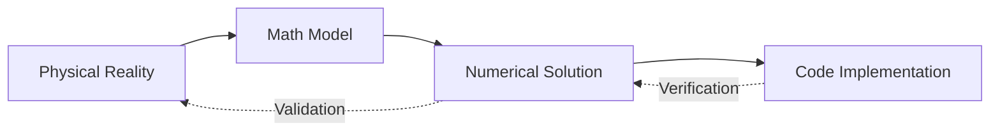

# Verification and Validation (V&V) Principles

หลักการตรวจสอบความถูกต้องของการจำลอง CFD

---

## Learning Objectives  วัตถุประสงค์การเรียนรู้

After completing this section, you should be able to:
- **Differentiate** between verification and validation in CFD simulations
- **Calculate** grid convergence metrics using Richardson extrapolation and GCI
- **Apply** appropriate error norms for solution verification
- **Determine** proper wall resolution requirements for turbulence modeling
- **Select** validation metrics for comparing CFD results with experimental data

หลังจากสิ้นสุดส่วนนี้ คุณควรจะสามารถ:
- **แยกความแตกต่าง** ระหว่าง verification และ validation ในการจำลอง CFD
- **คำนวณ** ดัชนีความเป็นเลิศของ grid โดยใช้ Richardson extrapolation และ GCI
- **ใช้** error norm ที่เหมาะสมสำหรับการตรวจสอบคำตอบ
- **กำหนด** ความละเอียดของผนังที่เหมาะสมสำหรับ turbulence modeling
- **เลือก** validation metrics สำหรับเปรียบเทียบผล CFD กับข้อมูลทดลอง

---

## Overview  ภาพรวม

### What is V&V?  V&V คืออะไร?

Verification and Validation (V&V) are systematic processes for establishing **confidence** in CFD simulations. They address two fundamental questions:

| Term | Question | Method |
|------|----------|--------|
| **Verification** | "Are we solving the equations right?" | Code testing, MMS, grid studies |
| **Validation** | "Are we solving the right equations?" | Comparison with experiments |

การตรวจสอบความถูกต้อง (Verification และ Validation) เป็นกระบวนการเป็นระบบเพื่อสร้าง **ความมั่นใจ** ในการจำลอง CFD โดยตอบคำถามพื้นฐานสองข้อ:

| คำศัพท์ | คำถาม | วิธีการ |
|------|----------|--------|
| **Verification** | "เราแก้สมการถูกต้องไหม?" | ทดสอบโค้ด, MMS, ศึกษา grid |
| **Validation** | "เราแก้สมการที่ถูกต้องไหม?" | เปรียบเทียบกับการทดลอง |



### Why is V&V Important?  ทำไม V&V จึงสำคัญ?

Without proper V&V, CFD results may be **meaningless** or **misleading**. V&V provides:

- **Quantified uncertainty**: Know how accurate your results are
- **Reproducible methods**: Others can trust and reproduce your work
- **Regulatory acceptance**: Required for certification in many industries
- **Cost efficiency**: Avoid expensive redesigns from failed predictions

หากไม่มี V&V ที่เหมาะสม ผลลัพธ์ CFD อาจ **ไร้ความหมาย** หรือ **ทำให้เข้าใจผิด** V&V มอบให้:

- **ความไม่แน่นอนที่วัดได้**: รู้ว่าผลลัพธ์ของคุณแม่นยำแค่ไหน
- **วิธีการที่ทำซ้ำได้**: ผู้อื่นสามารถไว้วางใจและทำซ้ำงานของคุณได้
- **การยอมรับทางกฎระเบียบ**: จำเป็นสำหรับการรับรองในหลายอุตสาหกรรม
- **ประสิทธิภาพต้นทุน**: หลีกเลี่ยงการออกแบบใหม่ที่มีราคาแพงจากการพยากรณ์ที่ผิดพลาด

---

## 1. Error Types  ประเภทของความคลาดเคลื่อน

### Total Error Decomposition  การแยกส่วนความคลาดเคลื่อนรวม

The total error in any CFD simulation combines multiple sources:

$$\varepsilon_{total} = \varepsilon_{discretization} + \varepsilon_{iteration} + \varepsilon_{round-off}$$

ความคลาดเคลื่อนรวมในการจำลอง CFD ใดๆ ประกอบด้วยหลายแหล่งที่มา:

| Error Type ประเภทความคลาดเคลื่อน | Source แหล่งที่มา | Control การควบคุม | Typical Magnitude ขนาดโดยทั่วไป |
|------------|--------|---------|--------|
| **Discretization** | Mesh size, scheme order | Refine mesh, higher-order schemes | 1-10% |
| **Iteration** | Solver tolerance | Lower tolerance (10⁻⁶ - 10⁻⁸) | < 0.1% |
| **Round-off** | Floating-point precision | Usually negligible | < 0.001% |

### How to Control Errors  วิธีควบคุมความคลาดเคลื่อน

#### Discretization Error
- **Primary method**: Systematic mesh refinement
- **Verification tool**: Grid Convergence Index (GCI)
- **Target**: GCI < 5% for most engineering applications

#### Iteration Error
- **Check**: Monitor residual convergence
- **Verify**: Run with stricter tolerance (e.g., 10⁻⁸ vs 10⁻⁶)
- **Confirm**: Results should not change when tolerance is lowered

#### Round-off Error
- **Usually negligible** in double-precision CFD
- **Can matter** for: Very long transient simulations, Poorly-conditioned matrices

---

## 2. Mesh Independence Study  การศึกษาความไม่ขึ้นกับ Mesh

### Three-Grid Method  วิธีสาม Grid

The systematic approach for demonstrating mesh independence:

1. **Create three meshes**: coarse ($h_1$), medium ($h_2$), fine ($h_3$)
2. **Refinement ratio**: $r = h_i/h_{i+1} > 1.3$ (ideally $r = 2$)
3. **Run identical settings** on each mesh
4. **Monitor key output**: $f$ (e.g., drag coefficient, Nusselt number)

แนวทางเป็นระบบในการสาธิตความไม่ขึ้นกับ mesh:

1. **สร้างสาม mesh**: หยาบ ($h_1$), กลาง ($h_2$), ละเอียด ($h_3$)
2. **อัตราการละเอียด**: $r = h_i/h_{i+1} > 1.3$ (เหมาะ $r = 2$)
3. **รันการตั้งค่าเหมือนกัน** บนแต่ละ mesh
4. **เฝ้าดู output หลัก**: $f$ (เช่น สัมประสิทธิ์ drag, จำนวน Nusselt)

### Observed Order of Convergence  ลำดับการลู่เข้าที่สังเกตได้

Calculate how quickly errors decrease with refinement:

$$p = \frac{\log\left(\frac{f_3 - f_2}{f_2 - f_1}\right)}{\log(r)}$$

Where:
- $f_1, f_2, f_3$ are solutions on fine, medium, coarse meshes
- $r$ is the refinement ratio
- Expected $p$: 1st order (upwind), 2nd order (linear schemes)

คำนวณความเร็วในการลดลงของความคลาดเคลื่อนเมื่อละเอียดขึ้น:

$$p = \frac{\log\left(\frac{f_3 - f_2}{f_2 - f_1}\right)}{\log(r)}$$

โดยที่:
- $f_1, f_2, f_3$ คือคำตอบบน mesh ละเอียด, กลาง, หยาบ
- $r$ คืออัตราการละเอียด
- $p$ ที่คาดหวัง: ลำดับที่ 1 (upwind), ลำดับที่ 2 (สกุลเชิงเส้น)

### Richardson Extrapolation  การ Extrapolate ของ Richardson

Estimate the mesh-independent solution:

$$f_{exact} \approx f_1 + \frac{f_1 - f_2}{r^p - 1}$$

This provides an **asymptotic estimate** of the true solution, assuming:
- Solutions are in the asymptotic convergence range
- Refinement ratio is constant
- No other error sources dominate

ประมาณคำตอบที่ไม่ขึ้นกับ mesh:

$$f_{exact} \approx f_1 + \frac{f_1 - f_2}{r^p - 1}$$

นี่เป็น **การประมาณแบบเส้นกำกัด** ของคำตอบที่แท้จริง โดยสมมติ:
- คำตอบอยู่ในช่วงการลู่เข้าแบบเส้นกำกัด
- อัตราการละเอียดคงที่
- ไม่มีแหล่งความคลาดเคลื่อนอื่นๆ ครอบงำ

### Grid Convergence Index (GCI)

**Standard metric** for quantifying discretization uncertainty:

$$GCI_{fine} = F_s \frac{|f_1 - f_2|/|f_1|}{r^p - 1} \times 100\%$$

Where:
- $F_s = 1.25$ is a safety factor for 3-grid studies
- $F_s = 3.0$ for 2-grid studies (more conservative)
- **Target**: GCI < 5% for most engineering applications
- **Excellent**: GCI < 1% for high-accuracy work

**มาตรฐาน** สำหรับการวัดความไม่แน่นอนของ discretization:

$$GCI_{fine} = F_s \frac{|f_1 - f_2|/|f_1|}{r^p - 1} \times 100\%$$

โดยที่:
- $F_s = 1.25$ คือ factor ความปลอดภัยสำหรับการศึกษา 3-grid
- $F_s = 3.0$ สำหรับการศึกษา 2-grid (อนุรักษ์นิยมมากกว่า)
- **เป้าหมาย**: GCI < 5% สำหรับงานวิศวกรรมส่วนใหญ่
- **ยอดเยี่ยม**: GCI < 1% สำหรับงานความแม่นยำสูง

---

## 3. Error Norms  บรรทัดฐานความคลาดเคลื่อน

### Definition  คำนิยาม

When comparing CFD results with reference solutions (analytical, experimental, or highly-resolved numerical), use these norms:

| Norm | Formula สูตร | Use การใช้ |
|------|---------|-----|
| **$L_1$ Norm** | $\frac{\int |f - f_{ref}| dV}{\int dV}$ | Average error (global accuracy) |
| **$L_2$ Norm** | $\sqrt{\frac{\int (f - f_{ref})^2 dV}{\int dV}}$ | RMS error (large errors penalized) |
| **$L_\infty$ Norm** | $\max |f - f_{ref}|$ | Maximum error (local accuracy) |

เมื่อเปรียบเทียบผลลัพธ์ CFD กับคำตอบอ้างอิง (analytical, experimental, หรือ numerical ที่ละเอียดมาก) ให้ใช้บรรทัดฐานเหล่านี้:

| บรรทัดฐาน | สูตร | การใช้ |
|------|---------|-----|
| **$L_1$** | $\frac{\int |f - f_{ref}| dV}{\int dV}$ | ความคลาดเคลื่อนเฉลี่ย (ความแม่นยำทั่วโลก) |
| **$L_2$** | $\sqrt{\frac{\int (f - f_{ref})^2 dV}{\int dV}}$ | ความคลาดเคลื่อน RMS (ให้น้ำหนักความคลาดเคลื่อนใหญ่) |
| **$L_\infty$** | $\max |f - f_{ref}|$ | ความคลาดเคลื่อนสูงสุด (ความแม่นยำในเครื่อง) |

### How to Choose  วิธีเลือก

- **$L_1$**: Best for overall solution quality
- **$L_2$**: Most common (consistent with RMS definition)
- **$L_\infty$**: Critical for local features (shocks, boundary layers)

- **$L_1$**: เหมาะสุดสำหรับคุณภาพคำตอบโดยรวม
- **$L_2$**: พบบ่อยที่สุด (สอดคล้องกับนิยาม RMS)
- **$L_\infty$**: สำคัญสำหรับคุณลักษณะในเครื่อง (shocks, boundary layers)

---

## 4. Wall Resolution ($y^+$)  ความละเอียดของผนัง

### Definition and Physics  คำนิยามและฟิสิกส์

The dimensionless wall distance determines near-wall modeling requirements:

$$y^+ = \frac{u_\tau y}{\nu}, \quad u_\tau = \sqrt{\frac{\tau_w}{\rho}}$$

Where:
- $u_\tau$ is friction velocity
- $y$ is distance to the wall
- $\nu$ is kinematic viscosity
- $\tau_w$ is wall shear stress

ระยะห่างผนังไร้มิติกำหนดความต้องการของการจำลองใกล้ผนัง:

$$y^+ = \frac{u_\tau y}{\nu}, \quad u_\tau = \sqrt{\frac{\tau_w}{\rho}}$$

โดยที่:
- $u_\tau$ คือความเร็วแรงเสียดทาน
- $y$ คือระยะห่างถึงผนัง
- $\nu$ คือความหนืดจลน์
- $\tau_w$ คือความเค้นเสียดทานผนัง

### $y^+$ Requirements for Different Models  ความต้องการ $y^+$ สำหรับโมเดลต่างๆ

| $y^+$ Range | Region | Recommended Model |
|-------------|--------|-------|
| **< 1-5** | Viscous sublayer | Low-Re models ($k$-$\omega$ SST, low-Re $k$-$\varepsilon$) |
| **5-30** | Buffer layer | **Avoid** - difficult region for all models |
| **30-300** | Log-law region | Wall functions (standard $k$-$\varepsilon$, scalable wall functions) |
| **> 300** | Outer layer | **Too coarse** - results unreliable |

| ช่วง $y^+$ | บริเวณ | โมเดลที่แนะนำ |
|-------------|--------|-------|
| **< 1-5** | ชั้นไหลเวียนช้า | โมเดล Low-Re ($k$-$\omega$ SST, low-Re $k$-$\varepsilon$) |
| **5-30** | ชั้นบัฟเฟอร์ | **หลีกเลี่ยง** - บริเวณที่ยากสำหรับโมเดลทั้งหมด |
| **30-300** | บริเวณกฎ log | Wall functions (มาตรฐาน $k$-$\varepsilon$, scalable wall functions) |
| **> 300** | ชั้นนอก | **หยาบเกินไป** - ผลลัพธ์ไม่น่าเชื่อถือ |

### Checking $y^+$ in OpenFOAM  การตรวจสอบ $y^+$ ใน OpenFOAM

```bash
# After simulation completes
postProcess -func yPlus

# Or add to controlDict for automatic output
functions
{
    yPlus
    {
        type        yPlus;
        libs        ("libfieldFunctionObjects.so");
        writeFields true;
    }
}
```

**Result interpretation:**
- Check `yPlus` field in post-processing directory
- For wall-resolved: target $y^+ \approx 1$ everywhere
- For wall functions: target $30 < y^+ < 300$
- Refine near-wall mesh if outside target range

**การตีความผลลัพธ์:**
- ตรวจสอบ field `yPlus` ในไดเรกทอรี post-processing
- สำหรับ wall-resolved: เป้าหมาย $y^+ \approx 1$ ทุกที่
- สำหรับ wall functions: เป้าหมาย $30 < y^+ < 300$
- ละเอียด mesh ใกล้ผนังหากอยู่นอกช่วงเป้าหมาย

---

## 5. Validation Metrics  มาตรการ Validation

### Root Mean Square Error (RMSE)

**Most common metric** for point-by-point comparison:

$$RMSE = \sqrt{\frac{1}{N}\sum_{i=1}^N (y_i^{CFD} - y_i^{exp})^2}$$

**Target**: RMSE < experimental uncertainty (typically 5-10%)

**มาตรที่พบบ่อยที่สุด** สำหรับการเปรียบเทียบจุดต่อจุด:

$$RMSE = \sqrt{\frac{1}{N}\sum_{i=1}^N (y_i^{CFD} - y_i^{exp})^2}$$

**เป้าหมาย**: RMSE < ความไม่แน่นอนในการทดลอง (โดยทั่วไป 5-10%)

### Coefficient of Determination ($R^2$)

**Measures correlation** between CFD and experimental data:

$$R^2 = 1 - \frac{\sum(y_i^{CFD} - y_i^{exp})^2}{\sum(y_i^{exp} - \bar{y}^{exp})^2}$$

Where:
- $\bar{y}^{exp}$ is the mean of experimental data
- $R^2 = 1$ indicates perfect correlation
- $R^2 = 0$ indicates no correlation

**Target**: $R^2 > 0.95$ for good agreement

**วัดสหสัมพันธ์** ระหว่างข้อมูล CFD และการทดลอง:

$$R^2 = 1 - \frac{\sum(y_i^{CFD} - y_i^{exp})^2}{\sum(y_i^{exp} - \bar{y}^{exp})^2}$$

โดยที่:
- $\bar{y}^{exp}$ คือค่าเฉลี่ยของข้อมูลการทดลอง
- $R^2 = 1$ บ่งชี้สหสัมพันธ์สมบูรณ์
- $R^2 = 0$ บ่งชี้ไม่มีสหสัมพันธ์

**เป้าหมาย**: $R^2 > 0.95$ สำหรับความตกลงที่ดี

### Other Useful Metrics  มาตรอื่นที่มีประโยชน์

| Metric | Formula สูตร | Application การใช้ |
|---------|--------------|---------------------|
| **MAE** | $\frac{1}{N}\sum|y^{CFD} - y^{exp}|$ | Less sensitive to outliers |
| **Max Error** | $\max|y^{CFD} - y^{exp}|$ | Local accuracy check |
| **Relative Error** | $|\frac{y^{CFD} - y^{exp}}{y^{exp}}|$ | Percentage deviation |

| มาตร | สูตร | การใช้ |
|---------|--------------|---------------------|
| **MAE** | $\frac{1}{N}\sum|y^{CFD} - y^{exp}|$ | ไวต่อ outliers น้อยกว่า |
| **Max Error** | $\max|y^{CFD} - y^{exp}|$ | ตรวจสอบความแม่นยำในเครื่อง |
| **Relative Error** | $|\frac{y^{CFD} - y^{exp}}{y^{exp}}|$ | ร้อยละของความคลาดเคลื่อน |

---

## 6. Best Practices  แนวปฏิบัติที่ดีที่สุด

### Verification Workflow  ขั้นตอนการ Verification

1. **Code Verification** (MMS)
   - Use Method of Manufactured Solutions for complex physics
   - Verify expected order of accuracy
   - Test all boundary condition types

2. **Solution Verification**
   - Perform systematic mesh refinement study
   - Calculate GCI for key outputs
   - Verify iterative convergence independence
   - Document uncertainty quantification

1. **การตรวจสอบโค้ด** (MMS)
   - ใช้ Method of Manufactured Solutions สำหรับฟิสิกส์ที่ซับซ้อน
   - ตรวจสอบลำดับความแม่นยำที่คาดหวัง
   - ทดสอบประเภทเงื่อนไขขอบเขตทั้งหมด

2. **การตรวจสอบคำตอบ**
   - ดำเนินการศึกษาการละเอียด mesh อย่างเป็นระบบ
   - คำนวณ GCI สำหรับ outputs หลัก
   - ตรวจสอบความเป็นอิสระของการลู่เข้าแบบทำซ้ำ
   - บันทึกการวัดความไม่แน่นอน

### Validation Workflow  ขั้นตอนการ Validation

3. **Blind Validation** (Preferred)
   - Obtain experimental data before running CFD
   - Do NOT tune parameters to match data
   - Report initial discrepancies honestly

4. **Sensitivity Analysis**
   - Test model parameter variations
   - Quantify impact on predictions
   - Identify dominant uncertainty sources

3. **การตรวจสอบเบื้องต้น** (ที่ต้องการ)
   - รับข้อมูลการทดลองก่อนรัน CFD
   - **อย่า** ปรับพารามิเตอร์ให้ตรงกับข้อมูล
   - รายงานความแตกต่างเบื้องต้นอย่างซื่อสัตย์

4. **การวิเคราะห์ความไว**
   - ทดสอบการแปรผันของพารามิเตอร์โมเดล
   - วัดผลกระทบต่อการพยากรณ์
   - ระบุแหล่งความไม่แน่นอนที่ครอบงำ

### Common Pitfalls  ข้อผิดพลาดทั่วไป

| Pitfall ข้อผิดพลาด | Consequence ผลที่ตามมา | Solution วิธีแก้ |
|-------------------|---------------------|------------------|
| **Single mesh study** | Unknown discretization error | Always use ≥3 meshes |
| **Non-uniform refinement** | Invalid GCI calculation | Refine all regions uniformly |
| **Parameter tuning** | Overfitted results | Perform blind validation |
| **Ignoring $y^+$** | Wrong turbulence behavior | Check $y^+$ for all walls |
| **No uncertainty quantification** | Results not trustworthy | Always report GCI/error bounds |

| ข้อผิดพลาด | ผลที่ตามมา | วิธีแก้ |
|-------------------|---------------------|------------------|
| **การศึกษา mesh เดียว** | ความคลาดเคลื่อน discretization ไม่ทราบ | ใช้เสมอ ≥3 meshes |
| **การละเอียดไม่สม่ำเสมอ** | การคำนวณ GCI ไม่ถูกต้อง | ละเอียดทุกบริเวณอย่างสม่ำเสมอ |
| **การปรับพารามิเตอร์** | ผลลัพธ์ overfitted | ดำเนินการตรวจสอบเบื้องต้น |
| **ละเลย $y^+$** | พฤติกรรมความปั่นผิด | ตรวจสอบ $y^+$ สำหรับผนังทั้งหมด |
| **ไม่มีการวัดความไม่แน่นอน** | ผลลัพธ์ไม่น่าเชื่อถือ | รายงาน GCI/ช่วงความคลาดเคลื่อนเสมอ |

---

## 7. OpenFOAM Tools  เครื่องมือ OpenFOAM

### Built-in Verification Tools  เครื่องมือตรวจสอบในตัว

| Tool | Purpose | Usage |
|------|---------|-------|
| **checkMesh** | Mesh quality metrics | `checkMesh -allTopology -allGeometry` |
| **postProcess -func residuals** | Convergence history | Added automatically in recent versions |
| **yPlus** | Wall resolution check | `postProcess -func yPlus` |
| **probes** | Point data extraction | Configure in system/probes |
| **sample** | Line/surface data | Configure in system/sample |

| เครื่องมือ | วัตถุประสงค์ | การใช้ |
|------|---------|-------|
| **checkMesh** | มาตรคุณภาพ mesh | `checkMesh -allTopology -allGeometry` |
| **postProcess -func residuals** | ประวัติการลู่เข้า | เพิ่มอัตโนมัติในเวอร์ชันล่าสุด |
| **yPlus** | ตรวจสอบความละเอียดผนัง | `postProcess -func yPlus` |
| **probes** | การแยกข้อมูลจุด | ตั้งค่าใน system/probes |
| **sample** | ข้อมูลเส้น/พื้นผิว | ตั้งค่าใน system/sample |

### Example: Mesh Quality Check  ตัวอย่าง: การตรวจสอบคุณภาพ Mesh

```bash
# Comprehensive mesh check
checkMesh -allTopology -allGeometry -writeFields 'yPlus(nonDimensional)'

# Output includes:
# - Mesh non-orthogonality
# - Aspect ratio
# - Determinant
# - Boundary alignment
```

---

## Key Takeaways  สรุปสิ่งสำคัญ

### Fundamental Concepts  แนวคิดพื้นฐาน

- **Verification** = Solving equations right (code/solution correctness)
- **Validation** = Solving right equations (physical realism)
- Both are **essential** for credible CFD simulations

- **Verification** = แก้สมการถูกต้อง (ความถูกต้องของโค้ด/คำตอบ)
- **Validation** = แก้สมการที่ถูกต้อง (ความสมจริงทางฟิสิกส์)
- ทั้งสอง **จำเป็น** สำหรับการจำลอง CFD ที่เชื่อถือได้

### Quantification Methods  วิธีการวัดปริมาณ

- **GCI** is the standard for mesh independence (target: <5%)
- **$y^+$** determines near-wall modeling approach
- **RMSE/R²** quantify agreement with experiments

- **GCI** เป็นมาตรฐานสำหรับความไม่ขึ้นกับ mesh (เป้าหมาย: <5%)
- **$y^+$** กำหนดแนวทางการจำลองใกล้ผนัง
- **RMSE/R²** วัดปริมาณความตกลงกับการทดลอง

### Practical Workflow  ขั้นตอนใช้งานจริง

1. **Verify code** with MMS if developing new models
2. **Perform mesh study** using ≥3 systematically refined meshes
3. **Calculate GCI** and report uncertainty bounds
4. **Check $y^+$** and adjust mesh if needed
5. **Validate against experiments** using blind comparison
6. **Document everything** for reproducibility

1. **ตรวจสอบโค้ด** ด้วย MMS หากพัฒนาโมเดลใหม่
2. **ดำเนินการศึกษา mesh** โดยใช้ ≥3 meshes ที่ละเอียดอย่างเป็นระบบ
3. **คำนวณ GCI** และรายงานช่วงความไม่แน่นอน
4. **ตรวจสอบ $y^+$** และปรับ mesh หากจำเป็น
5. **ตรวจสอบกับการทดลอง** โดยใช้การเปรียบเทียบแบบตาบอด
6. **บันทึกทุกอย่าง** สำหรับการทำซ้ำ

---

## Concept Check  ทดสอบความเข้าใจ

<details>
<summary><b>1. Verification กับ Validation ต่างกันอย่างไร?</b></summary>

**Verification**:
- ตรวจว่าโค้ดแก้สมการถูกต้องไหม
- เทียบกับ analytical solution หรือ MMS
- ตอบคำถาม "Are we solving the equations right?"

**Validation**:
- ตรวจว่าแบบจำลองตรงกับความเป็นจริงไหม
- เทียบกับ experiment
- ตอบคำถาม "Are we solving the right equations?"
</details>

<details>
<summary><b>2. ทำไมต้องทำ mesh independence study?</b></summary>

เพื่อให้มั่นใจว่าผลลัพธ์ไม่ขึ้นกับ mesh resolution — ถ้า mesh ละเอียดขึ้นแล้วผลไม่เปลี่ยน แสดงว่า discretization error ต่ำพอ โดย:

- ใช้อย่างน้อย 3 meshes (หยาบ, กลาง, ละเอียด)
- อัตราการละเอียดควรเป็นค่าคงที่ (r > 1.3)
- คำนวณ GCI เพื่อวัดความไม่แน่นอน
- เป้าหมาย: GCI < 5%
</details>

<details>
<summary><b>3. $y^+ \approx 1$ vs $y^+ \approx 30$ ใช้กับ model ต่างกันอย่างไร?</b></summary>

**$y^+ \approx 1$ (Wall-resolved)**:
- Low-Re models: $k$-$\omega$ SST, low-Re $k$-$\varepsilon$
- Resolve viscous sublayer directly
- Mesh ละเอียดมากใกล้ผนัง
- ค่าใช้จ่าย computational สูง

**$y^+ \approx 30-300$ (Wall functions)**:
- Standard $k$-$\varepsilon$, scalable wall functions
- ใช้กฎ log-law
- Mesh หยาบกว่าใกล้ผนัง
- ประหยัด computational แต่ลดความแม่นยำใกล้ผนัง

⚠️ หลีกเลี่ยงช่วง $5 < y^+ < 30$ (buffer layer)
</details>

<details>
<summary><b>4. GCI < 5% หมายความว่าอะไร?</b></summary>

GCI < 5% หมายความว่า:
- ความคลาดเคลื่อนจากการ discretize น้อยกว่า 5%
- ผลลัพธ์ "โดยพฤตินัย" ไม่ขึ้นกับ mesh
- สามารถไว้วางใจได้สำหรับงานวิศวกรรมส่วนใหญ่
- ยังคงต้องตรวจสอบความคลาดเคลื่อนอื่นๆ (iteration, round-off, modeling)

GCI = 0 ไม่เป็นไปได้ — เป้าหมายคือการวัดและรายงานความไม่แน่นอน ไม่ใช่กำจัดมัน
</details>

<details>
<summary><b>5. ทำไมต้องใช้ blind validation?</b></summary>

Blind validation คือการเปรียบเทียบ CFD กับ experiment โดยไม่ปรับ parameters ให้ตรงกับข้อมูล ทำไมสำคัญ:

- **หลีกเลี่ยง overfitting**: ปรับให้ผลลัพธ์ตรงกับ dataset หนึ่งๆ เกินไป
- **ทดสอบความสามารถพยากรณ์**: แบบจำลองควรทำนาย cases ใหม่ๆ ได้
- **ความน่าเชื่อถือ**: ผลลัพธ์ไม่ได้ "ถูกปรับให้ดู"
- **ความซื่อสัตย์ทางวิทยาศาสตร์**: รายงานความแตกต่างอย่างตรงไปตรงมา

หากต้องปรับ parameters (ไม่ใช่แนวปฏิบัติที่ดี) ต้องรายงานอย่างชัดเจนและทดสอบกับ dataset อื่น
</details>

---

## Related Documents  เอกสารที่เกี่ยวข้อง

### Within This Module  ในโมดูลนี้

- **Previous:** [00_Overview.md](00_Overview.md) - V&V framework and industry standards
- **Next:** [02_Mesh_Independence.md](02_Mesh_Independence.md) - Detailed mesh study procedures
- **Related:** [03_Experimental_Validation.md](03_Experimental_Validation.md) - Experimental best practices

### Cross-Module  ข้ามโมดูล

- **Mesh Quality:** [02_MESHING_AND_CASE_SETUP/CONTENT/05_MESH_QUALITY_AND_MANIPULATION/01_Mesh_Quality_Criteria.md](../../../02_MESHING_AND_CASE_SETUP/CONTENT/05_MESH_QUALITY_AND_MANIPULATION/01_Mesh_Quality_Criteria.md)
- **Turbulence:** [03_TURBULENCE_MODELING/03_Wall_Treatment.md](../03_TURBULENCE_MODELING/03_Wall_Treatment.md)

### External Resources  ทรัพยากรภายนอก

- **ASME V&V 20-2009**: Standard for Verification and Validation in Computational Fluid Dynamics
- **Roache, P.J. (1998)**: "Verification and Validation in Computational Science and Engineering" - seminal book on V&V methodology
- **ITTC Recommended Procedures**: Guidelines for ship CFD validation