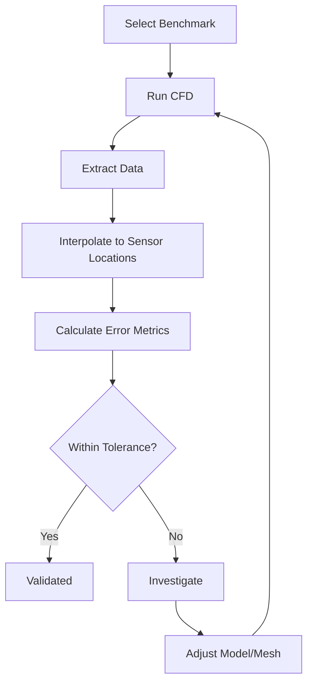

# Experimental Validation

การทวนสอบด้วยข้อมูลการทดลอง

---

## Overview

| Term | Definition | Method |
|------|------------|--------|
| **Validation** | Does model match reality? | Compare with experiment |
| **Verification** | Are equations solved correctly? | Compare with analytical |

$$\varepsilon_{model} = |f_{exp} - f_{CFD}|$$

---

## 1. Standard Benchmark Cases

| Case | Physics | Solver | Tutorial Path |
|------|---------|--------|---------------|
| Lid-Driven Cavity | Incompressible | `icoFoam` | `incompressible/icoFoam/cavity` |
| Backward-Facing Step | Separation | `simpleFoam` | `incompressible/simpleFoam/pitzDaily` |
| Channel Flow | Wall turbulence | `pimpleFoam` | `incompressible/pimpleFoam/channel395` |
| Dam Break | Free surface | `interFoam` | `multiphase/interFoam/laminar/damBreak` |

---

## 2. Error Metrics

### $L_1$ Norm (Average Error)

$$L_1 = \frac{1}{N}\sum_{i=1}^{N}|y_{CFD,i} - y_{exp,i}|$$

### $L_2$ Norm (RMS Error)

$$L_2 = \sqrt{\frac{1}{N}\sum_{i=1}^{N}(y_{CFD,i} - y_{exp,i})^2}$$

### $L_\infty$ Norm (Max Error)

$$L_\infty = \max_i |y_{CFD,i} - y_{exp,i}|$$

### Coefficient of Determination

$$R^2 = 1 - \frac{\sum(y_{CFD} - y_{exp})^2}{\sum(y_{exp} - \bar{y}_{exp})^2}$$

---

## 3. Data Extraction

### Sample Line

```cpp
// system/sampleDict
sets
(
    midLine
    {
        type    uniform;
        axis    distance;
        start   (0 0.05 0);
        end     (1 0.05 0);
        nPoints 100;
    }
);

fields (U p k);
interpolationScheme cellPoint;
```

```bash
sample -latestTime
```

### Probes

```cpp
// system/controlDict
functions
{
    probes
    {
        type    probes;
        probeLocations ((0.1 0.05 0) (0.2 0.05 0));
        fields  (U p);
    }
}
```

---

## 4. Statistical Averaging (Turbulent Flow)

```cpp
// system/controlDict
functions
{
    fieldAverage
    {
        type    fieldAverage;
        fields  (U p k);
        mean    on;
        prime2Mean on;
        base    time;
        window  10;
    }
}
```

Output: `UMean`, `UPrime2Mean` fields

---

## 5. Acceptance Criteria

| Application | $R^2$ | MAPE | $L_2$ |
|-------------|-------|------|-------|
| Engineering design | > 0.90 | < 15% | < 0.1 |
| Research | > 0.95 | < 10% | < 0.05 |
| High accuracy | > 0.98 | < 5% | < 0.02 |

---

## 6. Uncertainty Sources

| Source | Type | Mitigation |
|--------|------|------------|
| Measurement error | Experimental | Report uncertainty bars |
| Boundary conditions | Modeling | Sensitivity study |
| Turbulence model | Physics | Try multiple models |
| Mesh resolution | Numerical | Mesh independence study |

### Acceptance Criterion

$$|y_{CFD} - y_{exp}| \leq U_{exp}$$

ถ้า CFD อยู่ในช่วง uncertainty ของการทดลอง → ถือว่ายอมรับได้

---

## 7. Validation Workflow



---

## 8. Best Practices

1. **Start simple**: เริ่มจาก case ที่มี analytical solution
2. **Build complexity**: 2D → 3D, laminar → turbulent
3. **Multiple metrics**: ใช้หลาย error norms
4. **Document everything**: บันทึก settings ทั้งหมด
5. **Blind validation**: อย่า tune model ให้ตรงข้อมูล

---

## Concept Check

<details>
<summary><b>1. $L_1$ กับ $L_\infty$ norm บอกอะไรต่างกัน?</b></summary>

- **$L_1$**: ค่าเฉลี่ยความคลาดเคลื่อน "โดยรวม"
- **$L_\infty$**: ค่าความคลาดเคลื่อน "สูงสุด" ที่จุดใดจุดหนึ่ง — สำคัญสำหรับ safety-critical applications
</details>

<details>
<summary><b>2. ถ้า CFD ไม่ตรงกับ experiment แปลว่า CFD ผิดเสมอไหม?</b></summary>

**ไม่เสมอไป** — อาจเกิดจาก:
1. Measurement uncertainty ของการทดลอง
2. Boundary conditions ไม่ตรงกับของจริง
3. Turbulence model ไม่เหมาะสม
</details>

<details>
<summary><b>3. ทำไมต้องทำ benchmark validation ก่อนทำ case จริง?</b></summary>

เพื่อยืนยันว่า **methodology ถูกต้อง** (solver, schemes, mesh strategy) ก่อนไปทำ case ที่ไม่มีคำตอบให้ตรวจสอบ
</details>

---

## Related Documents

- **บทก่อนหน้า:** [02_Mesh_Independence.md](02_Mesh_Independence.md)
- **ภาพรวม:** [00_Overview.md](00_Overview.md)