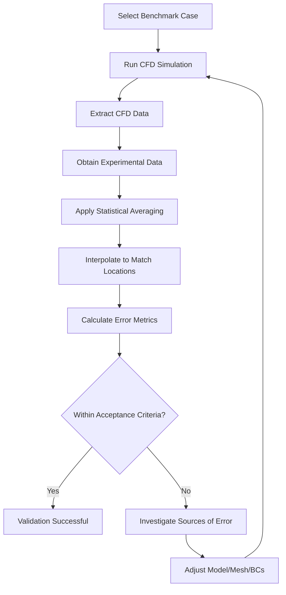
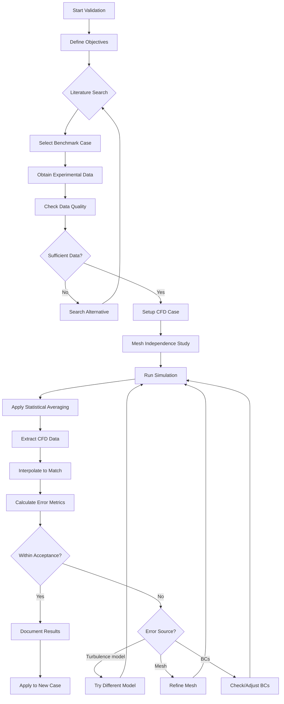

# Experimental Validation

การทวนสอบด้วยข้อมูลการทดลอง

---

## Learning Objectives

**เป้าหมายการเรียนรู้**

After completing this section, you should be able to:

- **Differentiate** validation from verification and understand when to apply each
- **Select** appropriate benchmark cases for your application
- **Extract** and prepare CFD data for comparison with experiments
- **Calculate** and interpret error metrics ($L_1$, $L_2$, $R^2$)
- **Apply** statistical averaging techniques for turbulent flows
- **Establish** acceptance criteria based on application requirements
- **Identify** and quantify uncertainty sources in both experiments and simulations

หลังจากศึกษาส่วนนี้ คุณควรจะสามารถ:
- แยกความแตกต่างระหว่างการทวนสอบ (validation) และการตรวจสอบ (verification)
- เลือกกรณีทดสอบมาตรฐาน (benchmark) ที่เหมาะสมกับแอปพลิเคชันของคุณ
- ดึงข้อมูล CFD เพื่อเปรียบเทียบกับข้อมูลการทดลอง
- คำนวณและอธิบายค่าความคลาดเคลื่อนต่างๆ
- ใช้เทคนิคการเฉลี่ยสถิติสำหรับกรณีการไหลแบบ turbulent
- กำหนดเกณฑ์การยอมรับผลลัพธ์
- ระบุและวัดปริมาณความไม่แน่นอนในการทดลองและการจำลอง

---

## What is Experimental Validation?

**การทวนสอบด้วยข้อมูลการทดลองคืออะไร?**

### Core Concept

| Term | Definition | Thai Translation | Method |
|------|------------|------------------|--------|
| **Validation** | Does model match reality? | โมเดลตรงกับความเป็นจริงหรือไม่? | Compare with experiment |
| **Verification** | Are equations solved correctly? | สมการถูกแก้ correctly หรือไม่? | Compare with analytical |

**การทวนสอบ (Validation)** คือกระบวนการตรวจสอบว่าโมเดล CFD ของเราสามารถทำนายปรากฏการณ์ทางกายภาพได้ตรงกับข้อมูลการทดลองจริงหรือไม่

### Model Error Definition

$$\varepsilon_{model} = |f_{exp} - f_{CFD}|$$

Where:
- $f_{exp}$ = experimental measurement (ค่าที่วัดได้จากการทดลอง)
- $f_{CFD}$ = CFD prediction (ค่าที่ทำนายได้จาก CFD)
- $\varepsilon_{model}$ = model error (ความคลาดเคลื่อนของโมเดล)

---

## Why is Validation Important?

**ทำไมการทวนสอบจึงสำคัญ?**

### 1. **Build Confidence** (สร้างความมั่นใจ)
- Validation ก่อนใช้ CFD ทำนายกรณีใหม่ๆ
- ลดความเสี่ยงในการตัดสินใจออกแบบ

### 2. **Identify Limitations** (รับรู้ข้อจำกัด)
- ทราบขอบเขตของ turbulence model
- เข้าใจผลกระทบของ mesh resolution

### 3. **Credible Results** (ผลลัพธ์ที่เชื่อถือได้)
- ผลลัพธ์ที่ผ่าน validation มีความน่าเชื่อถือ
- สามารถนำเสนอในรายงานวิจัยหรืองานออกแบบได้

### 4. **Regulatory Requirements** (ข้อกำหนดด้านกฎระเบียบ)
- บางอุตสาหกรรม (เช่น อากาศยาน) ต้องการ validation บังคับ

---

## How to Perform Experimental Validation

**วิธีการทวนสอบด้วยข้อมูลการทดลอง**

### Overview Workflow



---

## 1. Select Appropriate Benchmark Cases

**การเลือกกรณีทดสอบมาตรฐาน**

### What Constitutes a Valid Benchmark?

**กรณีทดสอบที่เหมาะสมควรมี:**

1. **Well-documented geometry** — ขนาดและรูปร่างชัดเจน
2. **Detailed experimental data** — มีข้อมูลครบถ้วน (velocity, pressure, forces)
3. **Known uncertainty** — รายงานความไม่แน่นอนของการวัด
4. **Relevant physics** — กลไกทางกายภาพใกล้เคียงกับปัญหาของคุณ
5. **Peer-reviewed publication** — ผ่านการตรวจสอบจากผู้เชี่ยวชาญ

### Standard OpenFOAM Benchmark Cases

| Case | Physics | Solver | Tutorial Path | Key Validation |
|------|---------|--------|---------------|----------------|
| **Lid-Driven Cavity** | Incompressible laminar | `icoFoam` | `incompressible/icoFoam/cavity` | Velocity profiles |
| **Backward-Facing Step** | Flow separation | `simpleFoam` | `incompressible/simpleFoam/pitzDaily` | Reattachment length |
| **Channel Flow** | Wall turbulence | `pimpleFoam` | `incompressible/pimpleFoam/channel395` | Mean velocity, Reynolds stress |
| **Dam Break** | Free surface dynamics | `interFoam` | `multiphase/interFoam/laminar/damBreak` | Wave position vs time |
| **Ahmed Body** | External aerodynamics | `simpleFoam` | External | Drag coefficient, wake |
| **Turbulent Jet** | Free shear flow | `pimpleFoam` | Custom | Spreading rate |

### How to Select Experimental Datasets

**ขั้นตอนการเลือกข้อมูลการทดลอง:**

1. **Match Reynolds number** — Re ใกล้เคียงกับ case ของคุณ
2. **Similar geometry** — รูปร่างและสัดส่วนใกล้เคียง
3. **Accessible data** — ข้อมูลดิจิทัลหรือ digitizable
4. **Quality indicators** — มีรายงาน uncertainty analysis
5. **Multiple comparisons** — เลือกหลายกรณีเพื่อ confirm

---

## 2. Data Extraction and Preparation

**การดึงและเตรียมข้อมูล**

### Using Sample Utility

**การใช้งาน sampleDict**

```cpp
// system/sampleDict
sets
(
    midLine
    {
        type    uniform;
        axis    distance;
        start   (0 0.05 0);
        end     (1 0.05 0);
        nPoints 100;
    }
    
    centerline
    {
        type    uniform;
        axis    xyz;
        start   (0 0 0);
        end     (0 1 0);
        nPoints 200;
    }
);

fields (U p k epsilon omega);
interpolationScheme cellPoint;  // Better than cellPointFace
```

**Run sampling:**

```bash
# Sample at all time directories
sample

# Sample only at latest time
sample -latestTime

# Sample specific time
sample -time 1.5
```

Output creates `sets/` directory with CSV data at each time.

### Using Probes (Runtime Monitoring)

**การใช้ probes สำหรับ monitoring แบบ real-time**

```cpp
// system/controlDict
functions
{
    probes
    {
        type            probes;
        libs            ("libsampling.so");
        
        // Probe locations
        probeLocations
        (
            (0.1 0.05 0)
            (0.2 0.05 0)
            (0.3 0.05 0)
            (0.5 0.05 0)
        );
        
        // Fields to probe
        fields          (U p k);
        
        // Output options
        writeFields     false;
        includeInterval 1;
        logFields       true;
    }
}
```

Output creates `probes/` directory with time-series data.

---

## 3. Statistical Averaging for Turbulent Flows

**การเฉลี่ยสถิติสำหรับการไหลแบบ Turbulent**

### Why Averaging is Necessary

Turbulent flows have inherent fluctuations. Direct comparison requires:

$$\bar{U} = \frac{1}{T}\int_0^T U(t)dt$$

### Field Averaging Function Object

```cpp
// system/controlDict
functions
{
    fieldAverage
    {
        type            fieldAverage;
        libs            ("libfieldFunctionObjects.so");
        
        // Fields to average
        fields
        (
            U
            {
                mean        on;
                prime2Mean  on;
                base        time;
            }
            p
            {
                mean        on;
                prime2Mean  off;
                base        time;
            }
            k
            {
                mean        on;
                prime2Mean  off;
                base        time;
            }
        );
        
        // Windowing options
        window          10;      // Number of samples
        windowType      approximate; // or exact
    }
}
```

**Output fields:**
- `UMean` — Time-averaged velocity
- `UPrime2Mean` — Reynolds stress tensor $\overline{u'_i u'_j}$
- `pMean` — Mean pressure

### When to Start Averaging

```cpp
// system/controlDict
functions
{
    fieldAverage1
    {
        type            fieldAverage;
        
        // Only start after flow is developed
        startTime       0.5;     // Delay averaging
        
        // Alternative: start from previous run
        // restartOnRestart yes;
        // restartFromTime 0.5;
        
        fields ((U) (p));
    }
}
```

### Checking Convergence

Monitor statistics until stable:

```bash
# Monitor UMean convergence
foamMonitor postProcessing/fieldAverage1/0/fieldAverage.dat
```

---

## 4. Error Metrics and Quantification

**เมตริกความคลาดเคลื่อนและการวัดปริมาณ**

### Common Error Norms

#### $L_1$ Norm (Mean Absolute Error)

**ค่าเฉลี่ยความคลาดเคลื่อนสัมบูรณ์**

$$L_1 = \frac{1}{N}\sum_{i=1}^{N}|y_{CFD,i} - y_{exp,i}|$$

**Interpretation:**
- Measures overall deviation
- Less sensitive to outliers
- Good indicator of average performance

#### $L_2$ Norm (RMS Error)

**ค่าเฉลี่ยกำลังสองของความคลาดเคลื่อน**

$$L_2 = \sqrt{\frac{1}{N}\sum_{i=1}^{N}(y_{CFD,i} - y_{exp,i})^2}$$

**Interpretation:**
- Penalizes larger errors more heavily
- Standard metric in many fields
- More sensitive to local discrepancies

#### $L_\infty$ Norm (Maximum Error)

**ค่าความคลาดเคลื่อนสูงสุด**

$$L_\infty = \max_i |y_{CFD,i} - y_{exp,i}|$$

**Interpretation:**
- Worst-case error
- Critical for safety-critical applications
- Important for localized failure modes

### Coefficient of Determination

**ค่าสัมประสิทธิ์การพยากรณ์**

$$R^2 = 1 - \frac{\sum_{i=1}^{N}(y_{CFD,i} - y_{exp,i})^2}{\sum_{i=1}^{N}(y_{exp,i} - \bar{y}_{exp})^2}$$

**Interpretation:**
- $R^2 = 1$: Perfect correlation
- $R^2 = 0$: No better than mean
- $R^2 < 0$: Model is worse than mean

### Mean Absolute Percentage Error

```python
MAPE = 100% * mean(|y_CFD - y_exp| / |y_exp|)
```

**Caution:** Avoid when $y_{exp} \approx 0$

### Relative Error Norms

For dimensionless comparison:

$$\varepsilon_{rel} = \frac{||y_{CFD} - y_{exp}||}{||y_{exp}||}$$

---

## 5. Acceptance Criteria

**เกณฑ์การยอมรับผลลัพธ์**

### Application-Specific Thresholds

| Application | $R^2$ | MAPE | $L_2$ (normalized) | Notes |
|-------------|-------|------|--------------------|-------|
| **Preliminary design** | > 0.85 | < 20% | < 0.15 | Early-stage estimates |
| **Engineering design** | > 0.90 | < 15% | < 0.10 | Most common applications |
| **Research publication** | > 0.95 | < 10% | < 0.05 | High-quality journals |
| **Safety-critical** | > 0.98 | < 5% | < 0.02 | Medical, aerospace |

### Force Coefficient Acceptance

For aerodynamic applications:

$$\frac{|C_{D,CFD} - C_{D,exp}|}{C_{D,exp}} < 5\%$$

### Profile Comparison

For velocity/pressure profiles:

- **Shape:** Correct trend and location of extrema
- **Magnitude:** Within 10% of peak values
- **Gradients:** Similar slope behavior

### Experimental Uncertainty Criterion

$$|y_{CFD} - y_{exp}| \leq U_{exp}$$

**ถ้า CFD อยู่ในช่วง uncertainty ของการทดลอง → ถือว่ายอมรับได้**

If CFD prediction falls within experimental uncertainty bars, validation is successful.

---

## 6. Sources of Uncertainty

**แหล่งที่มาของความไม่แน่นอน**

### Uncertainty Matrix

| Source | Type | Typical Magnitude | Mitigation Strategy |
|--------|------|-------------------|---------------------|
| **Measurement error** | Experimental | 1-5% | Report uncertainty bars, use multiple sensors |
| **Boundary conditions** | Modeling | 5-15% | Sensitivity studies, match experimental conditions |
| **Turbulence model** | Physics | 10-30% | Try multiple models, compare with DNS/LES |
| **Mesh resolution** | Numerical | 2-10% | Mesh independence study (Module 02) |
| **Numerical schemes** | Numerical | 1-5% | Use higher-order schemes |
| **Geometry differences** | Modeling | 2-8% | Ensure CAD matches experiment exactly |

### Experimental Uncertainty Components

$$U_{exp} = \sqrt{U_{bias}^2 + U_{precision}^2}$$

- **Bias error:** Systematic (calibration issues)
- **Precision error:** Random (repeatability)

### Modeling Uncertainty

$$U_{model} = \sqrt{U_{turbulence}^2 + U_{numerical}^2 + U_{BC}^2}$$

### Combined Uncertainty

$$U_{total} = \sqrt{U_{exp}^2 + U_{model}^2}$$

---

## 7. Complete Validation Workflow

**ขั้นตอนการทวนสอบที่สมบูรณ์**



### Step-by-Step Checklist

**1. Preparation**
- [ ] Identify validation requirements
- [ ] Select appropriate benchmark
- [ ] Obtain experimental data
- [ ] Document experimental conditions

**2. CFD Setup**
- [ ] Create geometry matching experiment
- [ ] Perform mesh independence study
- [ ] Match boundary conditions exactly
- [ ] Select appropriate solver
- [ ] Configure turbulence model

**3. Execution**
- [ ] Run simulation to convergence
- [ ] Enable field averaging
- [ ] Sample/probe data
- [ ] Verify solution stability

**4. Analysis**
- [ ] Interpolate to sensor locations
- [ ] Calculate all error metrics
- [ ] Compare with acceptance criteria
- [ ] Create visual comparisons

**5. Documentation**
- [ ] Record all settings
- [ ] Archive input files
- [ ] Document uncertainties
- [ ] Prepare validation report

---

## 8. Common Pitfalls

**ข้อผิดพลาดที่พบบ่อย**

### ❌ **Pitfall 1: Inadequate Statistical Averaging**

**Problem:** Using instantaneous fields for comparison

**Solution:**
```cpp
// Ensure sufficient averaging period
window  100;  // At least 10 flow-through times
```

### ❌ **Pitfall 2: Mismatched Locations**

**Problem:** Comparing CFD and experiment at different points

**Solution:**
```cpp
// Interpolate CFD to exact experimental coordinates
interpolationScheme cellPoint;
```

### ❌ **Pitfall 3: Ignoring Experimental Uncertainty**

**Problem:** Expecting exact match

**Solution:**
```python
# Check if within uncertainty bounds
assert abs(cfd - exp) < u_exp, "Outside experimental uncertainty"
```

### ❌ **Pitfall 4: Overfitting to One Case**

**Problem:** Tuning model for specific benchmark

**Solution:**
- Validate against multiple cases
- Test on different geometries
- Blind validation when possible

### ❌ **Pitfall 5: Inconsistent Boundary Conditions**

**Problem:** BCs don't match experimental conditions

**Solution:**
- Document experimental inlet profile
- Use measured inlet conditions
- Include turbulence intensity if available

### ❌ **Pitfall 6: Insufficient Mesh Resolution**

**Problem:** Grid-dependent results

**Solution:**
- Always perform mesh independence first
- Document grid convergence index
- Use refined mesh near walls

---

## 9. Best Practices

**แนวปฏิบัติที่ดี**

### 1. **Start Simple, Build Complexity**

เริ่มจาก case ที่มี analytical solution → ลอง laminar → turbulent

```mermaid
LR
    A[Analytical Solution] --> B[Laminar Benchmark]
    B --> C[Turbulent Benchmark]
    C --> D[Application Case]
```

### 2. **Use Multiple Metrics**

ใช้หลาย error norms เพื่อภาพที่ครอบคลุม:

```python
errors = {
    'L1': l1_norm(cfd, exp),
    'L2': l2_norm(cfd, exp),
    'Linf': linf_norm(cfd, exp),
    'R2': r_squared(cfd, exp),
    'MAPE': mean_abs_pct_error(cfd, exp)
}
```

### 3. **Document Everything**

บันทึก settings ทั้งหมด:

- Mesh details (cell count, quality metrics)
- Solver settings (schemes, tolerances)
- Turbulence model parameters
- Boundary condition specification
- Computing resources used

### 4. **Perform Blind Validation**

อย่า tune model ให้ตรงข้อมูลจนเกินไป:

- Split experimental data (train/test)
- Validate on "unseen" cases
- Report both calibration and validation errors

### 5. **Quantify All Uncertainties**

รายงานความไม่แน่นอนของ:
- Experimental measurements
- Numerical discretization
- Modeling assumptions
- Boundary conditions

### 6. **Visual Inspection Always**

ตัวเลขไม่พอ — ต้องดูกราฟ:

```python
import matplotlib.pyplot as plt

plt.figure(figsize=(10, 6))
plt.plot(x_exp, y_exp, 'ko', label='Experiment', markersize=8)
plt.plot(x_cfd, y_cfd, 'r-', label='CFD', linewidth=2)
plt.fill_between(x_exp, y_exp - u_exp, y_exp + u_exp, alpha=0.2)
plt.xlabel('Position (m)')
plt.ylabel('Velocity (m/s)')
plt.legend()
plt.grid(True)
```

---

## Key Takeaways

**สรุปสิ่งสำคัญ**

### ✓ Core Concepts

1. **Validation vs Verification**
   - Validation: model vs reality (experiment)
   - Verification: solution vs analytical (math)

2. **Error Quantification**
   - Use multiple norms ($L_1$, $L_2$, $L_\infty$, $R^2$)
   - Different metrics for different applications

3. **Acceptance Criteria**
   - Application-dependent thresholds
   - Must consider experimental uncertainty
   - $R^2 > 0.90$ typical for engineering design

4. **Statistical Averaging**
   - Essential for turbulent flows
   - Use fieldAverage function object
   - Monitor convergence of statistics

5. **Complete Workflow**
   - Literature → Select benchmark → Setup → Run → Compare → Validate
   - Document every step
   - Iterate if criteria not met

### ✓ Practical Tips

- **Always** start with mesh independence
- **Always** match experimental BCs exactly
- **Always** interpolate to sensor locations
- **Always** report experimental uncertainty
- **Never** overfit to single benchmark
- **Always** validate on multiple cases

---

## Concept Check

**ทดสอบความเข้าใจ**

<details>
<summary><b>1. $L_1$ กับ $L_\infty$ norm บอกอะไรต่างกัน?</b></summary>

**คำตอบ:**

- **$L_1$ (Mean Absolute Error)**: ค่าเฉลี่ยความคลาดเคลื่อน "โดยรวม"
  - ดู performance เฉลี่ยของทั้งกราฟ
  - ไม่ sensitive ต่อ outliers
  - เหมาะสำหรับ general performance assessment

- **$L_\infty$ (Maximum Error)**: ค่าความคลาดเคลื่อน "สูงสุด" ที่จุดใดจุดหนึ่ง
  - ดู worst-case scenario
  - **สำคัญมาก** สำหรับ safety-critical applications
  - บอกว่ามีจุดที่ผิดพลาดมากแค่ไหน

**ตัวอย่าง:** ถ้า $L_1 = 0.02$ แต่ $L_\infty = 0.15$ → เฉลี่ยดี แต่มีจุดที่ผิดพลาดมาก
</details>

<details>
<summary><b>2. ถ้า CFD ไม่ตรงกับ experiment แปลว่า CFD ผิดเสมอไหม?</b></summary>

**คำตอบ: ไม่เสมอไป**

อาจเกิดจาก:

1. **Measurement uncertainty** ของการทดลอง
   - การวัดมีความคลาดเคลื่อน inherent
   - Instrument error ± calibration issues
   
2. **Boundary conditions** ไม่ตรงกับของจริง
   - Inlet profile อาจไม่ได้วัดละเอียด
   - Surface roughness อาจต่างจาก CAD
   
3. **Turbulence model** ไม่เหมาะสม
   - k-ε อาจไม่เหมาะกับ strong adverse pressure gradient
   - ลองหลาย model เปรียบเทียบ

4. **Geometry differences**
   - CAD อาจไม่ตรงกับ experiment 100%
   - Small gaps/leakages ไม่ได้โมเดล

**Best practice:** ตรวจสอบทุกอย่างก่อนตัดสินว่า CFD ผิด
</details>

<details>
<summary><b>3. ทำไมต้องทำ benchmark validation ก่อนทำ case จริง?</b></summary>

**คำตอบ:**

เพื่อยืนยันว่า **methodology ถูกต้อง** ก่อนไปทำ case ที่ไม่มีคำตอบให้ตรวจสอบ:

1. **Verify solver settings**
   - Schemes, tolerances, under-relaxation
   
2. **Confirm mesh strategy**
   - Quality, resolution, near-wall treatment
   
3. **Validate turbulence model**
   - Model appropriate for flow physics
   
4. **Build confidence**
   - ถ้าไม่ผ่าน benchmark → ไม่น่าใจจะผ่าน case จริง

**Analogy:** เหมือน calibration เครื่องมือวัดก่อนใช้งานจริง
</details>

<details>
<summary><b>4. Statistical averaging ทำไมถึงสำคัญสำหรับ turbulent flow?</b></summary>

**คำตอบ:**

Turbulent flows มี **fluctuations** ที่ไม่สามารถเปรียบเทียบโดยตรง:

$$U(x,t) = \bar{U}(x) + u'(x,t)$$

- $\bar{U}$ = mean component (สิ่งที่เปรียบเทียบได้)
- $u'$ = fluctuating component (เปลี่ยนไปตามเวลา)

ถ้าใช้ instantaneous field:
- ค่าที่วัดแต่ละครั้งจะต่างกัน
- ไม่สามารถเปรียบเทียบกับ experiment ที่เป็น mean value

**วิธีการ:**
```cpp
// เก็บสถิตินานพอ
window  100;  // ~10 flow-through times ขึ้นกับ geometry
```

**เช็คการลู่เคลื่อน:**
```bash
# Monitor จนกว่าค่า mean จะ steady
foamMonitor postProcessing/fieldAverage1/0/fieldAverage.dat
```
</details>

<details>
<summary><b>5. acceptance criteria ควรตั้งอย่างไร?</b></summary>

**คำตอบ:**

ขึ้นอยู่กับ **application** และ **experimental uncertainty**:

| Application | Typical Criteria |
|-------------|------------------|
| Preliminary design | $R^2 > 0.85$, MAPE < 20% |
| Engineering design | $R^2 > 0.90$, MAPE < 15% |
| Research publication | $R^2 > 0.95$, MAPE < 10% |

**ขั้นตอนการตั้งเกณฑ์:**

1. **Estimate experimental uncertainty**
   ```
   U_exp = ±5% (from paper)
   ```

2. **Add numerical uncertainty**
   ```
   U_total = sqrt(U_exp^2 + U_num^2)
   ```

3. **Set acceptance margin**
   ```
   |CFD - exp| < 2 × U_total  (conservative)
   ```

4. **Validate on multiple metrics**
   - Not just $R^2$ → check shape, gradients, extrema
   - Visual inspection always required
</details>

---

## Related Documents

**เอกสารที่เกี่ยวข้อง**

### Module 06: Validation and Verification
- **ภาพรวม:** [00_Overview.md](00_Overview.md) — Big picture of V&V framework
- **บทก่อนหน้า:** [02_Mesh_Independence.md](02_Mesh_Independence.md) — Numerical error quantification

### Cross-Module References
- **Module 03.1:** [01_Introduction.md](../../03_SINGLE_PHASE_FLOW/CONTENT/01_INCOMPRESSIBLE_FLOW_SOLVERS/01_Introduction.md) — Solvers for validation cases
- **Module 03.3:** [01_Turbulence_Fundamentals.md](../../03_SINGLE_PHASE_FLOW/CONTENT/03_TURBULENCE_MODELING/01_Turbulence_Fundamentals.md) — Turbulence modeling for validation

### External Resources
- **OpenFOAM Tutorials:** `$FOAM_TUTORIALS/incompressible/` — Standard benchmark cases
- **ERCOFTAC Database:** Classic validation datasets (http://ercoftac.mech.surrey.ac.uk/)
- **NASA Turbulence Modeling Resource:** Verified test cases (https://turbmodels.larc.nasa.gov/)