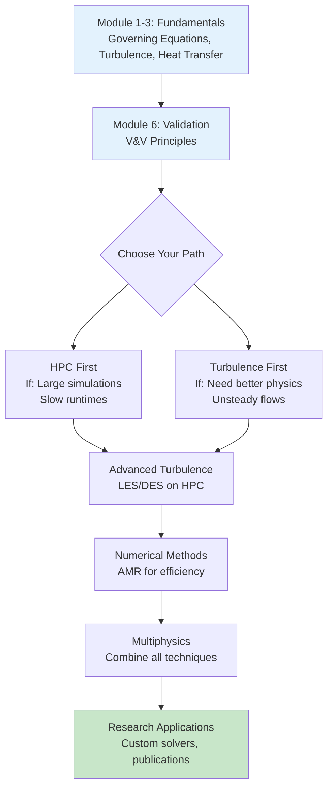
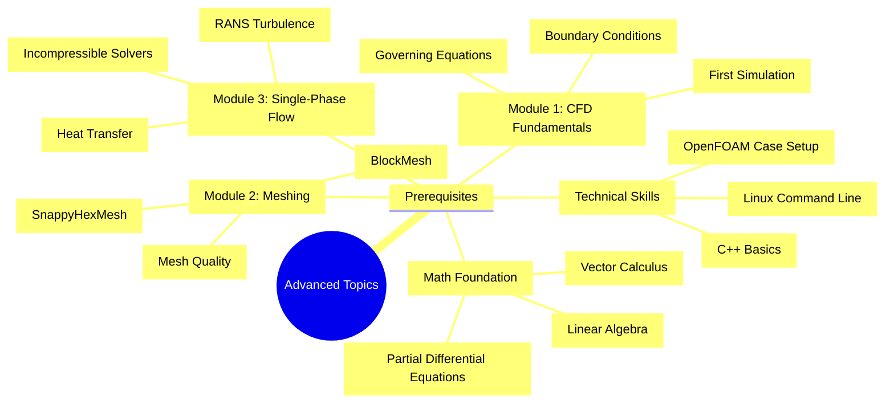

Now I'll refactor this file according to the 3W Framework and specific instructions:

# Advanced Topics Overview

หัวข้อขั้นสูงใน OpenFOAM สำหรับการจำลอง Single-Phase Flow

**Estimated Reading Time:** 15 minutes

---

## Learning Objectives

After completing this module overview, you will be able to:

1. **Identify** the four advanced topics covered in this module and their interconnections
2. **Explain** when and why to apply advanced techniques like HPC, LES/DES, AMR, and multiphysics coupling
3. **Navigate** the learning path from basic single-phase simulations to research-level applications
4. **Assess** your readiness for advanced topics based on prerequisite knowledge

---

## What You Will Learn (What)

This module bridges the gap between **foundational CFD knowledge** and **research/industrial applications**. You will master:

| Advanced Topic | What You'll Master |
|----------------|-------------------|
| **HPC** | Parallel computing with domain decomposition and MPI |
| **Advanced Turbulence** | LES, DES, and transition modeling for scale-resolving simulations |
| **Numerical Methods** | Adaptive mesh refinement and high-order discretization schemes |
| **Multiphysics** | FSI, CHT, and reacting flows with multi-region coupling |

These techniques enable simulations that are:
- **Faster** (HPC → days instead of weeks)
- **More accurate** (LES/DES → capture unsteady turbulent structures)
- **More efficient** (AMR → refine only where needed)
- **More realistic** (multiphysics → capture coupled physics)

---

## Why These Skills Matter (Why)

### Real-World Applications

> **💡 Industry = needs speed + accuracy**
> 
> Research = needs physics fidelity + innovation

| Application | Why Advanced Methods? |
|-------------|----------------------|
| **Aerospace** | LES/DES captures unsteady loads on aircraft components |
| **Automotive** | HPC enables overnight optimization of aerodynamics |
| **Energy** | AMR efficiently resolves flame fronts in combustors |
| **Biomedical** | FSI models blood-vessel interaction in aneurysms |

### Impact Summary

- **HPC**: Reduce simulation time from weeks to hours → faster design iterations
- **LES/DES**: Capture turbulent structures critical for acoustics, mixing, and separation
- **AMR**: Achieve high resolution where needed without excessive computational cost
- **Multiphysics**: Model real-world problems where fluid, solid, and thermal domains interact

---

## How to Navigate This Module (How)

### Recommended Learning Path



### Prerequisite Knowledge Visual Map



### Module Structure

| File | Focus | Prerequisites | Est. Time |
|------|-------|---------------|-----------|
| [01_High_Performance_Computing.md](01_High_Performance_Computing.md) | Domain decomposition, MPI, scaling | Module 2 (meshing), Module 3 (solvers) | 3-4 hrs |
| [02_Advanced_Turbulence.md](02_Advanced_Turbulence.md) | LES, DES, transition modeling | Module 3 (RANS turbulence) | 4-5 hrs |
| [03_Numerical_Methods.md](03_Numerical_Methods.md) | AMR, high-order schemes | Module 1 (FVM basics), Module 2 (meshing) | 3-4 hrs |
| [04_Multiphysics.md](04_Multiphysics.md) | FSI, CHT, reacting flows | All previous + heat transfer | 4-5 hrs |

> **🎯 Suggested Order**: HPC → Advanced Turbulence → Numerical Methods → Multiphysics
> 
> **Alternative**: Turbulence → HPC (if you need better physics first, then scale up)

---

## Module Topics Overview

> **💡 Advanced = ต่อยอดจาก basics:**
>
> HPC → Scale up | LES/DES → Better physics | AMR → Efficient meshing | Multiphysics → Real-world complexity

### Topic Summaries

#### 1. High-Performance Computing (HPC)
**Goal**: Run large simulations faster using parallel computing

**Key Concepts**:
- Domain decomposition with Scotch/Metis
- MPI communication between processors
- Load balancing and parallel efficiency
- Strong vs weak scaling

**Quick Example**:
```bash
# Decompose, run parallel, reconstruct
decomposePar
mpirun -np 16 simpleFoam -parallel
reconstructPar
```

**Real-World Impact**: 10M cell simulation → 48 hours (serial) vs 3 hours (16 cores)

---

#### 2. Advanced Turbulence Modeling
**Goal**: Capture unsteady turbulent structures that RANS misses

**Key Techniques**:
- **LES**: Resolve large eddies, model subgrid scales
- **DES**: Hybrid RANS-LES for wall-modeled simulations
- **Transition Modeling**: Predict laminar-to-turbulent transition

**Quick Example**:
```cpp
// LES setup
simulationType LES;
LES
{
    LESModel Smagorinsky;
    delta   cubeRootVol;
}
```

**Real-World Impact**: Aeroacoustic noise prediction, massive separation, mixing accuracy

---

#### 3. Advanced Numerical Methods
**Goal**: Improve accuracy and efficiency through smart numerics

**Key Techniques**:
- **AMR**: Dynamically refine mesh based on solution fields
- **High-order schemes**: Cubic, LUST for reduced numerical diffusion
- **Implicit vs explicit**: Time integration strategies

**Quick Example**:
```cpp
// AMR setup
dynamicFvMesh dynamicRefineFvMesh;
refineInterval 1;
field "alpha.water";
maxRefinement 2;
```

**Real-World Impact**: 50% cell reduction for same accuracy in multiphase flows

---

#### 4. Multiphysics Coupling
**Goal**: Model interacting physical phenomena

**Key Techniques**:
- **CHT**: Conjugate heat transfer (fluid + solid)
- **FSI**: Fluid-structure interaction (partitioned/monolithic)
- **Reacting flows**: Combustion with chemistry

**Quick Example**:
```cpp
// CHT solver
chtMultiRegionFoam

// Interface BC
type compressible::turbulentTemperatureCoupledBaffleMixed;
```

**Real-World Impact**: Electronics cooling, wind-structure interaction, combustor design

---

## Target Audience

| Group | Background | Benefits |
|-------|-----------|----------|
| **Graduate students** | Completed Modules 1-3 | Thesis research, publication-quality simulations |
| **Research engineers** | Industry CFD experience | Custom solver development, HPC deployment |
| **Advanced practitioners** | OpenFOAM proficiency | Complex industrial applications, optimization |

---

## Key Takeaways

1. **Advanced topics build on fundamentals** - Ensure you have mastered Modules 1-3 before proceeding
2. **Choose your learning path** - HPC first for speed, turbulence first for physics accuracy
3. **All topics are interconnected** - HPC enables LES/DES, AMR supports multiphysics, etc.
4. **Practical applications drive the theory** - Every technique addresses real engineering challenges
5. **Start simple, then scale** - Test on small cases before applying to large simulations

---

## Concept Check

<details>
<summary><b>1. ทำไมต้องใช้ LES แทน RANS ในบางงาน?</b></summary>

RANS เฉลี่ยทุกอย่าง ทำให้สูญเสียรายละเอียดของ eddies — สำคัญสำหรับ mixing, acoustics, massive separation ที่ต้องเห็น time-varying structures
</details>

<details>
<summary><b>2. Parallel computing ใน OpenFOAM ทำงานอย่างไร?</b></summary>

**Domain decomposition**: แบ่ง mesh เป็นชิ้นๆ ให้แต่ละ CPU core คำนวณ แล้วแลกเปลี่ยนข้อมูลที่ขอบเขตผ่าน MPI
</details>

<details>
<summary><b>3. DES แก้ปัญหาอะไรของ LES?</b></summary>

LES ต้องการ mesh ละเอียดมากใกล้ผนัง (แพงมาก) — DES ใช้ RANS ในเขต boundary layer (ประหยัด) และ LES ในเขตที่กระแสหลุด
</details>

<details>
<summary><b>4. When should you learn HPC vs Advanced Turbulence first?</b></summary>

**HPC first**: If your current simulations are too slow (days/weeks) → learn parallelization to speed up
**Turbulence first**: If you need better physics accuracy (unsteady flows, acoustics) → learn LES/DES, then scale up with HPC
**Both paths converge**: Eventually you'll use HPC to run LES/DES simulations
</details>

<details>
<summary><b>5. What prerequisites are essential before starting this module?</b></summary>

**From Module 1**: Governing equations, boundary conditions, basic solver usage
**From Module 2**: Mesh generation (BlockMesh/SnappyHexMesh), mesh quality assessment
**From Module 3**: RANS turbulence models, incompressible solvers, heat transfer basics
**Math skills**: Vector calculus, PDEs, linear algebra
**Technical skills**: C++ basics, Linux command line, OpenFOAM case structure

**Check**: Can you set up and run a standard RANS simulation independently? If yes, you're ready!
</details>

---

## Related Documents

- **บทก่อนหน้า:** [03_Experimental_Validation.md](../06_VALIDATION_AND_VERIFICATION/03_Experimental_Validation.md)
- **บทถัดไป:** [01_High_Performance_Computing.md](01_High_Performance_Computing.md)
- **Prerequisites**: 
  - [01_GOVERNING_EQUATIONS](../../MODULE_01_CFD_FUNDAMENTALS/CONTENT/01_GOVERNING_EQUATIONS/)
  - [03_TURBULENCE_MODELING](../03_TURBULENCE_MODELING/)
  - [01_MESHING_FUNDAMENTALS](../../MODULE_02_MESHING_AND_CASE_SETUP/CONTENT/01_MESHING_FUNDAMENTALS/)