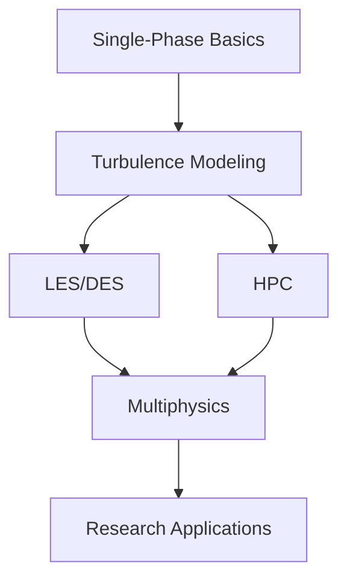

# Advanced Topics Overview

หัวข้อขั้นสูงใน OpenFOAM สำหรับการจำลอง Single-Phase Flow

> **ทำไมบทนี้สำคัญ?**
> - ก้าวข้าม **พื้นฐาน** ไปสู่ **งานวิจัย/อุตสาหกรรมระดับสูง**
> - HPC = ใช้ **parallel computing** ลดเวลาคำนวณ
> - LES/DES = จับ **turbulent structures** ที่ RANS เห็นไม่ได้

---

## Module Topics

> **💡 Advanced = ต่อยอดจาก basics:**
>
> HPC → Scale up | LES/DES → Better physics | AMR → Efficient meshing

| Topic | Focus | Key Techniques |
|-------|-------|----------------|
| [HPC](01_High_Performance_Computing.md) | Parallel computing | Domain decomposition, MPI |
| [Advanced Turbulence](02_Advanced_Turbulence.md) | LES, DES, transition | Scale-resolving simulation |
| [Numerical Methods](03_Numerical_Methods.md) | AMR, high-order | Adaptive mesh refinement |
| [Multiphysics](04_Multiphysics.md) | FSI, CHT, reacting | Multi-region coupling |

---

## 1. High-Performance Computing (HPC)

### Domain Decomposition

```cpp
// system/decomposeParDict
numberOfSubdomains 4;
method scotch;
```

```bash
decomposePar
mpirun -np 4 simpleFoam -parallel
reconstructPar
```

### Key Concepts

| Term | Description |
|------|-------------|
| MPI | Message Passing Interface for inter-processor communication |
| Scotch | Graph partitioning library for load balancing |
| Processor boundaries | Interfaces requiring data exchange |

---

## 2. Advanced Turbulence Modeling

### LES (Large Eddy Simulation)

คำนวณ eddies ขนาดใหญ่โดยตรง, model เฉพาะ subgrid scales

$$\tau_{ij}^{SGS} = -2 \nu_t \bar{S}_{ij}$$

```cpp
// constant/turbulenceProperties
simulationType LES;
LES
{
    LESModel Smagorinsky;
    delta   cubeRootVol;
}
```

### DES (Detached Eddy Simulation)

Hybrid RANS-LES: RANS near wall, LES in separated regions

$$l_{DES} = \min(l_{RANS}, C_{DES} \Delta)$$

### Transition Modeling

$\gamma$-$Re_\theta$ model สำหรับทำนาย laminar-to-turbulent transition

---

## 3. Advanced Numerical Methods

### Adaptive Mesh Refinement (AMR)

```cpp
// system/dynamicMeshDict
dynamicFvMesh dynamicRefineFvMesh;
dynamicRefineFvMeshCoeffs
{
    refineInterval 1;
    field "alpha.water";
    maxRefinement 2;
}
```

### High-Order Schemes

| Scheme | Order | Use |
|--------|-------|-----|
| `linear` | 2nd | General |
| `cubic` | 3rd | Smooth flows |
| `LUST` | Blended | LES |

---

## 4. Multiphysics Coupling

### Conjugate Heat Transfer (CHT)

```cpp
// Solver
chtMultiRegionFoam

// Interface BC
type compressible::turbulentTemperatureCoupledBaffleMixed;
```

### Fluid-Structure Interaction (FSI)

- Partitioned: Separate solvers + data exchange
- Monolithic: Single coupled system

---

## 5. Learning Path



---

## 6. Prerequisites

| Topic | Requirement |
|-------|-------------|
| Math | Vector calculus, PDEs, linear algebra |
| CFD | Governing equations, FVM, turbulence basics |
| Programming | C++ basics, Linux command line |
| OpenFOAM | Solver usage, case setup |

---

## 7. Target Audience

| Group | Benefits |
|-------|----------|
| Graduate students | Thesis research, advanced simulations |
| Research engineers | Custom solver development, HPC |
| Advanced practitioners | Complex industrial applications |

---

## 8. Estimated Time

| Component | Hours |
|-----------|-------|
| Reading | 4-5 |
| Exercises | 6-8 |
| **Total** | **10-13** |

---

## Concept Check

<details>
<summary><b>1. ทำไมต้องใช้ LES แทน RANS ในบางงาน?</b></summary>

RANS เฉลี่ยทุกอย่าง ทำให้สูญเสียรายละเอียดของ eddies — สำคัญสำหรับ mixing, acoustics, massive separation ที่ต้องเห็น time-varying structures
</details>

<details>
<summary><b>2. Parallel computing ใน OpenFOAM ทำงานอย่างไร?</b></summary>

**Domain decomposition**: แบ่ง mesh เป็นชิ้นๆ ให้แต่ละ CPU core คำนวณ แล้วแลกเปลี่ยนข้อมูลที่ขอบเขตผ่าน MPI
</details>

<details>
<summary><b>3. DES แก้ปัญหาอะไรของ LES?</b></summary>

LES ต้องการ mesh ละเอียดมากใกล้ผนัง (แพงมาก) — DES ใช้ RANS ในเขต boundary layer (ประหยัด) และ LES ในเขตที่กระแสหลุด
</details>

---

## Related Documents

- **บทก่อนหน้า:** [03_Experimental_Validation.md](../06_VALIDATION_AND_VERIFICATION/03_Experimental_Validation.md)
- **บทถัดไป:** [01_High_Performance_Computing.md](01_High_Performance_Computing.md)