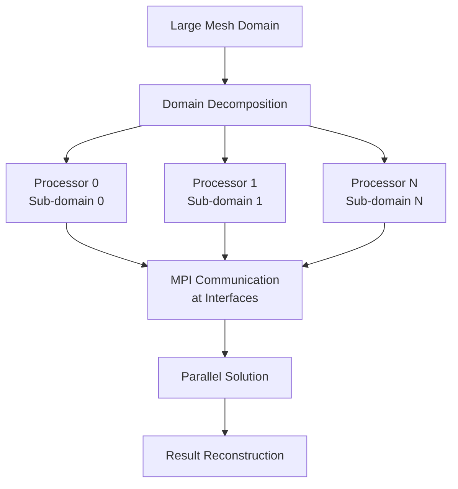
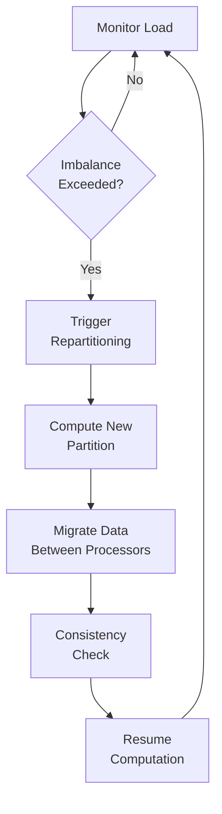

# การประมวลผลสมรรถนะสูง (High-Performance Computing)

## 📖 บทนำ (Introduction)

**High-Performance Computing (HPC)** เป็นเทคโนโลยีที่จำเป็นสำหรับการจำลอง CFD ขนาดใหญ่ที่มีเซลล์นับล้านหรือพันล้าน OpenFOAM ถูกออกแบบมาตั้งแต่ต้นสำหรับ **Parallel Computing** ผ่าน **MPI (Message Passing Interface)** สถาปัตยกรรมแบบขนานนี้ช่วยให้สามารถแบ่งโดเมน (domain decomposition) ซึ่งตาข่ายการคำนวณ (computational mesh) จะถูกแบ่งออกเป็นส่วนย่อยๆ (sub-domains) โดยแต่ละส่วนจะถูกประมวลผลโดยโปรเซสเซอร์แยกต่างหาก


> **Figure 1:** แผนผังลำดับขั้นตอนการประมวลผลแบบขนาน (Parallel Processing) ตั้งแต่การแบ่งโดเมนการคำนวณ (Domain Decomposition) การสื่อสารระหว่างโปรเซสเซอร์ผ่าน MPI ที่ส่วนต่อประสาน ไปจนถึงการแก้ปัญหาแบบขนานและการรวมผลลัพธ์ขั้นสุดท้าย

> [!INFO] ความสำคัญของ HPC
> การจำลอง CFD ขนาดใหญ่ต้องการ:
> - **หน่วยความจำ** หลาย GB ถึง TB
> - **เวลาคำนวณ** หลายวันถึงหลายสัปดาห์บน CPU เครื่องเดียว
> - **การประมวลผลแบบขนาน** ช่วยลดเวลาลงอย่างมาก

---

## 📐 1. สถาปัตยกรรม Parallel Solver (Parallel Solver Architecture)

### 1.1 การแบ่งโดเมน (Domain Decomposition)

การแบ่งปริภูมิแบบ Finite Volume ทำให้เกิดระบบสมการเชิงเส้น $A\mathbf{x} = \mathbf{b}$ โดยที่:

- $A$ คือ **sparse coefficient matrix** (เมทริกซ์สัมประสิทธิ์เบาบาง)
- $\mathbf{x}$ คือ **vector** ของค่า field ที่ไม่ทราบค่า
- $\mathbf{b}$ คือ **vector** ของ source term

ในการประมวลผลแบบขนาน ระบบนี้จะถูกกระจายไปยังโปรเซสเซอร์ต่างๆ:

```
processor0: A0 x0 = b0
processor1: A1 x1 = b1
processor2: A2 x2 = b2
...
มีการแลกเปลี่ยนข้อมูลผ่าน MPI ที่ขอบเขตของโปรเซสเซอร์
```

### 1.2 การแบ่งโดเมนทางคณิตศาสตร์ (Mathematical Formulation)

โดเมนการคำนวณ $\Omega$ จะถูกแบ่งเป็นโดเมนย่อย:

$$\Omega = \bigcup_{i=1}^{N} \Omega_i \quad \text{โดยที่} \quad \Omega_i \cap \Omega_j = \emptyset \text{ สำหรับ } i \neq j$$

การสื่อสารเกิดขึ้นที่ส่วนต่อประสาน (interfaces):

$$\Gamma_{ij} = \partial \Omega_i \cap \partial \Omega_j$$

### 1.3 อัลกอริทึมการแบ่ง (Decomposition Methods)

| วิธีการ | ลักษณะ | ข้อดี | ข้อเสีย | การใช้งานที่เหมาะสม |
|---------|--------|--------|---------|---------------------|
| **simple** | แบ่งแบบเรขาคณิต (X, Y, Z) | ง่ายต่อการใช้งาน | Load imbalance สูง | Mesh ที่เป็น uniform |
| **scotch** | Graph-based partitioning | Load balance ดี | ต้องการ library เพิ่ม | งานทั่วไป (แนะนำ) |
| **metis** | Graph-based partitioning | Load balance ดี | ต้องการ library เพิ่ม | งานทั่วไป |
| **manual** | ผู้ใช้กำหนดเอง | ควบคุมได้สูง | ซับซ้อน | กรณีพิเศษ |

### 1.4 การตั้งค่า `decomposeParDict`

```cpp
// system/decomposeParDict

numberOfSubdomains  64;
method              scotch;

// ข้อจำกัดในการแบ่งพาร์ติชัน
constraints
{
    // รักษาความสมบูรณ์ของขอบเขต
    preservePatches    (inlet outlet walls);
}

// การปรับสมดุลโหลดแบบละเอียด
scotchCoeffs
{
    processorWeights
    {
        1   1.0;
        2   1.2;
        3   0.8;
    }
}
```

---

## ⚡ 2. Linear Solver Parallelization (การประมวลผลแบบขนานของ Solver เชิงเส้น)

### 2.1 วิธีการ Krylov Subspace (Krylov Subspace Methods)

#### **Conjugate Gradient (CG) Method**

วิธีการ CG แก้ปัญหาระบบเชิงเส้นสมมาตรเชิงบวก:

$$\mathbf{x}_{k+1} = \mathbf{x}_k + \alpha_k \mathbf{p}_k$$

โดยที่:
- $\alpha_k = \frac{\mathbf{r}_k^T \mathbf{r}_k}{\mathbf{p}_k^T \mathbf{A} \mathbf{p}_k}$ คือ step length
- $\mathbf{p}_k$ คือ search direction
- $\mathbf{r}_k = \mathbf{b} - \mathbf{A}\mathbf{x}_k$ คือ residual

#### **GMRES Method**

**Generalized Minimal Residual (GMRES)** ทำให้ residual มีค่าน้อยที่สุดใน Krylov subspace:

$$\mathcal{K}_m = \text{span}\{\mathbf{r}, \mathbf{A}\mathbf{r}, \ldots, \mathbf{A}^{m-1}\mathbf{r}\}$$

$$\mathbf{x}_m = \arg\min_{\mathbf{x} \in \mathbf{x}_0 + \mathcal{K}_m} \|\mathbf{b} - \mathbf{A}\mathbf{x}\|_2$$

กระบวนการ **Arnoldi** สร้าง orthonormal basis vectors $\{\mathbf{v}_i\}$:

$$\mathbf{A}\mathbf{V}_m = \mathbf{V}_{m+1}\mathbf{H}_m$$

โดยที่ $\mathbf{H}_m$ คือ **upper Hessenberg matrix**

### 2.2 การทำให้เป็นเงื่อนไขเบื้องต้น (Preconditioning)

การทำ preconditioner ช่วยเร่งการลู่เข้าของ iterative solvers

#### **Block Jacobi Preconditioner**

$$\mathbf{M}^{-1} = \text{diag}(\mathbf{A})^{-1}$$

ข้อดี: ง่ายต่อการขนาน (parallel-friendly)

#### **Additive Schwarz Preconditioner**

$$\mathbf{M}^{-1} = \sum_{i=1}^{N} \mathbf{R}_i^T \mathbf{A}_i^{-1} \mathbf{R}_i$$

โดยที่:
- $\mathbf{R}_i$ คือ restriction operator ไปยัง subdomain
- $\mathbf{A}_i$ คือ local matrix บน subdomain

### 2.3 Algebraic Multigrid (AMG)

**AMG** จะสร้าง operator ของ grid ที่หยาบขึ้นโดยอัตโนมัติ:

$$\mathbf{A}_{c} = \mathbf{R} \mathbf{A}_f \mathbf{P}$$

โดยที่:
- $\mathbf{P}$ คือ **prolongation operator**
- $\mathbf{R}$ คือ **restriction operator**
- $\mathbf{A}_f$ คือ matrix บน fine grid
- $\mathbf{A}_c$ คือ matrix บน coarse grid

```mermaid
flowchart TD
    A[Fine Grid] --> B[Pre-smoothing<br/>ν₁ Gauss-Seidel]
    B --> C[Compute Residual<br/>r = b - Ax]
    C --> D[Restrict to Coarse Grid<br/>r_c = R·r]
    D --> E[Solve Coarse System<br/>e_c = A_c^(-1)·r_c]
    E --> F[Prolongate Error<br/>e = P·e_c]
    F --> G[Correct Solution<br/>x ← x + e]
    G --> H[Post-smoothing<br/>ν₂ Gauss-Seidel]
    H --> I[Check Convergence]
    I -->|Not Converged| B
    I -->|Converged| J[Done]
```
> **Figure 2:** ขั้นตอนการทำงานของอัลกอริทึม Algebraic Multigrid (AMG) ในรูปแบบ V-cycle เพื่อเร่งการลู่เข้าของระบบสมการเชิงเส้นขนาดใหญ่ โดยการย้ายความผิดพลาด (Residual) ข้ามระดับความละเอียดของกริตเพื่อกำจัดความผิดพลาดในช่วงความถี่ที่แตกต่างกันความปลอดภัยทางฟิสิกส์ไม่ส่งผลกระทบต่อความเร็วในการจำลอง ผ่านการใช้พลังของ C++ Template Metaprogramming ในการตรวจสอบความสอดคล้องทางมิติทั้งหมดที่ขั้นตอนการคอมไพล์โปรแกรมเพียงครั้งเดียว

#### **การตั้งค่า GAMG Solver ใน OpenFOAM**

```cpp
// system/fvSolution

solvers
{
    p
    {
        solver          GAMG;
        preconditioner  GAMG;
        tolerance       1e-6;
        relTol          0;
        smoother        GaussSeidel;
        nPreSweeps      0;
        nPostSweeps     2;
        nFinestSweeps   2;
        cacheAgglomeration on;
        agglomerator    faceAreaPair;
        mergeLevels     1;
    }

    U
    {
        solver          PBiCGStab;
        preconditioner  DILU;
        tolerance       1e-5;
        relTol          0.1;
    }
}
```

---

## 🖥️ 3. การเร่งฮาร์ดแวร์ (Hardware Acceleration)

### 3.1 การประมวลผล GPU (GPU Computing)

#### **CUDA Kernel สำหรับ Sparse Matrix-Vector Multiplication**

```cuda
__global__ void spmv_kernel(int* rowPtr, int* colInd, float* values,
                             float* x, float* y, int N)
{
    int row = blockIdx.x * blockDim.x + threadIdx.x;
    if (row < N)
    {
        float dot = 0.0f;
        int row_start = rowPtr[row];
        int row_end = rowPtr[row + 1];

        for (int i = row_start; i < row_end; i++)
        {
            int col = colInd[i];
            dot += values[i] * x[col];
        }
        y[row] = dot;
    }
}
```

#### **OpenCL Kernel สำหรับ Vector Addition**

```c
__kernel void vector_add(__global const float* a,
                         __global const float* b,
                         __global float* c,
                         const int n)
{
    int gid = get_global_id(0);
    if (gid < n)
    {
        c[gid] = a[gid] + b[gid];
    }
}
```

### 3.2 การทำให้เป็นเวกเตอร์ (Vectorization)

การดำเนินการ SIMD โดยใช้ AVX512 intrinsics:

```cpp
// AVX512 vectorized inner product
#include <immintrin.h>

float dot_product_avx512(const float* a, const float* b, size_t n)
{
    __m512 sum = _mm512_setzero_ps();

    for (size_t i = 0; i < n; i += 16)
    {
        __m512 vecA = _mm512_load_ps(&a[i]);
        __m512 vecB = _mm512_load_ps(&b[i]);
        __m512 prod = _mm512_mul_ps(vecA, vecB);
        sum = _mm512_add_ps(sum, prod);
    }

    return _mm512_reduce_add_ps(sum);
}
```

---

## 📊 4. การปรับสมดุลภาระงาน (Load Balancing)

### 4.1 Graph-Based Decomposition

การแบ่งตาข่าย (mesh decomposition) มีเป้าหมายเพื่อลดจำนวน edge cuts พร้อมทั้งรักษา load balance:

$$\min_{\mathcal{P}} \sum_{(i,j) \in E} \omega_{ij} \delta_{p_i \neq p_j}$$
$$\text{subject to } \sum_{v \in V_i} w_v \approx \frac{W_{\text{total}}}{N_p}$$

โดยที่:
- $\mathcal{P}$ คือ partition
- $\omega_{ij}$ คือ edge weights
- $W_{\text{total}}$ คือ total computational weight
- $N_p$ คือจำนวน processors

### 4.2 Dynamic Load Balancing

การแบ่งพาร์ติชันแบบไดนามิก (adaptive repartitioning):


> **Figure 3:** กระบวนการปรับสมดุลภาระงานแบบไดนามิก (Dynamic Load Balancing) ซึ่งจะคอยตรวจสอบความไม่สมดุลของงานระหว่างโปรเซสเซอร์ หากเกินเกณฑ์ที่กำหนดจะทำการแบ่งพาร์ติชันใหม่และย้ายข้อมูล เพื่อให้การประมวลผลมีประสิทธิภาพสูงสุดตลอดระยะเวลาการจำลองความปลอดภัยทางฟิสิกส์ไม่ส่งผลกระทบต่อความเร็วในการจำลอง ผ่านการใช้พลังของ C++ Template Metaprogramming ในการตรวจสอบความสอดคล้องทางมิติทั้งหมดที่ขั้นตอนการคอมไพล์โปรแกรมเพียงครั้งเดียว

ตัวชี้วัดความไม่สมดุลของโหลด $\mathcal{I}$:

$$\mathcal{I} = \frac{W_{\text{max}} - W_{\text{avg}}}{W_{\text{avg}}}$$

โดยที่:
- $W_{\text{max}}$ คือ maximum processor workload
- $W_{\text{avg}}$ คือ average processor workload

> [!TIP] เกณฑ์ Load Balancing
> - $\mathcal{I} < 0.1$: ดีมาก (Excellent)
> - $0.1 \leq \mathcal{I} < 0.2$: ดี (Good)
> - $\mathcal{I} \geq 0.2$: ต้องปรับปรุง (Needs improvement)

---

## 💾 5. การจัดการหน่วยความจำ (Memory Management)

### 5.1 Cache Optimization

OpenFOAM ใช้กลยุทธ์ที่คำนึงถึง cache หลายประการ:

1. **Loop Tiling**: แบ่ง array ขนาดใหญ่เป็นบล็อกที่เข้ากันได้กับ cache
2. **Data Structure Padding**: จัดแนว data structures ให้ตรงกับขอบของ cache line
3. **Vectorization**: ใช้คำสั่ง SIMD สำหรับการดำเนินการแบบขนาน

รูปแบบการเข้าถึงหน่วยความจำสำหรับการดำเนินการแบบ finite volume:

```cpp
// การจัดลำดับ loop ที่เข้ากันได้กับ cache
for (label face = 0; face < nFaces; face++)
{
    const label own = owner[face];
    const label nei = neighbour[face];
    const scalar faceFlux = phi[face];

    // ประมวลผล owner cell
    rA[own] -= faceFlux * psi[face];
    // ประมวลผล neighbor cell
    rA[nei] += faceFlux * psi[face];
}
```

### 5.2 Memory Pool Allocation

**Custom allocators** ช่วยลดการแตกตัวของหน่วยความจำ:

```cpp
template<class T>
class MemoryPool
{
    T* pool_;
    std::vector<bool> used_;
    size_t capacity_;

public:
    T* allocate(size_t n)
    {
        // ค้นหา block ว่างที่ต่อเนื่องกัน
        // คืนค่า pointer หากพบ, ขยาย pool หากจำเป็น
    }

    void deallocate(T* ptr)
    {
        // ทำเครื่องหมาย block เป็นว่าง
    }
};
```

### 5.3 การจัดการหน่วยความจำใน OpenFOAM

```cpp
// การจัดสรรหน่วยความจำที่มีประสิทธิภาพ
template<class Type>
class DynamicList
{
    // การจัดสรรหน่วยความจำที่ต่อเนื่องกัน
    Type* data_;
    label size_;
    label capacity_;

    // การปรับขนาดที่มีประสิทธิภาพ
    void resize(label newSize)
    {
        if (newSize > capacity_)
        {
            capacity_ = max(newSize, 2*capacity_);
            data_ = realloc(data_, capacity_*sizeof(Type));
        }
        size_ = newSize;
    }
};
```

---

## 🔄 6. ขั้นตอนการทำงานแบบขนาน (Parallel Workflow)

### 6.1 เวิร์กโฟลว์มาตรฐาน (Standard Workflow)


> **Figure 4:** ขั้นตอนการทำงานมาตรฐาน (Standard Workflow) สำหรับการรัน OpenFOAM แบบขนาน เริ่มต้นจากการเตรียมเคสแบบปกติ การแบ่งโดเมน การรัน Solver ด้วยคำสั่ง MPI และการรวมผลลัพธ์เพื่อนำไปประมวลผลต่อความปลอดภัยทางฟิสิกส์ไม่ส่งผลกระทบต่อความเร็วในการจำลอง ผ่านการใช้พลังของ C++ Template Metaprogramming ในการตรวจสอบความสอดคล้องทางมิติทั้งหมดที่ขั้นตอนการคอมไพล์โปรแกรมเพียงครั้งเดียว

### 6.2 คำสั่งที่สำคัญ (Important Commands)

```bash
# 1. แบ่งโดเมน
decomposePar

# 2. ตรวจสอบการแบ่งโดเมน
decomposePar -debug

# 3. รันแบบขนาน (ตัวอย่าง 16 โปรเซสเซอร์)
mpirun -np 16 simpleFoam -parallel > log.simulation &

# 4. รันแบบขนานบน cluster
mpirun -np 64 --hostfile hosts simpleFoam -parallel

# 5. รวมผลลัพธ์เพื่อนำไปดูใน ParaView
reconstructPar

# 6. รวมผลลัพธ์เฉพาะ time steps ที่ต้องการ
reconstructPar -latestTime
```

### 6.3 การตรวจสอบ Load Balance

```bash
# ตรวจสอบจำนวนเซลล์ต่อ processor
ls -d processor* | while read dir; do
    cells=$(grep -c "^(" $dir/polyMesh/points 2>/dev/null || echo 0)
    echo "$dir: $cells cells"
done

# ตรวจสอบข้อมูลการสื่อสาร MPI
export FOAM_MPI_DEBUG=1
mpirun -np 4 solver -parallel 2>&1 | grep MPI
```

---

## 📈 7. ตัวชี้วัดประสิทธิภาพ (Performance Metrics)

### 7.1 Speedup และ Efficiency

**Speedup ($S$)**: สัดส่วนเวลาที่ลดลงเมื่อเพิ่มโปรเซสเซอร์

$$S_p = \frac{T_1}{T_p}$$

**Efficiency ($E$)**: ประสิทธิภาพการใช้โปรเซสเซอร์

$$E_p = \frac{S_p}{p} \times 100\%$$

โดยที่:
- $T_1$ คือเวลาคำนวณบน 1 processor
- $T_p$ คือเวลาคำนวณบน $p$ processors
- $p$ คือจำนวน processors

### 7.2 Scalability Analysis

| จำนวน Processors | เวลา (วินาที) | Speedup | Efficiency |
|-------------------|------------------|---------|------------|
| 1 | 1200 | 1.00x | 100% |
| 4 | 320 | 3.75x | 93.8% |
| 16 | 95 | 12.6x | 78.8% |
| 64 | 35 | 34.3x | 53.6% |
| 256 | 18 | 66.7x | 26.1% |

> [!WARNING] Parallel Efficiency
> เมื่อจำนวน processors เพิ่มขึ้น:
> - **Communication overhead** เพิ่มขึ้น
> - **Parallel efficiency** ลดลง
> - มี **optimal number of processors** สำหรับแต่ละปัญหา

### 7.3 Amdahl's Law

กฎของ Amdahl อธิบายขีดจำกัดของ speedup:

$$S_{\text{max}} = \frac{1}{(1-P) + \frac{P}{N}}$$

โดยที่:
- $P$ คือสัดส่วนของโปรแกรมที่สามารถขนานได้
- $N$ คือจำนวน processors
- $(1-P)$ คือส่วนที่ต้องทำแบบ sequential

---

## 🚀 8. เทคนิคการปรับปรุงประสิทธิภาพ (Performance Optimization)

### 8.1 การเลือก Solver ที่เหมาะสม

```cpp
// Linear solvers สำหรับระบบสมมาตร (symmetric systems)
solvers
{
    p
    {
        solver          GAMG;      // สำหรับ pressure equation
        preconditioner  GAMG;
        tolerance       1e-6;
        relTol          0;
    }
}

// Linear solvers สำหรับระบบไม่สมมาตร (non-symmetric systems)
solvers
{
    U
    {
        solver          PBiCGStab; // สำหรับ momentum equation
        preconditioner  DILU;
        tolerance       1e-5;
        relTol          0.1;
    }
}
```

### 8.2 การปรับปรุง Discretization Schemes

```cpp
// system/fvSchemes

// Temporal discretization
ddtSchemes
{
    default         Euler;           // 1st order, stable
    // default         backward;      // 2nd order, more accurate
}

// Gradient schemes
gradSchemes
{
    default         Gauss linear;
    grad(p)         Gauss linear;
}

// Divergence schemes
divSchemes
{
    default         none;
    div(phi,U)      Gauss linear;    // 2nd order
    div(phi,k)      Gauss upwind;     // 1st order, stable
}
```

### 8.3 การใช้ Non-Orthogonal Correction

```cpp
// system/fvSchemes
laplacianSchemes
{
    default         Gauss linear corrected;
    // corrected: สำหรับ mesh ที่ไม่ orthogonal
    // uncorrected: สำหรับ mesh ที่ orthogonal
}
```

---

## 🖥️ 9. HPC Environment Setup

### 9.1 การติดตั้ง MPI

```bash
# บน Ubuntu/Debian
sudo apt-get install mpich libmpich-dev

# บน CentOS/RHEL
sudo yum install mpich-devel

# ตรวจสอบเวอร์ชัน MPI
mpirun --version

# ตรวจสอบจำนวน processors
mpirun -np 4 hostname
```

### 9.2 การตั้งค่า Hostfile

```bash
# cluster-hosts
node01 slots=4
node02 slots=4
node03 slots=4
node04 slots=4

# รันบน cluster
mpirun -np 16 --hostfile cluster-hosts simpleFoam -parallel
```

---

## 🎯 10. แนวปฏิบัติที่ดีที่สุด (Best Practices)

> [!TIP] แนวปฏิบัติที่ดีที่สุด
>
> 1. **เริ่มต้นด้วยจำนวน processors น้อยๆ** แล้วค่อยๆ เพิ่ม
> 2. **ใช้ scotch/metis method** สำหรับ mesh ที่ไม่เป็น uniform
> 3. **ตรวจสอบ load balance** หลังจาก decomposition
> 4. **ใช้ GAMG solver** สำหรับ pressure equation
> 5. **ปรับจำนวน processors** ให้เหมาะกับขนาดปัญหา
> 6. **หลีกเลี่ยง excessive I/O** ในระหว่างการคำนวณ

---

## 📚 11. การอ้างอิงและแหล่งข้อมูลเพิ่มเติม

### 11.1 เอกสารทางเทคนิค (Technical Documentation)

| เอกสาร | คำอธิบาย |
|---------|------------|
| [OpenFOAM User Guide](https://www.openfoam.com/documentation/user-guide/) | คู่มือการใช้งาน OpenFOAM |
| [OpenFOAM Programmer's Guide](https://www.openfoam.com/documentation/programmers-guide/) | คู่มือสำหรับนักพัฒนา |
| [MPI Standard](https://www.mpi-forum.org/docs/) | มาตรฐาน MPI |

### 11.2 บทความวิจัยที่เกี่ยวข้อง

| ผู้แต่ง | ปี | ชื่อบทความ |
|---------|----|-------------|
| Jasak, H. | 1996 | Error Analysis and Estimation for the Finite Volume Method |
| Weller, H.G. et al. | 1998 | A tensorial approach to computational continuum mechanics |
| Greaves, D. | 2006 | Simulation of viscous water column collapse using a hierarchical BIM |

---

**หัวขถัดไป**: [Advanced Turbulence Modeling](./02_Advanced_Turbulence.md)
